# KrushiSarva — System Architecture Reference

KrushiSarva is an India-first, Marathi/Hindi/English-plus-seven-more agri-platform for smallholder farmers. One phone-OTP account gives a farmer an AI crop-disease scanner and voice/text agronomy assistant (Gemini via a Python pipeline, Sarvam for Indic speech), a multi-seller agri-input marketplace (AgriStore) with regulated-chemical compliance gating, a livestock classifieds board (AnimalTrade), a machinery-and-labour rental marketplace (Rent), a multi-farm crop-cycle and P&L record (MyFarm), and market/MSP/weather/scheme data. Four clients consume one Express API: the farmer Expo app (`com.krushisarva.app`), a separate seller Expo app for Krushi Seva Kendras (`com.cropsetu.seller`), a React/Vite admin console served same-origin at `/admin`, and the Razorpay webhook. Behind Express sits a second service — a FastAPI + Celery multi-agent diagnosis pipeline — reached only over HMAC-signed requests. Users are farmers (buyers), sellers/Kendras, and internal operators split across seven admin scopes.

---

## How to read this document

This document is written for a reader — human or model — who has never opened the repository and must reason precisely about API behaviour, the database, and the blast radius of a change. It is a **reference**, not a narrative: skim the table of contents, jump to the part you need, and treat each table as authoritative.

**Conventions used throughout.**

| Convention | Meaning |
|---|---|
| `backend/src/routes/foo.js:123` | Repo-relative path, optionally with a line or line-range. All paths are relative to the repo root (`/Users/shubhamyeljale/Desktop/KrushiSarva`). |
| `${API}` / `/api/v1` | `ENV.API_PREFIX`, default `/api/v1` (`backend/src/config/env.js:194`). Every Express router is mounted under it. |
| **fails open** / **fails closed** | On dependency failure the control lets traffic through / rejects it. This distinction is load-bearing in this codebase and is stated for every guard. |
| VERIFIED | The claim was re-checked against source while assembling this document. |
| GAP / CAVEAT | A behaviour that is missing or incorrect in the code as written, not a design intention. |
| `§X.Y.Z` | A section of **this** document, always fully qualified — `§3.3.4` is Part 3, sub-part 3.3, section 4, and never anything else. There is exactly one numbering space; no number is reused. A `§` that refers to another document always names that document first (`docs/ADMIN_PANEL.md §6`), and statutory citations are written `DPDP §9`, never bare. |
| Line numbers | `file:123` citations were read against the working tree at the time of writing. A citation that no longer lands where it says has **drifted**, not necessarily lied — check the surrounding symbol name, which is always given, before concluding the claim is wrong. |
| *(inferred)* | A number derived by arithmetic from configured caps/timeouts rather than measured from production telemetry. Appendix B.1 lists what was and was not measured. |

**Canonical homes.** Several subjects legitimately appear in more than one part (a route's auth gate matters to both the API reference and the security discussion). To keep one source of truth, the following table names the *canonical* home; other parts reference it rather than restating it, and where two parts describe the same thing in different words, the canonical part wins.

| Subject | Canonical home | Also referenced from |
|---|---|---|
| Process topology, boot, shutdown, middleware chain, env vars | Part 1 (Platform & Runtime) | Part 7 (Infra), Part 3 |
| Prisma models, enums, indexes, encryption inventory, retention windows | Part 2 (Data Model) | Parts 3, 6 |
| Auth token model, refresh rotation, CSRF, cookies | Part 3.1 (Core API — auth) | Parts 1, 5, 6 |
| Admin RBAC scopes and `requireScope` semantics | Part 3.4 (Admin API) | Parts 1, 5.3, 6 |
| Rate limiters, idempotency, leader lock, circuit breakers, caching layers | Part 1 (Platform & Runtime) | Parts 3, 6 |
| Stock reservations, oversell prevention, money arithmetic, quote authority | Part 3.2 (Commerce API) | Parts 2, 6 |
| AI credit ledger (reserve → settle → release) | Part 3.3 (Agri/AI API) | Part 4 |
| Express↔FastAPI HMAC contract | Part 4 (FastAPI service) | Part 3.3 |
| Safety validator, RAG, chemical registry | Part 4 (FastAPI service) | Part 3.3 |
| `@krushisarva/shared` resolution, axios client, i18n, design tokens | Part 5.4 (Shared package) | Parts 5.1, 5.2 |
| Deploy files, Dockerfile, `db push` policy, CI, EAS | Part 7 (Infrastructure & Operations) | Parts 1, 2 |

**On endpoint tables.** Each of the four API sub-parts (core, commerce, agri/AI, admin) carries its endpoint inventory verbatim, with the column vocabulary its author used. The canonical column contract for the whole document is:

`Method · Path (relative to the router mount) · Auth · Gates (rate limit / feature flag / idempotency / credit reserve / validators) · Request (key fields) · Response · Writes (DB models) · Side effects`

Per-section header mapping, so a reader can normalise mentally without the rows being rewritten:

| Sub-part | Its columns | Maps onto the canonical set as |
|---|---|---|
| 3.1 Core | Method · Path · Auth · Rate limit · Key request fields · Response shape · DB models written · Side effects | *Gates* is split into "Rate limit"; validators are described in the notes under each table |
| 3.2 Commerce | Method · Path · Auth · Rate limit · Key request fields · Response · DB models written · Side effects | identical to core |
| 3.3 Agri/AI | Method/Path · Auth · Gates · Behaviour · Failure / notes | *Gates* is the full gate stack; *Behaviour* merges Request/Response/Writes; failure modes are called out separately |
| 3.4 Admin | Method · Path · Scope · Purpose · Key params · Writes · Audit | *Auth* is always `authenticate + requireAdmin + loadAdminContext`; *Scope* is the additional `requireScope`; *Audit* is the `AuditLog.action` written |

**Reading order for a newcomer**: At a glance → System context diagram → the two request-lifecycle walkthroughs → Part 1 → Part 2 → the API sub-part you need. Parts 8-10 (Scaling, Extension Playbook, Glossary & Invariants) are synthesised and are the fastest route to "what will break if I change this".

---

## Table of contents

- [At a glance](#at-a-glance)
- [System context](#system-context)
- [Request lifecycle walkthroughs](#request-lifecycle-walkthroughs)
  - [A. Mobile add-to-cart — Express-only path](#a-mobile-add-to-cart--express-only-path)
  - [B. Crop scan — the path that crosses into FastAPI](#b-crop-scan--the-path-that-crosses-into-fastapi)
- [1. Platform & Runtime](#1-platform--runtime)
- [2. Data Model](#2-data-model)
- [3. REST API Reference](#3-rest-api-reference)
  - [3.1 Core — auth, identity, consent, social, trust & safety](#31-core--auth-identity-consent-social-trust--safety)
  - [3.2 Commerce — AgriStore, compliance, webhooks, AnimalTrade, Rent](#32-commerce--agristore-compliance-webhooks-animaltrade-rent)
  - [3.3 Agri & AI — assistant, scan, farm, market, weather](#33-agri--ai--assistant-scan-farm-market-weather)
  - [3.4 Admin API](#34-admin-api)
- [4. FastAPI AI Service](#4-fastapi-ai-service)
- [5. Client Applications](#5-client-applications)
  - [5.1 Farmer mobile app](#51-farmer-mobile-app)
  - [5.2 Seller mobile app](#52-seller-mobile-app)
  - [5.3 Admin SPA](#53-admin-spa)
  - [5.4 Shared package `@krushisarva/shared`](#54-shared-package-krushisarvashared)
- [6. Cross-Cutting Concerns](#6-cross-cutting-concerns)
- [7. Infrastructure & Operations](#7-infrastructure--operations)
- [8. Scaling Analysis](#8-scaling-analysis)
- [9. Extension Playbook](#9-extension-playbook)
- [10. Glossary & Invariants](#10-glossary--invariants)
- [Appendix A — Known inconsistencies](#appendix-a--known-inconsistencies)
- [Appendix B — Coverage gaps](#appendix-b--coverage-gaps)

---

## At a glance

All numbers below were measured against the working tree while assembling this document (VERIFIED), except where marked.

### Services and processes

| Unit | Runtime | Entry | Role |
|---|---|---|---|
| Express web | Node ≥18, ESM, Express 4.18 | `backend/src/server.js` | HTTP + Socket.IO + all `node-cron` schedules + optional in-process BullMQ workers |
| Express worker (optional) | same image | `backend/src/worker.js` | BullMQ workers only — no HTTP, no cron |
| FastAPI web | Python, uvicorn (`--workers ${WEB_CONCURRENCY:-2}`) | `fastapi/main.py` | `/ai/*`, `/agripredict/*`, `/health*` behind HMAC |
| FastAPI worker | same image, `ROLE=worker` | `celery -A jobs.queue:celery_app` | runs the diagnosis pipeline; **without it every scan stays `queued`** |
| Admin SPA | static bundle | `admin/dist` | not a service — built into the backend image, served at `/admin` |
| Farmer app | Expo SDK 54 / RN 0.81.5 / React 19.1 | `frontend/App.js` | `com.krushisarva.app` |
| Seller app | Expo SDK 54 / RN 0.81.5 / React 19.1 | `seller-app/App.js` | `com.cropsetu.seller` |

There is **no clustering** in either service; horizontal scale is instance-level (Railway replicas), which is why nearly every coordination primitive is Redis-backed.

### Size

| Surface | Lines | Files | Language |
|---|---|---|---|
| `backend/src` | 43,771 | 194 | JavaScript (ESM) |
| `frontend/src` | 67,761 | 169 | JavaScript (React Native) |
| `shared/` | 33,033 | 47 | JavaScript (~23.5k of it i18n bundles) |
| `fastapi/` | 20,570 | 99 | Python |
| `seller-app/src` | 9,567 | 27 | JavaScript (React Native) |
| `admin/src` | 6,917 | 43 | TypeScript / TSX |
| `backend/prisma/schema.prisma` | 3,192 | 1 | Prisma DSL (117 KB) |
| Repo total (tracked) | — | 917 | 563 `.js`, 99 `.py`, 99 `.md`, 34 `.tsx`, 19 `.sql`, 4 `.yml` |

### Data model

| Fact | Value |
|---|---|
| Prisma models | **90** |
| Prisma enums | **43** |
| `@@index` declarations | **282** |
| Composite `@@unique` | **25** (28 occurrences, 3 of them inside comments) |
| Field-level `@unique` | **22** |
| GIN indexes (trigram + array) | 18 |
| PK convention | `id String @id @default(uuid())` on all 90 models — no sequences, no composite PKs |
| Postgres extensions | `pg_trgm` only, declared via the `postgresqlExtensions` preview feature |
| Tables outside Prisma | 2, created by FastAPI via asyncpg: `ai_scan_diagnoses`, `ai_scan_feedback` |

### API surface

| Fact | Value |
|---|---|
| Express routers (top level) | 37 files, mounted under `${API}` |
| Express route declarations (non-admin) | **270** |
| Admin route modules | 24 files under `backend/src/routes/admin/` — of which **22 are route modules**; `index.js` is the composer and `_helpers.js` declares no routes |
| Admin route declarations | **140** (**142** distinct endpoints after mount composition — `listings.routes.js`'s `ownerListingRouter` factory is mounted twice, once for machinery and once for labour, so its 2 declarations compose into 4 endpoints). 142 is exactly the row count of the [§3.4 complete endpoint table](#34-admin-api). |
| FastAPI route declarations | **11** (2 system, 9 feature) |
| Socket.IO namespaces / rooms | 1 default namespace; rooms `user:<id>`, `<chatId>`, `group:<id>` |
| BullMQ queues | exactly **1** (`notifications`) |
| `node-cron` schedules in the web process | **12** (+ one boot-time mandi seed that is not a cron) |

### Configuration & policy constants

| Fact | Value |
|---|---|
| Runtime settings manifest (`AppSetting`, admin-**writable**) | **53** keys across 7 categories (AI Budget & Limits, AI Models, Broadcast, Compliance, General, Marketplace, Shop) — `SETTINGS_MANIFEST`, `backend/src/services/settings.service.js:62-193` |
| Env-status manifest (`ENV_MANIFEST`, **read-only** presence panel) | **23** keys across 6 categories (Core, AI / LLM, SMS / OTP, Media, Payments, Market Data) — never persisted as `AppSetting` rows, never writable through `setSetting`; `settings.service.js:194-218` |
| Feature flags seeded | **17** (10 product + 7 AI kill switches) |
| Admin RBAC scopes | **7** (`SUPER_ADMIN, KYC_REVIEWER, CONTENT_MODERATOR, FINANCE, SUPPORT, CMS_EDITOR, OPS`) |
| `CACHE_SCHEMA_VERSION` | **1** |
| Encrypted-at-rest columns | **10** (AES-256-GCM), across `users` and `seller_profiles` |
| Retention categories swept daily | **7** (1 d → 1095 d) |
| Consent purposes | **8**, policy version `2026-06-01` |
| UI languages shipped | **10** (`en hi mr ta kn ml te bn gu pa`), all statically bundled |
| Access token TTL / refresh idle / refresh absolute | 15 min / 7 d sliding / 30 d hard |

### External dependencies

| Third party | Used by | Key | Failure behaviour |
|---|---|---|---|
| **PostgreSQL** | Express (Prisma), FastAPI (asyncpg) | `DATABASE_URL` | Express `/readyz` 503s; FastAPI `/health` reports `degraded` |
| **Redis** | Express (cache, rate limits, idempotency, leader lock, BullMQ, Socket.IO adapter, voice cancel, scan holds); FastAPI (6 independent clients) | `REDIS_URL` and friends | mostly fail-open per-instance; AI cost limiters fail **closed** in prod |
| **Google Gemini** | FastAPI (all 9 features default to `gemini-2.5-flash` in `agents/llm_dispatch.py:89` — but the treatment stage is **always overridden to `gemini-2.5-pro`** in practice: Express resolves the `ai.model.treatment` App Setting, whose manifest default is `gemini-2.5-pro` (`settings.service.js:87`), and forwards it as `params.model_treatment` on every scan, and `model_override` outranks the FastAPI default. Pro is ~4× Flash's output-token price, making this the largest per-scan cost lever); Express directly for planner, scheme Q&A, legacy scan | `GEMINI_API_KEY` (prod-fatal if missing) | 503/504 to the farmer, credit hold released |
| **Sarvam AI** | Express only — STT `saaras:v3`, TTS `bulbul:v3`, translate `mayura:v1` | `SARVAM_API_KEY` (prod-fatal) | voice 503, credit refunded |
| **Groq** | FastAPI text-chat last-resort fallback | `GROQ_API_KEY` | chat fails hard on a full Gemini outage |
| **OpenAI** | FastAPI ensemble vision voter only (`gpt-4o`) | `OPENAI_API_KEY` | ensemble degrades to Gemini Pro + Flash |
| **Anthropic** | adapters wired, **no `claude-*` id in any default or chain** | `ANTHROPIC_API_KEY` | unreachable in practice |
| **Razorpay** | Express checkout + webhook | `RAZORPAY_KEY_ID/_KEY_SECRET`, `RAZORPAY_WEBHOOK_SECRET` | no keys ⇒ COD-only; no webhook secret ⇒ every webhook rejected 400 |
| **Cloudinary** | product/listing/avatar images, private KYC docs, scan photos, voice audio | `CLOUDINARY_*` | public uploads no-op to a placeholder URL; **KYC uploads throw** |
| **MSG91** | OTP SMS | `MSG91_AUTH_KEY` | OTP returned in the API response (dev fallback) |
| **Open-Meteo** | FastAPI weather; Express weather forecast | none (keyless) | serve stale L2 row, then 503 |
| **OpenWeatherMap** | Express scan weather snapshot + `/crop-disease/weather` | `OPENWEATHER_API_KEY` | returns `null`, scan proceeds |
| **IMD** (`city.imd.gov.in`) | Express weather alerts (HTML scraping) | none | `{alerts: [], imdAvailable:false}` |
| **Nominatim / OSM** | reverse geocode for the weather card | none | returns `''` |
| **data.gov.in (Agmarknet)** | Express mandi prices | `DATA_GOV_API_KEY` | stale DB rows up to 90 d, flagged `isStale` |
| **Expo Push** | Express notifications | — | GAP: `expo-notifications` is not a dependency of either app, so device push is never delivered |
| **geoip-lite** | Express geo-anomaly detection | optional dynamic import | feature inert if not installed |

---

## System context

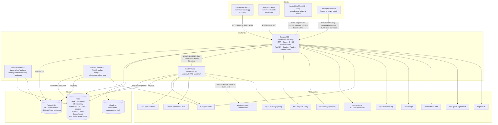

Traffic facts worth carrying: mobile clients send **no** `Origin` header and are exempt from CSRF; the admin SPA is the only browser client and depends on same-origin cookies; Express is the **primary but not the only** caller of FastAPI, and the HMAC gate is **not universal** — the `/ai/*` and `/agripredict/predict` calls are HMAC-signed over `${ts}.${METHOD}.${path-without-query}.${sha256(body)}`, but the mandi `POST /agripredict/sync/trigger` cron and boot-seed traffic (~125 plain unsigned `fetch` POSTs/day, `backend/src/server.js:177-184` — a bare `fetch`, no signing) and the `GET ${API}/crops` fan-out to `GET /agripredict/filters/commodities` (`backend/src/routes/market.routes.js:113-124`, also unsigned) are not; and `frontend/scripts/seedMandiData.js:65-70` is a second, non-Express caller checked into the repo. This document states the same thing correctly in §3.3 and Part 4 — the qualifier belongs here too; Railway private networking is IPv6-only, which is why Redis clients are created with `family: 0`.

---

## Request lifecycle walkthroughs

### A. Mobile add-to-cart — Express-only path

`POST /api/v1/agristore/cart` with `{ listingId, quantity: 2 }` from the farmer app.

| # | Layer | File | What happens |
|---|---|---|---|
| 1 | Screen | `frontend/src/screens/AgriStore/ProductDetail.js` | Calls `shopClient` → `api.post('/agristore/cart', …)`. Errors are mapped through `shopUtils.js`'s commerce error taxonomy, not raw server strings. |
| 2 | Shared axios | `shared/services/api.js:88-179` | `api` instance, 15 s timeout, `baseURL` resolved `EXPO_PUBLIC_API_BASE_URL` → `__DEV__` Metro host `:3001` → hardcoded Railway prod URL. Request interceptors attach `Authorization: Bearer <SecureStore token>`; on web only, add `X-Auth-Transport: cookie`, `withCredentials`, and echo the JS-readable `csrf` cookie as `X-CSRF-Token`. This URL is **not** in the `Idempotency-Key` list (that covers `/farms`, `/cycles`, `/animals`, `/agristore/orders`). |
| 3 | Edge | Railway LB | Keep-alive; Express sets `keepAliveTimeout 65 s` so it always exceeds the LB's 60 s idle timeout (`backend/src/server.js:56-58`). |
| 4 | Async safety | `backend/src/app.js:27` | `installAsyncRouteSafety()` has already patched `Layer.prototype.handle_request`, so a rejected promise anywhere below becomes `next(err)` while preserving `fn.length`. |
| 5 | Pre-router chain | `backend/src/app.js:80-351` | `disable('etag')` → `trust proxy` → request-id (`req.id`) → helmet (CSP `img-src` widened for the admin SPA) → CORS (no Origin ⇒ allow) → compression → morgan → **body parser 100 kb** (this prefix is not one of the raised-limit prefixes) → health probes (already passed) → admin static (not matched) → global per-IP limiter 200/15 min → CSRF (skipped: no `rt` cookie) → maintenance mode (reads `app.maintenanceMode` directly with a 5 s cache; fails open). |
| 6 | Mount | `backend/src/app.js:367` | `app.use(\`${API}/agristore\`, shopMetricsMiddleware('shop'), agristoreRoutes)` — the metrics wrapper times on `res.finish`, so validation rejections and 404s are timed too, labelled by route **template** only (never ids). |
| 7 | Route guards | `backend/src/routes/agristore.routes.js` | `router.param(id, uuidParamGuard)` rejects a malformed UUID with 400 before Prisma; `authenticate` runs next. |
| 8 | `authenticate` | `backend/src/middleware/auth.js` | Strict `^Bearer (\S+)$` → `verifyAccessToken` (HS256, issuer `krushisarva-backend`, audience `krushisarva-mobile`) → **Redis GET** on the `jti` denylist (fail-open) → **Prisma `user.findUnique`** for `{isActive, tokenVersion}` (fail-closed) → `req.user = {id, role}`, `req.auth = {jti, exp}`. This pair of reads is the highest-volume operation in the system; there is no per-request user cache. |
| 9 | Validation | `express-validator` + `middleware/validate.js` | `quantity` 1..100; failures become a 400 whose message is `field: msg` joined by `; `. |
| 10 | Handler | `agristore.routes.js:966-1017` | Opens `prisma.$transaction(..., { isolationLevel: 'Serializable' })` wrapped in `withSerializableRetry` (retries only 40001 / 40P01 / P2034 with jittered backoff). Inside: re-read the `SellerListing`, check `status`, `minOrderQty`, `stockQty`; call `evaluateSaleEligibility()` (5 batched queries regardless of cart size) — a refusal returns **409** with a machine-readable `reason` from `{SALE_BLOCKED, PRODUCT_RECALLED, COMPLIANCE_NOT_APPROVED, SELLER_UNLICENSED, SELLER_LICENCE_EXPIRED, BATCH_REQUIRED, SHELF_LIFE_TOO_SHORT, EXPIRED_STOCK}`; then `cartItem.upsert` on `@@unique([userId, listingId])`. |
| 11 | Metrics | `services/shopMetrics.service.js` | `recordEvent(CART_ADD_OK)` or `CART_ADD_FAIL` / `CART_ADD_BLOCKED_COMPLIANCE` / `OUT_OF_STOCK_HIT`; a serialization conflict increments `INVENTORY_CONFLICT` through the observer injected at `server.js:298`. |
| 12 | Response | `backend/src/utils/response.js` | `sendCreated(res, item)` → `{ success: true, data }`. `serializeDecimals()` walks the payload in place and converts every `Prisma.Decimal` to a JS number **at the boundary only** — money stays exact in the DB and in server arithmetic. |
| 13 | Error path | `backend/src/app.js:414-426` | A thrown error is logged with `{requestId, path}`, answered with `err.expose ? err.message : 'Internal server error'`, and persisted to `ErrorLog` **only when status ≥ 500**. |
| 14 | Client | `shared/services/api.js:181-271` | A 401 triggers exactly one deduped refresh across both axios instances (`isRefreshing` + `failedQueue`) and one replay. Everything else gets `error.userMessage` from `safeErrorMessage()`, which forwards the server's own text only for 402 and 429. |

### B. Crop scan — the path that crosses into FastAPI

`POST /api/v1/ai/scan/submit` with 1-5 base64 images, then polling `GET /api/v1/ai/scan/job/:jobId`.

The hard part of this flow is not any single step — it is that **the credit hold outlives the
process that took it**. Submit and poll routinely land on different Express replicas, the
in-process `pendingScans` Map is not shared, and the only thing that connects them is Redis. The
table below is the authoritative step list; this diagram is the ordering the table cannot show:

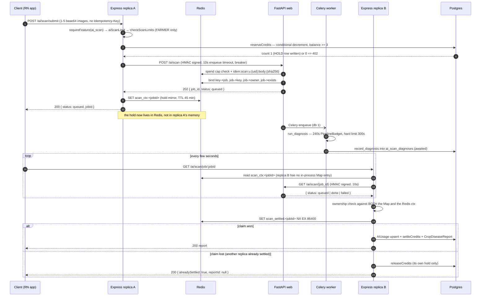

| # | Layer | File | What happens |
|---|---|---|---|
| 1 | Screen | `frontend/src/screens/AI/CropScanScreen.js` → `frontend/src/services/aiApi.js:134-236` | Compresses each image with `mediaCompressor` (1024 px, JPEG q0.6, fallback 800 px/q0.5), normalises MIME (HEIC/HEIF → `image/jpeg`), and POSTs **JSON base64** (not multipart — RN New Architecture drops `file://` URIs in `FormData`). **No `Idempotency-Key` is sent on this path.** `scanCropImage` posts `/ai/scan/submit` with only a `{ timeout: SUBMIT_TIMEOUT_MS }` override (`frontend/src/services/aiApi.js:166-170`) — it calls `newIdemKey()` at `:49`, `:346` and `:418` but *not* here — and the shared axios interceptor's `needsIdem` allowlist covers only `/farms`, `/cycles`, `/animals` and `/agristore/orders` (`shared/services/api.js:159-176`), none of which match. Express therefore forwards `idempotencyKey: undefined` and FastAPI **always** falls back to the canonical-body-hash key `idem:scan:u:{uid}:body:{sha256}`, never the header key. That changes the dedup semantics steps 6 and 8 depend on in both directions: two *deliberate* scans of an identical image with identical params collapse into one job, while a genuine retry whose image was re-compressed (a different byte stream) does not dedup at all. |
| 2 | Body parser | `backend/src/app.js:199` | `/api/v1/ai/scan/submit` has its own `express.json({ limit: '50mb' })` mount, ahead of the global 100 kb parser. |
| 3 | Gates | `backend/src/routes/ai.routes.js` | `requireFeature('ai_scan')` (503 with the admin's `disabledReason`, **before** any charge) → `aiScanLimit` (Redis-only sliding window, 100/60 s/user, **fails closed with 503 in production**) → `checkScanLimits()` free-tier daily caps read from `AIUsage` — **only when `req.user.role === 'FARMER'`** (`backend/src/routes/ai.routes.js:1630-1639`), so SELLER, VERIFIED_FARMER and ADMIN accounts skip the free-tier daily cap entirely and go straight to the reserve; and the call is wrapped in a `try/catch` that logs `limit check failed (non-fatal)` and continues, so a DB error on that read silently drops the cap too → `reserveCredits(userId, 'ai_scan_gemini')`. |
| 4 | Credit hold | `backend/src/services/aiCredit.service.js` | `reserveCredits` is a single conditional decrement: `prisma.aICredit.updateMany({ where: { userId, balance: { gte: 3 } }, data: { balance: -3, lifetimeSpent: +3 } })`. `count === 0` ⇒ **402**. A `HOLD` row is written to `AICreditTransaction`. This is the only race-free gate in the ledger. |
| 5 | Context | `ai.routes.js` | Weather is best-effort: `Promise.race([getWeatherData(pincode), 2.5 s])`. Three `getSetting` reads in parallel pick `ai.model.diagnose`, `ai.model.treatment`, `ai.diagnose.ensemble`. `_scanNumericParams` **omits** absent numerics rather than sending `null` (the prompt renders `params.get(k,'?')`, and a `null` printed "Affected Area: None%"). |
| 6 | Signed call | `backend/src/utils/fastapi-signed.js` | `POST ${AI_BACKEND_URL}/ai/scan` with `X-Sig-Timestamp` + `X-Sig-Signature = hex(HMAC-SHA256(AI_SHARED_SECRET, "${ts}.POST.${path}.${sha256(body)}"))`, path **without** query string, plus optional `x-user-id`, `x-request-id`, `Idempotency-Key`. Wrapped in `fastapiBreaker()` (130 s backstop, 0.5 failure rate, volume 5, 30 s reset); `httpFailure` counts only 5xx/network/missing-status so a 402 spend-cap never trips it. 10 s timeout for the enqueue. |
| 7 | FastAPI ingress | `fastapi/main.py:186-237`, `fastapi/security/auth.py:101-150` | Request-context middleware stamps `request_id_var`/`user_id_var`; the 12 MB body guard runs; CORS; SlowAPI. `verify_signed_request` checks headers → integer ts → **30 s** skew → `hmac.compare_digest` → a Redis `SET sig:<signature> NX EX skew` single-use nonce for non-GET methods. |
| 8 | Enqueue | `fastapi/routes/scan.py:148-236` | Per-user daily USD cap (`spend:{YYYYMMDD}:{uid}`, $1.00; fails **closed** if `SPEND_CAP_REQUIRE_REDIS` and Redis is down) → idempotency lookup keyed `idem:scan:u:{uid}:hdr:{key}` or `…:body:{sha256(canonical body incl. image content hashes)}` → an existing non-failed job is reused → otherwise `enqueue_diagnosis` binds key→job, job→key, job→owner, job→exists in Redis and returns `{job_id, status:"queued"}`. |
| 9 | Express bookkeeping | `ai.routes.js` | Mirrors the credit hold into Redis `scan_ctx:<jobId>` (TTL 45 min) because `pendingScans` is a module-scope `Map` on **one** replica; kicks off parallel Cloudinary uploads fire-and-forget; returns `200 { status:'queued', jobId }`. |
| 10 | Worker | `fastapi/jobs/tasks.py:119-192` | Celery (`acks_late`, `max_retries=0`, hard limit 300 s / soft 270 s) materialises the base64 to a temp file, re-validates the 8 MB cap, then `asyncio.run(run_diagnosis(params, images))`. |
| 11 | Pipeline | `fastapi/orchestrator.py` | 240 s `PipelineBudget`: tier resolve → coords + image-quality ‖ weather → rule-based weather risk ($0) → quality gate → **Stage 3 single-model Gemini vision diagnose** (180 s cap, 2 attempts at temperatures 0.0/0.5, **no cross-model fallback**) → `service_unavailable` short-circuit → conditional ensemble + reconciler (off by default) → HSV visual audit → `cross_verify` confidence caps and penalties → treatment agent (RAG-grounded; skips the LLM entirely for ~97% of ballot pairs) → `validate_treatment` safety gate → template report → **awaited** `record_diagnosis` into `ai_scan_diagnoses`. |
| 12 | Poll | `GET /api/v1/ai/scan/job/:jobId` | Express calls the signed `GET /ai/scan/{job_id}` (10 s), then checks ownership against **both** the in-process Map and the Redis ctx **before** either terminal branch, because a stranger polling a known jobId previously stranded the owner's hold. |
| 13 | Finalise | `ai.routes.js:1871-2007` (`_persistDoneScan`) | Non-result check first (`report_id ∈ {needs_rescan, service_unavailable}` ⇒ release the hold, **no charge, no `CropDiseaseReport` row**) → `SET scan_settled:<jobId> NX EX 86400` claim (loser releases its own hold and returns `alreadySettled`) → `AIUsage` upsert → `settleCredits` (actual = `max(floor 3, ceil(tokens / ai.tokensPerCredit))`) → wait ≤10 s for Cloudinary URLs → write `CropDiseaseReport` with `fullReport: raw`. |
| 14 | Sweeper | `ai.routes.js:1520-1554` | Every 5 min, leader-locked, `SCAN scan_ctx:*` and refund holds older than 30 min. The Redis key TTL is 45 min precisely so the 30-min sweep can still *find* an abandoned hold. |
| 15 | Client | `aiApi.js:200-212` | Polls on the **200 s** `aiApi` instance (1.5 s initial delay, 2 s interval, 300 s ceiling) — the 15 s default previously aborted the poll that also runs the finaliser, producing a charged scan with `reportId: null`. |

Failure symmetry worth memorising: **every** failure path releases the credit hold before answering, so a FastAPI outage is free for the farmer; and the only two ways a scan is charged are `settleCredits` under the `scan_settled` claim or the legacy `deductCredits` when Redis was unavailable at both submit and poll. Walkthrough C below walks each of those failure paths individually.

### C. Crop scan when FastAPI or the Celery worker is unavailable

Walkthrough B is the happy path. This is the one an operator is actually paged about, and
answering it from the rest of the document requires assembling five separated passages: the
happy-path table above, the client-visible error mapping (§3.3.3.7), the circuit breaker
(§1.9), the refund policy (§3.3.2.7) and the abandoned-hold sweep (§3.3.4.6). It is assembled
here once. **The invariant that holds across every row: the farmer is never charged.** What
differs is *how long the hold is held* and *what the farmer sees*.

| Failure point | What Express does | What the farmer sees | Credit outcome | Observable signal |
|---|---|---|---|---|
| **1. Enqueue 5xx / network / timeout** (FastAPI web down, 10 s enqueue timeout) | `fastapiBreaker()` counts it (`httpFailure` counts 5xx/network/missing-status only); the catch path calls `releaseCredits` before answering | 503 with the scan-specific copy | **Released immediately.** No charge, no `CropDiseaseReport`, no `AIUsage` row | Breaker failure count rising; `[ALERT]`-marked `logger.error` |
| **2. Breaker OPEN** (≥5 calls in the window, ≥50 % failing) | The call is not attempted at all for 30 s; the reserve has already happened, so the same release path runs | 503, same copy, but returned in milliseconds | **Released immediately** | Breaker state OPEN; a burst of instant 503s with no upstream latency |
| **3. Enqueue OK, but no `ROLE=worker` Celery service exists** | Nothing fails. FastAPI accepted the job and bound `owner:scan:job:` / `exists:scan:job:`; the poll returns `queued` forever | The client polls at 2 s intervals up to its **300 s** ceiling, then abandons with a timeout message. The scan simply never completes | **Held for up to 30 minutes**, then refunded by the leader-locked `scan_ctx:*` sweeper (every 5 min, refunds holds older than 30 min; the Redis key's 45 min TTL exists so the 30-min sweep can still *find* it) | This is the quiet one: **no error is logged anywhere**, because nothing failed. Detect it by `exists:scan:job:*` keys accumulating with no matching completion, by Celery queue depth on Redis db 1 growing monotonically, or by `AIUsage.scanCount` flat while `AICreditTransaction` HOLD rows accumulate. Part 7 states the precondition — "**without it every scan stays `queued`**" — but the consequence chain ends here. |
| **4. FastAPI dies *between* a successful submit and the poll** | Submit returned `200 {status:'queued', jobId}` and the hold is already mirrored into `scan_ctx:<jobId>`. Every subsequent poll gets a 5xx/timeout from the signed `GET /ai/scan/{job_id}` | Poll errors surface as a retryable failure; the client keeps polling until its 300 s ceiling | **Held until the sweeper**, same 30-min path as row 3 — the poll never reaches `_persistDoneScan`, so nothing settles and nothing releases early | Poll-path 5xx rate; breaker may trip on the *poll* calls independently of the enqueue calls |
| **5. Worker runs but the pipeline reports `service_unavailable`** (Gemini outage — Stage 3 has **no cross-model fallback** by design) | `_persistDoneScan` runs its non-result check **first**: `report_id ∈ {needs_rescan, service_unavailable}` ⇒ release the hold and return | A dedicated "try again shortly" message, not a report | **Released on the poll that observes it.** No charge, **no `CropDiseaseReport` row at all** | `ai_scan_diagnoses` rows with the sentinel; Gemini error rate |
| **6. Worker hard-kills at the 300 s Celery limit** (soft 270 s, `max_retries=0`) | The job ends `failed`; the poll's failure branch releases the hold | Failure message | **Released on the poll** | Celery hard-limit kills; pipeline durations pressing the 240 s `PipelineBudget` |
| **7. Redis is down at submit** | The `scan_ctx:<jobId>` mirror never gets written. The hold exists only in replica A's in-process `pendingScans` Map | Normal queued response | **Recoverable only if the poll lands on replica A.** If it lands elsewhere, the ownership check fails and the legacy `deductCredits` fallthrough applies — this is one of the only two ways a scan is charged | Redis connectivity alarms; `alreadySettled`/ownership-mismatch responses |
| **8. Redis is down at *both* submit and poll** | Neither the ctx mirror nor the `scan_settled:<jobId>` NX claim is available | Report is returned normally | **Charged via the legacy `deductCredits` path** — the documented exception to "every failure is free" | The one case worth alerting on: a charge with no `scan_settled` key |

**Why row 3 is the most likely of these in practice.** Rows 1, 2, 5 and 6 are loud — they
produce errors, breaker state changes and log lines. Row 3 produces none: the platform is
"up", the API returns 200, and the only symptom is that scans never finish. Verifying that a
second Railway service with `ROLE=worker` exists is a dashboard fact this repository cannot
prove (Appendix B.7), so it is the first thing to check when scans queue forever.

### D. Online checkout — initiate → pay → confirm, and its two alternate terminators

The highest-money-risk flow in the system has no walkthrough elsewhere; it exists only as
ASCII pseudo-code in §3.2.2. This is the layered view, in the same format as A and B. The
sequence diagram in §3.2.2 shows the three-channel race; this shows what each layer does.

| # | Layer | File | What happens |
|---|---|---|---|
| 1 | Screen | `frontend/src/screens/.../Checkout` | The checkout screen sets its **own** `Idempotency-Key` so a user-driven retry resolves to the same order. This is one of the four allowlisted prefixes in the shared interceptor (`/agristore/orders`), so even a caller that forgets gets one generated. |
| 2 | Quote | `services/shopPricing.service.js` | The server prices the cart. **The client's number is never trusted**: `assertClientTotalMatches` and `assertCartMatchesQuote` run on every path, and `quoteFingerprint` is frozen onto `PaymentIntent.cartHash`. The delivery fee once lived in the mobile app — the farmer approved ₹1,048 and was charged ₹999. |
| 3 | Gateway order | `services/payment.service.js` behind `razorpayBreaker` | `createPaymentOrder(quote.totalPaise, 'INR', receipt)`. Money is integer **paise** at the gateway, `Decimal` in the DB, a JS number only at the HTTP boundary. |
| 4 | Intent | `services/shopPayment.service.js:55-73` | `PaymentIntent` is written `CREATED` **before** the gateway id is handed to the app, so a client that crashes mid-flow still leaves a reconcilable record. |
| 5 | Stock hold | `services/stockReservation.service.js` inside a Serializable tx | `holdStock`: decrement `seller_listings.stockQty`, write `HELD` rows with `expiresAt`. Failure ⇒ `markIntentFailed` + 409 "an item just sold out" — **nothing is charged**, the gateway order is orphaned. |
| 6 | Payment | Razorpay sheet | Out of our process entirely. Everything after this point is a race. |
| 7 | **Terminator A — client confirm** | `agristore.routes.js` `/orders/confirm` | `verifyPaymentSignature` (regex-guarded before `timingSafeEqual`, so a malformed signature returns false rather than throwing) → object-level authz (`intent.userId === req.user.id`) → Serializable tx: revalidate cart against the quote, `order.create({ paymentRef, paymentStatus:'paid' })`, `consumeReservations` (`HELD → CONSUMED`, guarded on `status:'HELD'`), clear the cart. |
| 8 | **Terminator B — webhook** | `shopWebhooks.routes.js` | HMAC over the **raw bytes** (`app.js` raw parser at app level — re-serialised JSON does not reproduce what was signed), **fails closed** with no `RAZORPAY_WEBHOOK_SECRET`, claims `eventId` (`@unique`) **before** doing any work. It calls `markIntentPaid` and **never creates an order**: the cart may have changed, stock may have sold, and there is no delivery address in the payload. |
| 9 | **Terminator C — reconciler** | `shopPayment.service.js:230-275`, cron every 10 min, leader-locked | Sweeps `CREATED`/`PENDING`/`PAID` intents, asks Razorpay for the truth, and applies `markIntentPaid` / `attachOrderToIntent` / `markIntentFailed` / `EXPIRED` (no payment attempt + older than `INTENT_EXPIRY_MINUTES = 30`). It is also what repairs the `ORDER_CREATED → PAID` regression a redelivered webhook can cause. |
| 10 | Convergence | `orders.paymentRef @unique`, `payment_intents.orderId @unique` | The **database**, not application code, serialises the three terminators. Every loser gets `P2002` and returns the winner's order at **200**, not an error. |
| 11 | Abandonment | `shop-reservation-sweep` cron, every 2 min, leader-locked | `HELD` rows past `expiresAt` become `EXPIRED` and the units return to `stockQty`. A buyer who closes the sheet costs the seller at most one sweep interval of stock. |
| 12 | Failure copy | client | `safeErrorMessage()` forwards the server's own text only for **402** and **429**; everything else gets generic copy. A 409 `CART_CHANGED` or `INVENTORY_CONFLICT` therefore needs its own client-side handling to be intelligible. |

**COD differs at exactly one point**: there is no gateway order, no intent and no signature —
which is why the missing `Idempotency-Key` on `/agristore/orders` was, before it was
allowlisted, a live double-order bug for cash on delivery while the online path was
accidentally protected by `orders.paymentRef @unique`.

---

## 1. Platform & Runtime

> **Canonical home for**: process topology and boot/shutdown order, the Express middleware chain and body-parser limits, the complete environment-variable table, the auth token mechanics, rate limiting and abuse control, idempotency and concurrency primitives, caching layers and invalidation, background jobs and cron, circuit breakers, Socket.IO, observability, and the shared response envelope.
> **Defers to**: Part 2 for column types and indexes; Part 3.1 for the auth *endpoints*; Part 3.4 for admin RBAC *policy*; Part 7 for how any of this is deployed.

### Backend platform layer (Express)

Runtime: Node ≥18 (`backend/package.json:82-84`), ESM (`"type": "module"`), Express 4.18, Prisma 5.10 → PostgreSQL, ioredis 5.3, BullMQ 5.78, socket.io 4.7. Entry points: `backend/src/server.js` (web) and `backend/src/worker.js` (queue-only). `backend/src/app.js` exports the bare Express app (no listener), which is what the supertest suites import.

#### 1.1 Process topology

| Process | Script | What it boots | Notes |
|---|---|---|---|
| Web | `npm start` → `node src/server.js`; prod `npm run start:prod` (`prisma db push --skip-generate` first) | HTTP server, Socket.IO, cron schedules, optional in-process BullMQ workers | `backend/package.json:9-11` |
| Worker | `npm run worker` → `node src/worker.js` | BullMQ workers only — no HTTP listener, no cron | `backend/src/worker.js:17` |
| Container | `Dockerfile` CMD `sh -c "timeout 60 npx prisma db push --skip-generate; node src/server.js"` | Two-stage image: stage 1 builds `admin/dist` (Vite, `VITE_API_URL=/api/v1`), stage 2 runs the backend and serves the SPA same-origin | `Dockerfile:48`; `ADMIN_DIST_DIR=/app/admin/dist` |
| Platform | `railway.json` | `healthcheckPath: /healthz`, `healthcheckTimeout: 300`, `restartPolicyType: ON_FAILURE`, max 3 retries | `railway.json:6-12` |

There is **no clustering** — no `cluster`/PM2 fork logic anywhere in `src/`. Horizontal scale is instance-level (Railway replicas), which is why nearly every coordination primitive is Redis-backed (leader lock, rate limits, idempotency, Socket.IO adapter) and why the in-process fallbacks are all documented as "per-instance".

##### Web boot sequence (`backend/src/server.js`)

1. `src/config/env.js` is imported transitively and **can throw at import time** (missing `DATABASE_URL`/`JWT_SECRET`/`FIELD_ENCRYPTION_KEY`, or a prod config problem) — the process dies before any listener exists.
2. Optional-key warnings for `MSG91_AUTH_KEY`, `CLOUDINARY_CLOUD_NAME`, `GEMINI_API_KEY`, `SARVAM_API_KEY`, `DATA_GOV_API_KEY` (`server.js:32-43`).
3. HTTP server timeouts set **before** listen (`server.js:56-58`): `timeout=30_000`, `keepAliveTimeout=65_000`, `headersTimeout=70_000`. Comment states keepAlive must exceed the Railway 60 s LB idle timeout to avoid 502s on keep-alive races.
4. Socket.IO constructed with a CORS callback and `transports: ['websocket','polling']` (`server.js:64-80`).
5. **Redis adapter attach is a top-level `await` with a hard 5 s race** (`server.js:96-99`). The comment is explicit that without the race a hanging Redis at boot blocks ESM module evaluation, so `listen` never runs and the deploy healthcheck fails with no logs. On failure both clients are disconnected and the in-memory adapter is used; the fallback is logged at `info` (not `warn`) because `logger.warn` is suppressed in production.
6. `registerChatSocket(io)`, then `app.set('io', io)` so HTTP handlers can broadcast via `req.app.get('io')`.
7. `start()` — **`httpServer.listen` runs FIRST** (`server.js:126`); every dependency below it is attached after listen and non-blocking so a slow Redis can never fail the healthcheck:
   - `prisma.$connect()` (non-fatal; queries connect lazily anyway)
   - `seedDefaultFlags()` (upserts 10 + AI feature flags, `featureFlag.service.js:96-104`)
   - `redis.connect()` in the background
   - `initFlagInvalidationSubscriber()` (dedicated `redis.duplicate()` subscriber on `featureflags:invalidate`)
   - `startWorkers()` **iff** `ENV.QUEUE_ENABLED && ENV.QUEUE_INPROCESS_WORKER`
   - cache warm + all cron registrations (§1.8 Background jobs)
   - `setSerializableConflictObserver(() => recordEvent(SHOP_EVENTS.INVENTORY_CONFLICT))` (`server.js:298`) — dependency injection so `utils/txRetry.js` keeps zero service imports.
   - One `await` remains in `start()`: `prisma.mandiPrice.count()` at `server.js:190`, used to decide the leader-locked startup seed. It is after `listen`, so it delays cron registration but not readiness.
8. `httpServer.on('error')` → `process.exit(1)` on `EADDRINUSE`, rethrow otherwise.

##### Graceful shutdown

| Process | Signals | Sequence | Force-exit |
|---|---|---|---|
| Web (`server.js:406-432`) | SIGTERM, SIGINT | `httpServer.close(cb)` → `stopWorkers(inProcessWorkers)` → `closeQueues()` → `closeProducerConnection()` → `beginRedisShutdown()` → settle(`stopFlagInvalidationSubscriber`, `prisma.$disconnect`, `redis.quit`) → `exit(0)` | 10 s unref'd timer → `exit(1)` |
| Worker (`worker.js:20-36`) | SIGTERM, SIGINT (re-entrancy guarded by `shuttingDown`) | `stopWorkers(workers)` → settle(`prisma.$disconnect`, `closeProducerConnection`) → `exit(0)` | 15 s unref'd timer → `exit(1)` |

`beginRedisShutdown()` suppresses the `[ALERT][Redis]` outage log for the intentional close (`config/redis.js:65-67`). Note the web shutdown does **not** call `io.close()` and does **not** guard re-entrancy the way the worker does. `unhandledRejection` is logged and deliberately **not** fatal in either process (`server.js:437-441`, `worker.js:37-38`).

#### 1.2 HTTP middleware chain, in mount order (`backend/src/app.js`)

| # | Line | Layer | Effect / what it rejects |
|---|---|---|---|
| 0 | 27 | `installAsyncRouteSafety()` | Monkey-patches `Layer.prototype.handle_request` so a rejected promise from any handler becomes `next(err)`. Lazily wraps `layer.handle` on first dispatch, preserving `fn.length` (Express branches on arity — a 4-arg error handler must stay 4-arg). Idempotent. If the handler already responded, it logs instead of double-writing headers. |
| 1 | 80 | `app.disable('etag')` | No conditional GET; a 304 + empty body trips axios' default `validateStatus`. |
| 2 | 90 | `app.set('trust proxy', ENV.TRUST_PROXY)` | Default `1` hop in prod, `'loopback'` otherwise. Must precede the rate limiter — it is what makes `req.ip` unspoofable and the per-IP bucket real. |
| 3 | 93-97 | Request-ID | `req.id = req.headers['x-request-id'] \|\| crypto.randomUUID()`; echoed as `x-request-id` response header. Client-supplied ids are trusted verbatim (no validation). |
| 4 | 107-114 | `helmet()` | Defaults, with CSP `img-src 'self' data: blob: https:` widened so the admin SPA can render Cloudinary/seed images. `script-src 'self'` untouched. |
| 5 | 133-167 | `cors()` | No Origin → allow (RN/mobile/curl). Origin in `SELF_ORIGINS` (`https://$RAILWAY_PUBLIC_DOMAIN`, `https://$RAILWAY_STATIC_URL`) → allow. Dev + loopback regex → allow. Else enforce `ENV.ALLOWED_ORIGINS`; empty list → allow in dev, **reject in prod** (rejection surfaces as a 500 from the cors error). `credentials: true`, `maxAge: ENV.CORS_MAX_AGE` (600 s). |
| 6 | 170 | `compression()` | Defaults. |
| 7 | 178-179 | `morgan` (`dev` / `tiny`) | Registered **before** body parsers on purpose: body-parser's 413/400 `next(err)` skips every not-yet-run non-error middleware, so a later morgan would never see rejected multipart requests. |
| 8 | 197-214 | Body parsers (table below) | — |
| 9 | 226-293 | `/healthz`, `/health`, `/readyz` | Mounted **before** the rate limiter so LB probes are never throttled. |
| 10 | 306-322 | Admin SPA static | Only when `${ADMIN_DIST_DIR}/index.html` exists. `express.static(dir, {index:false, maxAge:'1y'})` + SPA fallback on `/admin` and `/admin/*` with `Cache-Control: no-cache` on the shell. Mounted before the limiter/CSRF/body parsers so hashed-asset GETs aren't throttled or parsed. `/admin` (SPA) is disjoint from `/api/v1/admin` (API). |
| 11 | 330-340 | Global per-IP `rateLimiter` | Only when `ENV.RATE_LIMIT_ENABLED`. `prefix: 'global:ip'`, `key: clientIp`, `ENV.RATE_LIMIT_MAX` (200) per `ENV.RATE_LIMIT_WINDOW_MS` (900 000 ms). 429 with `Retry-After`. |
| 12 | 345 | `csrfProtection` | Double-submit; see §1.4 Authentication & authorization. |
| 13 | 351 | `maintenanceMode` | 503 `{maintenance:true}` when the `app.maintenanceMode` AppSetting is on. |
| 14 | 354-407 | Route table | See mount-order notes below. |
| 15 | 410 | 404 | `sendError(res, "Route ${method} ${path} not found", 404)`. |
| 16 | 414-426 | Global error handler | Logs `{err, requestId, path}`; responds `err.expose ? err.message : 'Internal server error'` at `err.status \|\| 500`; then fire-and-forget `persistErrorLog`. |

##### Body-parser limits per prefix

| Mount | Parser | Limit | Line |
|---|---|---|---|
| `/api/v1/upload` | `express.json` (multipart-skipped) | 10 mb | 197 |
| `/api/v1/ai/scan/submit` | `express.json` | 50 mb (up to 5 × ~8 MB base64 images) | 199 |
| `/api/v1/ai/chat` | `express.json` | 12 mb (one base64 attachment) | 202 |
| `/api/v1/ai/soil-card-ocr` | `express.json` | 12 mb (Soil Health Card OCR photo) | 205 |
| `/api/v1/shop-webhooks` | `express.raw({type:'*/*'})` **+ the router itself** | 256 kb | 211 |
| everything else | `express.json` / `express.urlencoded({extended:true})` | 100 kb each | 213-214 |

`skipMultipart(mw)` (`app.js:189-194`) short-circuits any request whose `content-type` starts with `multipart/` so multer owns the stream — otherwise body-parser 413s a multipart upload before the route or morgan sees it. The webhook raw parser is mounted at app level (not inside the router) because by router-dispatch time the stream is already consumed; the HMAC must be computed over the exact bytes Razorpay sent.

Multer limits live in `config/cloudinary.js`, not app.js: `createUploader(maxFiles=5)` 15 MB/file images only; `createAvatarUploader()` 5 MB, `.any()` field name; `createVideoUploader()` 100 MB, mp4/mov/avi/quicktime/x-msvideo.

##### Route mount-order hazards (deliberate, documented in-file)

- `/api/v1/agristore/seller-compliance` mounts **before** `/api/v1/agristore` (`app.js:362`) so the specific prefix wins.
- `/api/v1/agristore` is wrapped by `shopMetricsMiddleware('shop')` at mount level so validation rejections and 404s are timed too (`app.js:367`).
- `/api/v1/admin/incidents`, `/admin/fraud`, `/admin/moderation`, then `featuresRoutes` at `/admin`, then `adminRoutes` at `/admin` (`app.js:384-401`) — the specific routers must win; the general admin router fills disjoint sub-paths.
- `farmCropCycleRoutes` mounts at the bare `${API}` prefix (`app.js:407`) and internally owns `/farms/:farmId/cycles` + `/cycles/:cycleId`, so it overlaps the `/farms` mount by design.

#### 1.3 Environment configuration (`backend/src/config/env.js`, 516 lines)

**Hard-required — the process refuses to start without them (any environment):**

| Var | Validation | Failure mode |
|---|---|---|
| `DATABASE_URL` | `required()` — non-empty | throw `Missing required env variable: DATABASE_URL` |
| `JWT_SECRET` | `required()` + **≥ 32 chars** (HS256) | throw at import |
| `FIELD_ENCRYPTION_KEY` | present **and** `/^[0-9a-fA-F]{64}$/` (AES-256) | throw. Rationale in-file: without it `encrypt()` silently writes Aadhaar/PAN/bank in plaintext, so booting degraded is the bug |

**Production-only fatal validation (`env.js:504-516`), thrown as `FATAL: production config invalid — …`:** `OTP_DEV_BYPASS_ENABLED==='true'` is refused; `AI_SHARED_SECRET` missing or `< 16` chars is refused (an empty key means the Express↔FastAPI HMAC is over an empty secret ⇒ FastAPI is effectively unauthenticated); `GEMINI_API_KEY` and `SARVAM_API_KEY` must be non-empty.

**Full variable table** (default → what breaks without it):

| Var | Default | Consumer / effect if unset |
|---|---|---|
| `NODE_ENV` | `development` | Drives `IS_DEV`, `TRUST_PROXY`, `RATE_LIMIT_FAIL_CLOSED`, `RATE_LIMIT_ENABLED`, `CACHE_WARMING_ENABLED`, all fraud master switches, cookie `secure`, logger verbosity |
| `PORT` | `3000` | listen port |
| `API_PREFIX` | `/api/v1` | every route mount + the refresh-cookie `path` scope |
| `REDIS_URL` | `redis://localhost:6379` | shared cache client, BullMQ connections, Socket.IO adapter. Unreachable ⇒ everything degrades to per-instance fallbacks (see §1.5-§1.8) |
| `QUEUE_ENABLED` | `true` unless `'false'` | off ⇒ `enqueue()` always runs jobs inline on the request path |
| `QUEUE_INPROCESS_WORKER` | `true` unless `'false'` | off ⇒ web tier enqueues but never consumes; a separate `npm run worker` is required or the queue backs up |
| `QUEUE_CONCURRENCY` | `5` | per-worker BullMQ concurrency |
| `JWT_EXPIRES_IN` | `15m` | access-token TTL. In-file note: the old `7d` fallback silently issued 7-day admin tokens |
| `REFRESH_TOKEN_EXPIRES_DAYS` | `30` | declared in ENV; the actual refresh TTL used by `createRefreshToken` is the **idle** timeout, not this |
| `SESSION_IDLE_TIMEOUT_DAYS` | `7` | refresh-token `expiresAt` + refresh-cookie `maxAge` (sliding) |
| `SESSION_ABSOLUTE_TIMEOUT_DAYS` | `30` | hard session cap from first login, anchored via `sessionStartedAt` |
| `MAX_CONCURRENT_SESSIONS` | `5` | `enforceSessionLimit` evicts oldest lineages; `0` = unlimited |
| `SOCKET_MAX_CONN_PER_USER` | `10` | per-instance Socket.IO cap |
| `MSG91_AUTH_KEY` / `_TEMPLATE_ID` / `_SENDER_ID` | `''` / `''` / `FRMESY` | no SMS OTP delivery; also a precondition of the dev OTP bypass |
| `OTP_EXPIRE_MINUTES` / `OTP_MAX_ATTEMPTS` | `5` / `5` | OTP code lifetime / per-session attempts |
| `OTP_LOCK_THRESHOLD` | `5` | failures before a phone lock |
| `OTP_LOCK_BASE_SECONDS` / `OTP_LOCK_MAX_SECONDS` | `60` / `3600` | lock backoff `base × 2^(cycle-1)`, capped |
| `OTP_FAIL_WINDOW_SECONDS` | `900` | failure counter TTL |
| `OTP_LOCK_CYCLE_WINDOW_SECONDS` | `86400` | lock-cycle window driving exponential escalation |
| `CLOUDINARY_CLOUD_NAME` / `_API_KEY` / `_API_SECRET` | `''` | public uploads silently no-op (`uploadFiles` returns `[]`); **KYC uploads throw** rather than degrade |
| `GEMINI_API_KEY` / `GEMINI_MODEL` | `''` / `gemini-2.5-flash` | all LLM features. Prod-fatal if empty |
| `OPENAI_API_KEY`, `OPENWEATHER_API_KEY` | `''` | legacy/optional |
| `AI_VOICE_STT_MODEL`, `AI_VOICE_STT_API_KEY`, `VOICE_STT_MODEL` | `sarvam:saarika`, falls back to `SARVAM_API_KEY`, `sarvam:saarika` | retained for backwards-compat; comment states the voice route no longer uses them |
| `AI_BACKEND_URL` | `http://localhost:8001` | FastAPI base for signed calls + the AgriPredict cron triggers |
| `AI_SHARED_SECRET` | `''` | HMAC key for every Express→FastAPI call. Prod-fatal if `< 16` chars |
| `USE_FASTAPI_FOR_SCAN` | `false` | routes `/ai/scan` to FastAPI's agentic pipeline vs in-Express Gemini |
| `AI_TOKENS_PER_CREDIT` / `AI_FREE_MONTHLY_CREDITS` / `AI_MIN_CREDITS_PER_CALL` | `1000` / `100` / `1` | credit-metering policy |
| `SARVAM_API_KEY` | `''` | voice STT + TTS. Prod-fatal if empty |
| `DATA_GOV_API_KEY` | `''` | mandi market prices |
| `FIELD_ENCRYPTION_KEYS` | `{}` | comma-separated `id:hex64` rotation keys; id `0` reserved, duplicate/invalid ids throw |
| `FIELD_ENCRYPTION_ACTIVE_KEY_ID` | `0` | which key encrypts new data; an id not present in `FIELD_ENCRYPTION_KEYS` throws |
| `RAZORPAY_KEY_ID` / `_KEY_SECRET` | `''` | payments unavailable |
| `RAZORPAY_WEBHOOK_SECRET` | `''` | **fail-closed**: blank ⇒ every webhook is rejected |
| `ALLOWED_ORIGINS` | `[]` (comma-split) | browser origins blocked in prod, allowed in dev |
| `CORS_MAX_AGE` | `600` | preflight cache seconds |
| `TRUST_PROXY` | `1` in prod, `'loopback'` otherwise (`true`/`false`/int/string accepted) | over-trusting lets a client forge XFF and mint a fresh rate-limit bucket per request — i.e. silently disable the global limiter |
| `RATE_LIMIT_WINDOW_MS` / `RATE_LIMIT_MAX` | `900000` / `200` | global per-IP window |
| `RATE_LIMIT_ENABLED` | `NODE_ENV !== 'test'` | off ⇒ no baseline per-IP protection |
| `RATE_LIMIT_FAIL_CLOSED` | `NODE_ENV === 'production'` | when Redis is down, the AI cost limiters 503 instead of allowing unlimited requests fleet-wide |
| `CACHE_WARMING_ENABLED` | `NODE_ENV !== 'test'` | startup + `*/25 * * * *` warm |
| `CACHE_HIT_RATE_ALERT_THRESHOLD` / `REDIS_MEMORY_ALERT_PCT` | `0.5` / `85` | `[ALERT][Cache]` / `[ALERT][Redis][Memory]` thresholds |
| `OTP_RATE_LIMIT_WINDOW_MS` / `OTP_RATE_LIMIT_MAX` / `OTP_IP_RATE_LIMIT_MAX` | `3600000` / `5` / `50` | send-OTP per-phone and per-IP caps |
| `OTP_VERIFY_RATE_LIMIT_WINDOW_MS` / `_MAX` / `OTP_VERIFY_IP_RATE_LIMIT_MAX` | `60000` / `10` / `30` | verify-attempt rate; kept above the lockout threshold so 423 surfaces before 429 |
| `OTP_POW_SECRET` | `''` | **opt-in**; empty disables the proof-of-work gate entirely |
| `OTP_POW_DIFFICULTY` / `_SUSPICION_THRESHOLD` / `_CHALLENGE_TTL_MS` | `18` bits / `3` / `180000` | PoW tuning |
| `OTP_DEV_BYPASS_ENABLED` | unset | derived `ENV.OTP_DEV_BYPASS` requires **all three**: opt-in `'true'`, `NODE_ENV !== 'production'`, and empty `MSG91_AUTH_KEY`. Prod boot is refused if the opt-in is set |
| `VELOCITY_ENABLED` | `NODE_ENV !== 'test'` | master switch for FRAUD-1 |
| `VELOCITY_{ORDER,REFUND,LOGIN}_{WINDOW_SEC,FLAG,LIMIT,BLOCK}` | order `3600/6/12/true`, refund `86400/3/6/true`, login `3600/8/0/false` | per-action flag + block tiers |
| `REFUND_ABUSE_ENABLED` | `NODE_ENV !== 'test'` | master switch for FRAUD-2 |
| `REFUND_ABUSE_LOOKBACK_DAYS/FLAG_COUNT/FLAG_RATE/RESTRICT_COUNT/RESTRICT_RATE` | `90 / 3 / 0.5 / 5 / 0.7` | rate + minimum-count tiers (min count prevents a 1-order 100% false positive) |
| `DEVICE_FINGERPRINT_ENABLED`, `DEVICE_LINK_LOOKBACK_DAYS`, `DEVICE_LINK_FLAG_ACCOUNTS` | on outside test, `30`, `3` (min 2) | multi-account device clustering, flag-only |
| `GEO_ANOMALY_ENABLED`, `GEO_ANOMALY_MAX_SPEED_KMH/MIN_KM/LOOKBACK_DAYS/LOOKBACK_LOGINS` | on outside test, `900/500/90/20` | impossible-travel + new-country scoring; inert unless the optional offline `geoip-lite` is installed |
| `CONTENT_FRAUD_ENABLED`, `CONTENT_FRAUD_BURST_WINDOW_MIN/REVIEW_BURST_COUNT/LISTING_BURST_COUNT/NEW_ACCOUNT_DAYS/FLAG_SCORE` | on outside test, `60/5/5/3/2` | fake review/listing routing to the moderation queue |
| `PAYMENT_TAMPER_ALARM_ENABLED` | `NODE_ENV !== 'test'` | audit + deduped incident on a blocked amount/owner mismatch |

**Read directly from `process.env`, bypassing `ENV`:** `RAILWAY_PUBLIC_DOMAIN`, `RAILWAY_STATIC_URL`, `ADMIN_DIST_DIR` (`app.js:128,307`); `DB_CONNECTION_LIMIT`, `DB_POOL_TIMEOUT` (`config/db.js:31,34`); `OTP_DEV_BYPASS_ENABLED`, `FIELD_ENCRYPTION_KEYS`, `FIELD_ENCRYPTION_ACTIVE_KEY_ID`, `TRUST_PROXY` raw (`config/env.js`); `CHECKPOINT_DISABLE`, `PRISMA_HIDE_UPDATE_MESSAGE` (Dockerfile).

**Prisma pool sizing (`config/db.js:24-37`)** — appended to the URL as a string (not URL-reparsed, so passwords with special chars survive): `connection_limit = DB_CONNECTION_LIMIT || max(cpus*2+1, 20)`, `pool_timeout = DB_POOL_TIMEOUT || 20`. The in-file warning is the key scaling constraint: **total server-side connections = instances × connection_limit**, against a Postgres default `max_connections` of 100. Real 1000-connection fan-out needs PgBouncer (transaction mode) or Prisma Accelerate behind `DATABASE_URL`. Dev-only slow-query logging fires above 200 ms.

#### 1.4 Authentication & authorization

##### Token model

| Token | Type | Lifetime | Storage | Revocation |
|---|---|---|---|---|
| Access | JWT HS256, `iss: krushisarva-backend`, `aud: krushisarva-mobile`, claims `{sub, role, tv, jti, exp}` | `ENV.JWT_EXPIRES_IN` = 15 m | mobile: memory/SecureStore; web: memory | Redis `jti` denylist (single device) **or** `tokenVersion` bump (all devices) |
| Refresh | 96-hex random (`randomBytes(48)`), **SHA-256 hashed at rest** in `RefreshToken` | idle `SESSION_IDLE_TIMEOUT_DAYS` (7 d, sliding) + absolute `SESSION_ABSOLUTE_TIMEOUT_DAYS` (30 d from `sessionStartedAt`) | mobile: body + SecureStore; web: httpOnly cookie | rotation + reuse detection burns the whole `familyId` lineage |

`utils/jwt.js` mechanics:
- `signAccessToken({sub, role, tokenVersion})` stamps `jti: crypto.randomUUID()` per token (`jwt.js:31`).
- `rotateRefreshToken(raw, userId?)` (`jwt.js:120-166`): looks up by token hash (scoped by userId only on the mobile body path); `record.rotatedAt` set ⇒ **reuse** ⇒ `revokeFamily` + `{status:'reuse'}`; past `expiresAt` ⇒ `expired` + family revoked; past the absolute cap ⇒ `expired` + family revoked; then an **atomic claim** `updateMany({where:{id, rotatedAt:null}})` — a loser of two concurrent refreshes is treated as reuse and burns the family. The successor inherits `familyId` and `sessionStartedAt`.
- `enforceSessionLimit(userId, max)` (`jwt.js:193-216`): active heads = unrotated + unexpired tokens; the oldest excess lineages are deleted whole. Called right after minting on login.
- `bumpTokenVersion(userId, client=prisma)` accepts a tx client so the bump is atomic with the change that triggered it.

`middleware/auth.js` — `authenticate` order of checks (all-or-nothing, fails **closed** on DB error):
1. Strict `^Bearer (\S+)$` parse (rejects extra spaces/parts) → 401 `Access token required`.
2. `verifyAccessToken` (algorithm/issuer/audience pinned) → 401 `Invalid or expired token`.
3. `payload.sub` must be a non-empty string.
4. `isAccessTokenDenylisted(payload.jti)` → 401 `Session expired…`. Checked **before** the DB read so a revoked token short-circuits.
5. `prisma.user.findUnique` → missing or `isActive === false` → 401; `payload.tv ?? 0 !== user.tokenVersion ?? 0` → 401.
6. Sets `req.user = {id, role}` and `req.auth = {jti, exp}` (the latter exists so logout can denylist exactly this token for its remaining life).

Cost note: **every authenticated request does one `SELECT tokenVersion, isActive FROM users` plus one Redis GET.** There is no per-request user cache.

`optionalAuth` decodes if a token is present, honours the denylist, and otherwise continues anonymously. `requireRole(...roles)` is a plain allowlist on `req.user.role`. `blockMinors` (DPDP §9) reads `user.isMinor` and 403s.

**Token denylist** (`services/tokenDenylist.service.js`): key `denylist:at:<jti>`, value `'1'`, TTL = `exp - now` seconds so entries self-expire exactly when the token would. **Fail-open** — Redis down ⇒ `isAccessTokenDenylisted` returns `false`, because a Redis outage must not become an auth outage; the durable backstops are the 15 m TTL, `tokenVersion`, and refresh revocation.

##### Cookie transport (web) — `utils/cookies.js`

| Cookie | Name | httpOnly | secure | sameSite | path | maxAge |
|---|---|---|---|---|---|---|
| Refresh | `rt` | **yes** | `!IS_DEV` | `lax` | `${API_PREFIX}/auth` | `SESSION_IDLE_TIMEOUT_DAYS` (sliding, re-set on every refresh) |
| CSRF | `csrf` | **no** (JS must read it) | `!IS_DEV` | `lax` | `/` | same |

Transport is opt-in per request: `wantsCookieAuth(req)` is true only when `X-Auth-Transport: cookie` is sent. Mobile omits it and keeps body tokens. `readCookie` parses the raw `Cookie` header — **there is no `cookie-parser` dependency**.

Lifecycle call sites in `routes/auth.routes.js`: set on verify-otp success (`:264-269`), rotated in pairs on `/refresh` (`:353-355`), rotated on `/change-phone` (`:424-427`), cleared on logout (`:460-461`, `:480-481`), and **cleared in pairs on every refresh failure path** (`:307, :331, :344`) — the in-file comment explains that leaving `rt` without its `csrf` partner wedges the browser into a permanent 403 on mutations.

##### CSRF — `middleware/csrf.js`

Double-submit, applied app-wide at `app.js:345`. Skips: safe methods (`GET/HEAD/OPTIONS`); pre-auth paths `/auth/send-otp` and `/auth/verify-otp` (matched by suffix, so the API prefix is irrelevant) — exempt so a stale orphaned `rt` cookie can't brick login; and **any request with no `rt` cookie** (Bearer/mobile/pre-auth carry no ambient credential). Otherwise requires `crypto.timingSafeEqual(csrf cookie, X-CSRF-Token header)` → 403 `Invalid or missing CSRF token`. `/auth/refresh` stays protected — acting on the ambient cookie is exactly what CSRF defends. Tokens are 32 random bytes hex (`generateCsrfToken`).

##### Admin RBAC — `middleware/admin.js` + `routes/admin/index.js`

Chain applied once at the router root (`routes/admin/index.js:46-50`): `authenticate` → `requireAdmin` (`req.user.role !== 'ADMIN'` → 403) → `loadAdminContext` (one `SELECT adminScopes` → `req.admin = {scopes, isSuperAdmin}`).

Scopes: `SUPER_ADMIN, KYC_REVIEWER, CONTENT_MODERATOR, FINANCE, SUPPORT, CMS_EDITOR, OPS`. **Backward-compat rule: an ADMIN with an empty `adminScopes` array is treated as SUPER_ADMIN** (`admin.js:48`) — zero-migration, but it also means a newly created admin with no scopes has full access. `requireScope(scope)` passes super-admins, else requires membership, else 403 `Missing required permission: <scope>`.

A documented Express gotcha is encoded at `routes/admin/index.js:70-83`: four routers share the `/products` prefix, and `router.use(path, mw, sub)` runs **every** gate at that path in mount order while `requireScope` terminates with 403 instead of `next('router')`. The fix was to move each router's scope gate inside itself; mount order there now only governs path resolution (`/products/export|import|qc/*` must precede `productsRouter`'s `GET /:id`).

##### "View as" impersonation — `utils/viewAsContext.js`

Read-only **by construction**: no user-scoped token is ever minted, so the SPA can never authenticate as the target and writes as the user are impossible. The admin's own token still authorizes every read. The artifact is a `base64url(JSON).base64url(HMAC-SHA256)` descriptor `{actAs, adminId, readOnly:true, issuedAt, expiresAt}` signed with `ENV.JWT_SECRET`, TTL **10 minutes**. `verifyViewAsContext` checks the HMAC constant-time, requires `readOnly === true`, and rejects on expiry. The descriptor **confers no authority** — the backend never uses it to authorize anything; it exists so the UI can render a verified banner. Issued at `POST /admin/users/:id/impersonate` (scope `SUPPORT`, reason required, audited as `ADMIN_IMPERSONATE`) and verified at `GET /admin/users/:id/impersonation-context` (`routes/admin/users.routes.js:8-9, 274`).

##### Admin PII discipline — `utils/adminPii.js`

Every admin response masks PII by default. `revealContext(req)` honours reveal **only** when `?reveal=true` **and** a non-empty `?reason=`. `shapeUser` drops the encrypted `lat/lng/annualHouseholdIncome` blobs entirely on the masked path (replacing them with `hasLocation` / `hasIncome` booleans) and decrypts them only on reveal. `auditReveal` writes an `ADMIN_PII_REVEAL` row (who, what fields, why, IP, requestId) and the route is expected to `await` it before shipping plaintext.

##### Field encryption — `utils/encrypt.js`

AES-256-GCM, 96-bit IV from `crypto.randomBytes`, with a **fail-closed guard** rejecting a degenerate (wrong-length or all-zero) IV. Storage formats: legacy 3-part `iv:tag:ct` (key id `0`) and versioned 4-part `keyId:iv:tag:ct`. Anything matching neither shape passes through untouched (plaintext migration safety). All registered keys stay available for **decrypt**; only `FIELD_ENCRYPTION_ACTIVE_KEY_ID` encrypts new data — enabling zero-downtime rotation via `rotateCiphertext` / `scripts/rotate-encryption-key.js`. `decrypt` returns `null` (not a throw) for an unknown key id or a failed auth tag. Masking helpers: `maskAadhaar` (last 4), `maskAccount` (last 4), `maskPan` (first 5 + last 2), `maskIfsc` (full — a branch code, not personal PII). `stripHtml` / `deepStripHtml` are the stored-XSS guards used across write paths.

#### 1.5 Rate limiting & abuse control

Two independent limiter implementations, deliberately with different failure modes.

| | `middleware/rateLimit.js` | `middleware/redisRateLimit.js` |
|---|---|---|
| Algorithm | Redis ZSET sliding window (`zremrangebyscore` → `zcard` → `multi().zadd().pexpire()`) | identical ZSET sliding window |
| Key | `rl:<prefix>:<id>` | `<prefix>:<id>` |
| Redis down | **in-memory `Map` fallback** (`memHits`, pruned per access) | **no fallback**; `failClosed` (default `ENV.RATE_LIMIT_FAIL_CLOSED`, on in prod) ⇒ 503 + `Retry-After: 5`; else pass through |
| Error mid-request | fail open (`next()`) with a warn | 503 if `failClosed`, else `next()` |
| Null key | `next()` — lets downstream validation produce the right 4xx instead of limiting blind | `next()` |
| Headers | `RateLimit-Limit`, `RateLimit-Remaining`, `Retry-After` on 429 | `RateLimit-Limit`, `Retry-After` on 429 |

Rejected requests are **not** recorded in either implementation, so a flood cannot keep extending its own window. `clientIp(req)` returns `req.ip` (trust-proxy resolved, right-most untrusted hop) falling back to the socket peer, and `null` when unresolvable so the limiter skips rather than collapsing every caller onto one key.

**In-memory fallback caveat (scaling):** `memHits` is a plain `Map`, not a `BoundedMap`. Entries are pruned per key on access but a key with no further traffic is never removed, so a sustained Redis outage under IP churn grows it monotonically.

##### Configured limiters

| Scope | Window | Max | Key | Where |
|---|---|---|---|---|
| Global per-IP `global:ip` | 900 000 ms | 200 | `clientIp` | `app.js:331-337` |
| `otp:ip` | `OTP_RATE_LIMIT_WINDOW_MS` (1 h) | 50 | `clientIp` | `auth.routes.js:56` |
| `otp:phone` | 1 h | 5 | `normalizeIndianMobile(body.phone)` | `auth.routes.js:64` |
| `otp:verify:ip` | 60 s | 30 | `clientIp` | `auth.routes.js:81` |
| `otp:verify:phone` | 60 s | 10 | normalized phone | `auth.routes.js:89` |
| `animals:search` | 60 s | 120 | user ?? IP | `animaltrade.routes.js:79` |
| `animals:create` | 1 h | 15 | user ?? IP | `:87` |
| `animals:write` | 15 m | 60 | user ?? IP | `:95` |
| `animals:contact` | 1 h | 30 | user ?? IP | `:105` — the scraping surface; tightest on the router, every call audited |
| `animals:msg` | 60 s | 30 | user ?? IP | `:113` |
| `animals:report` | 1 h | 20 | user ?? IP | `:121` |
| `rent:browse` | 60 s | 120 | user ?? IP | `rent.routes.js:70` |
| `rent:write` | 15 m | 60 | user ?? IP | `:78` |
| `rent:create` | 1 h | 15 | user ?? IP | `:86` |
| `rent:booking` | 1 h | 25 | user ?? IP | `:94` |
| `rent:contact` | 1 h | 30 | user ?? IP | `:104` |
| `farm:write` | 15 m | 40 | user ?? IP | `farm.routes.js:25` |
| `cycle:write` | 15 m | 120 | user ?? IP | `farmCropCycle.routes.js:59` |
| `user:write` | 15 m | 20 | user ?? IP | `user.routes.js:75` |
| PII churn / KYC submit | `PII_LIMIT` preset | — | keyed only when `isSensitivePiiUpdate(body)` is true | `user.routes.js:96,101` |
| `telemetry:client-error` | 60 s | 30 | `clientIp` | `telemetry.routes.js:23` |
| `rl:ai:chat` (Redis-only) | 60 s | 30 | user ?? IP | `redisRateLimit.js:118` |
| `rl:ai:scan` (Redis-only) | 60 s | 100 | user ?? IP | `:126` |
| `rl:ai:voice` (Redis-only) | 60 s | 15 | user ?? IP | `:134` |

`constants/pii.js` defines the sensitive set gating the PII limiter: `aadharNumber, panNumber, bankAccountNumber, bankIfsc, bankHolderName, bankName, gstNumber, dateOfBirth`; empty strings are ignored so a partially-filled form doesn't consume the tight budget.

##### OTP brute-force lockout — `services/otpLockout.service.js`

Redis keys, in-process `Map` fallback when Redis isn't ready:

| Key | Meaning | TTL |
|---|---|---|
| `otp:fail:<phone>` | consecutive failures | `OTP_FAIL_WINDOW_SECONDS` (900) |
| `otp:lock:<phone>` | lock marker | `min(OTP_LOCK_BASE_SECONDS × 2^(cycle-1), OTP_LOCK_MAX_SECONDS)` |
| `otp:lockcycle:<phone>` | locks in this cycle window → drives the exponent | `OTP_LOCK_CYCLE_WINDOW_SECONDS` (86 400) |

At `OTP_LOCK_THRESHOLD` failures the lock is set, the fail counter deleted, and the cycle incremented. A locked number gets **HTTP 423** with `Retry-After` (`auth.routes.js:139-145`) plus an `OTP_LOCKOUT` audit row — deliberately surfacing before the verify limiter's 429. `clearOtpLockout` deletes all three keys on a successful verification.

##### Proof-of-work gate — `services/proofOfWork.service.js`

`otpPowGate` is mounted **first** on `/send-otp`, before the limiters, so a 428 challenge never burns a rate-limit slot (`auth.routes.js:103`). Behaviour: below `OTP_POW_SUSPICION_THRESHOLD` sends from an IP in the window → record and pass; at/above → require a valid single-use solution or answer **428 Precondition Required** with `X-PoW-Required: 1` and a fresh challenge in `details.proofOfWork`. Challenges are HMAC-signed (stateless verification) and scoped to `send-otp:<ip>` so a solution can't be replayed from another IP; single-use is enforced by `pow:used:<challenge>` (`SET NX PX ttl`) with an in-memory fallback. Suspicion counting uses a ZSET at `_config.windowMs`. Fails **open** on any gate error.

**This gate has never been active in production.** The in-file comment at `env.js:376-401` records that `OTP_POW_SECRET` previously fell back to `process.env.JWT_ACCESS_SECRET`, a variable that exists nowhere in the repo, so it always resolved to `''`. The dead reference was removed rather than repointed at `JWT_SECRET` because only the mobile clients implement the `x-otp-pow` answer (`shared/utils/proofOfWork.js`); the admin SPA has no solver, so enabling it would 428 admin logins with no way to answer.

##### Velocity limits (FRAUD-1) — `middleware/velocityLimit.js`

`velocityGuard(action)` records the action across user/device/IP dimensions and decides on the **worst (highest-count) dimension**, so abuse from one IP spread across many fresh accounts is caught even when each user count is low. `LIMIT` tier ⇒ 429 with `Retry-After` + `RateLimit-Limit` and a flag; `FLAG` tier ⇒ pass with `req.velocity` set for downstream risk logic. Flagging writes an audit row always, and — **only on the block tier** — opens a deduped `FRAUD`/`MEDIUM` incident, the dedupe slot being `vel:inc:<action>:<worstDim>` via `SET NX EX max(60, windowSec)`. When Redis is unavailable the incident is skipped entirely rather than flooding the table (the audit row still records every block). Fully fail-open; flagging is fire-and-forget so it adds no request latency. Mount points: `POST` order create and payment confirm (`agristore.routes.js:1292, 1623`) and `PUT /orders/:id/cancel` (`:1423`).

##### Refund-abuse guard (FRAUD-2/COMP-5) — `middleware/refundAbuseGuard.js`

Account-level, over order history (distinct from the short-window velocity layer). `RESTRICT` ⇒ **403** with `details.reason = 'refund_abuse'` + flag; `FLAG` ⇒ pass with `req.refundAbuse` set. Incident dedupe key `fraud:refundabuse:inc:<userId>`, TTL 24 h. Fail-open throughout. Mounted on `PUT /orders/:id/cancel`.

##### Other guards

- `middleware/uuidParams.js` — `router.param(name, uuidParamGuard)` rejects a non-RFC-4122 id with 400 before it reaches Prisma (which would otherwise throw P2023 → 500, and invites enumeration/timing probes). Registered per param name across `addresses, animaltrade, agristore, ai, calendar, community, cropdisease, cropReportShare, groups, rent` routers. Explicitly **not** applied to slug/name/key params or the non-DB FastAPI `:jobId`.
- `middleware/validate.js` — turns `express-validator` failures into a 400 whose message is `field: msg` joined by `; `, with the raw error array as `details`.
- `middleware/textLength.js` — `maxLen({field: max})` builds optional per-field length ceilings (`checkFalsy`, so it never makes a field required); the 100 kb global body cap alone doesn't stop one 90 kb free-text column.
- `utils/sanitizeSearch.js` — strips `% _ \` from search terms before they enter a Prisma `contains`/ILIKE. Prisma does **not** escape LIKE wildcards, so `%_%_%_%_` is a cheap full-table-scan DoS; also collapses whitespace and caps at 100 chars, returning `null` when nothing usable remains.
- `middleware/requireFeature.js` — `requireFeature(key)` 503s with `details {featureKey, featureDisabled:true}` and the admin's `disabledReason`. Placed **before** the AI credit reserve so a disabled feature costs the farmer nothing. Fails **open** (`getFlag` returns `enabled:true` when the DB is unreachable). Mounted on `/ai/chat`, `/ai/soil-card-ocr`, `/ai/voice`, `/ai/scan`, `/ai/scan/submit`, `/ai/scan/:sessionId/chat`, `/ai/alerts`.
- `middleware/maintenance.js` — reads the `app.maintenanceMode` / `app.maintenanceMessage` AppSetting rows **directly** (not through the 60 s-cached `getSetting`, because a minute of lag is unacceptable on an incident control), throttled by a 5 s in-process cache so a spike can't stampede the DB. Fails **open**, keeping the last known state on a DB error. Exempt: `/healthz`, `/readyz`, `/health`, `/admin` (SPA), and — matched prefix-agnostically anywhere in the path — `/admin/` and `/auth/`, so an operator can always log in and switch it off. Returns 503 with `details.maintenance = true`.

#### 1.6 Idempotency & concurrency control

##### Request idempotency — `middleware/idempotency.js`

`idempotency(feature)` keyed `idem:<feature>:<userId|anon>:<Idempotency-Key header>`, TTL **86 400 s (24 h)**.

State machine: read the key → `COMPLETED` ⇒ replay the stored body verbatim at the stored status with `Idempotent-Replay: true`; any other prior value ⇒ **409** "duplicate request still being processed". Otherwise claim atomically with `SET … NX`; losing the claim ⇒ 409. Then `res.json` is monkey-patched so a **2xx** response is stored as `{status:'COMPLETED', httpStatus, body}` and a non-2xx **deletes** the key so the client may legitimately retry.

Fails **open** in three ways: no `Idempotency-Key` header, `redis.status !== 'ready'`, or any Redis read/claim error → `next()`. The motivating case (documented in-file) is the axios 401-refresh-and-replay on mobile networks: without this a replay is a second LLM call, a second credit charge, and a duplicate persisted message.

Registered features: `chat`, `voice` (`ai.routes.js:741, 989`), `shop_order`, `shop_payment_initiate`, `shop_payment_confirm` (`agristore.routes.js:1287, 1463, 1624`), `animal_create` (`animaltrade.routes.js:129`), `rent_booking` (`rent.routes.js:112`), `farm_write` (`farm.routes.js:32`), `cycle_write` (`farmCropCycle.routes.js:66`). Separately, `Idempotency-Key` is forwarded to FastAPI on scan calls (`ai.routes.js:1738, 2172`).

##### Serializable transaction retry — `utils/txRetry.js`

`withSerializableRetry(run, {attempts=3, baseDelayMs=25})` retries **only** `40001` (serialization_failure), `40P01` (deadlock_detected) and Prisma `P2034`, plus a message regex for `could not serialize access|deadlock detected|write conflict`. Business errors thrown inside the callback (insufficient stock, cart empty, price changed) propagate on the first attempt. Backoff is `baseDelayMs * attempt + random(0, baseDelayMs)` — randomised so two racers don't re-collide in lockstep. A pluggable `setSerializableConflictObserver` counts conflicts (wired to `SHOP_EVENTS.INVENTORY_CONFLICT` in `server.js:298`) and is injected rather than imported so the utility keeps no service dependency and acquires no new failure modes.

##### Stock reservation — `services/stockReservation.service.js` + `utils/stockBatch.js`

The design invariant is that `seller_listings.stockQty` keeps meaning "units available to sell right now", so **every read path (buy box, product list, cart validation, storefront filtering) is untouched** — the alternative (subtract live reservations at read time) would require all of them to learn about reservations, and any one that forgot would oversell. Flow: `initiate` decrements and writes `HELD` rows with a TTL (default 15 min via the `shop.reservation.ttlMinutes` setting) → `confirm` creates the order **without** decrementing and flips `HELD → CONSUMED` → failure/webhook/reconciler/sweeper `RELEASE` (increment). Release is idempotent through an `updateMany` guarded on `status:'HELD'`, so a double release is a no-op rather than free inventory.

`applyListingStockDeltas(tx, deltas)` folds every cart line into **one** `UPDATE … FROM (VALUES …)` (constant statements per checkout regardless of cart size), collapses duplicate ids so a product can't get a partial update, and carries an in-SQL `stockQty + delta >= 0` guard as defence in depth — a row that would go negative simply doesn't match, the `RETURNING` count comes up short, and a client-safe 400 (`expose:true`) is thrown. Deliberately **not** `GREATEST(…, 0)`: clamping would turn an oversell into a *successful* order for the wrong quantity. `RETURNING` also yields `crossedZero` listing ids in the same round-trip, which is the only stock event the buy-box cache must invalidate on. `applyStockDeltas` (product-targeted) is the pre-CATALOG-SPLIT version retained only for the dual-write window.

##### Single-flight — `utils/singleFlight.js`

In-process request coalescing: while a call for `key` is in flight, every other caller awaits the *same* promise. N concurrent misses on a hot key ⇒ one recompute. Per-process, so behind M instances the worst-case herd is bounded by M (small, fixed) rather than by concurrent-request count (unbounded). Failure is not cached — the in-flight entry clears in a `finally`, so a rejection doesn't poison the key. Paired with jittered TTLs (see `market.data.service.js`) so keys populated together don't expire in lockstep.

##### Leader lock — `utils/leaderLock.js`

`withLeaderLock(jobName, fn, {ttlMs = 30 min})` elects one runner per tick with `SET lock:cron:<jobName> <INSTANCE_ID> PX ttl NX`, where `INSTANCE_ID = <pid>-<6 random bytes>`. **The lock is intentionally never released** — it expires, so an instance whose clock fired seconds late still finds it held and skips. Sizing rule stated in-file: `max clock skew + job duration < ttlMs < the job's interval`. **Fail-open**: Redis down or a command error ⇒ run uncoordinated and warn, because the locked jobs are idempotent cleanups and a rare duplicate beats skipping retention sweeps fleet-wide. A job that throws is caught and logged, never escaping into an unhandled rejection inside a cron tick.

##### BoundedMap — `utils/boundedMap.js`

Map with two independent bounds: lazy TTL expiry on access (no background timer) and LRU eviction at `maxSize` (default 1000) using `Map` insertion order — `get`/`set` delete-and-reinsert to move a key to the tail. Intended for any module-scope map keyed by unbounded input (user id, IP, request id). Explicitly per-process, not a distributed store. `sweep()` exists for an existing periodic sweep to release stale keys early.

#### 1.7 Caching

Three tiers: Redis (shared, schema-versioned), in-process maps (per instance, cleared by deploy), and CDN (Cloudinary derived URLs).

##### Key namespaces and TTLs

| Key pattern | Purpose | TTL | Source |
|---|---|---|---|
| `cache:s<SCHEMA>:<key>` | generic `cacheGet`/`cacheSet` | caller-supplied, default 300 s | `config/redis.js:206-225` |
| `cache:<ns>:s<SCHEMA>:ver` | per-namespace runtime version counter (INCR to invalidate) | none | `utils/listingCache.js:30` |
| `cache:<ns>:s<SCHEMA>:v<ver>:<sha1(identity)[0:16]>` | one cached listing response | per call site | `utils/listingCache.js:31` |
| `market:<key>` | mandi/market price payloads | 30 min ±10 % jitter; extended forecast 2 h | `market.data.service.js:57, 21, 203` |
| `seller:stats:<id>` | seller dashboard rollup | 600 s | `sellerStats.service.js:35-36` |
| `seller:stats:active` | rolling active-seller set for the refresh cron | 86 400 s | `:41-42` |
| `geoip:<ip>` | offline IP→geo result | 7 d | `geoIp.service.js:22-23` |
| `denylist:at:<jti>` | revoked access token | remaining token life | `tokenDenylist.service.js:28` |
| `idem:<feature>:<user>:<key>` | idempotency record | 24 h | `middleware/idempotency.js:17` |
| `rl:<prefix>:<id>` / `rl:ai:*:<id>` | sliding-window ZSETs | `pexpire(windowMs)` | rate limiters |
| `otp:fail|lock|lockcycle:<phone>` | OTP lockout | see §1.5 | `otpLockout.service.js` |
| `pow:used:<challenge>` | PoW single-use marker | `OTP_POW_CHALLENGE_TTL_MS` | `proofOfWork.service.js:96` |
| `lock:cron:<jobName>` | scheduled-job leader election | 30 min default | `utils/leaderLock.js:38` |
| `vel:inc:<action>:<dim>` | velocity incident dedupe | `max(60, windowSec)` | `middleware/velocityLimit.js:39` |
| `fraud:refundabuse:inc:<userId>` | refund-abuse incident dedupe | 24 h | `middleware/refundAbuseGuard.js:37` |
| `fraud:paytamper:inc:<userId>` | payment-tamper incident dedupe | 24 h | `paymentTamper.service.js:38` |
| `fraud:geoanomaly:inc:<userId>` | geo-anomaly incident dedupe | 24 h | `geoAnomaly.service.js:153` |
| `voice_cancel:<userId>:<streamId>` | cross-instance voice cancel signal | 300 s | `voiceStream.registry.js:52, 38` |
| `voice_streams:<userId>` | live stream set for disconnect cancellation | 300 s | `:55, 125` |
| `featureflags:invalidate` | **pub/sub channel** (not a key) | — | `featureFlag.service.js:47` |

##### The whole Redis keyspace, both services, with degradation behaviour

§6.1 calls Redis "the single point of correctness" for eleven subsystems, yet the keyspace was
documented in three disconnected tables with different columns: Express keys with TTL and
source (below), FastAPI *clients* with URL-resolution rules but no keys (Part 4 §"Redis
usage"), and FastAPI *job* keys with TTL but no failure mode (Part 4 §"Job state storage").
No one table let a reader reason about a Redis outage, or about a **db-index collision between
the two services**. This is that table. The two Part 4 tables stay where they are — the client
table answers a different question (which URL variable each client reads) and is cross-linked.

**Database allocation is the first thing to check.** Express uses the **default database** of
whatever `REDIS_URL` resolves to. FastAPI splits: Celery broker/result and the job bindings
default to **db 1** (`redis://localhost:6379/1`), while idempotency, the spend cap, the replay
nonce and the SlowAPI limiter land on **db 0**. If Express and FastAPI are pointed at the same
Redis instance *and* Express's URL carries no `/N` suffix, Express's keys share db 0 with
FastAPI's. No key pattern currently collides by name, but nothing enforces that — and
`FLUSHDB` run for one service takes the other's state with it.

| Key pattern | Owner | Redis db | TTL | Written by | Read by | When Redis is down |
|---|---|---|---|---|---|---|
| `cache:s<SCHEMA>:<key>` | Express | default | caller, default 300 s | `config/redis.js:206-225` | same | **fail-open** — loader runs directly, `cached:false` |
| `cache:<ns>:s<SCHEMA>:ver` | Express | default | none | `utils/listingCache.js:30` | every listing read | fail-open, every read is a miss |
| `cache:<ns>:s<SCHEMA>:v<ver>:<hash>` | Express | default | per call site (30-300 s) | `utils/listingCache.js:31` | listing reads | fail-open |
| `market:<key>` | Express | default | 30 min ±10 % jitter (2 h extended) | `market.data.service.js` | market/mandi routes | fail-open, upstream fetch each time |
| `seller:stats:<id>`, `seller:stats:active` | Express | default | 600 s / 86 400 s | `sellerStats.service.js` | seller dashboard, refresh cron | fail-open; the cron loses its active-seller set |
| `geoip:<ip>` | Express | default | 7 d | `geoIp.service.js` | login-risk | fail-open |
| `denylist:at:<jti>` | Express | default | remaining token life | `tokenDenylist.service.js:28` | `authenticate` | **fails CLOSED** — revocation is the one auth control that must not fail open |
| `idem:<feature>:<user>:<key>` | Express | default | 24 h | `middleware/idempotency.js:17` | same | fail-open ⇒ **duplicate writes become possible** |
| `rl:<prefix>:<id>`, `rl:ai:*:<id>` | Express | default | `pexpire(windowMs)` | rate limiters | same | general limiters fail open; **AI cost limiters fail closed with 503 in production** |
| `otp:fail\|lock\|lockcycle:<phone>` | Express | default | see §1.5 | `otpLockout.service.js` | `/auth/verify-otp` | in-process `Map` fallback — **per-instance**, so lockout is evadable across replicas |
| `pow:used:<challenge>` | Express | default | `OTP_POW_CHALLENGE_TTL_MS` | `proofOfWork.service.js:96` | same | in-memory fallback; gate fails **open** |
| `lock:cron:<jobName>` | Express | default | 30 min | `utils/leaderLock.js:38` | all leader-locked crons | **every replica runs every job** — the sharpest multi-replica failure |
| `vel:inc:*`, `fraud:*:inc:<userId>` | Express | default | 60 s - 24 h | velocity / refund-abuse / tamper / geo-anomaly guards | same | incident creation skipped (deliberately — avoids flooding the table); audit rows still written |
| `voice_cancel:<userId>:<streamId>`, `voice_streams:<userId>` | Express | default | 300 s | `voiceStream.registry.js` | voice stream cancel | cross-instance cancel stops working; a cancel only reaches the replica holding the stream |
| `featureflags:invalidate` | Express | default | *(pub/sub channel)* | `featureFlag.service.js:47` | all replicas | flags converge via the 5-min per-process TTL instead of milliseconds |
| **`scan_ctx:<jobId>`** | Express | default | **45 min** | `ai.routes.js` on submit | poll on **any** replica; the 5-min sweeper | the credit hold exists only in one replica's in-process `Map` — see walkthrough C rows 7-8 |
| **`scan_settled:<jobId>`** | Express | default | 24 h | `_persistDoneScan` (`SET NX`) | same | the settle/release claim is unavailable ⇒ the legacy `deductCredits` fallthrough, **the only path that charges without a claim** |
| `sig:<signature>` | FastAPI | db 0 | `AI_AUTH_SKEW_SEC` (30 s) | `security/auth.py:69-80` | same | client is **latched at import** — replay protection is permanently off for that process until restart |
| `spend:{YYYYMMDD}:{uid\|anon}` | FastAPI | db 0 | 26 h | `security/spend.py:48-71` | `/ai/*` entry | `_REDIS_OK` latched at import; **fails CLOSED (402)** when `SPEND_CAP_REQUIRE_REDIS` (default true) and a URL is set. With only `CELERY_*` set the cap silently becomes **per-process** |
| `idem:scan:job:{cache_key}` | FastAPI | db 0 (`CELERY_RESULT_BACKEND` → … → `REDIS_URL`) | 1 h | `services/idempotency.py` | `POST /ai/scan` | per-process LRU (500 entries, 60 min) — dedup becomes per-replica |
| `idem:scan:key:{job_id}` | FastAPI | db 0 | 1 h | same | `GET /ai/scan/{id}` promotion | same |
| `owner:scan:job:{job_id}` | FastAPI | **db 1** | 25 h | `jobs/queue.py:100-156` | the IDOR check on `GET /ai/scan/{id}` | **IDOR check silently disabled** |
| `exists:scan:job:{job_id}` | FastAPI | **db 1** | 25 h | same | `get_job_status` disambiguation | unknown-job detection off; `job_was_enqueued` returns `True` (cannot disprove existence), plus a 300 s post-reconnect grace |
| Celery result | FastAPI | **db 1** | 24 h (`result_expires`) | Celery | poll | the report is unreachable; the scan looks stuck |
| treatment-plan cache | FastAPI | db 0 (`RATE_LIMIT_STORAGE_URI` → `REDIS_URL`) | 24 h | `agents/treatment_agent.py:38-105` | same | per-process LRU (500, 24 h); 30 s bounded re-probe |
| weather cache | FastAPI | **hardcoded `localhost:6379` db 0** | 30 min | `weather_service.py:30-37` | same | **always** degraded on Railway — this module was never repointed, so the coordinate-bucketed cache is per-process everywhere |

Two patterns worth extracting: (a) the only Express keys that **fail closed** are the token
denylist and the AI cost limiters — everything else keeps serving; (b) three FastAPI clients
(**replay nonce, spend cap**, and the weather cache's hardcoded host) are **latched at import
or never re-probed**, so for them a Redis outage is permanent until the process restarts, while
the four with a 30 s bounded re-probe recover on their own.

##### Two orthogonal invalidation axes (`constants/cacheVersion.js`, `utils/listingCache.js`)

- `CACHE_SCHEMA_VERSION` (currently **1**) is bumped **at deploy time, in the same commit** that changes a cached payload's *shape*. New code then reads a disjoint key space and misses every old key cleanly while stale keys TTL-expire — no SCAN, no FLUSH, and correct during a rolling deploy where old and new instances coexist.
- The per-namespace `ver` counter is bumped **at runtime** on a *data* write. `bumpListingVersion(ns)` is a single `INCR`, so invalidation is O(1) and safe on clustered Redis (no pattern deletes).

A listing key therefore carries both: `cache:<ns>:s<SCHEMA>:v<ver>:<hash>`. In-process caches don't need the schema version because a deploy restarts the process.

##### Listing cache namespaces

| Namespace | TTL | Defined | Invalidated by |
|---|---|---|---|
| `agristore:categories` | 300 s | `agristore.routes.js:146-148` | admin category/compliance writes (`admin/shopCompliance.routes.js:839, 860, 886, 894`) |
| `agristore:products` | 60 s | `agristore.routes.js:147-149` | `agristore.routes.js:153`, `admin/catalog.routes.js:30`, `admin/catalogQc.routes.js:65`, `admin/catalogIo.routes.js:553`, `admin/shopCompliance.routes.js:50` — each paired with `invalidateBuyBox()` |
| `agristore:buybox` | 60 s | `buyBox.service.js:39-41` | `invalidateBuyBox()` (`:45`) |
| `agristore:saleblocks` | 120 s | `shopCompliance.service.js:44-45` | `:83` |
| `agristore:serviceability` | 300 s | `serviceability.service.js:32-33` | — (TTL only) |
| `animals:listings` | 30 s | `animalListing.service.js:26-28` | listing writes + the hourly expiry sweep (`:173`, `animaltrade.routes.js:845…1035`) |
| `rent:machinery`, `rent:labour` | 30 s | `rentListing.service.js:30-33` | `rent.routes.js:615…1161` |

`cachedListing(ns, identity, ttlSec, loader)` degrades gracefully at every step: Redis not ready ⇒ run the loader directly and return `cached:false`; a read error is treated as a miss; a `set` failure only warns. Hits/misses are recorded to `cacheMetrics` under the source label `listing:<ns>`.

##### Cache warming — `services/cacheWarmer.service.js`

`warmAllCaches()` = `warmFeatureFlags()` (one `isEnabled()` call loads the whole flag table into cache) + `warmMarketCache()` (12 curated commodity/state combos in batches of 4). Fired non-blocking after `listen` and on `*/25 * * * *` (just under the 30-min market TTL) when `ENV.CACHE_WARMING_ENABLED`. Never throws. **The file's own header states warming is near-pointless today**: mandi prices are now deterministic offline estimates with no cold-start latency to hide; it is retained so a future slow price API needs no code change.

##### Feature-flag cache — `services/featureFlag.service.js`

Per-process cache with a 5-minute TTL, invalidated fleet-wide in milliseconds by publishing the changed key on `featureflags:invalidate`. The subscriber uses a dedicated `redis.duplicate()` connection (a connection in subscribe mode can't run normal commands) and ioredis auto-resubscribes after a reconnect. Redis down ⇒ flags converge via the 5-min TTL only. `getFlag` returns `enabled:true` on a DB error, which is what makes `requireFeature` fail open. Default seeded flags: `mandi_bhav, msp_tracker, soil_health, pest_alerts, scheme_finder, loan_calculator, crop_calendar, irrigation, input_calculator, crop_master` plus `AI_FEATURE_FLAGS`; `seedDefaultFlags` upserts with an empty `update` so existing operator settings are never overwritten.

##### Cache metrics — `utils/cacheMetrics.js`

Per-process cumulative `_hits` / `_misses` plus a `bySource` map. `getCacheMetrics()` feeds `/readyz`. `checkCacheAlerts()` evaluates a **windowed delta since the previous call** (not a lifetime average, so a cold-start dip doesn't latch and a sustained problem actually trips), requires `minSamples = 50` reads in the window, and emits via `logger.error` — because `logger.warn` is suppressed in production — the greppable markers `[ALERT][Cache] low hit rate …` and `[ALERT][Redis][Memory] used memory at …`.

##### Image variants (CDN tier) — `utils/imageVariants.js`

Inserts `f_auto,q_auto:eco,w_<width>,c_limit` after `/upload/` in a Cloudinary URL — a ~10-20 KB WebP/AVIF instead of a 150-300 KB original, generated on first request and CDN-cached thereafter, with no upload, API call or extra storage. `c_limit` only scales down. Widths: `card: 320`, `detail: 1080`. Non-Cloudinary URLs pass through untouched, and a URL already carrying the transform isn't double-stacked. The stated motivation: a 20-card animal grid was pulling ~4 MB on a 2G connection to paint 180 px thumbnails.

#### 1.8 Background jobs

##### BullMQ

| Aspect | Value | Source |
|---|---|---|
| Queues | exactly **one**: `notifications` (`QUEUE_NAMES.NOTIFICATIONS`) | `queue/processors.js:14-16` |
| Jobs | `user-notification` → `deliverUserNotification(data)` (lazily referenced to break the push.service ⇄ queue import cycle) | `:19-26` |
| Default job options | `attempts: 3`, exponential backoff from 2 s (2/4/8 s), `removeOnComplete {count:100, age:3600}`, `removeOnFail {count:500, age:86400}` | `queue/jobQueue.js:24-29` |
| Worker | one `Worker` per queue, `concurrency: ENV.QUEUE_CONCURRENCY` (5), each on its **own** connection (workers block) | `queue/worker.js:29-40` |
| Connections | `maxRetriesPerRequest: null` (**required** by BullMQ; the shared app client uses `1` for fail-fast, which BullMQ rejects), `enableReadyCheck:false`, shared `reconnectDelay`, `family: 0` for Railway IPv6 | `queue/connection.js:20-31` |
| Repeatables | **none** — no `repeat:` option anywhere; all recurrence is `node-cron` in `server.js` | — |

`enqueue()` **fails open by running the job inline** through the same processor registry when `!ENV.QUEUE_ENABLED` or `redis.status !== 'ready'` or `queue.add` throws (`jobQueue.js:52-67`). The trade-off is explicit: the inline path reintroduces the latency on that one request, but the side-effect is never dropped, and dev without Redis keeps working. Ops read helpers: `getQueueStats`, `getRecentJobs` (states `failed|completed|active|waiting|delayed`, limit clamped to ≤100), `retryJob` (only a job in `failed` state), `isKnownQueue` — all report `{available:false}` rather than throwing when the queue layer is down.

**Separate worker dyno:** only `notifications` needs one, and only for scale — set `QUEUE_INPROCESS_WORKER=false` on web and run `npm run worker`. Everything else in §1.8 is cron inside the web process and would **not** run in a worker-only dyno.

##### Cron schedules (all `node-cron`, all registered in `start()` in `server.js`)

| Schedule | Job | Leader-locked | Notes |
|---|---|---|---|
| boot (once) | mandi startup seed — 50 commodity/state combos → FastAPI `/agripredict/sync/trigger`, batches of 10, `max_pages:5` | ✅ `mandi-startup-seed`, ttl 10 min | only when `prisma.mandiPrice.count() === 0`; without the lock every booting instance fans out 50 requests |
| `*/25 * * * *` | `warmAllCaches()` | ❌ | gated on `CACHE_WARMING_ENABLED` |
| `30 0 * * *` (06:00 IST) | daily mandi sync — 5 crops × 15 states = 75 triggers, batches of 10, `max_pages:2` | ✅ `mandi-daily-sync` | |
| `0 1 1 * *` | purge `predictionCache` rows past `expiresAt` | ✅ `prediction-cache-purge` | |
| `*/5 * * * *` | `checkCacheAlerts()` with live thresholds + Redis memory % | ❌ | per-process counters |
| `*/5 * * * *` | `refreshActiveSellerStats()` | ✅ `seller-stats-refresh` | refreshes faster than the 10-min stats TTL to keep entries warm |
| `7 * * * *` | `refreshAllSellerMetrics()` — buy-box weights w2/w4 (rating, cancellation, on-time dispatch, return rate) | ✅ `seller-metrics-refresh` | hourly, not 5-min: inputs move on the scale of days and the job bumps the buy-box cache namespace, so running it hot would churn it |
| `*/2 * * * *` | `sweepExpiredReservations()` | ✅ `shop-reservation-sweep` | the backstop for an abandoned payment sheet, which emits **no** signal at all; runs often because held stock is stock nobody else can buy |
| `*/5 * * * *` | `checkShopAlerts()` | ❌ **deliberately** | per-process in-memory counters, so every instance must evaluate its own |
| `*/10 * * * *` | `reconcilePendingPayments({olderThanMinutes:10})` | ✅ `shop-payment-reconcile` | asks Razorpay what actually happened. Deliberately does **not** auto-create orders for orphaned captures (the cart is gone, stock may have sold); those log at ERROR for a human refund |
| `10 3 * * *` | `sweepBatchExpiry()` — `EXPIRING_SOON` / `EXPIRED` lots | ✅ `shop-batch-expiry-sweep` | scheduled rather than lazy-on-read because selling an expired pesticide is a regulatory failure, not a stale cache |
| `30 2 * * *` | `runRetentionSweep()` (DPDP minimisation) | ✅ `retention-sweep` | policy in `constants/retention.js` |
| `15 * * * *` | `expireStaleAnimalListings()` → `INACTIVE` (reversible, never deleted) | ✅ `animal-listing-expiry` | |

**Retention policy** (`constants/retention.js`): `otpSession` 1 d (createdAt), `refreshToken` 7 d (expiresAt), `notification` 90 d, `voiceSession` 90 d, `aIUsage` 180 d (date), `auditLog` 365 d, `mSPRate` 1095 d (createdAt, chosen over updatedAt so re-sync upserts don't reset a row's vintage).

#### 1.9 Resilience — circuit breakers

`resilience/circuitBreaker.js` implements a three-state breaker (CLOSED → OPEN → HALF_OPEN) with a rolling event window. Trip condition: **at least `volumeThreshold` calls in `rollingWindowMs` AND failure rate ≥ `failureThreshold`**. OPEN short-circuits with `CircuitOpenError` (`status 503`, `code CIRCUIT_OPEN`); after `resetTimeoutMs` it moves to HALF_OPEN and admits exactly one trial (`_trialInFlight` blocks concurrent probes) — success closes and clears the window, a real failure re-opens. A per-call `timeoutMs` backstop rejects with `CircuitTimeoutError` (`status 504`), always counted as a failure; the note is honest that the underlying request may still complete in the background unless the caller passes a real `AbortSignal`.

The critical classification rule: `_onError` records a **success** for circuit health when `isFailure(err)` is false. `httpFailure` (`resilience/breakers.js:30-36`) counts network codes (`ECONNABORTED, ECONNREFUSED, ETIMEDOUT, ENOTFOUND, EAI_AGAIN, ECONNRESET, EPIPE`), a missing status (no HTTP response reached us), and `>= 500`. A 4xx — Razorpay 400, FastAPI 402 spend-cap, 404 — means the dependency is healthy and just said no, so it must not trip the breaker.

| Breaker | timeoutMs | failureThreshold | volumeThreshold | resetTimeoutMs | Upstream |
|---|---|---|---|---|---|
| `fastapi` | 130 000 | 0.5 | 5 | 30 000 | FastAPI AI service (escalated scans can legitimately run ~120 s) |
| `razorpay` | 15 000 | 0.5 | 5 | 30 000 | payments / checkout path |
| `sarvam` | 20 000 | 0.5 | 5 | 30 000 | voice STT/TTS/translate — also supplies a timeout the client lacked |

Defaults for an unconfigured breaker: `timeoutMs 10_000`, `rollingWindowMs 30_000`. `timeoutMs` is deliberately set **above** each client's own timeout so the client's AbortController fires first and the breaker timeout only catches a wedged call. State is **in-process** (per-instance health view) held in a module `Map`; `getBreaker(name, opts)` shares one breaker across all call sites, `breakerStates()` snapshots them all — but note **`breakerStates()` is not wired into `/readyz`** despite the doc comment saying "for /readyz or metrics".

Usage: `utils/fastapi-signed.js` routes `postSignedJSON` and `getSigned` through `fastapiBreaker().execute(fn, {isFailure: httpFailure, timeoutMs: timeoutMs + 5_000})`. `streamSignedSSE` **deliberately bypasses the breaker** — a long-lived SSE stream doesn't fit the per-call timeout model and it has a non-streaming fallback; request signing is identical, only the response is streamed.

FastAPI request signing contract (must stay in lockstep with `fastapi/security/auth.py`): headers `X-Sig-Timestamp` (unix seconds) and `X-Sig-Signature` = `hex(HMAC-SHA256(AI_SHARED_SECRET, "${ts}.${METHOD}.${path}.${sha256(body)}"))`, **signed over the path only, no query string**, because FastAPI verifies with `request.url.path`. Optional `x-user-id`, `x-request-id`, `Idempotency-Key`. Default timeout 90 s; an `AbortError` is converted to a `status 504` error.

#### 1.10 Realtime — Socket.IO

Single **default namespace** (`/`); there are no custom namespaces. Rooms are used instead: `user:<userId>` (auto-joined for DMs and inbox updates), `<chatId>` (animal-trade chat), `group:<groupId>`.

**Handshake auth** (`socket/chat.socket.js:43-53`): `io.use` requires `socket.handshake.auth.token`, runs `verifyAccessToken`, and sets `socket.userId = payload.sub`. Note the divergence from HTTP `authenticate`: the socket path does **not** check the `jti` denylist, `tokenVersion`, or `isActive`. A logged-out or deactivated user's unexpired access token still opens a socket until it expires.

**Connection cap** (`socket/connectionLimiter.js`): `ConnectionRegistry({maxPerUser: ENV.SOCKET_MAX_CONN_PER_USER})`, checked **before** joining rooms / marking online / wiring handlers, so a refused socket leaves no residue — it gets an `error` event and `disconnect(true)`. `tryAdd` is idempotent per socket id; `remove` deletes the user's entry when their last socket leaves, keeping the map self-bounding. Per-instance by design; a fleet-wide cap would need Redis-synced socket lifecycle.

**Per-connection rate limiting** (`socket/socketRateLimit.js`): token buckets held in the connection's closure (naturally bounded by live connections, GC'd on disconnect — no shared map to leak). In-process is correct here because a socket is pinned to one instance.

| Category | capacity (burst) | refill/sec | Events |
|---|---|---|---|
| `message` | 10 | 5 | `send_message`, `group_message`, `dm_send` |
| `typing` | 4 | 2 | `group_typing`, `dm_typing` |
| `read` | 10 | 5 | `mark_read`, `dm_read` |
| `join` | 20 | 8 | `join_chat`, `join_group`, `leave_group_room` |

`onLimited(socket, allow, event, category, handler)` drops the event when throttled; `message` events additionally emit `rate_limited {event}` back to the offending socket only, while typing is dropped silently (debounce semantics — a missed typing frame is invisible). Unknown categories are not limited.

**Events** (client → server): `join_chat`, `send_message`, `mark_read`, `join_group`, `leave_group_room`, `group_message`, `group_typing`, `dm_send`, `dm_typing`, `dm_read`, `voice:cancel`. (Server → client): `chat_history`, `new_message`, `messages_read`, `group_history`, `group_new_message`, `group_typing_update`, `dm_new_message`, `dm_typing_update`, `dm_read_receipt`, `user_online`, `user_offline`, `rate_limited`, `error`.

Notable handler behaviour:
- Authorization is per event: `join_chat`/`send_message` re-query `chat` with `OR: [{sellerId:userId},{buyerId:userId}]`; group events check `groupMember`.
- `send_message` sanitizes with `text.trim().replace(/<[^>]*>/g,'').substring(0,2000)` and dedupes reconnect resends via a unique `(chatId, clientMsgId)` index — a `P2002` re-fetches and re-emits the existing row to the sender only, so the optimistic bubble resolves without a duplicate broadcast. History is capped at 50 messages.
- `send_message` fans out to the chat room **and** both participants' `user:` rooms so an inbox screen that never joined the chat room still updates live.
- `voice:cancel` is **not** rate-limited (it only flips an in-memory flag, and dropping it would leave audio playing) and its async rejection is caught explicitly, because an unhandled rejection here would otherwise be a process-level event.
- `disconnect` always `connections.remove(...)` first so counts can't drift, then — **only when the user's last socket is gone** — cancels all their live voice streams and flips presence offline. The in-file rationale: a farmer who walks out of coverage never emits `voice:cancel`, and without this the pipeline ran to completion for nobody, billing full Gemini generation plus per-sentence Sarvam TTS.
- `io.emit('user_online'/'user_offline')` broadcasts presence to **every connected socket** — an O(connections) fan-out per connect/disconnect with no room scoping. This is the clearest realtime scaling constraint in the file.

**Redis adapter**: `@socket.io/redis-adapter` with two clients (`pubClient` + `duplicate()`), `lazyConnect`, `retryStrategy: () => null` (no retries — this pair is one-shot at boot), `connectTimeout: 5000`, `family: 0`. Without it, broadcasts do not cross instances; the in-memory fallback is silently correct only for a single-instance deploy.

#### 1.11 Observability

##### Logger — `utils/logger.js`

Deliberately dependency-free (no env/encrypt imports) to sit at the bottom of the import graph. Every argument is deep-walked and **key-based redacted before it reaches the console**:

| Class | Keys (lowercased match) | Result |
|---|---|---|
| Fully redacted | `password, pass, pwd, otp, otphash, otp_hash, token, accesstoken, refreshtoken, idtoken, csrftoken, jwt, authorization, cookie, setcookie, set-cookie, aadhaar, aadhaarnumber, aadharnumber, aadhaarlast4, aadharlast4, pan, pannumber, bankaccountnumber, bankaccount, accountnumber, bankifsc, ifsc, ifsccode, gst, gstnumber, cvv, cardnumber, pin, secret, apikey, api_key, clientsecret` | `***REDACTED***` |
| Phone-masked | `phone, mobile, phonenumber, contact, contactnumber, contactphone, ownerphone` | `••••••<last 4>` |

`Error` instances pass through untouched (stacks preserved — by convention errors must not carry PII). Circular refs → `[Circular]`; depth > 6 → `[Truncated]`.

**Critical production behaviour: `logger.debug` and `logger.warn` print only when `NODE_ENV !== 'production'`.** `info` and `error` always print. This is why every alerting path uses `logger.error` with a greppable `[ALERT]…` marker, and why the Socket.IO Redis-adapter fallback is logged at `info`. It also means the many `logger.warn` degradation notices — rate-limiter fallback, leader-lock uncoordinated run, idempotency read failure, queue-inline fallback, circuit state changes (`[Circuit] <name> <prev> → <next>`, which uses `warn`) — **are invisible in production**.

Output is plain `console.log/warn/error` with a `[LEVEL]` prefix. There is no structured JSON log shipper, no log level config, and no sampling.

##### Request correlation

`req.id` (client `x-request-id` or a fresh UUID) is echoed as a response header, embedded in `sendError` responses as `error.requestId`, logged by the global error handler and `sendServerError`, persisted into `ErrorLog.context.requestId`, forwarded to FastAPI as `x-request-id`, and carried in audit rows.

##### Error persistence — `utils/errorLog.js`

The single writer for the admin Ops → Error Logs page. It exists because the global Express handler is reached **only** by a thrown/`next(err)` error, while almost every route catches its own error and returns via `sendServerError` — so the admin's error viewer previously read as "healthy" during an outage. Both paths now funnel here. Contract: never throws, never blocks the response; **only `status >= 500` is persisted** (4xx would bury real incidents under validation noise). Request fields are snapshotted synchronously because the response is already sent by the time the dynamic import resolves. Prisma is imported **lazily inside the write** on purpose — `utils/response.js` calls this helper and is imported by nearly everything, so a top-level `import prisma` would construct a PrismaClient in every unit test that never touches a database. Caps: message 2000 chars, stack 8000 chars. Row shape: `{source (route.path||path, ≤200), severity:'error', message, stack, context:{method, path, status, requestId, userId}}`.

##### Health probes

| Endpoint | Checks | Status |
|---|---|---|
| `/healthz`, `/health` | none — pure liveness | always `200 {status:'ok'}` |
| `/readyz` | `SELECT 1` via Prisma (**required**) + Redis `ping` (**optional**) | `200` when DB is up, `503` when DB is down |

Redis is intentionally excluded from the ready decision: a Redis outage must not pull every instance out of the load balancer and turn a cache outage into a full outage. Its real state is still reported — `ok` / `down` (was connected, now lost) / `connecting` (never up, i.e. cold start).

`/readyz` payload:

```
{ ready, checks: { db, redis },
  metrics: { redis_healthy, redis_down_ms, redis_status,
             redis_used_memory_bytes, redis_used_memory_rss_bytes,
             redis_maxmemory_bytes, redis_used_memory_pct, redis_mem_fragmentation,
             cache_hits, cache_misses, cache_hit_rate,
             ...getShopMetricsFlat() },
  cacheBySource, shop: getShopMetrics() }
```

`getShopMetricsFlat()` emits `shop_latency_<label>_{p50_ms,p95_ms,count}`, `shop_<counter>_total`, and `shop_<rate>`. Labels are **route templates only, never ids** (`routeTemplate` replaces UUIDs and any `[A-Za-z0-9_-]{16,}` run) — stated reason: a per-product-id metric label is an itemised browsing history, and for crop-protection products a sensitive one; it also bounds metric cardinality.

`/readyz` is **public** (mounted before auth), so only non-sensitive numbers appear; the raw Redis error string stays server-side in the `[ALERT][Redis]` log. Redis memory comes from a **throttled 30 s snapshot** (`getRedisMemoryMetrics` triggers a fire-and-forget refresh when stale and returns the last sample immediately) so a healthcheck never issues an `INFO` per call or blocks on Redis.

##### Redis health tracking — `config/redis.js`

Explicit `_health` state exists because failures used to degrade silently (per-call warnings are suppressed in prod). Transitions: `ready` → `markUp` (clears alert flags, logs a recovery note if it had been down); `error` while `status !== 'ready'`, `close` after having been ready, or `end` → `markDown`. One loud alert per outage (`_alerted` de-dupes the burst ioredis emits while retrying), plus **one escalation** after `ESCALATE_AFTER_MS = 5 min` so a sustained failure resurfaces. `emitAlert` uses `logger.error` in prod and `logger.warn` in dev so a local run without Redis doesn't look like a firing production alert. Reconnect is bounded-delay exponential backoff (100 ms → cap 5 s) that **never gives up** — the previous `times > 2 ? null : 500` strategy told ioredis to stop reconnecting permanently, so any blip over ~1.5 s disabled Redis for the process's life. `maxRetriesPerRequest: 1` makes commands fail fast so the fail-open paths trigger quickly; `family: 0` is required because Railway private networking is IPv6-only and ioredis defaults to IPv4.

##### Shop metrics — `services/shopMetrics.service.js`

Per-process latency windows (nearest-rank percentiles — "always returns a value that actually occurred") plus counters keyed by `SHOP_EVENTS`: `cart_add_ok/fail/blocked_compliance`, `checkout_ok/fail/blocked_issues`, `order_create_fail`, `payment_initiate_ok/fail`, `payment_confirm_ok/fail`, `payment_captured_no_order`, `webhook_ok/bad_signature/duplicate/fail`, `inventory_conflict`, `inventory_oversell_blocked`, `out_of_stock_hit`, `quote_ok`, `reservation_held/consumed/released/expired`. Derived rates: `checkout_failure_rate`, `cart_add_failure_rate`, `payment_confirm_failure_rate`, `out_of_stock_rate`. `shopMetricsMiddleware(prefix)` times on `res.finish` (so validation rejections and 404s are counted), records `<prefix> search` separately when `/products?search=`, and counts `server_error` on 5xx; it is wrapped in try/catch because metrics must never break a response. `checkShopAlerts({minSamples:20, checkoutFailureCeil:0.15, p95CeilMs:2500})` is windowed against the previous call — and `resetShopMetrics` resets the alert baseline together with the counters, because clearing one and not the other leaves a negative delta that silently suppresses the next alert.

#### 1.12 Response envelope — `utils/response.js`

| Shape | Body |
|---|---|
| Success | `{ success: true, data, meta? }` |
| Error | `{ success: false, error: { message, details?, requestId? } }` |

Helpers: `sendSuccess(res, data, status=200, meta)`, `sendCreated` (201), `sendError(res, message, status=500, details, extra)`, `sendServerError(res, err, fallback, statusCode?)`, `sendNotFound` (404), `sendUnauthorized` (401), `sendForbidden` (403).

Two invariants worth carrying forward:

1. **Decimal serialization.** `serializeDecimals` walks every payload **in place** and converts `Prisma.Decimal` → `Number`, because DECIMAL columns otherwise JSON-serialize to strings and the frontend contract is numbers (`price * qty`, `.toFixed`). Exactness is preserved where it matters (DB storage + server-side money math via `utils/money.js`); the cast happens only on the way out. `Date` and `Buffer` short-circuit.
2. **Never leak internals.** `sendServerError` logs the full error with `{requestId, path}`, persists it via `persistErrorLog`, and returns the error's own message to the client **only** when `err.expose === true`; otherwise the generic `fallback`. The global handler in `app.js:418` applies the identical `err.expose` rule. The comment is explicit that `err.message` may carry Prisma/SQL schema detail.

`utils/money.js` is the companion rule for money arithmetic: never use native operators on a `Prisma.Decimal` — `+` triggers string concatenation (`0 + decimal` → `"0100.5"`, silent corruption) and `* - /` coerce to float. Use `D()`, `sumD()`, `round2()`, `toMinorUnits()` (exact `19.99 → 1999`, never `1998.9999999`).

Pagination helpers live here too: `parsePageSize(raw, def=50, max=100)` and `parsePageNumber(raw, def=1)` clamp untrusted query input (an unguarded `NaN` reaching Prisma's `skip` is a 500 anyone can trigger by typo), and `paginationMeta(total, page, limit)` returns `{page, limit, total, totalPages}` with `totalPages ≥ 1`.

#### 1.13 Platform utility inventory (quick reference)

| File | Purpose | Non-obvious detail |
|---|---|---|
| `utils/keyset.js` | cursor pagination for `createdAt DESC` lists | Uses **raw SQL** because only the row-value form `("createdAt","id") < ($2,$3)` gives Postgres an index *seek*; Prisma's `where` builder and native `cursor` both expand to an OR the planner applies as a Filter (measured: 50k "Rows Removed by Filter", ~20 ms at depth vs ~0.1 ms flat). Seeks ids, then hydrates via `id IN (…)` so callers keep `include`/`select`. Cursor = `base64url("<ISO createdAt>|<id>")`. Table/column identifiers are regex-guarded (`/^[A-Za-z_][A-Za-z0-9_]*$/`) and never user input |
| `utils/adminList.js` | keyset pagination for admin lists | Uses Prisma's nested-OR keyset form instead, because admin filters are multi-column (role + kyc + isActive + search + date ranges) and can't be expressed by keyset.js's single `filterColumn`. `boundedLimit(raw, 25, 100)` caps page size |
| `utils/geo.js` | distance + geo-radius paging | `geoPageIds` pushes bounding box, Haversine circle refine, sort and LIMIT/OFFSET **into Postgres** so pagination discards rows in the DB, not after shipping 500 rows. `strict:true` drops coordinate-less rows; `radiusKm:null` removes the ceiling while keeping distance sort. `id` is the final tiebreaker on **every** ordering — without it an offset page could repeat and skip rows |
| `utils/jsonLog.js` | append-only JSON log columns on `FarmCropCycle` | Replaces a read-modify-write that silently lost entries under concurrent appends (double tap, offline queue flush). One statement: `col = col || $entry::jsonb` with the cap enforced in the same `WHERE` (`jsonb_array_length(col) < cap`) and `farmerId` in the `WHERE` so ownership can't be forgotten. Caps: activities/labor/expense 2000, income 1000; per-entry text 500 chars, ≤30 field keys. `readJsonLogPage` slices with `jsonb_path_query`/`WITH ORDINALITY` so a cycle with 1800 entries ships 30 |
| `utils/stockBatch.js` | batched stock deltas | see §1.6 |
| `utils/phone.js` | Indian mobile normalization | Single source of truth replacing a duplicated `/^[6-9]\d{9}$/`. libphonenumber-js primary (rejects foreign numbers) with a digit fallback that strips a leading `91`/`0` **only** when exactly 10 digits remain, so `9123456789` is preserved. `indianMobileBody()` returns a **fresh** validator chain per call (chains are stateful) |
| `utils/mask.js` | SellerProfile PII shaping | Deletes `kycDocumentUrls` / `licenceDocUrls` from every profile payload — those are private Cloudinary `public_id`s served only through the signed-URL endpoints |
| `config/cloudinary.js` | media + private KYC storage | Incoming transformations mean the **compressed** asset is what's stored (image: 1080 px, `q_auto:eco`, forced jpg — also normalises HEIC/PNG; video: 720p, h264, 2 Mbps, mp4). KYC uses `type:'authenticated'` (never on the public CDN) and persists the `public_id`, never a URL; `signedPrivateUrl` uses `private_download_url` (5 min TTL) because `cloudinary.url({sign_url, expires_at})` does **not** bind the expiry into the signature. `destroyAsset` is best-effort with `invalidate:true` for erasure |
| `utils/cityIds.js`, `utils/weatherCodes.js`, `utils/age.js`, `utils/strMatch.js`, `utils/jsonExtract.js`, `utils/animalNormalize.js`, `utils/farmHistory.server.js` | domain helpers | `strMatch.equalsIgnoreCase` exists because Prisma matches with `mode:'insensitive'` while JS `===` does not, so app-side filtering silently disagreed with the DB layer. `age.isMinorDob` returns `false` for an unknown DOB (can't assert minor status without one). `animalNormalize` builds a single lowercased `searchText` carrying Marathi/Hindi aliases so one trigram index replaces four OR'd ILIKEs |
| `constants/consent.js` | DPDP §5 consent | `CONSENT_POLICY_VERSION = '2026-06-01'`; records are append-only and store the version shown, so a bump lets you detect and re-prompt. `MINOR_PROHIBITED_PURPOSES = [MARKETING]` (DPDP §9(3), never grantable even with guardian consent). Signup captures `TERMS_OF_SERVICE, PRIVACY_POLICY, DATA_PROCESSING` |
| `constants/kendra.js` | `KRUSHI_KENDRA_TYPES` | A Kendra is a User whose `businessType` is one of 5 dealer kinds — one definition shared by crop-report discovery and the admin KYC queue |
| `constants/animalMaster.js` | animal/breed master data | Served from `GET /animals/meta` and overridable at runtime via the `animals.masterData` app setting, because the app ships through the Play Store and adding a breed otherwise required a release |
| `constants/aiSafetyCopy.js` | server-owned AI refusal copy | Lives server-side because the **voice** path picks the spoken text before any client sees it; FastAPI now returns an empty reply + `token_info.safety.replaced_with_fallback` and Express substitutes a language-matched line, instead of speaking an English refusal in a Marathi voice |

#### 1.14 Scalability & risk notes (all sourced from code read above)

1. **DB connections are the hard ceiling.** `instances × max(cpus*2+1, 20)` against Postgres `max_connections` (default 100) — `config/db.js:19-23` says so explicitly. Beyond ~4 instances a pooler is mandatory.
2. **Every authenticated request costs one DB read + one Redis GET** (`middleware/auth.js:51-68`). There is no user cache; this is the highest-volume query in the system.
3. **Redis is a soft dependency everywhere except the AI limiters.** Degradation map: cache → direct loader; rate limits → per-instance memory (except `redisRateLimit`, which 503s when `RATE_LIMIT_FAIL_CLOSED`); idempotency → off; leader lock → every instance runs the job; Socket.IO → in-memory adapter (**broadcasts stop crossing instances**); BullMQ → jobs run inline on the request path; feature flags → 5-min TTL convergence; incident dedupe → skipped. The one hard failure is the AI cost limiters in production.
4. **`logger.warn` is silent in production** (`utils/logger.js:84-86`), so most of the degradation signals above leave no production trace. Only `[ALERT]` markers (via `logger.error`) and `logger.info` survive.
5. **`io.emit` presence broadcast is unbounded fan-out** (`chat.socket.js:83, 263`) — every connect/disconnect notifies every connected socket across the whole fleet via the Redis adapter.
6. **Socket auth is weaker than HTTP auth** — no denylist, no `tokenVersion`, no `isActive` check at handshake (`chat.socket.js:43-53`).
7. **An empty `adminScopes` array means SUPER_ADMIN** (`middleware/admin.js:48`) — intentional zero-migration compatibility, but a fresh admin row with no scopes has full access.
8. **The in-memory rate-limit fallback map is unbounded** (`middleware/rateLimit.js:24`) — a plain `Map`, not the `BoundedMap` the codebase provides for exactly this.
9. **The proof-of-work gate is dormant** and cannot be enabled without first adding a solver to the admin SPA (`config/env.js:376-401`).
10. **Only one BullMQ queue exists.** All other recurring work is `node-cron` inside the web process, so a worker-only dyno runs nothing but notification delivery, and web instances remain responsible for every sweep, reconcile and refresh — coordinated only by the fail-open leader lock.
11. **`CACHE_SCHEMA_VERSION` is still 1**, so any change to a cached listing payload's shape must bump it in the same commit or a rolling deploy will serve old-shaped payloads to new code.
12. **`breakerStates()` is exported but never surfaced** — circuit-breaker state is not on `/readyz` and not in any metric.

---

## 2. Data Model

> **Canonical home for**: every Prisma model, field, relation, enum, index and unique constraint; the schema-management policy (`db push`, manual SQL, the FastAPI-owned tables); DB-enforced vs application-only invariants; growth/retention analysis; and the encryption-at-rest / masking / erasure inventory.
> **Defers to**: Part 3.2 for how stock and money invariants are *used* at checkout; Part 7 for the deploy mechanics of `db push`; Part 4 for what FastAPI writes.
>
> Two numbers are re-verified here and correct the figure quoted elsewhere: the schema holds **90 models and 43 enums** in 3,192 lines (Part 4's "~60 models" is stale), and `mandi_prices` is a **Prisma-owned** table (`MandiPrice`, `schema.prisma:1575`) with zero references anywhere under `fastapi/` — the `admin_v2_additive.sql` comment that lists it as FastAPI-owned is inaccurate. See [Appendix A](#appendix-a--known-inconsistencies).

### Data Model

Single source of truth: `backend/prisma/schema.prisma` — 3192 lines, **90 models, 43 enums**, all in one file, one datasource, one generator. Everything below was read from that file plus `backend/src/config/db.js`, `backend/package.json`, `backend/prisma/migrations/`, `backend/prisma/manual/`, `backend/prisma/seed*.js`, `backend/src/constants/retention.js`, `backend/src/constants/pii.js`, `backend/src/services/retention.service.js`, `backend/src/services/keyRotation.service.js`, `backend/src/services/erasure.service.js`, `backend/src/utils/encrypt.js`, `backend/src/utils/mask.js`, `backend/src/utils/adminPii.js`, `backend/src/server.js` and `fastapi/persistence/diagnosis_repo.py`.

#### Engine, provider and connection setup

| Aspect | Value | Source |
|---|---|---|
| Database | PostgreSQL | `schema.prisma:9-13` (`provider = "postgresql"`) |
| ORM / client | Prisma `prisma-client-js`, `@prisma/client ^5.10.0`, `prisma ^5.10.0` (dev) | `schema.prisma:1-7`, `backend/package.json` deps |
| Preview features | `postgresqlExtensions` — declared so `pg_trgm` is Prisma-managed and `prisma db push` does not drop the trigram GIN indexes | `schema.prisma:2-6` |
| PG extensions | `pg_trgm` only | `schema.prisma:12` |
| Connection URL | `env("DATABASE_URL")`, rewritten at client construction | `schema.prisma:11`, `backend/src/config/db.js:26-37` |
| Client instances | Exactly one `PrismaClient` singleton, default-exported | `backend/src/config/db.js:38-65` |

**Pooling.** `backend/src/config/db.js` string-appends pool params onto `DATABASE_URL` rather than re-parsing the URL (so a password with special characters survives):

- `connection_limit` = `DB_CONNECTION_LIMIT` env, else `max(os.cpus().length * 2 + 1, 20)` (`db.js:24`, `db.js:29-31`). The floor of 20 is deliberate: Prisma's own default (`cpus*2+1`) starves a 2-vCPU box under the k6 load profile (500 browse + 50 seller VUs) and, once drained, queues *every* route — not just the slow one.
- `pool_timeout` = `DB_POOL_TIMEOUT` env, else `20` seconds (`db.js:32-34`).
- Both are only appended if not already present in the URL, so an operator-supplied value wins.
- The file explicitly documents the multiplication hazard: total server-side connections = `instances × connection_limit` against PostgreSQL's default `max_connections = 100`. For real 1000-connection fan-out the comment prescribes PgBouncer in transaction mode or Prisma Accelerate in front of Postgres (`db.js:16-23`). **There is no pooler configured in this repo** — the app talks to Postgres directly.

**Observability / lifecycle.** In dev the client emits `query` events and logs any query over 200 ms as a slow query (`db.js:44-58`); in production the log level is `['warn','error']`. `process.on('beforeExit')` calls `prisma.$disconnect()` (`db.js:61-64`).

**A second, non-Prisma writer shares the same database.** `fastapi/db_pool.py:19-27` opens an `asyncpg` pool (`min_size=2, max_size=10, command_timeout=15`) against the same `DATABASE_URL`, and `fastapi/persistence/diagnosis_repo.py:33-95` idempotently `CREATE TABLE IF NOT EXISTS` two tables Prisma does not know about — `ai_scan_diagnoses` (BIGSERIAL PK, JSONB `payload`, 4 indexes incl. a partial `WHERE escalated = TRUE`) and `ai_scan_feedback` (BIGSERIAL PK, 2 indexes). These tables are the reason the schema-management policy below is what it is. Their connections also count against `max_connections`.

#### Schema-management policy: `db push`, not `migrate deploy`

| Script | Command | File |
|---|---|---|
| `start:prod` (what production runs) | `npx prisma db push --skip-generate && node src/server.js` | `backend/package.json` |
| `db:migrate` (dev only) | `prisma migrate dev` | `backend/package.json` |
| `db:push` | `prisma db push` | `backend/package.json` |
| `postinstall` | `prisma generate` | `backend/package.json` |
| `setup` | `npm install && npm run db:push && npm run db:seed:all` | `backend/package.json` |

`backend/prisma/migrations/` holds **13 migration folders** and `migration_lock.toml` (`provider = "postgresql"`):

| Migration | Size | What it does |
|---|---|---|
| `20260606201013_test` | 2160 lines | The full baseline: every enum + table as of that date |
| `20260609120000_mandi_price_date_indexes` | 14 | `mandi_prices(priceDate DESC)` and `(market, priceDate DESC)` |
| `20260609130000_composite_indexes_filter_sort` | 20 | filter-column ≠ sort-column composites (products, orders, animal_listings, …) |
| `20260609140000_money_float_to_decimal` | 74 | Float → `DECIMAL(12,2)` / `(14,2)` INR, `DECIMAL(14,6)` USD AI cost. Non-money floats (ratings, lat/lng, soil metrics) deliberately untouched |
| `20260609150000_search_trigram_gin_indexes` | 47 | `gin_trgm_ops` GIN indexes for `ILIKE '%term%'`; notes that **every** column in a search `OR` must be indexed or the whole clause seq-scans |
| `20260609160000_review_userid_index` | 3 | `reviews(userId)` |
| `20260610120000_post_soft_delete` | 6 | `posts.deletedAt` + index |
| `20260610130000_seller_onboarding_consent` | 4 | `ALTER TYPE ConsentPurpose ADD VALUE ... 'SELLER_ONBOARDING'` |
| `20260610140000_incident_category_fraud` | 5 | `ALTER TYPE IncidentCategory ADD VALUE ... 'FRAUD'` |
| `20260610150000_device_account_links` | 24 | `device_account_links` table |
| `20260610160000_content_flags` | 31 | `ModerationStatus` enum + `content_flags` table |
| `20260616120000_user_email` | 11 | `users.email` + unique index |
| `20260616130000_seller_licence` | 14 | Kendra licence columns on `seller_profiles` |

**The migration history is incomplete relative to `schema.prisma`.** Large blocks of the current schema (the whole catalog split — `product_variants`, `seller_listings`; the payments/compliance block — `payment_intents`, `payment_webhook_events`, `seller_licences`, `product_compliance`, `product_batches`, `product_recalls`, `sale_blocks`, `seller_service_areas`, `stock_reservations`; the admin v2 block) have **no migration folder**. They exist only as `schema.prisma` models plus hand-written SQL in `backend/prisma/manual/`:

| Manual SQL | Purpose |
|---|---|
| `admin_v2_additive.sql` (7792 B) | Admin panel v2 additive DDL, incl. the one-line `ALTER TABLE "users" ADD COLUMN IF NOT EXISTS "adminScopes" TEXT[]` that unblocked login (P2022 on every `verify-otp`) |
| `catalog_split_1_expand.sql` (22851 B) | EXPAND phase of the catalog/offer split |
| `catalog_split_2_backfill.sql` (22977 B) | Backfill + verify queries |
| `catalog_split_3_contract.sql` (6113 B) | **The only destructive file.** Drops the offer columns from `products`; its header enumerates the exact `schema.prisma` edits that must ship in the same deploy or `db push` re-adds the columns empty |
| `seller_licence_additive.sql`, `user_email_additive.sql` | Prod-apply variants of the two matching migrations |

The stated reason for the whole arrangement, verbatim from `admin_v2_additive.sql:3-9` and `user_email_additive.sql:3-8`: `prisma db push` makes the DB match `schema.prisma` **exactly**, so it tries to DROP the FastAPI-owned tables (`ai_scan_diagnoses`, its feedback table). Once those hold data, `db push` aborts with a data-loss error and **none** of the schema applies. Both files carry the instruction **"NEVER add `--accept-data-loss` to the deploy"**, because that would let `db push` drop the FastAPI tables.

Consequences a future change must respect:

1. Adding a model/column to `schema.prisma` is not enough for production — a matching additive `.sql` must be applied by hand (`prisma db execute --file ... --schema prisma/schema.prisma`, `psql`, or the Railway Data tab).
2. `prisma migrate deploy` is not run anywhere; the `_prisma_migrations` table is therefore not authoritative for prod state (unverified whether it exists in prod at all).
3. Anything that removes a column is a two-deploy dance (contract SQL + schema edit together).
4. `db push` cannot express `ALTER TYPE ... ADD VALUE` ordering or data backfills — hence the separate enum-value migrations.

> `admin_v2_additive.sql:6` lists `mandi_prices` among the tables `db push` must not drop, calling it FastAPI-owned. That is inaccurate as written: `MandiPrice` **is** a Prisma model (`schema.prisma:1575`) and is written by `backend/src/services/mandiPrice.service.js`; no Python file references `mandi_prices` (grepped across `fastapi/`). The genuinely Prisma-invisible tables are `ai_scan_diagnoses` and `ai_scan_feedback`.

**Reference data / seeds.** `prisma/seed.js` is the master (`db:seed`, also invoked by the documented prod path) and runs only two child seeds — `seedMSP()` and `seedSchemes()`; both use `upsert`, so repeated runs are safe.

| Seed script | Lines | Reference data it creates |
|---|---|---|
| `seed.js` | 23 | orchestrator → MSP + schemes |
| `seed-msp.js` | 69 | `MSPRate` rows from CACP / MoAFW (INR/quintal) |
| `seed-schemes.js` | 218 | `GovernmentScheme` rows (PM-KISAN etc.) with `schemeCode` as the natural key |
| `seed-categories.js` | 362 | 22 `Category` rows with translations in 10 Indian languages |
| `seed-products.js` | 371 | 2–3 `Product` rows per category, idempotent on `(name, categoryId)` |
| `seed-bighaat.js` | 3231 | 110 generated test products (5 × 22 categories); images intentionally empty |
| `seed-animals.js` | 318 | Livestock `AnimalListing` rows attached to a real user; uses `normalizedColumns()` + `listingExpiry()` |
| `seed-catalog-split.js` | 296 | The worked catalog-split example: 1 product → 2 variants → 3 Kendra offers; `--clean` unseeds |
| `seed-ui-demo.js` | 467 | 10 farmers + 10 sellers + 10 animal sellers + 10 machinery owners + 10 labour providers + listings; creative content from `prisma/data/ui-demo-content.json` (64 KB) |
| `seed-admin.js` | 39 | Promotes a phone number to `role = ADMIN` |
| helpers | — | `add-products.js`, `enrich-products.js`, `generate-products.js`, `list-recent-products.js`, `delete-seed-products.js`, `backfill-animals.js`, `reassign-animal-sellers.js`, `unseed-animals.js` |

`package.json` references two seed scripts that **do not exist** on disk: `prisma/seed-crops.js` (`db:seed:crops`, and `db:seed:all` depends on it) and `prisma/seed.chat.js` (`db:seed:chat`). `npm run db:seed:all` therefore fails after the MSP step.

#### Domain map — all 90 models

| # | Domain | Models | Purpose |
|---|---|---|---|
| 1 | **Identity & auth** (6) | `User`, `SellerProfile`, `FarmDetail`, `OtpSession`, `RefreshToken`, `PushToken` | Phone-OTP accounts, RBAC scopes, seller KYC/bank/licence, rotating refresh-token families, Expo push registration |
| 2 | **Catalog & commerce** (13) | `Category`, `Subcategory`, `Product`, `ProductVariant`, `SellerListing`, `CartItem`, `SavedAddress`, `Order`, `OrderItem`, `ReturnRequest`, `Review`, `StockReservation`, `SellerServiceArea` | The AgriStore: catalog identity split from per-seller offers, multi-seller cart, orders with frozen snapshots, RMA, PIN-code serviceability, stock holds |
| 3 | **Payments & finance** (4) | `PaymentIntent`, `PaymentWebhookEvent`, `SellerLedgerEntry`, `Payout` | Razorpay intent-before-gateway record, idempotent webhook inbox, append-only seller money ledger, settlement payouts |
| 4 | **Rent / animal marketplaces** (6) | `AnimalListing`, `Chat`, `ChatMessage`, `MachineryListing`, `LabourListing`, `Booking` | Livestock trade with geo + trigram search and expiry, machinery/labour rental with date bookings, buyer↔seller 1:1 chat |
| 5 | **Community & messaging** (10) | `Post`, `PostLike`, `PostBookmark`, `Comment`, `CommentLike`, `Group`, `GroupMember`, `GroupMessage`, `DirectMessage`, `Notification` | Scoped feed (ALL/DISTRICT/CITY) with soft delete, threaded comments, district groups, DMs, in-app notification inbox |
| 6 | **AI & assistant** (11) | `CropDiseaseReport`, `CropReportShare`, `AIConversation`, `AIMessage`, `DiseaseFeedback`, `VoiceSession`, `VoiceConversation`, `VoiceMessage`, `AIUsage`, `AICredit`, `AICreditTransaction` | Crop-scan diagnoses and their share-to-Kendra flow, chat + voice conversation stores, per-day usage metering and the credit ledger that is the authoritative budget |
| 7 | **Agronomy / MyFarm** (12) | `Farm`, `FarmCropCycle`, `FarmSoilReport`, `FarmWeatherHistory`, `FarmerPrediction`, `CropCalendar`, `CropCalendarTask`, `IrrigationLog`, `PlannerTask`, `SoilHealthRecord`, `CropMaster`, `PestAlert` | Farm registry, season crop cycles with cost/yield/sale ledgers, soil reports, per-farm weather cache, AI predictions, calendars and irrigation decisions, crop master data, regional pest alerts |
| 8 | **Market data & schemes** (8) | `MSPRate`, `MandiPrice`, `PredictionCache`, `PriceDataSync`, `PriceAlert`, `GovernmentScheme`, `SchemeApplication`, `WeatherCache` | Government MSP, data.gov.in mandi arrivals, cached price predictions, sync run log, farmer price alerts, scheme catalogue + applications, keyed weather cache |
| 9 | **Regulatory compliance** (6) | `SellerLicence`, `ProductCompliance`, `ProductBatch`, `ProductRecall`, `SaleBlock`, `ConsentRecord` | Agri-chemical sale gate: per-class dealer licences, label-transcribed compliance records, batch/expiry stock, recalls, multi-axis sale blocks, DPDP §5 consent proof |
| 10 | **Trust & safety** (7) | `ListingReport`, `UserBlock`, `ContentFlag`, `DeviceAccountLink`, `Dispute`, `SecurityIncident`, `IncidentUpdate` | Listing reports, one-way blocks, fake-review/listing moderation queue, device↔account multi-account signals, transaction disputes, DPDP §8(6) breach tracking |
| 11 | **Ops, config & audit** (7) | `FeatureFlag`, `AppSetting`, `APIHealthLog`, `ErrorLog`, `AuditLog`, `NotificationTemplate`, `BroadcastLog` | Kill switches, typed runtime settings (no secrets), upstream health samples, server error capture, forensic audit trail, i18n push templates, broadcast history |

**Referential-action convention.** Only non-default `onDelete` values are called out per model below. Prisma defaults apply everywhere else: a **required** relation defaults to `onDelete: Restrict`, an **optional** relation defaults to `onDelete: SetNull`; `onUpdate` defaults to `Cascade`. This default is load-bearing: `erasure.service.js:19-22` states that keeping the `User` row instead of deleting it is deliberate precisely because ~25 relations default to `Restrict` and would block a hard delete for any user with an order, listing, post, review or chat.

**ID convention.** Every one of the 90 models uses `id String @id @default(uuid())` — application-side UUIDv4, no database sequences, no composite primary keys anywhere. (The two FastAPI-owned tables use `BIGSERIAL` instead.) Consequences: random-ordered index inserts on every table, 36-byte `text` PKs and 36-byte FKs, and no `id`-monotonicity — which is why keyset pagination in this codebase always sorts on `(createdAt DESC, id DESC)` and the corresponding composite indexes carry `id` explicitly.

#### Blast radius by model

The model reference above answers "what does this model hold". It does not answer the question
a maintainer actually asks before touching it: **"what breaks if I add a required column to
`Product`?"** Every fact needed is somewhere in this document; none of it is assembled per
model. This table assembles it for the ten hottest models. §9.2 step 9 points here.

Columns: **read projections** (the `select`/`include` shapes that must learn about a new
column before it is visible), **write paths**, **seeds**, **CSV / import**, **cached payloads**
(a shape change here needs `CACHE_SCHEMA_VERSION` bumped in the *same commit*), **manual SQL**
(the drop-free additive scripts that must be extended in lockstep — see §9.2 step 4), and
**client screens**.

| Model | Read projections / selects | Write paths | Seeds | CSV / import columns | Cached payloads | Manual SQL | Client screens |
|---|---|---|---|---|---|---|---|
| **`Product`** | `PRODUCT_CARD_SELECT` (`agristore.routes.js:272`, used at `:405`) and the `/products` offer-decoration path; admin catalog projections | `POST /agristore/products` (`:1950`), admin catalog create/edit, the CSV import resolver, the QC merge path | six seed scripts under `backend/prisma/`, incl. `seed-bighaat.js`, `seed-products.js`, `seed-catalog-split.js`, `generate-products.js`, `add-products.js`, `enrich-products.js` | `CATALOG_COLS` (10 columns, `admin/catalogIo.routes.js:53`) — part of `EXPORT_COLUMNS = CATALOG_COLS + VARIANT_COLS + OFFER_COLS` (`:56`), consumed by both export and the **10k-row import** | product-card list payloads (`utils/listingCache.js`) — bump `CACHE_SCHEMA_VERSION` (`constants/cacheVersion.js:31`, currently **1**) if the card shape changes | `catalog_split_1_expand.sql` / `_3_contract.sql`; **`normalizeProductKey` must stay byte-identical to `catalog_key()` in `catalog_split_1_expand.sql`** — it is a four-part key over `(categoryId, brand, manufacturer, name)` used at `agristore.routes.js:1950`, `:2310` and `admin/catalog.routes.js:22`, and any divergence silently breaks duplicate detection on one side only | storefront list + PDP, seller My Products, admin Products/Catalog QC |
| | **19 indexes** — every added index is write amplification on the app's most write-heavy catalog table; the ~14 deprecated dual-written offer columns dropped by `catalog_split_3_contract.sql` are the precedent for how to retire one | | | | | | |
| **`ProductVariant`** | the variant join in `/products/:id`, the unit lookup in `GET /agristore/seller/orders` | catalog create/edit, CSV import | `seed-catalog-split.js` | `VARIANT_COLS` (5 columns, `catalogIo.routes.js:54`) | PDP payload | `catalog_split_*` | PDP pack-size selector, seller listing form |
| **`SellerListing`** | `/products/:id/offers` (`isDefault DESC, createdAt ASC`); the **buy box** in `services/shopPricing.service.js` | offer create/edit, stock deltas (`utils/stockBatch.js`), reservation hold/consume/release, `syncListingStockStatus` | `seed-catalog-split.js` | `OFFER_COLS` (11 columns, `catalogIo.routes.js:55`) | offer/price payloads | `catalog_split_*` | PDP offer list, seller My Products, admin Listings |
| **`Order`** | order list/detail selects; admin orders | `/orders/confirm` (Serializable), COD checkout, buyer cancel, admin return `REFUNDED`, webhook `refund.*` `updateMany` by `paymentRef` | — | admin order export | — | — | Orders, Order detail, admin Orders/Returns |
| | `paymentRef @unique` is the single-order invariant — **any change to it changes the race semantics of all three payment channels** (walkthrough D) | | | | | | |
| **`OrderItem`** | `GET /agristore/seller/orders` (join to `orders` for the sort), buyer order detail, `sellerMetrics.service.js` | order creation, seller status update (with `transitionTimestampFor`), buyer cancel `updateMany` | — | — | — | — | Orders, seller Orders, admin Orders |
| | The four transition timestamps (`confirmedAt`/`shippedAt`/`deliveredAt`/`cancelledAt`) are the **only** source for dispatch SLA and cancellation rate, which feed buy-box weights — a change here moves seller ranking | | | | | | |
| **`User`** | `authenticate`'s per-request read (the highest-volume query in the system), admin PII shaping (`utils/adminPii.js`, `utils/mask.js`), `/users/me` | signup, profile edit, KYC, admin team invite/scope, erasure anonymisation | `seed-admin.js`, `seed-ui-demo.js` | admin users export (masked) | **no user cache exists** — every request reads the row | `user_email_additive.sql` | every authenticated screen |
| | **10 encrypted columns** live here and in `SellerProfile`; a new PII column must be added to `ENCRYPTED_COLUMNS` in `keyRotation.service.js` or it is never rotated (§9.2 step 2) | | | | | | |
| **`CropDiseaseReport`** | scan history list/detail, the Kendra share flow | `_persistDoneScan` only (`ai.routes.js:1871-2007`) — **one writer**, under the `scan_settled` claim | — | — | — | — | Crop scan result, Scan history, Kendra Received Reports |
| | `fullReport: raw` stores the FastAPI payload verbatim, so a FastAPI report-shape change lands here without a Prisma change — and without validation | | | | | | |
| **`AICredit`** / **`AICreditTransaction`** | credit meter on the AI screens; admin AI ops | `reserveCredits` / `settleCredits` / `releaseCredits` / `deductCredits` / grant-refill (`services/aiCredit.service.js`) | grant on signup | — | — | — | AI screens' credit meter |
| | `reserveCredits` is the **only race-free gate**; a new LLM endpoint that skips it is unmetered spend (invariant 11). `AICreditTransaction.metadata.status` ∈ HOLD/SETTLED/RELEASED is what incident triage queries | | | | | | |
| **`Farm`** | MyFarm dashboard, the farm-context block sent to FastAPI on every scan and chat | farm CRUD (`services/farm.service.js`) | — | — | per-farm weather cache (`FarmWeatherHistory`) | — | MyFarm, all 9 logger screens, Crop scan (farm context) |
| | `FARM_PROFILE_ALLOWED_KEYS` in `ai.routes.js` deliberately **excludes** `state`/`district` — jurisdiction is server-derived only, because it gates the chemical safety validator (invariant 14). Adding a geo field to the allow-list is a safety regression, not a feature | | | | | | |
| **`FarmCropCycle`** | cycle detail, financial summary, the 8 log appenders | `services/farmCropCycle.service.js` — **read-modify-write appends to JSON columns** (`fertilizersUsed` et al.), which is a lost-update race under concurrency | — | — | — | — | MyFarm cycle screens, all 9 `FarmProfile/logging/*` screens via `_loggerKit.js` |

**How to use it.** Read your model's row left to right and treat every non-empty cell as a
file you must open. If your model is not in this table, the same seven questions still apply —
ask them in that order.

#### Model reference

Format per model: **`Model` → `table`** (line range) — purpose; **Fields**; **Rel** (relations, cardinality, non-default onDelete); **Uniq**; **Idx**.

##### Domain 1 — Identity & auth (6 models)

**`User` → `users`** (15-145) — the single account row for every persona (farmer, seller, machinery owner, labour provider, admin); the hub of ~50 relations.
- Fields: `phone String @unique` (login identity); `email String? @unique` (nullable-unique — many NULLs allowed, stored lowercased/trimmed); `name/avatar/statusQuote String?`; `role Role @default(FARMER)`; `adminScopes String[] @default([])` — **empty array on an ADMIN means SUPER_ADMIN** so pre-existing admins keep full access; `language String @default("en")`; `notificationsEnabled Boolean @default(true)` — mutes ACTIVITY pushes only, security alerts ignore it; `isActive Boolean @default(true)`; `tokenVersion Int @default(0)` — bumped on security-sensitive change, embedded in access tokens, stale version rejected at auth; geo `pincode/district/city/state(@default("Maharashtra"))/taluka/village`; **`lat String?` / `lng String?` — AES-256-GCM ciphertext strings, not floats**; `isOnline Boolean`, `lastSeenAt`, `lastActiveAt DateTime?`; commerce `businessType`, `gstNumber String?` (**encrypted**), `gstOptOut Boolean`; `kycStatus KycStatus @default(PENDING)`; `profileCompletion Int @default(0)`; `aadhaarLast4 String?` (last-4 only, plaintext); `activeFarmId String?`; **`annualHouseholdIncome String?` (encrypted)**; `dateOfBirth DateTime?`; DPDP §9 `isMinor Boolean @default(false)` (derived from DOB, persisted to gate restricted flows) + `guardianConsentAt DateTime?`; demographics `dependents/education Education?/familySize/farmingExperienceYrs/gender Gender?`; scheme flags `hasKisanCreditCard/hasPmKisanAccount/hasSoilHealthCard Boolean`; `onboardingStep OnboardingStep @default(BASIC)`; `preferredContactMethod/preferredMandi String?`; denormalised counters `totalFarms Int`, `totalLandAcres Float`.
- Rel: 1:1 `aiCredits`, `farmDetail`, `sellerProfile`; 1:N to `AIConversation, AIUsage, AnimalListing, Booking, CartItem, Comment, CommentLike, ConsentRecord, CropCalendar, CropDiseaseReport, DiseaseFeedback, FarmCropCycle, FarmSoilReport, FarmWeatherHistory, FarmerPrediction, Farm, GroupMember, GroupMessage, Group(created), IrrigationLog, LabourListing, MachineryListing, Notification, Order, OtpSession, PlannerTask, PostBookmark, PostLike, Post, PriceAlert, Product(SellerProducts), SellerListing, SellerLicence, SellerServiceArea, PushToken, RefreshToken, Review, SavedAddress, SchemeApplication, SoilHealthRecord, VoiceSession, VoiceConversation, DeviceAccountLink`; dual-role pairs `chatsAsBuyer/chatsAsSeller`, `dmsSent/dmsReceived`, `cropReportSharesAsFarmer/AsSeller`, `blocksMade/blocksReceived`; self-referential `activeFarm Farm? @relation("ActiveFarm", onDelete: SetNull)`.
- Uniq: `phone`, `email`.
- Idx: `[phone]`, `[district]`, `[kycStatus]`, `[activeFarmId]`, `[lastActiveAt DESC]`.

**`SellerProfile` → `seller_profiles`** (147-192) — 1:1 seller extension: bank/KYC, Krushi Seva Kendra dealer licence, and derived fulfillment metrics.
- Fields (all six bank/KYC identifiers **encrypted at rest**): `bankHolderName, bankName, bankAccountNumber, bankIfsc, aadharNumber, panNumber String?`; `kycDocumentUrls String[]` (**private Cloudinary public_ids, never returned in a profile payload**), `kycVerifiedAt/kycRejectedReason`; Kendra licence `licenceNumber, licenceType, licenceIssuingState, licenceExpiry, licenceDocUrls String[] @default([]), licenceVerifiedAt` — business-registration data, deliberately **plaintext** (not personal PII), docs private; derived aggregates refreshed on a schedule by `sellerMetrics.service.js`: `rating Float`, `ratingCount Int`, `cancellationRate Float`, `onTimeDispatchRate Float @default(1)`, `returnRate Float`, `metricsUpdatedAt DateTime?` — while `metricsUpdatedAt` is NULL the buy box substitutes a neutral rating and zeroes the fulfillment weight instead of ranking on noise.
- Rel: `user User @relation(onDelete: Cascade)` — 1:1.
- Uniq: `userId`.
- Idx: `[rating]`, `[metricsUpdatedAt]`.

**`FarmDetail` → `farm_details`** (194-210) — legacy 1:1 lightweight farm profile (superseded by `Farm` but still written).
- Fields: `village/district/state/pincode String?`, `landAcres Float?`, `cropTypes String[]`, `soilType/irrigationType String?`.
- Rel: `user User @relation(onDelete: Cascade)`. Uniq: `userId`. Idx: none.

**`OtpSession` → `otp_sessions`** (212-226) — one phone-OTP challenge.
- Fields: `phone String`, `otp String` (hashed per `retention.js` description), `attempts Int @default(0)`, `verified Boolean`, `expiresAt DateTime`.
- Rel: `user User?` (optional → default `SetNull`). Idx: `[phone]`, `[expiresAt]`.

**`RefreshToken` → `refresh_tokens`** (228-251) — rotating refresh token with reuse detection.
- Fields: `token String @unique`; `familyId String?` — every token minted by rotation shares the family, so detected reuse revokes the whole lineage (`utils/jwt.js:108`); `rotatedAt DateTime?` — non-null means spent, presenting it again is reuse; `sessionStartedAt DateTime?` — preserved across rotations to enforce an absolute session timeout; `expiresAt DateTime` — idle timeout, slid forward on each rotation.
- Rel: `user User @relation(onDelete: Cascade)`. Uniq: `token`. Idx: `[userId]`, `[familyId]`, `[expiresAt]`.

**`PushToken` → `push_tokens`** (253-263) — Expo push registration.
- Fields: `token String @unique`, `platform String`. Rel: `user User @relation(onDelete: Cascade)`. Idx: `[userId]`.

##### Domain 2 — Catalog & commerce (13 models)

This domain is mid-migration. The **catalog split** separates *catalog identity* (`products` → `product_variants`) from *one seller's offer* (`seller_listings`). `Product` is in the EXPAND phase: the offer columns are retained and dual-written, and `catalog_split_3_contract.sql` drops them later.

**`Category` → `categories`** (265-301) — admin-managed top-level catalogue tree.
- Fields: `name String @unique` + `nameHi/nameMr/nameTa/nameKn/nameMl/nameTe/nameBn/nameGu/namePa String?` (10 languages), `icon/color`, `sortOrder Int`, `isActive Boolean @default(true)`; `attributeSchema String?` — which dynamic attribute schema the seller form and buyer detail page render (`constants/productAttributes.js`), NULL = generic, editable from admin so a new category needs no app release; `isRegulated Boolean @default(false)` — a **category** flag (not a hard-coded name list, because names are admin-editable) that routes products through the compliance gate.
- Rel: 1:N `products`, `subcategories`. Uniq: `name`. Idx: none (`@@map` only) — see §Indexing.

**`Subcategory` → `subcategories`** (303-334) — backend-managed subcategory master data replacing the free-text `products.subcategory` typed per seller (which made "Vegetable Seeds"/"vegetable seeds"/"Veg Seeds" three filter values). The string column is retained and dual-written.
- Fields: `name`, `nameHi/nameMr`, `icon`, `sortOrder`, `isActive`, `attributeSchema String?` (overrides the parent category's).
- Rel: `category Category @relation(onDelete: Cascade)`; 1:N `products`. Uniq: `[categoryId, name]`. Idx: `[categoryId, isActive, sortOrder]`.

**`Product` → `products`** (336-464) — one row per real-world product, shared by every seller.
- Catalog fields: `name/nameHi/nameMr`, `description`, `images String[]`, `tags String[]`, `rating Float`, `ratingCount Int`, `brand`, `manufacturer`, `countryOfOrigin`, `highlights String[]`, `specifications Json?`, `viewCount Int`, `subcategory String?` (legacy string), `subcategoryId String?` (master data).
- Catalog-identity fields: `modelNumber String?` (second dedup gate after GTIN); `status ProductStatus @default(PENDING_QC)` (replaces the three-way overload of `isActive`); `createdBySellerId String?`; **`normalizedKey String @default("")`** — deterministic dedup key from `normalizeProductKey(brand, manufacturer, name, categoryId)`, defaulted to `''` so `db push` can add the column to a populated table, real values written by the backfill (`services/catalogMatch.service.js`); `mergedIntoId String?` — reads of a MERGED product redirect here; `qcReviewedBy/qcReviewedAt/qcRejectionReason`.
- Tax/shipping: `taxRatePct Decimal? @db.Decimal(5,2)` — agri-inputs are not one rate (seeds mostly exempt, fertilizer 5 %, many pesticides 18 %, machinery 12 %); NULL falls back to `shop.tax.defaultRatePct`; tax is computed server-side from this column, never from the client. `hsnCode String?`; `shippingClass String @default("PARCEL")`; `weightKg Decimal? @db.Decimal(10,3)` (NULL falls back to the flat band, not to zero).
- **DEPRECATED offer columns (dual-written, dropped at CONTRACT):** `sellerId String?`, `price Decimal? @db.Decimal(12,2)` (was NOT NULL, now nullable so a catalog-only row has no price), `mrp Decimal?`, `unit String @default("kg")`, `stock Int`, `isActive Boolean`, `isFeatured Boolean`, `district/state/taluka/village String?`, `harvestDate String?`, `minOrderQty Int @default(1)`, `sellScope String @default("district")`.
- Rel: `category Category` (required, `Restrict`); `subcategoryRef Subcategory?`; `seller User?` (`SellerProducts`); 1:N `cartItems`, `orderItems`, `reviews`, `variants`, `recalls`; 1:1 `compliance ProductCompliance?`.
- Uniq: none (deliberately — dedup is by `normalizedKey` + admin merge, not a DB constraint).
- Idx (19): `[categoryId]`, `[sellerId]`, `[district]`, `[taluka]`, `[isActive, isFeatured]`, `[isActive, rating]`, `[createdAt]`, `[sellerId, createdAt DESC]`, `[status, categoryId]`, `[status, rating]`, `[subcategoryId]`, `[status, createdAt DESC, id DESC]`, `[status, rating DESC, id DESC]`, `[normalizedKey]`, `[brand, modelNumber]`, `[mergedIntoId]`, GIN `products_name_trgm`, GIN `products_description_trgm`, GIN `products_tags_gin` (array GIN so the `tags has` branch of the search `OR` is indexed — otherwise the single unindexed branch cancels both text GINs).
- Post-split note in the schema: `[isActive, isFeatured]` / `[isActive, rating]` span columns that end on two different tables after CONTRACT, so those plans are lost; the storefront becomes *filter+sort `seller_listings`, then hydrate `products` by PK*. `gin_trgm_ops` supports `%`/`ILIKE` but **not** the `<->` KNN operator (that needs `gist_trgm_ops`), so `catalogMatch` materialises candidates with `%` and only then orders by `similarity()`.

**`ProductVariant` → `product_variants`** (466-489) — the sellable unit; for agri-inputs the axis is pack size.
- Fields: `attributes Json @default("{}")` (free-form, e.g. `{"packSize":"450g"}` or `{"capacityL":16}`); `unit String @default("kg")`; `gtin String? @unique` (nullable-unique dedup **backstop**, most Indian agri SKUs have no barcode); `sku String?`; `isDefault Boolean`.
- Rel: `product Product @relation(onDelete: Cascade)`; 1:N `listings SellerListing[]`. Uniq: `gtin`, `[productId, sku]`. Idx: `[productId]`.

**`SellerListing` → `seller_listings`** (491-535) — one seller's offer against one variant; this is what carries price, stock and geography.
- Fields: `sellingPrice Decimal @db.Decimal(12,2)`, `mrp Decimal?`, `stockQty Int`, `condition String @default("NEW")`, `dispatchSlaDays Int @default(2)`, `sellerSku`, `minOrderQty Int`, `sellScope String @default("district")`, `district/taluka/village/state String?`, `harvestDate String?`, `images String[]` (the seller's own stock photos, kept separate from shared catalog imagery), `status ListingState @default(ACTIVE)`, `isFeatured Boolean`, `rating Float`, `ratingCount Int`.
- Rel: `variant ProductVariant @relation(onDelete: Cascade)`; `seller User` (required, `Restrict`); 1:N `cartItems`, `batches ProductBatch[]`, `reservations StockReservation[]`.
- Uniq: `[sellerId, variantId]` — a Kendra cannot list the same pack twice.
- Idx: `[variantId, status, sellingPrice]` (buy-box candidate scan, cheapest first), `[sellerId, createdAt DESC]`, `[sellerId, status]`, `[district]`, `[taluka]`, `[status, isFeatured]`.

**`CartItem` → `cart_items`** (551-574) — one cart line.
- Fields: `productId String` (dual-written, NOT NULL until CONTRACT); `listingId String?` (the new key — nullable only for pre-backfill rows; the API refuses to create a NULL one); `unitPriceSnapshot Decimal? @db.Decimal(12,2)` — price at add-to-cart, revalidated at checkout and any difference surfaced rather than silently re-priced; `quantity Int @default(1)`.
- Rel: `product Product @relation(onDelete: Cascade)`, `listing SellerListing? @relation(onDelete: Cascade)`, `user User @relation(onDelete: Cascade)`.
- Uniq: `[userId, listingId]`. **`@@unique([userId, productId])` was dropped in EXPAND, not CONTRACT** — it made it physically impossible for one buyer to hold the same seed from two Kendras, i.e. the exact thing the split exists to allow; keeping it through the dual-write window would have meant the multi-seller cart did not work until the final step (second offer 500s on P2002).
- Idx: `[userId]`, `[userId, productId]`, `[listingId]`.

**`SavedAddress` → `saved_addresses`** (576-596) — buyer address book.
- Fields: `type String @default("HOME")`, `name`, `phone`, `flat`, `street`, `city`, `state`, `pincode`, `landmark?`, `isDefault Boolean`. Rel: `user User @relation(onDelete: Cascade)`. Idx: `[userId]`, `[userId, isDefault]`.

**`Order` → `orders`** (598-643) — one checkout.
- Fields: `status OrderStatus @default(PENDING)`; **`totalAmount Decimal @db.Decimal(12,2)` is THE PAYABLE** = `subtotal + deliveryFee + taxAmount − discountAmount`, computed by `services/shopPricing.service.js` and never by the app (previously it was the goods subtotal while the client added a hard-coded ₹49 delivery fee the order never recorded — the farmer saw one number and was charged another); `subtotal/deliveryFee/taxAmount/discountAmount Decimal @default(0) @db.Decimal(12,2)`; `couponCode String?`; `pricingSnapshot Json?` — frozen quote (per-shipment breakdown, tax lines, settings in force) so an invoice reprinted a year later shows what was charged; `deliveryAddress Json`; `deliveryPincode String?` + `promisedEtaDays Int?` (the serviceability promise, kept for disputes); `paymentMethod String @default("cod")`, `paymentStatus String @default("pending")`; `notes String?`; **`paymentRef String? @unique`** — the Razorpay payment id, previously stored only inside free-text `notes` with no constraint, which let a replayed signed `(orderId, paymentId, signature)` triple create a second fully-paid order.
- Rel: `user User` (`Restrict`); 1:N `items OrderItem[]`. Uniq: `paymentRef`. Idx: `[userId]`, `[userId, status]`, `[status]`, `[createdAt]`, `[userId, createdAt DESC]`.

**`OrderItem` → `order_items`** (645-723) — one purchased line, with an immutable snapshot of what was sold.
- Fields: `quantity Int`, `unitPrice/totalPrice Decimal @db.Decimal(12,2)`, `sellerId String?`, **`listingId String?`** (which offer was purchased — `productId` alone cannot say which of three Kendras sold it; deliberately scalar-only, no relation field, so deleting a listing never cascades into order history), `variantId String?`, `status String @default("PENDING")` (per-item status: each seller controls only their own items; `Order.status` is derived).
- Frozen snapshot columns (nullable so pre-change rows fall back to the join): `productName, productNameMr, productImage, brand, unit, packSize, sellerName, taxRatePct Decimal?, taxAmount Decimal @default(0)`. Order history previously joined `products` for name/image, so an admin rename or a seller re-upload silently rewrote what a two-year-old order said the farmer bought.
- Compliance snapshot: `batchNumber String?`, `batchExpiry DateTime?`, `labelVersion String?`, `complianceSnapshot Json?` — a recall is announced by batch, so without these an affected buyer cannot be identified, and the safety text shown at purchase must stay reproducible after a new label is published.
- Return policy frozen by the backend at order time: `returnWindowDays Int?`, `returnEligible Boolean @default(true)`.
- State timestamps (added because dispatch SLA and cancellation rate were literally uncomputable): `confirmedAt, shippedAt, deliveredAt, cancelledAt DateTime?`.
- Rel: `order Order @relation(onDelete: Cascade)`; `product Product` (`Restrict`).
- Idx: `[orderId]`, `[sellerId]`, `[sellerId, orderId]`, `[listingId]`, `[sellerId, status, createdAt]` (sellerMetrics rolling window), `[productId, status]` (verified-purchase check on review submit — previously a full scan), `[batchNumber]` (recall fan-out — previously a full scan of every order item ever placed).

**`ReturnRequest` → `return_requests`** (725-746) — buyer-initiated return/refund, purely additive (scalar FKs only, no relation fields on `Order`/`User`).
- Fields: `orderId String`, `orderItemId String?`, `userId String`, `sellerId String?` (added because `SellerProfile.returnRate` had nothing to aggregate over), `reason String`, `status ReturnStatus @default(REQUESTED)`, `refundAmount Decimal? @db.Decimal(12,2)`, `resolvedBy String?` (admin userId). A REFUNDED resolution flips the linked `Order` atomically (application-enforced).
- Rel: none declared. Idx: `[status]`, `[orderId]`, `[userId]`, `[sellerId]`, `[createdAt]`.

**`Review` → `reviews`** (748-773) — product/seller rating.
- Fields: `productId String?`, `sellerId String?` (without it a review can never be attributed to a seller, so buy-box weight w2 has no source data), `orderItemId String?` (makes the review verifiable **and** is the new uniqueness axis), `rating Int`, `comment String?`.
- Rel: `product Product?`, `user User` (`Restrict`). Uniq: **`[userId, orderItemId]`** — the old `[userId, productId]` meant a buyer who bought the same seed from two Kendras could rate only one. Idx: `[productId]`, `[sellerId]`, `[userId]`.

**`StockReservation` → `stock_reservations`** (3159-3185) — units held for one buyer while payment is in flight.
- Why: stock was decremented only at `/orders/confirm`, i.e. **after** the money moved, so two buyers could both pay for the last bag and the second was told "insufficient stock" having already been charged. `/orders/initiate` now decrements `seller_listings.stockQty` and writes one `HELD` row per line; `/confirm` creates the order without decrementing again and flips rows to `CONSUMED`; abandonment/failure/expiry `RELEASE` and increment stock back. Decisive property: `stockQty` keeps meaning "units available to sell right now", so every read path (buy box, product list, cart validation, storefront filter) is unchanged — the alternative (subtract live reservations at read time) would have required all of them to learn about reservations, and any one that forgot would oversell.
- Fields: `quantity Int`, `paymentIntentId String?` (nullable so the reservation can precede the intent row in the same transaction), `providerOrderId String?` (what `/confirm` arrives holding), `status ReservationStatus @default(HELD)`, `expiresAt DateTime`, `releasedAt DateTime?`, `releaseReason String?`.
- Rel: `listing SellerListing @relation(onDelete: Cascade)`. Idx: `[providerOrderId, status]`, `[status, expiresAt]`, `[userId, status]`, `[listingId, status]`.

**`SellerServiceArea` → `seller_service_areas`** (3096-3157) — PIN-code serviceability, ETA and surcharge. Additive: a seller with no rows keeps the old `sellScope` behaviour.
- Fields: `pincode String?` (exact 6-digit) **or** `pincodePrefix String?` (3-digit sorting region, so a seller covers a district without enumerating 400 pincodes); `state/district String?`; **`matchKey String`** — deterministic non-null identity `pin:413102 | pre:413 | dist:pune | state:maharashtra`. It exists because `@@unique([sellerId, pincode, pincodePrefix])` does **not** work for two independent reasons: (1) Postgres treats NULLs as distinct in a unique index and every real row has a NULL in at least one of those columns, so the constraint silently permitted unlimited duplicates; (2) Prisma rejects `null` inside a compound-unique WHERE input, so the maintaining upsert could not even be expressed. `etaMinDays Int @default(2)`, `etaMaxDays Int @default(5)`, `surcharge Decimal @default(0) @db.Decimal(10,2)`, `codAvailable Boolean @default(true)`, `pickupAvailable Boolean @default(false)`, `isActive Boolean`.
- Rel: `seller User @relation(onDelete: Cascade)`. Uniq: `[sellerId, matchKey]`. Idx: `[pincode, isActive]`, `[pincodePrefix, isActive]`, `[sellerId, isActive]`.

##### Domain 3 — Payments & finance (4 models)

**`PaymentIntent` → `payment_intents`** (2786-2819) — one attempt to take money, recorded **before** the gateway is called.
- Why: `/orders/initiate` used to create a Razorpay order and write nothing locally, then `/orders/confirm` created the `Order`. If the app died between the two — the exact thing that happens on a village connection — the money was captured and no record of it existed anywhere; nothing could reconcile it because nothing knew a payment had started.
- Fields: `provider String @default("razorpay")`; `providerOrderId String @unique` (so a webhook and a client confirm converge on one row instead of racing to create two); `providerPaymentId String? @unique`; `amount Decimal @db.Decimal(12,2)` + `amountPaise Int`; `currency String @default("INR")`; `receipt String`; `status PaymentIntentStatus @default(CREATED)`; `quoteSnapshot Json?` — the frozen quote this payment was raised for, so `confirm` rebuilds the quote and refuses if the payable moved; `cartHash String?` — cart fingerprint (listing ids + quantities + unit prices) so a cart edited in another tab between initiate and confirm is detected; `orderId String? @unique`; `failureReason String?`; `reconciledAt DateTime?` + `reconcileNote String?`.
- Rel: none declared. Uniq: `providerOrderId`, `providerPaymentId`, `orderId`. Idx: `[userId, createdAt DESC]`, `[status, createdAt]` (the reconciler sweeps stale non-terminal intents).

**`PaymentWebhookEvent` → `payment_webhook_events`** (2836-2861) — every gateway webhook, stored before it is acted on.
- Fields: `eventId String @unique` — a redelivered webhook (Razorpay retries for 24 h) becomes a no-op instead of a second order or a second refund; `eventType String`; `providerOrderId/providerPaymentId String?`; `status String @default("RECEIVED")` (`RECEIVED|PROCESSED|FAILED|IGNORED`, a free string not an enum); `error String?`; **`payloadDigest String?` — the raw payload is deliberately NOT stored** (it carries buyer contact details and card metadata); only the fields the handler needs are extracted. Signature verification happens before insert.
- Uniq: `eventId`. Idx: `[status, receivedAt]`, `[providerOrderId]`.

**`SellerLedgerEntry` → `seller_ledger_entries`** (2632-2647) — one immutable accounting entry against a seller's balance. Append-only. `sellerId` is a `User` id kept as a **scalar with no relation back onto `User`**, so the whole finance block is purely additive (no `migrate reset`, applied with `db push`).
- Fields: `type LedgerEntryType`; `amount Decimal @db.Decimal(12,2)` — signed (SALE credits; COMMISSION/REFUND/PAYOUT debit; ADJUSTMENT is a signed manual correction); `orderId String?`; `balanceAfter Decimal @db.Decimal(12,2)` — running net balance snapshotted at write time for auditability; `note String?`; `createdBy String?` (admin id for manual entries, NULL = system).
- Idx: `[sellerId, createdAt DESC]`, `[orderId]`, `[type]`.

**`Payout` → `payouts`** (2660-2681) — a payout to a seller for a settlement period. Created `PENDING` with a matching `PAYOUT` ledger entry; an admin transitions to `PAID`/`FAILED` with a method + reference.
- Fields: `amount Decimal @db.Decimal(12,2)`, `status PayoutStatus @default(PENDING)`, `method String?`, `reference String?` (bank/UTR or failure note), `periodFrom/periodTo DateTime`, `processedBy String?`.
- Uniq: **`[sellerId, periodFrom, periodTo]`** — nothing stopped two payouts for the same seller and window, i.e. paying a seller twice; the window is the natural key so the DB enforces it rather than the admin UI hoping nobody double-clicks.
- Idx: `[sellerId, createdAt DESC]`, `[status, createdAt DESC]`.

##### Domain 4 — Rent & animal marketplaces (6 models)

**`AnimalListing` → `animal_listings`** (775-861) — a livestock ad. The most heavily indexed table in the schema (16 indexes).
- Display fields kept exactly as the seller typed them: `animal, breed, age String, weight String, milkYield String?`, `gender AnimalGender`, `price Decimal @db.Decimal(12,2)`, `description`, `images String[]`, `tags String[]`, `verified Boolean`, `status ListingStatus @default(ACTIVE)`, `sellerLocation String`, `viewCount Int`, `lat/lng Float?`.
- **Normalised numeric twins** derived on every write, nullable so an unparseable string yields NULL rather than failing the write (legacy rows filled by `prisma/backfill-animals.js`): `ageMonths Int?`, `weightKg Float?`, `milkYieldLpd Float?` — these are what the indexed range filters and sorts use.
- **Structured flags** replacing free-text `tags` (which `tags` keeps being written for compatibility, but a `String[]` contains-scan cannot use an index): `negotiable, vaccinated, healthCertificate Boolean @default(false)`, `pregnant, lactating Boolean?` (only meaningful for female milch animals; NULL = not stated).
- `searchText String?` — lowercased haystack of animal + breed + location + tags + description head **plus the Marathi/Hindi names of the animal**, so "म्हैस" finds a listing typed as "Buffalo"; one trigram index instead of OR-ing four columns.
- Lifecycle: `expiresAt DateTime?` set on create/renew and swept hourly, `lastRenewedAt DateTime?`.
- Rel: `seller User` (`Restrict`); 1:N `chats`, `reports ListingReport[]`.
- Idx: `[sellerId]`, `[animal]`, `[status]`, `[createdAt]`, `[sellerId, createdAt DESC]`, `[status, createdAt DESC]` (the marketplace default — without it Postgres bitmap-scanned `[status]` then sorted the whole ACTIVE set on every page), `[status, animal, createdAt DESC]` (animal-type pills), `[status, price]`, `[status, expiresAt]` (expiry sweep), `[lat, lng]` (bounding-box prefilter for radius search), and 4 GIN trigram indexes: `animal_listings_animal_trgm`, `_breed_trgm`, `_sellerLocation_trgm`, `_searchtext_trgm` — all three OR'd columns indexed so the planner can BitmapOr.

**`Chat` → `chats`** (901-917) — one buyer↔seller thread about one animal listing.
- Rel: `buyer User` (`BuyerChats`), `seller User` (`SellerChats`), `listing AnimalListing` — all required, all default `Restrict`; 1:N `messages`.
- Uniq: `[listingId, buyerId]`. Idx: `[sellerId]`, `[buyerId]`.

**`ChatMessage` → `chat_messages`** (919-941) — one message.
- Fields: `text String?`, `imageUrl String?`, `readAt DateTime?`, **`clientMsgId String?`** — client-generated id for the send attempt; a farmer on a flaky 2G link retries (or the app replays after a token refresh) and the message would land twice, so the unique constraint makes the insert idempotent (the retry hits the conflict and the original row is returned). Nullable so pre-existing rows and the legacy socket path still work.
- Rel: `chat Chat @relation(onDelete: Cascade)`. Uniq: `[chatId, clientMsgId]`. Idx: `[chatId]`, `[chatId, createdAt]`, `[chatId, createdAt DESC, id DESC]` (newest-first keyset paging).

**`MachineryListing` → `machinery_listings`** (943-990) — equipment for rent.
- Fields: `name, category, description?`, `pricePerDay Decimal @db.Decimal(12,2)`, `pricePerHour/pricePerAcre Decimal?`, `images/videos String[]`, `location/district/state`, `available Boolean`, `status ListingStatus @default(ACTIVE)`, `ageYears Float?`, `availableFrom/availableTo DateTime?`, `brand/fuelType/horsePower String?`, `lat/lng Float?`, `mileageHours Int?`, `ownerName/ownerPhone String?`, `features String[]`, `rating Float`, `ratingCount Int`.
- Rel: `owner User` (`Restrict`); 1:N `bookings`. Idx: `[ownerId]`, `[category]`, `[district]`, `[status]`, `[status, category]`, `[lat, lng]`, + 4 GIN trigram (`name`, `brand`, `description`, `location`).

**`LabourListing` → `labour_listings`** (992-1035) — a labour group/gang for hire.
- Fields: `name`, `skills String[]`, `pricePerDay Decimal @db.Decimal(12,2)`, `pricePerHour Decimal?`, `groupSize Int @default(1)`, `experience?`, `languages String[]`, `location/district/state`, `available Boolean`, `status ListingStatus @default(ACTIVE)`, `availableFrom/availableTo`, `description?`, `groupName?`, `leader?`, `phone?`, `image?`, `images/videos String[]`, `lat/lng Float?`, `rating Float`, `ratingCount Int`.
- Rel: `provider User` (`Restrict`); 1:N `bookings`. Idx: `[providerId]`, `[district]`, `[status]`, `[lat, lng]`, + 4 GIN trigram (`name`, `leader`, `description`, `location`).

**`Booking` → `bookings`** (1037-1065) — one rental booking against **either** a machinery or a labour listing (both FKs optional; exactly-one is an application invariant, not a DB check).
- Fields: `startDate/endDate DateTime`, `days Int`, `hours Int?`, `workerCount Int? @default(1)`, `totalAmount Decimal @db.Decimal(12,2)`, `status BookingStatus @default(PENDING)`, `notes?`.
- Rel: `user User` (`Restrict`), `machineryListing MachineryListing?`, `labourListing LabourListing?` (both optional → `SetNull`).
- Idx: `[userId]`, `[userId, status]`, `[machineryListingId]`, `[labourListingId]`, `[startDate, endDate]`, `[createdAt]`, `[userId, createdAt DESC]`.
- Double-booking is prevented in application code: `routes/rent.routes.js:1286,1374` wraps the conflict check + create in a `$transaction` with `isolationLevel: 'Serializable'`. There is no exclusion constraint in the schema.

##### Domain 5 — Community & messaging (10 models)

**`Post` → `posts`** (1067-1100) — a community post.
- Fields: `category String`, `title`, `description`, `images/tags String[]`, denormalised `likeCount/commentCount/viewCount Int`, `isPinned Boolean`, `scope PostScope @default(ALL)`, `district/city String?`, **`deletedAt DateTime?`** — soft-delete tombstone; every read filters `deletedAt: null` (`routes/community.routes.js:46,109,186,213,235,276`).
- Rel: `author User` (`Restrict`); 1:N `comments`, `likes`, `bookmarks`.
- Idx: `[authorId]`, `[category]`, `[district]`, `[scope, district]`, `[createdAt]`, `[deletedAt]`, + GIN `posts_title_trgm`, `posts_description_trgm`.

**`PostLike` → `post_likes`** (1102-1113) / **`PostBookmark` → `post_bookmarks`** (1115-1126) — identical shape.
- Rel: `post Post @relation(onDelete: Cascade)`, `user User @relation(onDelete: Cascade)`. Uniq: `[postId, userId]`. Idx: `[userId]`.

**`Comment` → `comments`** (1128-1147) — threaded comment (one level deep in practice: the list query filters `parentId: null` and includes `replies`).
- Fields: `text String`, `likeCount Int`, `parentId String?`.
- Rel: `post Post @relation(onDelete: Cascade)`; `author User` (`Restrict`); self-relation `parent Comment?` / `replies Comment[]` (`"Replies"`, optional → `SetNull`).
- Idx: `[postId]`, `[postId, createdAt]`, `[authorId]`. **No index on `parentId`** despite the self-relation.

**`CommentLike` → `comment_likes`** (1149-1159) — no `createdAt`. Rel: both `onDelete: Cascade`. Uniq: `[commentId, userId]`. Idx: `[userId]`.

**`Group` → `groups`** (1161-1184) — a district/city farmer group.
- Fields: `name`, `description?`, `avatar?`, `district/city String?`, `isPublic Boolean @default(true)`, `memberCount Int @default(1)`, denormalised `lastMessage String?` + `lastMessageAt DateTime?`.
- Rel: `createdBy User` (`GroupsCreated`, `Restrict`); 1:N `members`, `messages`. Idx: `[district]`, `[createdById]`, GIN `groups_name_trgm`.

**`GroupMember` → `group_members`** (1186-1198) — membership with `role GroupRole @default(MEMBER)`, `joinedAt`.
- Rel: `group Group @relation(onDelete: Cascade)`, `user User @relation(onDelete: Cascade)`. Uniq: `[groupId, userId]`. Idx: `[userId]`.

**`GroupMessage` → `group_messages`** (1200-1215) — `text?`, `imageUrl?`, `type String @default("text")`.
- Rel: `group Group @relation(onDelete: Cascade)`; `sender User` (`GroupMessagesSent`, `Restrict`). Idx: `[groupId]`, `[groupId, createdAt]`, `[senderId]`.

**`DirectMessage` → `direct_messages`** (1217-1232) — 1:1 DM outside the animal-listing chat. `text?`, `imageUrl?`, `readAt DateTime?`.
- Rel: `sender User` (`DMsSent`), `receiver User` (`DMsReceived`) — both `Restrict`.
- Idx: `[senderId, receiverId]`, `[receiverId, senderId]` (both directions of a conversation), `[receiverId, readAt]` (unread count).

**`Notification` → `notifications`** (1234-1250) — in-app inbox row.
- Fields: `type NotificationType`, `title`, `body`, `data Json?`, `readAt DateTime?`.
- Rel: `user User @relation(onDelete: Cascade)`. Idx: `[userId]`, `[userId, readAt]`, `[userId, createdAt]`.

##### Domain 6 — AI & assistant (11 models)

**`CropDiseaseReport` → `crop_disease_reports`** (1251-1288) — one completed crop scan/diagnosis.
- Fields: `pincode, cropType, growthStage, variety?, fieldArea?`, `symptoms String[]`, `imageCount Int`, `imageUrls String[] @default([])` (Cloudinary secure URLs so past-report screens render the actual images), `overallRisk Int`, `riskLevel String`, `primaryDisease String`, `confidenceScore Float`, `diagnosisMethod String @default("vision")`, `modelAgreement Boolean?`, **`fullReport Json`** (the whole diagnosis payload), `weatherSnapshot Json?`, `soilSnapshot Json?`, `conversationId String?`.
- Rel: `user User @relation(onDelete: Cascade)`; `conversation AIConversation?`; 1:N `feedbacks`, `shares`.
- Idx: `[userId]`, `[userId, createdAt]`, `[cropType]`, `[pincode]`, `[riskLevel]`, `[conversationId]`.

**`CropReportShare` → `crop_report_shares`** (1290-1318) — a farmer sharing a diagnosis with a nearby verified Krushi Seva Kendra.
- Fields: `message?`, `sellerReply?`, `recommendedSku?`, `recommendedProductIds String[] @default([])`, `available Boolean`, `fulfillment FulfillmentMode @default(NONE)` (defaulted rather than nullable so `db push` stays safe on existing rows), `fulfillmentNote?`, `status ShareStatus @default(PENDING)`, `readAt/repliedAt DateTime?`.
- Rel: `report CropDiseaseReport @relation(onDelete: Cascade)`, `farmer User @relation("CropReportSharesByFarmer", onDelete: Cascade)`, `seller User @relation("CropReportSharesToSeller", onDelete: Cascade)`.
- Idx: `[sellerId, createdAt]`, `[sellerId, status]`, `[farmerId, createdAt]`, `[reportId]`.

**`AIConversation` → `ai_conversations`** (1320-1340) — a chat thread. `title?`, `summary?`, `messageCount Int`, `language String @default("en")`, `isArchived Boolean`, `isScanSession Boolean`.
- Rel: `user User @relation(onDelete: Cascade)`; 1:N `messages`, `scanReports`, `voiceSessions`. Idx: `[userId]`, `[userId, updatedAt]`, `[userId, isArchived]`.

**`AIMessage` → `ai_messages`** (1342-1359) — one turn. `role String`, `content String`, `messageType String @default("text")`, `structuredData Json?`, `language`, `tokensUsed Int`, `modelUsed String?`, `ragUsed Boolean`.
- Rel: `conversation AIConversation @relation(onDelete: Cascade)`. Idx: `[conversationId]`, `[conversationId, createdAt]`.

**`DiseaseFeedback` → `disease_feedback`** (1384-1403) — farmer/expert confirmation of a diagnosis, and the retraining pipeline's input.
- Fields: `predictedDisease`, `confirmedDisease?`, `farmerAgreed Boolean`, `confirmedBy String @default("farmer_self")`, `expertNotes?`, `usedForRetrain Boolean`.
- Rel: `report CropDiseaseReport @relation(onDelete: Cascade)`, `user User @relation(onDelete: Cascade)`. Uniq: `[userId, reportId]`. Idx: `[reportId]`, `[farmerAgreed]`, `[usedForRetrain]`.

**`VoiceSession` → `voice_sessions`** (1454-1476) — one voice turn with its transcript and audio references.
- Fields: `transcription String?`, `transcriptionConf Float?`, `responseText?`, `audioInputUrl/audioOutputUrl String?`, `languageDetected/languageRequested?`, `durationSeconds Float?`, `whisperModel?`, `ttsVoice?`.
- Rel: `user User @relation(onDelete: Cascade)`, `conversation AIConversation?`. Idx: `[userId]`, `[userId, createdAt]`, `[conversationId]`.

**`VoiceConversation` → `voice_conversations`** (1478-1495) — parallel to `AIConversation` for the voice assistant. Same shape minus `isScanSession`. Rel: `user User @relation(onDelete: Cascade)`; 1:N `messages VoiceMessage[]`. Idx: `[userId]`, `[userId, updatedAt]`, `[userId, isArchived]`.

**`VoiceMessage` → `voice_messages`** (1497-1513) — `role`, `content`, `audioInputUrl/audioOutputUrl?`, `language`, `durationSeconds Float?`, `modelUsed?`. Rel: `conversation VoiceConversation @relation(onDelete: Cascade)`. Idx: `[conversationId]`, `[conversationId, createdAt]`.

**`AIUsage` → `ai_usage`** (1872-1890) — per-user, per-day metering rollup.
- Fields: `date DateTime @db.Date` (a real `date` column, not timestamp), `scanCount/chatCount Int`, `totalTokens Int`, `totalCostUsd Decimal @default(0) @db.Decimal(14,6)`, `monthlyTokens Int`, `monthlyCostUsd Decimal @db.Decimal(14,6)`.
- Rel: `user User @relation(onDelete: Cascade)`. Uniq: `[userId, date]` (the upsert key). Idx: `[userId]`, `[userId, date DESC]`.

**`AICredit` → `ai_credits`** (1892-1907) — the authoritative per-user AI budget.
- Fields: `balance Int @default(100)`, `lifetimeEarned Int @default(100)`, `lifetimeSpent Int`, `freeRefillDate DateTime @default(now())`, `tier String @default("free")`.
- Rel: `user User @relation(onDelete: Cascade)` 1:1; 1:N `transactions`. Uniq: `userId`. Idx: `[userId]` (redundant with the unique).

**`AICreditTransaction` → `ai_credit_transactions`** (1909-1927) — append-only credit ledger.
- Fields: `amount Int`, `balanceAfter Int`, `type String`, `description?`, `aiModel String?`, `tokensUsed Int?`, `costUsd Decimal? @db.Decimal(14,6)`, `metadata Json?`.
- Rel: `credit AICredit @relation(onDelete: Cascade)`. Idx: `[creditId]`, `[creditId, createdAt DESC]`, `[type]`.

##### Domain 7 — Agronomy / MyFarm (12 models)

**`Farm` → `farms`** (2145-2212) — the registry row for one plot.
- Identity: `farmName/farmNameMr/farmNameHi/farmAlias String?`, `farmNumber Int` (per-farmer sequence).
- Location: `addressLine1, village, taluka, district, state @default("Maharashtra"), pincode`, `latitude/longitude Float?` (**plaintext here, unlike `User.lat/lng`**), `locationAccuracyM Float?`.
- Land: `landSizeAcres Float` (required), `landSizeHectares/landSizeGunta Float?`, `landOwnership LandOwnership @default(OWNED)`, `landSurveyNumber/landKhataNumber String?`, `sevenTwelveImageUrl String?`.
- Soil / water / infra: `soilType SoilType @default(UNKNOWN)`, `soilColor?`, `latestSoilReportId String?` (loose scalar, no FK), `irrigationSystem IrrigationSystem @default(RAINFED)`, `waterSources String[]`, `borewellDepthFt Float?`, `hasElectricity Boolean` + `electricityHrsDaily Float?`, `hasGreenhouse/hasColdStorage/hasFarmPond/hasSolarPump Boolean`, `storageCapacityQt Float?`, `ownedMachinery String[]`, `nearbyMandis Json?`, `lastWeatherSyncAt/lastPredictionAt DateTime?`, `isActive Boolean`.
- Rel: `farmer User @relation("FarmerFarms", onDelete: Cascade)`; 1:N `cropCycles`, `soilReports`, `predictions`; 1:1 `weatherHistory`; `activeFarmFor User[]` (back-relation of `User.activeFarm`).
- Uniq: `[farmerId, farmNumber]`. Idx: `[district, taluka]`, `[farmerId, farmNumber]`, `[farmerId, isActive]`.

**`FarmCropCycle` → `farm_crop_cycles`** (1929-2019) — one crop on one farm for one season; the widest model in the schema.
- Season/crop: `season Season`, `year Int`, `seasonLabel?`, `cropName`, `cropNameMr/cropNameHi?`, `cropCategory CropCategory?`, `variety?`, `isHybrid/isOrganic Boolean`, `areaAllocatedAcres Float`.
- Lifecycle: `sowingDate/expectedHarvestDate/actualHarvestDate DateTime?`, `growthStage GrowthStage @default(PLANNING)`, `currentStageUpdatedAt?`.
- Seed block: `seedName, seedBrand, seedSource, seedQuantityKg Float?, seedCostPerKgInr Decimal(12,2)?, seedTotalCostInr Decimal(14,2)?, seedTreatment, seedTreatmentProduct, seedPurchaseDate, seedReceiptUrl`.
- **JSON array logs** (MyFarm v2 loggers, all `Json @default("[]")`): `fertilizersUsed`, `pesticidesUsed`, `irrigationLogs`, `observedEvents`, `activities` (`{id,type,date,title,notes,photoUrl?,voiceUrl?,fields}`), `laborLogs`, `expenseLogs`, `incomeLogs` (each carrying `{id,date,...,amountInr}`). `computeFinancials()` sums these and falls back to the scalar cost columns when the arrays are empty.
- Harvest: `harvestYieldKg/harvestYieldQuintal/harvestYieldPerAcreKg Float?`, `harvestQualityGrade?`, `harvestMoisturePct Float?`.
- Sale: `saleSoldQuantityKg Float?`, `salePricePerKgInr Decimal(12,2)?`, `saleTotalRevenueInr Decimal(14,2)?`, `saleBuyerType/saleBuyerName?`, `saleDate?`, `saleMandiName?`.
- Financials (all `Decimal(14,2)?`): `totalInputCostInr, laborCostInr, machineryCostInr, otherCostInr, grossIncomeInr, netProfitInr, profitPerAcreInr`.
- `status CycleStatus @default(ACTIVE)`, `notes?`, `photos String[]`.
- Rel: `farmer User @relation(onDelete: Cascade)`, `farm Farm @relation(onDelete: Cascade)`; 1:N `predictions`.
- Idx: `[cropName]`, `[farmId, season, year]`, `[farmerId, status]`, `[sowingDate DESC]`.

**`FarmSoilReport` → `farm_soil_reports`** (2021-2083) — one lab/self-test soil report with per-nutrient value + unit + rating triplets.
- Fields: `reportSource SoilReportSource @default(SELF_TEST)`, `labName/labAddress/sampleId?`, `testDate/reportReceivedDate?`, `reportImageUrl/reportPdfUrl?`, `ocrExtractedText String?`; nutrient triplets for `ph, ec, organicCarbon, nitrogen, phosphorus, potassium, sulphur, calcium, magnesium, zinc, iron, manganese, copper, boron` (value `Float?`, some with `*Unit String?` defaults `"kg/ha"`, each with `*Rating String?`); `recommendations Json?` + `recommendationsGeneratedAt` + `recommendationsModelUsed`; `isLatest Boolean @default(false)`; `inputMethod String @default("manual_entry")`.
- Rel: `farmer User @relation(onDelete: Cascade)`, `farm Farm @relation(onDelete: Cascade)`. Idx: `[farmId, testDate DESC]`, `[farmerId, isLatest]`.
- `isLatest` uniqueness (at most one latest per farm) is **not** DB-enforced.

**`FarmWeatherHistory` → `farm_weather_history`** (2085-2113) — a single bounded cache row per farm.
- Fields: `lat/lng Float?`, `district?`, `summaryStartDate/summaryEndDate?`, `monthlyAggregates Json @default("[]")`, current conditions (`currentTempC, currentHumidityPct, currentRainfall24hMm, currentWindKph Float?`, `currentCondition String?`, `currentAsOf DateTime?`), `forecast7Day Json @default("[]")`, `activeAdvisories Json @default("[]")`, `dataSource String? @default("mixed")`, `lastSyncedAt/nextSyncAt DateTime?`.
- Rel: `farm Farm @relation(onDelete: Cascade)` **1:1** (`farmId String @unique`), `farmer User @relation(onDelete: Cascade)`. Idx: `[farmId]` (redundant with the unique), `[nextSyncAt]` (the sync scheduler).

**`FarmerPrediction` → `farmer_predictions`** (2115-2143) — one AI prediction against a farm/cycle.
- Fields: `predictionType PredictionType`, `inputSnapshot Json`, `output Json`, `explanationEn/Mr/Hi String?`, `actionItems String[]`, `modelUsed?`, `confidence Float?`, `costInr Decimal? @db.Decimal(12,4)`, `latencyMs Int?`, `validUntil DateTime?`, `isStale Boolean`.
- Rel: `farmer User @relation(onDelete: Cascade)`, `farm Farm @relation(onDelete: Cascade)`, `cropCycle FarmCropCycle? @relation(onDelete: SetNull)` (explicit).
- Idx: `[farmId, createdAt DESC]`, `[farmerId, predictionType, createdAt DESC]`, `[validUntil]`.

**`CropCalendar` → `crop_calendars`** (1720-1739) — a sowing-date-anchored schedule. `crop, season, year, sowingDate DateTime, maturityDays Int @default(120), state?, district?, fieldName?, isActive Boolean`. Rel: `user User @relation(onDelete: Cascade)`; 1:N `tasks`. Idx: `[userId, isActive]`.

**`CropCalendarTask` → `crop_calendar_tasks`** (1741-1764) — one scheduled agronomic task. `taskType, title, titleHi?, description?, descriptionHi?, scheduledDate DateTime, windowStart/windowEnd?, status String @default("upcoming"), completedDate?, weatherAdjusted Boolean, originalDate DateTime?, reminderSent Boolean`. Rel: `calendar CropCalendar @relation(onDelete: Cascade)`. Idx: `[calendarId, scheduledDate]`, `[status]`.

**`IrrigationLog` → `irrigation_logs`** (1766-1792) — one irrigate/don't-irrigate decision with its inputs. `crop, fieldName?, date DateTime @default(now()), shouldIrrigate Boolean, reason/reasonHi?, waterAmount?, bestTime?, temp/humidity/rainfall/rainForecast/windSpeed Float?, cropStage?, etcValue/et0Value/kcValue Float?, farmerAction String?`. Rel: `user User @relation(onDelete: Cascade)`. Idx: `[userId, date DESC]`.

**`PlannerTask` → `planner_tasks`** (1361-1382) — the farmer's to-do list. `title, description?, crop?, field?, priority String @default("today"), icon?, color?, doneAt DateTime?, scheduledFor DateTime @default(now()), aiGenerated Boolean, aiReason String?`. Rel: `user User @relation(onDelete: Cascade)`. Idx: `[userId]`, `[userId, scheduledFor]`.

**`SoilHealthRecord` → `soil_health_records`** (1664-1693) — the pre-`Farm` soil record (user-scoped, not farm-scoped). `fieldName?, testDate?, sampleId?`, nutrients `nitrogen, phosphorus, potassium, ph, ec, organicCarbon, zinc, iron, manganese, copper, boron, sulphur Float?`, `ratings Json?`, `recommendations Json?`, `inputMethod String @default("manual")`, `scanImageUrl?`. Rel: `user User @relation(onDelete: Cascade)`. Idx: `[userId]`, `[userId, createdAt DESC]`.

**`CropMaster` → `crop_master`** (1526-1552) — reference agronomy data per crop. `name String @unique`, `nameHi String` (required), `nameMr?`, `category String`, `seasons String[]`, `maturityDays Int @default(120)`, `varieties Json @default("[]")`, `seedRate Json?`, `spacing Json?`, `fertilizerSchedule/irrigationSchedule/commonPests/commonDiseases Json @default("[]")`, `harvestIndicators String[]`, `mspCommodityCode?`, `agmarknetCode?`, FAO-56 crop coefficients `kcInitial Float? @default(0.4)`, `kcMid @default(1.0)`, `kcLate @default(0.6)`. Uniq: `name`. Idx: `[category]`.

**`PestAlert` → `pest_alerts`** (1695-1718) — a regional pest outbreak advisory. `pest, pestHi?`, `affectedCrops String[]`, `severity String`, `state String`, `districts String[]`, `lat/lng/radiusKm Float?`, `symptoms Json @default("[]")`, `solutions Json @default("{}")`, `triggerConditions Json?`, `validFrom DateTime @default(now())`, `validUntil DateTime`, `source String @default("auto")`, `isActive Boolean`. No relations. Idx: `[state, isActive]`, `[isActive, validUntil]`.

##### Domain 8 — Market data & schemes (8 models)

**`MSPRate` → `msp_rates`** (1554-1573) — government Minimum Support Price per commodity/season/year. `commodity, commodityHi?, season, year String`, `mspPrice Decimal @db.Decimal(12,2)`, `previousYearMSP Decimal?`, `increasePercent Float?`, `bonusIfAny Decimal?`, `procurementAgency?`, `procurementStartDate/EndDate?`. Uniq: `[commodity, season, year]` (the seed's upsert key). Idx: `[season, year]`.

**`MandiPrice` → `mandi_prices`** (1575-1606) — one market arrival price row from data.gov.in.
- Fields: `commodity, commodityHi?, variety?, market, district, state`, `minPrice/maxPrice/modalPrice Decimal @db.Decimal(12,2)`, `arrivalQty Float?`, `priceDate DateTime`, `source String @default("data.gov.in")`, `fetchedAt DateTime @default(now())`, `expiresAt DateTime`.
- **No unique constraint of any kind.** Idx: `[commodity, state, district]`, `[commodity, priceDate DESC]`, `[priceDate DESC]` (the only indexable predicate for the dominant commodity+state query, because commodity/state/district are matched with `ILIKE contains` which no btree can serve), `[market, priceDate DESC]` (`/nearby`: `market IN (...)` within a date window, sorted by `(market, priceDate)`), `[expiresAt]`.

**`PredictionCache` → `prediction_cache`** (1608-1628) — cached price-trend prediction per `(state, district, commodity, predictionMonth)`. `priceTrend, analysis, confidence String`, `nearbyMarkets String?`, `dataFromDate/dataToDate DateTime?`, `recordCount Int`, `expiresAt DateTime`. Uniq: `[state, district, commodity, predictionMonth]`. Idx: the same 4-tuple (redundant with the unique) + `[expiresAt]`.

**`PriceDataSync` → `price_data_sync`** (1630-1644) — one sync run record. `syncType String`, `state/commodity String?`, `recordsFetched Int`, `status String`, `errorMessage?`, `startedAt DateTime @default(now())`, `completedAt DateTime?`. Idx: `[syncType, status]`, `[startedAt DESC]`.

**`PriceAlert` → `price_alerts`** (1646-1662) — a farmer's price-threshold alert. `commodity String`, `market String?`, `targetPrice Decimal @db.Decimal(12,2)`, `condition String`, `isActive Boolean`, `triggeredAt DateTime?`, `notificationMethod String @default("push")`. Rel: `user User @relation(onDelete: Cascade)`. Idx: `[userId]`, `[commodity, isActive]`.

**`GovernmentScheme` → `government_schemes`** (1405-1434) — scheme catalogue. `schemeCode String @unique` (seed key), `schemeName/schemeNameHi/schemeNameMr`, `ministry?`, `type String`, `state String?`, `description`, `benefitsSummary`, `eligibility Json`, `documentsReq String[]`, `applicationUrl?`, `helpline?`, `benefitAmount Decimal? @db.Decimal(14,2)`, `benefitType String`, `deadline String?`, `isActive Boolean`, `fullText String?` (RAG source). Rel: 1:N `applications`. Idx: `[type]`, `[state]`, `[isActive]`, `[isActive, type]`.

**`SchemeApplication` → `scheme_applications`** (1436-1452) — a farmer's interest/application. `status String @default("interested")`, `notes?`, `appliedAt DateTime?`. Rel: `scheme GovernmentScheme @relation(onDelete: Cascade)`, `user User @relation(onDelete: Cascade)`. Uniq: `[userId, schemeId]`. Idx: `[userId]`, `[userId, status]`.

**`WeatherCache` → `weather_cache`** (1515-1524) — generic keyed weather cache. `cacheKey String @unique`, `data Json`, `cachedAt DateTime @default(now())`, `expiresAt DateTime`. Idx: `[expiresAt]`. Written as an upsert on `cacheKey` and lazily swept (`routes/weather.routes.js:86-91,120`).

##### Domain 9 — Regulatory compliance (6 models)

**`SellerLicence` → `seller_licences`** (2863-2893) — one row per (seller, licence class).
- Why separate from `SellerProfile`'s licence columns: those are a single flat set used for Kendra discovery and cannot express "this seller may sell fertilizer but is not licensed for insecticides", which is precisely the distinction the sale gate needs.
- Fields: `kind RegulatedKind` (matched against `ProductCompliance.regulatedKind`), `licenceNumber String`, `issuingAuthority/state/district?`, `validFrom/validTo DateTime?`, `documentIds String[] @default([])` — **PRIVATE Cloudinary public_ids served only through short-lived signed URLs, never returned to buyers**; `status LicenceStatus @default(PENDING)`, `reviewedBy/reviewedAt/rejectionReason`.
- Rel: `seller User @relation("SellerLicences", onDelete: Cascade)`. Uniq: `[sellerId, kind]` (one live licence per class; a renewal updates the row). Idx: `[sellerId, kind, status]` (the sale gate: "is this seller APPROVED for this kind right now"), `[status, validTo]` (expiry sweeper).

**`ProductCompliance` → `product_compliance`** (2922-2968) — the regulated-product record; a regulated product stays unpublished until this row is `APPROVED`.
- **Every text field is transcribed from the approved manufacturer label by the seller and checked by a reviewer. Nothing in this system generates dosage, mixing, crop, pest or first-aid text** (`services/shopCompliance.service.js`).
- Fields: `regulatedKind RegulatedKind @default(NONE)`, `registrationNumber?` (CIB&RC or equivalent), `registrationAuthority?`, `registrationValidTo DateTime?`, `activeIngredient?`, `formulation?` (EC/SC/WP/WG/SL), `concentration?` ("50% EC"), `approvedCrops String[] @default([])`, `targetPests String[] @default([])` — the app renders them as-is and never extrapolates to a crop not on the list; verbatim label sections `dosageText?`, `safetyEquipment String[]`, `storageInstructions?`, `firstAidText?`, `precautionText?` — **NULL means "the label section was not supplied", which the UI shows as such rather than substituting generic advice**; `labelDocId?` + `labelVersion?` (snapshotted onto each order item); `requiresBatch Boolean @default(true)`, `requiresExpiry Boolean @default(true)`, `minShelfLifeDays Int @default(30)` (minimum shelf life remaining at dispatch); `status ComplianceStatus @default(DRAFT)`, `reviewedBy/reviewedAt/rejectionReason`.
- Rel: `product Product @relation(onDelete: Cascade)` 1:1. Uniq: `productId`. Idx: `[status]`, `[regulatedKind, status]`, `[registrationValidTo]`.

**`ProductBatch` → `product_batches`** (2985-3009) — batch-level stock for regulated inputs, one row per physical lot a seller holds of one offer.
- `SellerListing.stockQty` stays the authoritative sellable number (checkout's Serializable decrement is on it and must not be split across two counters); batches record **which** lots make it up.
- Fields: `batchNumber String`, `manufactureDate/expiryDate DateTime?`, `quantity Int` (reduced on dispatch, zeroed on quarantine/recall), `status BatchStatus @default(ACTIVE)`, `quarantineReason?`.
- Rel: `listing SellerListing @relation(onDelete: Cascade)`. Uniq: `[listingId, batchNumber]`. Idx: `[listingId, status, expiryDate]` (pick the lot to dispatch, earliest expiry first), `[status, expiryDate]` (expiry sweeper + "expiring soon" alert), `[sellerId]`.

**`ProductRecall` → `product_recalls`** (3023-3051) — a recall scoped to a product, optionally narrowed to one batch and/or seller. Creating one blocks further sale immediately and produces the affected-buyer list.
- Fields: `batchNumber String?`, `sellerId String?`, `reason String`, `severity String @default("HIGH")` (`HIGH|MEDIUM|LOW` as a free string, not an enum), `advice String?` (verbatim manufacturer/authority instruction), `initiatedBy?`, `notifiedCount Int`, `notifiedAt DateTime?`, `isActive Boolean`.
- Rel: `product Product @relation(onDelete: Cascade)`. Idx: `[productId, isActive]`, `[batchNumber]`, `[isActive, createdAt]`.

**`SaleBlock` → `sale_blocks`** (3053-3078) — one administrative sale block across every axis an operator needs, because a regulator's restriction ("this insecticide may not be sold in Maharashtra") arrives as a geography, not a list of listing ids.
- Fields: `scope SaleBlockScope`, one of `productId/sellerId/categoryId/batchNumber/state/district String?`, `reason String` (internal), `publicMessage String?` (kept separate so an enforcement note never leaks into the app), `isActive Boolean`, `createdBy?`, `expiresAt DateTime?`.
- Evaluated by `services/shopCompliance.service.js` on every add-to-cart and every checkout line; cached in Redis, cache bumped on write.
- Idx: `[isActive, scope]`, `[isActive, productId]`, `[isActive, sellerId]`, `[isActive, state]`, `[isActive, district]`. (No index on `categoryId` or `batchNumber`.)

**`ConsentRecord` → `consent_records`** (2550-2572) — DPDP Act §5 lawful-basis proof. **Append-only**: every grant or withdrawal is a new immutable row, and the effective consent for a `(user, purpose)` is the most recent row by `createdAt`.
- Fields: `purpose ConsentPurpose`, `granted Boolean` (true = granted, false = withdrawn), `policyVersion String` (the version of the notice presented, e.g. `"2026-06-01"`), `method String?` (`signup | settings_toggle | api`), `ip String?`, `userAgent String?`, `metadata String?` (JSON as text).
- Rel: `user User @relation(onDelete: Cascade)`. Idx: `[userId]`, `[userId, purpose]`, `[purpose]`, `[createdAt]`.

##### Domain 10 — Trust & safety (7 models)

**`ListingReport` → `listing_reports`** (863-883) — a buyer's report of a problem animal listing. `reason String`, `details?`, `status ModerationStatus @default(PENDING)`, `resolvedAt DateTime?`.
- Rel: `listing AnimalListing @relation(onDelete: Cascade)`, `reporter User @relation("ListingReportsFiled")` (`Restrict`). Uniq: `[listingId, reporterId]` (tapping Report twice does not inflate the count). Idx: `[status, createdAt DESC]`, `[listingId]`.

**`UserBlock` → `user_blocks`** (885-899) — a one-way mute. Blocked users' listings are hidden from the blocker's feed and neither side can open a new chat; **enforced on the server on every read/write, never by the client hiding rows**.
- Rel: `blocker User @relation("BlocksMade", onDelete: Cascade)`, `blocked User @relation("BlocksReceived", onDelete: Cascade)`. Uniq: `[blockerId, blockedId]`. Idx: `[blockerId]`, `[blockedId]`.

**`ContentFlag` → `content_flags`** (2501-2526) — fake-review / fake-listing moderation queue (FRAUD-5 → REV-5). Suspicious content is routed here for human review rather than auto-removed.
- Fields: `entityType String` (`'Review' | 'Product'`), `entityId String`, `authorId String?`, `reasons String[]` (`['burst','duplicate','new_account']`), `score Int`, `status ModerationStatus @default(PENDING)`, `metadata String?` (JSON as text), `reviewedById?`, `reviewedAt?`, `resolution String?`.
- Uniq: `[entityType, entityId]` — one flag per item; re-assessment upserts. Idx: `[status, createdAt]`. (No index on `authorId` or `entityId` alone.)

**`DeviceAccountLink` → `device_account_links`** (2528-2548) — one row per (device, account) pair observed at login/order; a single fingerprint backing many distinct accounts is the multi-account signal.
- `fingerprint` is a **hashed strong device id** (the client's `X-Device-Id`), explicitly **not** the coarse User-Agent fingerprint used for velocity bucketing, since thousands of users share a UA and would link spuriously.
- Fields: `firstSeenAt/lastSeenAt DateTime @default(now())`, `seenCount Int @default(1)`, `lastIp String?`, `lastContext String?` (`'login' | 'order'`). Rows age out by `lastSeenAt` so dormant links stop counting.
- Rel: `user User @relation(onDelete: Cascade)`. Uniq: `[fingerprint, userId]`. Idx: `[fingerprint, lastSeenAt]` (count distinct accounts per device in a window), `[userId]`.

**`Dispute` → `disputes`** (2697-2714) — a support/moderation case against a transaction, spanning three heterogeneous targets.
- `refId String` points at the underlying record **by `type`** — a `Chat`/`AnimalListing` for `ANIMAL_TRADE`, a `Booking` for `RENT_BOOKING`, an `Order` for `ORDER` — deliberately a loose scalar and **not a hard FK**, so a dispute survives the deletion of the thing it references and one model spans three targets. Linked context is resolved on read with PII masked.
- Fields: `type DisputeType`, `raisedBy String`, `againstUser String?`, `reason String`, `status DisputeStatus @default(OPEN)`, `resolution String?`, `assignedTo String?`.
- Idx: `[status]`, `[type]`, `[createdAt]`. (No index on `refId`, `raisedBy`, `againstUser` or `assignedTo`.)

**`SecurityIncident` → `security_incidents`** (2574-2606) — one detected/reported incident; the notification fields record the DPDP §8(6) statutory duty.
- Fields: `title`, `description?`, `category IncidentCategory`, `severity IncidentSeverity`, `status IncidentStatus @default(OPEN)`, `source String?` (`'system' | 'manual' |` subsystem), `detectedAt DateTime @default(now())`, `reportedById String?` (NULL = system-detected), `affectedUserCount Int?`, `affectedUserIds String[]`, `dataCategories String[]` (e.g. `['phone','aadhaar','bank']`), `notificationRequired Boolean @default(false)`, `notifyDueAt DateTime?` (SLA deadline), `boardNotifiedAt DateTime?` (Data Protection Board of India), `usersNotifiedAt DateTime?`, `rootCause?`, `remediation?`, `metadata String?`.
- Rel: 1:N `updates IncidentUpdate[]`. Idx: `[status]`, `[severity]`, `[category]`, `[detectedAt]`, `[notificationRequired, boardNotifiedAt]` (the "required but not yet notified" queue).

**`IncidentUpdate` → `incident_updates`** (2608-2630) — append-only timeline: `authorId String?` (NULL = system), `note String`, `statusFrom/statusTo IncidentStatus?`.
- Rel: `incident SecurityIncident @relation(onDelete: Cascade)`. Idx: `[incidentId]`, `[createdAt]`.

##### Domain 11 — Ops, config & audit (7 models)

**`FeatureFlag` → `feature_flags`** (1794-1810) — kill switch. `featureKey String @unique`, `isEnabled Boolean @default(true)`, `disabledReason?`, `disabledAt/enabledAt DateTime?`, `updatedBy String?`. No indexes beyond the unique.

**`AppSetting` → `app_settings`** (1812-1827) — typed runtime configuration editable from admin without redeploy. **Secrets are never stored here** — only non-sensitive policy (token limits, AI model routing, commission %, broadcast cap); see `services/settings.service.js` for the manifest + env fallbacks.
- Fields: `key String @unique`, `value Json`, `type AppSettingType @default(STRING)`, `category String @default("general")`, `label?`, `description?`, `isSecret Boolean @default(false)`, `updatedBy String?`. Idx: `[category]`.

**`APIHealthLog` → `api_health_logs`** (1837-1856) — one upstream-call sample. `source, endpoint, status String`, `responseTimeMs Int?`, `payloadSizeBytes Int?`, `errorMessage?`, `timestamp DateTime @default(now())`. Idx: `[source, timestamp DESC]`, `[timestamp]`.

**`ErrorLog` → `error_logs`** (1858-1870) — best-effort capture of every error reaching the global Express handler, surfaced to the admin Ops viewer. **The write is wrapped so it can never throw or block the response — a failed insert just drops the row.**
- Fields: `source String` (the request path), `severity String @default("error")`, `message String`, `stack String?`, `context Json?`. Idx: `[source, createdAt DESC]`, `[createdAt DESC]`.

**`AuditLog` → `audit_logs`** (2474-2499) — forensic trail for PII changes, order mutations and auth events.
- Fields: `userId String`, `action String` (`PII_UPDATE, ORDER_STATUS_CHANGE, ORDER_CANCEL, PRODUCT_DELETE, AUTH_LOGIN, ADMIN_PII_REVEAL, RESOURCE_ARCHIVE, RESOURCE_RESTORE`, …), `entity String`, `entityId String`, `before/after String?` (JSON-stringified, PII redacted), `ip String?`, `requestId String?`, `metadata String?`.
- Idx: `[userId]`, `[entity, entityId]`, `[action]`, `[createdAt]`, `[userId, action, createdAt DESC]` — that last one exists because the login-risk lookback runs on **every login** against this high-volume table.

**`NotificationTemplate` → `notification_templates`** (2734-2753) — reusable multilingual push template. `key String @unique`, `titleI18n Json` + `bodyI18n Json` (maps keyed by the **10** supported language codes — `en` plus the nine Indic codes `hi/mr/ta/kn/ml/te/bn/gu/pa`; the validator on `POST /admin/notification-templates` accepts the same 10, and the At-a-glance table and §6.8 both say 10), `category String @default("general")`, `isActive Boolean` (soft delete so templates referenced by historical sends stay resolvable), `createdBy String?`. Idx: `[category]`, `[isActive]`, `[createdAt]`.

**`BroadcastLog` → `broadcast_logs`** (2755-2775) — one admin broadcast send. `sentBy String?`, `filters Json` (the audience target), `title`, `body`, `templateKey String?`, `estimated/sent/failed Int`. Append-only; surfaced by `GET /admin/notifications/history`. Idx: `[sentBy]`, `[templateKey]`, `[createdAt]`.

#### Enum reference — all 43

| # | Enum | Values | Used by |
|---|---|---|---|
| 1 | `AppSettingType` (1829) | `STRING, NUMBER, BOOL, JSON, ENUM` | `AppSetting.type` |
| 2 | `Role` (2214) | `FARMER, VERIFIED_FARMER, LABOUR_PROVIDER, MACHINERY_OWNER, ADMIN, SELLER` | `User.role` |
| 3 | `KycStatus` (2223) | `PENDING, SUBMITTED, VERIFIED, REJECTED` | `User.kycStatus` |
| 4 | `OrderStatus` (2230) | `PENDING, CONFIRMED, SHIPPED, DELIVERED, CANCELLED, REFUNDED` | `Order.status` |
| 5 | `ReturnStatus` (2239) | `REQUESTED, APPROVED, REJECTED, REFUNDED, COMPLETED` | `ReturnRequest.status` |
| 6 | `BookingStatus` (2247) | `PENDING, CONFIRMED, ACTIVE, COMPLETED, CANCELLED` | `Booking.status` |
| 7 | `ProductStatus` (2259) | `PENDING_QC, APPROVED, REJECTED, MERGED` | `Product.status` — catalog QC lifecycle; deliberately not `ModerationStatus` (shared with ContentFlag's fraud queue) nor `ListingStatus` |
| 8 | `ListingState` (2270) | `ACTIVE, INACTIVE, OUT_OF_STOCK, BLOCKED` | `SellerListing.status` — `OUT_OF_STOCK` is derived from `stockQty` but stored so the buy-box index can exclude it without a second predicate; `BLOCKED` is an admin action the seller cannot undo |
| 9 | `ListingStatus` (2277) | `ACTIVE, SOLD, RENTED, INACTIVE` | `AnimalListing`, `MachineryListing`, `LabourListing` |
| 10 | `AnimalGender` (2284) | `MALE, FEMALE` | `AnimalListing.gender` |
| 11 | `NotificationType` (2289) | `ORDER_UPDATE, BOOKING_UPDATE, NEW_MESSAGE, NEW_COMMENT, POST_LIKE, SYSTEM, CROP_REPORT_RECEIVED, CROP_REPORT_REPLIED` | `Notification.type` |
| 12 | `ShareStatus` (2300) | `PENDING, REPLIED, CLOSED` | `CropReportShare.status` |
| 13 | `FulfillmentMode` (2308) | `NONE, COLLECT, DELIVERY` | `CropReportShare.fulfillment` |
| 14 | `PostScope` (2314) | `ALL, DISTRICT, CITY` | `Post.scope` |
| 15 | `GroupRole` (2320) | `ADMIN, MEMBER` | `GroupMember.role` |
| 16 | `CropCategory` (2325) | `CEREAL, PULSE, OILSEED, VEGETABLE, FRUIT, CASH_CROP, FODDER` | `FarmCropCycle.cropCategory` |
| 17 | `CycleStatus` (2335) | `ACTIVE, COMPLETED, ABANDONED` | `FarmCropCycle.status` |
| 18 | `Education` (2341) | `NONE, PRIMARY, SECONDARY, GRADUATE, POST_GRADUATE` | `User.education` |
| 19 | `Gender` (2349) | `MALE, FEMALE, OTHER` | `User.gender` |
| 20 | `IncidentSeverity` (2356) | `LOW, MEDIUM, HIGH, CRITICAL` | `SecurityIncident.severity` |
| 21 | `IncidentStatus` (2363) | `OPEN, INVESTIGATING, CONTAINED, RESOLVED, CLOSED` | `SecurityIncident.status`, `IncidentUpdate.statusFrom/To` |
| 22 | `ModerationStatus` (2372) | `PENDING, APPROVED, REJECTED` | `ContentFlag.status`, `ListingReport.status` |
| 23 | `IncidentCategory` (2378) | `DATA_BREACH, UNAUTHORIZED_ACCESS, ACCOUNT_TAKEOVER, TOKEN_COMPROMISE, OTP_ABUSE, PII_EXPOSURE, VULNERABILITY, PHISHING, SYSTEM_COMPROMISE, FRAUD, OTHER` | `SecurityIncident.category`. `FRAUD` was added later and is explicitly **not** a breach-notification category |
| 24 | `ConsentPurpose` (2393) | `TERMS_OF_SERVICE, PRIVACY_POLICY, DATA_PROCESSING, AI_PROCESSING, LOCATION, MARKETING, GUARDIAN_CONSENT, SELLER_ONBOARDING` | `ConsentRecord.purpose`. `AI_PROCESSING` covers sending crop images/voice to third-party AI providers; `GUARDIAN_CONSENT` is DPDP §9 |
| 25 | `GrowthStage` (2404) | `PLANNING, LAND_PREP, SOWING, VEGETATIVE, FLOWERING, FRUITING, MATURITY, HARVESTED` | `FarmCropCycle.growthStage` |
| 26 | `IrrigationSystem` (2415) | `DRIP, SPRINKLER, FLOOD, FURROW, RAINFED, MIXED` | `Farm.irrigationSystem` |
| 27 | `LandOwnership` (2424) | `OWNED, LEASED, SHARED_CROPPING, FAMILY` | `Farm.landOwnership` |
| 28 | `OnboardingStep` (2431) | `BASIC, FARM, CROP, COMPLETE` | `User.onboardingStep` |
| 29 | `PredictionType` (2438) | `SEED_QUANTITY, CROP_SUGGESTION, INCOME_FORECAST, YIELD_FORECAST, PEST_RISK, FERTILIZER_PLAN, IRRIGATION_PLAN` | `FarmerPrediction.predictionType` |
| 30 | `Season` (2448) | `KHARIF, RABI, ZAID, PERENNIAL` | `FarmCropCycle.season` |
| 31 | `SoilReportSource` (2455) | `GOVERNMENT_SHC, PRIVATE_LAB, SELF_TEST, AI_OCR` | `FarmSoilReport.reportSource` |
| 32 | `SoilType` (2462) | `BLACK_COTTON, RED, ALLUVIAL, SANDY, LATERITE, CLAY_LOAM, SANDY_LOAM, UNKNOWN` | `Farm.soilType` |
| 33 | `LedgerEntryType` (2649) | `SALE, COMMISSION, REFUND, PAYOUT, ADJUSTMENT` | `SellerLedgerEntry.type` |
| 34 | `PayoutStatus` (2683) | `PENDING, PROCESSING, PAID, FAILED` | `Payout.status` |
| 35 | `DisputeType` (2716) | `ANIMAL_TRADE, RENT_BOOKING, ORDER` | `Dispute.type` — also selects what `refId` points at |
| 36 | `DisputeStatus` (2722) | `OPEN, INVESTIGATING, RESOLVED, CLOSED` | `Dispute.status` |
| 37 | `PaymentIntentStatus` (2821) | `CREATED, PENDING, PAID, ORDER_CREATED, FAILED, CANCELLED, REFUND_INITIATED, REFUNDED, EXPIRED` | `PaymentIntent.status` |
| 38 | `RegulatedKind` (2895) | `NONE, SEED, FERTILIZER, BIO_PRODUCT, PESTICIDE, INSECTICIDE, FUNGICIDE, HERBICIDE, PLANT_GROWTH_REGULATOR` | `SellerLicence.kind`, `ProductCompliance.regulatedKind` |
| 39 | `LicenceStatus` (2907) | `PENDING, APPROVED, REJECTED, EXPIRED, SUSPENDED` | `SellerLicence.status` |
| 40 | `ComplianceStatus` (2970) | `DRAFT, PENDING_REVIEW, APPROVED, REJECTED, SUSPENDED` | `ProductCompliance.status` |
| 41 | `BatchStatus` (3011) | `ACTIVE, EXPIRING_SOON, EXPIRED, RECALLED, QUARANTINED, DAMAGED` | `ProductBatch.status` |
| 42 | `SaleBlockScope` (3080) | `PRODUCT, SELLER, CATEGORY, BATCH, STATE, DISTRICT` | `SaleBlock.scope` |
| 43 | `ReservationStatus` (3187) | `HELD, CONSUMED, RELEASED, EXPIRED` | `StockReservation.status` |

Enum-shaped columns that are **plain `String`** and therefore unconstrained by the DB: `OrderItem.status` (`"PENDING"` default), `ReturnRequest`-adjacent `PaymentWebhookEvent.status` (`RECEIVED|PROCESSED|FAILED|IGNORED`), `ProductRecall.severity` (`HIGH|MEDIUM|LOW`), `Order.paymentMethod`/`paymentStatus`, `SellerListing.condition`/`sellScope`, `Product.shippingClass`, `SchemeApplication.status`, `CropCalendarTask.status`, `AICreditTransaction.type`, `AICredit.tier`, `ErrorLog.severity`, `PriceDataSync.status`, `PestAlert.severity`, `SavedAddress.type`, `PlannerTask.priority`, `SoilHealthRecord.inputMethod`, `FarmSoilReport.inputMethod`, `DeviceAccountLink.lastContext`, `ContentFlag.entityType`, `ConsentRecord.method`.

#### Relationship diagrams

Only relations declared in `schema.prisma` are drawn. Labels carry the non-default `onDelete` where one exists (`CASCADE` / `SETNULL`); everything unlabelled is the Prisma default (`Restrict` for required, `SetNull` for optional).

##### Identity & auth

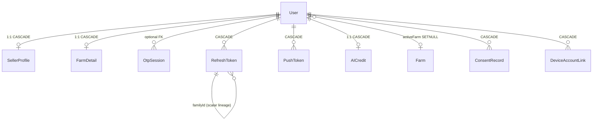

##### Catalog & commerce

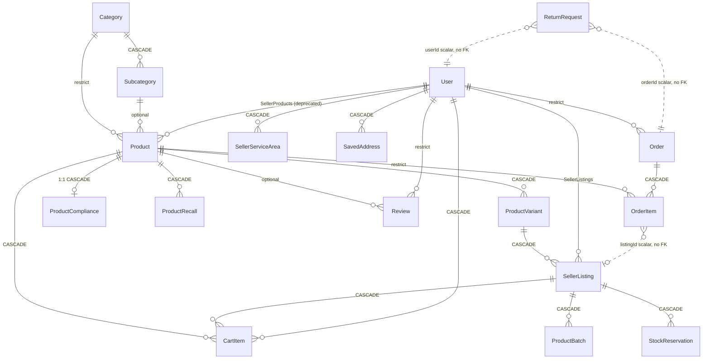

##### Payments & finance

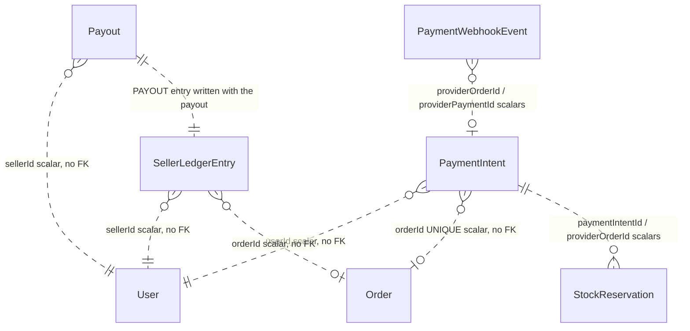

*The entire finance block uses scalar ids with no Prisma relations — stated in the schema as the reason it stays purely additive and `db push`-safe.*

##### Rent & animal marketplaces

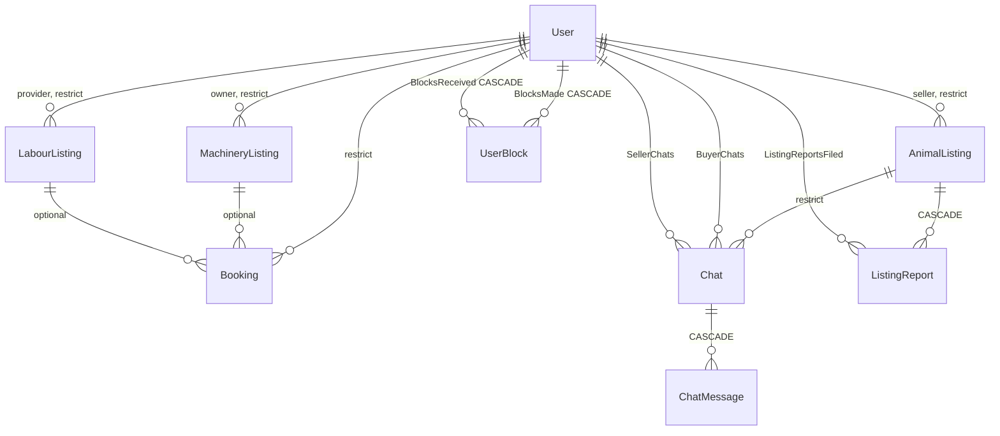

##### Community & messaging

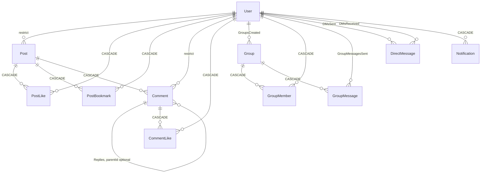

##### AI & assistant

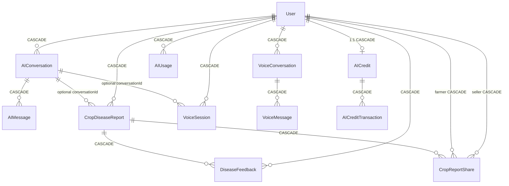

##### Agronomy / MyFarm

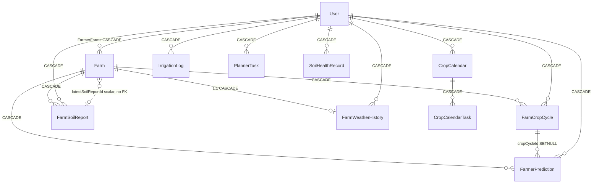

`CropMaster` and `PestAlert` are standalone reference tables with no relations.

##### Market data & schemes

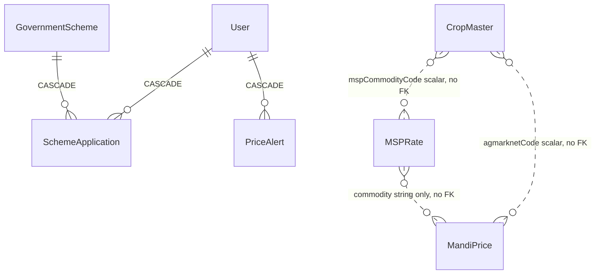

`MandiPrice`, `PredictionCache`, `PriceDataSync` and `WeatherCache` have **no** declared relations — commodity/market/state joins are string matching in application code.

##### Regulatory compliance

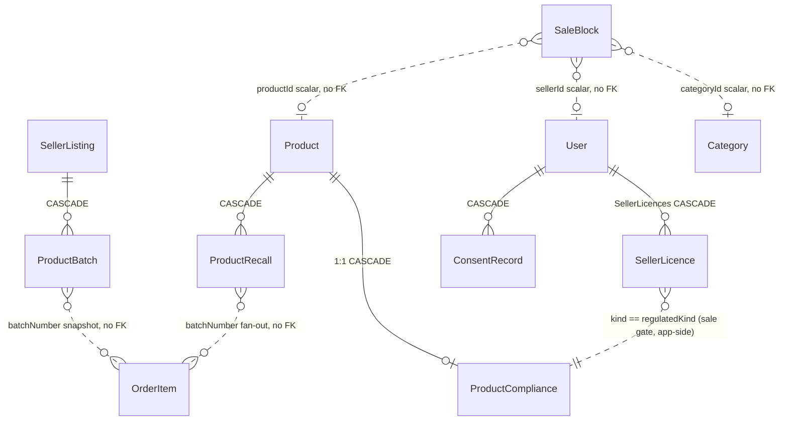

##### Trust & safety, ops & audit

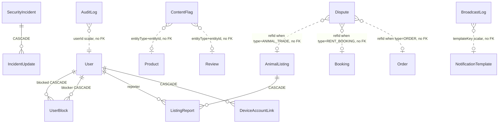

`AppSetting` and `FeatureFlag` are **standalone configuration tables with no relations** — no FK,
no scalar-carried reference, and nothing joins them to each other. (An earlier revision of this
diagram drew `AppSetting ||..|| FeatureFlag` labelled "independent config tables", which asserts a
*mandatory one-to-one* relationship — the exact opposite of the intended fact. In an ER diagram the
cardinality glyphs are the load-bearing content, so the edge was removed rather than relabelled;
the same treatment is already applied to `CropMaster` and `PestAlert` above.)

#### Indexing and query-shape analysis

**Totals across `schema.prisma`:** 282 `@@index` declarations, 25 composite `@@unique`, 22 field-level `@unique`, 18 GIN trigram/array indexes. Every PK is a UUID `text` column.

##### What the index design is doing right

| Pattern | Where | Why it matters |
|---|---|---|
| Filter-column + sort-column composites | `products_sellerId_createdAt`, `orders_userId_createdAt`, `animal_listings_status_createdAt`, `bookings_userId_createdAt` (migration `20260609130000`) | Filter ≠ sort means the planner otherwise filters via a single-column index then sorts the whole matching set on every page |
| `id` inside the sort index | `Product [status, createdAt DESC, id DESC]`, `[status, rating DESC, id DESC]`; `ChatMessage [chatId, createdAt DESC, id DESC]` | Keyset pagination needs the tiebreaker **in** the index or the sort spills to a filesort on every page — and with UUID PKs there is no natural monotonic tiebreaker |
| Every branch of a search `OR` indexed | `products_name_trgm` + `products_description_trgm` + `products_tags_gin`; the 4 `animal_listings_*_trgm`; 4 each on machinery/labour; `posts_title/description_trgm`; `groups_name_trgm` | A single unindexed OR branch forces a full scan of the whole clause, silently cancelling out the GIN indexes on the other branches (stated in migration `20260609150000` and in `Product`'s comments) |
| Composite that covers both lookup and ordering | `MandiPrice [market, priceDate DESC]` | `/nearby` does `market IN (...)` inside a date window ordered by `(market, priceDate)` |
| Date-leading index where nothing else is btree-usable | `MandiPrice [priceDate DESC]` | commodity/state/district are matched with `ILIKE contains`, so the date window is the only indexable predicate |
| Partial-shaped predicates via status | `SellerListing [variantId, status, sellingPrice]` (buy box), `ProductBatch [listingId, status, expiryDate]` (FEFO dispatch), `SellerLicence [sellerId, kind, status]` (sale gate), `StockReservation [status, expiresAt]` (sweeper) | The hot read is always `status = X` + a range/order on the third column |
| Geo bounding-box prefilter | `AnimalListing [lat, lng]`, `MachineryListing [lat, lng]`, `LabourListing [lat, lng]` | There is **no PostGIS**; radius search is a bbox prefilter (`geoPageIds`) then in-app haversine |

##### Endpoint → query shape → serving index (the positive half of the analysis)

The two tables above answer "what is the index design doing" and "what is it *not*
doing". Neither answers the question a maintainer actually asks — **"which index serves
*this* endpoint?"** — because neither is keyed by endpoint. This table is, and it is the
companion to the NOT-index-served table below: same call sites, opposite polarity.

Read `pagination` as one of three mutually exclusive modes, which behave very differently
at depth:

| Mode | Implementation | Depth behaviour |
|---|---|---|
| `offset` | `skip: (page-1)*limit, take: limit` + a parallel `count(where)` | `OFFSET n` costs O(n) rows discarded per page **regardless of index**, and the paired `count` re-scans the filtered set on every page. 25 call sites across 10 route files. |
| `keyset-prisma` | `utils/adminList.js` `keysetList()` — row-value seek expressed as a nested `OR`: `{OR:[{createdAt:{lt:c}},{createdAt:c,id:{lt:i}}]}`, `orderBy [createdAt DESC, id DESC]`, `take: limit+1` (no COUNT) | O(1) per page **only if** an index covers `(…filter…, createdAt DESC, id DESC)`. The nested `OR` is not a true SQL row-value comparison, so the planner may not always turn it into a single index seek. |
| `keyset-raw` | hand-written `$queryRaw` row-value seek `(createdAt, id) < ($1, $2)` | True index seek; the shape Postgres handles best. |
| `top-n` | `take: n` with no cursor at all | Bounded by construction; index only matters for the sort. |

| Endpoint | WHERE predicate | ORDER BY | Pagination | Index used | Notes |
|---|---|---|---|---|---|
| `GET /agristore/products` (`sort=relevance`, default) | `status='APPROVED'` [+ `categoryId` / `subcategoryId` / `brand` / rating / stock / search OR-group] | `rating DESC, createdAt DESC, id DESC` | `offset` | `products[status, rating DESC, id DESC]` — **partially**: the leading `status` + `rating` are served, then `createdAt` is not in the index, so the tiebreak still sorts | The `SORTS` comment at `agristore.routes.js:284-292` claims every sort maps to an index; true for `latest`, true for `rating`, **partially** true here, **false** for `popularity` |
| `GET /agristore/products` (`sort=latest`) | same | `createdAt DESC, id DESC` | `offset` | `products[status, createdAt DESC, id DESC]` — fully served | |
| `GET /agristore/products` (`sort=rating`) | same | `rating DESC, ratingCount DESC, id DESC` | `offset` | `products[status, rating DESC, id DESC]` — leading columns served, `ratingCount` tiebreak sorts | |
| `GET /agristore/products` (`sort=popularity`) | same | `viewCount DESC, rating DESC, id DESC` | `offset` | **none** | `products.viewCount` has no index *and* nothing increments it — the sort orders every row by 0. See NOT-index-served #2 and A.2 #5. |
| `GET /agristore/products` (`sort=price_asc\|price_desc\|discount`) | same | catalog `orderBy` first, then **re-sorted in Node** after offer decoration | `offset` | catalog index only | The offer-derived sort is applied *after* the page is fetched, so it sorts **within a page**, not across the result set. Page 2 is not the next-cheapest 20. |
| `GET /agristore/products/:id` reviews block | `productId=?` | `createdAt DESC` | `top-n` | `reviews[productId]` (+ `reviews_userId_idx`) | |
| `GET /agristore/products/:id/offers` | `variantId=?, status='ACTIVE'` | `isDefault DESC, createdAt ASC` | `top-n` | `seller_listings[variantId, status, sellingPrice]` for the filter; the sort columns are **not** in it | Buy-box ordering happens in the pricing service, not here |
| `GET /agristore/orders` | `userId = me` [+ `status`] | `createdAt DESC` | `offset` | `orders[userId, createdAt]` (migration `20260609130000`) — fully served | |
| **`GET /agristore/seller/orders`** | **`OrderItem.sellerId = me` only** | **`order.createdAt DESC` — a *relation* ordering** | `offset` (`page`/`limit`, default 15, max 50) + parallel `count` | `order_items[sellerId]` serves the **filter**; the **sort cannot be index-served at all** because the sort column lives on the joined `orders` table | This is the row the rest of the document could not answer. Three consequences: (1) Prisma emits a join to `orders` and sorts the joined result, so every page sorts the seller's *entire* order-item history; (2) `order_items[sellerId, status, createdAt]` is **not** the serving index — `?status=` is ignored by this handler entirely (A.2 #21) and `OrderItem.createdAt` is not what it sorts on; (3) `order_items[sellerId, orderId]` is likewise unused here. Together with `[sellerId]` those are the two `OrderItem` indexes with no stated consumer anywhere in this document — **they have none**. Fix: sort on `OrderItem.createdAt` (denormalised from the order at write time) and add `[sellerId, createdAt DESC, id DESC]`, or honour `?status=` and use the existing `[sellerId, status, createdAt]`. |
| `GET /agristore/seller/products` | `sellerId = me` [+ status] | `createdAt DESC` | `offset` | `products[sellerId, createdAt]` (migration `20260609130000`) — fully served | |
| `GET /agristore/listings` (seller's own listings) | `sellerId = me` [+ filters] | `createdAt DESC` | `offset` | `seller_listings[sellerId, …]`; the sort column is not in the composite | |
| `GET /agristore/cart` | `userId = me` | `createdAt ASC` | none (whole cart) | `cart_items[userId]` | Bounded by cart size, not by pagination |
| `GET /animaltrade/` (browse) | `status='ACTIVE'` [+ species/breed/geo bbox/search OR-group] | `SORTS[sort]`, default `createdAt DESC, id DESC` | `offset` for the non-geo path | `animal_listings[status, createdAt DESC]` (migration `20260609130000`); the 4 `*_trgm` GIN indexes cover every branch of the search OR; `[lat, lng]` prefilters the geo path | Geo results are re-ranked by in-app haversine after a bbox prefilter — there is no PostGIS |
| `GET /animaltrade/my` | `sellerId = me` | `createdAt DESC, id DESC` | `keyset` (hand-rolled, `:521`) | `animal_listings[sellerId, createdAt DESC]` + `id` tiebreak | One of the few non-admin endpoints already on keyset |
| `GET /animaltrade/:id/similar` | species/breed proximity, `id != self`, `status='ACTIVE'` | `createdAt DESC, id DESC` | `top-n` | `animal_listings[status, createdAt DESC]` | |
| `GET /animaltrade/chats/my`, `GET /animaltrade/:id/chats` | `buyerId=me OR sellerId=me` | **`updatedAt DESC`** | `top-n` | **none for the sort** | `Chat` has `[buyerId]` and `[sellerId]` but no index contains `updatedAt` → BitmapOr, then a full sort of the user's whole chat set. NOT-index-served #1. |
| `GET /animaltrade/chats/:chatId/messages` | `chatId=?` | `createdAt ASC` (thread view) / `createdAt DESC, id DESC` (paged) | `offset` / `keyset` | `chat_messages[chatId, createdAt DESC, id DESC]` — the tiebreaker is in the index, which is why this one is O(1) per page | The reference example of the "`id` inside the sort index" pattern above |
| `GET /rent/machinery`, `GET /rent/labour` | `status`/`available` [+ type, geo bbox, price band, search OR-group] | `nonGeoOrderBy(sort)` = `rating DESC, createdAt DESC, id DESC` (or `pricePerDay ASC, rating DESC, id DESC` for `sort=price`) | `offset` | 4 `*_trgm` GIN per table for the search OR; `[lat, lng]` for the geo prefilter; **no composite covers `rating DESC, createdAt DESC`** | Same partial-sort situation as `products?sort=relevance` |
| `GET /rent/machinery/my`, `GET /rent/labour/my` | `ownerId = me` | `createdAt DESC` | `offset` | `machinery_listings[ownerId, …]` / `labour_listings[ownerId, …]` | |
| `GET /rent/bookings`, `GET /rent/bookings/received` | `userId = me` / `ownerId = me` [+ status] | `createdAt DESC, id DESC` | `offset` (despite the keyset-shaped ORDER BY) | `bookings[userId, createdAt]` (migration `20260609130000`) | The ORDER BY is already keyset-ready; only the `skip/take` has to change to convert it |
| `GET /rent/machinery/:id/availability`, `/labour/:id/availability` | `listingId=?`, month window or future-only | `startDate ASC` | bounded `take` | `bookings[listingId, startDate]` | Bounding was added deliberately — it was an unbounded `findMany` |
| `GET /community/posts` | `deletedAt IS NULL` [+ `category`] | **`isPinned DESC, createdAt DESC`** | `offset` + parallel `count` | **none** — `Post` has `[deletedAt]`, `[category]`, `[createdAt]` as *separate* indexes and `isPinned` is indexed nowhere | Every page sorts the whole live set and the paired `count` scans it again. NOT-index-served #3. |
| `GET /community/posts/:id/comments` | `postId=?`, top-level only, then `replies` by `parentId IN (…)` | `createdAt ASC` (both levels) | `top-n` | `comments[postId]`; **`Comment.parentId` is unindexed** | NOT-index-served #4 |
| `GET /community/saved` | `userId = me` | `createdAt DESC` | `offset` | `saved_posts[userId]` | |
| **All 25 admin keyset lists** (`/admin/users`, `/admin/team`, `/admin/products/qc/queue`, `/admin/rent/machinery`, `/admin/rent/labour`, …) | per-router `where` | **always `createdAt DESC, id DESC`** — `keysetList()` hard-codes it | `keyset-prisma` (`utils/adminList.js:43-66`), `take: limit+1`, **no COUNT** | whichever `[…filter…, createdAt]` composite exists on the model; the `id` tiebreak is in the index only for the models listed in the "`id` inside the sort index" row above | Because the ORDER BY is fixed, an admin list is only O(1)-per-page on models whose filter+`createdAt`+`id` composite exists. `/admin/products/qc/queue` is the one exception that sorts **oldest-first** and therefore does not use `keysetList`. |

**How to extend this table.** Every row was produced the same way: open the handler, read
the `where`, the `orderBy` and the pagination call, then match that shape against the model's
`@@index` list in the model reference above. If you add a list endpoint, add its row — an
endpoint whose row you cannot fill in is an endpoint whose index you have not chosen.

##### Hot query paths that are NOT index-served (verified against call sites)

| # | Query | Call site | Index situation |
|---|---|---|---|
| 1 | Chat inbox: `WHERE buyerId=? OR sellerId=? ORDER BY updatedAt DESC LIMIT n` | `routes/animaltrade.routes.js:321-337` and `:1146-1152` | `Chat` has only `[sellerId]` and `[buyerId]`. **No index contains `updatedAt`**, so the OR is a BitmapOr followed by a full sort of the user's entire chat set. Fix: `[buyerId, updatedAt DESC]` + `[sellerId, updatedAt DESC]` |
| 2 | Storefront `sort=popularity`: `ORDER BY viewCount DESC, rating DESC, id DESC` (**`A2-05`**) | `routes/agristore.routes.js:293-298`, executed at `:402-412` | **`products.viewCount` has no index at all** (grep: only the column declaration at `schema.prisma:368`). The comment above `SORTS` claims "Each maps to an orderBy the schema has an index for" — that is true for `latest` and `rating`, false for `popularity`, and only partially true for `relevance` (`rating DESC, createdAt DESC, id DESC` vs the index `[status, rating DESC, id DESC]`, so the `createdAt` tiebreak still sorts) |
| 3 | Community feed: `WHERE deletedAt IS NULL [+category] ORDER BY isPinned DESC, createdAt DESC` with `skip/take` + a parallel `count(where)` | `routes/community.routes.js:46,76-91` | `Post` has `[deletedAt]`, `[category]`, `[createdAt]` separately but **no composite covering the filter+sort**, and `isPinned` is indexed nowhere. Every page sorts the whole live set; the paired `count` scans it a second time |
| 4 | Comment replies: `include: { replies }` → `WHERE parentId IN (...)` | `routes/community.routes.js:254-262` | **`Comment.parentId` has no index** despite being a declared self-relation FK |
| 5 | Disputes by referenced entity ("all disputes for this order") | `Dispute.refId` (`schema.prisma:2700`) | No index on `refId`, `raisedBy`, `againstUser` or `assignedTo` — only `[status]`, `[type]`, `[createdAt]` |
| 6 | Sale-block evaluation for `CATEGORY` / `BATCH` scopes | `SaleBlock` (`schema.prisma:3073-3077`) | Indexes exist for `[isActive, productId/sellerId/state/district]` but **not** for `categoryId` or `batchNumber`, though both are declared `SaleBlockScope` values |
| 7 | Content-flag lookup by author ("has this seller been flagged before") | `ContentFlag.authorId` | Only `[status, createdAt]` and the `[entityType, entityId]` unique |
| 8 | Return lookup by item | `ReturnRequest.orderItemId` | No index |
| 9 | Offset pagination generally | 25 `skip:` call sites across 10 route files (`rent` 6, `agristore` 4, `animaltrade` 3, `ai` 3, `groups` 2, `cropReportShare` 2, `community` 2, `messages` 1, `cropdisease` 1, `admin/catalogQc` 1) | `OFFSET n` makes deep pages cost O(n) regardless of index. `animaltrade` list endpoints already use keyset (`orderBy: [{createdAt:'desc'},{id:'desc'}]` at `:521,621`); the rest do not |

##### Redundant / prefix-subsumed indexes (write amplification with no read benefit)

Every index costs on INSERT/UPDATE, and several tables here are append-heavy. Verified redundancies:

| Table | Redundant index | Subsumed by |
|---|---|---|
| `users` | `@@index([phone])` | `phone String @unique` (line 17) |
| `ai_credits` | `@@index([userId])` | `userId String @unique` (line 1894) |
| `farm_weather_history` | `@@index([farmId])` | `farmId String @unique` (line 2087) |
| `prediction_cache` | `@@index([state, district, commodity, predictionMonth])` | the identical `@@unique` (line 1624) |
| `orders` | `@@index([userId])` | `[userId, status]` and `[userId, createdAt DESC]` |
| `bookings` | `@@index([userId])` | `[userId, status]`, `[userId, createdAt DESC]` |
| `notifications` | `@@index([userId])` | `[userId, readAt]`, `[userId, createdAt]` |
| `animal_listings` | `@@index([status])`, `@@index([createdAt])`, `@@index([sellerId])` | `[status, createdAt DESC]`, `[sellerId, createdAt DESC]` |
| `crop_disease_reports`, `ai_conversations`, `voice_conversations`, `voice_sessions`, `soil_health_records`, `ai_usage` | `@@index([userId])` in each | the `[userId, <sort>]` composite on the same table |
| `products` | `[sellerId]`, `[district]`, `[taluka]`, `[isActive, isFeatured]`, `[isActive, rating]` | dead after `catalog_split_3_contract.sql` drops those columns; the schema already says the composite plans are "lost" post-CONTRACT |

`products` currently carries **19 indexes** (3 of them GIN) on a table that is written on every seller edit and every `viewCount` bump — the heaviest write-amplification hotspot in the schema. `animal_listings` carries **14** (4 GIN), and its `searchText` column is rewritten on every listing update, which re-indexes 4 trigram GINs.

##### Structural query-shape notes

- **No PostGIS.** All geo is `Float` lat/lng + a `[lat, lng]` btree bbox prefilter, then haversine in JS. A btree on `(lat, lng)` only prunes on `lat`; the `lng` bound is a filter. At scale this is the main geo bottleneck.
- **`Decimal` everywhere money is involved** (`Decimal(12,2)` INR, `(14,2)` aggregates, `(14,6)` USD AI cost, `(12,4)` prediction cost, `(5,2)` tax %, `(10,3)` weight, `(10,2)` surcharge). Prisma returns `Decimal.js` objects; any arithmetic that coerces to JS `Number` silently reintroduces the drift the migration removed.
- **46 `Json` columns and 40 `String[]` columns.** JSONB fields (`fullReport`, `pricingSnapshot`, `quoteSnapshot`, `inputSnapshot`, `output`, the 8 `FarmCropCycle` log arrays, `eligibility`, `specifications`, `monthlyAggregates`, …) are unindexed and unqueryable except by full scan. `String[]` columns are only indexable via array GIN, and exactly one exists (`products_tags_gin`) — every other `has`/`hasSome` filter on a `String[]` (e.g. `PestAlert.districts`, `LabourListing.skills`, `SecurityIncident.affectedUserIds`, `ContentFlag.reasons`) is a scan.
- **`ILIKE contains` on `mandi_prices.commodity/state/district`** (`services/mandiPrice.service.js:169-180`) has no trigram index — unlike products/listings/posts, the mandi table's text filters were left unindexed and rely entirely on the `priceDate` window to bound the scan.

#### Data-integrity invariants: schema-enforced vs application-only

##### Enforced by the database

| Invariant | Mechanism |
|---|---|
| One account per phone; at most one account per email | `users.phone @unique`, `users.email @unique` (NULLs allowed many times) |
| A payment id can back exactly one order | `orders.paymentRef @unique` — replacing the previous "razorpay:\<id\>" inside free-text `notes`, which let a replayed signed triple create a second fully-paid order |
| A gateway order / payment maps to one intent; one intent maps to one order | `payment_intents.providerOrderId @unique`, `.providerPaymentId @unique`, `.orderId @unique` |
| A redelivered webhook is a no-op | `payment_webhook_events.eventId @unique` |
| A seller cannot be paid twice for one settlement window | `payouts @@unique([sellerId, periodFrom, periodTo])` |
| A Kendra cannot list the same pack twice | `seller_listings @@unique([sellerId, variantId])` |
| One live licence per class per seller | `seller_licences @@unique([sellerId, kind])` |
| One compliance record per product | `product_compliance.productId @unique` |
| One batch number per listing | `product_batches @@unique([listingId, batchNumber])` |
| Retried chat sends are idempotent | `chat_messages @@unique([chatId, clientMsgId])` |
| One review per purchased item (not per product) | `reviews @@unique([userId, orderItemId])` |
| One cart line per (buyer, offer) | `cart_items @@unique([userId, listingId])` |
| One report per (listing, reporter); one block per (blocker, blocked); one like/bookmark per (post, user); one membership per (group, user) | `listing_reports`, `user_blocks`, `post_likes`, `post_bookmarks`, `comment_likes`, `group_members` composite uniques |
| One flag per flagged item | `content_flags @@unique([entityType, entityId])` |
| One usage row per (user, day) | `ai_usage @@unique([userId, date])` |
| One serviceability row per (seller, area) even when half the columns are NULL | `seller_service_areas @@unique([sellerId, matchKey])` — the non-null `matchKey` exists precisely because a NULL-bearing composite unique is not enforced by Postgres |
| Deleting a user cannot orphan their sessions, cart, AI data, farm data | ~40 `onDelete: Cascade` relations |
| Deleting a user with orders/listings/posts/reviews/chats is **blocked** | Prisma's default `Restrict` on required relations — `erasure.service.js:19-22` calls this out as the reason erasure anonymises in place instead of deleting |
| Enum domains | 43 Postgres enum types |
| Money precision | `DECIMAL(12,2)`/`(14,2)`/`(14,6)` (migration `20260609140000`) |

##### Enforced only in application code (no DB constraint)

| Invariant | Where it lives | Risk if bypassed |
|---|---|---|
| A `Booking` references **exactly one** of `machineryListingId` / `labourListingId` | route validation | Both-NULL or both-set rows are insertable; no `CHECK` exists |
| No overlapping bookings for one listing/date range | `routes/rent.routes.js:1286,1374` — conflict check + create inside `$transaction({ isolationLevel: 'Serializable' })` | Double-booking. Postgres has no exclusion constraint here; correctness depends on the isolation level being kept |
| Stock never oversells | `routes/agristore.routes.js:980-1020` and `:1336` under `withSerializableRetry` (`utils/txRetry.js:45`), plus `utils/stockBatch.js`; conflicts counted via `SHOP_EVENTS.INVENTORY_CONFLICT` (`server.js:298`) | `seller_listings.stockQty` has **no `CHECK (stockQty >= 0)`**; a write path that forgets the transaction can drive it negative |
| `Order.status` is derived from the per-item `OrderItem.status` values | route/service logic (`OrderItem.status` is a free `String`, not an enum) | Order and items can disagree; item status accepts any string |
| `Order.totalAmount = subtotal + deliveryFee + taxAmount − discountAmount` | `services/shopPricing.service.js` | No generated column or `CHECK`; a bad write makes the payable disagree with its parts |
| `SellerLedgerEntry.balanceAfter` equals the running sum | ledger writer | Append-only by convention only — nothing prevents an `UPDATE` or an out-of-order insert |
| Effective consent = most recent `ConsentRecord` row per `(userId, purpose)` | `services/consent.service.js` (schema comment at 2545-2549) | Append-only by convention; no immutability trigger |
| At most one `FarmSoilReport.isLatest = true` per farm | soil report writer | Two "latest" reports are insertable |
| `Product.normalizedKey` dedup + admin merge | `services/catalogMatch.service.js`; `mergedIntoId` redirect | `products` has **no unique constraint of any kind**; duplicates are a workflow, not a constraint |
| A regulated product cannot be published without an APPROVED `ProductCompliance`, and the seller must hold an APPROVED `SellerLicence` of the matching `RegulatedKind` | `services/shopCompliance.service.js`, evaluated on every add-to-cart and checkout line | Purely application-side; the DB will happily store a live listing of an unapproved pesticide |
| Sale blocks / recalls stop a sale | `services/shopCompliance.service.js` + Redis cache bumped on write | Same — a cache-bump miss means a blocked product stays sellable until TTL |
| `SellerProfile.rating / cancellationRate / onTimeDispatchRate / returnRate` are derived aggregates | `services/sellerMetrics.service.js`, hourly cron (`server.js:288`) | Stale or wrong values silently reweight the buy box; `metricsUpdatedAt = NULL` is the documented "no history" sentinel |
| Denormalised counters (`Post.likeCount/commentCount/viewCount`, `Comment.likeCount`, `Group.memberCount`, `Product.rating/ratingCount`, `SellerListing.rating/ratingCount`, `User.totalFarms/totalLandAcres`, `AIConversation.messageCount`) | each write path | Drift from the true `COUNT(*)`; nothing reconciles them on a schedule |
| Soft delete is honoured on read | `services/softDelete.service.js` `ARCHIVE_SPECS` covers `AIConversation`/`VoiceConversation` (`isArchived`), `AnimalListing`/`MachineryListing`/`LabourListing` (`status=INACTIVE`), `Post` (`deletedAt`), `Product`/`Farm` (`isActive`) — **five different conventions across seven models** | A new read path that forgets the convention resurfaces deleted content. `Post.deletedAt` is the only tombstone; the rest are flags |
| Blocks are applied on every read/write | server-side filtering (schema comment at 883-887) | Explicitly noted as never client-side |
| `Dispute.refId` points at a real record | none | Deliberate: a loose scalar so a dispute survives deletion of the target |
| Cross-service consistency with `ai_scan_diagnoses` | none | The FastAPI table is written by asyncpg with no FK to `users`; `user_id` is a plain `TEXT` |

#### Growth, hot tables and retention

##### Retention policy that exists

`backend/src/constants/retention.js` defines a data-driven `RETENTION_POLICY` (`{key, model, dateField, days}`); `backend/src/services/retention.service.js` `runRetentionSweep()` walks it and issues one `deleteMany` per entry, isolating failures so one bad category does not abort the sweep. It runs daily at **02:30 container-local time** under a leader lock (`server.js:367-380`) and supports `dryRun` (count instead of delete).

> **All cron times in this document are container-local, not guaranteed UTC.** Every
> `cron.schedule(...)` call in `backend/src/server.js` is passed exactly **two** arguments — the
> expression and the handler — with **no `timezone` option**, and there is no `timezone` or `TZ`
> occurrence anywhere in `server.js` or in the deploy files. node-cron therefore evaluates every
> expression in the Node process's local timezone. The times read as UTC only because Railway
> containers default to `TZ=UTC`; nothing in the repo pins it. This applies to `30 2 * * *`
> (retention, "02:30"), `30 0 * * *` (mandi daily sync, "00:30"), `10 3 * * *` (batch expiry,
> "03:10") and `0 1 1 * *` (prediction-cache purge, "01:00 on the 1st"). Interval expressions
> (`*/2`, `*/5`, `*/10`, `*/25`, hourly) are timezone-independent and unaffected.

| Key | Model / table | Date field | Window | Note from the file |
|---|---|---|---|---|
| `otpSessions` | `OtpSession` / `otp_sessions` | `createdAt` | **1 day** | OTPs expire in minutes; rows kept 1 day max |
| `refreshTokens` | `RefreshToken` | `expiresAt` | **7 days** | tokens that expired/rotated >7 days ago |
| `notifications` | `Notification` | `createdAt` | **90 days** | |
| `voiceSessions` | `VoiceSession` | `createdAt` | **90 days** | voice transcripts + audio refs are PII |
| `aiUsage` | `AIUsage` | `date` | **180 days** | per-day metering |
| `auditLogs` | `AuditLog` | `createdAt` | **365 days** | forensic trail |
| `mspRates` | `MSPRate` | `createdAt` | **1095 days (~3 crop years)** | pruned by `createdAt` (set once on insert, unlike `updatedAt` which the re-sync upsert bumps) so it reflects true vintage; non-PII and regenerable from the CACP seed |

Other scheduled cleanups (not part of `RETENTION_POLICY`):

| Job | Schedule | What it removes | Source |
|---|---|---|---|
| `prediction-cache-purge` | monthly, 1st at 01:00 container-local | `PredictionCache` where `expiresAt < now` | `server.js:245-254` |
| `weather cache` sweep | lazy, on cache write | `WeatherCache` where `expiresAt < now` | `routes/weather.routes.js:120` |
| `shop-reservation-sweep` | every 2 min | flips expired `StockReservation` rows (status **update**, never delete) and returns held stock | `server.js:307-317`, `services/stockReservation.service.js:114,147,202` |
| `shop-batch-expiry-sweep` | daily 03:10 container-local | marks `ProductBatch` `EXPIRING_SOON` / `EXPIRED` (update, not delete) | `server.js:352-361` |
| `animal-listing-expiry` | hourly | flips stale `AnimalListing` to `INACTIVE` — **never deleted**, so the seller can renew | `server.js:382-393` |
| `shop-payment-reconcile` | every 10 min | terminalises stale `PaymentIntent` rows (update) | `server.js:337-350` |
| `refreshToken` family revoke | on reuse detection | `deleteMany` by `familyId` / `userId` | `utils/jwt.js:108,183,209` |

##### Unbounded tables with NO retention story

| Table | Growth driver | Purge? | Consequence |
|---|---|---|---|
| **`mandi_prices`** (**`A2-06`**) | daily cron fans ~75 commodity×state syncs to FastAPI (`server.js:225-241`); each writes up to `MAX_PAGES 10 × PAGE_SIZE 500` records per combo | **None.** `expiresAt` is written but no code ever deletes on it (grepped: the only `mandiPrice` writes are `upsert`/`create`/`update` in `services/mandiPrice.service.js:150-163`) | Fastest-growing table in the system, and it also carries 5 indexes |
| **`mandi_prices` duplicates** (**`A2-06`**) | `persistToDB()` calls `prisma.mandiPrice.upsert({ where: { id: 'dummy-will-not-match' } })` (`mandiPrice.service.js:148-156`). Prisma's upsert **creates** when the `where` finds nothing, and `mandi_prices` has no unique constraint, so the create always succeeds — the dedup `catch` branch at `:157-164` is unreachable | none | Every sync of a given `(commodity, market, priceDate)` inserts a **new row**. This is a duplication multiplier on top of the growth above (unverified in production, but it follows directly from Prisma upsert semantics + the absence of any unique constraint) |
| `error_logs` | one row per error reaching the global Express handler | none | Grows with the error rate; the table exists to be read by the admin Ops viewer, so it is never trimmed |
| `api_health_logs` | one row per upstream call sample | none | High-frequency ops telemetry |
| `audit_logs` | every PII change, order mutation, auth event, admin PII reveal, archive/restore | 365 days | Bounded, but 365 days of auth events on a login-heavy system is large — and the login-risk lookback queries it on **every login** |
| `chat_messages`, `group_messages`, `direct_messages` | user messaging | **none** | The three message tables have no retention entry at all |
| `ai_messages`, `voice_messages` | assistant turns | **none** — note `VoiceSession` is purged at 90 days but `VoiceMessage` (which also holds transcript `content` and audio URLs) is not, and `AIMessage` is not | PII (free-text farmer questions) retained indefinitely, which is in tension with the DPDP minimisation posture the retention file states |
| `ai_credit_transactions` | one row per AI call | none | Ledger by design |
| `seller_ledger_entries` | one row per sale/commission/refund/payout | none | Ledger by design (legal retention) |
| `stock_reservations` | one row per checkout line, per attempt | never deleted, only status-flipped | Grows with checkout volume forever |
| `payment_intents`, `payment_webhook_events` | one row per payment attempt / webhook | none | Financial records; retention is a policy decision, not an oversight |
| `content_flags`, `device_account_links`, `consent_records`, `incident_updates` | fraud/consent telemetry | none (`device_account_links` "age out by `lastSeenAt`" only in the sense that queries window on it — nothing deletes) | |
| `order_items`, `orders`, `reviews`, `posts`, `comments` | user activity | none (correct — these are user-facing records handled by erasure/anonymisation, per `retention.js`'s own scoping note) | |
| `ai_scan_diagnoses`, `ai_scan_feedback` (FastAPI-owned) | one row per scan, with a full JSONB `payload` | none in this repo | Largest per-row payload in the database |

##### Where partitioning / archival would be needed at scale

1. **`mandi_prices` — range-partition by `priceDate` (monthly)** (`A2-06`)**.** Every read path already filters `priceDate >= since`, so partition pruning would map onto existing queries with no rewrite; old partitions detach and drop instead of a `DELETE` that has to vacuum 5 indexes. Do the dedup fix first (add `@@unique([commodity, market, priceDate])` and make `persistToDB` a real upsert) or partitions just hold duplicates.
2. **`audit_logs`, `error_logs`, `api_health_logs` — range-partition by `createdAt`/`timestamp` (monthly).** All three are append-only with time-ordered reads; the retention sweep's `deleteMany` on `audit_logs` becomes a partition drop.
3. **`chat_messages` / `group_messages` / `ai_messages` / `voice_messages` — archive by conversation age.** These are the classic unbounded messaging tables. Reads are always scoped to one conversation with a keyset on `createdAt DESC` — so cold conversations can move to an archive table without touching the hot query shape.
4. **`ai_scan_diagnoses` (FastAPI) — partition by `created_at`, and move `payload` JSONB to object storage** keeping only the summary columns; it is BIGSERIAL-keyed and already has `created_at DESC` indexes, so it is the easiest partition candidate in the system.
5. **`order_items` — no partition, but the recall path needs one.** `[batchNumber]` makes recall fan-out indexed, but "notify every buyer of batch X" over years of order history is a growing scan; a batch→order-item materialisation would bound it.
6. **Connection fan-out is the other scaling wall, not just table size.** `instances × connection_limit` (min 20) plus the FastAPI `asyncpg` pool (max 10 per FastAPI instance) against `max_connections`. The pooler that `db.js:16-23` prescribes is not deployed.

#### Encryption at rest, PII and masking

##### Which columns are encrypted

Field-level encryption is **AES-256-GCM** implemented in `backend/src/utils/encrypt.js`. The authoritative inventory is `ENCRYPTED_COLUMNS` in `backend/src/services/keyRotation.service.js:18-21` — **10 columns across 2 models**:

| Model → table | Columns | Column type in schema | Written at |
|---|---|---|---|
| `User` → `users` | `gstNumber`, `lat`, `lng`, `annualHouseholdIncome` | all `String?` — `lat`/`lng` are **ciphertext strings, not floats**, and `annualHouseholdIncome` is a ciphertext string, not a number | `routes/user.routes.js:305-306` (`encryptNumber(lat/lng)`), `:330` (`encrypt(gstPlain)`) |
| `SellerProfile` → `seller_profiles` | `bankHolderName`, `bankName`, `bankAccountNumber`, `bankIfsc`, `aadharNumber`, `panNumber` | `String?` | `routes/user.routes.js:388-393` and `:494-499` |

Deliberately **not** encrypted, with reasons stated in the schema:
- `SellerProfile.licence*` — business-registration data, not personal PII (`schema.prisma:157-165`).
- `User.aadhaarLast4` — last four digits only.
- `Farm.latitude` / `Farm.longitude` — plain `Float`, unlike `User.lat/lng`. **This is an inconsistency**: a farm's coordinates locate the same person as the user's coordinates.
- `AnimalListing.lat/lng`, `MachineryListing.lat/lng`, `LabourListing.lat/lng` — plain `Float` (needed for the indexed bbox prefilter; encrypting them would make geo search impossible).
- `User.phone`, `SavedAddress.*`, `Order.deliveryAddress` (Json), `MachineryListing.ownerPhone`, `LabourListing.phone` — plaintext.

Related but separate: `SellerProfile.kycDocumentUrls` and `licenceDocUrls` hold **private Cloudinary public_ids**, served only via short-lived signed URLs; `utils/mask.js:44-49` deletes both keys from any profile payload. `SellerLicence.documentIds` follows the same rule.

##### Storage format and key rotation

`encrypt.js` keeps a `KEY_REGISTRY` (id → 32-byte Buffer) built once at module load:

- The legacy `FIELD_ENCRYPTION_KEY` is always present under the reserved id `"0"` (`LEGACY_ENCRYPTION_KEY_ID`).
- Extra keys come from `FIELD_ENCRYPTION_KEYS` as comma-separated `id:hexkey` pairs; `FIELD_ENCRYPTION_ACTIVE_KEY_ID` selects which key encrypts **new** data.
- `config/env.js:19-70` validates at boot and **refuses to start** without a valid 64-char-hex `FIELD_ENCRYPTION_KEY`; it also rejects a duplicate key id, the reserved id `"0"` in the extras list, a malformed id, or an active id that is not defined.

Two on-disk formats, all hex, colon-separated:

```
legacy (key "0"):  <iv>:<tag>:<ciphertext>            (3 parts)
versioned:         <keyId>:<iv>:<tag>:<ciphertext>    (4 parts)
```

`parseCiphertext()` returns `null` for anything matching neither shape, and `decrypt()` then returns the value unchanged — so pre-encryption plaintext rows keep working through the migration window. `decrypt()` returns `null` (never throws) when the value is ciphertext under an unknown/retired key or fails the GCM tag check.

**IV handling** (`generateIv()`, `encrypt.js:37-53`): a fresh 96-bit IV from `crypto.randomBytes` per encryption — never a counter, timestamp, or anything derived from the plaintext/key, because GCM's confidentiality **and** integrity collapse on a single `(key, IV)` reuse. There is a defensive fail-closed guard that throws if the CSPRNG returns a wrong-length or all-zero buffer. Random 96-bit IVs keep birthday-collision probability below ~2⁻³² up to ~2³² encryptions per key.

**Rotation runner:** `services/keyRotation.service.js` `reEncryptAll({ batchSize = 200, dryRun })`, invoked by `npm run rotate:keys` / `rotate:keys:dry` → `scripts/rotate-encryption-key.js`. It cursor-paginates each model ordered by `id`, and for each row only touches values where `needsRotation(value)` is true (ciphertext under a non-active key). Properties: idempotent, resumable, and safe to run while serving traffic because `decrypt()` understands every registered key version throughout. A value that cannot be decrypted is **left intact and counted as `skipped`** rather than clobbered. Deploy sequence: add the new key to `FIELD_ENCRYPTION_KEYS`, keep the old one listed, set `FIELD_ENCRYPTION_ACTIVE_KEY_ID`, then run the sweep.

> The rotation inventory is a hand-maintained constant (`keyRotation.service.js:17` — "Keep this in sync when new fields are encrypted"). Encrypting a new column without updating it means that column is never rotated.

##### Masking on read

Two distinct boundaries, both in `backend/src/utils/`:

**Owner reading their own seller profile — `mask.js` `maskSensitiveFields(profile)`:**

| Field | Treatment | Helper |
|---|---|---|
| `aadharNumber` | decrypt → `••••-••••-1234` (last 4) | `maskAadhaar` |
| `panNumber` | decrypt → `ABCDE•••4F` (first 5 + last 2) | `maskPan` |
| `bankAccountNumber` | decrypt → `••••••1234` (last 4) | `maskAccount` |
| `bankIfsc` | **full plaintext** — an IFSC identifies a bank branch, not a person | `maskIfsc` (which just decrypts) |
| `bankHolderName`, `bankName` | full plaintext (display names the owner needs to read back) | `reveal()` |
| `kycDocumentUrls`, `licenceDocUrls` | **deleted from the payload entirely** | — |

**Admin reading anyone — `adminPii.js`:** the stated hard rule is *every admin response masks PII by default*. `shapeUser(user, {reveal})`:

- masked path (default): `phone` → last-4 via `maskPhone`; `aadhaarLast4` → framed as `••••-••••-1234`; `lat`, `lng`, `annualHouseholdIncome` → set to `null` and replaced with presence booleans `hasLocation` / `hasIncome`. **Ciphertext is never shipped to the client.**
- reveal path: only when **both** `?reveal=true` **and** a non-empty `?reason=` are present (`revealContext()`); the ciphertext columns are decrypted with `decryptNumber()`.
- Every reveal is itself audited: `auditReveal()` writes an `ADMIN_PII_REVEAL` `AuditLog` row with `{fields, reason}`, the actor id, IP and request id — and the route is expected to `await` it so the reveal is logged **before** the plaintext is sent.
- Both helpers return new objects and never mutate the input.

##### PII churn limits and erasure

`backend/src/constants/pii.js` lists `SENSITIVE_PII_FIELDS` = `aadharNumber, panNumber, bankAccountNumber, bankIfsc, bankHolderName, bankName, gstNumber, dateOfBirth` and exports `isSensitivePiiUpdate(body)`, which returns true only when such a field is **present and non-empty** — empty strings sent by the client for not-yet-filled fields are ignored so they do not consume the tight PII rate-limit budget. The stated purpose is to block enumeration / identity laundering / audit-noise harvesting without throttling ordinary name/avatar/location edits.

`backend/src/services/erasure.service.js` implements DPDP §8 right-to-erasure as **anonymise-in-place + delete-personal**:

- `User` row is kept, `phone` becomes the unique non-loginable sentinel `deleted_<userId>`, `name` becomes `"Deleted User"`, and every PII field is nulled: `avatar, statusQuote, pincode, district, city, state, taluka, village, lat, lng, gstNumber, aadhaarLast4, annualHouseholdIncome, dateOfBirth, isMinor→false, gstOptOut→false` (…); `tokenVersion` is incremented to revoke outstanding JWTs; the account is deactivated.
- Hard-deleted in a transaction: `refreshToken, pushToken, otpSession (by userId OR phone), cartItem, savedAddress, notification, priceAlert, postLike, postBookmark, commentLike, groupMember, aIUsage, aICredit` (cascades its transactions), `aIConversation` (cascades messages), `voiceSession`, and the rest of the personal AI/crop/farm/soil data.
- Retained but scrubbed and reattributed to "Deleted User": orders, bookings, marketplace listings — records that involve other users or carry legal retention duties.
- Cloudinary assets are collected **before** the transaction (`collectMediaRefs()` reads `sellerProfile.kycDocumentUrls`, `cropDiseaseReport.imageUrls`, `soilHealthRecord.scanImageUrl`, `voiceSession.audio*Url`, `farm.sevenTwelveImageUrl`, `farmCropCycle.photos/seedReceiptUrl`, `farmSoilReport.reportImageUrl/reportPdfUrl`) and destroyed best-effort **after** it commits; KYC docs are purged as `type: 'authenticated'` (private) refs, voice audio as `resourceType: 'video'`. All DB mutations run inside one `prisma.$transaction` so erasure is all-or-nothing.
- Keeping the `User` row is explicitly to avoid the ~25 `Restrict` relations that would block a hard delete.

##### Gaps worth knowing

1. `Farm.latitude/longitude` are plaintext `Float` while `User.lat/lng` are encrypted — the same person's location, two different protection levels.
2. `AuditLog.before/after` are documented as "PII redacted" but are free `String?` columns; redaction is entirely the caller's responsibility.
3. `SecurityIncident.affectedUserIds String[]` and `dataCategories String[]` store user ids and PII-category labels in plaintext, unindexed.
4. `ConsentRecord.ip` and `userAgent` are stored in plaintext indefinitely (no retention entry) as consent proof.
5. `PaymentWebhookEvent` deliberately stores only a `payloadDigest`, not the raw payload, because the payload carries buyer contact details and card metadata — a good pattern that is **not** mirrored by `Order.deliveryAddress Json` or `Order.pricingSnapshot Json`, which are plaintext JSONB.
6. `decrypt()` returning `null` on failure means a retired key silently turns a bank account number into `null` on read rather than raising — the rotation runner is the only thing that surfaces those rows (as `skipped`).

---

## 3. REST API Reference

Every Express router is mounted under `ENV.API_PREFIX` (default `/api/v1`) in `backend/src/app.js:354-407`. **Mount order is load-bearing** in two places, both deliberate and both easy to break:

1. `featuresRoutes` is mounted at `/api/v1/admin` (`app.js:398`) **before** `adminRoutes` (`app.js:401`). Consequence: `GET /api/v1/admin/health/apis` resolves in `routes/features.routes.js` behind a **role-only** ADMIN check and never reaches the `requireScope(OPS)` gate that guards its sibling `/api/v1/admin/health`. `FeatureFlag` therefore has two admin write surfaces with different gates: `/admin/features/:key` (role only) and `/admin/flags` (role + OPS).
2. Inside the admin tree, four routers share the `/products` prefix, and `requireScope` terminates with 403 rather than `next('router')` — so each router applies its own path-scoped gate internally, and `/products/export`, `/products/import`, `/products/qc/*` must resolve **before** `productsRouter`'s `GET /:id`.

Other mount-order facts: `/api/v1/shop-webhooks` is mounted with `express.raw` **at app level** (`app.js:211`) ahead of the global JSON parser so the Razorpay HMAC sees the exact bytes; `/api/v1/agristore/seller-compliance` precedes `/api/v1/agristore`; `farmCropCycleRoutes` mounts at the bare prefix and self-guards on `/farms/*` and `/cycles/*`.

The canonical response envelope is `{ success: true, data, meta? }` / `{ success: false, error: { message, details?, requestId } }` (`backend/src/utils/response.js`), with `Prisma.Decimal → Number` conversion applied in place at the boundary. See [How to read this document](#how-to-read-this-document) for the endpoint-table column mapping across the four sub-parts.

**Section numbers are fully qualified.** Every numbered heading in this Part carries its full
path — `#### 3.1.4`, `##### 3.3.8.2` — so no number is reused anywhere in the document and a bare
`§3.3.4` is unambiguous. (Earlier revisions numbered each sub-part's sections locally, restarting
at `1.` in every sub-part, which created five independent `§` spaces and at least one wrong
pointer: a "see §3.4" inside sub-part 3.3 meant *3.3's* Timeouts section, not the top-level
Admin API. Those are all resolved.) Depth still tracks the path: `###` = sub-part,
`####` = section, `#####`/`######` = sub-sections.

### 3.1 Core — auth, identity, consent, social, trust & safety

> **Canonical home for**: the OTP login/signup flow, refresh rotation and reuse detection, the revocation matrix, consent records, account erasure and retention, the fraud/moderation/incident pipelines, and runtime settings.

#### Express REST API — Core (auth, identity, consent, social, trust & safety)

Scope of this section: the Express service in `backend/`, routers
`auth`, `users`, `onboarding`, `consent`, `upload`, `telemetry`, `admin/features`,
`addresses`, `messages`, `groups`, `community`, `admin/moderation`, `admin/fraud`,
`admin/incidents`, plus the services those routers depend on. Commerce
(`agristore`, `rent`, `animals`), AI (`ai`, `mandi`, `soil`, …) and the
`routes/admin/*` panel API are covered in other sections.

##### Router mount table

App entry is `backend/src/app.js`; `ENV.API_PREFIX` defaults to `/api/v1`
(`backend/src/config/env.js:194`). Mount order matters — Express matches in
registration order.

| Router file | Mount prefix | Router-level auth | app.js line |
|---|---|---|---|
| `routes/auth.routes.js` | `/api/v1/auth` | none (per-route) | 354 |
| `routes/user.routes.js` | `/api/v1/users` | `router.use(authenticate)` (`user.routes.js:54`) | 355 |
| `routes/community.routes.js` | `/api/v1/community` | none (per-route) | 369 |
| `routes/groups.routes.js` | `/api/v1/groups` | none (per-route; every route has `authenticate`) | 372 |
| `routes/messages.routes.js` | `/api/v1/messages` | none (per-route; every route has `authenticate`) | 373 |
| `routes/upload.routes.js` | `/api/v1/upload` | none (per-route) | 374 |
| `routes/addresses.routes.js` | `/api/v1/addresses` | none (per-route) | 382 |
| `routes/consent.routes.js` | `/api/v1/consent` | `router.use(authenticate)` (`consent.routes.js:30`) | 383 |
| `routes/incident.routes.js` | `/api/v1/admin/incidents` | `router.use(authenticate, requireAdmin)` (`incident.routes.js:34`) | 384 |
| `routes/fraud.routes.js` | `/api/v1/admin/fraud` | `router.use(authenticate, requireAdmin)` (`fraud.routes.js:25`) | 385 |
| `routes/moderation.routes.js` | `/api/v1/admin/moderation` | `router.use(authenticate, requireAdmin)` (`moderation.routes.js:26`) | 386 |
| `routes/telemetry.routes.js` | `/api/v1/telemetry` | none (`optionalAuth` on the one route) | 387 |
| `routes/features.routes.js` | `/api/v1/admin` | none (per-route `authenticate, requireAdmin`) | 398 |
| `routes/admin/index.js` | `/api/v1/admin` | `authenticate, requireAdmin, loadAdminContext` + per-module `requireScope` | 401 |
| `routes/onboarding.routes.js` | `/api/v1/onboarding` | `router.use(authenticate)` (`onboarding.routes.js:15`) | 405 |

**Mount-order consequence (verified):** `featuresRoutes` is mounted at
`/api/v1/admin` *before* `adminRoutes` (`app.js:398` vs `app.js:401`). Its routes
are `/features`, `/features/:key` and `/health/apis`. `routes/admin/index.js:136` (`/health`)
mounts `healthRouter` at `/health` behind `requireScope(S.OPS)`, and
`routes/admin/index.js:135` (`/flags`) mounts `flagsRouter` at `/flags` behind
`requireScope(S.OPS)`. Therefore `GET /api/v1/admin/health/apis` resolves in
`features.routes.js` and is gated by **role only** (`req.user.role === 'ADMIN'`,
`features.routes.js:18-21`), never by the OPS scope, while its sibling
`GET /api/v1/admin/health` requires the scope. Likewise `FeatureFlag` has two
admin write surfaces with different gates: `/admin/features/:key` (role-only) and
`/admin/flags` (role + OPS scope). The doc comment at `features.routes.js:7`
claims the path is `/api/v1/health/apis`; that path does not exist.

##### Global request pipeline (app.js, in order)

| # | Middleware | Notes |
|---|---|---|
| 0 | `installAsyncRouteSafety()` (`app.js:27`) | wraps async handlers so a rejected promise produces a response rather than a hung request |
| 1 | `app.disable('etag')` (`app.js:80`) | no conditional GET on JSON |
| 2 | `app.set('trust proxy', ENV.TRUST_PROXY)` (`app.js:90`) | default `1` in production, `'loopback'` otherwise (`config/env.js:178-191`). Drives `req.ip` and therefore every per-IP rate-limit key |
| 3 | request id (`app.js:92-96`) | `req.id` = `x-request-id` header or `crypto.randomUUID()`; echoed as `x-request-id` |
| 4 | `helmet` (`app.js:107`) | default CSP except `img-src 'self' data: blob: https:` (admin SPA loads Cloudinary images) |
| 5 | `cors` (`app.js:133`) | no `Origin` → allow (mobile); self-origin from `RAILWAY_PUBLIC_DOMAIN`/`RAILWAY_STATIC_URL` → allow; dev loopback → allow; else `ENV.ALLOWED_ORIGINS` allowlist; production without allowlist → blocked. `credentials: true`, `maxAge: ENV.CORS_MAX_AGE` (600 s) |
| 6 | `compression()` | |
| 7 | `morgan` | registered **before** body parsers so 413/400 body-parser rejections still log |
| 8 | body parsers (`app.js:197-215`) | per-path JSON limits: `/upload` 10 mb (line 197), `/ai/scan/submit` 50 mb, `/ai/chat` 12 mb, `/ai/soil-card-ocr` 12 mb, `/shop-webhooks` `express.raw` 256 kb; **global default 100 kb** JSON + urlencoded. All wrapped in `skipMultipart()` so multer routes read the raw stream |
| 9 | `/healthz`, `/health`, `/readyz` (`app.js:226-291`) | mounted before the limiter so probes are never throttled. `/readyz` is **public** and returns DB/Redis health plus cache hit-rate, Redis memory and shop latency percentiles |
| 10 | admin SPA static at `/admin` (`app.js:306-320`) | only when `admin/dist/index.html` exists; before the limiter/parsers |
| 11 | global per-IP rate limiter (`app.js:330-339`) | `prefix: 'global:ip'`, key `clientIp`, `ENV.RATE_LIMIT_MAX` = 200 per `ENV.RATE_LIMIT_WINDOW_MS` = 900 000 ms. Enabled unless `NODE_ENV==='test'` (`config/env.js:341-343`) |
| 12 | `csrfProtection` (`app.js:345`) | see below |
| 13 | `maintenanceMode` (`app.js:351`) | 503 when `app.maintenanceMode` AppSetting is on; exempts `/healthz`,`/readyz`,`/health`,`/admin*` and any path containing `/admin/` or `/auth/` (`middleware/maintenance.js:31-38`); 5 s in-process cache; fails **open** |
| 14 | routers (table above) | |
| 15 | 404 `sendError(…, 404)` (`app.js:409`) | |
| 16 | global error handler (`app.js:414-430`) | logs, returns `err.message` only when `err.expose`, else `'Internal server error'`; best-effort `persistErrorLog` into `ErrorLog` |

##### Response envelope and shared helpers (`utils/response.js`)

* Success: `{ success: true, data, meta? }` — `sendSuccess(res, data, status=200, meta)`, `sendCreated` = 201.
* Error: `{ success: false, error: { message, details?, requestId } }` — `requestId` is pulled from `res.req.id`.
* `serializeDecimals()` walks the payload **in place** and converts every `Prisma.Decimal` to a JS number at the boundary.
* `sendServerError(res, err, fallback, status)` logs the real error, persists an `ErrorLog` row, and only echoes `err.message` when `err.expose === true`.
* Pagination helpers: `parsePageNumber(raw, def=1)` (non-positive/NaN → 1), `parsePageSize(raw, def, max)` (clamped to `[1, max]`), `paginationMeta(total, page, limit)` → `{ page, limit, total, totalPages }`.
* `middleware/uuidParams.js` — `uuidParamGuard` registered via `router.param(name, …)`; rejects non-RFC-4122 path params with 400 before Prisma sees them (avoids P2023 → 500 and id-enumeration probes).
* `utils/sanitizeSearch.js` — strips `%`, `_`, `\` from search terms and caps at 100 chars before they enter a Prisma `contains` (Prisma does **not** escape LIKE metacharacters).
* `middleware/validate.js` — `express-validator` result → 400 with `"<field>: <msg>"` joined by `; ` plus the raw error array as `details`.

##### Auth primitives

`middleware/auth.js`:

| Export | Behaviour |
|---|---|
| `authenticate` | strict `^Bearer (\S+)$` parse → `verifyAccessToken` → reject non-string `sub` → **Redis denylist check on `jti`** → DB lookup of `{tokenVersion, isActive}` → reject if missing/`isActive===false` or `payload.tv !== user.tokenVersion`. Sets `req.user={id,role}` and `req.auth={jti,exp}`. DB failure → 401 (fail **closed**) |
| `optionalAuth` | same token parse + denylist check, but any failure continues anonymously; **does not** check `tokenVersion` or `isActive` |
| `requireRole(...roles)` | 401 if unauthenticated, 403 otherwise |
| `blockMinors` | DPDP §9 — DB read of `isMinor`; 403 for minors. Used on seller/KYC/licence writes |

`utils/jwt.js`:

| Concern | Value |
|---|---|
| Access token | HS256, `ENV.JWT_SECRET`, `expiresIn: ENV.JWT_EXPIRES_IN` (default `15m`), issuer `krushisarva-backend`, audience `krushisarva-mobile`, claims `sub`, `role`, `tv`, `jti` (`crypto.randomUUID()`) |
| Refresh token | 48 random bytes hex, stored **sha256-hashed** in `RefreshToken.token`; `familyId` groups a rotation lineage; `sessionStartedAt` anchors the absolute cap |
| Idle timeout | `SESSION_IDLE_TIMEOUT_DAYS` = 7 → `expiresAt`, re-set on every rotation (sliding) |
| Absolute timeout | `SESSION_ABSOLUTE_TIMEOUT_DAYS` = 30 from `sessionStartedAt`, carried across rotations |
| Concurrent sessions | `MAX_CONCURRENT_SESSIONS` = 5; `enforceSessionLimit()` counts unrotated+unexpired heads, evicts the oldest lineages wholesale |
| `bumpTokenVersion(userId, client)` | `User.tokenVersion` increment; accepts a tx client so it commits atomically with its trigger |

`utils/cookies.js` (web transport only, opted in with header `X-Auth-Transport: cookie`):

| Cookie | Flags | Path |
|---|---|---|
| `rt` (refresh) | `httpOnly`, `secure` unless `IS_DEV`, `sameSite=lax`, `maxAge = SESSION_IDLE_TIMEOUT_DAYS` | `${API_PREFIX}/auth` |
| `csrf` | **not** httpOnly (JS must read it), `secure` unless `IS_DEV`, `sameSite=lax` | `/` |

`middleware/csrf.js` — double-submit. Skipped for `GET/HEAD/OPTIONS`, skipped for
paths ending in `/auth/send-otp` or `/auth/verify-otp`, and skipped entirely when
the request carries **no `rt` cookie** (so Bearer/mobile traffic is exempt).
Otherwise requires `timingSafeEqual(cookie csrf, header x-csrf-token)` → 403.

`services/tokenDenylist.service.js` — Redis key `denylist:at:<jti>` with
`TTL = exp − now`. **Fails open**: no jti or Redis not `ready` → treated as not
denylisted. The durable backstops are the 15-minute access TTL, `tokenVersion`,
and refresh revocation.

---

#### `/api/v1/auth` — `routes/auth.routes.js`

| Method | Path | Auth | Rate limit | Key request fields | Response shape | DB models written | Side effects |
|---|---|---|---|---|---|---|---|
| POST | `/api/v1/auth/send-otp` | public | `otpPowGate` → `otpIpLimiter` (50 / 3600 s / IP) → `otpPhoneLimiter` (5 / 3600 s / normalized phone) + global | `phone` (normalized to 10 digits by `indianMobileBody`) | 200 `{ sessionId, devOtp? }` | `OtpSession` create; `OtpSession.updateMany` sets prior unverified sessions' `attempts = OTP_MAX_ATTEMPTS` | MSG91 HTTP POST when `MSG91_AUTH_KEY` set; else console-log + `devOtp` in body |
| POST | `/api/v1/auth/verify-otp` | public | `otpVerifyIpLimiter` (30 / 60 s / IP), `otpVerifyPhoneLimiter` (10 / 60 s / phone) + global | `phone`, `otp` (exactly 6 chars), `name?` (2–80) | 201 `{ accessToken, isNewUser, user, refreshToken \| csrfToken, stepUp? }` | `OtpSession` (attempts++ or `verified=true`), `User` create (new signup), `ConsentRecord` ×3 (signup), `RefreshToken` create + evictions, `AuditLog` (`AUTH_LOGIN`, optional `AUTH_LOGIN_RISKY`, `AUTH_LOGIN_GEO_ANOMALY`, `AUTH_OTP_FAILURE`, `AUTH_OTP_LOCKOUT`), `DeviceAccountLink` upsert, `SecurityIncident`+`IncidentUpdate` (fraud flags) | Redis OTP-lockout counters cleared; Expo push on risky/geo-anomalous login; velocity ZSETs written; sets `rt`+`csrf` cookies in cookie mode |
| POST | `/api/v1/auth/refresh` | bearer-less; token from body or `rt` cookie | global only | `refreshToken?`, `userId?` (or cookie) | `{ accessToken, refreshToken }` or `{ accessToken, csrfToken }` | `RefreshToken` (claim `rotatedAt`, create successor, `deleteMany` family on reuse/expiry/disabled account), `AuditLog` `AUTH_TOKEN_REFRESH` / `AUTH_TOKEN_REUSE`, `SecurityIncident` on reuse | clears both cookies on any failure path; rotates `csrf` cookie in cookie mode |
| POST | `/api/v1/auth/change-phone` | user (`authenticate`) | global only | `newPhone`, `otp` | `{ accessToken, phone, refreshToken \| csrfToken }` | `User.phone` + `tokenVersion` increment (one transaction), `RefreshToken` deleteMany + create, `OtpSession` | 409 if number already taken (pre-check **and** `P2002` catch); every other session killed |
| POST | `/api/v1/auth/logout` | user | global only | `refreshToken?` (or `rt` cookie) | `{ message }` | `RefreshToken` deleteMany (whole family), `AuditLog` `AUTH_LOGOUT` | Redis `denylist:at:<jti>` set with TTL = remaining token life; both cookies cleared; catch-block still clears cookies and returns 200 |
| POST | `/api/v1/auth/logout-all` | user | global only | — | `{ message }` | `RefreshToken` deleteMany (all), `User.tokenVersion` increment | invalidates every access token fleet-wide via the `tv` check in `authenticate` |

**Notes**

* `send-otp` and `verify-otp` are the only two paths exempted from CSRF (`middleware/csrf.js` PRE_AUTH_PATHS), so a stale orphan `rt` cookie cannot brick re-login.
* Both OTP limiters key on `normalizeIndianMobile(req.body.phone)`; a malformed phone yields `null`, the limiter **skips** (`rateLimit.js:113`) and the validator produces the 400 instead.
* `verify-otp` returns **201**, not 200. Failure modes: 423 + `Retry-After` when locked, 400 for a wrong/expired code, 500 on unexpected error.
* No enumeration difference between signup and login: the same endpoint pair serves both, and `send-otp` never reveals whether the number is registered.
* `change-phone` is **not** covered by the verify-rate-limiters (only the global 200/15 min), though `verifyOtp` still applies the per-phone lockout.
* Risk/geo/velocity/device signals are all computed **before** the `AUTH_LOGIN` audit row is written, so "previous login" comparisons are genuinely against prior events (`auth.routes.js:196-231`). A brand-new account is never scored risky.
* Every fraud path is fire-and-forget with `.catch(() => {})` and every service fails open — login cannot be broken by a scoring failure.
* `tokenVersion` is stripped from the `user` object before it is returned (`auth.routes.js:262`).

##### Complete OTP signup / login flow

1. **Client → `POST /api/v1/auth/send-otp { phone }`.**
2. `otpPowGate` (`services/proofOfWork.service.js:otpPowGate`). No-op unless `OTP_POW_SECRET` is set. Peeks the per-IP sliding send count (`pow:otp:ip:<ip>`, window `OTP_RATE_LIMIT_WINDOW_MS`). Below `OTP_POW_SUSPICION_THRESHOLD` (3) → record and continue. At/above → require a solved hashcash proof from header `X-OTP-PoW` or `body.proofOfWork`; a failure returns **428 Precondition Required** with `X-PoW-Required: 1` and a freshly issued challenge. The challenge is HMAC-signed (`challenge.difficulty.exp.scope`, scope = `send-otp:<ip>`) so verification is stateless; single use is enforced by `SET pow:used:<challenge> NX PX ttl`. Work = `sha256(challenge.nonce)` with ≥ `OTP_POW_DIFFICULTY` (18) leading zero bits. Placed before the limiters so a 428 does not burn a rate-limit slot. Any error fails open.
3. `otpIpLimiter` then `otpPhoneLimiter` (sliding-window ZSETs in Redis, in-memory fallback). 429 + `Retry-After` on trip; rejected requests are **not** recorded, so a flood cannot extend its own window.
4. `indianMobileBody('phone')` (`utils/phone.js`) normalizes `+91`/`0`/spaces via `libphonenumber-js` (digit fallback) and enforces `^[6-9]\d{9}$`; the sanitizer rewrites `req.body.phone` to the canonical 10 digits.
5. `sendOtp(phone)` (`services/otp.service.js:sendOtp`): 6-digit code from `crypto.randomInt`; bcrypt hash at cost 10; `expiresAt = now + OTP_EXPIRE_MINUTES` (5); all prior unverified sessions for the phone are burned by setting `attempts = OTP_MAX_ATTEMPTS`; one `OtpSession` row created. With `MSG91_AUTH_KEY` → `POST https://control.msg91.com/api/v5/otp` with `mobile: 91<phone>`; without → the OTP is console-logged **and returned as `devOtp`**.
6. **Client → `POST /api/v1/auth/verify-otp { phone, otp, name? }`.**
7. `verifyOtp` (`services/otp.service.js:verifyOtp`): (a) `checkOtpLock` — a locked number is refused before the code is even compared; (b) find the newest `OtpSession` where `verified=false`, `expiresAt > now`, `attempts < OTP_MAX_ATTEMPTS` — none → "OTP expired or not found"; (c) dev bypass only when the frozen `ENV.OTP_DEV_BYPASS` flag is true **and** the code is `000000` (flag requires `OTP_DEV_BYPASS_ENABLED==='true'` **and** `NODE_ENV !== 'production'` **and** no `MSG91_AUTH_KEY`; a prod boot with the opt-in set refuses to start, `config/env.js:505-507`); (d) otherwise `bcrypt.compare`.
8. On mismatch: `attempts` incremented, `recordOtpFailure(phone)` called. Lockout (`services/otpLockout.service.js`) keys Redis `otp:fail:<phone>` (TTL `OTP_FAIL_WINDOW_SECONDS` = 900), `otp:lock:<phone>`, `otp:lockcycle:<phone>` (TTL `OTP_LOCK_CYCLE_WINDOW_SECONDS` = 86 400). At `OTP_LOCK_THRESHOLD` (5) failures the number locks for `OTP_LOCK_BASE_SECONDS × 2^(cycle−1)` capped at `OTP_LOCK_MAX_SECONDS` (60 s → 3600 s), the fail counter is cleared, and a SECURITY-category push goes to the owner if the number is registered. In-memory fallback mirrors the same state machine when Redis is not `ready`.
9. On match: `OtpSession.verified = true`; `clearOtpLockout(phone)` deletes all three Redis keys; `User.findUnique({ phone })` decides `isNewUser`.
10. **New user:** `prisma.user.create({ phone, name })` (`onboardingStep` defaults to `BASIC`), then `captureSignupConsent()` writes three `ConsentRecord` rows (`TERMS_OF_SERVICE`, `PRIVACY_POLICY`, `DATA_PROCESSING`) with `method:'signup'`, policy version, ip and user-agent. Best-effort — a failure is logged, never blocks registration.
11. `signAccessToken` + `createRefreshToken` (new family), then `enforceSessionLimit(user.id)` evicts the oldest lineages past 5.
12. Risk scoring, in order: `assessLoginRisk` (skipped for new users) → `assessLoginGeoAnomaly` / `resolveIpGeo` (only when `GEO_ANOMALY_ENABLED`) → write `AUTH_LOGIN` audit row carrying `{ userAgent, geo:{country,lat,lng} }` → optional `AUTH_LOGIN_RISKY` / `AUTH_LOGIN_GEO_ANOMALY` rows → `recordVelocity(LOGIN)` when `VELOCITY_ENABLED` → `recordDeviceLink` when `DEVICE_FINGERPRINT_ENABLED`.
13. Response 201. Mobile (no `X-Auth-Transport: cookie`) gets `refreshToken` in the body; web gets `rt` + `csrf` cookies and `csrfToken` in the body. `stepUp: true` is added when the geo decision was `step_up` (impossible travel).

##### Refresh rotation and reuse detection (`utils/jwt.js:rotateRefreshToken`)

* The presented raw token is sha256-hashed and looked up. Scoped by `userId` too when the mobile body path supplies one.
* Unknown → `invalid`. **`rotatedAt` already set → `reuse`**: the entire `familyId` lineage is deleted, `AUTH_TOKEN_REUSE` is audited, and `reportSecurityEvent` opens an `ACCOUNT_TAKEOVER` / `HIGH` incident (which sets `notificationRequired` — see the incident pipeline).
* Idle expiry (`expiresAt <= now`) or absolute expiry (`now − sessionStartedAt > 30 d`) → family deleted, `expired`.
* Rotation is claimed with `updateMany({ id, rotatedAt: null })`; `count === 0` means a concurrent refresh won, and the loser is treated as reuse (family burned). This makes double-refresh from two tabs/devices a lineage kill — deliberate, but it means aggressive client retry logic can log a user out.
* Successor inherits `familyId` and `sessionStartedAt`, so the absolute cap stays anchored to the original login.
* On any non-`ok` result in cookie mode **both** `rt` and `csrf` are cleared — leaving `rt` without its `csrf` partner is what would wedge a browser into permanent 403s on mutations.
* A refreshed-but-now-inactive account triggers `revokeAllRefreshTokens` so the just-minted successor is not left dangling.

##### Logout, denylist, and revocation matrix

| Action | Refresh tokens | Access tokens |
|---|---|---|
| `POST /auth/logout` | presented token's whole family deleted | **this** token's `jti` added to Redis denylist until its `exp` |
| `POST /auth/logout-all` | all rows for the user deleted | `tokenVersion` bumped → every outstanding token fails the `tv` check |
| `POST /auth/change-phone` | all rows deleted, fresh pair issued | `tokenVersion` bumped inside the same transaction as the phone swap |
| `DELETE /users/me` (erasure) | all rows deleted | `tokenVersion` incremented inside `anonymizedUserFields` |
| Admin force-logout / erasure | via the same services | via `tokenVersion` |

The denylist is the only cross-instance mechanism that revokes **one** device without disturbing the others; it is fail-open by design, so a Redis outage degrades single-device logout to "valid until the 15-minute access token expires".

##### Device linking (FRAUD-3, `services/deviceLink.service.js`)

* `strongDeviceId(req)` = `sha256(trim(headers['x-device-id']).slice(0,256)).slice(0,24)`, or **null** when the header is absent. Only this strong id is used for linking — the coarse User-Agent fingerprint used by velocity is deliberately *not*, because thousands of users share a UA and would form fabricated clusters. No header → the feature is inert.
* `recordDeviceLink({userId, fingerprint, ip, context})` upserts `DeviceAccountLink` on `@@unique(fingerprint, userId)`, bumping `lastSeenAt`, `seenCount`, `lastIp`, `lastContext`. Called with `context:'login'` from `auth.routes.js:253-255` and `context:'order'` from `agristore.routes.js:1373` and `:1797`.
* Distinct accounts on the fingerprint within `DEVICE_LINK.lookbackDays` (default 30, `config/env.js:441-442`) are counted (capped at 100 rows). At `DEVICE_LINK.flagAccounts` (default 3) it flags: an `AuditLog` `FRAUD_MULTI_ACCOUNT_FLAG` row plus — deduped by `SET fraud:devicelink:inc:<fp> NX EX 86400` — a `FRAUD` / `MEDIUM` `SecurityIncident` listing the linked accounts. **Never blocks.**
* `listDeviceClusters()` powers `GET /api/v1/admin/fraud/device-clusters` with a Prisma `groupBy` + `having` on distinct account count. Returns `[]` on any error.

---

#### `/api/v1/users` — `routes/user.routes.js`

Router-level: `router.param('userId', uuidParamGuard)` then `router.use(authenticate)` — **every** route requires a valid access token.

Route-level limiters defined at the top of the file:

| Limiter | Window / max | Key |
|---|---|---|
| `profileWriteLimit` | 15 min / 20 | `req.user.id` (fallback `clientIp`), prefix `user:write` |
| `piiUpdateLimit` | 60 min / 5 | `req.user.id` **only when `isSensitivePiiUpdate(req.body)`**, prefix `user:pii` |
| `kycSubmitLimit` | 60 min / 5 | `req.user.id` unconditionally, same `user:pii` counter |

`SENSITIVE_PII_FIELDS` (`constants/pii.js`) = aadhar, pan, bankAccountNumber, bankIfsc, bankHolderName, bankName, gstNumber, dateOfBirth — present **and** non-empty.

| Method | Path | Auth | Rate limit | Key request fields | Response shape | DB models written | Side effects |
|---|---|---|---|---|---|---|---|
| GET | `/api/v1/users/me` | user | global | — | `{ …user, gstNumber (decrypted), sellerProfile (masked), farmDetail, _count }` | none | none |
| PUT | `/api/v1/users/me` | user | `profileWriteLimit` + `piiUpdateLimit` | multipart or JSON: `name, email, language(en\|hi\|mr), notificationsEnabled, statusQuote, pincode, district, taluka, village, city, state, lat, lng, dateOfBirth, businessType, sellerConsent, gstNumber, gstOptOut, bank*, aadharNumber, panNumber` + optional avatar file | masked profile + `tokens` when promoted | `User`, `ConsentRecord` (`SELLER_ONBOARDING` on promotion), `SellerProfile` upsert, `AuditLog` `PII_UPDATE`, `RefreshToken` on promotion | Cloudinary avatar upload; field-level AES-256-GCM encryption of `gstNumber`, `lat`, `lng`, all bank/KYC fields; recomputes `profileCompletion` |
| PUT | `/api/v1/users/me/seller-profile` | user, non-minor | `profileWriteLimit`, `blockMinors`, `piiUpdateLimit` | `bankHolderName, bankName, bankAccountNumber, bankIfsc, aadharNumber, panNumber` | masked `SellerProfile` | `SellerProfile` upsert, `User.profileCompletion` | encryption before write; masked on the way out |
| POST | `/api/v1/users/me/kyc-documents` | user, non-minor | `profileWriteLimit`, `blockMinors`, `kycSubmitLimit` | multipart field `images` (≤5 files, 15 MB each) | 201 `{ documents: [{url, expiresInSec}] }` | `SellerProfile.kycDocumentUrls`, `User.kycStatus = 'PENDING'` (one transaction), `AuditLog` `PII_UPDATE` | `uploadPrivateFiles` → Cloudinary *authenticated* storage under `kyc/<userId>`; only opaque `public_id`s persisted |
| GET | `/api/v1/users/me/kyc-documents` | user | global | — | `{ documents: [{url, expiresInSec}] }` | none | fresh signed URLs, TTL `KYC_SIGNED_URL_TTL_SEC` = 300 s |
| POST | `/api/v1/users/me/licence-documents` | user, non-minor | `profileWriteLimit`, `blockMinors`, `kycSubmitLimit` | multipart `images` (≤5) | 201 `{ documents }` | `SellerProfile.licenceDocUrls`, `User.kycStatus = 'SUBMITTED'`, `AuditLog` | private upload under `licence/<userId>` |
| GET | `/api/v1/users/me/licence-documents` | user | global | — | `{ documents }` | none | signed URLs |
| GET | `/api/v1/users/:userId/kyc-documents` | **ADMIN** (`requireRole('ADMIN')`) | global | `:userId` (UUID-guarded) | `{ documents }` | `AuditLog` `KYC_ACCESS` | records which admin viewed whose documents |
| DELETE | `/api/v1/users/me` | user | `profileWriteLimit` | `otp` (`^\d{6}$`) | `{ erased: true, message }` | see erasure section — dozens of models | Cloudinary asset purge; caller's tokens become invalid immediately |
| PUT | `/api/v1/users/me/farm` | user | `profileWriteLimit` | `village, district, state, pincode, landAcres, cropTypes[≤20, ≤50 chars], soilType, irrigationType` | `FarmDetail` row | `FarmDetail` upsert | legacy single-farm model, distinct from the multi-`Farm` module |
| POST | `/api/v1/users/me/push-token` | user | global | `token` (`^Expo(nent)?PushToken\[.+\]$`, ≤100), `platform` (`ios\|android`) | `{ registered: true }` | `PushToken` upsert on `token` | token re-assignment to the new `userId` on conflict |

**Notes**

* **PII masking is the response boundary.** `utils/mask.js:maskSensitiveFields` decrypts then partially redacts: aadhaar → last 4, PAN → first 5 + last 2, bank account → last 4, IFSC → masked; `bankHolderName`/`bankName` are fully revealed; `kycDocumentUrls` and `licenceDocUrls` are **deleted** from the payload so private `public_id`s never leak into a profile response.
* **Encryption at rest.** `gstNumber`, `lat`, `lng` on `User` and all six bank/KYC columns on `SellerProfile` are AES-256-GCM ciphertext (`utils/encrypt.js`). Plaintext is sanitized (`stripHtml`, uppercase) *before* encryption so decryption yields the canonical value.
* **FARMER → SELLER promotion is consent-gated.** `sellerConsent: true` is required; setting `businessType` alone never escalates. The role flip and the `SELLER_ONBOARDING` `ConsentRecord` are written in the same transaction. Minors are never promoted — the decision uses `userData.isMinor` if dob was just set, else the stored flag. On a real flip the handler mints a **new access+refresh pair** and returns them as `tokens`; note this happens even for cookie-transport clients (the refresh token lands in the JSON body, not the `rt` cookie).
* Multipart string coercion is handled explicitly for `gstOptOut` and `notificationsEnabled` (`'false'` must not read as truthy) — the historical `[M4]` bug.
* `email` uniqueness collision returns 409 via a `P2002` catch; `''` clears the field to `NULL`.
* `dateOfBirth` sets `isMinor` via `isMinorDob` (`utils/age.js`, majority = 18); clearing dob resets `isMinor` to `false`.
* GET `/me` `_count` includes filtered relation counts (`machineryListings`/`labourListings` where `status: 'ACTIVE'`).
* `avatarUpload` is `multer().any()` with a 5 MB per-file cap and image-only mimetype filter; KYC/licence use `createUploader(5)` = `.array('images', 5)` with a 15 MB cap.

---

#### `/api/v1/onboarding` — `routes/onboarding.routes.js`

| Method | Path | Auth | Rate limit | Key request fields | Response shape | DB models written | Side effects |
|---|---|---|---|---|---|---|---|
| POST | `/api/v1/onboarding/complete` | user | global only | `firstName, lastName, farmName, state, district, taluka, village, pincode(^\d{6}$), latitude(6–38), longitude(68–98), landSizeAcres(0.01–10000), soilType(enum ×8), irrigationType(enum ×6), cropTypes[≤10]` | `{ user: {id,name,onboardingStep,state,district,taluka,village,pincode}, farm }` | `User` (`onboardingStep='COMPLETE'` + location), `Farm` create-or-update, `User` again (`activeFarmId`, `totalFarms`, `totalLandAcres` from an aggregate), `FarmDetail` upsert — **all in one `$transaction`** | none |
| POST | `/api/v1/onboarding/skip` | user | global only | — | `{ onboardingStep: 'COMPLETE' }` | `User.onboardingStep` | none |

**Notes**

* Latitude/longitude bounds are India-specific (6–38 N, 68–98 E), which is a hard geo-fence on onboarding coordinates.
* A farm row is created **only when `district` is present**; acreage defaults to 0 and hectares/gunta are derived (`×0.4047`, `×40`).
* An existing farm (partial earlier onboarding) is updated by `farmNumber: 'asc'` order rather than duplicated; the first farm is `farmNumber: 1`, `farmAlias: 'Farm 1'`.
* `FarmDetail` is written for backward compatibility with the legacy single-farm model — the same data now lives in two places (`Farm` and `FarmDetail`), which is a live dual-write.
* No rate limiter beyond the global 200/15 min, and no idempotency key: a retried `complete` re-runs the whole transaction (idempotent in effect because it updates the existing farm).

---

#### `/api/v1/consent` — `routes/consent.routes.js` + `services/consent.service.js`

| Method | Path | Auth | Rate limit | Key request fields | Response shape | DB models written | Side effects |
|---|---|---|---|---|---|---|---|
| GET | `/api/v1/consent` | user | global | — | `{ policyVersion, purposes: [{purpose, label, description, required, granted, policyVersion, consentedAt, outdated}] }` | none | reads **all** `ConsentRecord` rows for the user and reduces client-side |
| POST | `/api/v1/consent` | user | global | `purpose` (enum), `granted` (boolean) | `{ purpose, granted, policyVersion, consentedAt }` | `ConsentRecord` create (append-only), `User.guardianConsentAt` when purpose is `GUARDIAN_CONSENT`, `AuditLog` `CONSENT_CHANGE` | 403 when a minor tries to grant a `MINOR_PROHIBITED_PURPOSES` entry |
| GET | `/api/v1/consent/history` | user | global | — | `{ history: ConsentRecord[] }` newest first | none | full unfiltered proof trail incl. stored `ip` / `userAgent` |

##### Consent purposes (`constants/consent.js`)

`CONSENT_POLICY_VERSION = '2026-06-01'`. Bumping it makes every stored record
report `outdated: true` so the client can re-prompt.

| Purpose | Required | Captured at signup | Notes |
|---|---|---|---|
| `TERMS_OF_SERVICE` | yes | yes | |
| `PRIVACY_POLICY` | yes | yes | |
| `DATA_PROCESSING` | yes | yes | lawful basis for operating the account |
| `AI_PROCESSING` | no | no | crop photos + voice sent to AI providers |
| `LOCATION` | no | no | precise GPS |
| `MARKETING` | no | no | **in `MINOR_PROHIBITED_PURPOSES`** — DPDP §9(3), a minor may never grant it even with guardian consent |
| `GUARDIAN_CONSENT` | no | no | granting stamps `User.guardianConsentAt`; withdrawing nulls it |
| `SELLER_ONBOARDING` | no | no | written by `PUT /users/me` inside the promotion transaction, `method: 'seller_onboarding'` |

**Notes**

* Storage is **append-only**: `recordConsent` always inserts. "Effective" consent is `reduceEffectiveConsents(rows)` — the newest row per purpose, computed in JS after loading every row for the user (`getEffectiveConsents` has no `take`; an account with a long consent history loads it all on every `GET /consent`).
* `hasConsent(userId, purpose)` does a single indexed `findFirst … orderBy createdAt desc`.
* Each row stores `policyVersion`, `method`, `ip`, `userAgent`, optional JSON `metadata` — the DPDP §5 proof.
* Erasure **deletes** the consent trail (`erasure.service.js`) on the reasoning that once the account is erased there is no processing left to justify.

---

#### `/api/v1/upload` — `routes/upload.routes.js`

| Method | Path | Auth | Rate limit | Key request fields | Response shape | DB models written | Side effects |
|---|---|---|---|---|---|---|---|
| POST | `/api/v1/upload/image` | user | **global only** | JSON `{ base64 }` (route body limit 10 mb, `app.js:197`) | `{ url }` | none | Cloudinary upload to folder `products`; compressed to ≤1080 px, `quality: auto:eco`, `format: jpg` |
| POST | `/api/v1/upload/video` | user | **global only** | multipart field `video`, multer cap 100 MB, mimetype `mp4\|mov\|avi\|quicktime\|x-msvideo` | `{ url }` | none | Cloudinary upload to `rent-videos`; ≤1280×720, h264, ~2 Mbps, mp4 |

**Notes**

* `/image` rejects a `data:` URI whose type is not `image/`, strips the prefix, and enforces 8 MB *decoded* twice (pre-check on base64 length ≈ 10 923 008 chars, then on the decoded buffer) returning **413**.
* When `CLOUDINARY_CLOUD_NAME` is unset both routes return a `placehold.co` placeholder URL instead of failing — convenient in dev, but it means a misconfigured production deploy silently stores placeholder image URLs.
* No per-user or per-IP limiter on either route beyond the global 200/15 min. A single authenticated user can push ~200 × 8 MB images or 100 MB videos per window; this is the clearest unbounded-cost surface in this router group.
* Uploads are unattributed — nothing links the returned URL to a user or a row, so orphaned assets are not reclaimable except through `erasure.service.js`'s per-model sweep.

---

#### `/api/v1/telemetry` — `routes/telemetry.routes.js`

| Method | Path | Auth | Rate limit | Key request fields | Response shape | DB models written | Side effects |
|---|---|---|---|---|---|---|---|
| POST | `/api/v1/telemetry/client-error` | public (`optionalAuth` attaches `userId` when a token is present) | 30 / 60 s / IP (prefix `telemetry:client-error`) + global | `message`(1–1000), `name?`(≤200), `stack?`(≤10 000), `componentStack?`(≤10 000), `fatal?`, `platform?`(≤60), `appVersion?`(≤40), `context?`(object) | **204 No Content**, empty body | none | one structured `logger.error` with `clientError.{…, userId, requestId}` |

**Notes**

* The only write is to the log stream — nothing is persisted to the DB, so client crashes are not queryable from the admin Ops error viewer (which reads `ErrorLog`, written only by server-side errors via `utils/errorLog.js`).
* `context` is an unvalidated free-form object (only `isObject()`), and `stack`/`componentStack` accept 10 KB each — a client can put arbitrary content, including PII, into the server logs.
* `optionalAuth` deliberately does not require a token because crashes happen pre-login.

---

#### `/api/v1/admin/features` (+ `/admin/health/apis`) — `routes/features.routes.js`

| Method | Path | Auth | Rate limit | Key request fields | Response shape | DB models written | Side effects |
|---|---|---|---|---|---|---|---|
| GET | `/api/v1/admin/features` | ADMIN role (local `requireAdmin`, no scope) | global | — | `FeatureFlag[]` ordered by `featureKey` | none | none |
| PATCH | `/api/v1/admin/features/:key` | ADMIN role | global | `isEnabled` (must be a JSON boolean), `disabledReason?` | the upserted `FeatureFlag` | `FeatureFlag` upsert (sets `disabledReason`, `disabledAt`, `enabledAt`, `updatedBy`), `AuditLog` `FEATURE_FLAG_CHANGE` | `invalidateCache(key)` → clears this process's cache **and** publishes on Redis channel `featureflags:invalidate` |
| GET | `/api/v1/admin/health/apis` | ADMIN role | global | query `hours` (default 24, `parseInt`, unvalidated) | `{ summary: {source → {success,failure,timeout,rate_limited,total,avgMs,successRate}}, recentLogs: APIHealthLog[≤50] }` | none | reads up to 500 `APIHealthLog` rows |

**Notes**

* `:key` is a free-form string — `upsert` will create a flag row for **any** key an admin types, including typos. There is no manifest validation against `DEFAULT_FLAGS`.
* No `express-validator` chain on the PATCH body; the only guard is `typeof isEnabled !== 'boolean'` → 400. A multipart/urlencoded `"true"` would be rejected.
* `hours` is not validated; `parseInt('abc')` → `NaN` → `new Date(NaN)` → the Prisma `gte` filter receives an Invalid Date.

##### Feature-flag service (`services/featureFlag.service.js`)

* In-process cache of all rows, `CACHE_TTL = 5 min`. `isEnabled(key)` returns `true` when the flag row is absent (**default-on**) and **fails open (`true`) on any DB error**, so a database blip never disables the product.
* `getFlag(key)` additionally returns the admin's `disabledReason`, which callers surface in the 503 body so the app can tell the farmer *why*.
* Cross-instance invalidation: `invalidateCache` publishes on `featureflags:invalidate`; `initFlagInvalidationSubscriber()` (called once from `src/server.js:148`) subscribes on a **duplicated** Redis connection (a subscriber connection cannot run normal commands). Without Redis, flags converge within the 5-minute TTL instead.
* `seedDefaultFlags()` (`src/server.js:137`) upserts every key in `DEFAULT_FLAGS` with `update: {}` so existing states are preserved.
* Keys: `mandi_bhav`, `msp_tracker`, `soil_health`, `pest_alerts`, `scheme_finder`, `loan_calculator`, `crop_calendar`, `irrigation`, `input_calculator`, `crop_master`, plus the AI kill switches `ai_chat`, `ai_scan`, `ai_voice`, `ai_soil_ocr`, `ai_alerts`, `ai_planner`, `ai_schemes`. The AI set exists so a spend spike or provider outage can be contained in seconds from the admin panel rather than an env edit + redeploy.

---

#### `/api/v1/addresses` — `routes/addresses.routes.js`

`router.param('id', uuidParamGuard)`.

| Method | Path | Auth | Rate limit | Key request fields | Response shape | DB models written | Side effects |
|---|---|---|---|---|---|---|---|
| GET | `/api/v1/addresses` | user | global | — | `SavedAddress[]` ordered `isDefault desc, createdAt desc` | none | **no pagination** |
| POST | `/api/v1/addresses` | user | global | `type?(HOME\|OFFICE\|OTHER)`, `name`(≤100), `phone`, `flat`(≤100), `street`(≤200), `city`(≤100), `state`(≤100), `pincode(^\d{6}$)`, `landmark?`(≤200), `isDefault?` | 201 `SavedAddress` | `SavedAddress` create (+ `updateMany` clearing prior defaults) in one `$transaction` | phone normalized by `normalizeIndianMobile`, 400 if invalid |
| PUT | `/api/v1/addresses/:id` | user (ownership via `findFirst({id, userId})`) | global | any subset of the above | `SavedAddress` | `SavedAddress` update | fields re-trimmed and `slice()`d server-side |
| DELETE | `/api/v1/addresses/:id` | user (ownership checked) | global | — | `{ deleted: true }` | `SavedAddress` delete; if the deleted row was default, the newest survivor is promoted — one `$transaction` | prevents a checkout with no preselected address |
| PATCH | `/api/v1/addresses/:id/default` | user (ownership checked) | global | — | `{ updated: true }` | `updateMany` (clear all) + `update` (set one) in `$transaction` | |

**Notes**

* Every mutating route re-reads the row scoped by `userId` before writing, so IDOR is closed even though the subsequent `update` keys on `id` alone.
* `PUT` does not allow changing `isDefault`; that is `PATCH /:id/default` only.
* No cap on how many addresses a user may store and no pagination on `GET /` — an unbounded list per user.
* Server-side `.slice()` after `express-validator` `isLength` means over-long values are truncated rather than rejected on the `POST`/`PUT` paths where both run.

---

#### `/api/v1/messages` — `routes/messages.routes.js`

`router.param('userId', uuidParamGuard)`. Every route has `authenticate`.

| Method | Path | Auth | Rate limit | Key request fields | Response shape | DB models written | Side effects |
|---|---|---|---|---|---|---|---|
| GET | `/api/v1/messages/conversations` | user | global | — | `[{ partnerId, partnerName, partnerAvatar, partnerStatusQuote, partnerOnline, partnerLastSeen, lastMessage, unreadCount }]` | none | **N+1**: two `distinct` scans, then 3 queries per partner via `Promise.all` |
| GET | `/api/v1/messages/:userId` | user | global | query `limit` (default 50, max 100), `cursor` (message id) | `{ partner, messages[] }` (reversed to ascending) | `DirectMessage.updateMany` sets `readAt` | **a GET performs a write** — marks the partner's messages read |
| POST | `/api/v1/messages/:userId` | user | global | `text?` (≤5000 after a manual length check), `imageUrl?` | 201 `DirectMessage` | `DirectMessage` create | `stripHtml(text)`; 400 on self-message; 404 if receiver missing |
| PUT | `/api/v1/messages/:userId/read` | user | global | — | `{ read: true }` | `DirectMessage.updateMany` `readAt` | |

**Notes**

* Pagination is **keyset/cursor** (`cursor: { id }, skip: 1`) ordered `createdAt desc`, then reversed in the handler. Bounded by `parsePageSize(limit, 50, 100)`.
* `GET /conversations` has no pagination and no cap on partner count: partner ids are collected from two `distinct` queries and then each partner costs 3 round-trips (`user.findUnique` + `findFirst` last message + `count` unread). This is the single worst-scaling read in this router group.
* There is no block/mute list, no per-user send rate limit, and no conversation-level authorization beyond "the receiver exists" — any authenticated user can DM any other user id.
* `imageUrl` is stored verbatim with **no** URL validation on the DM path (the group-message route does validate with `isURL()`).
* No socket emit happens in this router; realtime delivery, if any, lives in `src/socket/`.

---

#### `/api/v1/groups` — `routes/groups.routes.js`

`router.param('id', uuidParamGuard)`, `router.param('userId', uuidParamGuard)`. Every route has `authenticate`.

| Method | Path | Auth | Rate limit | Key request fields | Response shape | DB models written | Side effects |
|---|---|---|---|---|---|---|---|
| GET | `/api/v1/groups` | user | global | query `district`, `city`, `search`, `page`, `limit` (default 20, max 50) | `Group[]` + `meta{page,limit,total,totalPages}`; each enriched with `isMember`, `myRole`, `memberCount` | none | offset pagination + a parallel `count`; `search` passes through `sanitizeSearch`; `isPublic: true` only |
| GET | `/api/v1/groups/my` | user | global | — | groups the caller is a member of, each with `myRole`, `memberCount`, `lastMsg` | none | **no pagination**; loads every membership with a nested last-message include |
| POST | `/api/v1/groups` | user | global | multipart avatar (1 image) + `name`(3–60), `description?`(≤300), `isPublic?`, `district?`, `city?` | 201 `Group` | `Group` create + `GroupMember` (role `ADMIN`) in one `$transaction` | Cloudinary upload to `groups`; `district`/`city` default from `req.user` (which only carries `{id, role}` — so these fall back to `null`) |
| GET | `/api/v1/groups/:id` | user | global | — | `Group` incl. all members with user summaries, `isMember`, `myRole` | none | **member list is unpaginated** |
| PUT | `/api/v1/groups/:id` | group ADMIN (`GroupMember.role`) | global | multipart avatar + `name, description, isPublic, district, city` | `Group` | `Group` update | **no `express-validator` chain** on this route — body fields are unvalidated |
| POST | `/api/v1/groups/:id/join` | user | global | — | `{ joined: true }` | `GroupMember` create + `Group.memberCount` increment + system `GroupMessage` in one `$transaction` | 400 if already a member |
| POST | `/api/v1/groups/:id/leave` | member | global | — | `{ left: true }` | `GroupMember` delete + `memberCount` decrement + system `GroupMessage` | 400 if not a member |
| DELETE | `/api/v1/groups/:id/members/:userId` | group ADMIN | global | — | `{ removed: true }` | `GroupMember.deleteMany`, `AuditLog` `GROUP_MEMBER_REMOVE` | `memberCount` is **not** decremented here — the denormalized counter drifts |
| GET | `/api/v1/groups/:id/messages` | member | global | query `limit` (default 50, max 100), `cursor` | `GroupMessage[]` ascending (reversed) with sender summary | none | keyset pagination, membership checked first |
| POST | `/api/v1/groups/:id/messages` | member | global | `text?` (≤5000, manual check), `imageUrl?` (`isURL()`) | 201 `GroupMessage` with sender | `GroupMessage` create + `Group.lastMessage`/`lastMessageAt` update in one `$transaction` | `stripHtml(text)`; `lastMessage` falls back to `'📷 Photo'` |

**Notes**

* Authorization is per-route via `GroupMember` lookups on the composite unique `groupId_userId`; there is no router-level membership middleware.
* `Group.memberCount` is denormalized and maintained by increment/decrement. `join` and `leave` maintain it; `DELETE /:id/members/:userId` does not — a verified drift source.
* `join` does a read-then-create outside a lock: two concurrent joins race on the `groupId_userId` unique constraint, and the resulting `P2002` is unhandled (→ 500 through the global handler).
* `groups.routes.js` imports `multer` and `os` at lines 16–17 but uses neither.
* `GET /my` and `GET /:id` are both unbounded reads (all memberships; all members).

---

#### `/api/v1/community` — `routes/community.routes.js`

`router.param('id', uuidParamGuard)`.

| Method | Path | Auth | Rate limit | Key request fields | Response shape | DB models written | Side effects |
|---|---|---|---|---|---|---|---|
| GET | `/api/v1/community/posts` | `optionalAuth` (public) | global | query `page`(≥1), `limit`(1–50), `category`, `search`, `scope(all\|district\|city)`, `district`, `city` | `Post[]` + `meta`; each with `liked`, `bookmarked` booleans | none | offset pagination; `where.deletedAt = null`; `orderBy [isPinned desc, createdAt desc]`; per-user like/bookmark subqueries only when authenticated |
| GET | `/api/v1/community/posts/:id` | `optionalAuth` | global | — | `Post` with `liked`/`bookmarked` | `Post.viewCount` increment (**fire-and-forget, unawaited**) | write on every read |
| POST | `/api/v1/community/posts` | user | global | multipart ≤4 images + `title`(5–200), `description`(10–5000), `category` (6-value enum), `tags?` (array, uncapped) | 201 `Post` with author | `Post` create | Cloudinary upload to `community`; `stripHtml` on title + description |
| DELETE | `/api/v1/community/posts/:id` | owner **or** ADMIN | global | — | `{ deleted: true }` | **soft delete** — `Post.deletedAt` via `archiveResource`, plus `AuditLog` `RESOURCE_ARCHIVE` with `metadata.byModerator` | audit row is awaited (durable compliance trail) |
| POST | `/api/v1/community/posts/:id/like` | user | global | — | `{ liked: bool }` | `PostLike` create/delete + `Post.likeCount` ±1 in a `$transaction` | read-then-write toggle; concurrent double-taps can desync `likeCount` |
| GET | `/api/v1/community/saved` | user | global | query `page`, `limit`(default 20, max 50) | bookmarked `Post[]` + `meta` | none | filters `post: { deletedAt: null }` |
| POST | `/api/v1/community/posts/:id/bookmark` | user | global | — | `{ bookmarked: bool }` | `PostBookmark` create/delete | no counter maintained |
| GET | `/api/v1/community/posts/:id/comments` | **public, no auth at all** | global | — | top-level `Comment[]` each with all `replies` | none | **no pagination, no `deletedAt` filter** — loads the whole thread |
| POST | `/api/v1/community/posts/:id/comments` | user | global | `text`(1–1000), `parentId?`(UUID) | 201 `Comment` with author | `Comment` create + `Post.commentCount` increment in a `$transaction` | validates that `parentId`'s `postId` matches this post (the FK alone would allow grafting a reply onto an unrelated thread) |
| DELETE | `/api/v1/community/comments/:id` | owner or ADMIN | global | — | `{ deleted: true }` | **hard delete** of `Comment` + `Post.commentCount` decrement (`.catch()`ed) | no audit row, unlike post deletion |

**Notes**

* Two different deletion semantics live in one router: posts are soft-deleted with an audit trail through `archiveResource`; comments are hard-deleted with none.
* Every post read filters `deletedAt: null`; the comments read does not filter anything, and comments of a soft-deleted post remain reachable if the id is known.
* The `scope=city` branch references `district` in its `OR` even though the caller selected city scope — when `district` is absent this becomes `district: { equals: undefined }`, which Prisma treats as "no filter" on that clause.
* Community content is **not** run through `contentFraud.service.js`; only marketplace reviews and product listings are (see the fraud pipeline below).
* `tags` is `isArray()` with no length or element-type cap (contrast `cropTypes` in `user.routes.js`, capped at 20 × 50 chars).

---

#### Trust & Safety admin routers

##### `/api/v1/admin/moderation` — `routes/moderation.routes.js` → `services/moderation.service.js`

`router.use(authenticate, requireAdmin)` where `requireAdmin` is a **local** function checking `req.user.role === 'ADMIN'` (no scopes).

All three behaviours below are implemented in **`backend/src/services/moderation.service.js`**
(81 lines), which exports exactly four symbols: `MODERATION_STATUSES = ['PENDING','APPROVED','REJECTED']`
(`:17`), `enqueueFlag()` (`:32`), `listFlags()` (`:55`) and `resolveFlag()` (`:71`). The router is a thin
validator over them. This is the file to open to see the `ContentFlag` upsert whose deliberate
omission of `status` in the `update` branch is called out as load-bearing in the fraud-pipeline
section — it is the reason re-assessing an already-resolved item refreshes its reasons and score
without reopening it.

| Method | Path | Auth | Rate limit | Key request fields | Response shape | DB models written | Side effects |
|---|---|---|---|---|---|---|---|
| GET | `/api/v1/admin/moderation` | ADMIN | global | query `status` (`PENDING\|APPROVED\|REJECTED`, default `PENDING`), `entityType` (`Review\|Product`), `limit` (1–200, service clamps to 200) | `{ flags: ContentFlag[] }` newest first | none | offset-free `take` only — **no pagination cursor**, the queue is a top-N view |
| GET | `/api/v1/admin/moderation/:id` | ADMIN | global | `:id` UUID | `{ flag, entity }` where `entity` is the joined `Review` (with user + product) or `Product` (with seller) | none | resolves the flagged content by `entityType` |
| POST | `/api/v1/admin/moderation/:id/resolve` | ADMIN | global | `status` (`APPROVED\|REJECTED`), `note?` (≤2000) | updated `ContentFlag` | `ContentFlag` (`status`, `reviewedById`, `reviewedAt`, `resolution`) | **resolution does not touch the flagged content** — approving/rejecting records the decision but does not hide, delete or restore the Review/Product |

##### `/api/v1/admin/fraud` — `routes/fraud.routes.js`

| Method | Path | Auth | Rate limit | Key request fields | Response shape | DB models written | Side effects |
|---|---|---|---|---|---|---|---|
| GET | `/api/v1/admin/fraud/device-clusters` | ADMIN | global | query `minAccounts`(2–100), `days`(1–365), `limit`(1–200) | `{ clusters: [{ fingerprint, accountCount, accounts:[{userId,lastSeenAt,seenCount,lastContext}] }] }` | none | Prisma `groupBy` with `having _count.userId >= min`, then a second `findMany` to hydrate accounts; returns `[]` on any error |

##### `/api/v1/admin/incidents` — `routes/incident.routes.js`

| Method | Path | Auth | Rate limit | Key request fields | Response shape | DB models written | Side effects |
|---|---|---|---|---|---|---|---|
| GET | `/api/v1/admin/incidents` | ADMIN | global | query `status`, `severity`, `category`, `notificationRequired`, `overdue` | `{ incidents: [...{reference: 'INC-XXXXXXXX'}] }` newest by `detectedAt`, `take` min(100, 500) | none | `overdue=true` → `notificationRequired && boardNotifiedAt === null && notifyDueAt < now` |
| GET | `/api/v1/admin/incidents/:id` | ADMIN | global | `:id` UUID | incident + `updates[]` ascending + `reference` | none | |
| POST | `/api/v1/admin/incidents` | ADMIN | global | `title`(3–200), `category`(11-value enum), `severity`(LOW/MEDIUM/HIGH/CRITICAL), `description?`(≤5000), `affectedUserIds?[]`, `affectedUserCount?`, `dataCategories?[]` | 201 incident + opening timeline entry | `SecurityIncident` + nested `IncidentUpdate` | computes `notificationRequired` + `notifyDueAt`; logs a `warn` when required |
| POST | `/api/v1/admin/incidents/:id/updates` | ADMIN | global | `note`(1–5000), `statusTo?` (enum) | 201 `IncidentUpdate` | `IncidentUpdate` create (+ `SecurityIncident.status` when `statusTo` given) in one `$transaction` | `statusFrom` is captured from the current status only when transitioning |
| POST | `/api/v1/admin/incidents/:id/notify` | ADMIN | global | `target` (`board\|users`) | the refreshed incident | `SecurityIncident.boardNotifiedAt` or `usersNotifiedAt`, plus an `IncidentUpdate` note | **records** the notification; it does not send anything |

---

#### Moderation / fraud / incident pipelines

##### Fake content → moderation queue (FRAUD-5 → REV-5)

1. Entry points (all outside this router group, all fire-and-forget): `flagListingIfSuspicious` at `agristore.routes.js:1994` and `:2369`; `flagReviewIfSuspicious` at `agristore.routes.js:2703`.
2. `services/contentFraud.service.js` scores three heuristics over the author's last 100 items: `burst` (≥ `reviewBurstCount`/`listingBurstCount` = 5 within `burstWindowMin` = 60 min), `duplicate` (normalized text equal to another of the author's items), `new_account` (account younger than `newAccountDays` = 3). Weights `burst=2, duplicate=2, new_account=1`; flagged when the sum ≥ `CONTENT_FRAUD.flagScore` = 2 — so a new account alone (score 1) never flags on its own.
3. Flagged → **`services/moderation.service.js`**'s `enqueueFlag()` (`:32`) upserts a `ContentFlag` on the composite unique `(entityType, entityId)`. The upsert's `update` branch deliberately **omits `status`**, so re-assessment refreshes reasons/score without reopening an already-resolved item. Also writes an `AuditLog` `FRAUD_CONTENT_FLAG`.
4. Human review through `/api/v1/admin/moderation`. Content is **never auto-removed**.
5. Every function in this path returns a not-flagged result on error and never throws.

##### Velocity (FRAUD-1)

`services/velocity.service.js` + `middleware/velocityLimit.js`. Distinct from the
UX rate limiter: it tracks *actions* across three identity dimensions (`user`,
`device`, `ip`) and decides on the **worst** dimension, so abuse spread over many
fresh accounts from one device/IP is caught.

| Action | Window | FLAG | LIMIT | Blocks? | Enforced at |
|---|---|---|---|---|---|
| `order` | 3600 s | 6 | 12 | yes | `agristore.routes.js:1292`, `:1623` |
| `refund` | 86 400 s | 3 | 6 | yes | `agristore.routes.js:1423` |
| `login` | 3600 s | 8 | 0 | **no (flag-only)** | `auth.routes.js:241-249` (called directly, not via the guard) |

Counters are Redis ZSETs `vel:<action>:<dim>:<id>` (in-memory fallback). Unlike
the UX limiter, **rejected attempts are still recorded** so a persistent abuser
stays over the limit. `flagVelocity` writes `FRAUD_VELOCITY_FLAG` /
`FRAUD_VELOCITY_BLOCK` audit rows and, on a *block* only, opens a deduped
`FRAUD`/`MEDIUM` incident (`SET vel:inc:<action>:<dim> NX EX max(60, windowSec)`).
Master gate `ENV.VELOCITY_ENABLED` (off under `NODE_ENV=test`); entirely fail-open.

##### Login-risk (ATO) and geo anomaly (FRAUD-4)

* `services/loginRisk.service.js` reads the last 50 `AUTH_LOGIN` audit rows within 90 days and compares IP + `deviceKey(userAgent)` (UA lowercased with version numbers stripped so a routine app update is not a "new device"). Signals `new_ip`, `new_device`. `new_device` is the only one that pushes to the owner — a bare IP change is too noisy on mobile/CGNAT. Never blocks; fails open.
* `services/geoAnomaly.service.js` resolves the IP **offline** (see below) and scores `impossible_travel` (distance ≥ `GEO_ANOMALY.minKm` = 500 km **and** implied speed ≥ `maxSpeedKmh` = 900 km/h; simultaneous far-apart logins give `Infinity`) and `new_country` (only when prior country history exists). Prior geo comes from the `geo` object stored in the `AUTH_LOGIN` audit metadata over `lookbackDays` = 90 / `lookbackLogins` = 20. `impossible_travel` → `action: 'step_up'` (surfaced to the client as `stepUp: true`); a lone `new_country` → `alert`. Side effects: owner push + a deduped `FRAUD`/`MEDIUM` incident (`SET fraud:geoanomaly:inc:<userId> NX EX 3600`). **Never blocks a login.**
* `services/geoIp.service.js` uses a **dynamic import of `geoip-lite`** so the package is a soft dependency: if it is not installed, `_lib = null`, `resolveIpGeo` returns `null`, and geo-anomaly detection is completely inert (no errors, no false positives). No IP ever leaves the server. `isPublicIp()` rejects loopback, RFC1918, link-local, CGNAT 100.64/10 and IPv6 local ranges. Results cached in Redis `geoip:<ip>` for 7 days (including a cached `null`).

##### Incident pipeline (`services/incident.service.js`)

* `recordIncident()` writes a `SecurityIncident` plus an opening `IncidentUpdate` and returns a human reference `INC-` + first 8 hex chars of the id.
* `computeNotificationRequirement()` — DPDP §8(6) duty. Required when `category ∈ {DATA_BREACH, PII_EXPOSURE, ACCOUNT_TAKEOVER, SYSTEM_COMPROMISE}` **or** `severity ∈ {HIGH, CRITICAL}`. `notifyDueAt = detectedAt + NOTIFY_WINDOW_HOURS` (72 h — an internal SLA; the Act says "without delay").
* `reportSecurityEvent()` is the never-throws wrapper used by every auto-detector, with `source: 'system'`.

Auto-raised incidents in this router group:

| Trigger | Category / severity | Notification duty | Dedupe |
|---|---|---|---|
| Refresh-token reuse (`auth.routes.js:317`) | `ACCOUNT_TAKEOVER` / `HIGH` | **yes** (both category and severity qualify) | none — every replay opens a new incident |
| Geo anomaly (`geoAnomaly.service.js`) | `FRAUD` / `MEDIUM` | no | 1 per user per hour |
| Device multi-account (`deviceLink.service.js`) | `FRAUD` / `MEDIUM` | no | 1 per device per 24 h |
| Velocity block (`velocityLimit.js`) | `FRAUD` / `MEDIUM` | no | 1 per (action, worst dimension) per window; skipped entirely when Redis is down |

`FRAUD` is deliberately **not** a notify category and `MEDIUM` not a notify
severity, so risk signals never spuriously trip the breach-notification duty.
The un-deduped `ACCOUNT_TAKEOVER` path is the one that can flood the incident
table under a token-replay storm.

##### Audit taxonomy (`services/audit.service.js`)

* `auditLog()` writes an `AuditLog` row with JSON-stringified `before`/`after`/`metadata`; **on any DB failure it silently falls back to a structured stdout log** — so audit coverage is best-effort at the storage layer.
* `auditAction(req, {...})` pulls actor/`req.ip`/`req.id` off the request; call sites append `.catch(() => {})` so auditing can never break the operation.
* `auditPiiUpdate()` redacts values for `aadharNumber, panNumber, phone, bankAccountNumber, bankHolderName, bankName, bankIfsc, kycDocumentUrls` → `'***REDACTED***'`, logging only **which** fields changed.
* `maskPhone()` keeps the last 4 digits; used in `AUTH_OTP_FAILURE`/`AUTH_OTP_LOCKOUT` metadata.
* `auditAuthEvent()` falls back to the `'anonymous'` sentinel when there is no known actor (failed OTP on an unregistered number), so the row still persists.
* Taxonomies: `AUDIT_ACTIONS` (~30 app actions incl. `FRAUD_*`, `RESOURCE_ARCHIVE/RESTORE`, `CONSENT_CHANGE`, `KYC_ACCESS`, `FEATURE_FLAG_CHANGE`), `ADMIN_ACTIONS` (~60 `ADMIN_*` panel actions), `AUTH_ACTIONS` (8 auth events).

---

#### Account deletion, erasure, and retention

##### `DELETE /api/v1/users/me` (DPDP §8 right to erasure)

1. Requires a valid access token **and** a 6-digit OTP the caller obtained from `POST /auth/send-otp` for their own registered number.
2. `verifyOtp(me.phone, otp)` — 423 when the number is locked, 401 otherwise. Defence in depth: if the verified phone resolves to a different `userId`, it 401s.
3. `eraseUserAccount(userId)` runs. 4. An `ACCOUNT_ERASURE` audit row is written **after** erasure with only non-PII counters (`mediaRefs`, `mediaDeleted`) — `AuditLog` has no FK to `User`, so it survives.

The same service is reachable by an operator at
`POST /api/v1/admin/compliance/erasure/:userId/process` (`routes/admin/compliance.routes.js:71`, requires a written `reason`).

##### `services/erasure.service.js` strategy: anonymize-in-place + delete-personal

Keeping the `User` row is deliberate — roughly 25 relations default to
`ON DELETE RESTRICT`, so a hard delete would be blocked by any order, listing,
post, review or chat the user ever created.

| Bucket | Treatment | Models |
|---|---|---|
| Auth/session | hard delete | `RefreshToken`, `PushToken`, `OtpSession` (by `userId` **or** `phone`) |
| Commerce-personal | hard delete | `CartItem`, `SavedAddress`, `Notification`, `PriceAlert` |
| Social reactions | hard delete | `PostLike`, `PostBookmark`, `CommentLike`, `GroupMember` |
| AI / voice | hard delete | `AIUsage`, `AICredit` (cascades transactions), `AIConversation` (cascades messages), `VoiceSession`, `VoiceConversation` |
| Agronomy | hard delete | `DiseaseFeedback`, `CropDiseaseReport`, `CropReportShare`, `PlannerTask`, `SchemeApplication`, `SoilHealthRecord`, `IrrigationLog`, `CropCalendar` |
| Farm | hard delete | `FarmCropCycle`, `FarmSoilReport`, `FarmWeatherHistory`, `FarmerPrediction`, `Farm`, `FarmDetail` |
| Seller financial PII | hard delete | `SellerProfile` (bank + Aadhaar/PAN + KYC refs) |
| Consent proof | hard delete | `ConsentRecord` |
| Seller offers | deactivate, retain | `SellerListing` → `INACTIVE`, `stockQty: 0`; other users' `CartItem`s referencing them deleted; `Product` → `isActive: false` (dual-read for pre-catalog-split rows) |
| Marketplace listings | deactivate + scrub contact PII | `AnimalListing`, `MachineryListing` (`ownerName`/`ownerPhone` nulled), `LabourListing` (`name` → "Deleted User", `phone`/`leader`/`groupName` nulled) |
| Transactional records | retain, scrub | `Order.deliveryAddress = { redacted: true }`, `Order.notes = null`, `Booking.notes = null` — kept for the counterparty and tax records |
| The user row | anonymize | `anonymizedUserFields()`: `phone = 'deleted_<id>'` (unique, non-loginable, frees the real number for re-registration), name → "Deleted User", all location/identity/financial/demographic fields nulled, `isActive = false`, `isOnline = false`, `activeFarmId = null`, `tokenVersion: { increment: 1 }` |

All DB mutations run in one `$transaction({ timeout: 30000, maxWait: 10000 })`.
Cloudinary assets (avatar, KYC docs as `authenticated` type, crop-scan images,
soil scans, voice audio as `video` resource type, 7/12 farm images, crop-cycle
photos and seed receipts, soil report images/PDFs) are collected **before** the
transaction and destroyed **after** it, sequentially and best-effort; a shortfall
is logged, never thrown.

##### Retention windows (`constants/retention.js` + `services/retention.service.js`)

Sweep is scheduled at `src/server.js:367` — cron `30 2 * * *` (02:30 **container-local** daily; no `timezone` option is passed — see Part 2's retention note),
wrapped in `withLeaderLock('retention-sweep', …)` so exactly one instance runs
the cross-table purge. `runRetentionSweep({ dryRun })` supports a count-only
preview; a failure in one category is logged and the sweep continues.

| Key | Model | Date field | Days | Rationale |
|---|---|---|---|---|
| `otpSessions` | `otpSession` | `createdAt` | 1 | codes expire in minutes |
| `refreshTokens` | `refreshToken` | `expiresAt` | 7 | rows expired/rotated > 7 d ago |
| `notifications` | `notification` | `createdAt` | 90 | |
| `voiceSessions` | `voiceSession` | `createdAt` | 90 | transcripts + audio refs are PII |
| `aiUsage` | `aIUsage` | `date` | 180 | per-day metering rollups |
| `auditLogs` | `auditLog` | `createdAt` | 365 | forensic trail |
| `mspRates` | `mSPRate` | `createdAt` | 1095 | ~3 crop years; `createdAt` (not `updatedAt`) so re-sync upserts don't reset vintage |

Note the interaction with fraud detection: `assessLoginRisk` looks back 90 days
and `assessLoginGeoAnomaly` 90 days over `AuditLog`, well inside the 365-day
audit retention, so the sweep does not blind those detectors.

##### Field-encryption key rotation (`services/keyRotation.service.js`)

Invoked out-of-band by `scripts/rotate-encryption-key.js [--dry-run]`; there is
**no HTTP endpoint**. After deploying a new `FIELD_ENCRYPTION_ACTIVE_KEY_ID`
(with the old key still listed in `FIELD_ENCRYPTION_KEYS` for decryption),
`reEncryptAll({ batchSize = 200, dryRun })` cursor-paginates by `id` over the
encrypted-column inventory:

| Prisma model | Encrypted columns |
|---|---|
| `user` | `gstNumber`, `lat`, `lng`, `annualHouseholdIncome` |
| `sellerProfile` | `bankHolderName`, `bankName`, `bankAccountNumber`, `bankIfsc`, `aadharNumber`, `panNumber` |

Only values where `needsRotation(val)` is true are touched, so it is idempotent,
resumable and safe to run against live traffic (`decrypt()` understands every key
version throughout). Undecryptable values are counted as `skipped` and left
intact. The inventory is a hand-maintained list — a newly encrypted column that
is not added here will silently never rotate.

---

#### Runtime settings (`services/settings.service.js`)

Typed key/value config editable from the admin panel with no redeploy and no
`.env` edit. Three invariants stated and enforced in the code:

1. Only keys in `SETTINGS_MANIFEST` (**53 entries** across 7 categories, `settings.service.js:62-193`) are writable — `setSetting` throws `SettingError` (`expose: true`, `statusCode: 400`) on an unknown key. The separate `ENV_MANIFEST` (`:194-218`, 23 entries across 6 categories) is **not** part of this surface: those are read-only env-var *presence* indicators, never persisted as `AppSetting` rows and never accepted by `setSetting`. Summing the two — which yields the "76 keys / 13 categories" figure quoted in earlier drafts — conflates writable settings with read-only env status.
2. **Secrets are never stored here — but the guard that would enforce it is dead code today.** `setSetting` refuses any key whose manifest entry sets `isSecret` (`settings.service.js:365`) and `listSettings` masks such a key as `'••••'` (`:346`). However **no entry in `SETTINGS_MANIFEST` sets `isSecret`**, so `def.isSecret` is always `undefined` and *both* branches are unreachable. Secrets stay out of the settings table because nobody ever added a secret key to the manifest, not because the guard fires; it is neither exercised nor tested. (The `secret: true` fields visible at `:195-217` belong to `ENV_MANIFEST`, a different array, and are consumed by `getEnvStatus()` — which reports only whether each var is *present*, never its value.) Anyone extending the manifest with a genuine secret is relying on an untested path.
3. Resolution order per key: DB `AppSetting` row → `envKey` env fallback → manifest `default`, so a fresh DB behaves exactly like the env-driven configuration.

Categories: Shop (15), Marketplace (15), Compliance (7), AI Models (7), AI / LLM
(7), Core (6), AI Budget & Limits (6), SMS / OTP (3), Media (3), Payments (2),
Market Data (2), General (2), Broadcast (1).

Types `STRING | NUMBER | BOOL | JSON | ENUM`; `coerce()` enforces `min`, `max`
and `integer` on numbers (guarding e.g. `ai.tokensPerCredit = 0` dividing by zero
in the credit meter, or a negative daily limit locking out every farmer). Values
are cached in-process for `SETTINGS_CACHE_TTL_MS` = 60 s and invalidated on
write — **per-process only**, with no Redis pub/sub equivalent to the
feature-flag channel, so a multi-instance deployment sees up to 60 s of
divergence after a settings change. `middleware/maintenance.js` deliberately
bypasses `getSetting()` and reads `AppSetting` directly with a 5 s cache, because
a minute of lag is unacceptable on the one control reached for during an incident.

---

#### Scalability and design notes for this router group

| Concern | Where | Detail |
|---|---|---|
| N+1 read | `messages.routes.js:21-89` | `GET /conversations` issues 3 queries per conversation partner with no cap on partner count |
| Unbounded list reads | `groups.routes.js:75` (`/my`), `groups.routes.js:146` (`/:id` members), `addresses.routes.js:22`, `community.routes.js:252` (comments) | no pagination at all |
| Write on read | `messages.routes.js:115`, `community.routes.js:120` | `GET` handlers perform `updateMany`/`increment` |
| Denormalized counters | `Group.memberCount`, `Post.likeCount`, `Post.commentCount` | maintained by `increment`/`decrement` outside any lock; `DELETE /groups/:id/members/:userId` skips the decrement entirely |
| Read-then-write races | `groups.routes.js:191` (join), `community.routes.js:185` (like), `community.routes.js:234` (bookmark) | unique-constraint `P2002` on join is unhandled → 500 |
| Cost surface with no route limiter | `upload.routes.js` both routes | 8 MB images / 100 MB videos bounded only by the global 200 req / 15 min / IP |
| Fail-open security controls | rate limiter (`middleware/rateLimit.js:121`), token denylist, PoW gate, feature flags, maintenance mode, all fraud services | deliberate: a Redis/DB outage must not become an auth or product outage. The corollary is that a Redis outage silently removes cross-instance rate limiting, single-device logout and incident dedupe |
| Fail-closed controls | `authenticate` DB-lookup failure (`middleware/auth.js:71`), `RATE_LIMIT_FAIL_CLOSED` for the Redis-only AI cost limiters (default on in production) | |
| Two admin gate models in one prefix | `features.routes.js` (role-only) vs `routes/admin/index.js` (role + `requireScope`) | `/admin/features`, `/admin/features/:key` and `/admin/health/apis` bypass the scope system entirely because they are mounted first |
| In-process caches without cross-instance invalidation | `settings.service.js` (60 s), `maintenance.js` (5 s), `geoIp` soft-lib flag | only `featureFlag.service.js` has Redis pub/sub invalidation |
| Rotation-vs-retry interaction | `jwt.js:rotateRefreshToken` | concurrent refreshes burn the whole lineage; a client that retries `/auth/refresh` on timeout will log the user out |
| Un-deduped incident creation | `auth.routes.js:317` | refresh-token reuse opens a `HIGH`/`ACCOUNT_TAKEOVER` incident (which sets the 72 h notification duty) on every replay |

---

### 3.2 Commerce — AgriStore, compliance, webhooks, AnimalTrade, Rent

> **Canonical home for**: the three-table catalog split, buy-box scoring, the order lifecycle on both payment paths, money handling and anti-tamper checks, stock reservations and oversell prevention, regulated-goods compliance, webhook idempotency and reconciliation, and the AnimalTrade/Rent privacy model.
> **Defers to**: Part 1 for the limiter/idempotency/leader-lock primitives these routes use; Part 2 for column types and constraint definitions.

#### Express REST API — Group B: Commerce and Marketplaces

Covers the AgriStore product marketplace (catalog, cart, orders, payments, seller
offers), the seller compliance surface, the Razorpay webhook receiver, the
AnimalTrade classifieds, and the Rent (machinery + labour) marketplace.

##### Mount points and global middleware order

`API` = `ENV.API_PREFIX`, default `/api/v1` (`backend/src/config/env.js:194`).

| Mount | Router file | Notes |
|---|---|---|
| `${API}/shop-webhooks` | `backend/src/routes/shopWebhooks.routes.js` | `backend/src/app.js:211`. Mounted with `express.raw({ type: '*/*', limit: '256kb' })` **before** the global JSON parser, because the HMAC is over the exact bytes Razorpay sent. Also mounted before the global per-IP limiter, so it carries its own. |
| `${API}/agristore/seller-compliance` | `sellerCompliance.routes.js` | `app.js:362`. Mounted **before** `/agristore` so the more specific prefix wins. |
| `${API}/agristore` | `agristore.routes.js` | `app.js:367`, wrapped in `shopMetricsMiddleware('shop')` so validation rejections and 404s are timed too. |
| `${API}/animals` | `animaltrade.routes.js` | `app.js:368` |
| `${API}/rent` | `rent.routes.js` | `app.js:375` |

Global per-IP rate limiter (`app.js:331`): `ENV.RATE_LIMIT_WINDOW_MS` default
900000 ms, `ENV.RATE_LIMIT_MAX` default 200 (`env.js:336-337`), Redis-backed
sliding window with in-memory fallback, mounted after health probes and before
all routers. Every route below is subject to it; the "Rate limit" column names
only *additional* limiters. Global JSON body limit is 100 kb (`app.js:213`).

`authenticate` puts only `{ id, role }` on `req.user` — there is no district,
phone or KYC state on the token, which is why buyer geography is passed as query
params (`agristore.routes.js:155-166`) and why `listerIdentity()` in
`rent.routes.js:126-132` re-reads the User row for a phone number.

Response envelope: `{ success, data, meta? }` / `{ success:false, error:{ message, details?, requestId } }`
(`backend/src/utils/response.js:31-51`). `serializeDecimals()` converts every
`Prisma.Decimal` in a payload to a JS **number** at the boundary
(`response.js:20-29`) — money is exact in the DB and in server arithmetic, and a
float only on the wire. `sendServerError` honours `err.statusCode` and only
echoes `err.message` when `err.expose === true` (`response.js:70-80`), which is
the mechanism every handler below uses to turn a thrown domain error into a
client-safe 4xx.

---

#### Endpoint reference

##### `${API}/agristore` — buyer / public

| Method | Path | Auth | Rate limit | Key request fields | Response | DB models written | Side effects |
|---|---|---|---|---|---|---|---|
| GET | `/categories` | none | global | — | `Category[]` with active `subcategories` (`id,name,nameHi,nameMr,icon,attributeSchema`) | none | Redis cache ns `agristore:categories`, key `v2:all`, TTL 300 s; `X-Cache` header |
| GET | `/products` | `optionalAuth` | global | q: `page`,`limit`≤50,`sort`,`minPrice`,`maxPrice`,`minRating`,`inStock`,`verifiedSeller`,`brand`,`subcategoryId`,`category`,`featured`,`subcategory`,`search`,`district/taluka/village/state` | card rows (`PRODUCT_CARD_SELECT`) decorated with `price/mrp/stock/lowestPrice/offerCount/sellerCount`; `meta` = pagination + `sort` + `sortScope` | none | cache ns `agristore:products` TTL 60 s keyed on the whole filter tuple |
| GET | `/products/facets` | none | global | q: `category` (UUID) | `{brands[≤40],subcategories,priceMin,priceMax,sorts}` | none | same cache ns, key `facets:<category>` |
| GET | `/products/:id` | `optionalAuth` | global | path id | catalog row + `variants`, `offerCount`, `lowestPrice`, `safety`, `recall`, `buyBox`, `legacyOffer`; `{redirectTo}` at HTTP 301 when the product is `MERGED` | none | 3 parallel reads: buy box, safety panel, active recall |
| GET | `/products/:id/serviceability` | none | global | q: `pincode` (6 digits) | `{pincode, valid, serviceable, etaMinDays, etaMaxDays, codAvailable, pickupAvailable, sellerCount}` | none | cache ns `agristore:serviceability` key `<productId>:<pin>` TTL 300 s |
| GET | `/products/:id/reviews` | none | global | q: `limit`≤50, `cursor` | keyset page of reviews (user reduced to `id,name,avatar`) + `summary{average,count,distribution}` | none | one `groupBy` for the star histogram |
| GET | `/products/:id/offers` | `optionalAuth` | global | q: `variantId`, buyer geo | `{productId, variants:[{variant, offers[], winnerListingId, lowestPrice}], totalOffers}` | none | one `rankOffersForVariant` per variant (uncached path) |
| GET | `/payment-config` | `authenticate` | global | — | `{onlineEnabled, provider:'razorpay', keyId, methods}` — `['cod']` only when keys are unset | none | reads `isMockPayments()` per call |
| GET | `/cart` | `authenticate` | global | q: `paymentMethod`, `pincode`, buyer geo | `{items(+priceChanged,previousPrice), total(goods subtotal), quote}` | none | full compliance + pricing pass |
| GET | `/cart/quote` | `authenticate` | global | q: `paymentMethod` ∈ cod/upi/card/online, `pincode`≤10 | the authoritative quote | none | `recordEvent(QUOTE_OK)` |
| POST | `/cart` | `authenticate` | global | `listingId` \| `productId` (+optional `variantId`), `quantity` 1..100 | created/updated `CartItem` with `CART_INCLUDE` | `cart_items` (upsert on `userId_listingId`) | Serializable tx re-reads the listing; compliance gate returns 409 with `reason` code; events `CART_ADD_OK/FAIL/BLOCKED_COMPLIANCE/OUT_OF_STOCK_HIT` |
| PUT | `/cart/:listingId` | `authenticate` | global | `quantity` 1..100 | `{updated:true}` | `cart_items` | validates against live listing status/minOrderQty/stock |
| DELETE | `/cart/:listingId` | `authenticate` | global | — | `{deleted:true}` (idempotent) | `cart_items` | falls back to matching by `productId` for old clients |
| POST | `/orders` | `authenticate` + `velocityGuard(ORDER)` + `idempotency('shop_order')` | global + velocity (12/hr block) | `paymentMethod` cod\|upi\|card, `deliveryAddress`\|`deliveryAddressId`, `expectedTotal`, `expectedPayable`, `notes` | created `Order` incl. items | `orders`, `order_items`, `seller_listings.stockQty`, `cart_items` (deleteMany) | Serializable tx w/ retry; buy-box + product cache bump on zero crossing; `recordDeviceLink` when `DEVICE_FINGERPRINT_ENABLED`; events `CHECKOUT_OK/FAIL`, `ORDER_CREATE_FAIL`, `CHECKOUT_BLOCKED_ISSUES` |
| GET | `/orders` | `authenticate` | global | q: `limit`≤50, `page` or `cursor`/`paginate=cursor` | orders + items (+product name/images) | none | keyset via `keysetPage(table:'orders')` |
| GET | `/orders/:id` | `authenticate` | global | path id | order scoped to `userId` | none | — |
| PUT | `/orders/:id/cancel` | `authenticate` + `velocityGuard(REFUND)` + `refundAbuseGuard()` | global + velocity (6/day block) + refund-abuse tiering | — | `{id,status}` | `orders.status=CANCELLED`, `order_items.status=CANCELLED,cancelledAt`, `seller_listings.stockQty` (restock) | only `PENDING` orders may cancel; cache bump on zero crossing; `auditOrderStatusChange` |
| POST | `/orders/initiate` | `authenticate` + `idempotency('shop_payment_initiate')` | global | `paymentMethod` upi\|card (required), address fields, `expectedTotal`, `expectedPayable`, `pincode` | `{reservedUntil, razorpayOrderId, amount, amountInPaise, currency, receipt, quote, mock}` | `payment_intents` (CREATED), `stock_reservations` (HELD), `seller_listings.stockQty` (decrement) | Razorpay `POST /orders` through the circuit breaker; on hold failure marks the intent FAILED and returns 409; events `PAYMENT_INITIATE_OK/FAIL`, `INVENTORY_OVERSELL_BLOCKED`, `RESERVATION_HELD` |
| GET | `/orders/payment-status/:providerOrderId` | `authenticate` | global | path providerOrderId ≤64 chars | `{state, orderId, reason?/message?, amount, order}` | none | object-level authz: 404 unless `intent.userId === req.user.id` |
| POST | `/orders/confirm` | `authenticate` + `velocityGuard(ORDER)` + `idempotency('shop_payment_confirm')` | global + velocity | `razorpayOrderId`, `razorpayPaymentId`, `razorpaySignature`, address, `expectedTotal`, `expectedPayable` | created `Order`, or the pre-existing order at 200 on replay | `orders` (+ unique `paymentRef`), `order_items`, `stock_reservations`→CONSUMED, `cart_items` deleteMany, `payment_intents`→PAID→ORDER_CREATED | HMAC signature check; `fetchPaymentOrder` receipt + amount binding; releases the hold and raises a tamper alarm on any refusal path |
| POST | `/products/:id/review` | `authenticate` | global | `rating` 1-5, `comment`≤500, `orderItemId` | created/updated `Review` | `reviews` (upsert on `userId_orderItemId`), `products.rating`/`ratingCount` | requires a `DELIVERED` `OrderItem` for that product by this user (403 otherwise); `invalidateCatalogCaches()`; `flagReviewIfSuspicious` when `CONTENT_FRAUD_ENABLED` |

##### `${API}/agristore` — seller (`authenticate` + `requireRole('SELLER','VERIFIED_FARMER','ADMIN')`)

| Method | Path | Auth | Rate limit | Key request fields | Response | DB models written | Side effects |
|---|---|---|---|---|---|---|---|
| GET | `/catalog/search` | seller roles | global | q: `q`,`gtin`,`brand`,`categoryId`,`limit`≤25 | `{matchType:'gtin'\|'model'\|'fuzzy'\|'none', results[]}`; each variant carries `myListing` | none | GTIN → brand+modelNumber → trigram; per-variant offer aggregate |
| POST | `/catalog/products` | seller roles | global | `name`,`categoryId` (req), `description`,`brand`,`manufacturer`,`modelNumber`,`countryOfOrigin`,`subcategory`,`tags[]`,`images[]`,`highlights[]`,`specifications{}`,`variants[]` | created `Product` + `variants`; **409** with `{reason, productId, candidates}` when the dedup gate fires | `products`, `product_variants` | status `PENDING_QC` when `catalog.requireQcForNewProducts`; `invalidateCatalogCaches()`; audit `PRODUCT_CREATE_PENDING_QC`; `flagListingIfSuspicious` |
| POST | `/listings` | seller roles | global | `variantId`, `sellingPrice`>0.01, `stockQty`≥0, plus `mrp`,`dispatchSlaDays`0-60,`minOrderQty`≥1,`sellerSku`,`condition`,`sellScope`,`district/taluka/village/state`,`harvestDate`,`images[]`,`status` | created `SellerListing` | `seller_listings` | `sellerId` always from the JWT; listing on a `PENDING_QC` product is forced `INACTIVE`; 409 on `P2002` (one offer per seller per variant) |
| GET | `/listings` | seller roles | global | q: `limit`≤50, `page` or `cursor` | listings + `buyBox{isWinner, competitorCount, lowestPrice, winningPrice}` | none | rankings deduplicated by `variantId` (one scoring pass per distinct variant, not per row); ranking runs with **empty buyer geo** |
| PATCH | `/listings/:listingId` | seller roles | global | any `LISTING_FIELDS` subset | updated listing | `seller_listings` | owner or ADMIN only; `BLOCKED` cannot be lifted by a seller; `invalidateCatalogCaches()` |
| DELETE | `/listings/:listingId` | seller roles | global | — | `{deleted:true}` | `cart_items` (only rows for **this** listing), `seller_listings` | audit `PRODUCT_DELETE`; cache invalidation |
| POST | `/seller/products` (legacy) | seller roles | global | flat pre-split payload: `name`,`categoryId`,`price`,`stock`,`unit` + offer/catalog keys | pre-split shape + `listingId`,`variantId`,`attachedToExisting` | `products` (find-or-create), `product_variants`, `seller_listings` (upsert on `sellerId_variantId`) | find-or-create via `findCatalogDuplicate` so an old client attaches instead of forking the catalogue |
| GET | `/seller/products` (legacy) | seller roles | global | q: `page`,`limit`≤50 | listings flattened back into the product shape | none | — |
| PUT | `/seller/products/:id` (legacy) | seller roles | global | `price`,`stock`,`minOrderQty`,`sellScope`,geo,`isActive` | updated listing | `seller_listings` | **403 with `rejectedFields`** when any of 13 catalog keys is present; `isActive` cannot clear `BLOCKED` |
| DELETE | `/seller/products/:id` (legacy) | seller roles | global | — | `{archived:true}` | `cart_items` (this listing), `seller_listings` | audit `PRODUCT_DELETE` |
| GET | `/seller/stats` | seller roles | global | — | `{totalProducts, activeProducts, totalRevenue, totalSold}` | none | Redis rollup `seller:stats:<id>` TTL 600 s, cache-aside, re-warmed by cron; fails open to a live aggregate when Redis is down |
| PUT | `/seller/orders/:orderId/status` | seller roles | global | `status` ∈ CONFIRMED\|SHIPPED\|DELIVERED\|CANCELLED | `{orderId, itemsUpdated, itemStatus, orderStatus}` | `order_items` (status + transition timestamp), `orders.status` (rollup), `seller_listings.stockQty` on CANCELLED | Serializable tx with retry; rollup computed **inside** the tx so two sellers on one order cannot both persist a stale rollup; `auditOrderStatusChange` |
| GET | `/seller/orders` | seller roles | global | q: `page`,`limit`≤50 | order items + order + buyer `{id,name,phone}` + resolved `variant` | none | variants fetched in one batched query, not N+1 |

##### `${API}/agristore/seller-compliance` (router-level `authenticate` + seller roles, `sellerCompliance.routes.js:41`)

Every write strips `status`, `reviewedBy`, `reviewedAt`, `rejectionReason`,
`sellerId`, `id` via `rejectProtectedFields` → **403 with `rejectedFields`**
(`sellerCompliance.routes.js:51-66`).

| Method | Path | Auth | Rate limit | Key request fields | Response | DB models written | Side effects |
|---|---|---|---|---|---|---|---|
| GET | `/licences` | seller roles | global | — | this seller's licences incl. `status`, `rejectionReason` | none | — |
| POST | `/licences` | seller roles | global | `kind` ∈ 8 `REGULATED_KINDS`, `licenceNumber` 3-120, `issuingAuthority`,`state`,`district`,`validFrom`,`validTo` (required ISO), `documentIds[]`≤10 | `{id,kind,status,validTo,createdAt}` | `seller_licences` (upsert on `sellerId_kind`) | rejects an already-expired `validTo`; **always** writes `status:'PENDING'` and nulls the review fields — a renewal returns to PENDING; audit `SELLER_LICENCE_SUBMIT` |
| PUT | `/products/:productId/compliance` | seller roles | global | `regulatedKind` + registration / active-ingredient / label fields (`dosageText`≤4000, `approvedCrops[]`≤200, `targetPests[]`≤200, `safetyEquipment[]`≤30, `firstAidText`, `precautionText`, `storageInstructions`, `labelDocId`, `labelVersion`) | `{id,productId,regulatedKind,status,updatedAt}` | `product_compliance` (upsert on `productId`) | only the seller who **created** the catalog row (or ADMIN) may write it — the record is shared by every seller of the product; always lands `PENDING_REVIEW`; audit `PRODUCT_COMPLIANCE_SUBMIT` |
| GET | `/listings/:listingId/batches` | seller roles | global | — | all batches for the offer | none | owner or ADMIN |
| POST | `/listings/:listingId/batches` | seller roles | global | `batchNumber` 1-120, `manufactureDate`, `expiryDate`, `quantity` 0..1e6 | created/updated `ProductBatch` | `product_batches` (upsert on `listingId_batchNumber`) | expiry must be after manufacture; an already-expired lot is written `EXPIRED`, never `ACTIVE`; expiry is **required** when the product's compliance record says `requiresExpiry`; 403 if the batch is `QUARANTINED`/`RECALLED`; `invalidateSaleBlocks()` |
| GET | `/service-areas` | seller roles | global | — | this seller's `SellerServiceArea[]` | none | — |
| POST | `/service-areas` | seller roles | global | one of `pincode`(6)/`pincodePrefix`(3)/`district`/`state`, plus `etaMinDays`,`etaMaxDays` 0-90, `surcharge`, `codAvailable`, `pickupAvailable`, `isActive` | created/updated area | `seller_service_areas` (upsert on `sellerId_matchKey`) | `matchKey` = `pin:…`/`pre:…`/`dist:…`/`state:…` because a unique index over nullable columns constrains nothing in Postgres |
| DELETE | `/service-areas/:id` | seller roles | global | — | `{deleted:true}` (idempotent) | `seller_service_areas` | owner or ADMIN |

##### `${API}/shop-webhooks`

| Method | Path | Auth | Rate limit | Key request fields | Response | DB models written | Side effects |
|---|---|---|---|---|---|---|---|
| POST | `/razorpay` | **none** — HMAC-SHA256 over the raw body against `RAZORPAY_WEBHOOK_SECRET`, in `X-Razorpay-Signature` | own limiter: 300 req / 60 s per IP, prefix `webhook:razorpay` (`shopWebhooks.routes.js:52-58`) | raw JSON body; `payload.event`, `payload.payload.payment.entity`, `.order.entity`, `.refund.entity` | `200 {success:true}` (handled or ignored), `200 {duplicate:true}` + `X-Webhook-Replay: true` on redelivery, `400` bad signature / unparseable, `500` on claim or handler failure | `payment_webhook_events` (claim + finish), `payment_intents`, `orders.paymentStatus` (refund events), `stock_reservations` (release on `payment.failed`) | Never creates an order; events `WEBHOOK_OK/FAIL/DUPLICATE/BAD_SIGNATURE` |

Handled event types: `payment.captured`, `order.paid`, `payment.failed`,
`refund.created`, `refund.processed`. Anything else is claimed and marked
`IGNORED` at 200.

##### `${API}/animals` (AnimalTrade)

Per-route limiters, all Redis-backed and keyed on `req.user?.id || clientIp(req)`
(`animaltrade.routes.js:80-129`): `searchLimit` 120/60 s, `createLimit` 15/hour,
`writeLimit` 60/15 min, `contactLimit` 30/hour, `messageLimit` 30/60 s,
`reportLimit` 20/hour.

| Method | Path | Auth | Rate limit | Key request fields | Response | DB models written | Side effects |
|---|---|---|---|---|---|---|---|
| GET | `/chats/my` | `authenticate` | global | q: `limit`≤100 | chat rows with `role`, `counterpart{id,name,avatar}` (no phone), `unreadCount`, `lastMessage` | none | registered before `/:id` so it wins path matching |
| GET | `/meta` | none | global | — | `animals.masterData` setting, falling back to `ANIMAL_MASTER_DATA` | none | `Cache-Control: public, max-age=300` |
| GET | `/` | `optionalAuth` | `searchLimit` | q: `page`,`limit`≤50,`animal`,`breed`,`district`,`gender`,`minPrice`,`maxPrice`,`minAgeMonths`,`maxAgeMonths`,`minMilk`,`verified`,`vaccinated`,`healthCertificate`,`search`,`lat`,`lng`,`radius`≤500,`sort` | projected list rows (`toPublicListing`: no `lat/lng`, no phone; `distanceKm` rounded to whole km, floor 1) + pagination + `sort` + `appliedRadiusKm` | none | cache ns `animals:listings` TTL 30 s, **bypassed entirely** for a viewer who has blocks (personalised results are never cached); geo path pushes bbox + Haversine + ordering + LIMIT/OFFSET into SQL via `geoPageIds` |
| GET | `/my` | `authenticate` | global | q: `page`,`limit`≤50 | own listings (incl. SOLD/expired) + `chatCount` + `isExpired` | none | excludes `INACTIVE` |
| GET | `/:id` | `optionalAuth` | global | q: `lat`,`lng` | `toPublicDetail` | `animal_listings.viewCount` (+1, skipped for the owner, failure swallowed) | 404 for `INACTIVE` unless owner/admin; 404 when blocked in either direction |
| GET | `/:id/similar` | `optionalAuth` | global | q: `lat`,`lng`,`limit`≤12 | up to 12 same-animal listings, nearest first within 150 km | none | excludes the base listing and blocked sellers |
| GET | `/:id/contact` | `authenticate` | `contactLimit` 30/hr | — | `{listingId, sellerId, sellerName, phone, phoneLabel}` | none | `auditLog('ANIMAL_CONTACT_REVEAL')` recording who asked for whose number — the number itself is never logged; 403 when blocked |
| POST | `/` | `authenticate` + `idempotency('animal_create')` | `createLimit` 15/hr | multipart: 1-6 photos + `animal`,`breed`,`age`,`gender`,`weight`,`price`,`sellerLocation`,`tags`,`milkYield`,`description`,`lat`,`lng`,`vaccinated`,`healthCertificate`,`negotiable`,`pregnant`,`lactating` | `toPublicDetail` of the created (or duplicate-suppressed) listing | `animal_listings` | magic-byte sniffing of every upload (JPEG/PNG/GIF/BMP/WEBP/HEIC), ≤15 MB each; duplicate guard runs **before** the Cloudinary upload and returns the existing ad with `X-Duplicate-Suppressed: true`; `expiresAt` = now + 45 days; derived columns via `normalizedColumns`; `verified` never read from the body; cache bump |
| PUT | `/:id` | `authenticate` | `writeLimit` | multipart, same fields + `existingImages`, `status` | `toPublicDetail` | `animal_listings` | owner only; ≤6 photos total; derived columns recomputed from post-update values; `verified`/`sellerId`/`viewCount` never assignable |
| PATCH | `/:id/status` | `authenticate` | `writeLimit` | `status` ∈ ACTIVE\|SOLD\|INACTIVE | `toPublicDetail` | `animal_listings` | re-activating resets `expiresAt` + `lastRenewedAt`; `auditLog('ANIMAL_STATUS_CHANGE')` |
| POST | `/:id/renew` | `authenticate` | `writeLimit` | — | `toPublicDetail` | `animal_listings` | forces `ACTIVE` + fresh 45-day TTL |
| DELETE | `/:id` | `authenticate` | `writeLimit` | — | `{deleted:true}` | `animal_listings.status=INACTIVE` | owner or ADMIN; `archiveResource` records a `RESOURCE_ARCHIVE` event; cache bump |
| POST | `/:id/report` | `authenticate` | `reportLimit` 20/hr | `reason` ∈ FRAUD\|ALREADY_SOLD\|WRONG_DETAILS\|ABUSIVE\|SPAM\|OTHER, `details`≤1000 | `{reported:true}` | `listing_reports` (upsert on `listingId_reporterId`) | cannot report own listing; `auditLog('ANIMAL_LISTING_REPORT')` |
| POST | `/sellers/:sellerId/block` | `authenticate` | `writeLimit` | `reason?` | `{blocked:true}` | `user_blocks` (upsert on `blockerId_blockedId`) | cannot block self |
| DELETE | `/sellers/:sellerId/block` | `authenticate` | `writeLimit` | — | `{blocked:false}` | `user_blocks` (deleteMany) | — |
| POST | `/:id/chat` | `authenticate` | global | — | `Chat` | `chats` (upsert on `listingId_buyerId`) | refuses self-chat and blocked pairs; 404 on `INACTIVE` listing |
| GET | `/:id/chats` | `authenticate` | global | q: `limit`≤100 | chats on the listing with buyer + last message | none | listing owner only |
| GET | `/chats/:chatId/messages` | `authenticate` | global | q: `limit`≤100, `before` (cursor) or legacy `page` | messages ASC + `{hasMore,nextCursor,limit}` | `chat_messages.readAt` (updateMany for the counterpart's unread) | participant-only; emits `messages_read` on the `chat.id` socket room |
| POST | `/chats/:chatId/messages` | `authenticate` | `messageLimit` 30/min | `text` 1-2000, `clientMsgId`≤64 | created message, or the existing one at 200 with `Idempotent-Replay: true` | `chat_messages`, `chats.updatedAt` | participant-only + block check; unique `(chatId, clientMsgId)` makes the send idempotent (P2002 handled); `io.emit('new_message')` to the chat room and both `user:<id>` rooms; best-effort `sendPushToUser` with type `NEW_MESSAGE` |

##### `${API}/rent` (machinery + labour + bookings)

Per-route limiters (`rent.routes.js:70-110`): `browseLimit` 120/60 s,
`rentWriteLimit` 60/15 min, `listingCreateLimit` 15/hour, `bookingLimit` 25/hour,
`contactLimit` 30/hour — all keyed on user id, falling back to client IP.

| Method | Path | Auth | Rate limit | Key request fields | Response | DB models written | Side effects |
|---|---|---|---|---|---|---|---|
| GET | `/machinery` | `optionalAuth` | `browseLimit` | q: `page`,`limit`≤50,`category`,`district`,`available`,`search`,`lat`,`lng`,`radius`(default 50 km, `all` = no ceiling),`strict`/`requireCoords`,`sort` ∈ distance\|price\|rating | `toPublicMachinery` rows (`lat/lng` stripped, `distanceKm` coarsened, `bookedStatus` BOOKED/RESERVED/null) + pagination + `sort` + `hasMore` | none | cache ns `rent:machinery` TTL 30 s, coordinates bucketed to ~1 km for the key; geo path via `geoPageIds` |
| GET | `/machinery/my` | `authenticate` | global | q: `page`,`limit`≤50 | own `ACTIVE` listings, **raw rows** (not projected) | none | — |
| GET | `/machinery/:id` | `optionalAuth` | global | q: `lat`,`lng` | projected detail + `bookedRanges` (PENDING/CONFIRMED/ACTIVE, ≤200) | none | 404 on `INACTIVE`; `ownerPhone` deliberately absent |
| GET | `/machinery/:id/availability` | **none** | global | q: `year`,`month` | booked ranges `{startDate,endDate,status}` ≤200 | none | invalid month → future bookings only |
| GET | `/machinery/:id/contact` | `authenticate` | `contactLimit` 30/hr | — | `{listingId, ownerId, ownerName, phone, phoneLabel, hasBooking}` | none | `auditLog('RENT_CONTACT_REVEAL')` |
| POST | `/machinery` | `authenticate` | `listingCreateLimit` | `name`,`category`,`pricePerDay`≥1,`location`,`district` required; plus `description`,`brand`,`ageYears`,`mileageHours`,`horsePower`,`fuelType`,`features[]`,`pricePerHour`,`pricePerAcre`,`images[]`,`videos[]`,`state`,`availableFrom/To`,`ownerName`,`ownerPhone`,`lat`,`lng` | created listing | `machinery_listings` | coordinate bounds check; `stripHtml` on every text field; **`ownPhoneOnly()`** forces the lister's own account number; cache bump |
| PUT | `/machinery/:id` | `authenticate` | `rentWriteLimit` | allow-listed keys only (22 of them) | updated listing | `machinery_listings` | owner only; UPDATE now HTML-strips the same keys CREATE did; availability window revalidated against the merged state |
| DELETE | `/machinery/:id` | `authenticate` | `rentWriteLimit` | — | `{message}` | `machinery_listings.status=INACTIVE` | `archiveResource`; cache bump |
| GET | `/labour` | `optionalAuth` | `browseLimit` | q: same shape as machinery plus `skill` (array `has`) | `toPublicLabour` rows | none | cache ns `rent:labour` TTL 30 s |
| GET | `/labour/my` | `authenticate` | global | q: `page`,`limit`≤50 | own `ACTIVE` listings, raw rows | none | — |
| GET | `/labour/:id` | `optionalAuth` | global | q: `lat`,`lng` | projected detail + `bookedRanges` | none | `phone` deliberately absent |
| GET | `/labour/:id/availability` | **none** | global | q: `year`,`month` | booked ranges | none | — |
| GET | `/labour/:id/contact` | `authenticate` | `contactLimit` | — | same shape as machinery contact | none | `auditLog('RENT_CONTACT_REVEAL')` |
| POST | `/labour` | `authenticate` | `listingCreateLimit` | `name`,`skills[]`≥1,`pricePerDay`≥1,`location`,`district` required; plus `leader`,`groupName`,`experience`,`description`,`languages[]`,`pricePerHour`,`groupSize`,`image`,`images[]`,`videos[]`,`phone`,`state`,`availableFrom/To`,`lat`,`lng` | created listing | `labour_listings` | same coordinate / HTML / own-phone rules |
| PUT | `/labour/:id` | `authenticate` | `rentWriteLimit` | allow-listed keys | updated listing | `labour_listings` | provider only |
| DELETE | `/labour/:id` | `authenticate` | `rentWriteLimit` | — | `{message}` | `labour_listings.status=INACTIVE` | `archiveResource` |
| GET | `/bookings` | `authenticate` | global | q: `page`,`limit`≤50,`status`,`type` ∈ machinery\|labour | own bookings, contacts redacted unless CONFIRMED/ACTIVE/COMPLETED | none | ordered `createdAt DESC, id DESC` |
| GET | `/bookings/received` | `authenticate` | global | q: `page`,`limit`≤50,`status` | bookings on this user's listings, renter contact redacted until agreed | none | — |
| GET | `/bookings/received/pending-count` | `authenticate` | global | — | `{count}` | none | badge query |
| POST | `/bookings` | `authenticate` + `idempotency('rent_booking')` | `bookingLimit` 25/hr | `machineryListingId` XOR `labourListingId`, `startDate`,`endDate` (ISO), `hours` 1-24, `workerCount` 1-500, `notes`≤1000; `days` and `totalAmount` accepted but **ignored** | created `Booking` (status `PENDING`) | `bookings`, `notifications` | Serializable tx: listing must be `ACTIVE`, self-booking refused (403), dates must lie inside the availability window, overlap conflict → 409; `days` derived from the inclusive date range and capped at 365; `totalAmount` computed server-side as `pricePerDay × days [× workerCount]` in Decimal |
| GET | `/bookings/:id` | `authenticate` | global | — | booking with contacts redacted by state | none | renter **or** listing owner only (IDOR guard `loadBookingForCaller`) |
| PUT | `/bookings/:id/approve` | `authenticate` | `rentWriteLimit` | — | updated booking | `bookings.status=CONFIRMED`, `notifications` | listing owner only; `PENDING` only; bumps **both** rent cache namespaces because `bookedStatus` is baked into the cached list payload |
| PUT | `/bookings/:id/reject` | `authenticate` | `rentWriteLimit` | — | updated booking | `bookings.status=CANCELLED`, `notifications` | listing owner only; `PENDING` only; **does not** bump the listing caches |
| PUT | `/bookings/:id/cancel` | `authenticate` | `rentWriteLimit` | — | updated booking | `bookings.status=CANCELLED` | renter only; refused for `COMPLETED`/`CANCELLED` |

---

#### 3.2.1 Catalog model — Category → Subcategory → Product → ProductVariant → SellerListing

##### 3.2.1.1 The split

A `products` row used to be catalog identity **and** one seller's offer fused
into one record with no unique constraint, so two Krushi Seva Kendras listing the
same seed produced two product pages (`agristore.routes.js:1-20`). It is now
three tables:

```
categories ──< subcategories
     │              │
     └──────< products (catalog identity: name, brand, images, tax, shipping class)
                  └──< product_variants (the SELLABLE UNIT — pack size)
                          └──< seller_listings (one OFFER per seller: price, stock, geo)
```

| Table | Model | Key columns | Uniqueness | File / line |
|---|---|---|---|---|
| `categories` | `Category` | 10 localised name columns, `icon`, `color`, `sortOrder`, `isActive`, `attributeSchema`, **`isRegulated`** | `name` unique | `schema.prisma:265` |
| `subcategories` | `Subcategory` | `categoryId`, `name`, `nameHi/nameMr`, `icon`, `sortOrder`, `isActive`, `attributeSchema` (overrides parent) | `@@unique([categoryId, name])` | `schema.prisma:303` |
| `products` | `Product` | catalog: `name/nameHi/nameMr`, `description`, `brand`, `manufacturer`, `modelNumber`, `countryOfOrigin`, `images`, `tags`, `highlights`, `specifications`, `rating`, `ratingCount`, `viewCount`; QC: `status`, `createdBySellerId`, `normalizedKey`, `mergedIntoId`, `qcReviewedBy/At/RejectionReason`; commerce: `taxRatePct`, `hsnCode`, `shippingClass`, `weightKg`, `subcategoryId` | none on identity — `normalizedKey` is indexed, not unique; dedup is enforced in application code | `schema.prisma:336` |
| `product_variants` | `ProductVariant` | `productId`, `attributes` (Json, free-form axis), `unit`, `gtin`, `sku`, `isDefault` | `gtin` unique (nullable), `@@unique([productId, sku])` | `schema.prisma:466` |
| `seller_listings` | `SellerListing` | `sellerId`, `variantId`, `sellingPrice`, `mrp`, `stockQty`, `condition`, `dispatchSlaDays`, `sellerSku`, `minOrderQty`, `sellScope`, `district/taluka/village/state`, `harvestDate`, `images` (seller's own photos), `status` (`ListingState`), `isFeatured`, `rating`, `ratingCount` | **`@@unique([sellerId, variantId])`** — a Kendra cannot list the same pack twice | `schema.prisma:491` |

`Product` retains ~14 **deprecated dual-written offer columns** (`sellerId`,
`price`, `mrp`, `unit`, `stock`, `isActive`, `isFeatured`, `district`, `state`,
`taluka`, `village`, `harvestDate`, `minOrderQty`, `sellScope`) for the EXPAND
window; they are dropped in `prisma/manual/catalog_split_3_contract.sql`. Every
read path in `agristore.routes.js` marked `DUAL-READ` falls back to them when a
product has **no variants at all**.

`ProductStatus` = `PENDING_QC | APPROVED | REJECTED | MERGED`. `ListingState` =
`ACTIVE | INACTIVE | OUT_OF_STOCK | BLOCKED`. `OUT_OF_STOCK` is *derived* from
`stockQty` but stored so the buy-box candidate index can exclude it without a
second predicate; `BLOCKED` is a trust-and-safety state a seller cannot lift
(`schema.prisma:2270-2276`, enforced at `agristore.routes.js:2189-2191` and
`:2474`).

`derivedStatus(intent, stockQty)` (`agristore.routes.js:2042-2045`) is the single
rule: `INACTIVE` if the seller asked for it, else `ACTIVE` when `stockQty > 0`
else `OUT_OF_STOCK`. A listing attached to a `PENDING_QC` product is forced
`INACTIVE` at create (`agristore.routes.js:2131-2133`).

##### 3.2.1.2 Catalog dedup gate (`catalogMatch.service.js`)

Seller "add product" is a three-step flow, and step 3 is only reached when step 1
found nothing:

1. `GET /catalog/search` — GTIN exact → `brand + modelNumber` exact → trigram on
   `name`. Returns `matchType` and, per variant, whether **this** seller already
   has an offer (`agristore.routes.js:1861-1877`).
2. `POST /listings` — attach an offer to an existing variant.
3. `POST /catalog/products` — create a new catalog row, gated by
   `findCatalogDuplicate()`.

`findCatalogDuplicate` (`catalogMatch.service.js:246-349`) is **cross-seller,
pre-commit and blocking** — the heuristic it replaced was seller-scoped,
post-commit and fire-and-forget. Four gates in order:

| Gate | Test | Blocks? |
|---|---|---|
| `gtin` | `ProductVariant.gtin` exact | yes |
| `exact_key` | `normalizedKey` equality among `APPROVED`/`PENDING_QC` rows — **primary gate**, because most Indian agri-inputs have neither a GTIN nor a model number | yes |
| `brand_model` | `brand` + `modelNumber`, case-insensitive | yes |
| `fuzzy_name` | trigram `similarity >= catalog.dedupBlockSimilarity` (default 0.72) **and** brand-compatible | yes |
| (suggestion band) | `similarity >= catalog.dedupSuggestSimilarity` (default 0.45) | no — candidates are returned, create proceeds |

`normalizeProductKey({categoryId, brand, manufacturer, name})` joins four parts
with `|`; empty brand/manufacturer collapse to the sentinel `~` so "unbranded" is
its own bucket and never wildcard-matches a branded product. Pack size is
deliberately **not** stripped from the name, so `450g` and `1kg` produce
different keys — a false *split* an admin merges in one click, rather than a
false *merge* that would reassign one Kendra's stock to another's product
(`catalogMatch.service.js:70-88`). The function must stay byte-identical to
`catalog_key()` in `prisma/manual/catalog_split_1_expand.sql`.

Brand compatibility is decisive in the fuzzy gate: two products literally named
"Bt Cotton Seed" from Mahyco and Rasi score `similarity() = 1.0`, so only
candidates with the same normalised brand (or an unstated brand on either side)
may block (`catalogMatch.service.js:318-329`).

**Trigram mechanics (load-bearing):** the GIN indexes are `gin_trgm_ops`, which
supports `%` and `ILIKE` but **not** the `<->` KNN operator. Every query
materialises candidates with the index-served `%` operator and only then orders
the small candidate set by `similarity()`. `ORDER BY name <-> $1` would parse and
then sequential-scan (`catalogMatch.service.js:23-29`, `:105-135`). The `%`
operator floors at `pg_trgm.similarity_threshold` = 0.3, so both configured
thresholds are clamped to at least `TRGM_OPERATOR_FLOOR = 0.3`.

`resolveCanonicalProductId()` follows `mergedIntoId` up to 5 hops so old links,
bookmarks and `CropReportShare.recommendedProductIds` keep resolving after an
admin merge (`catalogMatch.service.js:138-152`). `GET /products/:id` returns
`{redirectTo}` at HTTP **301** for a `MERGED` row (`agristore.routes.js:517-522`).

##### 3.2.1.3 Buy-box selection (`buyBox.service.js`)

```
score = (w1·norm(price) + w2·norm(rating) + w3·norm(dispatchSla) + w4·fulfillment) / (w1+w2+w3+w4)
```

Every term is normalised to `[0,1]` with 1 = better, so the weights are directly
comparable. Weights are **AppSettings**, never constants:

| Setting | Default | Meaning |
|---|---|---|
| `buybox.weight.price` (w1) | 0.6 | min-max normalised, lower is better |
| `buybox.weight.sellerRating` (w2) | 0.15 | `SellerProfile.rating / 5`, clamped to [0,1] |
| `buybox.weight.dispatchSla` (w3) | 0.15 | `min(dispatchSlaDays, maxSla)` min-max normalised, lower is better |
| `buybox.weight.fulfillment` (w4) | 0.1 | `(onTimeDispatchRate + (1−cancellationRate) + (1−returnRate)) / 3` |
| `buybox.neutralSellerRating` | 3.5 | stand-in for an unrated seller when *others* have metrics |
| `buybox.maxDispatchSlaDays` | 14 | ceiling so one outlier cannot flatten the scale |

**Candidate set** for a variant: `status: 'ACTIVE'`, `stockQty > 0`, and
`listingGeoWhere(buyer)`. Geo eligibility (`buyBox.service.js:80-101`) honours
`sellScope`: a listing matches when `sellScope = 'all_india'`, or when its
`sellScope` is `state|district|taluka|village` and the corresponding column
either equals the buyer's value case-insensitively **or is NULL** (NULL geo
always passes — that is how a national supplier is modelled). The `equals` +
`mode:'insensitive'` emits `ILIKE`, which the plain btree on
`seller_listings(district)` cannot serve; the file flags this as retained
behavioural parity, fixable only with a citext column or a `lower()` expression
index.

**Bootstrapping.** If **no** candidate for the variant has
`sellerProfile.metricsUpdatedAt`, `w2` and `w4` are set to 0 and their combined
weight is redistributed over `w1`/`w3` in their existing proportion — the buy box
degrades to cheapest-then-fastest rather than ranking noise
(`buyBox.service.js:151-159`). If *some* candidates have metrics, the ones that
do not get neutral values (rating 3.5, fulfillment 0.5) so a new Kendra is
neither punished nor rewarded for being new.

**Deterministic tiebreak** (`buyBox.service.js:191-196`):
`buyBoxScore DESC → sellerRating DESC → createdAt ASC → id ASC`. Without the
trailing `id`, two listings created in the same millisecond would order
arbitrarily and the winner could flip between requests.

**Three read shapes, three costs:**

| Function | Used by | Cost |
|---|---|---|
| `rankOffersForVariant(variantId, buyer)` | `GET /products/:id/offers`, `GET /listings`, `resolveCartTarget` with an explicit `variantId` | one query per variant + settings reads; **not cached** |
| `getProductBuyBox(productId, buyer)` (via cached `getBuyBox` per variant) | `GET /products/:id`, add-to-cart by `productId` | one cached ranking per variant; cache key includes the buyer's lower-cased district/taluka/village/state, because eligibility genuinely differs per district |
| `cheapestOfferByProduct(productIds, buyer)` | `GET /products` card decoration | **two** grouped queries for a whole page; no scoring — a card shows a price, not a winner |

`cheapestOfferByProduct` also carries the MRP **of the offer whose price is
shown**, not the highest MRP across sellers, so a card cannot advertise a
discount nobody is giving (`buyBox.service.js:298-303`).

**Cache invalidation.** `NS_BUYBOX = 'agristore:buybox'`, TTL 60 s. The explicit
decision (`buyBox.service.js:22-35`) is that the buy box **does** invalidate on
stock change, but **only when the change crosses zero** — a listing entering or
leaving `OUT_OF_STOCK` is the only stock event that can change the winner.
Ordinary decrements (10 → 9) ride the 60 s TTL. `applyListingStockDeltas` reports
the crossings via `RETURNING` in the same round-trip; `syncListingStockStatus(tx,
listingIds)` then flips `ACTIVE ↔ OUT_OF_STOCK` to match `stockQty` and returns
whether any crossing happened.

`invalidateCatalogCaches()` (`agristore.routes.js:148-150`) bumps
`agristore:products` **and** `agristore:buybox` together. It is called on every
catalog/listing write, on review submit, and after checkout/cancel when
`crossedZero.length > 0`.

**Storefront sort caveat.** `price_asc`, `price_desc` and `discount` depend on
offer data that lives on another table, so the list query takes
`min(limit × 5, 200)` rows ordered by relevance, decorates them, sorts in memory
and slices the requested page. `meta.sortScope` honestly reports
`"top <take> by relevance"` (`agristore.routes.js:396-441`). The `inStock=true`
filter is likewise applied **after** decoration, so `meta.total` is the
pre-filter count.

---

#### 3.2.2 The complete order lifecycle

##### 3.2.2.1 Path A — cash on delivery (`POST /orders`)

```
GET /cart or /cart/quote          loadPricedCart → buildQuote (compliance + pricing + serviceability)
        ↓
POST /orders
  1. resolveDeliveryAddress()     saved address OR inline address, VALIDATED (see 2.4)
  2. loadPricedCart(...)          OUTSIDE the transaction — compliance is 5 queries, pricing is 1
  3. isQuoteCheckoutable(quote)   any issue ⇒ 409 (or 400 for EMPTY_CART) with quote.issues
  4. assertClientTotalMatches(expectedTotal,   quote.subtotal)
     assertClientTotalMatches(expectedPayable, quote.total)
  5. Serializable tx (withSerializableRetry):
        validateCartForCheckout(tx)      re-reads every listing, builds orderItems + deltas
        assertCartMatchesQuote(...)      basket the order is written from == basket the quote priced
        order.create(...)                every money column from `totals`, items from withOrderItemSnapshots
        applyListingStockDeltas(tx)      single UPDATE ... FROM (VALUES ...) with a >= 0 guard
        syncListingStockStatus(tx)       ACTIVE ↔ OUT_OF_STOCK
        cartItem.deleteMany(userId)
  6. invalidateCatalogCaches() when any listing crossed zero
```

COD **does not reserve stock** — it decrements inside the same transaction that
creates the order, because there is no payment window to protect.

##### 3.2.2.2 Path B — online payment (`/orders/initiate` → Razorpay → `/orders/confirm`)

```
POST /orders/initiate
  1. resolve pincode (body.pincode | savedAddress.pincode | deliveryAddress.pincode)
  2. loadPricedCart(paymentMethod:'online')   ⇒ quote; refuse 409 if not checkoutable
  3. expectedTotal vs quote.subtotal, expectedPayable vs quote.total  (integer paise)
  4. receipt = receiptFor(userId)   `cs_<8 of userId>_<16 hex>` — UNIQUE PER CHECKOUT
  5. createPaymentOrder(quote.totalPaise, 'INR', receipt)   Razorpay, behind razorpayBreaker
  6. createIntent(...)              PaymentIntent CREATED — written BEFORE the id is handed to the app
  7. if shop.reservation.enabled:   Serializable tx → holdStock(...)   stockQty−, HELD rows, expiresAt
        failure ⇒ markIntentFailed + 409 "an item just sold out" (nothing charged, gateway order orphaned)
  ⇒ { reservedUntil, razorpayOrderId, amountInPaise, quote, receipt }

  ── the buyer pays in the Razorpay sheet ──

POST /orders/confirm
  1. verifyPaymentSignature(orderId|paymentId, sig)   HMAC-SHA256 with RAZORPAY_KEY_SECRET
       malformed signature ⇒ false, not a throw (regex-guarded before timingSafeEqual)
  2. order.findUnique({ paymentRef })   webhook/earlier confirm may already have created it ⇒ 200
  3. resolveDeliveryAddress(); fetchPaymentOrder(razorpayOrderId)
  4. findIntent(); refuse 400 if intent.userId !== req.user.id   ← object-level authz
  5. heldFor(providerOrderId) → reservedByListing map
  6. loadPricedCart(..., reservedByListing)  so the holder's own units count as available TO THEM
  7. not checkoutable          ⇒ release hold, markIntentPaid, 409 { paymentCaptured:true }
     fingerprint != intent.cartHash ⇒ release hold, markIntentPaid, 409 CART_CHANGED
  8. Serializable tx:
        validateCartForCheckout(tx, { reservedByListing })
        assertCartMatchesQuote; assertClientTotalMatches ×2
        non-mock only:  paymentOrder.receipt === intent.receipt      else tamper receipt_mismatch
                        toPaise(quote.total) === Number(paymentOrder.amount)  else paid_amount_mismatch
        order.create({ paymentRef: razorpayPaymentId, paymentStatus:'paid', paymentMethod:'online' })
        consumeReservations(tx)   HELD → CONSUMED (guarded on status:'HELD')
        if nothing consumed: applyListingStockDeltas + syncListingStockStatus  (fallback decrement)
        cartItem.deleteMany
  9. markIntentPaid → attachOrderToIntent (ORDER_CREATED, unique orderId)
 10. catch: P2002 ⇒ return the existing order at 200; tamper ⇒ raisePaymentTamperAlarm;
     always releaseReservations('order confirmation failed')
```

Three independent actors can each arrive at "this payment is captured, create the order":
the client's own `/orders/confirm`, the Razorpay webhook, and the 10-minute reconciler.
They are not ordered with respect to each other, and any of the three may be the first to
arrive or the only one to arrive. The ASCII walkthrough above is the *client* path; this is
the convergence:

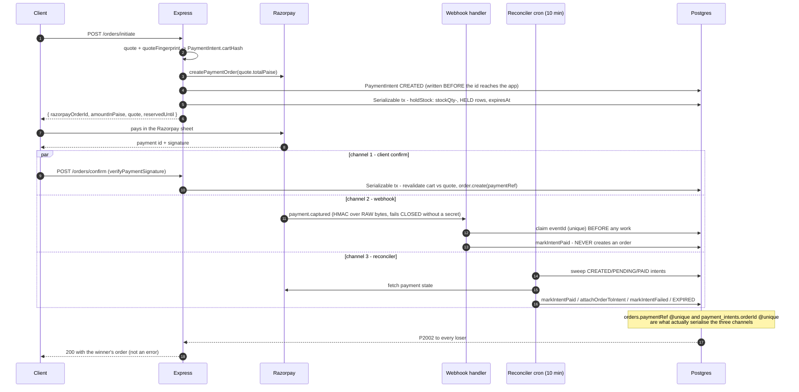

Read the three channels as *terminators*, not as a pipeline: the webhook never creates an
order (the cart may have changed, stock may have sold, and there is no delivery address in
the payload), and the reconciler exists precisely because channels 1 and 2 can both fail.

**The single-order invariant** is enforced at the database, not in code:
`payment_intents.orderId` and `orders.paymentRef` are both `@unique`
(`schema.prisma:670`, `:2809`), so the loser of any race between client confirm,
webhook and reconciler gets `P2002` and returns the winner's order
(`shopPayment.service.js:23-30`).

##### 3.2.2.3 State tables

###### `OrderStatus` (`schema.prisma:2230`)

`Order.status` is **never set directly by a state machine** — apart from creation, buyer
cancel and the admin refund, it is a *derived rollup* recomputed from the order's items:

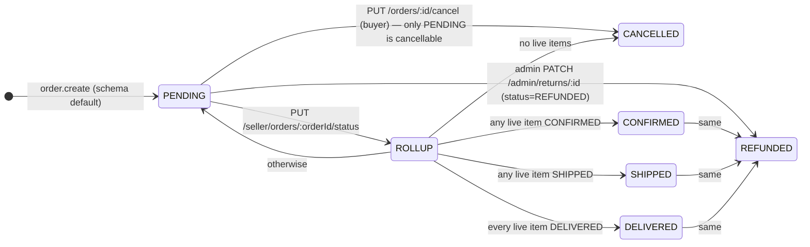

`live` = items whose status is not `CANCELLED`. The rollup is evaluated **inside** the same
Serializable transaction that moves the item, so the order and its items can never disagree.

| From | To | Trigger | Where |
|---|---|---|---|
| — | `PENDING` | `order.create` (schema default) on both checkout paths | `agristore.routes.js:1338`, `:1789` |
| `PENDING` | `CANCELLED` | `PUT /orders/:id/cancel` (buyer). **Only** `PENDING` is cancellable | `agristore.routes.js:1428-1431` |
| any | derived rollup | `PUT /seller/orders/:orderId/status` recomputes from the order's items **inside** the Serializable tx | `agristore.routes.js:2565-2578` |
| any | `REFUNDED` | admin `PATCH /admin/returns/:id` with `status=REFUNDED`, atomically with the ReturnRequest | `admin/returns.routes.js:126-130` |

Rollup rule (`agristore.routes.js:2569-2578`), where `live` = items whose status
is not `CANCELLED`:

| Condition | Order status |
|---|---|
| no items at all | `PENDING` |
| no live items | `CANCELLED` |
| every live item `DELIVERED` | `DELIVERED` |
| any live item `SHIPPED` | `SHIPPED` |
| any live item `CONFIRMED` | `CONFIRMED` |
| otherwise | `PENDING` |

A partially-cancelled order therefore reads by its *live* items — one item
cancelled and one delivered reads `DELIVERED`.

###### `OrderItem.status` — a plain `String @default("PENDING")`, not an enum (`schema.prisma:663`)

**There is no state-machine guard on this transition**, and the diagram has to show that
honestly — the validator restricts the *set* of accepted values, not the *edges*, so every
state reaches every other state:

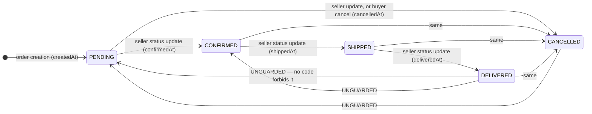

The dashed intent is "forward only"; the code enforces none of it. The four timestamp
columns are the only source for dispatch SLA and cancellation rate, so a backwards move
also corrupts seller metrics.

| From | To | Trigger | Timestamp stamped |
|---|---|---|---|
| — | `PENDING` | order creation | `createdAt` |
| any | `CONFIRMED` | seller `PUT /seller/orders/:orderId/status` | `confirmedAt` |
| any | `SHIPPED` | same | `shippedAt` |
| any | `DELIVERED` | same | `deliveredAt` |
| any | `CANCELLED` | same, **or** buyer cancel (`updateMany` over the whole order) | `cancelledAt` |

`transitionTimestampFor(status, at)` (`sellerMetrics.service.js:176-185`) is a
pure function merged into the same `updateMany` that sets the status. These four
columns are the **only** source for dispatch SLA and cancellation rate; nothing
but `createdAt`/`updatedAt` existed before, which made those metrics literally
uncomputable. **There is no state-machine guard** — a seller may move an item
from `DELIVERED` back to `PENDING`-adjacent states; the validator only restricts
the *set* of values. A seller-set `CANCELLED` restocks the listing (the item is
skipped if it was already `CANCELLED`).

###### `ReturnStatus` (`schema.prisma:2239`)

| From | To | Trigger | Side effect |
|---|---|---|---|
| — | `REQUESTED` | schema default | — |
| any | `APPROVED` / `REJECTED` / `COMPLETED` | admin `PATCH /admin/returns/:id` | `resolvedBy` set; audit `RETURN_UPDATE` |
| any | `REFUNDED` | admin `PATCH /admin/returns/:id` | atomic `$transaction([returnRequest.update, order.update{status:REFUNDED, paymentStatus:'refunded'}])`; `refundAmount` defaults to the order total and is rejected when it exceeds it |

**Gap (verified by exhaustive grep):** no route outside
`backend/src/routes/admin/returns.routes.js` reads or writes `returnRequest` —
`prisma.returnRequest` appears only there and in `sellerMetrics.service.js:76`.
There is **no buyer-facing endpoint that creates a ReturnRequest**, so the
`returnEligible` / `returnWindowDays` fields frozen onto every `OrderItem` at
checkout currently have no consumer, and `SellerProfile.returnRate` can only
become non-zero through rows an admin inserts by other means. There is also no
state-machine guard on the admin transition — any status may go to any status,
and `REFUNDED` may be applied repeatedly.

###### `PaymentIntentStatus` (`schema.prisma:2821`)

```mermaid
stateDiagram-v2
    [*] --> CREATED : createIntent() at /orders/initiate
    CREATED --> PAID : markIntentPaid() — confirm, webhook payment.captured/order.paid, or reconciler
    PAID --> PAID : markIntentPaid() is unconditional (see the caveat below)
    PAID --> ORDER_CREATED : attachOrderToIntent() — unique orderId is the gate
    ORDER_CREATED --> PAID : REGRESSION — redelivered webhook; the reconciler repairs it within 10 min
    CREATED --> FAILED : reservation failure at initiate / webhook payment.failed / reconciler
    PAID --> FAILED : reconciler sees a failed gateway payment
    CREATED --> EXPIRED : reconciler — no payment attempt, older than INTENT_EXPIRY_MINUTES (30)
    CREATED --> REFUND_INITIATED : webhook refund.created
    PAID --> REFUND_INITIATED : webhook refund.created
    ORDER_CREATED --> REFUND_INITIATED : webhook refund.created
    REFUND_INITIATED --> REFUNDED : webhook refund.processed
    ORDER_CREATED --> [*]
    FAILED --> [*]
    EXPIRED --> [*]
    REFUNDED --> [*]
    note right of ORDER_CREATED
        TERMINAL = ORDER_CREATED, FAILED,
        CANCELLED, REFUNDED, EXPIRED.
        PENDING and CANCELLED are declared
        in the enum but written by NO code path.
    end note
```

| From | To | Trigger | File |
|---|---|---|---|
| — | `CREATED` | `createIntent()` at `/orders/initiate`, before the app receives the gateway id | `shopPayment.service.js:55-73` |
| `CREATED`/`PAID` | `PAID` | `markIntentPaid()` — from `/orders/confirm`, from the webhook's `payment.captured`/`order.paid`, or from the reconciler on a captured payment with no order | `shopPayment.service.js:84-105` |
| `PAID` | `ORDER_CREATED` | `attachOrderToIntent()` after a successful confirm (unique `orderId` is the gate), the webhook when it finds an `Order` by `paymentRef`, or the reconciler | `:117-129`, `shopWebhooks.routes.js:134-139`, `shopPayment.service.js:230-241` |
| non-terminal | `FAILED` | `markIntentFailed()` — reservation failure at initiate, webhook `payment.failed`, reconciler seeing a failed gateway payment | `:107-115` |
| non-terminal | `EXPIRED` | reconciler: no payment attempt and `createdAt` older than `INTENT_EXPIRY_MINUTES = 30` | `:271-275` |
| any | `REFUND_INITIATED` | webhook `refund.created` (`updateMany` by `providerPaymentId`) | `shopWebhooks.routes.js:165-172` |
| any | `REFUNDED` | webhook `refund.processed` | same |
| — | `PENDING`, `CANCELLED` | **never written by any code path in `backend/src/`** — declared in the enum and read by the reconciler's `status: { in: ['CREATED','PENDING','PAID'] }` filter only | — |

`TERMINAL = {ORDER_CREATED, FAILED, CANCELLED, REFUNDED, EXPIRED}`
(`shopPayment.service.js:39`) — the set `intentPublicStatus()` reports verbatim
and the reconciler does not revisit. Non-terminal states are reported to the app
as `CONFIRMING` (when `PAID`) or `PENDING`, each with an explicit "do not pay
again" message (`:305-325`).

**Caveat (`A2-10`):** `markIntentPaid()` writes `status:'PAID'` unconditionally, with no
predicate on the current status, despite the comment "Never regress a state that
already produced an order" (`shopPayment.service.js:87-92`). The webhook calls it
before checking `intent.orderId`, so a `payment.captured` redelivered after the
client confirm already produced an order regresses `ORDER_CREATED → PAID`; the
following block only re-binds when the *pre-read* `intent.orderId` was null. The
reconciler repairs this within 10 minutes because it sweeps `PAID` intents, finds
the `Order` by `paymentRef` and re-sets `ORDER_CREATED`. On `P2002` (the payment
id is already bound to a different intent) `markIntentPaid` refuses to overwrite
and returns the existing row instead.

###### `ReservationStatus` (`schema.prisma:3187`) — see §3.2.4

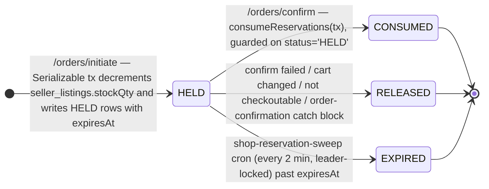

`RELEASED` and `EXPIRED` both return the units to `stockQty`; `CONSUMED` does not, because
the stock was already decremented at `HELD` time. All three are terminal — a released or
expired reservation is never revived, the buyer re-initiates instead.

###### `paymentStatus` (free-text `String` on `Order`, default `'pending'`)

| Value | Written by |
|---|---|
| `pending` | schema default (COD orders keep it) |
| `paid` | `/orders/confirm` |
| `refund_initiated` | webhook `refund.created` → `order.updateMany({ where:{ paymentRef } })` |
| `refunded` | webhook `refund.processed`, and admin return `REFUNDED` |

##### 3.2.2.4 Address and serviceability

`resolveDeliveryAddress(req)` (`agristore.routes.js:1234-1288`) accepts either
`deliveryAddressId` (looked up scoped to `userId`) or an inline
`deliveryAddress`. The inline path applies **the same rules as
`POST /addresses`**, because posting the object straight to checkout previously
bypassed them entirely: required `name/phone/city/state/pincode`; per-field
length caps (`name` 100, `phone` 20, `flat` 100, `street` 200, `city` 100,
`state` 100, `landmark` 200); `^[1-9][0-9]{5}$` pincode; `^[6-9][0-9]{9}$` on the
last 10 digits of the phone. The result is `deepStripHtml`'d before it is stored
as JSON.

Serviceability (`serviceability.service.js`) resolves most-specific-first —
exact pincode → 3-digit prefix → district → state — and the fourth case, **no
`SellerServiceArea` rows at all**, is the backwards-compatibility guarantee:
`source:'unconfigured'`, serviceable, platform default ETA. A seller who *has*
configured areas but does not cover the pincode gets `serviceable: !cfg.strict`,
driven by `shop.serviceability.strict` (default **false**, i.e. advisory only).
`resolveServiceability` does one `findMany` narrowed by the geography predicates
plus one `groupBy` to learn which sellers are configured at all — two queries for
the whole cart, regardless of seller count. `pickRow()` deliberately picks the
most *specific* rule, not the cheapest or fastest: a seller who wrote a slow,
expensive rule for one pincode meant it.

##### 3.2.2.5 Seller ledger and payout — the wiring gap

| Model | Purpose | Written by |
|---|---|---|
| `SellerLedgerEntry` (`schema.prisma:2632`) | signed, append-only ledger. `SALE` positive; `COMMISSION`/`REFUND`/`PAYOUT` negative; `ADJUSTMENT` signed. `balanceAfter` snapshotted per row. Balance = `SUM(amount)` | **`admin/finance.routes.js:87`** (manual `ADJUSTMENT`) and `settlement.service.js:143` (the `PAYOUT` debit). **Nothing in the order lifecycle writes a `SALE` or `COMMISSION` row** |
| `Payout` (`schema.prisma:2662`) | one payout per seller per settlement window. `@@unique([sellerId, periodFrom, periodTo])` stops a seller being paid twice for the same window | `settlement.service.js:132-141` |

`generatePayoutForPeriod(sellerId, from, to)`
(`settlement.service.js:88-170`):

```
payable = SALE(window) − commission − REFUND(window) − priorPayouts(overlapping windows, status != FAILED)
commission = COMMISSION(window) if any rows exist, else SALE(window) × marketplace.commissionRatePct / 100
amount     = payable.toDecimalPlaces(2, ROUND_DOWN)      refuses (exposed 400) when payable <= 0
```

Then, atomically: create the `PENDING` `Payout` **and** a negative `PAYOUT`
ledger entry whose `balanceAfter` is `SUM(all entries) − amount`. `PayoutStatus`
= `PENDING | PROCESSING | PAID | FAILED`; an admin transitions it with a method
and reference.

The service's own header states that seeding `SALE`/`COMMISSION`/`REFUND` rows
from completed orders is out of scope and a follow-up
(`settlement.service.js:16-19`). **Consequence for a reader reasoning about this
system: the seller ledger is not currently driven by orders.** Commission derives
from the rate rather than from rows, and `priorPayouts` is the only idempotency
basis, matched on window *overlap* rather than on ledger `createdAt`.

---

#### 3.2.3 Money handling

##### 3.2.3.1 Units and types

| Layer | Representation | Notes |
|---|---|---|
| Postgres | `DECIMAL(12,2)` for amounts, `DECIMAL(5,2)` for `taxRatePct`, `DECIMAL(10,3)` for `weightKg`, `DECIMAL(10,2)` for `surcharge` | rupees, 2 dp |
| Prisma / server arithmetic | `Prisma.Decimal` via `backend/src/utils/money.js` | `D(v)` coerces anything money-ish; JS numbers are `String()`-ified first so `0.1` is captured, not the float's binary expansion; `null`/`NaN`/garbage → 0 |
| Payment gateway | **integer paise** | `toMinorUnits(value, 100)` = `D(v).times(100).toDecimalPlaces(0).toNumber()`; exact — `19.99 → 1999`, never `1998.9999` |
| HTTP response | JS **number** | `serializeDecimals()` at the boundary (`response.js:20-29`) |
| Quote fields | fixed-2 **strings** (`'1048.00'`) plus `totalPaise` as an integer | `buildQuote` returns `.toFixed(2)` everywhere |

`money.js` exists because native JS operators corrupt `Prisma.Decimal`: `+`
triggers string concatenation (`0 + decimal → "0100.5"`) and `*`/`-`/`/` coerce
to float. Helpers: `D`, `sumD(list, pick)`, `round2(v, dp=2)`, `toMinorUnits`.

##### 3.2.3.2 The quote is the only payable (`shopPricing.service.js`)

The rule: *the client sends a cart, the server returns a QUOTE, the quote is the
only thing that may become an order, and its `total` is the only amount that may
be charged.* Before this, the delivery fee lived in the mobile app
(`total >= 999 ? 0 : 49` in `CartScreen.js`) and was never sent anywhere — the
farmer approved ₹1,048, the order was created for ₹999, and the Razorpay order
was raised for ₹999 too.

Every rate is an AppSetting, never a constant:

| Setting | Default | Applied |
|---|---|---|
| `shop.delivery.feePerShipment` | 49 | once per **seller** (one shipment = one dispatch), suppressed when the shipment qualifies for free delivery |
| `shop.delivery.freeAboveSubtotal` | 999 | judged **per shipment on that seller's goods only**, never on the cart-wide total |
| `shop.delivery.heavyFee` | 250 | per `HEAVY` line; **never** waived by the free-delivery threshold — it is a real transport cost |
| `shop.delivery.freightQuoteRequired` | true | a `FREIGHT` line makes the quote emit blocking `FREIGHT_QUOTE_REQUIRED` rather than guess a parcel fee for a rotavator |
| `shop.delivery.codFee` | 0 | flat, once per order, only when `paymentMethod === 'cod'` |
| `shop.tax.enabled` | **false** | when off, tax is 0 and prices are final |
| `shop.tax.pricesIncludeTax` | true | see below |
| `shop.tax.defaultRatePct` | 0 | fallback for a product with no `taxRatePct` |
| `shop.returns.defaultWindowDays` | 7 | frozen onto each order item |
| `shop.returns.nonReturnableCategoryIds` | `[]` | category ids whose items get `returnEligible:false, returnWindowDays:0` |

Shipping classes: `PARCEL | HEAVY | FREIGHT | PICKUP_ONLY`; anything else on the
product row is treated as `PARCEL` (`shopPricing.service.js:60`).

##### 3.2.3.3 Tax — two conventions, and getting them backwards is a money bug

`lineTax(lineTotal, ratePct, cfg)` (`shopPricing.service.js:104-116`):

| Convention | Formula | Moves the payable? |
|---|---|---|
| `pricesIncludeTax = true` (Indian retail default) | `round2(line × r / (100 + r))` | **no** — it is a display split, reported as `amount` with `addedToTotal = 0` |
| `pricesIncludeTax = false` | `round2(line × r / 100)` | **yes** — reported as both `amount` and `addedToTotal` |

`taxRatePct` comes from `Product.taxRatePct` per line, falling back to
`shop.tax.defaultRatePct` — agri-inputs are not one slab (most seeds exempt,
fertilizers 5%, many pesticides 18%, machinery 12%).

##### 3.2.3.4 The arithmetic

```
per line:      lineTotal      = round2(unitPrice × quantity)
per shipment:  goods          = round2(Σ lineTotal)
               parcelFee      = (hasParcel && !freeApplies) ? feePerShipment : 0
               heavyFee       = heavyFee × count(HEAVY lines)
               surcharge      = serviceability row's surcharge
               delivery       = round2(parcelFee + heavyFee + surcharge)
per order:     subtotal       = round2(Σ shipment.goodsSubtotal)
               shipmentDelivery = round2(Σ shipment.deliveryFee)
               codFee         = (paymentMethod === 'cod') ? shop.delivery.codFee : 0
               deliveryFee    = round2(shipmentDelivery + codFee)
               taxAmount      = round2(Σ line.taxAmount)          ← reported
               taxAddedToTotal= round2(Σ line.taxAddedToTotal)    ← charged
               discountAmount = 0                                 (coupons not implemented)
               total          = round2(subtotal + deliveryFee + taxAddedToTotal − discountAmount)
               totalPaise     = toMinorUnits(total)
```

Rounding is `Decimal.toDecimalPlaces(2)` (half-up, Decimal.js default) applied
per line and per shipment before summing, so the displayed lines add up to the
displayed totals. The one `ROUND_DOWN` in the codebase is the payout amount
(`settlement.service.js:124`), which rounds in the platform's favour.

Order ETA is the **slowest** shipment's `etaMaxDays` — an order is not delivered
until every part of it is (`shopPricing.service.js:452-454`).

##### 3.2.3.5 Three independent anti-tamper checks at checkout

1. **`assertClientTotalMatches(expected, authoritative)`**
   (`agristore.routes.js:133-141`) — compared in **integer paise**, throws a 400
   carrying `err.tamper = { kind:'client_total_mismatch', expectedPaise, actualPaise }`.
   `expectedTotal` keeps its historical meaning (the goods **subtotal**) so an
   un-upgraded app still validates; `expectedPayable` is the new field for the
   charged amount. Both are optional; both are checked when sent.
2. **`assertCartMatchesQuote(orderItems, quote)`** (`agristore.routes.js:1090-1108`)
   — the basket the order is written from must equal the basket the quote priced,
   keyed on `(listingId|productId):quantity:price(2dp)`. Closes the gap created by
   pricing outside the transaction; refuses with **409 `CART_CHANGED`** and can
   name what moved.
3. **`quoteFingerprint(quote)`** (`shopPricing.service.js:127-139`) — SHA-256 over
   the sorted `listingId:qty:unitPrice` list plus the total, truncated to 32 hex
   chars, frozen on `PaymentIntent.cartHash` at initiate and recomputed at
   confirm. A same-total basket with different items passes the amount check but
   fails this one.

Plus, on the online path only and skipped in mock mode
(`agristore.routes.js:1734-1750`):

- `paymentOrder.receipt === intent.receipt` → `tamper.kind = 'receipt_mismatch'`.
  The old receipt was `cart_${userId}` — identical for every payment that user
  ever made — so the check proved only that the gateway order belonged to this
  user, never to *this* checkout.
- `toPaise(quote.total) === Number(paymentOrder.amount)` →
  `tamper.kind = 'paid_amount_mismatch'`.

`raisePaymentTamperAlarm()` (`paymentTamper.service.js`) runs **outside** the
rolled-back transaction, from the route's catch, so the audit row and incident
survive. It writes `AUDIT_ACTIONS.FRAUD_PAYMENT_TAMPER` always and a deduped
`FRAUD` security incident at most once per user per hour (Redis `SET NX EX`,
3600 s). Severity: `MEDIUM` for `paid_amount_mismatch` and `receipt_mismatch`,
`LOW` for `client_total_mismatch` (usually benign price drift). It never throws
and never changes the response the buyer already got.

##### 3.2.3.6 Order money columns

`orderTotalsFromQuote(quote)` (`shopPricing.service.js:467-497`) is the only
producer of the order's money columns, so what is written is provably what was
quoted: `totalAmount`, `subtotal`, `deliveryFee`, `taxAmount`, `discountAmount`,
`promisedEtaDays`, `deliveryPincode`, and `pricingSnapshot` — a frozen JSON copy
carrying `version`, `pricedAt`, `fingerprint`, `taxIncludedInPrice`, `codFee`,
`shipmentDeliveryFee` and the per-shipment breakdown. An invoice reprinted a year
later shows what was charged, not what today's settings would say.

`orderItemExtrasFromQuote(quote)` freezes the per-line display snapshot
(`productName`, `productNameMr`, `productImage`, `brand`, `unit`, `packSize`,
`sellerName`, `taxRatePct`, `taxAmount`, `returnEligible`, `returnWindowDays`)
keyed by cart item id; `withOrderItemSnapshots` merges it and adds
`batchNumber`, `batchExpiry`, `labelVersion` from the compliance verdict
(`agristore.routes.js:1197-1222`). Order history used to JOIN `products` for the
name and image, so an admin edit silently rewrote what a farmer's two-year-old
order said they had bought.

---

#### 3.2.4 Stock and oversell prevention

##### 3.2.4.1 Where stock lives

`SellerListing.stockQty` is the **single authoritative sellable counter**. The
decisive design choice in `stockReservation.service.js:22-32` is that it keeps
its existing meaning — "units available to sell right now" — so every read path
(buy box, product list, cart validation, storefront filter) is untouched. The
alternative (leave stock alone, subtract live reservations at read time) would
have required all of those paths to learn about reservations, and any one that
forgot would oversell. `ProductBatch.quantity` records *which lots* make up the
number and deliberately does **not** move `stockQty`
(`sellerCompliance.routes.js:271-277`).

##### 3.2.4.2 The batched decrement (`utils/stockBatch.js`)

`applyListingStockDeltas(tx, deltas)` folds every delta into **one** statement:

```sql
UPDATE seller_listings AS l
SET "stockQty" = l."stockQty" + v.delta
FROM (VALUES (id,delta), …) AS v(id, delta)
WHERE l.id = v.id
  AND l."stockQty" + v.delta >= 0
RETURNING l.id, l."stockQty" AS "stockAfter", (l."stockQty" - v.delta) AS "stockBefore"
```

Properties that matter:

- **Constant statement count per checkout**, regardless of cart size — the naive
  per-item loop made write latency (and the Serializable lock window) scale with
  the cart.
- **Duplicate listing ids are summed** before the VALUES list is built, because an
  `UPDATE` with several matching VALUES rows applies only one of them.
- **A `>= 0` guard in SQL**, unlike the older product-targeted `applyStockDeltas`
  which had none. A row that would go negative simply does not match, the
  `RETURNING` count comes up short, and the function throws a client-safe
  `statusCode: 400, expose: true` "An item in your cart just sold out." It is
  defence in depth, **not** a replacement for validating first.
- Deliberately **not** `GREATEST(stockQty + delta, 0)` — clamping would turn an
  oversell into a *successful* order for the wrong quantity.
- `crossedZero` = ids where `(stockBefore > 0) !== (stockAfter > 0)`, computed in
  the same round-trip; it drives buy-box cache invalidation.

`applyStockDeltas` (the `products.stock` version) is retained only for the
dual-write window and is dropped at CONTRACT.

##### 3.2.4.3 Isolation and race handling

Every stock-mutating path runs `prisma.$transaction(..., { isolationLevel: 'Serializable' })`
wrapped in `withSerializableRetry(...)` (`utils/txRetry.js`): COD checkout,
online confirm, add-to-cart, `holdStock`, `releaseReservations`, seller order
status change, and rent booking creation. Two buyers racing for the last unit is
a **normal marketplace event**, so a Postgres 40001 abort is replayed rather than
surfacing as a 500. `server.js:298` injects
`setSerializableConflictObserver(() => recordEvent(SHOP_EVENTS.INVENTORY_CONFLICT))`
so conflicts are counted; the observer is injected rather than imported so
`txRetry` keeps no service dependency.

Add-to-cart was previously check-then-upsert across two statements, so two
concurrent adds could both pass the stock check; read + validate + write now
share one Serializable transaction (`agristore.routes.js:966-1017`).

##### 3.2.4.4 Reservations — `ReservationStatus` state table

| From | To | Trigger | Stock effect |
|---|---|---|---|
| — | `HELD` | `holdStock(tx, {userId, providerOrderId, lines, ttlMs})` at `/orders/initiate`, when `shop.reservation.enabled` (default true) | `stockQty −= qty` **now**, before the payment sheet opens |
| `HELD` | `CONSUMED` | `consumeReservations(tx, providerOrderId)` inside a successful `/orders/confirm` | none — the units were already taken |
| `HELD` | `RELEASED` | `releaseReservations(providerOrderId, reason)` | `stockQty += qty` |
| `HELD` | `EXPIRED` | only for rows with a **null** `providerOrderId` (defensive; the write path always sets one) | none |

`shop.reservation.ttlMinutes` default **15** — long enough for a UPI approval on
a weak signal, short enough that an abandoned sheet does not keep stock off the
shelf. `reservationConfig()` clamps to `max(1, ttl) × 60000` ms.

**Four release paths, all converging on one idempotent function:**

| Path | Where |
|---|---|
| confirm failure (any refusal or thrown error) | `agristore.routes.js:1684`, `:1700`, `:1826` |
| webhook `payment.failed` | `shopWebhooks.routes.js:157` |
| reconciler (`FAILED`, `EXPIRED`, or captured-with-no-order) | `shopPayment.service.js:255`, `:265`, `:277` |
| TTL sweeper, every 2 minutes | `server.js:309` |

`releaseReservations` runs in its **own** Serializable transaction (callers reach
it from error paths where the original transaction already rolled back), reads
the `HELD` rows, transitions exactly those ids with a `status:'HELD'` predicate,
and restocks only if the `updateMany` count is non-zero. Reading then updating
would let two concurrent releases both see `HELD` and both restock. A failed
release is logged at ERROR — held-forever stock is invisible lost inventory — and
the sweeper retries it.

`sweepExpiredReservations({ batchSize = 200 })` selects `distinct
providerOrderId` among expired `HELD` rows and releases each, so a burst of
abandonments does not become one enormous transaction holding locks across the
catalogue.

##### 3.2.4.5 The holder-vs-OUT_OF_STOCK problem

Reserving the last unit drives the listing to `stockQty = 0`, and
`syncListingStockStatus` then flips it to `OUT_OF_STOCK` — correct for everyone
else, and catastrophic for the holder, who would be locked out of the purchase
the reservation exists to protect. Both validation layers count the holder's own
units back:

- `validateLine(line, reservedByListing)` (`shopPricing.service.js:200-249`):
  `held = reservedByListing.get(listingId)`; `available = stockAvailable + held`;
  and a listing in `OUT_OF_STOCK` **passes** when `held > 0`. `BLOCKED` and
  `INACTIVE` never pass — those are trust-and-safety and seller decisions, not
  stock arithmetic.
- `validateCartForCheckout(tx, userId, { reservedByListing })`
  (`agristore.routes.js:1119-1197`) applies the identical rule inside the
  transaction.

`/orders/confirm` resolves `heldFor(razorpayOrderId)` **before** building the
quote, precisely so the quote sees the map.

##### 3.2.4.6 Fallback and observability

If `consumeReservations` transitions **zero** rows (reservations disabled, or the
TTL expired and the sweeper released them), confirm falls back to decrementing
inside the same transaction — which may legitimately throw, landing the buyer on
the paid-but-no-order path (`agristore.routes.js:1801-1811`).

Counters (`shopMetrics.service.js:78-108`): `OUT_OF_STOCK_HIT` (raised in
add-to-cart), `INVENTORY_CONFLICT`, `INVENTORY_OVERSELL_BLOCKED`,
`RESERVATION_HELD/CONSUMED/RELEASED/EXPIRED`. The derived
`out_of_stock_rate = OUT_OF_STOCK_HIT / (OUT_OF_STOCK_HIT + CART_ADD_OK)` — a
rising value means the catalogue is advertising stock it does not have.

---

#### 3.2.5 Regulated-goods compliance

Before this layer, a pesticide was a `products` row in a category called "Crop
Protection" and was sold by exactly the same code path as a hand trowel — no
licence check, no batch, no expiry, no recall, and no way to stop a sale in one
state (`shopCompliance.service.js:1-13`).

##### 3.2.5.1 Models and who may write them

| Model | Seller may | Admin may | Blocks a sale when |
|---|---|---|---|
| `SellerLicence` (`schema.prisma:2863`) — one row per `(sellerId, kind)`, `@@unique([sellerId, kind])`, private Cloudinary `documentIds[]` | **submit / resubmit only** — `POST /seller-compliance/licences` always writes `status:'PENDING'` and nulls `reviewedBy/At/rejectionReason`; a renewal returns to PENDING | approve → `APPROVED` (`LicenceStatus` = `PENDING\|APPROVED\|REJECTED\|EXPIRED\|SUSPENDED`) | the product's `regulatedKind` is in `compliance.requireLicenceKinds` **and** the seller has no row, or its status ≠ `APPROVED`, or `validTo < now` |
| `ProductCompliance` (`schema.prisma:2922`) — `@@unique productId`, all label text transcribed verbatim | submit via `PUT /seller-compliance/products/:productId/compliance`, **only for a product this seller created** (the record is shared by every seller of it); always lands `PENDING_REVIEW` | approve → `APPROVED` (`ComplianceStatus` = `DRAFT\|PENDING_REVIEW\|APPROVED\|REJECTED\|SUSPENDED`) | `compliance.requireApprovalBeforePublish` **and** `status !== 'APPROVED'` |
| `ProductBatch` (`schema.prisma:2985`) — `@@unique([listingId, batchNumber])` | **create/update freely — this is the deliberate exception**, because it is inventory and requiring admin approval per carton means nobody records any | set `QUARANTINED` / `RECALLED`, which the seller cannot lift (403 on edit) | no sellable lot exists (see 5.3) |
| `ProductRecall` (`schema.prisma:3023`) — scoped to a product, optionally narrowed to a `batchNumber` and/or `sellerId` | — | create / deactivate | an active recall matches the product and (if narrowed) the seller and/or one of the listing's batch numbers |
| `SaleBlock` (`schema.prisma:3053`) — `scope ∈ PRODUCT\|SELLER\|CATEGORY\|BATCH\|STATE\|DISTRICT`, optional `expiresAt`, separate internal `reason` and buyer-facing `publicMessage` | — | create / expire | any active block matches — **checked first, so an operator stop-sale wins over everything else** |

The "seller may submit, only an admin may approve" boundary is enforced once, in
`rejectProtectedFields` (`sellerCompliance.routes.js:51-66`), which 403s on any
of `status`, `reviewedBy`, `reviewedAt`, `rejectionReason`, `sellerId`, `id` —
stripped rather than merely omitted from the validator, because a
mass-assignment hole in exactly this file would make the whole compliance layer
decorative. The router-level guard is `authenticate + requireRole('SELLER',
'VERIFIED_FARMER','ADMIN')`.

`Category.isRegulated` (`schema.prisma:288`) is a **category flag, not a
hard-coded name list**, because category names are admin-editable;
`requiresComplianceApproval(product)` reads it and falls back to the product's own
`ProductCompliance.regulatedKind` (`shopCompliance.service.js:428-445`).

##### 3.2.5.2 The sale gate — `evaluateSaleEligibility({ lines, buyer, now })`

Consulted at three points, and batched by design: **five queries total regardless
of cart size** (`shopCompliance.service.js:150-195`) — product compliance,
seller licences, listing batches, active recalls, and the cached block list.

| Point | Effect of a refusal |
|---|---|
| add-to-cart (`POST /cart`) | **409** with `reason` = the machine-readable code, before the buyer commits |
| quote (`loadPricedCart` → `complianceIssuesFrom`) | a blocking `COMPLIANCE_BLOCKED` issue visible on the cart screen, not at the payment sheet |
| checkout (both paths, via `loadPricedCart`) | the quote is not checkoutable ⇒ 409 (`/orders`) or the paid-but-blocked path (`/confirm`) |

Evaluation order per line (the order is the semantics):

| # | Check | Code | Applies to |
|---|---|---|---|
| 5 | active `SaleBlock` match | `SALE_BLOCKED` | **every** product, regulated or not — checked first |
| — | `regulatedKind === 'NONE'` or no compliance row | *allowed* | everything else short-circuits here |
| 4 | active `ProductRecall`, narrowed by seller / batch when the recall was | `PRODUCT_RECALLED` | regulated |
| 1 | `compliance.status !== 'APPROVED'` (when `requireApprovalBeforePublish`) | `COMPLIANCE_NOT_APPROVED` | regulated |
| 2 | seller licence for `kind` missing or not `APPROVED` | `SELLER_UNLICENSED` | when `kind ∈ compliance.requireLicenceKinds` |
| 2b | licence `validTo < now` | `SELLER_LICENCE_EXPIRED` | same |
| 3 | no batch recorded at all | `BATCH_REQUIRED` | when `compliance.requiresBatch && compliance.blockExpiredSale` |
| 3b | every lot `QUARANTINED`/`RECALLED` and none unexpired | `SALE_BLOCKED` (held-stock message) | same |
| 3c | lots exist but none with enough shelf life | `SHELF_LIFE_TOO_SHORT` | same |
| 3d | lots exist and all are past expiry | `EXPIRED_STOCK` | same |

`SaleBlock` matching (`shopCompliance.service.js:110-135`): `PRODUCT`/`SELLER`/
`CATEGORY` match on the id; `BATCH` matches when the block's `batchNumber` is
among the listing's batch numbers; `STATE`/`DISTRICT` match case-insensitively on
the **buyer's** geography and may additionally be narrowed to one product or one
seller — an unnarrowed geography block stops the whole class of sale in that
place, which is what a state-level regulator restriction actually means.

Batch selection is **FEFO**: `SELLABLE_BATCH_STATES = {ACTIVE, EXPIRING_SOON}`,
`quantity > 0`, and either no expiry date (allowed only when
`!compliance.requiresExpiry`) or `daysBetween(expiryDate, now) >= max(compliance.minShelfLifeDays, compliance.minShelfLifeDaysDefault)`.
The earliest-expiring sellable lot is returned as `verdict.batch` so short-dated
stock clears first, and its `batchNumber`/`expiryDate` plus
`compliance.labelVersion` are frozen onto the `OrderItem`.

The batch query deliberately fetches **all** statuses, not just sellable ones:
filtering to `ACTIVE` made an offer whose only lot had expired look like an offer
with *no* lot, so the refusal came back as `BATCH_REQUIRED` when the truth was
`EXPIRED_STOCK` — same block, but the seller would go re-enter a batch that is
already there (`shopCompliance.service.js:168-178`).

Master switch: `compliance.enabled` (default true). When off, every line is
allowed — "stops enforcing but keeps recording".

##### 3.2.5.3 Configuration

| Setting | Default |
|---|---|
| `compliance.enabled` | `true` |
| `compliance.requireLicenceKinds` | `['PESTICIDE','INSECTICIDE','FUNGICIDE','HERBICIDE','PLANT_GROWTH_REGULATOR']` |
| `compliance.requireApprovalBeforePublish` | `true` |
| `compliance.blockExpiredSale` | `true` |
| `compliance.minShelfLifeDaysDefault` | `30` (a product may require more, never less) |
| `compliance.expiryAlertDays` | `45` |
| `compliance.safetyNotice` | a fixed string pointing at the approved label and a qualified professional |

`RegulatedKind` = `NONE | SEED | FERTILIZER | BIO_PRODUCT | PESTICIDE |
INSECTICIDE | FUNGICIDE | HERBICIDE | PLANT_GROWTH_REGULATOR`.
`BatchStatus` = `ACTIVE | EXPIRING_SOON | EXPIRED | RECALLED | QUARANTINED | DAMAGED`.

##### 3.2.5.4 The safety panel — the platform authors nothing

`getProductSafetyPanel(productId)` (`shopCompliance.service.js:378-426`) returns
`null` for anything whose `regulatedKind` is `NONE`, and otherwise returns the
approved-label fields **verbatim**, each `null` when the manufacturer did not
supply it, plus `sourcedFromApprovedLabel: true` and the platform's standing
`safetyNotice`. There is deliberately no fallback text, no derived dosage, and no
combination advice of any kind — the file states this twice as an invariant
(`shopCompliance.service.js:29-36`, `:2913-2919` in the schema doc comment). The
app renders `approvedCrops`/`targetPests` as-is and must not present them as a
recommendation for the farmer's specific crop.

`GET /products/:id` also surfaces an active `ProductRecall` inline
(`severity`, `reason`, `advice`, `batchNumber`) — a recall must be visible **on
the page**, not only enforced at add-to-cart.

##### 3.2.5.5 Sweeps and recall fan-out

- `sweepBatchExpiry({ now })` — daily at 03:10 container-local, leader-locked
  (`server.js:354`). One `$transaction` of two idempotent `updateMany`s: lots
  past their date → `EXPIRED`; `ACTIVE` lots inside `expiryAlertDays` →
  `EXPIRING_SOON`. Bumps the sale-block cache when anything expired.
- `findAffectedBuyers({ productId, batchNumber, sellerId, limit })`
  (`shopCompliance.service.js:483-511`) answers "who bought this lot" by reading
  `order_items.batchNumber` — the **frozen snapshot** is the only reason the
  question is answerable at all, since live inventory says nothing about what
  shipped six weeks ago. Served by `@@index([batchNumber])` on `order_items`.
- Sale-block cache: ns `agristore:saleblocks`, key `all`, TTL 120 s, loaded
  **whole** (`take: 5000`) rather than queried per line — a marketplace has a
  handful of live blocks and the alternative is one query per cart line on the
  hottest write path. `invalidateSaleBlocks()` is called on every batch write and
  after the expiry sweep.

---

#### 3.2.6 AnimalTrade and Rent lifecycles

##### 3.2.6.1 Shared privacy model

Both marketplaces route every row through a projection function so a column added
to the model cannot leak by default (`animalListing.service.js:1-24`,
`rentListing.service.js:1-27`):

| Never in a public response | Where it is instead |
|---|---|
| exact `lat`/`lng` | selected for distance computation, destructured away in `toPublicListing` / `toPublicMachinery` / `toPublicLabour`; only `hasCoords` and a coarsened `distanceKm` survive |
| phone numbers | behind `GET /:id/contact` — authenticated, 30/hour, audit-logged (`ANIMAL_CONTACT_REVEAL` / `RENT_CONTACT_REVEAL`). The number itself is never written to the log, only who asked for whose |
| `kycStatus` | summarised into `verification.level` |

`coarseDistanceKm(km) = max(1, round(km))` — accurate enough for "is this worth
the trip?", useless for triangulating a farmer's home from three known points.
Cache keys bucket coordinates to ~1 km (`Math.round(v*100)/100`) so neighbours
share an entry and the key itself never records a precise position.

**Verification is a server fact.** An animal listing is `VERIFIED` only when an
admin flipped `AnimalListing.verified`; the seller's KYC state is surfaced
separately as `ID_VERIFIED`, and `verified` is never read from a request body
(`animalListing.service.js:57-72`, `animaltrade.routes.js:836`, `:874-877`).
Rent listings have no admin-verified flag, so their only signal is
`ownerIdVerified` from KYC.

`ownPhoneOnly(supplied, accountPhone)` (`rent.routes.js:141-145`) forces a rent
lister to publish their **own** account number: anything else falls back to their
own, so a listing cannot be used to make a rival's phone ring all season with no
trace back to the author. Applied on both create and update for machinery and
labour.

##### 3.2.6.2 Animal listing lifecycle

`ListingStatus` = `ACTIVE | SOLD | RENTED | INACTIVE` (`schema.prisma:2277`);
animal listings use `ACTIVE`, `SOLD`, `INACTIVE`.

| Transition | Trigger | Notes |
|---|---|---|
| — → `ACTIVE` | `POST /animals` | `expiresAt = now + 45 days` (`LISTING_TTL_DAYS`) |
| `ACTIVE` ↔ `SOLD` ↔ `INACTIVE` | `PATCH /animals/:id/status` (owner) or `PUT /animals/:id` | re-activating resets `expiresAt` + `lastRenewedAt`; audit `ANIMAL_STATUS_CHANGE` |
| any → `ACTIVE` | `POST /animals/:id/renew` | fresh 45-day TTL |
| any → `INACTIVE` | `DELETE /animals/:id` (owner or ADMIN) | soft delete via `archiveResource`, which records `RESOURCE_ARCHIVE`; a hard delete would lose the attached chat history |
| `ACTIVE` → `INACTIVE` | hourly cron `expireStaleAnimalListings()` (`server.js:384`, cron `15 * * * *`) | `updateMany` where `status='ACTIVE' AND expiresAt < now`; rows with a **null** `expiresAt` (pre-column, un-backfilled) are left alone rather than guessed at; bumps the cache when anything expired |

**Duplicate suppression at create** (`animalListing.service.js:180-198`): same
seller + same animal + same breed + same price within 60 minutes returns the
existing listing at 200 with `X-Duplicate-Suppressed: true`. It runs **before**
the Cloudinary upload, so a double-tap on a village connection costs nothing.
This is an accident guard, distinct from `contentFraud`'s scoring.

**Upload validation** (`animaltrade.routes.js:711-741`): magic-byte sniffing for
JPEG/PNG/GIF/BMP/WEBP (RIFF….WEBP) and HEIC/HEIF/AVIF (`ftyp` box brand),
≤6 files, ≤15 MB each, non-empty. multer's `fileFilter` only sees the
client-declared mimetype, which a `.php` renamed `.jpg` passes.

**Search and geo.** Search is AND-of-OR groups: one group per query word, each
carrying that word's Marathi/English equivalents via `searchGroups()`, so
"jersey cow" needs both words. The normalised `searchText` haystack is preferred,
with a `searchText: null` fallback to per-column ILIKEs for un-backfilled rows.
Raw-SQL enum comparisons come from fixed lookup tables (`STATUS_SQL`,
`GENDER_SQL`) so the SQL text stays constant regardless of input
(`animaltrade.routes.js:239-247`). The geo path pushes bounding box, Haversine
circle, ordering and LIMIT/OFFSET into Postgres via `geoPageIds`; the previous
implementation selected every id inside the radius into Node and fed them back as
a `WHERE id IN (…)` list. `strict: radius != null` so a radius query never
silently includes coordinate-less rows.

**Reports and blocks.**

| Action | Model | Uniqueness |
|---|---|---|
| `POST /animals/:id/report` | `ListingReport` | `@@unique([listingId, reporterId])` — a second tap updates rather than inflating the count. Cannot report own listing. Reasons: FRAUD, ALREADY_SOLD, WRONG_DETAILS, ABUSIVE, SPAM, OTHER |
| `POST/DELETE /animals/sellers/:sellerId/block` | `UserBlock` | `@@unique([blockerId, blockedId])`; cannot block self |

`blockedUserIds(viewerId)` returns everyone the viewer blocked **plus everyone
who blocked them** — a block hides both directions, so a blocked buyer cannot
keep browsing and re-contacting through a second listing. It never throws (a
Redis/DB blip degrades to "show everything"). A viewer with any blocks bypasses
the shared list cache entirely, so personalised results are never written to or
served from it.

**Chat handoff** (`Chat` / `ChatMessage`, `schema.prisma:901`/`919`):

- `POST /animals/:id/chat` upserts on `@@unique([listingId, buyerId])` — one
  thread per (listing, buyer). Refused for self-chat, `INACTIVE` listings and
  blocked pairs.
- `GET /animals/chats/my` is the cross-listing inbox; it returns a
  `counterpart{id,name,avatar}` with **no phone** — handing every chat partner's
  number to the client turned the inbox into a contact dump that never required a
  deliberate reveal.
- `GET /animals/chats/:chatId/messages` pages **backwards from newest** with a
  `before` cursor (`limit+1` detects a further page without a COUNT) and returns
  ASC so the client appends without reversing; the legacy `?page=` ASC shape is
  still honoured. It marks the counterpart's unread messages read and emits
  `messages_read` to the `chat.id` socket room.
- `POST /animals/chats/:chatId/messages` is idempotent on
  `@@unique([chatId, clientMsgId])`: a pre-read returns the existing row, and a
  racing insert's `P2002` is caught and resolved to the winner — both with
  `Idempotent-Replay: true`, so a retry produces no second row and no second push.
  Emits `new_message` to the chat room and to `user:<buyerId>` / `user:<sellerId>`,
  then fires a best-effort `sendPushToUser` with `type: 'NEW_MESSAGE'`
  (`'animal_chat'` is not in the `NotificationType` enum and used to make
  `notification.create` throw, so the recipient was never notified).

There is **no order, no payment and no escrow** in AnimalTrade — the entire
handoff is chat plus an audited phone reveal.

##### 3.2.6.3 Rent (machinery + labour) lifecycle

Listing statuses reuse `ListingStatus`; `ACTIVE` and `INACTIVE` are the only
values written here. `DELETE` soft-deletes through `archiveResource`. Both
`PUT` handlers write only from an explicit **allow-list** of keys (22 for
machinery, 21 for labour), HTML-strip the text keys (CREATE always did, UPDATE
did not, which reopened the stored-XSS hole), and revalidate coordinates and the
availability window against the merged post-update state.

`available`, `availableFrom`, `availableTo` are seller-declared; `bookedStatus`
is **derived** per request from live bookings (`deriveBookedStatus`):

| Condition | `bookedStatus` |
|---|---|
| a CONFIRMED/ACTIVE booking covers today | `BOOKED` |
| a CONFIRMED/ACTIVE booking starts in the future | `RESERVED` |
| otherwise | `null` |

Because `bookedStatus` is baked into the **cached** list payload,
`PUT /bookings/:id/approve` bumps both `rent:machinery` and `rent:labour`
namespaces. (`/reject` and `/cancel` do **not** bump them, so a rejected or
cancelled booking's effect on `bookedStatus` waits out the 30 s TTL — a minor
inconsistency, not a correctness break, since `RESERVED`/`BOOKED` is advisory.)

###### `BookingStatus` (`schema.prisma:2247`) state table

| From | To | Trigger | Authorized party | Side effects |
|---|---|---|---|---|
| — | `PENDING` | `POST /rent/bookings` | renter (not the listing owner) | Serializable tx; `notifications` row for the owner (fire-and-forget, outside the tx) |
| `PENDING` | `CONFIRMED` | `PUT /rent/bookings/:id/approve` | **listing owner** (`isOwner`) | `notifications` "Booking Approved!"; both rent caches bumped; **contacts released** |
| `PENDING` | `CANCELLED` | `PUT /rent/bookings/:id/reject` | listing owner | `notifications` "Booking Not Approved" |
| any except `COMPLETED`/`CANCELLED` | `CANCELLED` | `PUT /rent/bookings/:id/cancel` | **renter** (`isRenter`) — the owner declines via `/reject` | — |
| `CONFIRMED` | `ACTIVE`, `COMPLETED` | *(no endpoint in this router writes these; they exist in the enum and are read by contact-release and conflict logic)* | — | — |

`loadBookingForCaller(bookingId, user)` (`rent.routes.js:1044-1063`) is the single
source of truth for "who may touch this booking" — the only parties are the
renter (`booking.userId`) and the listing owner
(`machineryListing.ownerId` / `labourListing.providerId`) — so every per-booking
read and mutation authorizes the same way and there is no IDOR through
inconsistent checks.

**Booking creation invariants** (`rent.routes.js:1288-1372`), all inside one
Serializable transaction:

1. Exactly one of `machineryListingId` / `labourListingId`.
2. `endDate >= startDate`; `days = daysBetweenInclusive(start, end)` capped at 365.
   **The client's `days` and `totalAmount` are accepted for backward
   compatibility and ignored** — a request for 1–30 January with `days: 1`
   previously blocked the machine for a month and charged for a day.
3. Listing must exist and be `ACTIVE`.
4. **Self-booking refused** (403).
5. Dates must lie inside `[availableFrom, availableTo]`, compared at `YYYY-MM-DD`
   granularity to avoid timezone drift.
6. Overlap conflict against `PENDING|CONFIRMED|ACTIVE` bookings ⇒ **409**.
   Serializable isolation is what makes the check-then-insert safe against
   concurrent double-booking.
7. `totalAmount = D(pricePerDay) × days` for machinery, `× workerCount` for
   labour, `toDecimalPlaces(2)`.

**Counterparty exposure before consent** (`redactBookingContacts`,
`rentListing.service.js:130-155`): a booking request is not yet a relationship.
Phone numbers (and the listing's `lat`/`lng`) are held back until the booking is
in `CONTACT_OK_STATES = {CONFIRMED, ACTIVE, COMPLETED}`, and the response carries
an explicit `contactsReleased` flag. The viewer's own number is never hidden from
them. Previously `/bookings/received` handed the owner the renter's number the
instant a PENDING request arrived — anyone could surface a stranger's phone by
requesting their listing and never following through.

`hasBookingRelationship(userId, {machineryListingId|labourListingId})` reports
whether the caller already has a `PENDING|CONFIRMED|ACTIVE|COMPLETED` booking, so
the contact-reveal response can tell the client to skip the "share my number?"
nudge — it does **not** bypass the rate limit or the audit log.

**Rent has no reports and no user-block mechanism** — those exist only in
AnimalTrade. Disputes for both marketplaces are handled by the separate `Dispute`
model (`schema.prisma:2694`, `DisputeType` = `ANIMAL_TRADE | RENT_BOOKING |
ORDER`), which is admin/support-owned and out of this router group.

---

#### 3.2.7 Webhook idempotency and replay protection

##### 3.2.7.1 The three rules the endpoint obeys

Stated as the router's contract (`shopWebhooks.routes.js:20-31`):

1. **Verify the signature over the RAW BYTES.** Re-serialising parsed JSON does
   not reproduce what was signed (key order, unicode escaping, whitespace), so
   the router is mounted with `express.raw({ type: '*/*', limit: '256kb' })`
   ahead of the global JSON parser — at the app level, not inside the router,
   because by the time a router runs body-parser has already consumed the stream
   (`app.js:206-211`).
2. **Fail closed.** `verifyWebhookSignature` returns `false` when
   `RAZORPAY_WEBHOOK_SECRET` is unset and logs at ERROR
   (`payment.service.js:171-176`). This endpoint can mark money as received with
   no authenticated user behind it, so "no secret" must mean "reject".
3. **Be idempotent.** Redelivery is normal — Razorpay retries for 24 hours.

`verifyWebhookSignature(rawBody, signature)`: rejects a signature that is not
64 hex chars **before** `timingSafeEqual`, because `timingSafeEqual` throws
`RangeError` on unequal buffer lengths and `Buffer.from(x,'hex')` silently
truncates non-hex — a client sending `"zz"` produced an uncaught 500 instead of a
clean rejection. The same regex guard is applied in
`verifyPaymentSignature` for the checkout signature
(`payment.service.js:139-141`), which uses a **different secret**
(`RAZORPAY_KEY_SECRET`) over a **different payload** (`orderId|paymentId`).

##### 3.2.7.2 Claim-first, work-second

```
verify signature      → 400 on failure, recordEvent(WEBHOOK_BAD_SIGNATURE)
JSON.parse raw        → 400 on failure
eventId = webhookEventId(payload)  = `${event}:${refundId || paymentId || orderId || randomUUID()}`
payloadDigest = sha256(raw)
claimWebhookEvent(...)             → INSERT into payment_webhook_events (eventId is @unique)
   throw  → 500 (Razorpay retries; losing the event entirely is worse)
   false  → 200 { duplicate:true } + X-Webhook-Replay: true, recordEvent(WEBHOOK_DUPLICATE), nothing changed
   true   → run the handler
finishWebhookEvent(eventId, { status, error })   PROCESSED | IGNORED | FAILED  (+ processedAt)
```

`PaymentWebhookEvent` (`schema.prisma:2836`): `eventId @unique` does the work —
the insert either succeeds (first delivery) or throws `P2002` (a redelivery),
which `claimWebhookEvent` translates to `false`. The **raw payload is
deliberately not stored** (it carries buyer contact details and card metadata);
only `providerOrderId`, `providerPaymentId`, `eventType` and a SHA-256
`payloadDigest` are kept.

`webhookEventId(payload)` derives a stable id as `(eventType, entity id)` because
Razorpay's body has no guaranteed unique event id across every event type — and
that is exactly the granularity idempotency needs: `payment.captured` for
`pay_X` must be processed once, however many times it is delivered. The
`randomUUID()` fallback fires only when the payload carries **no** refund,
payment or order id, in which case the event is unidentifiable anyway and the
handler's `if (!providerOrderId)` branch marks it `IGNORED`.

`finishWebhookEvent` swallows its own errors — the event row is telemetry and
must never fail the webhook.

##### 3.2.7.3 Per-event behaviour

| Event | Action | HTTP |
|---|---|---|
| `payment.captured`, `order.paid` | no `providerOrderId` ⇒ `IGNORED`. No local `PaymentIntent` ⇒ logged at **ERROR** ("captured payment has no local intent") and marked `FAILED` — a real hole worth an alert, not a silent 200. Otherwise `markIntentPaid({providerOrderId, providerPaymentId, amountPaise: entity.amount})`, then, when the pre-read intent had no `orderId`, look up `Order` by `paymentRef` and bind `ORDER_CREATED` | 200 |
| `payment.failed` | `markIntentFailed(reason = error_description ?? error_reason)` and `releaseReservations(providerOrderId, 'payment failed')` — the units go back on the shelf **now** rather than sitting out the TTL, which on a nearly-sold-out product is the difference between the next farmer buying it and being told it is gone | 200 |
| `refund.created` | `paymentIntent.updateMany({ where:{providerPaymentId} }, status:'REFUND_INITIATED')` + `order.updateMany({ where:{paymentRef} }, paymentStatus:'refund_initiated')` | 200 |
| `refund.processed` | same with `REFUNDED` / `'refunded'` | 200 |
| anything else | `IGNORED` | 200 |
| handler throws | `finishWebhookEvent(FAILED, err.message)`, `recordEvent(WEBHOOK_FAIL)` | **500** |

##### 3.2.7.4 What it deliberately does not do

**It never creates an order.** By the time a webhook arrives the buyer's cart may
have changed, stock may have sold, and there is no delivery address in the
payload — fabricating an order from a payment would produce a shipment nobody
chose (`shopWebhooks.routes.js:24-31`). It records the payment against its
intent; the client's confirm creates the order; reconciliation escalates anything
left paid-with-no-order for a human to refund.

**Known limitation:** on a handler failure the event row is already claimed, so
Razorpay's retry short-circuits as a duplicate and the failed work is never
re-attempted through the webhook channel. This is acknowledged in the code
(`shopWebhooks.routes.js:190-193`) — recovery is the reconciler's job, which asks
the gateway directly rather than waiting for another delivery.

##### 3.2.7.5 The third channel — the reconciler

`reconcilePendingPayments({ olderThanMinutes = 10, limit = 200 })`
(`shopPayment.service.js:202-300`), cron `*/10 * * * *`, leader-locked
(`server.js:339`). It sweeps intents in `{CREATED, PENDING, PAID}` older than the
cutoff and asks Razorpay what happened, because the client that would have told
us is gone. No-ops entirely in mock mode.

| Gateway says | Local action | Reservation |
|---|---|---|
| captured/authorized **and** an `Order` exists with that `paymentRef` | `ORDER_CREATED` + `orderId` + `reconciledAt` + note "order already existed" | left alone (consumed) |
| captured/authorized **and no order** | `PAID` + note "PAID WITH NO ORDER — needs manual refund or fulfilment"; `recordEvent(PAYMENT_CAPTURED_NO_ORDER)`; `logger.error` | **released** — no order is coming, so the units belong to the marketplace, not to a hold nothing will consume |
| failed | `FAILED` + the gateway's `error_description` | released |
| no payment at all and `createdAt` older than 30 min | `EXPIRED` + note "no payment attempt within window" | released — an abandoned payment sheet produces no signal at all |

It deliberately does **not** auto-create an order for an orphaned capture: the
cart is long gone and stock may have sold, so inventing an order would be worse
than escalating a refund. `checkShopAlerts()` alerts on a **single** occurrence
of `PAYMENT_CAPTURED_NO_ORDER` — there is no acceptable rate for money held
against nothing.

The client-facing counterpart is `GET /orders/payment-status/:providerOrderId`,
which reports `CONFIRMING` (intent `PAID`, order not yet created) as a state
distinct from `FAILED`, each with an explicit "do not pay again" message —
showing the second when the first is true is how a farmer pays twice.

##### 3.2.7.6 Mock mode

`isMockPayments()` is evaluated **per call**, not frozen at module load
(`payment.service.js:31-40`). With no `RAZORPAY_KEY_ID`/`KEY_SECRET`:
`createPaymentOrder` returns `mock_order_<8hex>`, `verifyPaymentSignature`
returns `true`, `fetchPaymentOrder` returns `{id, mock:true}` (no amount to bind
against, which is why confirm's receipt/amount checks are skipped when
`paymentOrder.mock`), `fetchPayment` returns `captured`, `fetchOrderPayments`
returns `[]`, and `GET /payment-config` reports `onlineEnabled: false` with
`methods: ['cod']` so the app never opens a checkout sheet it cannot complete.
All real gateway calls run through `razorpayBreaker()` with a 10 s timeout and
`isFailure: httpFailure`, so 4xx does not trip the breaker but 5xx/timeout/network
does.

---

#### 3.2.8 Scheduled jobs owned by this group

| Cron | Job | Leader-locked | Purpose |
|---|---|---|---|
| `*/2 * * * *` | `sweepExpiredReservations()` | yes (`shop-reservation-sweep`) | backstop release for abandoned payment sheets — the only path that produces no signal |
| `*/5 * * * *` | `checkShopAlerts()` | **no** — per-process in-memory counters, so every instance evaluates its own | checkout failure rate > 0.15, `shop GET /products` p95 > 2500 ms, any orphaned capture |
| `*/10 * * * *` | `reconcilePendingPayments({olderThanMinutes:10})` | yes (`shop-payment-reconcile`) | N instances hitting the gateway with the same intents would be wasteful and rate-limited |
| `7 * * * *` | `refreshAllSellerMetrics()` | yes (`seller-metrics-refresh`) | derives buy-box w2/w4; hourly rather than every 5 min because the inputs move on the scale of days and the job bumps the buy-box cache namespace |
| `15 * * * *` | `expireStaleAnimalListings()` | yes (`animal-listing-expiry`) | livestock sells in days; a months-old ad is the main source of "I called and it was sold ages ago" |
| `10 3 * * *` | `sweepBatchExpiry()` | yes (`shop-batch-expiry-sweep`) | selling an expired pesticide is a regulatory failure, so this is scheduled rather than lazy-on-read |
| (5 min, in `server.js`) | `refreshActiveSellerStats()` | yes | re-warms `seller:stats:<id>` rollups for sellers who actually used the dashboard, capped at 1000/tick, fan-out 5 |

`refreshAllSellerMetrics` (`sellerMetrics.service.js:138-172`) refreshes every
seller with activity in `sellerMetrics.windowDays` (default 180) plus up to 500
whose `metricsUpdatedAt` is null, in batches of 10, then invalidates the whole
buy-box namespace. Per seller it computes `rating`/`ratingCount` (from reviews
attributed to the **seller**, which is only possible because `Review.sellerId`
and `Review.orderItemId` now exist), `cancellationRate` over terminal items,
`onTimeDispatchRate` judged against **that listing's own** `dispatchSlaDays`, and
`returnRate` over delivered items. Items with a null `shippedAt` (pre-split rows
whose transition timestamps were never invented by the backfill) are excluded
from both numerator and denominator, never scored as late; `onTimeDispatchRate`
with no history is `1`, not `0`, so a new Kendra does not start at the bottom.
`metricsUpdatedAt` is stamped only when there is *something* to stand on —
while it is null the buy box treats the seller as unrated. The computed rating is
mirrored onto `seller_listings.rating/ratingCount` so an offer row can be
rendered without joining back through `SellerProfile`.

---

#### 3.2.9 Caching and invalidation map

`utils/listingCache.js` is a Redis cache-aside keyed
`cache:<ns>:s<CACHE_SCHEMA_VERSION>:v<runtimeCounter>:<sha1(identity)[0:16]>`.
Invalidation is a single `INCR` on the namespace's version key — O(1), no `SCAN`,
no pattern delete, safe on a clustered Redis; orphaned keys just TTL out. The
schema version gives a deploy that changes a payload's *shape* a disjoint key
space. Everything degrades gracefully: when Redis is not `ready` the loader runs
directly, uncached, without error.

| Namespace | TTL | Key identity | Bumped by |
|---|---|---|---|
| `agristore:categories` | 300 s | `v2:all` | never bumped explicitly — TTL only |
| `agristore:products` | 60 s | full filter tuple, or `facets:<categoryId>` | `invalidateCatalogCaches()` |
| `agristore:buybox` | 60 s | `[variantId, district, taluka, village, state]` lower-cased | `invalidateBuyBox()` (inside `invalidateCatalogCaches`), and `refreshAllSellerMetrics` |
| `agristore:saleblocks` | 120 s | `all` | `invalidateSaleBlocks()` — batch writes, expiry sweep |
| `agristore:serviceability` | 300 s | `<productId>:<pin>` | never bumped explicitly — TTL only |
| `animals:listings` | 30 s | filter tuple + ~1 km coordinate bucket | every animal listing create/update/status/renew/delete/expiry |
| `rent:machinery`, `rent:labour` | 30 s | filter tuple + ~1 km bucket | listing create/update/delete, booking **approve** |
| `seller:stats:<id>` (plain key, not this helper) | 600 s | seller id | cron re-warm; TTL is the safety net if the leader or Redis is down |

`invalidateCatalogCaches()` callers: catalog product create, both legacy seller
product create/update/delete, listing create/patch/delete, review submit, and
checkout / cancel / seller-status-change **only when `crossedZero.length > 0`**.

---

#### 3.2.10 Observability

`shopMetricsMiddleware('shop')` wraps the whole `/agristore` mount and times on
`res.on('finish')`, so the measurement covers the handler **and** the response
write — the part a farmer on a 2G link actually waits through. Labels are route
**templates**: `routeTemplate()` replaces UUIDs, any 16+ char id-shaped token and
numeric segments, capped at 80 chars. That is what makes the metrics safe to
export — without it every product id a farmer opened would become a distinct
label in a third-party dashboard, i.e. an itemised browsing history, and for
crop-protection products a sensitive one (`shopMetrics.service.js:27-33`,
`:212-224`). Search is timed under its own `shop search` label because it has the
tightest responsiveness budget and is otherwise buried in the generic
product-list label.

Latency uses a bounded 500-sample ring buffer per label with percentiles computed
on read (`p50/p95/p99/max/avg`, nearest-rank) — exact for the window, O(1) to
record, memory capped regardless of traffic. Percentiles rather than a mean
because a mean hides the exact failure this module cares about: 95% of catalogue
reads at 80 ms and 5% at 9 s (cache miss falling through to a filtered count over
the whole catalogue) reads as a comfortable 500 ms average while one farmer in
twenty stares at a spinner.

Counters are enumerated in `SHOP_EVENTS` rather than free-form so a typo cannot
silently create a parallel metric nobody is graphing. Derived rates:
`checkout_failure_rate`, `cart_add_failure_rate`,
`payment_confirm_failure_rate`, `out_of_stock_rate`. `getShopMetricsFlat()`
exposes everything as flat `shop_*` numbers on `/readyz`. `resetShopMetrics()`
resets the alert baseline together with the counters — clearing one and not the
other leaves the windowed delta negative and silently suppresses the next alert,
which looks exactly like a healthy system.

---

#### 3.2.11 Fraud / abuse controls on commerce routes

| Control | Where mounted | Default policy |
|---|---|---|
| `velocityGuard(VELOCITY_ACTIONS.ORDER)` | `POST /orders`, `POST /orders/confirm` | window 3600 s, flag at 6, **block at 12**, scored independently on user / device / IP and combined by taking the worst (`env.js:136`) |
| `velocityGuard(VELOCITY_ACTIONS.REFUND)` | `PUT /orders/:id/cancel` | window 86400 s, flag at 3, **block at 6** (`env.js:139`) |
| `refundAbuseGuard()` | `PUT /orders/:id/cancel` | account-level rate over order history: lookback 90 days; **flag** at ≥3 refunds and ≥50%; **restrict** (403) at ≥5 refunds and ≥70%. Both tiers need a minimum *count* so 1 order + 1 cancel = 100% cannot trip it. Fails **open** — a scoring glitch must never block a legitimate cancellation. A restriction lifts itself as old behaviour ages out of the window; the incident is deduped to one per user per day |
| `idempotency(feature)` | `shop_order`, `shop_payment_initiate`, `shop_payment_confirm`, `animal_create`, `rent_booking` | client-supplied `Idempotency-Key` header; Redis `SET NX EX` 24 h; a completed 2xx is replayed verbatim with `Idempotent-Replay: true`; an in-flight duplicate gets **409**; a non-2xx releases the claim so a legitimate retry works. **Fails open** when no key is sent or Redis is down |
| `recordDeviceLink` | after a successful `/orders` or `/orders/confirm` | fire-and-forget when `ENV.DEVICE_FINGERPRINT_ENABLED` |
| `flagListingIfSuspicious` / `flagReviewIfSuspicious` | catalog product create, legacy seller product create, review submit | fire-and-forget when `ENV.CONTENT_FRAUD_ENABLED`; `contentFraud` keeps its burst / new-account job but **no longer owns "is this a duplicate"** — that is the blocking gate in `catalogMatch` |

Both `VELOCITY_ENABLED` and `REFUND_ABUSE_ENABLED` default to
`NODE_ENV !== 'test'`.

`refundAbuse.service.js` counts "refunds" as orders in `{CANCELLED, REFUNDED}` —
the only refund signal the schema models today — over two indexed `COUNT`s. When
a real Razorpay refund flow lands it sets the same states and feeds this
assessment unchanged.

---

#### 3.2.12 Scalability and correctness notes for a future reader

- **Buy-box read amplification.** `GET /products/:id` issues one cached ranking
  call *per variant*; a product with 6 pack sizes is 6 cache lookups (each a DB
  ranking query on a miss). `GET /products/:id/offers` bypasses the cache
  entirely and always ranks every variant. `GET /listings` (seller) ranks once
  per *distinct* variant on the page — the fix for a previous 50-rankings-per-page
  bug — but does so with **empty buyer geography**, so a seller's "am I winning?"
  answer is the geography-unrestricted ranking, not what any particular buyer
  sees.
- **Buy-box cache key cardinality.** The key includes district + taluka + village
  + state. A marketplace serving many villages multiplies entries per variant;
  the 60 s TTL is what bounds it.
- **Geo filtering is `ILIKE`.** `listingGeoWhere` uses `equals` +
  `mode:'insensitive'`, which the plain btree on `seller_listings(district)`
  cannot serve. Fixing it needs a `citext` column or a `lower()` expression
  index; the parity decision is documented in `buyBox.service.js:70-78`.
- **Offer-driven sorts are bounded**, not complete: `price_asc`/`price_desc`/
  `discount` rank only the top `min(limit×5, 200)` relevance-ordered rows, and
  `meta.sortScope` says so. `inStock=true` filters after decoration, so
  `meta.total` over-reports.
- **The `popularity` sort reads a counter nothing increments.**
  `SORTS.popularity` orders by `Product.viewCount`
  (`agristore.routes.js:297`), but `GET /products/:id` does not increment it and
  an exhaustive grep of `backend/src/` finds only two writers of
  `Product.viewCount`: none in this router group, and
  `admin/catalogQc.routes.js:406`, which *sums* the counters when an admin merges
  two catalog rows. The animal marketplace does increment its own
  `AnimalListing.viewCount` on detail reads (skipped for the owner). So
  `?sort=popularity` currently orders every product by 0.
- **Two unused `PaymentIntentStatus` values** (`PENDING`, `CANCELLED`) and two
  unused `BookingStatus` values (`ACTIVE`, `COMPLETED`) exist in the enums with
  no writer in `backend/src/`.
- **No buyer-facing returns API.** `returnEligible` / `returnWindowDays` /
  `batchNumber` are frozen onto every `OrderItem`, and `ReturnStatus` has a full
  admin lifecycle, but nothing creates a `ReturnRequest` from the buyer side.
- **The seller ledger is not order-driven.** No `SALE` or `COMMISSION` entry is
  ever written by a checkout path; only manual admin `ADJUSTMENT`s and the
  `PAYOUT` debit exist, and commission falls back to
  `sales × marketplace.commissionRatePct`. Payout idempotency rests on the
  `@@unique([sellerId, periodFrom, periodTo])` constraint plus an overlap-based
  `priorPayouts` sum.
- **No state-machine guards** on `OrderItem.status` (a free-text `String`) or on
  the admin `ReturnStatus` transition — the validators restrict the value set,
  not the legal transitions.
- **Compliance is 5 queries per cart, not per line**, and sale blocks are loaded
  whole (`take: 5000`). Both are deliberate; the block-list bound is the one that
  would need revisiting at scale.
- **`ProductBatch.quantity` never moves `SellerListing.stockQty`** — batches
  describe composition, not availability. Nothing in the routes read here
  decrements a batch's `quantity` on dispatch, so FEFO selection picks the
  earliest-expiring lot but the lot's quantity is only ever seller-maintained.
- **Serializable everywhere on the write paths** means checkout throughput is
  bounded by conflict-and-retry on hot listings; `INVENTORY_CONFLICT` is the
  counter to watch, and `withSerializableRetry` is what keeps 40001 aborts off the
  5xx budget.

---

### 3.3 Agri & AI — assistant, scan, farm, market, weather

> **Canonical home for**: the AI credit ledger (reserve → settle → release), the three scan code paths, chat context assembly and prompt-injection defence on `farm_profile`, voice one-shot and streaming, third-party agronomy data sources, and the multi-farm / crop-cycle model as the API sees it.
> **Defers to**: Part 4 for what happens *inside* FastAPI; Part 1 for cooldowns, feature flags and the Redis key inventory.

#### Express REST API — Group C: agronomy, AI and farm

All paths below are relative to the API prefix mounted in `backend/src/app.js`
(`const API` — routers are mounted at `${API}/<prefix>`, lines 355–408). Column
conventions for every endpoint table:

| Column | Meaning |
|---|---|
| Method / Path | HTTP verb + path **relative to the router mount** |
| Auth | `authenticate` (JWT) / none / owner-scoped |
| Gates | rate limiter, feature flag, credit reserve, idempotency, validators |
| Behaviour | what the handler actually does |
| Failure / notes | error codes, caps, caveats |

##### Router mount table

| Router file | Mount | app.js line |
|---|---|---|
| `ai.routes.js` | `${API}/ai` | 377 |
| `weather.routes.js` | `${API}/weather` | 378 |
| `market.routes.js` | `${API}/market` | 379 |
| `planner.routes.js` | `${API}/planner` | 380 |
| `schemes.routes.js` | `${API}/schemes` | 381 |
| `cropdisease.routes.js` | `${API}/crop-disease` | 370 |
| `cropReportShare.routes.js` | `${API}/crop-reports` | 371 |
| `mandi.routes.js` | `${API}/mandi` | 390 |
| `msp.routes.js` | `${API}/msp` | 391 |
| `soil.routes.js` | `${API}/soil` | 392 |
| `loan.routes.js` | `${API}/loan` | 393 |
| `calendar.routes.js` | `${API}/calendar` | 394 |
| `irrigation.routes.js` | `${API}/irrigation` | 395 |
| `inputs.routes.js` | `${API}/inputs` | 396 |
| `crops.routes.js` | `${API}/crops` | 397 |
| `agriPredict.routes.js` | `${API}/agripredict` | 402 |
| `farm.routes.js` | `${API}/farms` | 406 |
| `farmCropCycle.routes.js` | `${API}` (serves `/farms/:farmId/cycles` **and** `/cycles/:cycleId`) | 407 |

`farmCropCycle.routes.js` is mounted at the bare API root and self-guards with a
path prefix check (`farmCropCycle.routes.js:44-49`): only `/farms/*` and
`/cycles/*` run `authenticate`; everything else `next('router')`s so unknown
`/api/v1/*` URLs 404 instead of 401.

---

#### 3.3.1 Endpoint reference

##### 3.3.1.1 `ai.routes.js` — FarmMind AI (2714 lines, the largest router in the repo)

Router-level guards: `router.param('id', uuidParamGuard)` and
`router.param('sessionId', uuidParamGuard)` (lines 158–160). `:jobId` is
deliberately **not** UUID-guarded — it is a FastAPI job id, not a DB id.

| Method / Path | Auth | Gates | Behaviour | Failure / notes |
|---|---|---|---|---|
| POST `/chat` | yes | `requireFeature('ai_chat')`, `aiChatLimit` (30/60s), `idempotency('chat')`, 6 s Redis cooldown, `reserveCredits` | Loads/creates `AIConversation`, loads last ≤20 turns under a 3000-token budget, builds enriched farm profile, `callFastAPI('/ai/chat')` @120 s, settles credits, persists two `AIMessage` rows + `AIUsage` upsert | 400 empty msg / >1000 chars; 413 image >12 MB base64; 402 no credits; 429 cooldown or upstream 429; 503 upstream busy; 504 timeout. Image attachment reserves against `ai_scan_gemini` (vision) not `ai_chat_gemini` (ai.routes.js:768) |
| POST `/soil-card-ocr` | yes | `requireFeature('ai_soil_ocr')`, `aiChatLimit`, `reserveCredits('ai_soil_ocr')` | Vision OCR of a Soil Health Card via `callFastAPI('/ai/soil-card-ocr')` @60 s; returns structured 12-parameter JSON, never auto-saved | 400 non-image; 413 >12 MB; 402; 504 timeout → "enter values manually" |
| POST `/voice` | yes | `requireFeature('ai_voice')`, `aiVoiceLimit` (15/60s), `idempotency('voice')`, multer audio ≤25 MB, cooldown, `reserveCredits('ai_voice')` | Sarvam STT → FastAPI `/ai/chat` @55 s → optional Sarvam TTS. With `streamId` + `tts` + Socket.IO present it responds immediately and hands the hold to `runVoiceStreamPipeline` | 400 no file; 503 Sarvam missing/failed; 422 empty transcript; 504 timeout. TTS runs concurrently with persist+settle (`Promise.all`, line 1216) |
| POST `/tts` | yes | `aiChatLimit`, `reserveCredits('ai_tts')` | Sarvam TTS of arbitrary text | 400 empty / >1000 chars; 503 no `SARVAM_API_KEY`; 402; 500 on Sarvam error (hold released) |
| POST `/translate` | yes | `aiChatLimit`, `reserveCredits('ai_translate')` | Sarvam `mayura:v1` translate | 400 empty / >2000 chars; 503 no key; 402 |
| GET `/conversations` | yes | — | Text chats only: `isArchived:false`, `isScanSession:false`, `messages: { none: { messageType: 'voice' } }` | page/limit (limit ≤50) |
| GET `/conversations/:id` | yes (owner-scoped find) | uuid guard | Conversation + newest `messageLimit` (default 100, max 200) messages, reversed to chronological; returns `totalMessages`, `messagesTruncated` | 404 not found/not owner |
| DELETE `/conversations/:id` | yes | uuid guard | `archiveResource(req,'AIConversation',id)` → soft delete + `RESOURCE_ARCHIVE` audit event | 404 |
| GET `/voice/conversations` | yes | — | `VoiceConversation` list, `isArchived:false` | limit ≤50 |
| GET `/voice/conversations/:id` | yes | uuid guard | Full voice conversation incl. all messages (no message cap here) | 404 |
| DELETE `/voice/conversations/:id` | yes | uuid guard | `archiveResource(...,'VoiceConversation')` | 404 |
| POST `/scan/submit` | yes | `requireFeature('ai_scan')`, `aiScanLimit` (100/60s), content-type branch (JSON multi-image ≤5 / multipart single), free-tier daily cap, `reserveCredits('ai_scan_gemini')` | Enqueues an async FastAPI scan job; mirrors the credit hold into Redis `scan_ctx:<jobId>`; kicks off parallel Cloudinary uploads; returns `{status:'queued', jobId}` or an inline `done` replay | 400 no image / >5 images; 402; 429 daily limit; upstream 429/503/504 mapped to farmer copy |
| GET `/scan/job/:jobId` | yes | ownership check against Map **and** Redis ctx | Polls FastAPI status; on `done` flattens, settles credits (once, via `scan_settled:<jobId>` Redis NX claim), persists `CropDiseaseReport` | 403 not owner; 500 job failed (hold refunded); 502 unexpected status |
| POST `/scan` (legacy sync) | yes | `requireFeature('ai_scan')`, `aiScanLimit`, multer single image ≤10 MB, free-tier cap, `reserveCredits`, in-flight dedupe per user | Runs FastAPI agentic pipeline **or** in-Express Gemini depending on `ai.useFastapiForScan`; creates a scan `AIConversation` + `CropDiseaseReport` | 503 no AI key; 429 rate/quota; 504 at ≥175 s; 400 unreadable image |
| POST `/scan/:sessionId/chat` | yes, explicit 404/403 split | `requireFeature('ai_chat')`, `aiChatLimit`, cooldown, `reserveCredits('ai_chat_gemini')` | Follow-up Q&A bound to a scan session; injects crop + server-derived state/district so the FastAPI safety gate sees jurisdiction | 404 unknown session, 403 someone else's session, 402, 500 |
| GET `/scan/sessions` | yes | — | Scan-session conversations + first `scanReports` row | limit ≤50 |
| GET `/scan/sessions/:id` | yes | uuid guard | Session + all messages + all `scanReports` incl. `fullReport` JSON | 404. **No message cap** on this route |
| POST `/alerts` | yes | `requireFeature('ai_alerts')`, `aiChatLimit`, `reserveCredits('ai_chat_gemini')`, 30-min per-user in-memory cache | `callFastAPI('/ai/alerts', { farm_profile })` @30 s; caches non-empty batches | Empty batch → hold refunded, `[]` returned; any error → `sendSuccess(res, [])` (alerts are non-critical) |
| GET `/scan/history` | yes | — | Last 20 `CropDiseaseReport` summaries | fixed `take: 20` |
| POST `/scan/feedback` | yes | — | Upsert `DiseaseFeedback` on `(userId, reportId)` | 400 missing fields; 404 report not owned |
| GET `/usage` | yes | — | Today's `AIUsage` row + live free-tier limits + `getCreditSummary` | — |
| GET `/credits` | yes | — | `getCreditSummary(userId)` — balance, tier, transactions, cost table, packs | 500 on failure |

##### 3.3.1.2 `cropdisease.routes.js` — read-only scan history + pincode lookups

The diagnosis endpoint `POST /crop-disease/predict` was **removed** — the header
comment (lines 15–34) records why: it was a second forked diagnosis path calling
`ai.predict.service.js` with no ensemble, no RAG, no `fastapi/safety/validator`,
no rate limiter and no credit gate, persisting unvalidated chemical advice into
the same `CropDiseaseReport` rows the app renders.

| Method / Path | Auth | Gates | Behaviour | Failure / notes |
|---|---|---|---|---|
| GET `/reports` | yes | `listReportsRules` (page ≥1, limit 1–100) | Paginated own reports + share summary; derives `hasReply` / `shareStatus` | — |
| GET `/reports/:id` | yes (owner-scoped) | uuid guard | Full report incl. `fullReport` JSON and all shares with seller info | 404 |
| GET `/soil-info?pincode=` | **none** | `pincodeQueryRules` (6 digits) | `getSoilData(pincode)` — static ICAR-CRIDA zone lookup, Maharashtra only | Public endpoint by design (no AI, no user data) |
| GET `/weather?pincode=` | yes | `pincodeQueryRules` | `getWeatherData(pincode)` → OpenWeatherMap | 503 on failure |

##### 3.3.1.3 `cropReportShare.routes.js` — farmer ↔ Krushi Kendra bridge

The file header (lines 9–30) carries an explicit access matrix that the tests
mirror. Every per-resource handler filters by the caller's id.

| Method / Path | Auth | Gates | Behaviour | Failure / notes |
|---|---|---|---|---|
| GET `/sellers/nearby` | yes | — | Kendra directory. GPS path decrypts up to `CANDIDATE_SCAN_CAP = 1000` seller rows and Haversine-filters in app code (lat/lng are GCM-encrypted so no SQL bounding box is possible); tops up with a district string match. Only `kycStatus:'VERIFIED'` Kendras | radius default 150 km, clamped 1–200; result capped at 30. Cap-hit is logged as a warning, not an error |
| POST `/:reportId/share` | yes, report owner | `body('sellerId')`, `message` ≤500 | Creates `CropReportShare` (idempotent on `(reportId, farmerId, sellerId)`), pushes to seller | 400 self-share / not a Kendra / Kendra unverified; 404 report or seller |
| GET `/me/shares` | yes | — | Farmer's outgoing shares, paginated. **Registered before `/:reportId/shares`** or `uuidParamGuard` would 400 on `reportId="me"` | — |
| GET `/:reportId/shares` | yes, report owner | uuid guard | Shares for one report + resolved `recommendedProducts` | 404 |
| GET `/seller/inbox` | yes (seller = self) | — | Seller inbox, optional `status` filter, plus `unread` count (`readAt: null`) | — |
| GET `/seller/inbox/:shareId` | yes, sharee | uuid guard | Full share + full report; marks `readAt` on first open (fire-and-forget) | 404 |
| POST `/seller/inbox/:shareId/reply` | yes, sharee | `reply` 4–2000 chars, ≤10 product ids | Validates recommended products belong to this seller via the **offer** model (`variants.listings.sellerId` + `status:'ACTIVE'`), with a dual-read legacy fallback on `product.sellerId`; sets `status:'REPLIED'`, pushes a fulfillment-aware notification | Unknown `fulfillment` coerced to `NONE`; 404 not your share |

##### 3.3.1.4 `weather.routes.js`

| Method / Path | Auth | Gates | Behaviour | Failure / notes |
|---|---|---|---|---|
| GET `/` | **none** | lat/lon required + range-validated | Two independently-cached segments composed per request: `forecast` (Open-Meteo, 1 h TTL, 30 min stale-while-revalidate) and `alerts` (IMD scrape, 1 h TTL, 30 min SWR, refreshed via `setImmediate` after the response) | 400 missing/invalid lat/lon; 503 only when Open-Meteo fails *and* no stale L2 row exists. `lang` whitelisted to `en`/`hi` |
| GET `/crops` | **none** | — | Hard-coded 10-crop calendar array (`CROP_CALENDAR`) | Frontend also has a fallback copy |

Both weather endpoints are unauthenticated — verified: no `authenticate` import
in the file.

##### 3.3.1.5 `market.routes.js`

| Method / Path | Auth | Gates | Behaviour | Failure / notes |
|---|---|---|---|---|
| GET `/prices` | yes | crop name ≤60 chars | `getMandiPrices(crop, state, district)` (data.gov.in + DB), sorted by modal price desc | 404 no data; 503 on service error |
| GET `/predict` | yes | crop name ≤60 | `postSignedJSON('/agripredict/predict')` @120 s — signed because FastAPI enforces auth | 404 `insufficient_data`; 503 |
| GET `/crops` | yes | — | With `?state`, an **unsigned** `fetch` to `${AI_BASE}/agripredict/filters/commodities` @5 s; falls back to the static `SUPPORTED_CROPS`/`SUPPORTED_STATES` arrays | Note: this is the one FastAPI call in the group that is *not* HMAC-signed (market.routes.js:113-124) |

##### 3.3.1.6 `mandi.routes.js`

Router guard: `router.param('id', uuidParamGuard)` for alert ids. All list
queries validated to ≤100 chars because the values flow into Prisma `contains`
filters and the data.gov.in query string.

| Method / Path | Auth | Gates | Behaviour | Failure / notes |
|---|---|---|---|---|
| GET `/prices` | yes | `isEnabled('mandi_bhav')`, `locationQueryRules` | `getMandiPrices`; source label derived from the service's `source` field (`db-seeded` / `db-cache` / `data.gov.in`) | 503 flag off; 404 no data. Deliberately does **not** re-sort (that would bury weekly-reporting small mandis) |
| GET `/prices/:commodity/trend` | yes | flag, `trendQueryRules` (days 1–365), `sanitizeSearch` on commodity+market | `getPriceTrend` + 7/30-day moving averages and `priceVsAvgPercent` | 400 missing market; 404 no data |
| GET `/nearby` | yes | flag, `sanitizeSearch` | `getNearbyMandiNames(district)` static map → `MandiPrice` rows from the last 7 days, deduped one-per-market | 404 no mandi list for the district |
| POST `/alerts` | yes | `createAlertRules` | Creates `PriceAlert` (target price, above/below, push/whatsapp/both); strips HTML from names | 201 |
| GET `/alerts` | yes | — | User's alerts | — |
| DELETE `/alerts/:id` | yes | uuid guard | Owner-scoped hard delete | 404 |
| GET `/commodities` | **none** | — | Static `SUPPORTED_COMMODITIES` list | — |

##### 3.3.1.7 `msp.routes.js`

| Method / Path | Auth | Gates | Behaviour | Failure / notes |
|---|---|---|---|---|
| GET `/rates` | yes | `isEnabled('msp_tracker')` | `MSPRate` rows for `{season, year}`, defaulting via `currentSeasonYear()` (Kharif Jun–Nov, else Rabi) | **`{ ...currentSeasonYear(), ...req.query }` spreads the whole query string** — any extra query key is ignored by Prisma but `season`/`year` come straight from the client unvalidated (msp.routes.js:40) |
| GET `/rates/:commodity` | yes | flag, `safeCommodity()` = decode + `sanitizeSearch` | All years for a commodity + a computed trend array | 404 |
| GET `/compare/:commodity` | yes | flag, `safeCommodity`, `sanitizeSearch(state)` | Joins current MSP with the newest `MandiPrice` within 7 days; emits `ABOVE_MSP` / `AT_MSP` / `BELOW_MSP` with Hindi copy | 404 when neither MSP nor mandi row exists |

##### 3.3.1.8 `soil.routes.js`

Numeric bounds table `SOIL_NUMERIC` caps each parameter (pH ≤14, EC ≤50, N/P/K ≤10000,
micronutrients ≤1000) so a `"abc"` becomes a validation error instead of NaN and
`1e308` cannot bloat the row.

| Method / Path | Auth | Gates | Behaviour | Failure / notes |
|---|---|---|---|---|
| POST `/manual` | yes | `isEnabled('soil_health')`, `soilManualRules` | Creates `SoilHealthRecord`, computes per-parameter ICAR ratings (`rateSoilParam`) and an overall `healthScore` | 400 when no parameter supplied; 201 on success |
| GET `/reports` | yes | flag | Own reports, light projection | — |
| GET `/reports/:id` | yes (owner-scoped) | uuid guard | Full record | 404 |
| GET `/recommendation` | yes | flag, `soilRecommendationRules` | Fertilizer plan from `CropMaster.fertilizerSchedule` adjusted ±25 % by N/P/K rating, plus micronutrient/lime/FYM additions; writes the plan back onto the record | 404 unknown report; unit conversion acre/hectare/bigha |
| DELETE `/reports/:id` | yes (owner-scoped) | uuid guard | Hard delete | 404 |

##### 3.3.1.9 `loan.routes.js` — pure calculators, zero external calls

| Method / Path | Auth | Gates | Behaviour | Failure / notes |
|---|---|---|---|---|
| POST `/kcc-eligibility` | yes | `isEnabled('loan_calculator')` | Per-crop NABARD Scale-of-Finance table × area + 10 % contingency; capped at ₹30 lakh; collateral flag above ₹1.6 lakh | 400 invalid area |
| POST `/emi` | yes | flag | Reducing-balance EMI + first-3-and-last month schedule | 400 non-positive principal/rate/tenure |
| GET `/compare` | yes | flag | Static `LOAN_PRODUCTS` (KCC, term loan, gold loan, Mudra) | — |
| GET `/kcc-info` | yes | — | Static KCC explainer, steps, helplines | — |

##### 3.3.1.10 `calendar.routes.js`

| Method / Path | Auth | Gates | Behaviour | Failure / notes |
|---|---|---|---|---|
| POST `/generate` | yes | `isEnabled('crop_calendar')`, `generateCalendarRules` | `generateCalendar()` builds 14+ date-anchored tasks from `CropMaster` (maturityDays, fertilizerSchedule, spacing, seedRate) and creates `CropCalendar` + nested `CropCalendarTask` rows | 404 crop not in master; 201 |
| GET `/today` | yes | flag | Today's due tasks across active calendars + up to 5 overdue | — |
| GET `/` | yes | flag | Calendars with computed `{total, completed, overdue, upcoming}` stats | Loads all tasks per calendar just to count them (N tasks in memory) |
| GET `/:id` | yes (owner-scoped) | uuid guard | Calendar + tasks; **writes** `status:'overdue'` per stale task in a loop on every read | 404. Read path performs O(tasks) writes |
| PATCH `/tasks/:taskId` | yes, explicit 403 | uuid guard, status enum | Marks complete/skipped, sets `completedDate` | 404 / 403 |
| DELETE `/:id` | yes (owner-scoped) | uuid guard | Hard delete (cascades tasks) | 404 |

##### 3.3.1.11 `irrigation.routes.js`

| Method / Path | Auth | Gates | Behaviour | Failure / notes |
|---|---|---|---|---|
| GET `/today` | yes | `isEnabled('irrigation')`, `todayRules` (lat/lon ranges, crop ≤100) | `getIrrigationRecommendation()` — Hargreaves ET₀ → Kc from `CropMaster` → ETc − effective rain; **persists an `IrrigationLog` row on every call** | 503 on weather failure. lat/lon default to Pune (18.52/73.85) when absent |
| GET `/weekly` | yes | flag, `weeklyRules` | Same engine, returns only `weeklyForecast` — so this also writes an `IrrigationLog` row | 503 |
| POST `/log` | yes (owner-scoped) | `logRules` | Sets `farmerAction` = irrigated / skipped / pending | 404 |
| GET `/history` | yes | `historyRules`, `sanitizeSearch(crop)` | Last ≤60 logs within `days` (≤365) | — |

##### 3.3.1.12 `inputs.routes.js`

| Method / Path | Auth | Gates | Behaviour | Failure / notes |
|---|---|---|---|---|
| POST `/calculate` | yes | `isEnabled('input_calculator')`, `calculateInputsRules` | Seed + fertilizer (from `CropMaster.fertilizerSchedule`) + generic labour (15 person-days/acre @₹350) + pesticide budget (₹2500 or ₹5000/acre for high-risk crops) + irrigation (₹3000/acre) | 404 crop not in `CropMaster`. Prices are a hard-coded April-2025 `INPUT_PRICES` table |
| GET `/price-list` | yes | — | The `INPUT_PRICES` table rendered as a list | — |

##### 3.3.1.13 `crops.routes.js`

| Method / Path | Auth | Gates | Behaviour | Failure / notes |
|---|---|---|---|---|
| GET `/` | yes | `isEnabled('crop_master')`, `listCropsRules` | Whole `CropMaster` list (no pagination) filtered by category/season | Unbounded `findMany` — sized by the seeded crop master |
| GET `/search` | yes | `searchCropsRules` (q 2–100), `sanitizeSearch` | ILIKE over `name`/`nameHi`/`nameMr`, `take: 20` | Returns `[]` when q is only wildcards |
| GET `/:name` | yes | flag | Exact (case-insensitive) match on `name` or `nameHi`, full record | 404 |

##### 3.3.1.14 `planner.routes.js`

| Method / Path | Auth | Gates | Behaviour | Failure / notes |
|---|---|---|---|---|
| GET `/tasks` | yes | `listTasksRules` | Tasks for a day, ordered undone-first then priority | — |
| POST `/tasks` | yes | `createTaskRules` | Manual task; title/description passed through `stripHtml` | 201 |
| PUT `/tasks/:id` | yes (owner-scoped) | uuid guard, `updateTaskRules` | Toggle done / edit fields | 404 |
| DELETE `/tasks/:id` | yes (owner-scoped) | uuid guard | Hard delete | 404 |
| POST `/generate` | yes | `requireFeature('ai_planner')`, `generateTasksRules`, 60 s per-user `BoundedMap` cooldown, `reserveCredits('ai_planner')` | `generatePlannerTasks()` → direct Gemini call (`ai.chat.service.js`), then replaces today's `aiGenerated` tasks | 429 cooldown / upstream; 402; 500 when the model returns zero tasks (hold refunded); `holdFinalised` guard prevents a double refund after settle |

##### 3.3.1.15 `schemes.routes.js`

| Method / Path | Auth | Gates | Behaviour | Failure / notes |
|---|---|---|---|---|
| GET `/` | yes | — | Active schemes; state filter matches case-insensitively **or** `state: null` (all-India) | Unbounded `findMany` |
| GET `/eligible` | yes | — | Loads every active scheme then filters in JS on state, `landSizeMaxAcres`, farming type | O(all schemes) per request |
| GET `/applications` | yes | — | Farmer's `SchemeApplication` rows + scheme summary | Registered **before** `/:id` |
| GET `/:id` | yes | uuid guard | Scheme + the caller's application | 404 |
| POST `/ask` | yes | `requireFeature('ai_schemes')`, 10 s `BoundedMap` cooldown, `reserveCredits('ai_schemes')` | Builds a system prompt from up to 20 schemes + the farmer profile, calls `askSchemeQuestion()` → Gemini direct | 400 empty / >500 chars; 429 cooldown; 402; 503 |
| POST `/applications` | yes | — | Upsert on `(userId, schemeId)`; status enum enforced | 400 bad status; 404 unknown scheme |

##### 3.3.1.16 `agriPredict.routes.js` — thin signed proxy to FastAPI

Every handler forwards through `getSigned` / `postSignedJSON`. `_handleProxyError`
maps 504/AbortError → 504, a detail containing `PostgreSQL unreachable` → 503
with farmer copy, other 4xx pass through, everything else → 503.

| Method / Path | Auth | Gates | Behaviour | Failure / notes |
|---|---|---|---|---|
| GET `/filters/states` | yes | — | proxy @15 s | — |
| GET `/filters/districts` | yes | `state` required | proxy @15 s | 400 |
| GET `/filters/commodities` | yes | `state` required | proxy @15 s | 400 |
| GET `/prices/history` | yes | `commodity`+`state` required | proxy @15 s | 400 |
| POST `/predict` | yes | `commodity`+`state` required | Fire-and-forget `deductCredits(user,'ai_chat_claude')` (legacy key, 1-credit floor, **no reserve, no settle, no refund on failure**) then proxy @120 s | 400. This is the only AI route left using the deprecated non-atomic debit path |
| GET `/compare` | yes | required params | proxy @15 s | 400 |
| POST `/sync/trigger` | yes | required params | proxy @10 s, `max_pages` clamped to 50 | Any authenticated farmer can trigger a data.gov.in sync |
| GET `/sync/status` | yes | — | proxy @15 s | — |

##### 3.3.1.17 `farm.routes.js` — multi-farm CRUD

`router.use(authenticate)` applies to all. `writeLimit` = Redis sliding window,
40 writes / 15 min / user, keyed on `req.user.id`. `idemFarm = idempotency('farm_write')`.

| Method / Path | Auth | Gates | Behaviour | Failure / notes |
|---|---|---|---|---|
| GET `/` | yes | — | `listFarms` — active farms + counts of active cycles and soil reports | — |
| POST `/` | yes | `writeLimit`, `idemFarm`, `landSizeAcres` required + `farmValidators` | `createFarm` in a transaction: next `farmNumber`, acre→hectare/gunta conversion, `syncFarmerStats`, sets `activeFarmId` if unset | 500 on failure. Enum-validated `soilType` / `irrigationSystem`; lat 6–38, lon 68–98 (India bbox) |
| GET `/:farmId` | yes (owner-scoped) | `isUUID` | Farm + active cycles + latest soil report + weather history + counts | 404 |
| PATCH `/:farmId` | yes | `writeLimit`, `idemFarm` | `updateFarm`; recomputes derived land units and farmer stats when acreage changes | 404/500 |
| DELETE `/:farmId` | yes | `writeLimit`, `idemFarm` | **Soft delete** (`isActive:false`) inside a transaction; reassigns `activeFarmId` to the next active farm; then `auditArchiveEvent` | 500 |
| POST `/active` | yes | `writeLimit` | Sets `User.activeFarmId` after verifying ownership | 404 |
| GET `/:farmId/insights` | yes (owner-scoped) | limit 1–20, type ≤40 | Non-stale, unexpired `FarmerPrediction` rows | 404 |
| GET `/:farmId/financial-summary` | yes (owner-scoped) | season enum incl. `YTD`, year 2000–2100 | Decimal-exact roll-up of cycle costs/income + per-cycle breakdown | 404 |

##### 3.3.1.18 `farmCropCycle.routes.js` — crop lifecycle

`requireCycleOwner` runs on every `/cycles/:cycleId*` route (`router.use`) and
returns 404/403 before any handler — this closes the IDOR on the read-only
detail and financials endpoints, which query by id alone. `wl` = 120 writes /
15 min / user; `idemCycle = idempotency('cycle_write')`.

| Method / Path | Auth | Gates | Behaviour | Failure / notes |
|---|---|---|---|---|
| GET `/farms/:farmId/cycles` | yes | pagination (limit ≤50) | Paginated list **without** the four JSON log arrays; `orderBy [createdAt desc, id desc]` for stable paging | Note: the farm itself is not ownership-checked on this route (only the cycle routes are) |
| GET `/cycles/:cycleId/logs/:column` | yes + owner | `column` ∈ `activities\|laborLogs\|expenseLogs\|incomeLogs` | DB-side slice of one JSON log, newest first (limit ≤100) | 404 |
| POST `/farms/:farmId/cycles` | yes | `wl`, `idemCycle`, season enum, year int, area >0.01 | `createCropCycle`; rejects area > farm size | 400 / 404 farm |
| GET `/cycles/:cycleId` | yes + owner | isUUID | Cycle + farm summary + 5 newest predictions | 404 |
| PATCH `/cycles/:cycleId` | yes + owner | `wl`, `idemCycle` | `updateCropCycle` — coerces numeric/date fields, otherwise passes `req.body` straight to Prisma | Mass-assignment surface: no field allowlist (cropCycle.service.js:200-224) |
| DELETE `/cycles/:cycleId` | yes + owner | `wl`, `idemCycle` | `deleteMany` scoped by farmerId; predictions `SetNull` | 404 |
| POST `/cycles/:cycleId/stage` | yes + owner | `wl`, `idemCycle` | Sets `growthStage` + `currentStageUpdatedAt` | — |
| POST `/cycles/:cycleId/fertilizer` | yes + owner | `wl`, `idemCycle` | **Read-modify-write** append to `fertilizersUsed` JSON | Lost-update race — see [§3.3.10 Cross-cutting observations](#3310-cross-cutting-observations-for-scalability-and-safe-change), the read-modify-write discussion. (Earlier revisions pointed at "§9", which in this sub-part is *Supporting-file quick reference* — a wrong pointer.) |
| POST `/cycles/:cycleId/pesticide` | yes + owner | `wl`, `idemCycle` | Read-modify-write append to `pesticidesUsed` | same |
| POST `/cycles/:cycleId/irrigation` | yes + owner | `wl`, `idemCycle` | Read-modify-write append to `irrigationLogs` | same |
| POST `/cycles/:cycleId/event` | yes + owner | `wl`, `idemCycle` | Read-modify-write append to `observedEvents`; a `high`/`critical` severity fires `refreshInsights` | same |
| POST `/cycles/:cycleId/activity` | yes + owner | `wl`, `idemCycle` | **Atomic** `jsonb \|\|` append via `appendJsonLog`, cap 2000 | 409 when full; 400 unknown activity type |
| POST `/cycles/:cycleId/labor` | yes + owner | `wl`, `idemCycle` | Atomic append, cap 2000 | 409 when full |
| POST `/cycles/:cycleId/expense` | yes + owner | `wl`, `idemCycle`, `amountInr` ≥0 | Atomic append, cap 2000 | 409 |
| POST `/cycles/:cycleId/income` | yes + owner | `wl`, `idemCycle`, `amountInr` ≥0 | Atomic append, cap 1000 | 409 |
| POST `/cycles/:cycleId/harvest` | yes + owner | `wl`, `idemCycle`, `yieldKg` ≥0 | Records yield (kg/quintal/per-acre), grade, moisture; stage → `HARVESTED` | 404 |
| POST `/cycles/:cycleId/sale` | yes + owner | `wl`, `idemCycle` | Decimal-exact `saleTotalRevenueInr = qty × price`; triggers `refreshInsights` | 404 |
| POST `/cycles/:cycleId/complete` | yes + owner | `wl`, `idemCycle` | `status:'COMPLETED'` + `computeFinancials()` written back; triggers `refreshInsights` | 404 |
| GET `/cycles/:cycleId/financials` | yes + owner | isUUID | Decimal P&L, per-acre economics, ROI %, donut cost breakdown | 404 |

---

#### 3.3.2 The AI credit ledger

Source: `backend/src/services/aiCredit.service.js` (501 lines), models `AICredit`,
`AICreditTransaction`, `AIUsage` in `backend/prisma/schema.prisma:1872-1927`.

##### 3.3.2.1 Who is authoritative

**Express is the authoritative budget.** Every LLM-bearing route in this group
holds credits in Postgres *before* the model call and reconciles after. FastAPI
has its own USD spend cap (it can return 402 with `cap_usd` / `resets_at_utc`,
surfaced by `postSignedJSON` through `err.detail`) but that is a second, coarser
ceiling — the per-user accounting lives entirely in `ai_credits` /
`ai_credit_transactions`. `AIUsage` is a **separate, analytics-only** daily
roll-up; it is written best-effort (`.catch(() => {})` everywhere) and never
gates a charge, but it *does* gate the free-tier daily scan/token limits
(`checkScanLimits`, ai.routes.js:695).

##### 3.3.2.2 Schema

| Model | Key fields | Notes |
|---|---|---|
| `AICredit` | `userId @unique`, `balance` (Int, default 100), `lifetimeEarned`, `lifetimeSpent`, `freeRefillDate`, `tier` | One row per user, lazily created |
| `AICreditTransaction` | `creditId`, `amount` (Int, negative = debit), `balanceAfter`, `type` (the feature key), `description`, `aiModel`, `tokensUsed`, `costUsd` Decimal(14,6), `metadata` Json | `metadata.status` carries `HOLD` → `SETTLED` / `RELEASED`. One row per call, mutated in place |
| `AIUsage` | `@@unique([userId, date])`, `scanCount`, `chatCount`, `totalTokens`, `totalCostUsd`, `monthlyTokens`, `monthlyCostUsd` | `date` is `@db.Date`, keyed at `setUTCHours(0,0,0,0)` |

`monthlyTokens`/`monthlyCostUsd` are incremented on the *daily* row alongside the
daily counters — verified in every upsert site (ai.routes.js:592, 679, 885, 959, 1202, 2457). Nothing in this group resets them per month, so the two
column pairs carry identical values per row; `settings.service.getBudgetSummary`
is what sums `totalCostUsd`/`monthlyCostUsd` across rows.

##### 3.3.2.3 Per-feature cost table (`CREDIT_COSTS`, aiCredit.service.js:52-77)

| Feature key | Floor (credits) | Used by |
|---|---|---|
| `ai_scan_gemini` | 3 | `/ai/scan`, `/ai/scan/submit`, `/ai/scan/job/:jobId`, `/ai/chat` **with an image** |
| `ai_chat_gemini` | 1 | `/ai/chat` (text), `/ai/scan/:sessionId/chat`, `/ai/alerts` |
| `ai_voice` | 2 | `/ai/voice` (both one-shot and streaming) |
| `ai_tts` | 1 | `/ai/tts` |
| `ai_translate` | 1 | `/ai/translate` |
| `ai_soil_ocr` | 3 | `/ai/soil-card-ocr` |
| `ai_planner` | 1 | `/planner/generate` |
| `ai_schemes` | 1 | `/schemes/ask` |
| `ai_pest_rule` | 0 | free / rule-based (no caller in this group) |
| `ai_pest_gemini`, `ai_soil`, `ai_irrigation` | 1 | declared, no caller in this group |
| `ai_calendar` | 2 | declared, no caller in this group |
| `ai_scan_claude` 5, `ai_chat_claude` 2, `ai_chat_groq` 1, `ai_pest_haiku` 1, `ai_pest_sonnet` 5 | legacy | `ai_chat_claude` is still live in `agriPredict.routes.js:103` |

##### 3.3.2.4 Token → credit metering

`creditsForUsage(featureType, tokensUsed, tokensPerCredit)`:
`debit = max(floor, ceil(tokens / tokensPerCredit))`, with `floor === 0` short-circuiting
to free and `tokens <= 0` falling back to the floor. `tokensPerCredit` is resolved
per call from the admin setting `ai.tokensPerCredit` (`liveTokensPerCredit()`),
which rejects non-finite and non-positive values back to `ENV.AI_TOKENS_PER_CREDIT`
(default 1000). A 0 divisor would mint infinite credits and a negative one would
collapse every charge to the floor — both are explicitly guarded.

##### 3.3.2.5 Grant / refill

`getOrCreateCredits(userId)`:
1. No row → create with `balance = lifetimeEarned = liveFreeMonthlyCredits()`
   (`ai.freeMonthlyCredits`, default 100), `tier: 'free'`, `freeRefillDate = 1st of next month`.
2. On every access, if `now >= freeRefillDate`, increment `balance` and
   `lifetimeEarned` by the tier grant (free tier draws the live admin setting;
   paid tiers use the static `TIER_CONFIG`), reset `freeRefillDate`, and log a
   `free_refill` transaction. **Refill is lazy/on-access, not a cron.**

`TIER_CONFIG`: free 100 / 50 K daily tokens, basic 500 / 200 K, pro 2000 / 500 K,
enterprise 10000 / 2 M. Only the `monthlyCredits` half is used by the refill
path; `maxDailyTokens` has no reader in this group (the daily token cap comes
from `ai.freeTokenDailyLimit` instead).

`addCredits()` (purchase/referral/grant) and `adminAdjustCredits()` (signed
adjustment with a mandatory reason + `metadata.adminId`, clamped at 0) are the
other two ways balance goes up.

##### 3.3.2.6 Reserve → settle → release (the only race-free path)

```
reserveCredits(userId, feature)
  → warns loudly if `feature` is not in CREDIT_COSTS (falls back to the 1-credit
    minimum, which would UNDER-gate a 3-credit feature)
  → getOrCreateCredits (ensures row + applies any due refill)
  → prisma.aICredit.updateMany({ where: { userId, balance: { gte: estimate } },
                                 data: { balance: -estimate, lifetimeSpent: +estimate } })
    ── ONE atomic conditional decrement; res.count === 0 ⇒ insufficient
  → creates an AICreditTransaction with metadata.status = 'HOLD'
  → returns { ok, reserved, holdId, balance }
```

```
settleCredits(userId, feature, { reserved, holdId, tokensUsed, model, description, costUsd })
  → actual = creditsForUsage(feature, tokensUsed, live divisor)
  → delta = actual - reserved; >0 charges the difference (clamped at balance 0),
    <0 refunds it (and decrements lifetimeSpent)
  → UPDATES the same hold row in place to status 'SETTLED' with amount = -actual
    (or CREATEs one when holdId is null)
```

```
releaseCredits(userId, feature, { reserved, holdId })
  → balance += reserved, lifetimeSpent -= reserved
  → hold row rewritten to amount 0, status 'RELEASED'
```

Invariant: exactly **one** ledger row per call, so credit summaries never
double-count. Critically, **neither `settleCredits` nor `releaseCredits` is
idempotent** — both mutate the balance unconditionally. Every caller therefore
carries a "hold already finalised" guard:

| Route | Guard |
|---|---|
| `/ai/scan` (legacy) | `scanSettled` boolean; the outer catch refunds only when false (ai.routes.js:2339) |
| `/ai/scan/submit` + `/scan/job` | Redis `scan_settled:<jobId>` `SET NX EX 86400` claim inside `_persistDoneScan`; plus `claimScanHoldCtx` = an atomic Redis `MULTI GET+DEL` so only one replica can own a hold |
| voice streaming pipeline | `settled` boolean set on **both** branches of the room-occupancy check |
| `/planner/generate`, `/schemes/ask` | `holdFinalised` boolean |
| `/ai/chat` | settle happens *before* persistence so a Prisma hiccup cannot refund a real LLM spend |

##### 3.3.2.7 Refund policy (what is deliberately not charged)

| Situation | Outcome | Where |
|---|---|---|
| Conversation not found (404 after reserve) | release | ai.routes.js:782 |
| FastAPI/LLM error, timeout, 429/503/504 | release | every route's catch |
| Sarvam STT failure or empty transcript | release (503 / 422) | ai.routes.js:1061,1065 |
| Scan returns `report_id: "needs_rescan"` or `service_unavailable` | release, **and no `CropDiseaseReport` row is written** | `_persistDoneScan` via `scanNonResultKind()` |
| Duplicate/concurrent scan poll (settle-claim lost) | release, response marked `alreadySettled: true` | ai.routes.js:1906 |
| Voice stream completes but the user's Socket.IO room is empty | release ("room empty at completion — hold refunded") | ai.routes.js:609-623 |
| Voice stream cancelled (`voice:cancel` or socket disconnect) | release | catch in `runVoiceStreamPipeline` |
| FastAPI `final` frame carries `partial: true` | assistant turn is **not** persisted; hold still settles (the spend was real) | ai.routes.js:581 |
| `/ai/alerts` returns an empty batch | release | ai.routes.js:2595 |
| `/planner/generate` returns zero tasks | release + 500 | planner.routes.js:183 |
| Abandoned scan job (app killed, never polled) | `sweepAbandonedScanHolds()` — leader-locked Redis `SCAN` every 5 min, refunds holds older than 30 min | ai.routes.js:1520 |

##### 3.3.2.8 Known ledger gaps (read from the code, not inferred)

- `agriPredict.routes.js:103-105` uses fire-and-forget `deductCredits(..., 'ai_chat_claude')`
  with no reserve, no token settle and no refund on failure — the one surviving
  non-atomic debit.
- `deductCredits` is still reachable from `_persistDoneScan` when **both** the
  submit and the poll ran with Redis down (no hold was ever recoverable).
- `checkCredits()` is retained but documented as deprecated with **no callers in
  this repo** (aiCredit.service.js:165-176) — it was a read-then-return TOCTOU.
- `_persistDoneScan` falls through and settles once when Redis is unavailable:
  "a possible double-charge beats a silent free scan" (ai.routes.js:1900).

---

#### 3.3.3 The Express → FastAPI contract

##### 3.3.3.1 Transport (`backend/src/utils/fastapi-signed.js`)

Base URL `ENV.AI_BACKEND_URL` (default `http://localhost:8001`). Four exports:

| Export | Shape |
|---|---|
| `postSignedJSON(path, body, {userId, requestId, idempotencyKey, timeoutMs})` | returns the full `{success, data, ...}` envelope |
| `getSigned(path, {userId, requestId, timeoutMs})` | same, for GET |
| `callFastAPI(path, body, userId, timeoutMs, requestId)` | convenience wrapper returning `envelope.data` directly |
| `streamSignedSSE(path, body, opts, onEvent)` | SSE reader for `/ai/chat/stream` |

##### 3.3.3.2 Signature scheme

```
X-Sig-Timestamp : unix epoch seconds, as a string
X-Sig-Signature : hex(HMAC-SHA256(AI_SHARED_SECRET, `${ts}.${METHOD}.${path}.${sha256(body)}`))
x-user-id       : optional, req.user.id — drives FastAPI spend caps and its IDOR guard
x-request-id    : optional, req.id — echoed back for log correlation
Idempotency-Key : optional, client-supplied, honoured by FastAPI's idempotency cache
```

`_sign()` strips the query string (`String(path).split('?')[0]`) because FastAPI
verifies against `request.url.path`, which excludes the query — a signed GET
carrying `?state=...` would otherwise 401. The body hash is over the exact
`Buffer` that is sent (`sha256` of an empty buffer for GET).

##### 3.3.3.3 Verification on the FastAPI side (`fastapi/security/auth.py`)

| Property | Value |
|---|---|
| Config | `AI_SHARED_SECRET`, `AI_AUTH_REQUIRED` (default `true`), `AI_AUTH_SKEW_SEC` (default **30 s**) |
| Missing secret with auth required | hard 503 `auth_misconfigured` (never fails open) |
| Missing headers | 401 `missing_signature` |
| Clock skew | `abs(now - ts) > skew` → 401 `stale_signature`. Widened from 15 s to 30 s because Express and FastAPI are separate Railway services whose clocks drift |
| Signature mismatch | 401 `bad_signature` (`hmac.compare_digest`) |
| Replay | Signature stored in Redis with `SET NX EX skew`; a reuse inside the window → 401 `replayed_signature`. **Only for non-GET/HEAD/OPTIONS** — the mobile client polls `GET /ai/scan/{id}` repeatedly with the same ts→same signature, which is benign |
| Redis down | replay-nonce cache disabled, fails open; the 30 s skew window still bounds exposure |
| Secret read | lazily, per request (module import order vs `load_dotenv` bug) |

Express warns (does not fail) when `AI_SHARED_SECRET` is unset in production
(`callFastAPI`, fastapi-signed.js:177); `config/env.js:508-512` lists a
missing/weak (<16 char) secret as a startup problem.

##### 3.3.3.4 Timeouts, per call site

| Call site | Timeout |
|---|---|
| `postSignedJSON` / `getSigned` default | 90 s (`DEFAULT_TIMEOUT_MS`) |
| `/ai/chat` from POST `/ai/chat` | 120 s ("Indic chat models can be slow") |
| `/ai/chat` from POST `/ai/voice` (one-shot) | 55 s — deliberately under the native client's ~60 s OkHttp ceiling |
| `/ai/chat/stream` (voice streaming SSE) | 60 s |
| `/ai/soil-card-ocr` | 60 s |
| `/ai/alerts` | 30 s |
| `/ai/scan` enqueue + `GET /ai/scan/{job}` status | 10 s each (`ai.scan.fastapi.js`) |
| `/agripredict/predict` | 120 s |
| `/agripredict/*` GETs | 15 s |
| `/agripredict/sync/trigger` | 10 s |
| `/ai/chat` from `/ai/scan/:sessionId/chat` | default 90 s |

##### 3.3.3.5 Circuit breaker

`backend/src/resilience/breakers.js`. `fastapiBreaker()` — `timeoutMs 130_000`
(a backstop *above* the per-call AbortController), `failureThreshold 0.5`,
`volumeThreshold 5`, `resetTimeoutMs 30_000`. `httpFailure()` counts network
codes (`ECONNABORTED`, `ECONNREFUSED`, `ETIMEDOUT`, `ENOTFOUND`, `EAI_AGAIN`,
`ECONNRESET`, `EPIPE`), any missing status, and 5xx. **4xx do not trip it** —
a FastAPI 402 spend-cap or a 404 is a healthy-but-rejected answer.
`sarvamBreaker()` is 20 s / 0.5 / 5 / 30 s and wraps STT, TTS and translate.

`streamSignedSSE` **deliberately bypasses the breaker** (fastapi-signed.js:187):
it is a latency optimisation with a non-streaming fallback, and a long-lived
stream does not fit the breaker's per-call timeout model.

##### 3.3.3.6 Retries

There is **no retry inside `postSignedJSON`/`getSigned`** — one attempt, then the
error propagates. Retry-like behaviour exists only:
- as **polling** in `ai.scan.fastapi.js` (`callFastAPIScan`: initial 1 s delay,
  then every 2 s up to 300 s total; the budget deliberately sits above the Celery
  hard limit 300 s > soft 270 s > pipeline wrapper 240 s);
- in `openMeteo.service.js` (`MAX_RETRIES = 1`, 1.5 s backoff);
- in the deprecated `ai.predict.service.js` (`callGemini` retries up to 3 attempts
  on `PARSE_FAILURE`/`EMPTY_RESPONSE`/408/429/503/529 with linear backoff, and
  appends a JSON-repair prompt on a parse failure).

##### 3.3.3.7 What the client sees when FastAPI is down

| Upstream condition | Express status | Farmer-facing message |
|---|---|---|
| Breaker OPEN | `CircuitOpenError` with status 503 → mapped by the route | "AI is busy right now — please try again in a moment." |
| FastAPI 429 | 429 | "AI is busy right now — please wait 30 seconds and try again." |
| FastAPI 503 (Gemini overload) | 503 | "AI is busy right now — please try again in a moment." |
| Abort / 504 | 504 | "AI took too long to respond. Please try again." |
| Anything else | 500 | "AI service unavailable. Please try again." |
| Scan enqueue failure | passthrough 402/429/503/504 | dedicated copy per status (`ai.routes.js:1784-1789`) |
| Scan pipeline returns `service_unavailable` | 200 with `nonResult:'service_unavailable'`, `disease: ''`, `consultExpert: true` | "The AI diagnosis service is temporarily busy. Your photos were not analysed — please try again shortly." **No charge, no report row** |
| Soil OCR timeout | 504 | "Card reading timed out. Please try again or enter values manually." |
| Voice: Sarvam unavailable | 503 | "Voice service is temporarily unavailable…" |
| `/ai/alerts` any error | **200 with `[]`** | silent empty dashboard |
| AgriPredict `PostgreSQL unreachable` | 503 | "Price database temporarily unavailable — please try again later" |

In every failing case the credit hold is released first, so a FastAPI outage is
free for the farmer.

---

#### 3.3.4 Crop disease scan — end to end

There are **three** scan code paths. All three converge on the same flat client
shape so `DiagnosisResultScreen` is unchanged across them.

##### Identifier map — four similar names, four different things

Four identifiers with confusingly similar names travel through this flow, and mixing them up
is the most common way to misread the rest of this section. Each is defined in the glossary
(§10.1); this is how they chain:

```
Express req.id
   └─► x-request-id header  ─►  FastAPI request_id_var
                                   └─► report.meta.request_id
                                          ├─► ai_scan_diagnoses.request_id   (FastAPI's Postgres)
                                          └─► report_id                      (what the client receives)

Celery task id
   └─► job_id (FastAPI response)  ─►  jobId (Express)
          ├─► scan_ctx:<jobId>        45 min   credit-hold mirror
          ├─► scan_settled:<jobId>    24 h     settle/release NX claim
          ├─► owner:scan:job:{id}     25 h     IDOR check
          └─► exists:scan:job:{id}    25 h     unknown-job disambiguation

CropDiseaseReport.id  ─►  reportId  (Express's Postgres, a Prisma UUID)
```

**The two feedback endpoints key on different ids, and this is a live ambiguity in the
product, not just in the prose.** FastAPI exposes `POST /ai/scan/{report_id}/feedback`, keyed
on the FastAPI-side `report_id` (= `ai_scan_diagnoses.request_id`). Express exposes
`POST /ai/scan/feedback`, which upserts `DiseaseFeedback` on `(userId, reportId)` where
`reportId` is `CropDiseaseReport.id`. Same product action — "was this diagnosis useful?" —
two identifier spaces, two tables, no join between the two feedback records. Anything that
tries to correlate them must go through `report.meta.request_id`, which is the only value
present on both sides.

Two further traps: `report_id` is **overloaded** — `"needs_rescan"` and `"service_unavailable"`
arrive in that field and are sentinels, not ids, which is why `_persistDoneScan` checks for
them first; and `jobId` is **not** a database id anywhere, which is why `middleware/uuidParams.js`
is deliberately *not* applied to the `:jobId` route parameter.

##### 3.3.4.1 Path A — async job (the production path for mobile)

```
POST /api/v1/ai/scan/submit
 ├─ content-type branch (ai.routes.js:1610-1618)
 │    application/json    → { images: [{data,mime_type}], farmContext }, 1–5 images,
 │                           parsed by the 50 MB JSON body parser in app.js (multer skipped)
 │    multipart/form-data → multer single 'image', ≤10 MB, image/* only
 ├─ requireFeature('ai_scan')  → 503 if an admin killed the feature (before any hold)
 ├─ aiScanLimit  (Redis sliding window, 100/60 s/user)
 ├─ checkScanLimits(userId)  — FARMER role only; reads today's AIUsage row and
 │    compares scanCount / totalTokens against ai.freeScanDailyLimit (500) and
 │    ai.freeTokenDailyLimit (1 000 000). `asLimit()` rejects negatives; 0 is a
 │    legitimate "feature off for free users" value.
 ├─ reserveCredits(userId,'ai_scan_gemini')  → 3-credit hold, atomic
 ├─ weather = Promise.race([ getWeatherData(pincode), 2.5 s timeout ])   ← nice-to-have only
 ├─ getSetting × 3 in parallel: ai.model.diagnose, ai.model.treatment, ai.diagnose.ensemble
 ├─ fastapiParams built (see §3.3.4.4)
 ├─ submitFastAPIScan()  → POST /ai/scan (signed, 10 s)
 │      returns { jobId, status:'queued' } | { jobId, status:'done', data, idempotentReplay }
 ├─ uploadScanImagesToCloudinary(images, userId)   ← fire-and-forget, parallel
 ├─ saveScanHoldCtx(jobId, userId, hold)  → Redis SET scan_ctx:<jobId> EX 2700
 │      pendingScans.set(jobId, { userId, farmCtx, weatherData, t0, imageUrlsPromise,
 │                                hold: ctxPersisted ? null : hold })
 └─ 200 { status:'queued', jobId }
```

The Redis mirror exists because `pendingScans` is a **module-scope Map on one
process** while the deployment is multi-instance (Socket.IO Redis adapter +
`withLeaderLock` crons prove it). Without it, a poll landing on another replica
found `hold === null`, fell through to `deductCredits`, and charged a *second*
3 credits while the original hold stayed debited — 6 out, 3 unreconciled.
`farmCtx` / `weatherData` / `imageUrlsPromise` stay in the Map on purpose: a live
Promise cannot be serialised, and losing them only costs the Prisma persist, never
a credit.

```
GET /api/v1/ai/scan/job/:jobId       (client polls)
 ├─ getFastAPIScanStatus() → GET /ai/scan/{jobId} (signed, 10 s)
 ├─ OWNERSHIP CHECK FIRST — against pendingScans ctx, else against peekScanHoldCtx
 │    (a read WITHOUT claiming). A stranger polling a known jobId used to evict the
 │    owner's ctx and strand the hold; FastAPI's own IDOR guard fails open when the
 │    job→owner mapping is gone, so this is the check that has to hold.
 ├─ queued|running → 200 { status }
 ├─ failed         → delete ctx, claimScanHoldCtx → releaseCredits, 500
 └─ done           → scanHold = ctx.hold ?? claimScanHoldCtx(jobId, userId)  (atomic
                     Redis MULTI GET+DEL; the loser gets null and does nothing)
                     ctx.hold = null   (hand over exactly once)
                     flattenFastAPIDiagnosis(snap.data, farmCtx)
                     _persistDoneScan({ ..., skipPersist: !ctx })
```

##### 3.3.4.2 `_persistDoneScan` — the shared finaliser (ai.routes.js:1871-2007)

1. **Non-result check first.** `scanNonResultKind(raw)` returns `'needs_rescan'`
   (`report_id === 'needs_rescan'`) or `'service_unavailable'` (`report_id`, the
   top-level flag, or `meta.service_unavailable`). Either → release the hold,
   **no charge, no `CropDiseaseReport` row**, return the flat report with
   `nonResult` set so the client shows a retake/retry affordance instead of
   navigating to a report screen. The historical bug was guarding on
   `raw?.needs_rescan === true`, a key the orchestrator never emits.
2. **Settle claim.** `redis.set('scan_settled:'+jobId, '1', 'EX', 86400, 'NX')`.
   Loser → release its own hold, return `alreadySettled: true`, `reportId: null`.
   Redis down → fall through and settle once.
3. `extractUsage(raw)` reads `meta.pipeline_token_usage.{total_tokens,total_cost_usd}`;
   `recordScanUsage` upserts `AIUsage` (fire-and-forget).
4. Charge: `settleCredits` when a hold was recovered, else `deductCredits`.
   The settle-claim guarantees exactly one of the two per jobId.
5. `await Promise.race([imageUrlsPromise, 10 s])` for the Cloudinary URLs.
6. Persist `CropDiseaseReport`: `riskLevel` upper-cased, `overallRisk` bucketed
   (CRITICAL 95 / HIGH 75 / MODERATE 45 / else 15), `confidenceScore = flat.confidence/100`,
   `diagnosisMethod: 'fastapi-agentic'`, `modelAgreement` derived from
   `meta.ensemble_agreement || meta.perspective_agreement` ("3/3" → `true`, any
   dissent → `false`), `fullReport: raw`, `weatherSnapshot`.
7. Returns the flat diagnosis + `_fullReport` + `reportId` + `weatherUsed`.

##### 3.3.4.3 Path B — legacy synchronous `POST /ai/scan`

Same gates, plus an **in-process per-user in-flight dedupe** (`inflightScans` Map):
a double-tap releases its own hold and awaits the first promise. Branches on the
`ai.useFastapiForScan` App Setting (falls back to `ENV.USE_FASTAPI_FOR_SCAN`,
default `false`):

- `true` → `callFastAPIScan()` which enqueues **and polls internally** (1 s then
  every 2 s, 300 s budget) — one long HTTP request, which is exactly what breaks
  the Android OkHttp 60 s ceiling and why Path A exists.
- `false` → `predictCropDisease()` in `ai.predict.service.js` — direct Gemini
  vision, `flattenNodePrediction()`, `tokenUsage.total_cost_usd` hard-coded 0.

On success it additionally creates a scan `AIConversation`
(`isScanSession: true`) seeded with a diagnosis message, and links the
`CropDiseaseReport` to it via `conversationId` — this is what powers
`POST /ai/scan/:sessionId/chat`. Path A does **not** create a session.

##### 3.3.4.4 The FastAPI params contract (built identically in both scan routes)

`crop_name`, `crop_growth_stage`, `crop_variety`, `soil_type`, `irrigation_system`,
`previous_crop`, `symptom_description`, `recent_pesticide_used`,
`fertilizer_history`, `planting_date`, `first_noticed`, `season`, `month`,
`field_latitude`, `field_longitude`, `state`, `district`, `city`, `farm_history`,
`farmer_name`, `farmer_contact`, `farm_address`, `language`, `tier`, plus optional
`model_diagnose` / `model_treatment` / `ensemble`.

Three normalisers matter:

| Helper | Rule |
|---|---|
| `_scanNumericParams` | `farm_size_acres` and `affected_area_percent` are **omitted, never null** — the diagnose prompt renders them with `params.get(k,'?')` and a dict default only fires when the key is absent, so a null printed "Affected Area: None%" |
| `_scanAffectedPercent` | blank stays `null` (not 0 — "Affected Area: 0%" reads as "no visible damage" on a photo taken because there *is* damage); otherwise clamped 0–100 and rounded |
| `_scanTier` | anything not exactly `'best'` → `'fast'`, matching FastAPI's own `normalize_tier`, so a typo can never buy the expensive frontier fan-out |
| `_scanSymptoms` | joins the symptom **chips** and the free-text note (`chips.join(', ')` + `'. '` + `additionalSymptoms`) — previously `additionalSymptoms \|\| chips` threw the chips away |

`village` is deliberately **not** forwarded: state+district already drive
`zone_for()`, nothing downstream reads it, and `params` is persisted verbatim by
`diagnosis_repo` while `security/pii._SENSITIVE_KEYS` does not redact it.

##### 3.3.4.5 Image size limits

| Layer | Limit |
|---|---|
| multer (`/scan`, `/scan/submit` multipart) | 10 MB, 1 file, `image/*` only |
| JSON multi-image path | ≤5 images per scan (route), each ≤8 MB raw (`MAX_BYTES_PER_IMAGE`, mirrors FastAPI's `_MAX_INLINE_BYTES_PER_IMAGE`), estimated as `base64.length × 0.75` |
| `/ai/chat` inline image | `image.data.length` ≤ 12 000 000 chars → 413 |
| Cloudinary `uploadBuffer` | stores a compressed JPEG (`maxWidth 1080`, `quality auto:eco`, incoming transformation so the original is discarded); 55 s internal timeout |

##### 3.3.4.6 Abandoned-hold sweep

`setInterval(..., 5 * 60_000).unref()` (ai.routes.js:1541-1554) does two things:
sweeps `pendingScans` entries older than 30 min (releasing only the holds the
Map still owns, i.e. those where the Redis mirror failed at submit), then calls
`sweepAbandonedScanHolds()` — a **leader-locked** (`withLeaderLock('scan-hold-sweep',
{ttlMs: 4 min})`) Redis `SCAN MATCH scan_ctx:* COUNT 200` that peeks each key,
skips anything younger than `SCAN_CTX_STALE_MS` (30 min), atomically claims the
rest and refunds. The Redis key TTL is 45 min — deliberately longer than the
30 min staleness deadline so the sweep still has a window in which to *find* an
abandoned hold; a key that merely expired would leave 3 credits debited with
nothing pointing at them.

---

#### 3.3.5 FarmMind chat — context, history, language, streaming, voice

##### 3.3.5.1 Context assembly

`buildEnrichedProfile(userId, frontendOverrides)` (ai.routes.js:258-330) →
`buildFarmerChatContext(userId)` (`chatContext.service.js`):

1. `User` lookup (name, language, district, state, `farmingExperienceYrs`,
   `activeFarmId`, `totalFarms`, `totalLandAcres`).
2. Farm resolution: `user.activeFarmId`, else the first `Farm` with
   `isActive: true`. No farm at all → `EMPTY_CTX` (farmer identity only).
3. Three queries in parallel: the `Farm` row + its `isLatest` `FarmSoilReport`;
   all `ACTIVE` `FarmCropCycle`s; the 4 most recent `COMPLETED` cycles.
4. Each active cycle is compressed by `utils/farmHistory.server.js` into short
   strings the LLM reads directly: `summarizeFertilizers` ("Urea 50kg
   (Vegetative, 20 Jun); DAP 25kg (1 Jul)"), `summarizePesticides`,
   `summarizeIrrigation`, `summarizeEvents`, `summarizeCostSplit`. Each summariser
   takes only the **last 6** entries (`MAX_ENTRIES`).
5. `buildHistory(recentCycles)` produces `yieldTrend`, `profitTrend`,
   `inputCostTrend` (label/value series sorted oldest→newest) and `priorIssues`
   (deduped pest/disease names from `observedEvents.type` +
   `pesticidesUsed.targetPestOrDisease`, capped at 8).

##### 3.3.5.2 Prompt-injection defence on `farm_profile`

The client may send `farmProfile` overrides, and FastAPI's `chat_service`
interpolates the whole profile **verbatim into the writer system prompt, above
the SECURITY paragraph** that says the farmer's message is user data. So the
override is allowlisted:

- `FARM_PROFILE_ALLOWED_KEYS` = `language, village, taluka, farmerName, farmName,
  experience, landSize, soilType, irrigationType, waterSources, crops, soil,
  recentCycles, history, priorIssues`. Everything else is dropped silently.
- **`state` and `district` are deliberately excluded.** `chat_service._gate_state`
  keys `STATE_LEVEL_BANS` and `FULLY_ORGANIC_STATES` off `farm_profile.state`;
  a client sending `state:"Maharashtra"` for a Kerala farmer would re-enable every
  Kerala-banned chemical. Jurisdiction is server-derived only.
- `_capProfileValue` is depth-limited (depth ≥2 → dropped), strings capped at
  200 chars, arrays at 5 elements — so a 100 KB blob or a newline-stuffed fake
  "FarmMind:" turn cannot ride in on a nested field.
- When the client toggles farm context **off**, `state`/`district` are still sent
  (only the personal block is withheld) so the chemical gate keeps its jurisdiction.

##### 3.3.5.3 History window

`loadRecentHistory(delegate, conversationId)` (ai.routes.js:364-381) reads
`orderBy: createdAt desc, take: 20`, walks newest→oldest spending a **3000-token
budget** (`_estTokens = ceil(len/3)`, deliberately pessimistic because Gemini
tokenises Devanagari/Tamil denser than Latin), always keeps the newest turn even
if it alone blows the budget, then `.reverse()`s to chronological — the shape
`chat_service`'s `history[-20:]` tail-slice expects. The same helper serves text
chat (`prisma.aIMessage`), voice (`prisma.voiceMessage`) and scan follow-ups.

The prior bug is documented in the file: `orderBy asc + take 20` returned the
*oldest* 20 rows forever, so turn 21's context was still turn 1, and the model
invented doses for guessed referents.

##### 3.3.5.4 Enriched-profile cache

`_enrichedProfileCache` — key `${userId}:${conversationId}`, TTL 90 s, opportunistic
eviction above 500 entries. Stores a **shallow copy** so a per-turn `.language`
mutation cannot corrupt the entry. Used by `/ai/voice` and `/ai/scan/:id/chat`;
`/ai/chat` rebuilds every turn (it has no cache read).

##### 3.3.5.5 Language handling

| Surface | Rule |
|---|---|
| `/ai/chat` | `enrichedProfile.language = req.body.language` when supplied, else `farmer.language`, else `'en'` |
| `/ai/voice` | `replyLang = (body.language \|\| detectedLanguage).split('-')[0].toLowerCase() \|\| 'en'` — **short code**, because `chat_service` expects `mr`, not `mr-IN` |
| Sarvam | `normaliseLangCode()` maps short → BCP-47 (`hi→hi-IN`, …11 languages incl. `en-IN`); unknown short codes fall back to `hi-IN` |
| Persisted rows | `AIMessage.language = farmProfile?.language \|\| 'en'`; `VoiceMessage.language = detectedLanguage \|\| 'hi-IN'` |
| TTS speaker | `SPEAKER_MAP` is `'priya'` for **every** language, model `bulbul:v3`, 22050 Hz, pace 1.0 |

##### 3.3.5.6 Safety refusal

When `fastapi/safety/validator` excises every sentence, FastAPI returns an
**empty** reply plus `token_info.safety.replaced_with_fallback = true` — it
deliberately does not send its own English fallback, because on the voice path
Express would hand that English sentence to Sarvam TTS with a Marathi voice tag.
`applySafetyRefusal()` substitutes `safetyRefusalLine(lang)` from
`constants/aiSafetyCopy.js` and rides `safetyRefusal: true` on the wire so clients
can render their own localized line. **Translation status is open**: only `en-IN`
copy exists; every other language falls through to English, deliberately not
machine-translated ("a mistranslated safety refusal is worse than an English one,
because the farmer would act on it").

`logAiProvenance()` emits a WARN — and only a WARN, never a per-turn line — when
`token_info.safety.blocker_count > 0`, carrying the blocker codes, registry
version, state-bans version and `name@version#hash` for every prompt that shaped
the answer. There is no metadata column on `AIMessage`/`VoiceMessage`, so the log
is the entire audit trail.

##### 3.3.5.7 Voice — one-shot path

`POST /ai/voice` (multipart, field `audio`, ≤25 MB, mimetype allowlist incl.
`application/octet-stream`):
cooldown → reserve `ai_voice` → rename the multer temp file to keep its extension
(Sarvam infers the codec from the filename) → `sarvamSTT` (model from
`ai.model.voiceStt`, form `provider:modelId`; a non-`sarvam:` provider logs a
warning and uses the `saaras:v3` default) → distinguishes a **service failure**
(503) from an **empty transcript** (422) → `VoiceConversation` +
`loadRecentHistory(prisma.voiceMessage)` → `callFastAPI('/ai/chat')` @55 s with
`mode: speakReply ? 'voice' : 'text'` → TTS starts **concurrently** with
persist+settle (`Promise.all([ttsPromise, persistAndSettle])`) so time-to-audio is
`max(TTS, persist+settle)` rather than their sum. `ttsPromise` swallows its own
failure to `null`, so only persist/settle can reject into the catch.

`speakReply` is `?tts=1` or `body.tts` — the dedicated voice screen sets it and
gets a forced-`short` reply; the inline mic inside text chat does not and honours
the farmer's length setting.

##### 3.3.5.8 Voice — streaming path (`runVoiceStreamPipeline`, ai.routes.js:470-644)

Triggered when the client supplies `streamId` **and** wants TTS **and** Socket.IO
is available. Express answers the HTTP request immediately with
`{transcription, detectedLanguage, conversationId, streaming: true}` and hands
the credit hold to a background pipeline.

- `streamSignedSSE('/ai/chat/stream', ..., {timeoutMs: 60_000})` parses `data:`
  frames split on `\n\n`; a throw from `onEvent` propagates and aborts the
  upstream fetch (that is how cancellation stops FastAPI generating).
- Frame types consumed: `delta` (append + `voice:reply_delta`), `final`
  (`reply`, `followUps`, `token_info`, `partial`), `error`.
- **Sentence segmentation**: `VOICE_SENTENCE_BOUNDARY = /(?<!\p{Nd})[.!?](?=\s|$)|[।\n]/u`.
  The negative lookbehind on any Unicode digit (`\p{Nd}`, so Devanagari ०-९ counts)
  exists because cutting inside "Mancozeb 2.5 g per litre" produced two TTS clips —
  the farmer heard "…at two." then "five grams per litre" and mixed 2 g/L
  (under-dose) or 5 g/L (phytotoxicity + MRL breach). Min 12 chars, force-cut at
  180 chars on the last space.
- Each finished sentence → `sarvamTTS` → `voice:audio_chunk {seq, text, audio, mimeType}`
  so playback starts on sentence 1.
- Cancellation: `voiceStream.registry.js`. The flag is **Redis-backed**
  (`voice_cancel:<userId>:<streamId>`, `SET NX EX 300`) with a 1 s poll per live
  stream, because the websocket carrying `voice:cancel` is usually on a different
  replica from the pipeline. Each live stream also joins `voice_streams:<userId>`
  (a Redis SET) so a socket **disconnect** — which carries no streamId — can cancel
  every stream for that user (`chat.socket.js:237-258`). Keys are truncated to
  200 chars because `streamId` is client-supplied.
- `partial: true` on the `final` frame ⇒ the assistant turn is **not** persisted
  (a truncated half-a-dose answer must not become authoritative context next
  turn); the user's question still is.
- **Room-occupancy check before settling**: `io.in('user:'+userId).fetchSockets()`
  (adapter-aware, counts across replicas). Empty room → release the hold. A
  failed lookup treats the room as live and settles, because the Gemini + Sarvam
  spend was real and refund-on-infra-blip is a free-call vector.

---

#### 3.3.6 Third-party data sources

| Service | Used for | Where | Auth | Timeout | Cache TTL | Failure fallback |
|---|---|---|---|---|---|---|
| **Google Gemini** (OpenAI-compatible endpoint `generativelanguage.googleapis.com/v1beta/openai/`) | All LLM inference. Mostly indirect via FastAPI; **direct** in `ai.chat.service.js` (planner), `schemeGemini.service.js` (scheme Q&A) and the deprecated `ai.predict.service.js` (legacy scan) | `GEMINI_API_KEY`, model `ENV.GEMINI_MODEL \|\| 'gemini-2.5-flash'` | API key | 120 s in `ai.predict.service`; SDK default elsewhere | none | Planner: 500 + refund. Schemes: 503 + refund. Legacy scan: `buildRescanFallback()` after 3 retries |
| **FastAPI AI service** | chat, chat stream, scan, soil-card OCR, alerts, agripredict | `AI_BACKEND_URL`, HMAC | `AI_SHARED_SECRET` | see §3.3.4 (this sub-part's *Crop disease scan* section), **not** the top-level §3.4 Admin API | FastAPI-side idempotency cache (`done` for ~24 h) | breaker + per-route farmer copy; §3.3.7 |
| **Sarvam AI** (`api.sarvam.ai`) | STT `saaras:v3` (`/speech-to-text`), TTS `bulbul:v3` (`/text-to-speech`), translate `mayura:v1` (`/translate`) | `SARVAM_API_KEY` header `api-subscription-key` | key | 15 s `AbortSignal.timeout` + `sarvamBreaker` 20 s | none | STT fail → 503 + refund; TTS fail in stream → warn, sentence silently skipped; TTS fail one-shot → reply returned without audio |
| **Open-Meteo** (`api.open-meteo.com/v1/forecast`) | The main weather product: current, 24 h hourly, 7-day daily, soil temp/moisture, ET₀ | none (free, keyless) | — | 10 s per attempt, **1 retry** after 1.5 s | 1 h L1+L2, 30 min SWR | Serve an expired L2 row with `meta.stale: true`; only then 503 |
| **Open-Meteo (irrigation)** | Separate 7-day daily call for the Hargreaves engine | none | — | 10 s, no retry, **no cache** | none | throws → route 503 |
| **Nominatim / OpenStreetMap** (`nominatim.openstreetmap.org/reverse`) | Reverse geocode lat/lon → place name for the weather card | none, `User-Agent: FarmEasy/1.0` | — | 4 s | inside the forecast segment (1 h) | returns `''` |
| **IMD** (`city.imd.gov.in/citywx/city_weather_test.php?id=`) | Text warnings/advisories Open-Meteo has no equivalent for. HTML **scraped** with regexes over `<td>/<th>/<p>`, keyword-filtered, deduped, capped at 5 alerts | none | — | 3 s, **no retries** | 1 h alerts segment, 30 min SWR, refreshed in the background only | `{alerts: [], imdAvailable: false}`; an empty scrape never overwrites cached alerts. City→id map is 33 hard-coded cities (`utils/cityIds.js`) |
| **data.gov.in** (resource `9ef84268-…`, Agmarknet daily mandi prices) | Live mandi prices | `DATA_GOV_API_KEY` | key | 12 s (axios) | 30 min L1 Map (200 entries) + 4 h `expiresAt` on `MandiPrice` rows | DB rows up to 90 days old with `stale: true` and a farmer-visible disclaimer; every attempt writes an `APIHealthLog` row (`success`/`rate_limited`/`timeout`/`failure`) |
| **OpenWeatherMap** (`api.openweathermap.org/data/2.5/weather?zip=<pin>,IN`) | Weather snapshot attached to a scan report, and `GET /crop-disease/weather` | `OPENWEATHER_API_KEY` | key | **none set** | none | returns `null`; scan proceeds (`Promise.race` with a 2.5 s cap on `/scan/submit`) |
| **Cloudinary** | Scan photo storage (`farmeasy/scans/<userId>`), compressed to ≤1080 px JPEG `quality auto:eco` | `CLOUDINARY_*` | key/secret | 55 s per upload; `_persistDoneScan` waits at most 10 s for the batch | n/a | Skipped entirely when `CLOUDINARY_CLOUD_NAME` is unset; per-upload failures resolve to `null` and are filtered out; the report is written with `imageUrls: []` |
| **MSG91** | **Not used by any route in this group** — only `services/otp.service.js` and `settings.service.js` | — | — | — | — | — |
| **Razorpay** | **Not used by any route in this group** — only the shop/payment routers and services | — | — | — | — | — |

`config/env.js:508-512` makes a missing `AI_SHARED_SECRET` (or <16 chars),
`GEMINI_API_KEY` or `SARVAM_API_KEY` a **fatal** production startup error.
`DATA_GOV_API_KEY`, `OPENWEATHER_API_KEY` and the Cloudinary keys are optional —
their features degrade instead.

---

#### 3.3.7 Caching and cron refresh strategy

##### 3.3.7.1 Cache inventory (this route group)

| Cache | Layer | Key design | TTL | Bound / eviction | Notes |
|---|---|---|---|---|---|
| Weather forecast | L1 `Map` in `weather.routes.js`, L2 `WeatherCache` table | `` `${lat.toFixed(2)}_${lon.toFixed(2)}:forecast` `` | 1 h, stale at 30 min | `MAX_MEM_ENTRIES = 1000`, FIFO | ~2 decimal places ≈ 1.1 km bucket, so 1000 users in one area share one entry |
| Weather alerts | same two layers | `` `${lat}_${lon}:alerts` `` | 1 h, stale at 30 min | same Map | **Split from forecast on purpose**: an Open-Meteo rebuild used to reset `alerts: []` |
| Weather L2 purge | `WeatherCache` | — | opportunistic `deleteMany({expiresAt: { lt: now }})`, at most once per 10 min per process, non-blocking | — | `lastPurge` module var |
| Mandi price query | L1 `Map` in `mandiPrice.service.js` | `` `${commodity}|${state}|${district}` `` lower-cased | 30 min | `MAX_MEM_ENTRIES = 200`, FIFO | |
| Mandi price rows | `MandiPrice` table | `(commodity, market, priceDate)` (no DB unique — enforced by a findFirst/create fallback) | `expiresAt = now + 4 h`; reads accept 1 day / 7 days / 90 days depending on the tier | unbounded table | `@@index([priceDate(sort: Desc)])` exists because commodity/state/district use ILIKE `contains` and are not btree-usable |
| Market estimates | L1 `Map` + L2 Redis `market:<key>` | `` `${commodity}:${state}:${city}` ``, `ext:` prefix for forecasts | 30 min (2 h for extended), **±10 % jitter** | `MAX_MEM_ENTRIES = 500`, FIFO | `singleFlight` coalesces concurrent misses; jitter exists because the startup seed populates ~50 keys within seconds and they would otherwise expire in lockstep |
| Smart alerts | per-user `Map` in `ai.routes.js` | `userId` | 30 min | `ALERT_MAX_ENTRIES = 50 000`, FIFO + a 10 min TTL sweep | |
| Enriched farm profile | `Map` in `ai.routes.js` | `` `${userId}:${conversationId}` `` | 90 s | opportunistic prune above 500 entries | |
| AI cooldown | **Redis** `cooldown:ai:<userId>` | userId | 6 s (`SET PX NX`) | Redis TTL | Fail-open (returns 0) if Redis is not `ready` |
| Scan hold ctx | **Redis** `scan_ctx:<jobId>` | jobId | 45 min key / 30 min staleness | leader-locked SCAN sweep | |
| Scan settle claim | **Redis** `scan_settled:<jobId>` | jobId | 24 h `SET NX` | — | matches FastAPI keeping `done` for ~24 h |
| Idempotency | **Redis** `idem:<feature>:<userId>:<clientKey>` | client `Idempotency-Key` | 24 h | — | fail-open; caches only 2xx; in-flight duplicate → 409 |
| Rate limits | **Redis** ZSET `rl:ai:{chat,scan,voice}` | `req.user.id \|\| req.ip` | sliding window | — | fail-**closed** in production (`RATE_LIMIT_FAIL_CLOSED`) — no in-memory fallback exists, so failing open would mean unlimited AI spend fleet-wide during a Redis outage |
| Voice cancel | **Redis** `voice_cancel:<uid>:<streamId>` + SET `voice_streams:<uid>` | — | 300 s | — | |
| Planner / schemes cooldowns | `BoundedMap` (LRU + TTL) | userId | 60 s / 10 s | `maxSize: 20 000` | in-process only — an evicted entry forfeits one cooldown window |
| Feature flags | process-local cache invalidated via Redis pub/sub | flag key | — | — | `getFlag` fails **open** (enabled) when the DB is unreachable |
| App settings | 60 s cache in `settings.service` | setting key | 60 s | — | every `getSetting` call in the AI routes is `.catch()`-wrapped |

**Multi-layer read order** for weather: L1 Map → L2 `WeatherCache` (promoted into
L1 *preserving the original `cachedAt`*, so staleness is not reset by promotion)
→ Open-Meteo. Stale-while-revalidate refresh runs via `setImmediate` and writes
only its own segment.

**Multi-layer read order** for mandi prices (`getMandiPrices`):
1. L1 Map.
2. DB rows from the last **1 day**, but only trusted at `MIN_FRESH` = 8 records
   for a district query / 3 for a state query — "a handful of seeded records
   shouldn't block a live call".
3. Live data.gov.in, always fetched at **state level** (paginated, up to
   `MAX_PAGES = 10` × 500 rows), persisted for every district, then filtered to
   the requested district in memory, then **merged with the last 7 days of DB
   rows** and deduped by `(market|district)` keeping the freshest `priceDate` —
   because small mandis report weekly and vanish from "Current Daily Price" on
   the days they don't report.
4. Stale DB fallback up to 90 days with `stale: true`.

##### 3.3.7.2 Cron / scheduled work (`backend/src/server.js`)

| Schedule | Job | Leader-locked | Notes |
|---|---|---|---|
| startup, then `*/25 * * * *` | `warmAllCaches()` | no | **Off unless `CACHE_WARMING_ENABLED=true`.** Warms feature flags + 12 hot commodity/state market keys. Documented as "near-pointless today" since market prices became instant deterministic estimates; kept for when a real slow API is wired in |
| startup (only when `mandiPrice.count() === 0`) | ~50 `POST /agripredict/sync/trigger` calls to FastAPI in batches of 10 | `mandi-startup-seed`, 10 min TTL | Without the lock, N booting instances each fan out 50 requests at the same empty table |
| `30 0 * * *` (06:00 IST) | Daily mandi sync: 5 commodities × 15 states = 75 triggers, batched 10 | `mandi-daily-sync` | These `fetch`es are **unsigned** (`server.js:177-184`) — plain POSTs to `${AI_BASE}/agripredict/sync/trigger` with an 8 s timeout |
| `0 1 1 * *` | `predictionCache.deleteMany({expiresAt < now})` | `prediction-cache-purge` | |
| `*/5 * * * *` | `checkCacheAlerts()` — windowed hit-rate + Redis memory thresholds → `[ALERT]` logs | no | metrics themselves are scraped from `/readyz` |
| `setInterval` 10 min (in `ai.routes.js`) | expire `alertCache` entries | no | in-process |
| `setInterval` 5 min (in `ai.routes.js`) | `pendingScans` TTL sweep + `sweepAbandonedScanHolds()` | the Redis half is `scan-hold-sweep`, 4 min TTL | `.unref()`ed |

There is **no cron** for: weather refresh (pull-based SWR only), MSP rates (the
`MSPRate` table is seeded/administered out of band — no writer exists in this
group), the monthly credit refill (lazy, on first access after `freeRefillDate`),
or `AIUsage.monthlyTokens` reset.

---

#### 3.3.8 Farm / crop-cycle / prediction data model and the multi-farm concept

##### 3.3.8.1 The hierarchy

```
User (farmer)
 ├─ activeFarmId ──────────────► Farm   (@@unique [farmerId, farmNumber])
 ├─ totalFarms, totalLandAcres  (denormalised, resynced by syncFarmerStats)
 └─ Farm 1..N
      ├─ FarmCropCycle 1..N     (season × year × crop × area)
      │    └─ FarmerPrediction 0..N   (cropCycleId, onDelete: SetNull)
      ├─ FarmSoilReport 1..N    (one flagged isLatest)
      ├─ FarmWeatherHistory 0..1 (farmId @unique)
      └─ FarmerPrediction 0..N  (farm-level)
```

**Multi-farm is real, not cosmetic.** A farmer can own N farms; exactly one is
`User.activeFarmId`, and that is what every downstream consumer resolves:

- `buildFarmerChatContext` uses `activeFarmId`, falling back to the first
  `isActive` farm — so AI chat, voice and scan follow-ups all speak about the
  *active* farm only.
- `createFarm` sets `activeFarmId` if the farmer had none.
- `deleteFarm` is a **soft delete** (`isActive: false`) inside a transaction and
  reassigns `activeFarmId` to the next active farm (or `null`).
- `syncFarmerStats` recomputes `totalFarms` / `totalLandAcres` from
  `farm.aggregate({ where: { farmerId, isActive: true } })` on create, on
  acreage update, and on delete.
- Land units are derived once and stored three ways: `landSizeAcres` (source of
  truth), `landSizeHectares` (×0.4047), `landSizeGunta` (×40).

##### 3.3.8.2 `FarmCropCycle` — the record everything else reads

Scalar columns for identity (`season` enum, `year`, `seasonLabel`, crop names in
en/mr/hi, `variety`, `isHybrid`, `isOrganic`, `areaAllocatedAcres`), lifecycle
(`sowingDate`, `expectedHarvestDate`, `actualHarvestDate`, `growthStage` enum,
`currentStageUpdatedAt`, `status`), seed block, harvest block, sale block and a
financial block.

Eight **JSON array** columns carry the itemised logs:

| Column | Appended by | Concurrency | Cap |
|---|---|---|---|
| `fertilizersUsed` | `addFertilizer` | read-modify-write in JS | none |
| `pesticidesUsed` | `addPesticide` | read-modify-write | none |
| `irrigationLogs` | `addIrrigationLog` | read-modify-write | none |
| `observedEvents` | `addObservedEvent` | read-modify-write | none |
| `activities` | `addActivity` → `appendJsonLog` | **atomic `jsonb \|\|` UPDATE** | 2000 |
| `laborLogs` | `addLaborLog` → `appendJsonLog` | atomic | 2000 |
| `expenseLogs` | `addExpenseLog` → `appendJsonLog` | atomic | 2000 |
| `incomeLogs` | `addIncomeLog` → `appendJsonLog` | atomic | 1000 |

The v2 loggers (bottom four) were converted to a single atomic `jsonb ||` because
two simultaneous appends — a double tap, an offline queue flush, phone+tablet
syncing — both read the same array and both wrote their own version, so one entry
silently vanished (`cropCycle.service.js:342-353`). **The four v1 loggers were
not converted and still carry that race.** They also have no cap.

`utils/jsonLog.js` sanitises every atomic entry: `cleanText` strips HTML and caps
at 500 chars, `cleanFields` caps the free-form bag at 30 keys × 500 chars, and
`LOG_COLUMNS` is a frozen whitelist because the column name is interpolated into
SQL as an identifier. `cleanUrl` in `cropCycle.service.js` accepts only
`http(s)://` so a `javascript:`/`data:` `photoUrl` cannot be persisted.

##### 3.3.8.3 Financial computation

`computeFinancials(cycle)` (`cropCycle.service.js:57-84`) is **all Decimal**
(`utils/money.js` `D`/`sumD`) — plain `+` on Prisma Decimals would
string-concatenate:

```
seedCost      = D(seedTotalCostInr)
fertCost      = Σ fertilizersUsed[].costInr
pestCost      = Σ pesticidesUsed[].costInr
laborCost     = laborLogs.length ? Σ laborLogs[].amountInr   : D(laborCostInr)
otherCost     = expenseLogs.length ? Σ expenseLogs[].amountInr : D(otherCostInr)
totalInput    = seed+fert+pest+labor+machinery+other
gross         = D(saleTotalRevenueInr) + Σ incomeLogs[].amountInr
net           = gross − totalInput
profitPerAcre = net / areaAllocatedAcres (default 1)
```

The itemised-array-else-scalar-column fallback is what keeps pre-v2 cycles
totalling correctly. `completeCycle()` writes these four values back onto the
row; `getCycleFinancials()` recomputes them live and adds per-acre economics,
`roiPct` and a donut `costBreakdown` (only components > 0).
`getFarmFinancialSummary()` re-derives the same sums across cycles for a
season/year (or `YTD`, which drops the year filter).

##### 3.3.8.4 `FarmerPrediction` — rule-based, not LLM

`farmPrediction.service.js`. `buildCyclePredictions(cycle, priors)` is a **pure
function** (unit-testable without a DB) producing up to three drafts:

| Type | Basis | Confidence |
|---|---|---|
| `YIELD_FORECAST` | mean `harvestYieldQuintal` of prior COMPLETED cycles of the same crop | `min(0.9, 0.5 + 0.1·n)` |
| `INCOME_FORECAST` | mean `profitPerAcreInr` × this cycle's area | `min(0.85, 0.45 + 0.1·n)` |
| `PEST_RISK` | deduped `observedEvents.type` + `pesticidesUsed.targetPestOrDisease` across priors, capped at 5 | `min(0.8, 0.4 + 0.1·n)` |

Each carries `explanationEn/Hi/Mr` and `actionItems`. `generateForCycle()` is
**throttled to once per 6 h per farm** via `Farm.lastPredictionAt` (bypassable
with `force`), reads at most 5 prior cycles, then in one transaction: marks the
cycle's existing non-stale predictions `isStale: true`, `createMany`s the new
ones with `modelUsed: 'rules_v1'` and `validUntil = expectedHarvestDate ?? now+120d`,
and stamps `Farm.lastPredictionAt`. It is called fire-and-forget from
`recordSale`, `completeCycle`, and `addObservedEvent` when severity is
`high`/`critical`. It never throws to the caller.

`GET /farms/:farmId/insights` reads only `isStale: false` rows whose `validUntil`
is null or in the future.

##### 3.3.8.5 Where `Farm` data reaches the AI

`Farm` → `buildFarmerChatContext` → `buildEnrichedProfile` → `farm_profile` on
every `/ai/chat`, `/ai/voice` and `/ai/scan/:id/chat` call. The scan routes take
a *client-supplied* `farmContext` instead (crop, stage, symptoms, pincode,
lat/lon, state/district, `farmHistory` free text), which is why the scan
follow-up route has to re-derive state/district server-side for the safety gate.

`SoilHealthRecord` (`soil.routes.js`, user-scoped, no farmId) and
`FarmSoilReport` (farm-scoped, read by `chatContext.service.js`) are **two
different soil tables**. Only `FarmSoilReport` reaches the AI profile.

---

#### 3.3.9 Supporting-file quick reference

| File | Purpose | Notes for a future reader |
|---|---|---|
| `backend/src/utils/fastapi-signed.js` | HMAC-signed Express→FastAPI transport | §3.3.3. `callFastAPI` unwraps `.data`; `postSignedJSON`/`getSigned` return the envelope |
| `backend/src/services/ai.scan.fastapi.js` | Scan client + response adapter | `callFastAPIScan` (submit+poll), `submitFastAPIScan` (submit only), `getFastAPIScanStatus`, `scanNonResultKind`, `flattenFastAPIDiagnosis`, `extractUsage` |
| `backend/src/services/aiCredit.service.js` | The ledger | §3.3.2 |
| `backend/src/services/chatContext.service.js` | Farm context builder | 2 sequential DB rounds max (farmer → parallel farm+cycles) |
| `backend/src/utils/farmHistory.server.js` | Server mirror of `frontend/src/utils/farmHistory.js` | Compresses JSON logs into short prompt-safe strings; `MAX_ENTRIES = 6`; every function returns `''`/`[]` on sparse input. Documented as a deferred shared cross-runtime package |
| `backend/src/services/ai.chat.service.js` | **Only** `generatePlannerTasks()` + `getCurrentSeason()` are live | The FarmMind chat/scan code that used to live here was removed as dead. Returns `{tasks, tokensUsed, model}` — a parse failure still reports usage because the tokens were spent |
| `backend/src/services/schemeGemini.service.js` | Scheme Q&A Gemini call | Formerly `claude.service.js`/`callClaude()` — a misleading name, it always called Gemini |
| `backend/src/services/ai.predict.service.js` | **Deprecated** legacy scan | 561 lines. Header (lines 3–17) marks it for deletion: forked schema (`primary_disease` vs `primary_diagnosis`, `overall_risk` 0-100 vs `confidence_score` 0-1), no ensemble, no RAG, **no `safety.validator.validate_treatment`**. Survives only as the `USE_FASTAPI_FOR_SCAN=false` rollback |
| `backend/src/services/sarvam.service.js` | STT/TTS/translate | 15 s timeout + `sarvamBreaker`; `normaliseLangCode` maps 11 languages |
| `backend/src/services/voiceStream.registry.js` | Redis-backed voice cancellation | §3.3.5.8 |
| `backend/src/services/weather.service.js` | OpenWeatherMap by pincode | 54 lines, **no timeout on the fetch**, returns `null` on any failure. Risk level is a naive humidity threshold (>85 high, >70 moderate) |
| `backend/src/services/openMeteo.service.js` | Open-Meteo normaliser | Merges `hourly` + soil `hourly` into one request; reads "current-hour" atmosphere fields by scanning the hourly array; estimates `leafWetness` from RH + dew-point spread (95 %/≤1 °C → 90, 85 %/≤3 → 65, 70 %/≤6 → 35, else 10) |
| `backend/src/services/weather.advisory.service.js` | 377 lines, rule-based advisories in 10 languages | Thresholds: CAPE >1000 → storm; minTemp <5 → frost; maxTemp >42 → heat; UV >8; rain-prob >60 → skip irrigation; soil moisture <20 % and rain <30 % → irrigate; wind >15 km/h or rain → avoid spraying; leaf wetness >60 → fungal; visibility <2 km; VPD >2.0; sunshine ≥8 h → solar. Falls back to a single "good weather" advisory |
| `backend/src/services/imd.scraper.service.js` | HTML-regex IMD scraper | 3 s, no retries, best-effort by design |
| `backend/src/utils/cityIds.js` | 33 hard-coded IMD city ids (20 Maharashtra districts + 9 metros) | Lowercase map built once at module load; falls back to substring match ("Pune District" → Pune) |
| `backend/src/utils/weatherCodes.js` | WMO code → `{en, hi, icon, isRain, isStorm, isSnow}` | Falls back to the nearest **lower** code; only `en` and `hi` labels |
| `backend/src/services/mandiPrice.service.js` | data.gov.in client + DB cache | `parseArrivalDate` explicitly parses DD/MM/YYYY (JS would read `01/06/2026` as Jan 6). `DISTRICT_MANDIS` is a ~120-district hard-coded APMC map |
| `backend/src/services/market.data.service.js` | **Deterministic offline estimates — no AI** | The header records that Gemini price generation was removed: it hallucinated prices and ran on every cache-warm tick. `PRICE_CONTEXT` is ~80 crops with low/high/avg ranges; every result carries `isFallback: true` and `source: 'fallback'`. Only consumer today is `cacheWarmer.service.js` |
| `backend/src/services/soildata.service.js` | Static pincode-prefix → ICAR-CRIDA zone → soil profile (Maharashtra only) | **The `PINCODE_DISTRICT_MAP` object literal has duplicate keys** ('431' ×3, '413' ×2, '441' ×2, '442' ×2, '443' ×2, '444' ×3, '415' ×2, '416' ×2, '445' ×2) — the last wins, verified at runtime: '413'→Osmanabad (not Solapur), '431'→Parbhani (not Aurangabad/Beed), '441'→Bhandara (not Latur), '442'→Gadchiroli, '443'→Buldhana, '444'→Akola, '415'→Ratnagiri (not Satara), '416'→Sindhudurg (not Kolhapur), '445'→Washim — the earlier entries are silently discarded. Only consumer is `GET /crop-disease/soil-info` |
| `backend/src/services/cropCalendar.service.js` | Deterministic 14-task schedule from `CropMaster` | All dates offset from `sowingDate`; tasks created `overdue` if already past |
| `backend/src/services/irrigation.service.js` | FAO Hargreaves ET₀ engine | `ET0 = 0.0023·(Tmean+17.8)·√(Tmax−Tmin)·Ra`; Kc interpolated across four growth phases from `CropMaster.kcInitial/kcMid/kcLate`; effective rainfall = 80 % of forecast; withholds irrigation past 85 % of maturity |
| `backend/src/services/farm.service.js` | Multi-farm CRUD + insights + financial summary | §3.3.8 |
| `backend/src/services/cropCycle.service.js` | Cycle CRUD + 8 log appenders + financials | §3.3.8 |
| `backend/src/services/farmPrediction.service.js` | Rule-engine insights | §3.3.8.4 |
| `backend/src/services/cacheWarmer.service.js` | Optional market cache warmer | Off unless `CACHE_WARMING_ENABLED=true` |
| `backend/src/utils/jsonExtract.js` | `extractJSONString(raw)` — strips ``` fences, grabs the first `{...}` | Used only by `ai.predict.service.js` today |
| `backend/src/constants/aiSafetyCopy.js` | Server-owned safety-refusal copy | §3.3.5.6. Only `en-IN` written; TRANSLATION STATUS — OPEN |
| `backend/src/constants/animalMaster.js` | Animal-trade master data (types, breeds, dynamic form fields) | **Not used by any route in this group** — it belongs to `animaltrade.routes.js`. Included here only because it was in the read list. Overridable at runtime via the `animals.masterData` app setting so adding a breed does not need a Play Store release |

---

#### 3.3.10 Cross-cutting observations for scalability and safe change

##### 3.3.10.1 Single-instance state that a multi-instance deploy exposes

The deployment **is** multi-instance (Socket.IO Redis adapter; every cron wrapped
in `withLeaderLock`). These caches are still per-process:

| State | Consequence at N replicas |
|---|---|
| `alertCache` (`/ai/alerts`) | up to N LLM calls per user per 30 min instead of 1 |
| `_enrichedProfileCache` | up to N context rebuilds per conversation |
| `inflightScans` (legacy `/ai/scan` dedupe) | a double-tap on two replicas runs two scans (each with its own hold, so billing is correct — the waste is compute) |
| weather L1 `Map` | mitigated by the L2 `WeatherCache` table |
| mandi/market L1 `Map` | market has an L2 Redis layer; mandi does not (only the DB rows) |
| `lastPlannerGen` / `lastSchemeAsk` `BoundedMap` | the cooldown is bypassable by hitting another replica |
| `pendingScans` | **already mitigated** — the money half is mirrored into Redis (§3.3.4.1) |

##### 3.3.10.2 Unbounded reads

- `GET /schemes` and `GET /schemes/eligible` load **every** active scheme
  (`/eligible` then filters in JS).
- `GET /crops` loads the whole `CropMaster` table.
- `GET /ai/scan/sessions/:id` returns every message plus every `scanReports` row
  including the full `fullReport` JSON — no cap (contrast `GET /ai/conversations/:id`,
  which caps at 100/200).
- `GET /ai/voice/conversations/:id` returns every message.
- `GET /calendar` loads all tasks per calendar purely to compute four counts.
- `GET /crop-reports/sellers/nearby` decrypts up to 1000 seller rows per request
  in application code (unavoidable: lat/lng are non-deterministic GCM ciphertext,
  so no SQL bounding box is possible). The cap-hit is logged, not surfaced.

##### 3.3.10.3 Write amplification on read paths

- `GET /calendar/:id` issues one `UPDATE` per stale task on every read.
- `GET /irrigation/today` **and** `GET /irrigation/weekly` each create an
  `IrrigationLog` row per call — a polling client grows the table linearly.

##### 3.3.10.4 Mass assignment

`updateFarm(farmId, farmerId, req.body)` (`farm.service.js:73-88`) and
`updateCropCycle(cycleId, farmerId, req.body)` (`cropCycle.service.js:200-224`)
pass the request body straight into `prisma.update({ data })` after coercing a
fixed list of numeric/date fields. There is no field allowlist; the
express-validator rules only constrain the fields they name. Both are
owner-scoped (`where: { id, farmerId }`), so the blast radius is the caller's own
row, but any writable column on `Farm` / `FarmCropCycle` — including
`status`, `harvestYieldKg`, or the financial columns — is settable directly.

##### 3.3.10.5 Cost-control levers (all admin-tunable, no redeploy)

`settings.service.js` manifest keys read by this group:
`ai.tokensPerCredit`, `ai.freeMonthlyCredits`, `ai.freeScanDailyLimit`,
`ai.freeChatDailyLimit`, `ai.freeTokenDailyLimit`, `ai.monthlyBudgetUsdCap`,
`ai.model.chat`, `ai.model.diagnose`, `ai.model.treatment`, `ai.model.soilOcr`,
`ai.model.voiceStt`, `ai.diagnose.ensemble`, `ai.useFastapiForScan`.
Plus the feature-flag kill switches consumed via `requireFeature`
(`ai_chat`, `ai_voice`, `ai_scan`, `ai_alerts`, `ai_soil_ocr`, `ai_planner`,
`ai_schemes`) and via `isEnabled` (`mandi_bhav`, `msp_tracker`, `soil_health`,
`loan_calculator`, `crop_calendar`, `irrigation`, `input_calculator`,
`crop_master`). `requireFeature` is placed **before** the credit reserve on every
AI route, so a disabled feature costs nothing and needs no refund.

The manifest notes that `ai.model.treatment` defaults to Gemini **Pro** and is
"the biggest per-scan cost lever", and that `ai.diagnose.ensemble` costs roughly
2–4× on the scans where it triggers (confidence < 0.80).

##### 3.3.10.6 Rules the codebase states explicitly and a future change must not break

1. "No new LLM endpoint without a ledger interaction" (§3.3.6 checklist, quoted at
   `ai.routes.js:2564`). `/ai/alerts` was retrofitted for exactly this reason.
2. Anything that spends must **hold first** — `reserveCredits` is the only
   race-free gate; `checkCredits` is a TOCTOU and has no callers.
3. `settleCredits` / `releaseCredits` are **not idempotent**; every path needs a
   finalisation guard.
4. Jurisdiction (`state`, `district`) is **server-derived only** — never accepted
   from the client, on any surface that reaches the chemical safety gate.
5. A non-result scan (`needs_rescan` / `service_unavailable`) must not be charged
   and must not be persisted.
6. The signing contract in `utils/fastapi-signed.js` and `fastapi/security/auth.py`
   must change together; both sign the **path only**, no query string.
7. `market.data.service.js` must stay LLM-free — the Gemini price generator was
   removed for hallucinating prices on a 25-minute cron.

---

### 3.4 Admin API

> **Canonical home for**: the three-layer admin gate, the seven RBAC scopes and their route assignments, "view as" impersonation, admin audit and PII-reveal conventions, admin list/CSV conventions, and the operator blast-radius table.
> **Defers to**: Part 5.3 for which of these endpoints the SPA actually calls (several have no UI at all); Part 1 for `authenticate` internals.

#### Admin API surface (`/api/v1/admin/*`)

The admin API is one Express router tree defined in `backend/src/routes/admin/index.js`
and mounted in `backend/src/app.js:401` as ``app.use(`${API}/admin`, adminRoutes)``.
It is mounted **last** among the `/admin` routers so four pre-existing routers keep
their paths: `/admin/incidents`, `/admin/fraud`, `/admin/moderation`
(`app.js:384-386`) and `featuresRoutes` at `/admin` (`app.js:398`). Those four are
outside this section's scope; the sub-paths below are disjoint from them.

**22 route modules export 49 sub-routers; 142 endpoints total.** (The directory holds 24 files:
`index.js` is the composer and declares no routes of its own, and `_helpers.js` declares none either.
`grep -c 'Router()' backend/src/routes/admin/*.js` = 50, less `index.js`'s own root router = 49.
The 140 `router.<verb>(` declarations compose into 142 endpoints because
`listings.routes.js`'s `ownerListingRouter({...})` factory — 2 declarations — is mounted twice,
once under `/rent/machinery` and once under `/rent/labour`. 142 is exactly the number of rows in
§3.4.3 *Complete endpoint table* below; the two sets were diffed and are identical.)

> A repo-wide `grep -c 'router\.\(get\|post\|...\)'` undercounts this surface: 12 of the 22 modules
> declare on **named sub-router variables** (`productsQcRouter`, `recallsRouter`, `subcategoriesRouter`,
> `schemesRouter`, …) rather than a variable literally called `router`, and `admin/listings.routes.js:70,89`
> declares on the factory parameter `r`. The correct pattern is
> `^\s*[A-Za-z_$][\w$]*\.(get|post|put|patch|delete)\(`.


##### Route module → sub-router → mount prefix

§§3.1, 3.2 and 3.3 each open with a "router file → mount prefix → `app.js` line" table.
§3.4 needs a three-column version because the admin tree has an extra hop: a *module*
exports one or more *named sub-routers*, and `routes/admin/index.js` mounts each sub-router
under its own prefix — sometimes several modules onto one prefix, sometimes one module across
seven. Without this table three modules are unnameable from the document
(`broadcast.routes.js`, `metrics.routes.js`, `notificationTemplates.routes.js`) and none of
the non-obvious mappings are recoverable. Everything below is stated literally at
`routes/admin/index.js:18-42` (imports) and `:57-146` (mounts).

| Route module | Sub-router(s) exported | Mount prefix(es) under `/api/v1/admin` | `requireScope` at the mount | `index.js` line |
|---|---|---|---|---|
| `team.routes.js` | `meRouter`, `teamRouter` | `/me`, `/team` | `/me` **none** (any admin — drives SPA nav gating); `/team` `SUPER_ADMIN` | 57, 59 |
| `metrics.routes.js` | default | `/metrics` | **none** (any admin — the dashboard) | 62 |
| `users.routes.js` | default | `/users` | `SUPPORT` | 64 |
| `kyc.routes.js` | default | `/kyc` | `KYC_REVIEWER` | 65 |
| `activity.routes.js` | default | `/activity` | `SUPPORT` | 68 |
| `catalog.routes.js` | `categoriesRouter`, `productsRouter`, `reviewsRouter` | `/categories`, **`/products`**, `/reviews` | `/categories` `CMS_EDITOR`; **`/products` none at the mount** (see below); `/reviews` `CONTENT_MODERATOR` | 70, 81, 84 |
| `catalogIo.routes.js` | `productsCsvRouter`, `productsImportRouter`, `inventoryRouter` | **`/products`** ×2, `/inventory` | **none at the mount** for both `/products` mounts; `/inventory` `CMS_EDITOR` | 78, 79, 82 |
| `catalogQc.routes.js` | `productsQcRouter` | **`/products`** | **none at the mount** — the router applies `CONTENT_MODERATOR` internally | 80 |
| `shopCompliance.routes.js` | `productComplianceRouter`, `sellerLicencesRouter`, `productBatchesRouter`, `recallsRouter`, `saleBlocksRouter`, `subcategoriesRouter`, `paymentIntentsRouter` | **seven** different prefixes: `/product-compliance`, `/seller-licences`, `/product-batches`, `/recalls`, `/sale-blocks`, `/subcategories`, `/payment-intents` | `KYC_REVIEWER` ×3, `CONTENT_MODERATOR` ×2, `CMS_EDITOR` (`/subcategories`), `FINANCE` (`/payment-intents`) | 83, 92-101 |
| `orders.routes.js` | default | `/orders` | `SUPPORT` | 102 |
| `returns.routes.js` | default | `/returns` | `SUPPORT` | 104 |
| `listings.routes.js` | `animalsRouter`, `machineryRouter`, `labourRouter`, `bookingsRouter` | `/animals`, `/machinery`, `/labour`, `/bookings` | `CONTENT_MODERATOR` ×3; `/bookings` `SUPPORT` | 106-109 |
| `community.routes.js` | `postsRouter`, `commentsRouter`, `groupsRouter` | `/posts`, `/comments`, `/groups` | `CONTENT_MODERATOR` | 111-113 |
| `finance.routes.js` | `sellersRouter`, `payoutsRouter` | `/sellers`, `/payouts` | `FINANCE` | 115-116 |
| `disputes.routes.js` | default | `/disputes` | `CONTENT_MODERATOR` | 118 |
| `ai.routes.js` | default | `/ai` | `OPS` | 120 |
| `cms.routes.js` | `schemesRouter`, `mspRouter`, `cropMasterRouter`, `pestAlertsRouter`, `mandiRouter` | **five** prefixes: `/schemes`, `/msp`, `/crop-master`, `/pest-alerts`, `/mandi` | `CMS_EDITOR` (all five) | 122-126 |
| **`broadcast.routes.js`** | default | **`/notifications`** — *not* `/broadcast`; this is the one mapping no reader could guess | `CONTENT_MODERATOR` | 128 |
| **`notificationTemplates.routes.js`** | default | `/notification-templates` | `CONTENT_MODERATOR` | 129 |
| `ops.routes.js` | `statusRouter`, `flagsRouter`, `healthRouter`, `queuesRouter`, `jobsRouter`, `errorLogsRouter` | `/ops`, `/flags`, `/health`, `/queues`, `/jobs`, `/error-logs` | `OPS` (all six) | 133-138 |
| `compliance.routes.js` | `consentsRouter`, `erasureRouter`, `auditRouter` | `/consents`, `/erasure-requests`, `/audit` | `SUPER_ADMIN` | 140-142 |
| `settings.routes.js` | default | `/settings` | `SUPER_ADMIN` | 144 |
| `_helpers.js` | *(none — shared helpers only)* | — | — | — |
| `index.js` | *(the composer itself)* | — | applies `authenticate` + `requireAdmin` + `loadAdminContext` once at `:47-50` | — |

Three consequences that only this table makes visible:

1. **`broadcast.routes.js` serves `/admin/notifications`.** Nothing about the file name says so.
2. **Four routers share the `/products` prefix and therefore cannot be gated at the mount.**
   `router.use(path, mw, sub)` pushes one layer per handler at that path, so *every* `/products/*`
   URL runs *every* gate in mount order, and `requireScope` terminates with 403 rather than
   `next('router')` — the first gate would decide for all four. That is exactly what broke Catalog
   QC for `CONTENT_MODERATOR` and the Products page for `CMS_EDITOR`. Each of the four now applies
   its own `requireScope` internally, and the **mount order at `:78-81` is load-bearing for path
   resolution**: `/products/export`, `/products/import` and `/products/qc/*` must resolve before
   `productsRouter`'s `GET /:id` swallows them.
3. **`listings.routes.js` declares 5 routes but contributes 7 endpoints.** `machineryRouter` and
   `labourRouter` are two invocations of the same `ownerListingRouter({...})` factory (`:112`,
   `:117`), whose body declares `GET /` and `PATCH /:id` on a factory-local `r` (`:70`, `:89`).
   That is the entire gap between 140 declarations and 142 endpoints.

##### 3.4.1 Authorization model

###### 3.4.1.1 The three-layer gate

Applied once, in order, at `routes/admin/index.js:47-50` — every admin endpoint
inherits all three:

| Layer | Code | Effect |
|---|---|---|
| `authenticate` | `middleware/auth.js` | JWT → `req.user` (`{id, role}`); rejects on `isActive === false` and on `payload.tv !== user.tokenVersion` (`auth.js:57-67`) |
| `requireAdmin` | `middleware/admin.js:15-18` | `req.user.role !== 'ADMIN'` → 403. The SPA's own role check is cosmetic; this is the boundary |
| `loadAdminContext` | `middleware/admin.js:41-54` | One `prisma.user.findUnique` per request selecting `adminScopes`; sets `req.admin = { scopes, isSuperAdmin }` |

`loadAdminContext` costs one extra DB round-trip on **every** admin request — the
JWT carries `id` + `role` only, never scopes, so a scope change takes effect on the
next request without re-issuing a token.

###### 3.4.1.2 Scopes

`ADMIN_SCOPES` (`middleware/admin.js:25-34`), stored as `User.adminScopes String[]
@default([])` (`prisma/schema.prisma:27`):

| Scope | Governs |
|---|---|
| `SUPER_ADMIN` | Bypasses every scope check; sole holder of `/team`, `/settings`, `/consents`, `/erasure-requests`, `/audit`, and of any mutation targeting an ADMIN account |
| `KYC_REVIEWER` | `/kyc`, `/product-compliance`, `/seller-licences`, `/product-batches` |
| `CONTENT_MODERATOR` | `/reviews`, `/posts`, `/comments`, `/groups`, `/animals`, `/machinery`, `/labour`, `/disputes`, `/recalls`, `/sale-blocks`, `/notifications`, `/notification-templates`, `/products/qc/*`, `/products/duplicates`, `/products/merge` |
| `FINANCE` | `/sellers/:id/ledger`, `/payouts`, `/payment-intents` |
| `SUPPORT` | `/users`, `/activity`, `/orders`, `/returns`, `/bookings`, `/users/:id/impersonate` |
| `CMS_EDITOR` | `/categories`, `/subcategories`, `/products` (list/create/edit/delete/export/import), `/inventory`, `/schemes`, `/msp`, `/crop-master`, `/pest-alerts`, `/mandi` |
| `OPS` | `/ai`, `/ops/status`, `/flags`, `/health`, `/queues`, `/jobs`, `/error-logs` |

`requireScope(scope)` (`middleware/admin.js:60-66`):

```js
if (req.admin?.isSuperAdmin) return next();
if (req.admin?.scopes?.includes(scope)) return next();
return sendForbidden(res, `Missing required permission: ${scope}`);
```

**Two structural consequences worth holding onto.**

*(a) An empty scope array is SUPER_ADMIN.* `middleware/admin.js:48`:
`const isSuperAdmin = scopes.length === 0 || scopes.includes(SUPER_ADMIN)`. This is
deliberate zero-migration backward compatibility, but it means *any* path that sets
`role = 'ADMIN'` without also writing scopes mints a super admin (the schema default
for `adminScopes` is `[]`). The only two writers are `POST /admin/team/invite`
(always writes a scope array) and `PATCH /admin/users/:id`, which is why the latter
carries an explicit guard — see 1.3.

*(b) `requireScope` terminates with 403 rather than `next('router')`.* Four routers
share the `/products` prefix, and `router.use(path, mw, sub)` pushes one layer per
handler at that path, so a scope gate placed on the shared mount would run for every
`/products/*` URL and the first gate would decide for all four. That is documented at
`index.js:69-77` as a fixed bug (Catalog QC 403'd for `CONTENT_MODERATOR`; the
Products page 403'd for `CMS_EDITOR`). The fix: each `/products` router applies its
own gate internally, and two of them scope it by path so an unscoped `.use()` cannot
re-create the bug one level down:

| Router | Gate | Where |
|---|---|---|
| `productsCsvRouter` | `.use('/export', requireScope(CMS_EDITOR))` | `catalogIo.routes.js:133` |
| `productsImportRouter` | `.use('/import', requireScope(CMS_EDITOR))` | `catalogIo.routes.js:330` |
| `productsQcRouter` | `.use('/qc' \| '/duplicates' \| '/merge', requireScope(CONTENT_MODERATOR))` | `catalogQc.routes.js:52-54` |
| `productsRouter` | `.use(requireScope(CMS_EDITOR))` — unscoped, but mounted **last** | `catalog.routes.js:114` |

Mount order at `index.js:78-85` is therefore load-bearing for **path resolution too**:
`/products/export`, `/products/import` and `/products/qc/*` must resolve before
`productsRouter`'s `GET /:id` would swallow them. Adding a new `/products/qc/...`
path without adding it to the `catalogQc.routes.js:52-54` gate list leaves it gated
by nothing but the ADMIN role.

###### 3.4.1.3 Privilege-escalation guards

`users.routes.js` is mounted at `requireScope(SUPPORT)` — the lowest-privilege scope —
but can write `User.role`. Two explicit `isSuperAdmin` checks close the escalation:

| Guard | Line | Rule |
|---|---|---|
| `PATCH /users/:id` | `users.routes.js:169-172` | `targetsAdmin = current.role === 'ADMIN' \|\| req.body.role === 'ADMIN'`; if so and `!req.admin.isSuperAdmin` → 403. Blocks promoting *into* admin, demoting *out of* it, and deactivating an existing admin |
| `POST /users/:id/force-logout` | `users.routes.js:217-219` | A `SUPPORT` admin may not force-logout an `ADMIN` (otherwise they could evict every super admin on a loop) |
| `POST /team/:id/revoke` | `team.routes.js:139-145` | `id === req.user.id` → 400; you cannot revoke your own admin access |

###### 3.4.1.4 "View as" (impersonation)

`utils/viewAsContext.js` + `POST /admin/users/:id/impersonate`
(`users.routes.js:258-292`). **Read-only by construction, not by permission toggle.**

What it does **not** do: it never mints a user-scoped access token. No JWT carrying
the target user's `sub` is ever issued, so the SPA can never authenticate *as* the
user and writes as the user are impossible (`viewAsContext.js:4-16`).

What it does:
1. Requires `reason` (3–500 chars) and `requireScope(SUPPORT)` re-applied at the
   handler (`users.routes.js:260-265`).
2. Writes an `ADMIN_IMPERSONATE` audit row **before** responding
   (`users.routes.js:276-279`).
3. Returns `{ context, token }` where `context = { actAs, adminId, readOnly: true,
   issuedAt, expiresAt }` and `token = base64url(JSON).base64url(HMAC-SHA256)` signed
   with `ENV.JWT_SECRET` (`viewAsContext.js:47-61`). TTL is 10 minutes
   (`VIEW_AS_TTL_MS`, `viewAsContext.js:23`).

The descriptor **confers no authority** — the backend never trusts it to authorize
anything. It exists so the SPA can render a verified read-only banner while the
admin's own token continues to authorize the reads, which the SPA performs against
the ordinary admin GET endpoints. `verifyViewAsContext`
(`viewAsContext.js:69-93`) checks the HMAC with `crypto.timingSafeEqual`, rejects
`readOnly !== true`, and rejects `expiresAt <= Date.now()`.
`GET /users/:id/impersonation-context` additionally requires `ctx.actAs ===
req.params.id && ctx.adminId === req.user.id` (`users.routes.js:306`).

###### 3.4.1.5 Auditing

`services/audit.service.js`. Storage is the `AuditLog` model
(`prisma/schema.prisma:2474-2495`, table `audit_logs`):

| Column | Source | Notes |
|---|---|---|
| `userId` | `req.user?.id` | the acting admin (or `'anonymous'` for auth events) |
| `action` | `ADMIN_ACTIONS.*` / `AUDIT_ACTIONS.*` | stable, greppable vocabulary |
| `entity` | route-supplied | `'User'`, `'Order'`, `'Product'`, … |
| `entityId` | route-supplied | **non-null in schema** — bulk import uses the synthetic id `'bulk'` (`catalogIo.routes.js:557`) |
| `before` | `String?` | `JSON.stringify(before)` or null |
| `after` | `String?` | `JSON.stringify(after)` or null |
| `ip` | `req.ip` | |
| `requestId` | `req.id` | correlates to the request-id middleware and to error responses |
| `metadata` | `String?` | JSON; conventionally carries `reason`, and any extra context |
| `createdAt` | `@default(now())` | |

Indexes: `[userId]`, `[entity, entityId]`, `[action]`, `[createdAt]`,
`[userId, action, createdAt(desc)]`.

The call chain is `route → adminAudit(req, action, entity, entityId, {before, after,
metadata}) → auditAction(req, …) → auditLog({…, ip: req.ip, requestId: req.id})`
(`_helpers.js:14-16`, `audit.service.js:215-230`, `audit.service.js:27-73`).

**Auditing is best-effort and cannot block or fail a mutation.** Two layers of
swallowing:
- `adminAudit` appends `.catch(() => {})` (`_helpers.js:15`).
- `auditLog` wraps the `prisma.auditLog.create` in try/catch and, on failure, only
  writes a structured `logger.info` line (`audit.service.js:66-72`) — the original
  design intent was "the table may not exist yet", but the effect is that a DB error
  during a compliance-relevant write degrades the audit trail to stdout silently.

Routes `await` the audit before responding so the row is persisted first — except
the feature-flag toggle, which is fire-and-forget (`ops.routes.js:131`,
`auditAction(...).catch(() => {})` with no `await`).

`auditPiiUpdate` (`audit.service.js:234-267`) redacts a fixed SENSITIVE list
(`aadharNumber`, `panNumber`, `phone`, `bankAccountNumber`, `bankHolderName`,
`bankName`, `bankIfsc`, `kycDocumentUrls`) to `"***REDACTED***"` before logging —
so the audit trail records *which* PII field changed, never the value. Admin routes
follow the same convention by hand: they log statuses and ids, not documents
(e.g. `shopCompliance.routes.js:359-361` explicitly logs the licence decision and not
the licence number).

`ADMIN_ACTIONS` (`audit.service.js:135-207`) is the admin-panel taxonomy — 60
constants. Note two admin surfaces reuse the *seller-side* `AUDIT_ACTIONS` vocabulary
instead: catalog QC (`PRODUCT_QC_APPROVE`, `PRODUCT_QC_REJECT`, `PRODUCT_MERGE`) and
feature flags (`FEATURE_FLAG_CHANGE`). Both are intentional — the action describes
the event, not the caller.

##### 3.4.2 Shared list / response conventions

###### 3.4.2.1 Keyset pagination

`utils/adminList.js`. `keysetList(model, { where, cursor, limit, include, select })`
orders by `[{createdAt:'desc'}, {id:'desc'}]`, takes `limit + 1` to detect a further
page without a `COUNT`, and expresses the seek as Prisma's nested OR
(`adminList.js:46-49`):

```js
{ OR: [ { createdAt: { lt: c.createdAt } },
        { createdAt: c.createdAt, id: { lt: c.id } } ] }
```

**Scalability caveat worth flagging.** `utils/keyset.js` — the raw-SQL helper used by
the hot mobile list paths — documents in its own header (`keyset.js:9-24`) that
*exactly this nested-OR form* is what Postgres applies as a **Filter** rather than an
index seek ("verified via EXPLAIN: 50k Rows Removed by Filter, ~20ms at depth,
degrading with depth"), and that only the row-value comparison `("createdAt","id") <
($2,$3)` produces `Index Cond`. `adminList.js:6-16` argues the trade is worth it
because admin lists need multi-column `where` filters the single-`filterColumn` raw
seek cannot express. The practical consequence: admin list latency degrades with page
depth on large tables, unlike the mobile lists. `keyset.js` is imported by
`adminList.js` only for `encodeCursor`/`decodeCursor` — the two share the same opaque
cursor token, `base64url("<ISO createdAt>|<id>")` (`keyset.js:29-45`).

Ordering by `createdAt` is unconditional, which is a mismatch for models whose
activity is `updatedAt`: `activity.routes.js` `KEYSET_SOURCE` paginates
`AIConversation` / `VoiceConversation` by `createdAt` while the merged feed sorts the
same rows by `updatedAt` (`activity.routes.js:120-124` vs `141-143`).

Page size: `listParams(req, {def:25, max:100})` (`_helpers.js:19-21`) →
`boundedLimit(raw, def, max)` (`adminList.js:25-29`) clamps to `[1, max]` and falls
back to `def` for non-numeric input, so `?limit=99999999` or `?limit=abc` can never
request an unbounded fetch.

Response shape is `{ success, data: { items }, meta: { hasMore, nextCursor, count } }`
via `sendSuccess(res, data, 200, meta)` (`utils/response.js:32-36`); `_helpers.js:50-52`
exposes `sendList()` as the one-liner form, though only `ops.routes.js:215` uses it —
every other list writes the meta object inline.

**Two lists do not use keyset at all:**

| Endpoint | Mechanism | Why it matters |
|---|---|---|
| `GET /admin/products/qc/queue` | OFFSET (`skip: (page-1)*limit`) + `prisma.product.count` + `paginationMeta(total,page,limit)` (`catalogQc.routes.js:79-114`) | Ordered **oldest-first** (`createdAt asc`) because "a QC queue is a queue"; keyset here is DESC-only. Deep pages do the offset scan |
| `GET /admin/activity` (unfiltered) | Merge-in-JS across 7 tables, `FEED_CAP_PER_TYPE = 25` each, sort by `createdAt` desc, slice to `limit` (`activity.routes.js:188-220`) | Not paginated — meta returns `capPerType`, `perTypeFetched`, `cappedTypes`, `totalFetched` so a hit ceiling is visible rather than silently truncated. Passing `?type=` switches to the proper single-table keyset path (`activity.routes.js:177-186`) |

Non-paginated list endpoints (full table scan, unbounded): `GET /admin/categories`
(`catalog.routes.js:39-46`), `GET /admin/flags` (`ops.routes.js:108-115`),
`GET /admin/subcategories` (`shopCompliance.routes.js:791-802`),
`GET /admin/settings`, `GET /admin/mandi/sync` (bounded by `?limit`, default 25, but
no cursor).

###### 3.4.2.2 Search sanitisation

`utils/sanitizeSearch.js` — every `?search=` term is passed through
`sanitizeSearch(raw, maxLen = 100)` before landing in a Prisma `contains` (ILIKE):
it strips `%`, `_` and `\`, collapses whitespace runs, trims, slices to `maxLen`, and
returns `null` when nothing usable remains so callers skip the filter entirely.
Rationale (`sanitizeSearch.js:5-13`): Prisma does **not** escape LIKE wildcards inside
`contains`, so a term like `%_%_%_%_%_` becomes a pathological pattern that cannot use
an index and forces a full-table scan — a cheap API-wide DoS.

Applied in: `users.routes.js:62`, `catalog.routes.js:143` (shared by list **and**
export), `community.routes.js:33,125`, `listings.routes.js:35,79`,
`cms.routes.js:45,134,197`.

**Not applied**: `ops.routes.js:211` builds `where.source = { contains:
String(req.query.source), mode:'insensitive' }` on `ErrorLog` straight from the query
string, bounded only to 200 chars by the validator (`ops.routes.js:206`). That is the
one raw `contains` on the admin surface.

###### 3.4.2.3 PII redaction

`utils/adminPii.js` — the hard rule (`adminPii.js:4-11`): every admin response masks
PII by default; plaintext is returned only when the caller passes
`?reveal=true&reason=<why>`, and that reveal is itself written to `AuditLog`.

Reveal contract, enforced by `revealValidators()` (`_helpers.js:28-39`):
`reveal` must be boolean, `reason` ≤ 500 chars, and `reveal=true` **without** a
non-empty reason is a 400 — never a silent unmasked response.
`revealContext(req)` (`adminPii.js:23-27`) treats reveal-without-reason as no reveal.
`auditReveal(req, {entity, entityId, fields, reason})` (`adminPii.js:82-92`) writes
`action: 'ADMIN_PII_REVEAL'` with `after: { fields, reason }`, `ip`, `requestId`.

| Field | Default (masked) | On `?reveal=true&reason=` | Implemented at |
|---|---|---|---|
| `User.phone` | `maskPhone` → all but last 4 as `*` (`audit.service.js:301-306`) | plaintext | `adminPii.js:53` |
| `User.lat`, `User.lng` | set to `null`; `hasLocation: Boolean(lat && lng)` added. **Ciphertext is never echoed** | `decryptNumber(...)` | `adminPii.js:56-67` |
| `User.annualHouseholdIncome` | `null` + `hasIncome` boolean | `decryptNumber(...)` | `adminPii.js:56-67` |
| `User.aadhaarLast4` | framed as `••••-••••-1234` (always, both paths) | same | `adminPii.js:35-38,54` |
| `SellerProfile` bank/aadhaar/PAN | `maskSensitiveFields` (`utils/mask.js:28-51`): partial masks for aadhaar/PAN/account/IFSC, full decrypt for `bankHolderName`/`bankName`, and `kycDocumentUrls`/`licenceDocUrls` **deleted** | `decrypt(...)` on all six | `kyc.routes.js:110-122` |
| `Order.deliveryAddress` | list: `undefined` (dropped entirely); detail: `maskAddress` masks the embedded `phone` | no reveal path exists | `orders.routes.js:26-31,63,85`; same helper duplicated in `returns.routes.js:25-30` and `disputes.routes.js:44-49` |
| AI / voice message `content`, `transcription`, `responseText` | 60-char preview + `… [N more chars — reveal to view]` (`activity.routes.js:57-62`) | full text | `activity.routes.js:321,357,395-396` |
| `VoiceMessage.audioInputUrl` / `audioOutputUrl` | `null` | URL returned | `activity.routes.js:359-360,398-399` |
| KYC document `publicId`s | never in the list projection; detail returns short-lived `signedPrivateUrl` per doc | same | `kyc.routes.js:95-108` |
| `SellerLicence.documentIds` | deliberately excluded from the list `select` (`shopCompliance.routes.js:298-300`) | — | |

`shapeUser` returns a **new** object and never mutates its input, and stamps
`piiRevealed: <bool>` onto the response (`adminPii.js:48-69`). `kyc.routes.js` and
`activity.routes.js` echo the same flag as `piiRevealed` / `contentRevealed`.

`GET /admin/kyc/:userId` is audited **twice** on the reveal path: once
unconditionally as `ADMIN_KYC_DOCS_ACCESS` (viewing documents at all is PII access,
`kyc.routes.js:87-89`) and once as `ADMIN_PII_REVEAL` if `reveal=true`
(`kyc.routes.js:90-92`).

**Two masking gaps** (both return a raw `User.phone` on a scoped-but-not-SUPPORT
surface):
- `GET /admin/inventory/alerts` — `seller: { select: { id, name, phone } }` returned
  unmodified (`catalogIo.routes.js:591`, `605`). Scope `CMS_EDITOR`.
- `GET /admin/products/qc/queue` — the `proposedBy` seller summary selects `phone`
  and is attached raw (`catalogQc.routes.js:106-112`). Scope `CONTENT_MODERATOR`.

`GET /admin/consents` deliberately returns `ip` unmasked: consent proof carries
IP/user-agent and is compliance evidence, not farmer PII (`compliance.routes.js:42-46`).

`GET /admin/recalls/:id/affected` deliberately returns userIds + orderIds only —
"an operational list, not a contact export. Phone numbers stay behind the audited
PII-reveal surface" (`shopCompliance.routes.js:575-577`).

###### 3.4.2.4 CSV export / import

Only one CSV surface exists: products (`catalogIo.routes.js`).

Export (`GET /admin/products/export`) reuses `productFilterValidators` and
`buildProductWhere` exported from `catalog.routes.js:117-154`, so the export selects
**exactly** the set the list shows. Bounds: `EXPORT_ROW_CAP = 50_000` **products**
(`catalogIo.routes.js:37`) — note the cap is on products, and the file is one row per
*offer*, so the row count can exceed 50k. Shape after the catalog split is
`CATALOG_COLS + VARIANT_COLS + OFFER_COLS` (`:53-56`); a product with no offers still
emits one row so a round-trip never loses a catalog entry. Output is UTF-8 with a BOM
(Excel), CRLF, and three headers: `X-Export-Count`, `X-Export-Products`,
`X-Export-Capped`. No PII columns (`sellerId` is a user id, no phone/name).

Import (`POST /admin/products/import`) is **dry-run by default**; `?commit=true`
applies. Bounds: multer memory storage, `IMPORT_MAX_BYTES = 5 MB`, `files: 1`
(`:216-224`), `IMPORT_MAX_ROWS = 10_000` (`:348-350`). Multer errors are converted to
JSON 400s rather than a 500 stack (`:227-233`). Parser is a hand-rolled RFC-4180-ish
`parseCsv` (`:76-115`) — quoted fields, `""` escapes, embedded commas/newlines, BOM
strip — no new dependency.

Idempotency: each of the three levels has a natural-key fallback so re-importing an
export does not duplicate (`:365-372`) — product → `normalizedKey`
(category|brand|manufacturer|name), variant → `gtin` else `(productId, unit+packSize)`,
offer → the `sellerId_variantId` unique. Commit is one `prisma.$transaction` with
`{ timeout: 120_000 }`, applied as a **sequential loop** (not the array form) because
a later row may depend on a product an earlier row created (`:460-551`).

Scalability note: the resolution pass issues up to ~4 sequential `findUnique`/
`findFirst`/`findMany` calls **per row** outside the transaction (`:381-440`), and the
commit loop issues 1–3 writes per row inside it. At the 10k-row ceiling that is tens
of thousands of round-trips inside a 120s transaction window.

Post-commit: `bumpListingVersion('agristore:products')` + `invalidateBuyBox()`
(`:553`), then one `ADMIN_PRODUCT_IMPORT` audit row with `entityId: 'bulk'`.

##### 3.4.3 Complete endpoint table

All paths are relative to `/api/v1/admin`. "Scope" is the `requireScope` in force
(mount-level unless noted); `SUPER_ADMIN` and legacy no-scope admins bypass all of
them. "Audit" is the `action` string written to `AuditLog`; "—" means no audit row.

###### 3.4.3.1 Identity, team, dashboard

| Method | Path | Scope | Purpose | Key params | Writes | Audit |
|---|---|---|---|---|---|---|
| GET | `/me` | *any admin* | Acting admin's id/role/scopes + `allScopes` — drives SPA nav gating | — | — | — |
| GET | `/team` | SUPER_ADMIN | List ADMIN users (phones masked) | keyset | — | — |
| POST | `/team/invite` | SUPER_ADMIN | Promote an **existing** user (by `phone`) to ADMIN + assign scopes | `phone`, `scopes[]`, `reason` | `User.role='ADMIN'`, `adminScopes`, `tokenVersion++` | `ADMIN_TEAM_INVITE` |
| PATCH | `/team/:id/scopes` | SUPER_ADMIN | Replace an admin's scopes | `scopes[]`, `reason` | `adminScopes`, `tokenVersion++` | `ADMIN_TEAM_SCOPES_UPDATE` |
| POST | `/team/:id/revoke` | SUPER_ADMIN | Demote to FARMER + logout everywhere; self-revoke 400s | `reason` (required, 3–500) | tx: `role='FARMER'`, `adminScopes=[]`, `tokenVersion++`, `refreshToken.deleteMany` | `ADMIN_TEAM_REVOKE` |
| GET | `/metrics` | *any admin* | KPI roll-up: users (total/active/new/byRole/byKyc), orders+GMV, bookings, AI tokens/cost, T&S counters, 24h API health | `days` 1–365 (def 30) | — | — |
| GET | `/metrics/timeseries` | *any admin* | Daily series for one whitelisted metric | `metric` ∈ signups\|gmv\|ai_tokens\|ai_cost, `days` | — | — |

###### 3.4.3.2 Users, KYC, activity

| Method | Path | Scope | Purpose | Key params | Writes | Audit |
|---|---|---|---|---|---|---|
| GET | `/users` | SUPPORT | User list, phones masked | `role`, `kyc`, `isActive`, `isMinor`, `search`(phone/name/district), keyset | — | — |
| GET | `/users/:id` | SUPPORT | Profile + sellerProfile summary + aiCredits + 9 counts + recent orders/conversations/audit | `reveal`, `reason` | — | `ADMIN_PII_REVEAL` (on reveal) |
| PATCH | `/users/:id` | SUPPORT (+SUPER_ADMIN if target or new role is ADMIN) | Change `role` and/or `isActive` | `role`, `isActive`, `reason` | `User.role`/`isActive`; role change → `tokenVersion++` (**not** a logout — refresh tokens kept) | `ADMIN_USER_UPDATE` |
| POST | `/users/:id/force-logout` | SUPPORT (+SUPER_ADMIN if target is ADMIN) | True logout everywhere | `reason` | tx: `tokenVersion++` + `refreshToken.deleteMany` | `ADMIN_USER_FORCE_LOGOUT` |
| POST | `/users/:id/impersonate` | SUPPORT (re-applied at handler) | Issue a signed READ-ONLY view-as descriptor (10 min) | `reason` **required** 3–500 | none (no token minted) | `ADMIN_IMPERSONATE` |
| GET | `/users/:id/impersonation-context` | SUPPORT (re-applied) | Verify a view-as token's HMAC + expiry + ownership | `token` | — | — |
| GET | `/users/:id/consents` | SUPPORT | Effective consents + history (DPDP) | — | — | — |
| GET | `/users/:id/audit` | SUPPORT | Audit rows where `userId = id OR entityId = id` | keyset | — | — |
| GET | `/kyc` | KYC_REVIEWER | Seller KYC queue over `SellerProfile`; doc counts + Kendra licence summary; phones masked | `status` ∈ PENDING\|SUBMITTED\|VERIFIED\|REJECTED, keyset | — | — |
| GET | `/kyc/:userId` | KYC_REVIEWER | One seller: masked bank/aadhaar/PAN + short-lived `signedPrivateUrl`s for KYC & licence docs | `reveal`, `reason` | — | `ADMIN_KYC_DOCS_ACCESS` (always) + `ADMIN_PII_REVEAL` (on reveal) |
| POST | `/kyc/:userId/verify` | KYC_REVIEWER | Approve → `kycStatus=VERIFIED`; role flips to SELLER from FARMER/VERIFIED_FARMER/LABOUR_PROVIDER/MACHINERY_OWNER | `note` | tx: `User.kycStatus`(+`role`,`tokenVersion++`), `SellerProfile.kycVerifiedAt`+`licenceVerifiedAt`, clear `kycRejectedReason` | `ADMIN_KYC_VERIFY` |
| POST | `/kyc/:userId/reject` | KYC_REVIEWER | Reject | `reason` **required** 3–1000 | tx: `kycStatus='REJECTED'`, `kycRejectedReason`, null both `*VerifiedAt` | `ADMIN_KYC_REJECT` |
| GET | `/activity` | SUPPORT | Cross-user feed over 7 sources (ai_chat, voice_session, voice_conversation, diagnosis, order, booking, review) | `userId`, `type`, keyset **only when `type` set** | — | — |
| GET | `/activity/users/:id` | SUPPORT | Per-user 360: 7 counts + 5 recent per type; transcripts previewed | — | — | — |
| GET | `/activity/conversations/:id` | SUPPORT | AIConversation + all `AIMessage`s, content masked | `reveal`, `reason` | — | `ADMIN_PII_REVEAL` (entity `AIConversation`) |
| GET | `/activity/voice-conversations/:id` | SUPPORT | VoiceConversation + `VoiceMessage`s; content **and** audio URLs masked | `reveal`, `reason` | — | `ADMIN_PII_REVEAL` (entity `VoiceConversation`) |
| GET | `/activity/voice-sessions/:id` | SUPPORT | One voice turn; `transcription`/`responseText`/audio masked | `reveal`, `reason` | — | `ADMIN_PII_REVEAL` (entity `VoiceSession`) |

###### 3.4.3.3 Catalog, QC, bulk I/O

| Method | Path | Scope | Purpose | Key params | Writes | Audit |
|---|---|---|---|---|---|---|
| GET | `/categories` | CMS_EDITOR | All categories, `sortOrder asc` — unpaginated | — | — | — |
| POST | `/categories` | CMS_EDITOR | Create (9 multilingual name columns, `stripHtml`ed) | `name`+`nameHi..namePa`, `icon`, `color`, `sortOrder`, `isActive` | `Category` | `ADMIN_CATEGORY_CREATE` |
| PATCH | `/categories/:id` | CMS_EDITOR | Update | same | `Category` | `ADMIN_CATEGORY_UPDATE` |
| DELETE | `/categories/:id` | CMS_EDITOR | Hard delete; **409 if `_count.products > 0`** ("deactivate instead") | — | `Category` row removed | `ADMIN_CATEGORY_DELETE` |
| GET | `/products` | CMS_EDITOR | Catalog list | `categoryId`, `sellerId` (dual-read: offers OR legacy `Product.sellerId`), `status`, `isActive`, `isFeatured`, `search`, keyset | — | — |
| POST | `/products` | CMS_EDITOR | Admin-authored catalog row (`sellerId: null`, `status: 'APPROVED'` — trusted, skips QC). Runs the same cross-seller duplicate gate as the seller path; `force:true` overrides with 409 otherwise | ~25 body fields | tx: `Product` + a default `ProductVariant` (so a Kendra can attach an offer later) | `ADMIN_PRODUCT_CREATE` |
| GET | `/products/:id` | CMS_EDITOR | Detail + review/orderItem counts | — | — | — |
| PATCH | `/products/:id` | CMS_EDITOR | `isActive` / `isFeatured` / `stock` / `price` | `reason` | `Product` | `ADMIN_PRODUCT_UPDATE` |
| DELETE | `/products/:id` | CMS_EDITOR | **Soft**: catalog row → `isActive:false, status:'REJECTED'`; every seller offer on it → `INACTIVE`; cart items deleted | `reason` | tx over `Product`, `SellerListing`, `CartItem` | `ADMIN_PRODUCT_DELETE` |
| GET | `/products/export` | CMS_EDITOR | CSV, one row per offer, ≤50k products | same filters as list | — | — |
| POST | `/products/import` | CMS_EDITOR | Multipart CSV; dry-run unless `?commit=true` | `?commit`, `file` ≤5 MB / ≤10k rows | (commit) `Product`/`ProductVariant`/`SellerListing` upserts in one tx | `ADMIN_PRODUCT_IMPORT` (`entityId:'bulk'`) |
| GET | `/products/qc/queue` | CONTENT_MODERATOR | QC queue, oldest-first, **offset-paginated**; `proposedBy` seller attached | `status` (def PENDING_QC), `page`, `limit` | — | — |
| POST | `/products/qc/:id/approve` | CONTENT_MODERATOR | → APPROVED; releases the seller's held-INACTIVE offers (stock>0 → ACTIVE, else OUT_OF_STOCK); 409 if already MERGED | `reason` | tx: `Product` (+`qcReviewedBy/At`, `isActive:true`), `SellerListing.updateMany` ×2 | `PRODUCT_QC_APPROVE` |
| POST | `/products/qc/:id/reject` | CONTENT_MODERATOR | → REJECTED; all offers INACTIVE; cart items purged | `reason` **required** 3–500 | tx over `Product`, `SellerListing`, `CartItem` | `PRODUCT_QC_REJECT` |
| GET | `/products/duplicates` | CONTENT_MODERATOR | Unresolved `catalog_split_near_miss` rows **+** a live pg_trgm scan over same-category products | `minSimilarity` 0.3–1 (def 0.6), `limit` ≤200 | — | — |
| POST | `/products/duplicates/:id/resolve` | CONTENT_MODERATOR | Mark a near-miss handled (`resolvedAt = now()`) | — | raw UPDATE on `catalog_split_near_miss` | `ADMIN_PRODUCT_UPDATE` (entity `CatalogNearMiss`) |
| POST | `/products/merge` | CONTENT_MODERATOR | Fold `fromId` into `intoId`, **lossless** — see 4.2 | `fromId`, `intoId`, `reason` | tx: re-parent variants, move/deactivate listings, repoint reviews, recompute rating, `from.status='MERGED'` + `mergedIntoId`; conflicts written to `catalog_split_near_miss` | `PRODUCT_MERGE` |
| GET | `/inventory/alerts` | CMS_EDITOR | Low-stock **seller offers** (`stockQty ≤ threshold`, status ACTIVE/OUT_OF_STOCK) | `threshold` (def `getSetting('catalog.lowStockThreshold')`), keyset | — | — |
| GET | `/subcategories` | CMS_EDITOR | All subcategories + product counts — unpaginated | `categoryId` | — | — |
| POST | `/subcategories` | CMS_EDITOR | Create (400 on unknown category, 409 on duplicate name in category) | `categoryId`, `name`, `nameHi/Mr`, `icon`, `sortOrder`, `attributeSchema` | `Subcategory`; bumps `agristore:categories` | `ADMIN_SUBCATEGORY_CREATE` |
| PATCH | `/subcategories/:id` | CMS_EDITOR | Update | same | `Subcategory`; bumps categories+products | `ADMIN_SUBCATEGORY_UPDATE` |
| DELETE | `/subcategories/:id` | CMS_EDITOR | Hard delete only when no products point at it; otherwise **deactivates** | — | `Subcategory` | `ADMIN_SUBCATEGORY_DELETE` or `..._UPDATE` (`deactivatedInsteadOfDeleted: true`) |
| GET | `/reviews` | CONTENT_MODERATOR | Review list + user/product summaries | `productId`, `userId`, keyset | — | — |
| DELETE | `/reviews/:id` | CONTENT_MODERATOR | Hard delete (abuse removal). Note: product `rating`/`ratingCount` are **not** recomputed | `reason` | `Review` row removed | `ADMIN_REVIEW_DELETE` |

###### 3.4.3.4 Agri-chemical compliance

| Method | Path | Scope | Purpose | Key params | Writes | Audit |
|---|---|---|---|---|---|---|
| GET | `/product-compliance` | KYC_REVIEWER | Review queue | `status` ∈ DRAFT\|PENDING_REVIEW\|APPROVED\|REJECTED\|SUSPENDED, `kind`, keyset | — | — |
| GET | `/product-compliance/:productId` | KYC_REVIEWER | One record + product summary | — | — | — |
| PUT | `/product-compliance/:productId` | KYC_REVIEWER | Upsert the transcribed label data. **Editing an APPROVED record resets it to PENDING_REVIEW** and clears `reviewedBy/At` | ~18 label fields, HTML-stripped | `ProductCompliance` upsert; `invalidateShopCaches()` | `ADMIN_COMPLIANCE_UPDATE` |
| POST | `/product-compliance/:productId/decision` | KYC_REVIEWER | APPROVE / REJECT / SUSPEND. Reason required for non-approve; **`registrationNumber` required to approve any `regulatedKind !== 'NONE'`** | `decision`, `reason`, `labelVersion` | `ProductCompliance`; on non-approve every ACTIVE offer on the product → INACTIVE **immediately**; `invalidateShopCaches()` | `ADMIN_COMPLIANCE_APPROVE` / `_REJECT` / `_SUSPEND` |
| GET | `/seller-licences` | KYC_REVIEWER | Licence queue; `documentIds` deliberately excluded | `status`, `kind`, `sellerId`, keyset | — | — |
| POST | `/seller-licences/:id/decision` | KYC_REVIEWER | APPROVE / REJECT / SUSPEND. Approve requires a `validTo` **and** it must be in the future ("a licence with no expiry is not a licence") | `decision`, `reason`, `validTo` | `SellerLicence`; `invalidateShopCaches()` | `ADMIN_LICENCE_APPROVE` / `_REJECT` / `_SUSPEND` |
| GET | `/product-batches` | KYC_REVIEWER | Batch register / expiry queue | `status` ∈ ACTIVE\|EXPIRING_SOON\|EXPIRED\|RECALLED\|QUARANTINED\|DAMAGED, `sellerId`, `expiringInDays`, keyset | — | — |
| POST | `/product-batches/:id/quarantine` | KYC_REVIEWER | → QUARANTINED with a reason | `reason` **required** 3–500 | `ProductBatch`; `invalidateShopCaches()` | `ADMIN_BATCH_QUARANTINE` |
| GET | `/recalls` | CONTENT_MODERATOR | Recall register | `isActive`, keyset | — | — |
| POST | `/recalls` | CONTENT_MODERATOR | Raise a recall — atomically creates the record, marks matching batches RECALLED, **and** raises a `SaleBlock` (belt-and-braces: the sale gate checks both). Returns `affectedBuyerCount` so the operator sees blast radius before notifying | `productId`, `batchNumber`, `sellerId`, `reason`, `severity`, `advice` | tx: `ProductRecall` + `ProductBatch.updateMany` + `SaleBlock`; `invalidateShopCaches()` | `ADMIN_RECALL_CREATE` |
| GET | `/recalls/:id/affected` | CONTENT_MODERATOR | Affected buyers — userIds + orderIds only, no contacts | — | — | — |
| POST | `/recalls/:id/notify` | CONTENT_MODERATOR | **Separate, explicit** step: in-app `Notification.createMany` to affected buyers. 400 if the recall is closed | — | `Notification` ×N, `ProductRecall.notifiedCount/At` | `ADMIN_RECALL_NOTIFY` |
| POST | `/recalls/:id/close` | CONTENT_MODERATOR | Close + lift **only** the block this recall raised (`reason startsWith 'Recall:'`) | `reason` **required** | tx: `ProductRecall.isActive=false`, `SaleBlock.updateMany`; `invalidateShopCaches()` | `ADMIN_RECALL_CLOSE` |
| GET | `/sale-blocks` | CONTENT_MODERATOR | Active/historic blocks | `isActive`, `scope`, keyset | — | — |
| POST | `/sale-blocks` | CONTENT_MODERATOR | Stop a sale by PRODUCT / SELLER / CATEGORY / BATCH / STATE / DISTRICT. **Each scope must carry its own key** — a scope with a missing key would "match everything… a marketplace-wide outage typed by accident" | `scope` + its key, `reason` (5–500), `publicMessage`, `expiresAt` | `SaleBlock`; `invalidateShopCaches()` | `ADMIN_SALE_BLOCK_CREATE` |
| DELETE | `/sale-blocks/:id` | CONTENT_MODERATOR | **Lifted, never deleted** (`isActive=false`) — the record is the regulator's trail | `reason` | `SaleBlock`; `invalidateShopCaches()` | `ADMIN_SALE_BLOCK_LIFT` |
| GET | `/payment-intents` | FINANCE | Reconciliation queue; `?orphaned=true` forces `status='PAID' AND orderId=null` — money taken, no order | `status`, `orphaned`, keyset | — | — |

###### 3.4.3.5 Orders, returns, disputes, listings, community

| Method | Path | Scope | Purpose | Key params | Writes | Audit |
|---|---|---|---|---|---|---|
| GET | `/orders` | SUPPORT | Order list; `deliveryAddress` dropped, buyer phone masked | `status`, `paymentStatus`, `userId`, `from`, `to`, keyset | — | — |
| GET | `/orders/:id` | SUPPORT | Order + items + products; address phone masked | — | — | — |
| PATCH | `/orders/:id` | SUPPORT | Status / paymentStatus / refund. **`refundAmount` may not exceed `order.totalAmount`** (400) | `status`, `paymentStatus`, `refund`, `refundAmount`, `reason` | `Order` | `ADMIN_ORDER_UPDATE` |
| GET | `/orders/:id/timeline` | SUPPORT | Status history derived from `AuditLog` (`ADMIN_ORDER_UPDATE` + legacy `ORDER_STATUS_CHANGE`), ≤100, JSON-parsed | — | — | — |
| GET | `/returns` | SUPPORT | RMA list | `status` ∈ REQUESTED\|APPROVED\|REJECTED\|REFUNDED\|COMPLETED, keyset | — | — |
| GET | `/returns/:id` | SUPPORT | RMA + the linked order (scalar FK, fetched separately), address masked | — | — | — |
| PATCH | `/returns/:id` | SUPPORT | Approve / reject / refund. `REFUNDED` flips the **Order** to REFUNDED+refunded atomically; refund defaults to the order total and may not exceed it | `status`, `refundAmount`, `reason` | tx: `ReturnRequest` (+`resolvedBy`) and `Order` | `ADMIN_RETURN_UPDATE` |
| GET | `/disputes` | CONTENT_MODERATOR | Case list | `type` ∈ ANIMAL_TRADE\|RENT_BOOKING\|ORDER, `status`, keyset | — | — |
| GET | `/disputes/:id` | CONTENT_MODERATOR | Case + context resolved from the loose `refId` (**not a FK**): Chat+20 messages, or AnimalListing, or Booking, or Order — all phone-masked, `{kind:'unknown'}` when the target is gone | — | — | — |
| POST | `/disputes` | CONTENT_MODERATOR | Admin/support opens a case (no user-facing raise flow exists yet) | `type`, `refId`, `reason`, `raisedBy`, `againstUser`, `assignedTo`, `status` | `Dispute` | `ADMIN_DISPUTE_CREATE` |
| PATCH | `/disputes/:id` | CONTENT_MODERATOR | Assign / status / resolution (≥1 required) | `status`, `assignedTo`, `resolution`, `reason` | `Dispute` | `ADMIN_DISPUTE_UPDATE` |
| GET | `/animals` | CONTENT_MODERATOR | Animal listings + seller summary | `status`, `verified`, `search`(animal/breed/sellerLocation), keyset | — | — |
| PATCH | `/animals/:id` | CONTENT_MODERATOR | Set `verified` / `status` | `reason` | `AnimalListing` | `ADMIN_LISTING_UPDATE` (entity `AnimalListing`) |
| GET | `/machinery` | CONTENT_MODERATOR | Machinery listings (generic `ownerListingRouter` factory) | `status`, `available`, `search`(name/brand/description/location), keyset | — | — |
| PATCH | `/machinery/:id` | CONTENT_MODERATOR | Set `status` / `available` | `reason` | `MachineryListing` | `ADMIN_LISTING_UPDATE` (entity `MachineryListing`) |
| GET | `/labour` | CONTENT_MODERATOR | Labour listings | `status`, `available`, `search`(name/leader/description/location), keyset | — | — |
| PATCH | `/labour/:id` | CONTENT_MODERATOR | Set `status` / `available` | `reason` | `LabourListing` | `ADMIN_LISTING_UPDATE` (entity `LabourListing`) |
| GET | `/bookings` | SUPPORT | Bookings (read-only — no PATCH exists) | `status`, `type` ∈ machinery\|labour, `userId`, keyset | — | — |
| GET | `/posts` | CONTENT_MODERATOR | Community posts; excludes soft-deleted unless `includeDeleted=true` | `category`, `includeDeleted`, `search`, keyset | — | — |
| PATCH | `/posts/:id` | CONTENT_MODERATOR | Pin/unpin, or `restore:true` (clears `deletedAt`) | `isPinned`, `restore`, `reason` | `Post` | `ADMIN_POST_UPDATE` |
| DELETE | `/posts/:id` | CONTENT_MODERATOR | **Soft** delete (`deletedAt` tombstone); idempotent | `reason` | `Post.deletedAt` | `ADMIN_POST_DELETE` |
| GET | `/comments` | CONTENT_MODERATOR | Comments + author + post | `postId`, `authorId`, keyset | — | — |
| DELETE | `/comments/:id` | CONTENT_MODERATOR | Hard delete + decrement `Post.commentCount` in a tx | `reason` | `Comment` removed, `Post.commentCount--` | `ADMIN_COMMENT_DELETE` |
| GET | `/groups` | CONTENT_MODERATOR | Groups + creator + member count | `search`(name), keyset | — | — |
| PATCH | `/groups/:id` | CONTENT_MODERATOR | `isPublic` / `name` / `description` (HTML-stripped) | `reason` | `Group` | `ADMIN_GROUP_UPDATE` |

###### 3.4.3.6 Finance

| Method | Path | Scope | Purpose | Key params | Writes | Audit |
|---|---|---|---|---|---|---|
| GET | `/sellers/:id/ledger` | FINANCE | Seller ledger (keyset) **plus** `getSellerBalance()` and `getCommissionRatePct()` in the same response | `type` ∈ SALE\|COMMISSION\|REFUND\|PAYOUT\|ADJUSTMENT, keyset | — | — |
| POST | `/sellers/:id/ledger` | FINANCE | Manual signed `ADJUSTMENT`. `balanceAfter` snapshotted inside a tx (`aggregate _sum` then create) so concurrent writes stay consistent | `amount` (non-zero float), `note` (3–500) | `SellerLedgerEntry` (+`createdBy`) | `ADMIN_LEDGER_ADJUST` |
| GET | `/payouts` | FINANCE | Payout list | `status` ∈ PENDING\|PROCESSING\|PAID\|FAILED, `sellerId`, keyset | — | — |
| POST | `/payouts` | FINANCE | Generate a payout for a settlement period via `settlement.service.generatePayoutForPeriod` | `sellerId`, `periodFrom`, `periodTo` | `Payout` (+ service-side ledger effects) | `ADMIN_PAYOUT_CREATE` |
| PATCH | `/payouts/:id` | FINANCE | Transition to PROCESSING/PAID/FAILED + `reference`/`method`. **409 if already PAID or FAILED** (terminal) | `status`, `reference`, `method` | `Payout` (+`processedBy`) | `ADMIN_PAYOUT_UPDATE` |

Note: `sellerId` is carried as a **scalar** on `SellerLedgerEntry`/`Payout` (no
relation back onto `User`), so `param('id')` is validated only as a 1–64-char string,
not a UUID — a typo'd seller id creates a ledger under an id nothing points at.

###### 3.4.3.7 AI ops, CMS, broadcast

| Method | Path | Scope | Purpose | Key params | Writes | Audit |
|---|---|---|---|---|---|---|
| GET | `/ai/usage` | OPS | Top token/cost spenders — `aIUsage.groupBy(userId)` ordered by `_sum.totalTokens desc`, then one `user.findMany` to attach names (phones masked) | `days` 1–365, `limit` ≤100 | — | — |
| GET | `/ai/credits/:userId` | OPS | A user's credit ledger summary | — | — | — |
| POST | `/ai/credits/:userId/adjust` | OPS | Manual grant/deduct | `amount` non-zero int ±100000, `reason` **required** 3–500 | `aiCredit.service.adminAdjustCredits` → balance + transaction | `ADMIN_AI_CREDIT_ADJUST` |
| GET | `/ai/feedback` | OPS | Disease-feedback retrain queue | `usedForRetrain`, `farmerAgreed`, keyset | — | — |
| PATCH | `/ai/feedback/:id` | OPS | Mark/unmark `usedForRetrain` | `usedForRetrain` | `DiseaseFeedback` | `ADMIN_AI_FEEDBACK_UPDATE` |
| GET | `/ai/reports` | OPS | Crop-disease analytics: total, byRisk, top-15 byCrop, 20 recent | `days` | — | — |
| GET | `/schemes` | CMS_EDITOR | Scheme list | `type`, `state`, `isActive`, `search`, keyset | — | — |
| GET | `/schemes/:id` | CMS_EDITOR | One scheme | — | — | — |
| POST | `/schemes` | CMS_EDITOR | Create (409 on duplicate `schemeCode`) | 17 whitelisted fields | `GovernmentScheme` | `ADMIN_SCHEME_CREATE` |
| PATCH | `/schemes/:id` | CMS_EDITOR | Update (`schemeCode` immutable) | same minus code | `GovernmentScheme` | `ADMIN_SCHEME_UPDATE` |
| DELETE | `/schemes/:id` | CMS_EDITOR | **Soft** (`isActive=false`) — hard delete would cascade `SchemeApplication` | — | `GovernmentScheme` | `ADMIN_SCHEME_DELETE` |
| GET | `/msp` | CMS_EDITOR | MSP rate list | `season`, `year`, `search`(commodity), keyset | — | — |
| POST | `/msp` | CMS_EDITOR | Create (409 on commodity/season/year clash) | `commodity`, `season`, `year`, `mspPrice`, … | `MSPRate` | `ADMIN_MSP_CREATE` |
| PATCH | `/msp/:id` | CMS_EDITOR | Update | 11 whitelisted fields | `MSPRate` | `ADMIN_MSP_UPDATE` |
| DELETE | `/msp/:id` | CMS_EDITOR | **Hard** delete | — | `MSPRate` removed | `ADMIN_MSP_DELETE` |
| GET | `/crop-master` | CMS_EDITOR | Crop master list | `category`, `search`(name), keyset | — | — |
| POST | `/crop-master` | CMS_EDITOR | Create (409 on duplicate name) | 19 whitelisted fields | `CropMaster` | `ADMIN_CROP_MASTER_CREATE` |
| PATCH | `/crop-master/:id` | CMS_EDITOR | Update (`name` immutable) | same minus name | `CropMaster` | `ADMIN_CROP_MASTER_UPDATE` |
| DELETE | `/crop-master/:id` | CMS_EDITOR | **Hard** delete | — | `CropMaster` removed | `ADMIN_CROP_MASTER_DELETE` |
| GET | `/pest-alerts` | CMS_EDITOR | Alert list | `state`, `isActive`, keyset | — | — |
| POST | `/pest-alerts` | CMS_EDITOR | Create; `broadcast:true` **also fans out a push** to the alert's state (+ district when exactly one is given) | `pest`, `severity`, `state`, `validUntil`, `affectedCrops[]`, `districts[]`, `broadcast` | `PestAlert` (+ N notifications) | `ADMIN_PEST_ALERT_CREATE` (metadata carries the broadcast result) |
| PATCH | `/pest-alerts/:id` | CMS_EDITOR | `isActive` / `severity` / `validUntil` | — | `PestAlert` | `ADMIN_PEST_ALERT_UPDATE` |
| GET | `/mandi/sync` | CMS_EDITOR | Recent `PriceDataSync` rows | `limit` (def 25) | — | — |
| POST | `/mandi/sync` | CMS_EDITOR | Manual mandi-price sync: writes a `running` row, POSTs FastAPI `/agripredict/sync/trigger` (8 s `AbortSignal.timeout`), settles to `success`/`failed`. **The upstream route may not exist** — every failure mode (404/refused/timeout/non-2xx) is caught and recorded, never thrown | `state`, `commodity`, `district`, `maxPages` 1–20 | `PriceDataSync` ×2 | `ADMIN_MANDI_SYNC_TRIGGER` |
| GET | `/notifications/preview` | CONTENT_MODERATOR | Audience estimate for a filter | `district`, `state`, `role`, `crop` | — | — |
| GET | `/notifications/history` | CONTENT_MODERATOR | `BroadcastLog` keyset (estimated/sent/failed per send) | keyset | — | — |
| POST | `/notifications` | CONTENT_MODERATOR | Send to a targeted audience, or `dryRun:true`. `templateKey` resolves title/body from a `NotificationTemplate` (target `lang`, `en` fallback); explicit title/body wins. 404 unknown template, 409 inactive template, 400 if neither resolves | `title`, `body`, `templateKey`, `lang`, `district`, `state`, `role`, `crop`, `dryRun` | N `Notification` rows + Expo push enqueues, `BroadcastLog` | `ADMIN_BROADCAST_SEND` |
| GET | `/notification-templates` | CONTENT_MODERATOR | Template list | `category`, `isActive`, keyset | — | — |
| POST | `/notification-templates` | CONTENT_MODERATOR | Create; `titleI18n`/`bodyI18n` validated as `{lang: text}` maps over 10 supported codes with **`en` required** | `key` (`[a-z0-9._-]`), `category`, `titleI18n`, `bodyI18n` | `NotificationTemplate` (+`createdBy`) | `ADMIN_NOTIFICATION_TEMPLATE_CREATE` |
| PATCH | `/notification-templates/:id` | CONTENT_MODERATOR | Update (`key` immutable — it is the broadcast lookup handle) | — | `NotificationTemplate` | `ADMIN_NOTIFICATION_TEMPLATE_UPDATE` |
| DELETE | `/notification-templates/:id` | CONTENT_MODERATOR | **Soft** (`isActive=false`) so historical `BroadcastLog` rows keep resolving the key | — | `NotificationTemplate` | `ADMIN_NOTIFICATION_TEMPLATE_DELETE` |

###### 3.4.3.8 Ops, compliance (DPDP), settings

| Method | Path | Scope | Purpose | Key params | Writes | Audit |
|---|---|---|---|---|---|---|
| GET | `/ops/status` | OPS | Live traffic lights: 7 independent probes (database, redis, aiService, queues, budget, errors, flags) | — | — | — |
| GET | `/flags` | OPS | All `FeatureFlag` rows, `featureKey asc` | — | — | — |
| PATCH | `/flags/:key` | OPS | **Upsert** a flag on/off (+`disabledReason`) and broadcast a cross-instance cache invalidation | `isEnabled`, `disabledReason` | `FeatureFlag` upsert (+`updatedBy`, `enabledAt`/`disabledAt`); `invalidateCache(key)` | `FEATURE_FLAG_CHANGE` (fire-and-forget, not awaited) |
| GET | `/health` | OPS | External-API health: `apiHealthSummary(hours)` + 50 recent `APIHealthLog` rows | `hours` 1–168 (def 24) | — | — |
| GET | `/queues` | OPS | BullMQ job counts (`getQueueStats`) | — | — | — |
| GET | `/jobs/:queue` | OPS | Recent jobs across states; 404 on unknown queue (`isKnownQueue`); `{available:false}` when the queue layer is off | `limit` ≤100 (def 50) | — | — |
| POST | `/jobs/:queue/:id/retry` | OPS | Re-enqueue one failed job. 409 when the queue layer is unavailable (jobs run inline) or the job's state is not retryable; 404 if not found | — | BullMQ re-enqueue | `ADMIN_JOB_RETRY` (`entityId: "<queue>:<id>"`) |
| GET | `/error-logs` | OPS | `ErrorLog` keyset — populated best-effort by `sendServerError`/the global handler | `source` (raw `contains`), `severity`, keyset | — | — |
| GET | `/consents` | SUPER_ADMIN | `ConsentRecord` list incl. `ip`/`method`/`policyVersion` (compliance proof) | `purpose` (8 values), `userId`, `granted`, keyset | — | — |
| GET | `/erasure-requests` | SUPER_ADMIN | Processed-erasure history — there is **no `ErasureRequest` model**; this is `AuditLog` filtered to `action = ACCOUNT_ERASURE` | keyset | — | — |
| POST | `/erasure-requests/:userId/process` | SUPER_ADMIN | Run the DPDP §8 erasure — **irreversible** | `reason` **required** 3–500 | `erasure.service.eraseUserAccount` (DB + Cloudinary media) | `ACCOUNT_ERASURE` (metadata: `adminInitiated`, `reason`, `mediaRefs`, `mediaDeleted`) |
| GET | `/audit` | SUPER_ADMIN | Read-only audit viewer, full rows incl. `before`/`after` JSON | `action`, `entity`, `entityId`, `userId`, `from`, `to`, keyset | — | — |
| GET | `/settings` | SUPER_ADMIN | All manifest settings grouped by category with **effective** values (DB → env → default); `isSecret` shown as `••••`; bounds shipped for client-side UX | — | — | — |
| GET | `/settings/env-status` | SUPER_ADMIN | Expected env vars: **PRESENT / ABSENT only, never values**. Static manifest read, no DB | — | — | — |
| GET | `/settings/budget` | SUPER_ADMIN | Company AI spend vs `ai.monthlyBudgetUsdCap`: month/today/lifetime tokens+cost, `usagePct`, `overCap` | — | — | — |
| PATCH | `/settings/:key` | SUPER_ADMIN | Set one non-secret setting. Unknown key → 400, `isSecret` key → 400, type/range/enum coerced | `value` | `AppSetting` upsert (+`updatedBy`); invalidates the 60 s cache | `ADMIN_SETTING_UPDATE` (before/after values) |

##### 3.4.4 Functional areas in detail

###### 3.4.4.1 KYC review (`kyc.routes.js`, scope KYC_REVIEWER)

The queue is over `SellerProfile`, filtered by the **related** `User.kycStatus`
(`where.user = { kycStatus }`, `kyc.routes.js:42`) — a relation filter, not a column
filter, so the keyset composite index does not cover it. Each row exposes document
counts, never the `publicId`s. Krushi Seva Kendra applications are triaged in the same
queue via `isKendra: KENDRA_TYPES.includes(sp.user?.businessType)`.

Approval (`POST /:userId/verify`) does three things in one transaction: sets
`kycStatus='VERIFIED'`, flips the role to `SELLER` when the current role is in
`SELLER_FLIP_FROM = {FARMER, VERIFIED_FARMER, LABOUR_PROVIDER, MACHINERY_OWNER}`
(ADMIN/SELLER left alone) with `tokenVersion++` so the new role propagates on the next
silent refresh, and stamps **both** `kycVerifiedAt` and `licenceVerifiedAt` (a no-op
for non-Kendra sellers who have no licence on file).

Blast radius of a mistaken approval: the user gains the SELLER role platform-wide and
their held listings become sellable. Rejection is the inverse and nulls both
`*VerifiedAt` stamps.

###### 3.4.4.2 Catalog, QC and merge (`catalog.routes.js`, `catalogQc.routes.js`, `catalogIo.routes.js`)

The catalogue is **shared**: one `Product` row, many `ProductVariant` pack sizes, many
`SellerListing` offers per variant. Three consequences the code calls out:

- **QC is a state, not a flag.** `Product.status` is a dedicated enum
  (`PENDING_QC | APPROVED | REJECTED | MERGED`) rather than a fourth meaning bolted
  onto `isActive`, and explicitly **not** `ModerationStatus` (shared with
  `ContentFlag`) and not a `ContentFlag` sidecar — a flag exists only when a heuristic
  fires, whereas QC is a state every new product has (`catalogQc.routes.js:19-28`).
  `isActive` is still written alongside `status` as a documented DUAL-READ for
  pre-split readers (`catalogQc.routes.js:144,200,415`).
- **Deactivating a catalog row takes every seller's offer down.** `DELETE /products/:id`
  sets `Product.isActive=false, status='REJECTED'`, every `SellerListing` under it to
  `INACTIVE`, and deletes the matching `CartItem`s. It is a soft op because
  `orderItems` has a RESTRICT FK — a hard delete on an ordered product would fail
  (`catalog.routes.js:343-344`).
- **Merge is lossless by design** (`catalogQc.routes.js:291-307`). `from` variants are
  matched to `into` variants by normalised unit; unmatched variants are re-parented
  whole (listing ids do not change, so carts and order history stay valid); listings
  move when that seller has no offer on the target; a seller who already has an offer
  on **both** would violate `@@unique([sellerId, variantId])`, so their `from` listing
  is set `INACTIVE` and left in place and the conflict is written to
  `catalog_split_near_miss` for follow-up — "deleting one of a seller's two offers to
  make the merge tidy would destroy their price and stock". Reviews are repointed and
  the survivor's `rating`/`ratingCount`/`viewCount` recomputed. `from` becomes
  `MERGED` with `mergedIntoId` set so its id keeps resolving: `cart_items`,
  `order_items`, `CropReportShare.recommendedProductIds`, `ContentFlag(entityType=
  'Product')` and `AuditLog` all reference it with **no foreign key**, so deleting it
  would break them silently.

Duplicate detection has two sources combined in one view: unresolved
`catalog_split_near_miss` rows (the backfill's manual-review deliverable — wrapped in
try/catch because the table only exists after the expand script, and a fresh dev DB
should get an empty report, not a 500) and a **live pg_trgm scan** joining products in
the same category on `b.name % a.name` with `similarity() >= minSim`, `DISTINCT ON
(least(id), greatest(id))`. The `%` operator is the indexed prefilter;
`gin_trgm_ops` has no `<->` operator so KNN ordering is impossible and `similarity()`
orders afterwards (`catalogQc.routes.js:258-279`). This query is a self-join over
`products` with no cursor and only a `LIMIT` — cost grows with catalogue size.

Every catalog mutation calls `invalidateStorefront()` =
`bumpListingVersion('agristore:products')` + `invalidateBuyBox()`
(`catalog.routes.js:29-31`, `catalogQc.routes.js:64-66`). This was a real bug:
`bumpListingVersion` had only ever been called from `agristore.routes.js`, so an admin
edit stayed invisible for up to the 60 s TTL and read as "the save did nothing".

###### 3.4.4.3 Orders / returns / disputes

Orders and returns share the money invariant: **`refundAmount ≤ order.totalAmount`**,
checked in both `orders.routes.js:113-115` and `returns.routes.js:120-122`.
A `RETURN → REFUNDED` transition writes the `ReturnRequest` and the `Order`
(`status='REFUNDED'`, `paymentStatus='refunded'`) in one `$transaction`
(`returns.routes.js:126-129`) — the order-side flip is not a separate call that could
be lost. `PATCH /orders/:id` with a bare `refundAmount` and no status still marks
`paymentStatus='refunded'` so money movement is never recorded silently
(`orders.routes.js:128`).

Neither surface touches a payment provider: they change *records*, not money. There is
no admin refund-to-gateway path in this router — reconciliation of gateway state is
what `GET /payment-intents?orphaned=true` surfaces.

The order timeline is reconstructed from `AuditLog` rather than a status-history
table, which means it is only as complete as the best-effort audit writes.

Disputes reference the underlying transaction by a **loose `refId`, not a FK**, so a
case survives deletion of the thing it points at; `resolveContext` degrades to
`{kind:'unknown', refId}` (`disputes.routes.js:56-135`). `ANIMAL_TRADE` tries `Chat`
first (with the last 20 messages, re-reversed to oldest-first) then falls back to
`AnimalListing`.

###### 3.4.4.4 Finance

`SellerLedgerEntry` and `Payout` carry `sellerId` as a scalar with no relation onto
`User` (`finance.routes.js:8-9`). Only `ADJUSTMENT` entries are writable from here —
seeding `SALE`/`COMMISSION`/`REFUND` from real orders is explicitly a follow-up
(`finance.routes.js:66-69`), so the ledger is currently a manual-correction surface
plus whatever `settlement.service` writes.

`balanceAfter` on a manual adjustment is snapshotted inside a `$transaction`:
`aggregate({_sum:{amount}})` → `balanceBefore + amount` → `create`
(`finance.routes.js:83-97`). This is read-then-write inside a transaction at the
default isolation level, so two concurrent adjustments on the same seller can both
read the same `balanceBefore`; the sum is still correct, but `balanceAfter` on one row
can be stale.

Payouts are one-way: `PAID` and `FAILED` are terminal and 409 on any further
transition (`finance.routes.js:186-192`).

###### 3.4.4.5 Community & listings moderation

Posts are soft-deleted (`deletedAt` tombstone) and restorable via
`PATCH {restore:true}`. Comments are hard-deleted with a compensating
`Post.commentCount` decrement in the same transaction — note the `.catch(() => {})`
on the second operation inside `$transaction([...])` array form
(`community.routes.js:104-107`), which does not actually make that operation optional.
Group `name`/`description` go through `stripHtml`. Listings (animal/machinery/labour)
expose only `verified`/`status`/`available` toggles; machinery and labour share one
`ownerListingRouter` factory. Bookings are **read-only** on the admin surface.

###### 3.4.4.6 Team / RBAC

Three mutations, all `SUPER_ADMIN`, all bumping `tokenVersion` so the change lands on
the target's next request. `invite` promotes an **existing** user only — "they must
sign up in the app first" (404 otherwise); there is no admin-created account path.
`revoke` demotes to `FARMER` because the prior non-admin role is not tracked
(`team.routes.js:151`), clears scopes, and deletes refresh tokens — a true logout
everywhere. Team listing masks phones.

###### 3.4.4.7 CMS

Five routers with a common shape: a `pick(body, FIELDS)` whitelist, keyset list with
sanitised search, and audited CRUD. Delete semantics differ deliberately —
schemes soft-delete (hard delete would cascade `SchemeApplication`), MSP rates and
crop-master hard-delete. `POST /pest-alerts` with `broadcast:true` is the one CMS
write with an external side effect: it fans a push out to the alert's state.

###### 3.4.4.8 Broadcast & templates

`services/adminBroadcast.service.js`. Audience is `{isActive:true}` plus optional
`role`, `district`/`state` (case-insensitive equality) and `crop` (via
`farmDetail.cropTypes has`). Two numbers are returned: `estimated`
(`prisma.user.count`) and `sent`, and `capped = estimated > recipients.length` so the
UI can show when the cap truncated delivery.

**Fan-out ceiling.** `MAX_RECIPIENTS = 5000` is a hard constant
(`adminBroadcast.service.js:18`); the `broadcast.maxRecipients` `AppSetting` may only
**lower** it — `Math.max(1, Math.min(configured || MAX, MAX))`
(`adminBroadcast.service.js:48`) — so unbounded fan-out stays impossible even with a
mis-set runtime value. Delivery is `Promise.allSettled` over per-recipient
`sendPushToUser` enqueues; `failed` counts enqueue failures only, since the actual
Expo push happens later in a worker.

Templates carry `titleI18n`/`bodyI18n` as JSON maps over 10 language codes with `en`
required as the resolver fallback; the `key` is immutable and delete is a
deactivation so historical `BroadcastLog` rows keep resolving it.

###### 3.4.4.9 Compliance (DPDP) vs. agri-chemical compliance

Two unrelated things share the word. `/consents`, `/erasure-requests` and `/audit`
(`compliance.routes.js`) are DPDP and `SUPER_ADMIN`-only — the most sensitive surfaces
in the panel. `/product-compliance`, `/seller-licences`, `/product-batches`,
`/recalls`, `/sale-blocks` (`shopCompliance.routes.js`) are agri-chemical regulation.

The scope assignment for the latter is deliberate and documented at `index.js:89-102`:
clearing a pesticide for sale and licensing a seller for it are **identity/document
verification decisions with legal consequence**, so they sit with `KYC_REVIEWER`, not
`CMS_EDITOR` — "an editorial scope must not be able to publish a regulated chemical".
Recalls and stop-sales are trust-and-safety actions with immediate customer impact, so
they sit with `CONTENT_MODERATOR`. Orphaned payments are a money problem, so
`/payment-intents` is `FINANCE`.

The write boundary (`shopCompliance.routes.js:15-21`): compliance fields are writable
**only** here and by the seller's own submission endpoint, which lands in
`PENDING_REVIEW` and cannot self-approve. They are unreachable from any customer or
seller catalog API — "a seller who could set `status: APPROVED` on their own pesticide
would make this whole layer theatre".

###### 3.4.4.10 AI ops

Read-heavy: usage roll-ups, the retrain queue, disease-report analytics. The one
mutation with real consequence is `POST /ai/credits/:userId/adjust`, bounded to
±100 000 credits with a mandatory reason. Company-wide spend against the budget cap
lives on `/settings/budget` (SUPER_ADMIN) and is also surfaced as one probe inside
`/ops/status` (OPS).

###### 3.4.4.11 Ops / live system status

`GET /admin/ops/status` (`ops.routes.js:59-105`) is the only "is it up right now"
surface — everything else is historical. Seven probes run in `Promise.all`, each
wrapped by `probe(name, fn, timeoutMs = 4000)` which races the call against a timeout
and returns `{name, ok, latencyMs, ...detail}` or `{name, ok:false, error}` — "one
dead dependency must render as a red light, never as a 500 that blanks the whole page"
(`ops.routes.js:43-45`).

| Probe | What it does |
|---|---|
| `database` | tagged-template `prisma.$queryRaw` of `SELECT 1` |
| `redis` | `redis.status !== 'ready'` throws |
| `aiService` | `getSigned('/health/details')` against FastAPI (signed-request guard) — returns DB connectivity, prompt versions, model chains, invariant count |
| `queues` | `getQueueStats()` |
| `budget` | `getBudgetSummary()` |
| `errors` | `ErrorLog` counts for the last 15 min and 24 h — "the fastest signal that something just broke" |
| `flags` | every `FeatureFlag` with `isEnabled:false` + its `disabledReason` |

Overall verdict: `down` if database **or** redis is failing; otherwise `healthy` only
when aiService and queues are both ok, else `degraded` — because "the marketplace keeps
working without [AI], and an operator needs to tell 'the whole app is down' apart from
'AI is down' at a glance" (`ops.routes.js:89-95`).

###### 3.4.4.12 Metrics

`services/adminMetrics.service.js`. `getDashboardMetrics({days})` issues **16 parallel
queries** in one `Promise.all`: 5 user counts/groupBys, 3 order aggregates/groupBys,
2 booking, 1 `aIUsage.aggregate`, 1 report count, 3 trust-&-safety counts, and
`apiHealthSummary(24)`. GMV excludes `CANCELLED`/`REFUNDED`. `days` is clamped to
`[1, 365]` by both the validator and `sinceDays()`.

`getTimeseries` runs one `date_trunc('day', …) GROUP BY` per metric over a **hardcoded
switch** of four whitelisted metrics — the metric name never reaches SQL as an
identifier, and unknown metrics throw a 400-tagged error. `apiHealthSummary` reads at
most 1000 `APIHealthLog` rows and aggregates them **in JS**, so on a busy instance the
24 h window is silently truncated to the newest 1000 entries.

Scalability note: none of these aggregates is cached. `/metrics` is the dashboard
landing call, so every admin page-load fans out 16 queries including
`prisma.user.count()` and `prisma.order.groupBy` over the full tables.

##### 3.4.5 Ops levers and blast radius

| Lever | Endpoint | Scope | Propagation | Blast radius |
|---|---|---|---|---|
| **Maintenance mode** | `PATCH /settings/app.maintenanceMode` (+ `app.maintenanceMessage`) | SUPER_ADMIN | `middleware/maintenance.js` reads the `AppSetting` row **directly**, not via `getSetting` (whose cache is 60 s), throttled by a 5 s in-process cache — "a minute of lag is unacceptable on the one control you reach for during an incident" | **503 to all app traffic.** Exempt: `/healthz`, `/readyz`, `/health`, the `/admin` SPA, `/api/v1/admin/*` and `/api/v1/auth/*` — so an operator can still log in and switch it off, and Railway's healthcheck keeps passing. **Fails open**: a DB read error keeps the last known state rather than assuming maintenance |
| **Feature flags** | `PATCH /flags/:key` | OPS | `invalidateCache(key)` clears the local cache **and publishes on a Redis channel** so every instance drops its copy (`featureFlag.service.js:116-122`) | Whatever `requireFeature`/the flag consumers gate. **`PATCH` is an upsert** — a typo'd key silently creates a brand-new flag rather than 404ing, and `GET /flags` will then show it |
| **App settings** | `PATCH /settings/:key` | SUPER_ADMIN | 60 s in-process cache, invalidated for that key on write. **Per-instance** — there is no cross-instance publish, so other replicas keep the stale value for up to 60 s | Only `SETTINGS_MANIFEST` keys are writable (unknown → 400), values are type/range/enum-coerced (`settings.service.js:234-278`), and range enforcement exists specifically because "a single correct-looking save could break the product" (`ai.tokensPerCredit = 0` divides by zero in the credit meter; a negative `ai.freeScanDailyLimit` blocks every farmer who already scanned). High-blast keys: `compliance.enabled` (master switch for the whole sale gate — "stops enforcing but keeps recording"), `catalog.requireQcForNewProducts`, `shop.reservation.enabled`, `marketplace.commissionRatePct`, `broadcast.maxRecipients`, the four `buybox.weight.*`, `ai.model.*` (per-service model routing), `ai.monthlyBudgetUsdCap` |
| **Secrets / key rotation** | *none* | — | — | **There is no key-rotation surface.** `setSetting` refuses any `isSecret` key (`settings.service.js:365`); secrets live only in `process.env`. `GET /settings/env-status` reports PRESENT/ABSENT per `ENV_MANIFEST` entry and **never a value**. Rotating `JWT_SECRET`, `FIELD_ENCRYPTION_KEY`, `AI_SHARED_SECRET`, Cloudinary/Razorpay/Gemini keys is a redeploy, not an admin action. Note `JWT_SECRET` also signs the view-as descriptors, so rotating it invalidates those too |
| **Cache purge** | *no dedicated endpoint* | — | — | Invalidation is a **side effect of mutations only**: `bumpListingVersion('agristore:products'\|'agristore:categories')`, `invalidateBuyBox()`, `invalidateSaleBlocks()` (bundled as `invalidateShopCaches()` in `shopCompliance.routes.js:48-54` and `invalidateStorefront()` in the catalog routers), and `invalidateCache(key)` for flags. An operator with a stale storefront has no button — they must re-save something |
| **Queue controls** | `GET /queues`, `GET /jobs/:queue`, `POST /jobs/:queue/:id/retry` | OPS | — | Read + single-job retry only. **No pause/resume/drain/bulk-retry.** `QUEUE_NAMES` currently holds exactly one queue, `notifications` (`queue/processors.js:14-16`), and unknown names 404. When Redis is down the helpers return `{available:false}` and jobs run inline — retry then 409s rather than 500ing |
| **Force logout / session revocation** | `POST /users/:id/force-logout`, `POST /team/:id/revoke` | SUPPORT / SUPER_ADMIN | `tokenVersion++` is enforced at `middleware/auth.js:66` on the next request | Full eviction of one account across all devices (access tokens invalidated + refresh tokens deleted). A **role change alone** (`PATCH /users/:id`) bumps `tokenVersion` but keeps refresh tokens, so it is a silent re-auth, not a logout (`users.routes.js:178-181`) |
| **Sale blocks / recalls** | `POST /sale-blocks`, `POST /recalls` | CONTENT_MODERATOR | `invalidateShopCaches()` immediately | The widest commercial lever in the panel: a `STATE` or `CATEGORY` block stops sales for a whole region or product class on the next request. Guarded only by the per-scope key requirement — nothing rate-limits or two-person-approves it. A recall additionally raises its own `SaleBlock` and can message every affected buyer (a separate, explicit `/notify` call) |
| **Erasure** | `POST /erasure-requests/:userId/process` | SUPER_ADMIN | immediate | **Irreversible.** Deletes the account's data and Cloudinary media; only the `ACCOUNT_ERASURE` audit row survives |
| **Broadcast** | `POST /notifications` | CONTENT_MODERATOR | immediate enqueue | Up to 5000 push notifications + DB `Notification` rows per call. `dryRun:true` and `GET /notifications/preview` exist to size the audience first; nothing forces their use |

##### 3.4.6 Cross-cutting risks for a future reader

1. **Empty `adminScopes` = SUPER_ADMIN.** Any future code path that sets
   `role='ADMIN'` without writing scopes mints a super admin. Today only
   `/team/invite` and the SUPER_ADMIN-guarded `PATCH /users/:id` can do it.
2. **Audit is best-effort at two levels** (`.catch(() => {})` in `_helpers.js:15`,
   try/catch-to-stdout in `audit.service.js:66`). Compliance and finance mutations
   succeed even when their audit row does not persist. The order timeline and the
   erasure history are both *derived from* `AuditLog`, so they inherit that gap.
3. **Admin keyset pagination uses the nested-OR form** that `utils/keyset.js`'s own
   header documents as a planner Filter, not an index seek — admin list latency
   degrades with page depth where mobile list latency does not.
4. **`/metrics` is uncached** and fans out 16 aggregate queries per dashboard load.
5. **Two unmasked-phone leaks** on non-SUPPORT scopes: `/inventory/alerts`
   (`catalogIo.routes.js:591`) and `/products/qc/queue`
   (`catalogQc.routes.js:106-112`).
6. **One unsanitised `contains`**: `/error-logs?source=` (`ops.routes.js:211`).
7. **`PATCH /flags/:key` is an upsert**, so the flag namespace is writable by any
   `OPS` admin with a typo.
8. **`/products` mount order is load-bearing** for both scope resolution and path
   resolution (`index.js:69-85`); the QC gate list at `catalogQc.routes.js:52-54` must
   be extended by hand for every new QC path.
9. **Settings changes do not propagate cross-instance** (60 s per-replica cache),
   unlike feature flags, which do publish on Redis. Maintenance mode sidesteps this
   with its own 5 s direct read.
10. **`DELETE /reviews/:id` does not recompute** the product's `rating`/`ratingCount`,
    unlike the merge path, which does.

---

## 4. FastAPI AI Service

> **Canonical home for**: the FastAPI/Celery topology, the signed-request contract as verified from the Python side, the multi-agent diagnosis pipeline stage by stage, model routing and provider reachability, the safety layer (policy gate, chemical registry, validator, cross-verify, compliance audit), the FastAPI-side spend cap, RAG coverage, job state in Redis, schema ownership, and the eval harnesses.
> **Defers to**: Part 3.3 for the Express-side credit ledger that is the authoritative budget, and for the client-visible error mapping; Part 2 for the Prisma schema this service must not collide with.
>
> Correction applied while assembling: this part's remark that `backend/prisma/schema.prisma` has "~60 models" is superseded by the measured **90** in Part 2.

### FastAPI AI Service — Topology

The Python service lives entirely under `fastapi/`. It is a single FastAPI app plus a Celery
worker built from the same image; `fastapi/railway.json:7` selects the role at boot:

```
if [ "$ROLE" = "worker" ]; then
  celery -A jobs.queue:celery_app worker --loglevel=info --concurrency=${CELERY_CONCURRENCY:-2}
else
  uvicorn main:app --host 0.0.0.0 --port $PORT --workers ${WEB_CONCURRENCY:-2} --no-access-log
fi
```

So **web and worker are the same code base, two Railway services differentiated by `$ROLE`**.
Nixpacks builder, `restartPolicyType: ON_FAILURE`, max 3 retries.

#### App factory / module-load order (`fastapi/main.py`)

There is no factory function — `app` is a module-level `FastAPI(...)` at `main.py:167-177`.
Import order is load-bearing and commented as such:

| Order | Line | What | Why it matters |
|---|---|---|---|
| 1 | `main.py:29-30` | `setup_logging()` runs at import, *before* anything else. The import is literally `from logging_config import setup_logging` — **`fastapi/logging_config.py` is a root-level compatibility shim** (`:2-9`) that does nothing but `from observability.logging import setup_logging` and re-export it. The real implementation lives in `observability/logging.py`; the shim exists so that the several root-level modules and `tests/test_security.py:19` that historically imported from `logging_config` did not all have to change. Grepping `observability/` for the boot import will not find it. | handlers must exist before the PII filter attaches |
| 2 | `main.py:38-39` | `security.pii.install()` | attaches `PIIFilter` to every root **handler** (not the logger — see `security/pii.py:125-137`) |
| 3 | `main.py:40` | `from security.auth import verify_signed_request` | imported **before** `config` (line 41) runs `load_dotenv`, which is exactly why `security/auth.py` reads `AI_SHARED_SECRET` lazily per request (`security/auth.py:43-49`) |
| 4 | `main.py:41` | `from config import ...` | `config.py:11-12` loads `fastapi/.env` then repo-root `.env` with `override=False` |

`IS_PROD` is defined at `main.py:132` *after* `lifespan` (line 90 references it) — fine because
lifespan executes at runtime, not import.

#### Lifespan (`main.py:73-128`)

Startup:
1. Logs presence/absence of `GEMINI_API_KEY`, `SARVAM_API_KEY`, `DATA_GOV_API_KEY`, `DATABASE_URL`.
2. **Prod fail-fast** (`main.py:90-100`): raises `RuntimeError` if any of `GEMINI_API_KEY`,
   `AI_SHARED_SECRET`, `DATABASE_URL` is blank. `IS_PROD` = `NODE_ENV`/`ENV` == `"production"`.
3. DB probe: `get_shared_pool()` → `SELECT version()`. A failure logs `PostgreSQL UNREACHABLE`
   but **does not** abort boot.
4. `safety.invariants.assert_boot_invariants(fail_closed=IS_PROD)` — in prod a CRITICAL invariant
   refuses to start; in dev it only logs.

Shutdown: `close_http_clients()` then `close_shared_pool()`.

#### Bind address / port

`config.py:130-131`: `API_HOST = CROPGUARD_HOST or "0.0.0.0"`, `API_PORT = int(CROPGUARD_PORT or 8001)`.
These are **only** used by the `__main__` block (`main.py:325-327`). In production uvicorn is invoked
by `railway.json` with `--host 0.0.0.0 --port $PORT`.
**Config trap:** `.env.example:26-27` documents `API_HOST` / `API_PORT`, but `config.py` reads
`CROPGUARD_HOST` / `CROPGUARD_PORT`. The documented names are dead.

#### Postgres pool (`fastapi/db_pool.py`)

Module-level asyncpg singleton, created lazily: `asyncpg.create_pool(DATABASE_URL, min_size=2,
max_size=10, command_timeout=15)` (`db_pool.py:23-25`). Every replica therefore holds 2-10
connections; N web replicas × 10 + N worker processes × 10 is the connection-budget arithmetic.

**Shared-with-Express: partially.** Both services read a `DATABASE_URL` and both point at Postgres
(Prisma-owned for Express — `backend/prisma/schema.prisma` has **90 models and 43 enums** in 3,192 lines;
earlier revisions of this part said "~60 models", which was stale — the measured figure is in Part 2). In the *checked-in local*
env they are **different databases**: `fastapi/.env` → `…/krushisarva`, `backend/.env` → `…/farmeasy_db`.
Whether prod points both at one instance is an env-var question, not a code one — treat "shared
Postgres" as *unverified* and see the schema-ownership section below for why it matters either way.

#### Redis usage

There is no single Redis client. **Six independent clients** with three different URL-resolution
rules — this is the most fragmented part of the service:

| Consumer | File | URL resolution | Health re-probe | Failure mode |
|---|---|---|---|---|
| SlowAPI rate limits | `rate_limit.py:40-44` (`config.py:124-127`) | `RATE_LIMIT_STORAGE_URI` → `REDIS_URL` | SlowAPI internal | falls back to per-process counters (`in_memory_fallback_enabled`), `swallow_errors=True` → fails **open** |
| Replay-nonce (auth) | `security/auth.py:69-80` | `RATE_LIMIT_STORAGE_URI` → `REDIS_URL` | **none — latched at import** | replay protection permanently off for that process |
| Spend cap | `security/spend.py:48-71` | `RATE_LIMIT_STORAGE_URI` → `REDIS_URL` | **none — `_REDIS_OK` latched at import** | `check_under_cap` fails **closed** (402) when `SPEND_CAP_REQUIRE_REDIS` (default true) and a URL is set |
| Idempotency cache | `services/idempotency.py:59-64` | `CELERY_RESULT_BACKEND` → `CELERY_BROKER_URL` → `REDIS_URL` → `redis://localhost:6379/0` | 30s bounded re-probe | per-process LRU (500, 60 min) |
| Celery broker/result + job bindings | `jobs/queue.py:35-36,100-156` | `CELERY_BROKER_URL` / `CELERY_RESULT_BACKEND`, default `redis://localhost:6379/1` | 30s bounded re-probe + 300s post-recovery grace | dedup / owner-IDOR / existence marker all silently disabled |
| Treatment plan cache | `agents/treatment_agent.py:38-105` | `RATE_LIMIT_STORAGE_URI` → `REDIS_URL` | 30s bounded re-probe | per-process LRU (500, 24h) |
| Weather cache | `weather_service.py:30-37` | **hardcoded `localhost:6379` db 0** | none | per-process dict (200 entries, 30 min) |

`.env.example:45-53` explicitly warns that a deploy which sets only the `CELERY_*` vars silently
drops the per-user spend cap and the replay-nonce cache to per-process state. `weather_service.py`
is the one module nobody fixed — on Railway its Redis is always dead, so the 30-minute
coordinate-bucketed weather cache is per-process only.

#### Middleware stack (outermost → innermost)

1. `_request_context_middleware` (`main.py:222-237`) — stamps `request_id_var` / `user_id_var`
   contextvars from `x-request-id` / `x-user-id` (both truncated to 64 chars), echoes
   `x-request-id` on the response.
2. `_body_size_guard` (`main.py:201-214`) — rejects `POST/PUT/PATCH` with `Content-Length >
   AI_MAX_BODY_BYTES` (default 12 MB) as **413**. Chunked bodies with no length header slip through
   to the per-image checks.
3. `CORSMiddleware` (`main.py:186-193`) — origins validated at import by `_validate_origins`
   (`main.py:135-152`): rejects `*` and non-`http(s)://` entries; in prod a bad entry raises at boot,
   in dev it is dropped with a warning. Methods `GET, POST`; allowed headers `Content-Type,
   Authorization, x-user-id, x-request-id, idempotency-key`; `allow_credentials=True`.
4. `SlowAPIMiddleware` (`main.py:184`).

#### Rate limiting — two Limiter instances

`main.py:69` builds the app limiter with `default_limits=["60/minute"]`; `routes/scan.py:108` builds
a **second, separate** `Limiter` for the scan routes. Both key on `u:<x-user-id>` when present, else
`ip:<remote-addr>` (`main.py:56-66`, `routes/scan.py:103-105`).

Verified against the vendored SlowAPI (`.venv/.../slowapi/middleware.py`,
`extension.py:550-640,690-745`): `SlowAPIMiddleware._should_exempt` consults
`app.state.limiter._route_limits`, which does **not** contain the scan routes (they were decorated
by the other limiter). Consequence: **both** limits apply to `/ai/scan` — the middleware applies the
app default 60/min, then the decorator's wrapper applies `10/minute;60/hour`. The global 60/min also
applies to `/ai/chat`, `/ai/alerts`, `/ai/soil-card-ocr`, `/health`, `/health/details`.

---

### Endpoint Table

All routers are registered in `main.py:241-246`. "Auth" = `Depends(verify_signed_request)`.

| Method | Path | Auth | Request body | Response | Sync/async | Typical latency | LLM calls |
|---|---|---|---|---|---|---|---|
| POST | `/ai/scan` | signed | `{images:[{data:b64,mime_type,type}], params:{...}}` — untyped dict, no Pydantic model (`routes/scan.py:148-153`) | `{success, job_id, status:"queued"\|"done", data?, _idempotent_replay?}` | **enqueue only** — Celery job | <500 ms (Express uses a 10 s ceiling, `backend/src/services/ai.scan.fastapi.js:104`) | none in-request |
| GET | `/ai/scan/{job_id}` | signed | — (`job_id` 4-128 chars) | `{success, job_id, status: queued\|running\|done\|failed, data, error}` | sync poll | ms | none |
| POST | `/ai/scan/{report_id}/feedback` | signed | `{was_correct:bool, actual_disease?:str, notes?:str}` | `{success}` / 400 / 503 | sync, 1 INSERT | ms | none |
| POST | `/ai/chat` | signed | `{message, history[], farm_profile{}, response_length, mode:"text"\|"voice", image?, model}` | `{success, data:{reply, type, structured_data, token_info, followUps}}` | sync, `asyncio.wait_for` 100 s (`routes/chat.py:23`) | 2-15 s (1 LLM call), 2× for long/extra_long | 1 (Writer) or 2 (Writer+Enhancer) or 1 vision |
| POST | `/ai/chat/stream` | signed | same minus `image` | SSE frames `{type:"delta"\|"final"\|"error"}` | streaming | first token <2 s | 1 streaming Writer (Gemini or Groq only) |
| POST | `/ai/soil-card-ocr` | signed | `{image:{data,mime_type}, model?}` | `{success, data:{fields(12), units, confidence, notes, fieldsFound, token_info}}` | sync | 3-8 s | 1 vision (`max_tokens=1024, temperature=0.0`) |
| POST | `/ai/alerts` | signed | `{farm_profile:{...}}` | `{success, data:{alerts:[…4-6]}}` | sync | 3-10 s | 1 text (+1 Gemini capacity fallback) |
| POST | `/agripredict/predict` | signed | `{commodity, state, district}` | **always** `{success:false, error:"AgriPredict service not available"}` 503 | sync | ms | none |
| POST | `/api/v1/crop-disease/agentic-predict` | **none** | — | `{success:false}` 400 | sync | ms | deprecation stub |
| GET | `/health` | none | — | `{status:"ok"\|"degraded", service}` | sync | ms (1 DB round-trip + `check_invariants()`) | none |
| GET | `/health/details` | signed | — | prompts, chains fast/best, local-classifier status, registry versions, invariant list | sync | ms | none |

**`/agripredict/predict` is dead code.** `routes/agripredict.py:19` imports
`services.pest_agent_service`, which does not exist in the tree — every call takes the `ImportError`
branch and returns 503. Worse, `backend/src/routes/agriPredict.routes.js` proxies **eight**
FastAPI paths (`/agripredict/filters/states`, `/filters/districts`, `/filters/commodities`,
`/prices/history`, `/predict`, `/compare`, `/sync/trigger`, `/sync/status`) — only `/predict` is
even routed on the FastAPI side, and it 503s. `backend/src/routes/market.routes.js:32-41`
(`fastApiPredict`) also calls it. Treat the whole AgriPredict surface as non-functional in FastAPI.

Express's SSE helper (`backend/src/utils/fastapi-signed.js:197`) targets `/ai/chat/stream`, which
does exist (`routes/chat.py:79`) — that pairing is live.

---

### Express ↔ FastAPI Signed-Request Auth

#### Contract (matches on both sides)

```
X-Sig-Timestamp: <unix epoch seconds, decimal string>
X-Sig-Signature: hex(HMAC-SHA256(AI_SHARED_SECRET, "{ts}.{METHOD}.{path}.{sha256_hex(body)}"))
```

- FastAPI: `security/auth.py:96-98` — `f"{ts}.{method.upper()}.{path}.{body_sha256_hex}"`,
  `path` from `request.url.path` (query string excluded), body from `await request.body()`
  (empty bytes for GET → sha256 of `b""`).
- Express: `backend/src/utils/fastapi-signed.js:25-38` — identical template, and line 31 explicitly
  strips `?query` (`String(path).split('?')[0]`) to match `request.url.path`.

Verdict: **the two implementations agree** on algorithm, message layout, casing (`method.toUpperCase()`
vs `method.upper()`), hex encoding, and empty-body handling.

#### Verification order (`security/auth.py:101-150`)

| Step | Condition | Result |
|---|---|---|
| 0 | `AI_AUTH_REQUIRED != "true"` | return — full bypass (dev only) |
| 0b | `AI_SHARED_SECRET` empty | **503 `auth_misconfigured`** (fails loud, not open) |
| 1 | missing either header | 401 `missing_signature` |
| 2 | non-integer ts | 401 `bad_timestamp` |
| 3 | `abs(now - ts) > skew` | 401 `stale_signature` |
| 4 | `hmac.compare_digest` mismatch | 401 `bad_signature` |
| 5 | non-GET/HEAD/OPTIONS **and** signature seen before in window | 401 `replayed_signature` |
| 6 | — | caches raw body on `request.state.signed_body` |

Skew: `AI_AUTH_SKEW_SEC`, **default 30 s** (`security/auth.py:56-64`). The module's own docstring
(line 19) says 15 s and `docs/ARCHITECTURE.md:162` says 60 s — both are wrong; the code says 30.
The comment explains the bump: Express and FastAPI are separate Railway services and NTP drift on a
15 s window risked 401-ing every request.

Replay nonce: `SET sig:<signature> NX EX <skew>` (`security/auth.py:83-93`). GET/HEAD/OPTIONS are
exempted because the mobile client polls `GET /ai/scan/{id}` repeatedly and (same second → same ts →
same signature) would false-block. Fails **open** when Redis is unavailable.

#### Cross-check findings / hazards

1. **Mismatch on skew documentation only** — no functional mismatch between `auth.py` and
   `fastapi-signed.js`.
2. **Nonce client is import-latched** (`security/auth.py:71-80`): unlike `jobs/queue.py`,
   `services/idempotency.py` and `agents/treatment_agent.py` (all of which re-probe every 30 s), a
   Redis blip at process start disables replay protection for the life of that worker with a single
   WARNING line.
3. **Same-second POST retry is 401, not idempotent-replayed.** Express recomputes `ts` per call,
   so a retry inside the same wall-clock second reproduces the identical signature and is rejected
   as `replayed_signature` before the route's idempotency logic ever runs. Retries ≥1 s apart are
   fine.
4. Express fans the FastAPI error out through `fastapiBreaker()`
   (`backend/src/utils/fastapi-signed.js:67,127`), and `httpFailure` excludes 4xx — so 401/402
   don't trip the shared breaker, but a 500 from `/ai/scan` does. `routes/scan.py:246-247`
   deliberately re-raises `HTTPException` so the 402 spend-cap does not become a breaker-opening 500.

---

### The Multi-Agent Diagnosis Pipeline

Entry: `orchestrator.run_diagnosis(params, images)` (`orchestrator.py:80`), wrapping
`_run_diagnosis_inner` in `asyncio.wait_for(timeout=_PIPELINE_TIMEOUT_SECONDS=240)`
(`orchestrator.py:69,113-116`). A `PipelineBudget(total_seconds=240)` (`orchestrator.py:145`,
`pipeline/budget.py:38`) gives each stage `timeout = min(stage_cap, remaining)` and raises
`BudgetExhausted` *before* calling the coro when `remaining < min_required` (so no tokens are spent
on a doomed call).

#### Exact stage order

| Stage | Line | Agent / module | LLM? | Stage cap / `min_required` | Contribution |
|---|---|---|---|---|---|
| tier resolve | `:151-166` | `agents.registry.normalize_tier` + `ALLOW_BEST_TIER` | no | — | `params["tier"]` ∈ {fast,best}; `ALLOW_BEST_TIER=false` coerces every request to fast |
| 1a | `:189` | `services.district_coords.get_weather_coords` | no | — | GPS → geocode → district centre → state capital; returns `coord_source` (stamped into `meta`) |
| 1b ‖ 1c | `:191-194` | `_safe_fetch_weather` (Open-Meteo) ‖ `agents.image_quality_agent.run_image_quality_agent` | no | — | run under one `asyncio.gather`; weather failure returns `None`, never raises |
| 2 | `:201-206` | `services.weather_rules.analyze_weather_risk_rules` | no ($0) | — | `overall_disease_risk`, `favorable_diseases`, `soil_risk`, `forecast_risk`, `advisory` |
| gate | `:218-241` | quality gate | — | — | see below |
| 3 | `:243-275` | `agents.disease_diagnosis_agent.run_disease_diagnosis_agent` | **vision** | 180 s / 10 s | the diagnosis JSON |
| 3-exit | `:288-290` | `service_unavailable` short-circuit | — | — | returns `_service_unavailable_response` |
| 3.25 | `:296-389` | `agents.ensemble_agent.run_parallel` + `agents.reconciler.fuse` | **vision ×N** | 120 s / 20 s | conditional fan-out + vote |
| 3.4 | `:395-406` | `safety.visual_verify.verify_visual_claims` | no ($0) | — | HSV pixel audit → `_visual_audit` |
| 3.45 | `:404-407` | escalation check | — | — | `confidence < DIAGNOSIS_ESCALATE_BELOW (0.5)` → `needs_advisor=True` |
| 3.5 | `:409-429` | `safety.cross_verify.apply` | no ($0) | — | caps + penalty stack, final `confidence` |
| 4 | `:431-470` | `agents.treatment_agent.run_treatment_agent` | text | 90 s / 8 s | RAG-grounded IPM plan, then validator |
| 5 | `:471-484` | `agents.report_generator_agent.run_report_generator_agent` | **no — template** | — | 4-section report + Sarvam local blocks |
| meta | `:486-598` | token aggregation + provenance stamping | — | — | `pipeline_token_usage`, versions, prompt hashes, budget snapshot |
| persist | `:601` | `persistence.diagnosis_repo.record_diagnosis` | — | — | **awaited**, never fire-and-forget (the Celery `asyncio.run` loop dies on return) |

#### Quality gate (`orchestrator.py:218-241`)

Two behaviours, selected by `STRICT_IMAGE_GATE` (`config.py:83`, default **false**):

- **Strict:** `score < IMAGE_UNUSABLE_THRESHOLD (0.4)` → rescan; `0.4 ≤ score < IMAGE_QUALITY_THRESHOLD
  (0.6)` → `image_quality["marginal"]=True`, proceed; else pass.
- **Default (shipped):** rescan only when **all three** hold: `not usable` **and** `score < 0.4`
  **and** `enhancement_notes` is empty. Since `image_quality_agent` sets `enhancement_notes` for
  `0.4 ≤ score < 0.6` (`agents/image_quality_agent.py:287-289`), the notes escape is unreachable for
  the sub-0.4 band, so in practice the default gate ≈ `score < 0.4 → rescan`. `usable` is itself
  `score ≥ 0.4` (`image_quality_agent.py:276`).

Image-quality scoring is Pillow-only (`_cv_inspect`, `image_quality_agent.py:65-127`):
`cv_score = 0.5·blur + 0.2·exposure + 0.3·green`, blended `0.6·cv + 0.4·size_baseline`, plus a
multi-view bonus that only applies when at least one image scored ≥0.5. Magic-byte sniffing rejects
extension/content mismatches (`:130-147, 197-222`).

#### Stage 3 — diagnosis agent internals (`agents/disease_diagnosis_agent.py`)

- Model resolved once via `get_feature_config("CROP_DIAGNOSE", model_override=params["model_diagnose"])`
  (`:368`) — the admin App Settings choice forwarded per request by Express.
- Optional ONNX prior (`models/local_classifier.classify`, `:392-401`) injected into the prompt as a
  *soft* prior. Disabled unless `LOCAL_CLASSIFIER_MODEL_PATH` is set; `onnxruntime`/`numpy` are not
  in `requirements.txt`, so it is off in every current deployment.
- Prompt: `load_prompt("diagnose", bucket_id=user_id)` → `agents/prompts/diagnose.v2.md`
  (`ACTIVE_VERSIONS["diagnose"]="v2"`, `agents/prompt_registry.py:50`).
- Candidate ballot injected by `_candidate_block` (`:237-259`) from
  `data.crop_disease_whitelist.candidates_for(crop)`; uncovered crops get an explicit
  "open vocabulary" note.
- **Retries: 2 attempts, temperatures `(0.0, 0.5)`** (`:419-428`), `max_tokens=8192`. A retry fires
  only on **JSON parse failure** or an empty/`Unknown`/`UNCERTAIN` primary disease. **Any provider
  exception aborts immediately** into `_service_unavailable` (`:482-489`) — there is no
  cross-model fallback here by design.
- `_normalise` (`:56-199`) is where the deterministic naming discipline lives: canonical snap to the
  crop's ballot common name, a Healthy path, a binomial leak-guard (`Puccinia triticina` →
  `Brown Rust`, else `"… (name unconfirmed)"`), forced `needs_advisor` on `crop_mismatch` /
  `is_out_of_distribution` / `needs_lab_confirmation`, and differential-probability rescaling so
  `primary + Σdifferentials ≤ 1.0` **without** shrinking the primary.

#### Stage 3.25 — cascade gate → ensemble → reconciler

Escalation predicate (`orchestrator.py:317-336`):

```
ensemble_enabled                               # params["ensemble"] (admin toggle) else ENABLE_ENSEMBLE (default FALSE)
  and (confidence < ENSEMBLE_ESCALATE_BELOW=0.80  or  _is_ambiguous(...))
  and not diagnosis["crop_mismatch"]
  and not diagnosis["is_out_of_distribution"]
  and remaining_budget(user_id) >= ENSEMBLE_MIN_BUDGET_USD=0.05
```

`_is_ambiguous` (`orchestrator.py:608-621`): `abs(primary_conf − top_differential_prob) <
ENSEMBLE_AMBIGUOUS_DELTA (0.10)` **and** `top_differential_prob > 0.25`.

Members: `ensemble_agent.select(crop)` (`agents/ensemble_agent.py:51-75`) =
`resolve_chain("ensemble","best")` (tier ignored) + any crop specialist from `agents/specialists/`
(the registry is **empty** today — `agents/specialists/__init__.py:22-24`). Configured chain is
`["gemini-2.5-pro", "gemini-2.5-flash", OPENAI_DIAGNOSE_MODEL]` (`agents/registry.py:102-105`);
`resolve_chain` drops any entry with no API key, so **without `OPENAI_API_KEY` the ensemble is
Pro + Flash**.

Each member runs concurrently through `router.dispatch_one_vision` with a 90 s per-member
`asyncio.wait_for` (`ensemble_agent.py:48,88-97`), `temperature=0.3`, `max_tokens=8192`
(`agents/router.py:115`). A member that times out, raises, or returns unparseable JSON contributes
no vote; `token_info` is summed across **all** members (including failures that still billed input
tokens).

`reconciler.fuse([primary, *ensemble_results], crop, accuracy_weights=_MODEL_ACCURACY_WEIGHTS)`
(`orchestrator.py:375-377`). Weights are static: `gemini-2.5-pro: 1.25`, `gemini-2.5-flash: 0.90`,
everything else 1.0 (`orchestrator.py:74-78`). `orchestrator.py:369` stamps `diagnosis["_model"]`
from `tok_diagnosis["model"]` first, otherwise the primary would silently default to weight 1.0.

**Voting rule** (`agents/reconciler.py:169-378`):

1. Canonicalize every primary via `data.disease_synonyms.canonicalize(name, crop)`.
2. Drop members canonicalizing to `"Unknown"` whenever ≥1 real vote exists; if none survive →
   `_empty_fallback()`.
3. `top_count = max(Counter(live).values())`; ties broken by **highest mean voter confidence**, then
   alphabetically (`:228-234`) — deliberately not insertion order.
4. Confidence = weighted mean of the **winners'** confidences, then:
   - unanimous (`top_count == n`) → `+0.05`
   - majority (`top_count ≥ max(2, (n+1)//2)`) → `+0.02`
   - plurality only → **hard cap 0.55**
5. Safety-biased merge: severity = max rank across **all** results; `needs_lab_confirmation`,
   `is_out_of_distribution`, `crop_mismatch` OR-merged; `spread_risk` = worst
   (with synonym mapping so `"MODERATE-HIGH"`/`"VERY_HIGH"` don't crash `.index()`);
   `weather_correlation` = majority vote, ties → `PARTIAL`.
6. Differentials pool = losers' primaries + every member's differentials, deduped on the canonical,
   published through `_display_name` (snapped back to the crop's ballot common name — critical
   because `treatment_agent` feeds `primary_diagnosis.disease` straight into `rag_retrieve`, whose
   label-claim matrix is keyed on common names).
7. `len(results) == 1` short-circuits with `ensemble_used=False` so `cross_verify` does not apply the
   agreement floor.

#### Stage 3.5 — cross-verification confidence math (`safety/cross_verify.py`)

Hard caps (applied first, non-additive):

| Trigger | Cap |
|---|---|
| `is_out_of_distribution` | `min(conf, 0.45)` |
| agreement `N/D` with `D≥2` and `N/D < 0.5` and `conf > 0.55` | `= 0.55` |
| `crop_mismatch` | `min(conf, 0.30)` |

Agreement is read from `ensemble_agreement` first, falling back to `perspective_agreement`
(`:91-95`) — the ensemble path used to be dead here.

Soft penalty stack (summed, then capped):

| Penalty | Amount | Guard |
|---|---|---|
| `weather_correlation == "CONTRADICTS"` | −0.06 | **only if** `weather_rules.disease_is_known(disease)` — absence from the 12-disease KB is "unknown", not "contradicted" |
| disease not in `favorable_diseases` | −0.02 | requires CONTRADICTS + KB membership + `weather_used` |
| ambiguous primary-vs-top-differential | −0.04 | `abs(Δ) < 0.10` and `top_prob > 0.25` |
| poor image quality | `(0.5 − score) × 0.24`, i.e. 0→−0.12 | `score < 0.5` |
| `needs_lab_confirmation` | −0.04 | |
| falsified visual claims | `visual_audit.score_penalty × 0.5` | HSV buckets are coarse, so halved |

Cap: `MAX_CROSS_VERIFY_PENALTY = 0.20`, tightened to `MAX_PENALTY_WITH_AGREEMENT = 0.10` when
`ensemble_agreement ≥ 2/3`. Final tiering: HIGH ≥0.85, MEDIUM ≥0.70, LOW ≥0.50, else VERY_LOW.

`visual_verify.verify_visual_claims` (`safety/visual_verify.py:133-197`) maps 21 claim keywords to
7 HSV colour buckets, samples ≤4000 pixels of a 384px thumbnail, and marks a colour
`verified ≥0.5%`, `falsified <0.1%`, else `unverified`; penalty `min(0.10, 0.04 × |falsified|)`.
Requires Pillow; returns `{"available": False}` otherwise.

#### Every early-exit / fallback branch

| Branch | Where | Result |
|---|---|---|
| unusable image | `:225,235` | `_needs_rescan_response` — `report_id="needs_rescan"`, `confidence 0`, `advisor_needed`, rescan tips |
| diagnose stage `BudgetExhausted`/`TimeoutError` | `:265-278` | `_uncertain_fallback` (`disease="UNCERTAIN"`), pipeline continues → treatment gate then trips |
| `diagnosis["service_unavailable"]` | `:288-290` | `_service_unavailable_response` — `report_id="service_unavailable"`, pipeline stops before treatment/report |
| ensemble stage exhausted/timeout | `:355-363` | keep the cheap primary, `ensemble_results=[]` |
| ensemble: **all** members failed | `ensemble_agent.py:196-202` | returns `[_uncertain_fallback(...)]` → fused with the primary as a 2-vote set |
| budget headroom < $0.05 | `:326-336` | ensemble skipped, cheap result stands |
| treatment `BudgetExhausted`/`TimeoutError` | `:453-467` | `_fallback_treatment` + `confidence_adjusted_note` + `needs_advisor=True` |
| treatment hard gate (conf<0.5 / Unknown / OOD / crop_mismatch) | `treatment_agent.py:388-403` | `_fallback_treatment`, **no LLM call** |
| no registered active for (crop,disease) | `treatment_agent.py:441-455` | `_grounded_cultural_only`, **no LLM call**; wording differs for covered vs open-vocabulary crops |
| treatment LLM raises | `treatment_agent.py:786-788` | `_fallback_treatment`, `empty_token_info()` |
| whole pipeline > 240 s | `:117-124` | `TimeoutError` → Celery task FAILURE → client `status:"failed"` |

Note the asymmetry at `orchestrator.py:265-278`: a diagnose-stage timeout produces an *uncertain*
diagnosis and the pipeline runs on to build a full report card, whereas a provider outage produces
an explicit service-unavailable report. Both end with `advisor_needed`.

---

### Model Routing, Providers, Prompts

Two model-selection systems coexist; only one is live for the primary path.

#### A. Live path — flat per-feature dispatch (`agents/llm_dispatch.py`)

`get_feature_config(feature, model_override)` resolves, in precedence order:
1. `model_override` (admin App Setting forwarded per request as `body.model` /
   `params.model_diagnose` / `params.model_treatment`) — silently ignored if its prefix is unknown.
2. `AI_<FEATURE>_MODEL` env var.
3. `_DEFAULTS[feature]` — **`gemini-2.5-flash` for all nine features** (`llm_dispatch.py:81-92`).

Provider comes from the model-id prefix (`_detect_provider`, `:115-131`): `gemini-*` → gemini,
`gpt-*` → openai, `claude-*` → anthropic, `llama-*`/`mixtral-*` → groq; anything else raises
`ConfigError`. Key = `AI_<FEATURE>_API_KEY` else the provider's own key env
(`_PROVIDER_KEY_ENV`, `:135-140`); a missing key raises `ConfigError` **before** any call.

**Pricing is a selection-time gate:** `get_feature_config` raises if `is_priced(model)` is false
(`:186-192`), because an unpriced model cannot be metered and would invisibly disable the daily USD
cap. `router._call_one_vision` repeats the check for ensemble voters (`agents/router.py:131-135`).
Fallback paths only *warn* (`_warn_if_unpriced`, `:223-236`) and `_calc_cost` bills an unknown model
at the **most expensive** known rate (`llm_utils.py:98-113`) so the cap can only over-estimate.

| Feature | Default model | Fallbacks | Used by |
|---|---|---|---|
| `TEXT_CHAT` | gemini-2.5-flash | Flash↔Pro capacity, then Groq | legacy single-pass chat |
| `CHAT_WRITER` | gemini-2.5-flash | Flash↔Pro, then Groq | `_agentic_text_reply`, `_voice_reply`, `stream_voice_reply` |
| `CHAT_ENHANCER` | gemini-2.5-flash | Flash↔Pro, then Groq | only for `response_length ∈ {long, extra_long}` |
| `CHAT_VISION` | gemini-2.5-flash | **none** | image-in-chat (not disease scan) |
| `SOIL_OCR` | gemini-2.5-flash | none | `/ai/soil-card-ocr` |
| `CROP_DIAGNOSE` | gemini-2.5-flash | **none by design** | Stage 3 |
| `CROP_TREATMENT` | gemini-2.5-flash (FastAPI `_DEFAULTS`) — **in production always overridden to `gemini-2.5-pro`** | none | Stage 4 |
| `ALERT` | gemini-2.5-flash | Flash↔Pro | `/ai/alerts` |
| `PEST` | gemini-2.5-flash | Flash↔Pro | *no caller in the tree* |

> **`CROP_TREATMENT` never actually runs on Flash.** Express resolves the `ai.model.treatment`
> App Setting on *every* scan and forwards it as `params.model_treatment`
> (`backend/src/routes/ai.routes.js:1722` on the submit path and `:2160` on the legacy path — both
> unconditional when the setting resolves). That setting's manifest default is `gemini-2.5-pro`
> (`backend/src/services/settings.service.js:87`), and `getSetting` returns the manifest default when no
> `AppSetting` row exists (`settings.service.js:304-319`), so the value is present even on a virgin
> database. `get_feature_config` gives `model_override` the **highest** precedence
> (`fastapi/agents/llm_dispatch.py:81-92`), so the `_DEFAULTS` entry above is dead in production.
> Pro is roughly **4× Flash's output-token price**, which makes the treatment stage the single largest
> per-scan cost lever on the platform — see *Spend Control* below, which does not otherwise mention it.
> An operator who wants to cut scan cost changes `ai.model.treatment` in the admin settings page, not
> anything in `fastapi/`.

Fallback chain for `call_llm_text` with a **Gemini** primary (`llm_dispatch.py:394-432`):
`Gemini primary → Gemini Flash↔Pro capacity swap (only for _AUTO_FALLBACK_FEATURES) → Groq
(only for TEXT_CHAT/CHAT_WRITER/CHAT_ENHANCER and only if GROQ_API_KEY set) → re-raise the original
Gemini error`. A non-Gemini primary is called **direct with no fallback**.
`call_llm_vision` has **no fallback for any provider**, and rejects Groq outright (`:515-519`).

Retries: `_with_retry` (`:308-330`) — up to 2 retries on `{429,500,502,503,504}` and on
`ReadTimeout/ConnectTimeout/PoolTimeout`, honouring `Retry-After`, backoff `1.5·2^n` capped at 8 s.
Each provider helper *also* does one internal 2 s retry on the same status set, so a single
`call_llm_text` can issue up to 6 HTTP attempts against one model before failing over.

#### B. Advisory path — stage/tier chains (`agents/registry.py`, `agents/router.py`)

`STAGE_TIER_CHAINS` still defines fast/best chains for diagnose/treatment/report/ensemble/chat/alert,
but `router._CHAIN_CONSUMERS` (`agents/router.py:261-266`) records that only **`ensemble`** is live;
diagnose/treatment/report resolve their model through `llm_dispatch` instead, and `describe_chains`
now marks the others `live: false` in `/health/details`. `_run_chain` (`:184-250`) has no production
caller and survives only for `tests/test_router.py`.

#### Provider reachability — what is actually callable today

| Provider | Adapter | Reachable? | Notes |
|---|---|---|---|
| Google Gemini | `call_gemini_text` / `call_gemini_vision` / `stream_gemini_text` (`llm_utils.py:331-733`) | **yes** — raw httpx to `https://generativelanguage.googleapis.com/v1beta/models` | key in `x-goog-api-key` header, never the querystring |
| Groq | `call_groq_text`, `stream_groq_text` (`:568-788`) | yes if `GROQ_API_KEY` — raw httpx, OpenAI-shaped | text only; last-resort chat fallback |
| OpenAI | `call_openai_vision` / `call_openai_text` (`:793-935`) | yes if `OPENAI_API_KEY` — raw httpx | vision path used only as an ensemble voter |
| Anthropic | `call_anthropic_text` / `call_anthropic_vision` (`:938-1063`) | **code yes, wiring no** | needs `ANTHROPIC_API_KEY` **and** a `claude-*` model id selected via `AI_<F>_MODEL`/admin override; `claude-*` appears in **no** default and in **no** `STAGE_TIER_CHAINS` entry. `anthropic>=0.49` is pinned in `requirements.txt:3` |

`requirements.txt` contains **no** `google-generativeai`, `openai` or `groq` SDK — everything except
Anthropic is hand-rolled httpx. Pooled clients live in `services/http_clients.py` (Gemini/OpenAI read
timeout 120 s, Groq 90 s, Sarvam 15 s; `max_connections=100`, 20 keep-alive), closed on lifespan
shutdown.

#### Gemini-specific behaviours worth knowing

- **Thinking budget** (`llm_utils.py:140-166`): Flash gets `thinkingBudget: 0`; Pro gets
  `max(128, min(512, max_tokens//4))` because Pro 400s on a budget of 0. Unbudgeted thinking used to
  eat `maxOutputTokens` and truncate JSON mid-response.
- **Billing:** `_gemini_output_tokens` (`:128-138`) sums `candidatesTokenCount + thoughtsTokenCount`
  — thinking tokens bill at the output rate and were previously recorded as $0.
- **Safety settings** pinned to `BLOCK_ONLY_HIGH` on all four harm categories (`:170-181`) because
  pesticide instructions read as DANGEROUS_CONTENT and a filtered response returns HTTP 200 with no
  text. `_raise_gemini_empty` (`:184-211`) distinguishes `blockReason` / `finishReason=MAX_TOKENS` /
  empty content so a filter trip is not misread as an outage.
- **Prompt-cache ordering:** vision parts are `[system_prompt_text, …images…, user_prompt]`
  (`:361-373`) so the ~4.2 K-token static prompt forms a stable cache prefix.
- **History is structural, not textual:** `_gemini_contents` / `_openai_messages` (`:216-274`) build
  real role-tagged turns and drop leading non-user turns (the scan follow-up conversation is seeded
  with a lone assistant message).

#### Pricing table (`agents/llm_utils.py:47-63`, USD per 1K tokens)

| Model | in | out |
|---|---|---|
| gemini-2.5-flash | 0.00030 | 0.00250 |
| gemini-2.5-pro | 0.00125 | 0.01000 |
| llama-3.3-70b-versatile | 0.00059 | 0.00079 |
| gpt-4o | 0.0025 | 0.01 |
| gpt-4o-mini | 0.00015 | 0.0006 |
| claude-opus-4-8 | 0.005 | 0.025 |
| claude-sonnet-4-6 | 0.003 | 0.015 |
| claude-haiku-4-5 | 0.001 | 0.005 |

#### Prompts (`agents/prompt_registry.py` + `agents/prompts/*.md`)

Files are `<name>.<version>.md`, hashed (`sha256[:12]`) at load, cached under a lock keyed by
`(name, version)`. `ACTIVE_VERSIONS` (`:45-65`) supports either a single version string or a weighted
dict for A/B; bucketing is **sticky per `user_id`** (`_resolve_version`, `:85-122`) so a farmer never
flips variants between retries. Current map:

| Prompt | Active | Lines | Consumer |
|---|---|---|---|
| `diagnose` | **v2** | 209 | `disease_diagnosis_agent` + every ensemble member |
| `treatment` | v1 | 174 | `treatment_agent` |
| `chat_writer` / `chat_enhancer` / `chat_vision` | v1 | 18 / 16 / 17 | `chat_service` |
| `chat_rules` / `chat_followups` / `chat_clarify` | v1 | 5 / 1 / 1 | **fragments** interpolated into the three chat system prompts via `{quality_rules}`, `{followups_tail}`, `{clarify_block}` |

`diagnose.v1.md` stays on disk purely for eval replay. Prompt metadata rides into
`report.meta.prompts` (`orchestrator.py:576-580`) and `token_info["prompts"]` for chat
(`chat_service.py:559-572`), and is persisted as `prompt_diagnose_hash` / `prompt_treatment_hash`.

`diagnose.v2.md` enforces: verbatim selection from the candidate ballot; a 7-step protocol; 3-way
perspective agreement where 0/3 caps confidence at 0.55; explicit Healthy / non-disease /
crop-mismatch / OOD paths; mirror-field consistency (`confidence_score == primary_diagnosis.confidence`,
etc.); confidence rounded to 0.05 with the note that the system recalibrates downstream and seeks a
second opinion below 0.80.

`chat_rules.v1.md` line 5 is a safety-relevant instruction, not styling: chemical names, FRAC/IRAC
codes and dose strings must stay in Latin script — because `validate_advice_text` is Latin-only
(see the safety section).

---

### Safety Layer (`fastapi/safety/` + `fastapi/data/`)

Design principle stated in `safety/__init__.py`: the LLM is untrusted input; every chemical it
names is re-validated against a versioned registry before it reaches the farmer or the dealer sheet.

#### Module map

| Module | Runs | Blocks / does |
|---|---|---|
| `policy.py` | inside `validate_treatment` step 1 | decides *whether* chemicals may be emitted at all |
| `chemicals.py` | data + lookups | 52 banned actives, 31 registered actives, brand aliases, state-level bans, `FULLY_ORGANIC_STATES` |
| `data/state_bans.py` | via `validator` step 1b | 13 versioned `StateBan` rows (Kerala, Sikkim, Maharashtra-cotton, Punjab, AP) |
| `validator.py` | after the treatment LLM, and again on **every cache hit** | strips/flags per-chemical; also the free-text gate for chat/voice |
| `cross_verify.py` | Stage 3.5 | confidence caps + penalties (see pipeline section) |
| `visual_verify.py` | Stage 3.4 | HSV pixel audit of colour claims |
| `compliance.py` | inside the report generator | 7-check PASSED/WARNING/FAILED/N-A audit for the annex |
| `invariants.py` | boot + `/health` | 6 integrity checks, CRITICAL ones fail the boot in prod |

#### `utils/json_extractor.py` — how raw model text becomes a dict

Every structured-output path in this service goes through one 109-line module, and until now
the document described what each agent *returns* without ever saying how the model's text
becomes that dict, or what happens when the model emits something that is not JSON — which is
the most common real-world agent failure.

`extract_json(raw: str) -> dict | None` tries four strategies in order and returns `None`
only when all four fail:

| # | Strategy | Handles |
|---|---|---|
| 1 | `json.loads(text)` directly | a well-behaved model |
| 2 | **Greedy** fence match `` ```(?:json)?\s*\n?(.*)``` `` (DOTALL), then a **non-greedy** retry | ```` ```json … ``` ```` wrappers. Greedy is tried *first* deliberately: the non-greedy variant terminates at the first inner ```` ``` ````, which truncates any JSON that itself contains a markdown snippet — a real failure for treatment plans that embed formatted text |
| 3 | **Brace balancing** from the first `{` — a character scan tracking depth, with correct string and backslash-escape handling, so a `{` or `}` inside a quoted value does not shift the balance | JSON buried in prose preamble/postamble |
| 4 | Trailing-comma repair on the balanced slice: `re.sub(r",\s*([}\]])", r"\1", …)` then re-parse | the single most common LLM JSON syntax error |

On total failure it logs at **WARNING** with `length`, the first 200 and the last 200
characters (newlines escaped) — deliberately, so that diagnosing "the model returned prose"
versus "the model truncated" versus "the model refused" does not require re-running a paid
request. Note the consequence for **cost**: a scan that dies here has already spent its
tokens.

**What each of the four callers does when extraction returns nothing:**

| Caller | Site | Behaviour on `None` |
|---|---|---|
| `agents/disease_diagnosis_agent.py` | `:52` (`_parse_json`) | Falsy result ⇒ **retry the attempt**; after the last attempt (2 attempts, temperatures 0.0/0.5) it returns `_uncertain_fallback("JSON parse failed after N attempts")` — the scan completes as *uncertain*, not as an error, and the treatment stage is then skipped by the policy gate |
| `agents/treatment_agent.py` | `:303` (`_parse_json`) | Falls back to `_fallback_treatment(disease_name)` — a hard-coded, **chemical-free** plan (isolate, remove infected parts, consult the local KVK) with `chemical_controls: []` and `medicine_combinations: []`. This is the safety-correct failure: an unparseable treatment response can never produce a chemical recommendation |
| `services/chat_service.py` | `:43`, used at `:510` in `_parse_followups` | Wrapped in its own `try/except` as well; on `None` it falls back to splitting the raw text into lines and filtering them, so follow-up suggestions degrade rather than disappear |
| `services/soil_ocr_service.py` | `:23`, used at `:140` | `extract_json(raw) or {}` — an empty dict flows on, every one of the 12 canonical soil parameters resolves to `None`, and the derived `confidence` computes as `"low"` (found < 4). The farmer sees an empty card, not an error |

The pattern is consistent and worth stating as a principle: **no caller treats a JSON parse
failure as a 5xx.** Each degrades to a safe, chemical-free, low-confidence result. The
observable signal for a systemic prompt or model regression is therefore *not* an error rate
— it is a rise in `utils.json_extractor` WARNING lines together with a rise in uncertain
diagnoses.

#### `policy.allow_chemical_recommendations(diagnosis)` (`safety/policy.py:21-45`)

Returns `(False, reason)` — meaning **no chemical_controls at all** — when any of:
`confidence < DIAGNOSIS_ESCALATE_BELOW (0.50)`, `is_out_of_distribution`, `crop_mismatch`,
`pathogen_type == "viral"` (no curative chemical — vector control + rogueing),
`pathogen_type ∈ {"abiotic","nutrient"}`.

#### `validate_treatment(treatment, *, diagnosis, params)` (`safety/validator.py:79-232`)

Mutates the plan in place and returns `ValidationResult(sanitized_treatment, blockers, warnings,
registry_version)`.

1. **Policy gate** — on `not allowed`: `chemical_controls=[]`, `medicine_combinations=[]`,
   `rotation_plan=""`, blocker `policy_gate`.
2. **Organic state** — `is_state_organic(state)` (Sikkim) → same strip, blocker `organic_state`.
3. **Per-chemical** (`_validate_chemical`, `:224-359`), in order:
   | Check | Outcome |
   |---|---|
   | central/state substring ban (`chemicals.is_banned`) | **blocker** `banned_chemical` |
   | `data.state_bans.is_banned_in_state(active, state, crop)` | **blocker** `banned_in_state` |
   | label-claim (`_LABEL_CLAIMS[(crop, disease)]`) | **blocker** `off_label` |
   | registry resolve (`find_active`) misses | warning `unverified_active`, kept |
   | PHI/REI below registry baseline or missing | silently clamped up |
   | FRAC/IRAC missing | filled from registry |
   | bee-toxic active + flowering stage | **blocker** `bee_toxic_during_bloom` |
   | `dosage` missing | warning `missing_dosage` |
4. **Combinations** re-validated component-by-component; a combo whose components are all dropped
   is removed entirely.
5. If chemicals were stripped and no `cultural_practices` exist, three defaults are injected.
6. `treatment["_safety"] = {registry_version, state_bans_version, blockers, warnings}` — this is
   what `compliance.build_compliance_audit` and `report.meta.safety` publish.

**The silent-kill-switch fix** (`validator.py:96-107`): when `(crop, disease)` has **no**
`_LABEL_CLAIMS` entry but the crop **is** in the candidate whitelist, `allowed_for_label` is forced
to `set()` — so every chemical is blocked as `off_label` (cultural-only) rather than the check being
skipped. Uncovered/open-vocabulary crops keep the skip, because we genuinely have no registry for
them.

#### The label-claim coverage reality (measured, not asserted)

`_LABEL_CLAIMS` (`rag/knowledge_base.py:68-97`) holds **22** `(crop, disease)` keys. Seven of the
actives it names — `carbendazim, fipronil, myclobutanil, streptocycline, sulfur, tricyclazole,
validamycin` — are **absent from `REGISTERED_ACTIVES`**, so `_resolve_actives` silently drops them
(`knowledge_base.py:209-211`). Running `retrieve()` over the whole ballot:

- ballot pairs (`CROP_DISEASES`, incl. "Healthy"): **441** across 75 crops
- pairs that resolve to ≥1 registered active: **13** — Wheat(Yellow Rust, Brown Rust, Powdery
  Mildew), Rice(Blast, Sheath Blight), Cotton(Bacterial Blight, Thrips, Aphids),
  Tomato(Early Blight, Late Blight), Potato(Early Blight, Late Blight), Grapes(Downy Mildew)
- `('grapes','powdery mildew')` is in the matrix but resolves to **zero** actives (both
  `sulfur` and `myclobutanil` are unregistered)

That 13/441 is exactly why `treatment_agent.py:441-455` short-circuits the LLM entirely when
`grounding["actives"]` is empty — for ~97% of ballot pairs the treatment stage makes **no LLM call**
and returns `_grounded_cultural_only`. `safety/invariants.py:84-104` reports the unresolved actives
as a WARN-level invariant (`labelclaim_unresolved_actives`), visible in `/health/details`.

#### Free-text advice gate (`validate_advice_text`, `safety/validator.py:362-627`)

The scan path sanitizes a structured dict; chat and voice hand prose straight to the farmer and to
Sarvam TTS. This second entry point applies the same registry to prose:

- **Blocks** (the whole *sentence* is excised, not just the word — `_advice_strip`, `:449-458`):
  `banned_active` (central or state ban), `organic_state` (a non-`BIO` registered active named in
  Sikkim).
- **Warns:** `unverified_active` — anything matching a formulation pattern
  (`\b([A-Za-z][\w\-]{4,})\s*[\d.]*\s*%?\s*(?:EC|SC|WP|WG|WDG|SL|SP|SG|DP|GR)\b`) or ending in a
  pesticide suffix (`conazole, strobin, thrin, prid, mectin, phos, fos, sulfuron, carb, myl, oxam`).
- Sentence splitting uses a digit-lookbehind (`(?<!\d)[.!?](?=\s|$)|[।\n]`) so `"2.5 g/L"` is not
  split into `"5 g/L"`.
- N-gram window ascends width 1→4 with narrowest-match-wins consumption, so a wider window can't
  over-excise.
- If everything is excised, `sanitized_text` becomes the English `_ADVICE_SAFE_FALLBACK` and
  `replaced_with_fallback=True`; `chat_service._finalise` (`:574-596`) then returns **`""`** rather
  than the English line, because Express must substitute its own localized copy before TTS.
- The **streaming** voice path gates per whole sentence *before* yielding each delta
  (`chat_service._gate_stream_chunk`, `:638-650`) — gating only the final frame would let a banned
  active be spoken while the transcript came back clean.

**Documented residual risk (`validator.py:497-512`):** detection is **Latin-script only**. The
registry keys are Latin, `\w` excludes Indic combining marks, so a banned active written in
Devanagari or Tamil passes untouched. The only thing keeping actives in Latin is
`agents/prompts/chat_rules.v1.md` — a prompt, not a gate.

#### Registry gaps to be aware of

- `data/state_bans.is_banned_in_state` matches `ban.active` by **exact string equality**
  (`state_bans.py:109-114`), so `"Monocrotophos 36% SL"` will not match `"monocrotophos"`. The
  central `chemicals.is_banned` uses substring matching and normalisation and is what actually
  catches most cases.
- The same function returns `(True, "Sikkim is a 100% organic state…")` for **any** active in Sikkim
  (`:116-117`), including biologicals like `trichoderma viride` — an over-block. `validator` step 2
  reaches the same outcome first for the whole-plan case.
- `StateBan.expires` is never consulted.
- `chemicals.find_active` step 4 is an alias **substring** match, which is why prose uses the
  stricter `_advice_named_active` wrapper (whole-word) instead.
- Boot invariants that would fail the service in prod: banned∩registered overlap, threshold ordering
  (`0 < 0.4 < 0.6 ≤ 1`, `0.5 < 0.7`, `0 < 0.80 ≤ 1`), empty active prompt, missing version constants.

#### Report-side compliance (`safety/compliance.py:52-234`)

Seven checks fed from `treatment["_safety"]`: banned/restricted, CIB&RC registration, pollinator
safety (checks the `bee_toxic_during_bloom` blocker **first** so a FAILED is reported even when
`chemicals == []`), PHI presence, **PHI vs estimated harvest window** (`_days_to_harvest` from
`planting_date` + a 14-crop maturity table → FAILED on residue/MRL risk), FRAC/IRAC rotation
(compares the code portion `M03`/`3`/`11`, not the `FRAC` prefix), dose presence, and policy gate.
`registry_version` + `registry_sources` are stamped for replay.

---

### Spend Control

Two layers, and **neither of them is the authoritative budget**.

#### `security/spend.py` — daily USD guardrail

| Knob | Default | Effect |
|---|---|---|
| `SPEND_CAP_ENABLED` | true | master switch |
| `DAILY_SPEND_CAP_USD` | 1.00 | identified user |
| `ANONYMOUS_DAILY_CAP_USD` | 0.10 | shared bucket for requests without `x-user-id` |
| `SPEND_CAP_REQUIRE_REDIS` | true | when a Redis URL is set and unreachable → **fail closed** |

- Key: `spend:{YYYYMMDD}:{user_id or 'anon'}`, UTC day bucket, 26 h TTL (`:83-84,189`).
- `check_under_cap(user_id)` is called **once**, at enqueue (`routes/scan.py:171`). Over cap →
  `HTTPException(402, {code:"daily_cap_reached", used_usd, cap_usd, resets_at_utc})`.
  Redis required-but-down → `402 {code:"spend_cap_unavailable"}`.
- `record_spend(user_id, cost_usd)` is called in **exactly one place**: `jobs/tasks.py:176-182`,
  after `run_diagnosis` returns, from `report.meta.pipeline_token_usage.total_cost_usd`. It bumps
  the in-memory mirror unconditionally and `incrbyfloat`s Redis when `_REDIS_OK`.
- `remaining_budget(user_id)` is read once, by the ensemble gate (`orchestrator.py:326-336`), and
  returns `+inf` on any error so a budget-read failure can never block a diagnosis.

**Coverage gaps, by construction:** the cap is checked **only on `/ai/scan`** and recorded **only for
completed scan jobs**. `/ai/chat`, `/ai/chat/stream`, `/ai/alerts` and `/ai/soil-card-ocr` neither
check nor record — their spend is invisible to this cap. And because the check happens at enqueue
and the record happens at completion, a burst of N concurrent scans all pass the same
under-cap read before any of them records.

Second gap: `_REDIS_OK` in `spend.py` is latched at import (`:58-71`) and never re-probed, while
`check_under_cap` calls `_used_from_redis` directly (which raises on any failure). So if Redis is
down at import but healthy later, `record_spend` never writes to Redis for that process
(`:183`) even though `check_under_cap` reads from it — the cap reads a counter nothing is
incrementing.

#### `pipeline/budget.py` — per-request **time** budget (not money)

`PipelineBudget(total_seconds=240)`. `with_budget(coro, max_seconds, stage, min_required)`:
raises `BudgetExhausted` (and `coro.close()`s so no "never awaited" warning) when
`remaining < min_required`, else runs under `asyncio.wait_for(min(max_seconds, remaining))`.
Per-stage elapsed times accumulate into `stage_elapsed` and land in `report.meta.budget`
via `snapshot()`. Caps used: diagnose 180/10, ensemble 120/20, treatment 90/8.

#### Which budget is authoritative

**The Express AI credit ledger is.** `security/spend.py:22-24` states it explicitly: *"the
AUTHORITATIVE per-user budget is the Express credit ledger (token based, atomic, shared via the SQL
DB). This USD cap is a secondary global guardrail."* `.env.example:160-166` repeats it. Express
reserves/deducts credits around the scan (`backend/src/services/aiCredit.service.js`, invoked from
`agriPredict.routes.js` and `ai.routes.js`), keys an already-settled claim on
`scan_settled:${jobId}` — which is precisely why the FastAPI idempotent-replay branch must return a
`job_id` (`routes/scan.py:111-124`); a replay without one causes Express to debit 3 credits twice
and write a duplicate `CropDiseaseReport`.

Cost note: a treatment **cache hit** deliberately reports `empty_token_info("cache-hit")`
(`treatment_agent.py:504-511`), so Express still bills the 3-credit scan floor for a 0-token stage.

---

### RAG

There is **no vector store, no embedding model, and no index**. `rag/knowledge_base.py:41-46` states
this is deliberate: the failure mode is hallucinated dosage/registration claims, not recall, so the
KB is a set of hard-constraint dict lookups.

`retrieve(disease, crop, zone)` (`:242-283`) returns:

| Field | Source | Size |
|---|---|---|
| `actives` | `_LABEL_CLAIMS[(crop,disease)]` ∩ `REGISTERED_ACTIVES` | 22 keys / 31 actives |
| `cultural_practices` | `_CULTURAL_PRACTICES[(crop,disease)]` else `_GENERIC_IPM` | 5 curated entries + 5 generic |
| `etl` | `_ETL[(crop,disease)]` | 5 entries |
| `mrl` | `_FSSAI_MRL[(crop,active)]` | 13 entries |
| `regulatory_notes` | `_BASE_REGULATORY_NOTES` (4) + a "no registered active" note + a zone line | — |
| `zone` | `data/agro_zones.zone_for(state, district)` | 15 zones, state map + 15 district overrides, default `Central Plateau and Hills` |

All keys are `(lower(crop), lower(disease))` exact tuples — no fuzzy matching, no synonym expansion
at this layer (canonicalisation happens upstream in `_normalise` / `reconciler._display_name`, which
is why the ensemble path had to snap back to ballot common names).

**Refresh:** none at runtime. Everything is Python literals; changing content requires a code change
and a bump of `safety.chemicals.REGISTRY_VERSION` (`2026.06.06-r2`),
`data.state_bans.REGISTRY_VERSION` (`2026.05.28-sb-r1`) or
`data.crop_disease_whitelist.WHITELIST_VERSION` (`1`). Those versions are baked into the treatment
cache key (`treatment_agent.py:196-198`), so a bump auto-invalidates every cached plan — that is the
retraction mechanism for a newly-banned chemical. Single-plan retraction is
`purge_treatment_cache(cache_key)` (`treatment_agent.py:245-280`), and the key travels back on every
plan as `treatment["_cache_key"]`.

Related static knowledge bases (also code, also unrefreshed at runtime):
`data/crop_disease_catalog.py` (70 curated crops, enriched to 75 by PlantVillage labels + label
claims → 441 ballot entries), `data/disease_synonyms.py` (synonym → canonical binomial, `lru_cache`d),
`data/disease_lexicon.py` (**only 8** vetted English→Indic disease terms; everything else falls back
to English rather than machine translation), `services/weather_rules._DISEASE_CONDITIONS` (12
disease/pest condition rows — the "weather KB" that gates the CONTRADICTS penalty),
`services/district_coords.py` (28 state capitals + district centres),
`services/state_language.py` (state → ISO-639-1).

---

### Jobs, Queue, Worker

#### What runs async

Only the disease-diagnosis pipeline. Chat, chat-stream, alerts, soil-OCR and feedback are synchronous
request/response.

#### Celery app (`jobs/queue.py:38-69`)

`Celery("krushisarva", broker=CELERY_BROKER_URL, backend=CELERY_RESULT_BACKEND, include=["jobs.tasks"])`,
both defaulting to `redis://localhost:6379/**1**` (db 1 keeps job traffic off the db-0 dedup
keyspace). Config: json serializer, UTC, `task_acks_late=True`, `worker_prefetch_multiplier=1`
(60-120 s tasks must not be hoarded), `result_expires=24h`, `task_time_limit=300`,
`task_soft_time_limit=270`, `broker_connection_retry_on_startup=True`.

Timeout ladder (documented in `backend/src/services/ai.scan.fastapi.js:29-34`):
`client_poll 300 s ≥ celery_hard 300 s > celery_soft 270 s > orchestrator 240 s > diagnose stage 180 s`.

#### The worker process (required)

`ROLE=worker` → `celery -A jobs.queue:celery_app worker --concurrency=${CELERY_CONCURRENCY:-2}`.
**Without a running worker, every scan sits at `status:"queued"` forever** and the Express poller
gives up after 300 s. `jobs/tasks.py:26-50` re-asserts `fastapi/` on `sys.path` **at task runtime**,
not just at import, because Celery's `import_from_cwd` inserts the CWD only for the duration of the
import and then removes it — forked pool workers otherwise die on
`from orchestrator import run_diagnosis`.

`run_diagnosis_task` (`jobs/tasks.py:119-192`), `bind=True`, `max_retries=0`, `acks_late=True`:
1. `_materialise` — base64 → `tempfile.mkstemp(prefix="krushisarva_worker_")`, re-decodes with
   `validate=True`, re-applies the 8 MB cap, picks the extension from mime. **Single-image only** —
   it returns on the first valid image (`:73-108`).
2. copies `payload["user_id"]` down into `params` (the persistence layer reads the column off
   `params`, so before this every audit row had `user_id NULL`).
3. sets `request_id_var` / `user_id_var`.
4. `asyncio.run(run_diagnosis(params, images))` — private loop per task, safe under the prefork pool.
5. `record_spend`.
6. `finally: _cleanup(temp_paths)` — always unlinks, even on soft-timeout.

`max_retries=0` is deliberate: the orchestrator already absorbs transient LLM errors and a retried
diagnose stage costs real money. `acks_late` still requeues on **process death**.

#### Job state storage (all Redis, all in the Celery backend db)

| Key | TTL | Purpose |
|---|---|---|
| Celery result | 24 h (`result_expires`) | the report dict itself |
| `idem:scan:job:{cache_key}` | 1 h | idempotency-key → job_id (forward) |
| `idem:scan:key:{job_id}` | 1 h | job_id → submit-time cache key (reverse — lets `GET` promote a finished report into the idempotency cache under the key the POST actually built) |
| `owner:scan:job:{job_id}` | 25 h | user_id owner, powers the IDOR check on `GET /ai/scan/{id}` |
| `exists:scan:job:{job_id}` | 25 h | enqueue-time existence marker |

`get_job_status` (`:356-387`) maps `PENDING→queued`, `STARTED|RETRY→running`, `SUCCESS→done`,
`FAILURE|REVOKED→failed`. Celery reports `PENDING` for both "queued" and "unknown task id", so the
existence marker disambiguates: `PENDING` + no marker → `{"status":"failed","error":"Unknown or
expired scan job — please resubmit the scan."}`. When Redis is down `job_was_enqueued` returns
`True` (can't disprove existence), and a 300 s `_EXISTS_GRACE_SEC` window after a reconnect prevents
jobs enqueued during the outage from being declared unknown.

**Everything in the table above degrades to no-op when Redis is unavailable** — dedup off, IDOR check
off, unknown-job detection off — announced once per healthy→down edge with a greppable
`[ALERT][Redis]` line and re-probed every 30 s.

---

### Persistence & Schema Ownership

FastAPI writes to **two tables, both of which it creates itself**:

| Table | Created by | Written by | Read by |
|---|---|---|---|
| `ai_scan_diagnoses` | `persistence/diagnosis_repo.py:34-75` (`CREATE TABLE IF NOT EXISTS` + 4 indexes) | `record_diagnosis` (orchestrator `:601`) | `eval/replay.py:64-82` |
| `ai_scan_feedback` | `persistence/diagnosis_repo.py:83-97` | `record_feedback` (`POST /ai/scan/{report_id}/feedback`) | offline / planned reconciler weighting |

`_ensure_schema` runs the DDL lazily on first write, guarded by an `asyncio.Lock` and an
`_initialised` flag (`:104-124`). `record_diagnosis` **never raises** — a DB outage logs and drops
the row. `record_feedback` returns `False`, which the route surfaces as 503.

`ai_scan_diagnoses` denormalises the query-worthy scalars (crop, state, district, tier,
`image_hashes TEXT[]`, confidence, `confidence_tier`, escalated, `needs_lab`, `model_diagnose`,
`model_treatment`, `prompt_diagnose_hash`, `prompt_treatment_hash`, `registry_version`,
`safety_blockers/warnings`, `pipeline_seconds`, `total_tokens`, `cost_usd`) and keeps the whole
report in `payload JSONB`. Indexes: `created_at DESC`, `(crop_name, created_at DESC)`, partial on
`escalated = TRUE`, `(user_id, created_at DESC)`.

Image **bytes are never persisted** — only `sha256[:16]` per image (`_image_hashes`, `:169-181`).
That is a privacy choice with a direct consequence for `eval/replay.py` (see below).

#### Schema-ownership hazard — call this out

- **FastAPI does not touch any Prisma-owned table today.** A full grep of `fastapi/` finds SQL in
  exactly three places: `main.py` (`SELECT version()`, `SELECT 1`), `persistence/diagnosis_repo.py`
  (its own two tables), and `eval/replay.py` (SELECT on `ai_scan_diagnoses`). `CropDiseaseReport`,
  `DiseaseFeedback`, `AIConversation`, `AIMessage`, `PredictionCache`, `MandiPrice` etc. are written
  by Express/Prisma only.
- **But the two AI tables are invisible to Prisma.** They are not in `backend/prisma/schema.prisma`,
  so `prisma migrate` / `prisma db push` has no record of them. Per the project's deploy notes the
  backend uses `db push` (migrations are incomplete) — `db push` reconciles the DB against the Prisma
  schema and **will offer to drop tables it does not know about**. If both services share one
  database, a `db push --accept-data-loss` (or an interactive confirm) can delete
  `ai_scan_diagnoses` / `ai_scan_feedback` along with the entire scan audit trail. FastAPI would
  silently re-create empty tables on the next scan and nobody would notice until someone queried
  history.
- **A second, quieter hazard:** the `CREATE TABLE IF NOT EXISTS` path means the schema evolves by
  code edit with no migration. Adding a column to `_CREATE_SQL` does **not** alter an existing table
  — the INSERT would then fail on every scan (caught and logged, so scans keep working and audit
  rows silently stop being written).
- `DiseaseFeedback` (Prisma) and `ai_scan_feedback` (FastAPI) are two independent feedback stores for
  the same product surface; nothing joins them.
- The join key between the two worlds is `report.meta.request_id` — stamped by the FastAPI
  middleware, persisted as `ai_scan_diagnoses.request_id`, and surfaced to the mobile app as
  `report_id` (which is what `POST /ai/scan/{report_id}/feedback` writes against).
- `DIAGNOSIS_PERSISTENCE_ENABLED=false` turns both writers off.

---

### Idempotency, PII, Sanitisation, Prompt-Injection Defences

#### Idempotency (`services/idempotency.py` + `routes/scan.py` + `jobs/queue.py`)

Key construction (`idempotency.cache_key`, `:156-168`):

```
idem:scan:u:{user_id|anon}:hdr:{Idempotency-Key[:128]}      # header supplied
idem:scan:u:{user_id|anon}:body:{sha256(canonical_body)}    # fallback
```

Two properties the comments call out as bug fixes:
- **User namespacing** — the key is a replay token; un-namespaced, farmer B's identical retry would
  be served farmer A's report and A's in-flight job would suppress B's real scan.
- **Content-hashed images** (`_canonical_body`, `:128-153`) — the image contributes
  `sha256(data || path)[:32]`. The previous version hashed the last *path segment*, which is `""`
  for the inline-base64 payloads Express actually sends, so two photos of two different plants with
  the same form values replayed the first plant's diagnosis (and its pesticide) for the second.

Three layers at request time (`routes/scan.py:181-236`):
1. `idempotency.get(cache_key)` hit → inline `{status:"done", data, job_id, _idempotent_replay:true}`.
   The stored envelope is `{"job_id":…, "data": <report>}`; `_unwrap_replay` (`:111-124`) tolerates
   pre-envelope bare reports. The `job_id` **must** survive, because Express keys
   `scan_settled:${jobId}` on it.
2. `lookup_job_for_key` → an existing **non-failed** job id is returned. Failed jobs are not reused
   (failures must be retryable); `enqueue_diagnosis` enforces the same rule as the single canonical
   policy site (`jobs/queue.py:324-334`).
3. Otherwise enqueue, binding key→job, job→key, job→owner, job→exists.

The `GET` handler promotes a finished report into the cache under the key the **POST** built,
recovered via `get_job_idem_key(job_id)` (`routes/scan.py:305-318`) — the earlier version invented
`idem:scan:hdr:{request_id}`, a shape `cache_key()` never produces, which made the whole inline-replay
branch dead code.

TTLs: idempotency entries 60 min; job bindings 60 min; Celery results 24 h.

#### PII scrubbing (`security/pii.py`)

A `logging.Filter` attached to every root **handler** (not the logger — filters on a logger do not
see records propagated from children). Masks in message text, `%`-args, and `extra=` values:
labelled and bare lat/lon pairs, Indian + E.164 phone numbers, emails, **Aadhaar** (grouped 12-digit),
**PAN**, **GSTIN** (matched before PAN because a GSTIN embeds one), **IFSC**, and
`symptom_description`/`farmer_description`/`narrative` values >8 chars. `_SENSITIVE_KEYS` (`:70-76`)
values are replaced wholesale with `<redacted>`. Kill switch `PII_REDACTION_ENABLED=false`.

Note the scope: this is a **log** filter. It does not redact anything sent to the LLM, persisted to
`ai_scan_diagnoses.payload` (which contains `farmer_name`, `farmer_contact`, `farm_address`,
`symptom_description` via the report annex — `report_generator_agent.py:915-930`), or returned to
the client.

#### Input sanitisation

- `security/input_sanitize.clean_user_text(value, max_len)` — NFC normalise, strip C0/C1 controls
  except `\t\n\r`, strip zero-width/bidi-override characters, trim, hard length cap (default 2000).
- Scan route (`routes/scan.py:49-60`): applied to `symptom_description`, `recent_pesticide_used`,
  `fertilizer_history`, `farm_history`, `additional_symptoms`, `notes` at 1500 chars.
- Chat (`chat_service.py:943-983`): message capped at 4000, each history turn at 2000, and **every**
  farm-profile string at 200 (`_s`, `:190-196`) — each profile field is interpolated into a system
  prompt and is therefore its own injection + token-cost surface.
- Structured fields go through allowlists instead: `services/input_normalizer.normalize_crop_name`
  (alias map → exact → `difflib` fuzzy at cutoff 0.6) and the `_CANONICAL_KEYS` coercion in
  `soil_ocr_service._coerce_fields` (12 keys, float-or-null, pH sanity 0<x≤14).
- Image inputs: route-level base64 length estimate ≤8 MB, worker-level real `b64decode(validate=True)`
  + 8 MB, then magic-byte sniffing and extension/content cross-check in the quality agent.
- `main.py:_body_size_guard` caps the whole body at 12 MB.

#### Prompt-injection defences

| Defence | Where |
|---|---|
| Static prompt in the provider's **system channel**, not glued to the user turn | `call_gemini_text(system_instruction=…)` (`llm_utils.py:520-524`); chat passes `system_prompt=""` and puts the persona in `system_instruction` (`chat_service.py:695,721,757,828`) |
| History as **real role-tagged turns**, never a flattened `"Farmer: …/FarmMind: …"` transcript | `_gemini_contents` / `_openai_messages` (`llm_utils.py:216-274`); the old flattening let a message containing those literal labels forge assistant turns |
| **Unforgeable turn tags** where flattening is unavoidable (vision, enhancer) | `_new_turn_token` / `_turn` (`chat_service.py:158-166`) — 6 random hex per request, and the token is stripped from content before insertion |
| Explicit "everything below is user data" paragraph | `agents/prompts/chat_writer.v1.md` SECURITY + CONVERSATION FORMAT sections |
| Language tag validated as a tag, not free text | `_LANG_TAG_RE = ^[A-Za-z]{2,3}(-[A-Za-z0-9]{2,8})*$` (`chat_service.py:187`) — `language` is the one profile value that lands outside the guarded profile block |
| Control/bidi/zero-width stripping | `clean_user_text` |
| Deterministic output gate | `validate_advice_text` on every chat/voice reply and on every streamed sentence |
| Deterministic output gate (scan) | `validate_treatment` on every LLM plan **and every cache hit** |
| Provider-level JSON constraint | `_apply_json_mode` / `_openai_response_format` (`llm_utils.py:290-328`) |

The scan path has no equivalent of the turn-tag defence because there is no conversation — free-text
params are sanitised then interpolated into a labelled template
(`disease_diagnosis_agent._build_context`, `:262-345`).

#### Sarvam translation guardrail (`report_generator_agent._attach_local_blocks`, `:236-360`)

Not injection, but the same "untrusted transformation" shape. Before the five English summary blocks
go to Sarvam, every chemical name, brand, FRAC group, dose **and** the disease name are replaced by
non-translatable `⟦…⟧` tokens (longest-first, single pass). After translation:
- the disease token is restored from the **vetted lexicon** (`data/disease_lexicon.py`, 8 entries),
  never from MT;
- chemical tokens are restored to the English original;
- if any expected chemical token was **dropped** or any bracket **residue** survives, that block
  falls back to English — a silently-dropped product name leaves a complete-looking dose instruction
  with the product missing, which is worse than an obviously broken one;
- a full no-op (every block identical to its input) publishes `blocks: {}`; a partial no-op logs
  `[ALERT][Sarvam] partial translation`.

---

### Other Services (non-scan)

#### Chat (`services/chat_service.py`, 987 lines)

Three isolated paths from one entry point `chat_with_farmmind` (`:943-987`):

| Path | Trigger | Calls | Notes |
|---|---|---|---|
| vision | `image.data` present | 1 × `CHAT_VISION` | `ai.model.chat` override is deliberately **not** applied — a text-only model id would break image chat |
| voice | `mode == "voice"` | 1 × `CHAT_WRITER`, `max_tokens=512` | `_VOICE_DIRECTIVE` hard-overrides the length setting: no markdown, ≤~90 words |
| text | default | 1 × Writer; **+1 Enhancer only for `long`/`extra_long`** | short/medium answer in a single call |

Cost/latency design: follow-up chips are folded into the final-answer call and split on a
`###FOLLOWUPS###` delimiter rather than costing a third LLM call; the Enhancer receives only
`(question, draft)`, not the transcript the Writer already read.

A deterministic **slot-filling gate** (`_QUANTITY_Q_RE` + `_missing_slots`, `:110-155`) detects
dose/quantity questions (English, romanised Hindi/Marathi, Devanagari) against an empty farm profile
and injects `chat_clarify.v1.md`, telling the model to ask one question instead of inventing a
number. No classifier, no extra LLM call — a regex miss degrades to today's behaviour.

Every reply path terminates at `_finalise` / `_finalise_streamed`, which runs
`validate_advice_text(state=raw profile state)` and stamps `token_info["safety"]` +
`token_info["prompts"]`. `_gate_state` (`:548-557`) reads the **raw** profile state on purpose:
`_compute_profile` defaults it to `"India"` for the prompt's location line, and `"india"` is not a
key in `STATE_LEVEL_BANS`, so passing the default would silently disable every state ban.

#### Alerts (`services/alert_service.py`)

One `ALERT` text call with a hardcoded template; output parsed as a JSON array and each element
validated through a Pydantic `_AlertModel` with max-lengths and enum coercion
(`type` → 7 values, `severity` → 4), capped at 10, malformed entries dropped. Failure returns `[]`.

#### Soil OCR (`services/soil_ocr_service.py`)

One `SOIL_OCR` vision call, `max_tokens=1024`, `temperature=0.0`, prompt forbids guessing (`null`
+ a note instead). The 12 canonical keys mirror `backend/src/routes/soil.routes.js` and the frontend
`PARAM_FIELDS`; `_coerce_fields` rejects non-numeric, negative, NaN and out-of-range pH.
Confidence is model-reported, else derived from field count (≥8 high, ≥4 medium).

#### Weather (`weather_service.py` + `services/weather_rules.py`)

Open-Meteo, keyless, coordinate-bucketed to 1 decimal (~11 km) for 30 min. Rule engine maps
temperature/humidity/leaf-wetness to 12 disease/pest condition rows, plus a 7-day forecast summary
and a risk advisory. `disease_is_known()` is the KB-membership predicate `cross_verify` gates the
weather penalty on.

---

### Eval Harnesses (`fastapi/eval/`)

| Harness | Measures | Runs the… | Invocation |
|---|---|---|---|
| `golden_runner.py` | vision-regression gate | **full orchestrator** on labelled images on disk | `python -m eval.golden_runner [--manifest data/golden_set/manifest.jsonl] [--concurrency 2] [--baseline eval/reports/x.json]` |
| `load_eval.py` | per-stage tokens/cost/wall-time + concurrency behaviour | full orchestrator, N concurrent | `python -m eval.load_eval --manifest <jsonl> --concurrency 5` |
| `replay.py` | prompt-level A/B on historical scans | **diagnose stage only** | `python -m eval.replay [--limit 25] [--since YYYY-MM-DD] [--crop X] [--candidate-prompt-version v2] [--baseline-prompt-version v1] [--tier fast|best] [--concurrency 4] [--dry-run]` |
| `run_book_dataset.py` | accuracy against a horticulture-textbook plate dataset | full orchestrator, batched | `python -m eval.run_book_dataset --batches 1-3 --batch-size 10 --concurrency 3` |
| `build_golden_set.py` | (builder, not a metric) samples a PlantVillage tree into a manifest | — | `python -m eval.build_golden_set --src <PlantVillage/color> --n-per-class 10 --out batch_pv` |

**`golden_runner` metrics** (`_aggregate`, `:195-234`): `top1`, `top1_lenient`, `top3`, **Brier
score**, `mean_confidence`, `escalation_rate`, `ensemble_rate`, `mean_cost_usd`, `mean_latency_s`,
`top1_escalated` vs `top1_not_escalated` (the escalation-value signal), `severity_accuracy`.
Matching is synonym-aware via `data.disease_synonyms.same_disease`, so a correct binomial is not
scored wrong for naming. Output: `eval/reports/{git_sha}_{utc_ts}.json` plus a markdown diff when
`--baseline` is given.

**`load_eval`** reuses `golden_runner`'s manifest loader and matchers, adds a
`asyncio.Semaphore(--concurrency)`, tracks max observed concurrency, and tags every log line with a
per-case `contextvars.ContextVar` + `logging.Filter` so N interleaved pipelines are readable in one
terminal. It reads `report.meta.pipeline_token_usage.agents` and `report.meta.budget.per_stage_seconds`
— the per-stage breakdown the orchestrator already produces and nothing else surfaces.

**`replay`'s stated limitation is load-bearing:** image bytes are never persisted (only
`image_hashes`), so replay passes `images = []` and the diagnose agent effectively runs blind.
Replay agreement rates measure **prompt-text effects only** and must not be read as accuracy.
It needs `DATABASE_URL` (queries `ai_scan_diagnoses` through `db_pool.get_shared_pool`).

**`run_book_dataset`** scores multi-truth labels (`"A | B"` alternates, `"Scab/Verucosis"` slashes)
and writes the full AI response per image to `eval/reports/book_dataset/responses/<id>.json` plus a
per-batch markdown table. The committed `scorecard.json` (2026-06-05, gemini-2.5-pro + v2 prompt +
whitelist) records **top-1 31.7% and top-3 48.8% over 82 images**, with 8 excluded as
`service_unavailable` and 36 flagged `likely_not_crop_photo` (textbook plates, not field photos).
Read those numbers as a dataset-quality signal as much as a model one.

**All four hit live LLMs and have no built-in spend cap** — a large manifest at `--tier best` burns
real quota.

`fastapi/tests/` holds 22 pytest modules covering the reconciler, router, cross-verify,
visual-verify, invariants, chemicals/compliance/validator, budget+idempotency, prompt registry, rate
limit, llm_dispatch, security, sarvam, state language, disease synonyms, report template and
chat follow-ups.

---

### Where `fastapi/docs/` Disagrees With the Code

`docs/Diagnosis.md` (367 lines) is **substantially accurate** against today's code — the stage table,
escalation predicate, retry temperatures, validator order, ETL gate and config table all match.
Minor drift only:

| Diagnosis.md claim | Code |
|---|---|
| "The service is **Gemini-only**" (§ header, §11) | Groq, OpenAI and Anthropic adapters are all wired and reachable (`llm_utils.py`), the ensemble chain includes `OPENAI_DIAGNOSE_MODEL`, and chat falls back to Groq |
| "~90 centrally banned actives" (§9.4) | `BANNED_ACTIVES` has **52** entries; `REGISTERED_ACTIVES` has 31 |
| quality gate "score < 0.4 → short-circuit" (§4) | only exactly true under `STRICT_IMAGE_GATE`; the shipped default also requires `not usable` **and** empty `enhancement_notes` (`orchestrator.py:236-241`) |
| treatment cache keyed on "disease + crop + severity + tier + registry_version" (§9.3) | key also includes soil, irrigation, growth stage, **state**, bucketed acreage, **model id**, state-bans version and the grounding signature (`treatment_agent.py:161-207`) |
| ensemble = "Gemini Pro + Flash" (§7) | plus `gpt-4o` when `OPENAI_API_KEY` is set |

`docs/ARCHITECTURE.md` (1282 lines) describes an **earlier, Anthropic-first architecture** and is
wrong in ways that would mislead a change. Do not trust it without re-reading the code:

| ARCHITECTURE.md | Reality |
|---|---|
| `:44,72,92,614,689,1252` ensemble = "Gemini Pro + **Claude Sonnet**"; external deps include "Anthropic APIs" | `STAGE_TIER_CHAINS["ensemble"]` = `gemini-2.5-pro, gemini-2.5-flash, gpt-4o`; no `claude-*` id appears in any chain or default |
| `:618` "GPT-4o is a documented TODO — needs an OpenAI provider wired into llm_utils/router" | `call_openai_vision` exists (`llm_utils.py:797`) and `router._call_one_vision` dispatches it (`router.py:143-150`) |
| `:641` "Anthropic models get max_tokens=8192 … while Gemini uses 4096" | `_VISION_MAX_TOKENS = 8192` for **every** ensemble voter (`router.py:115`); the 4096 divergence was the bug that silently truncated voters |
| `:1057` "text features default to `llama-3.3-70b-versatile` (Groq)" | every one of the nine features defaults to `gemini-2.5-flash` (`llm_dispatch.py:81-92`) |
| `:1077-1092` provider selection via `base_url` escape hatch + `_PREFIX_TO_BASE_URL` (deepseek/grok/o1/o3) | `_detect_provider` accepts **only** `gemini-*`/`gpt-*`/`claude-*`/`llama-*`/`mixtral-*` and raises `ConfigError` otherwise; `base_url` is vestigial and always `None` |
| `:1099` "any model missing from `_PRICING` silently costs $0.00" | inverted: selection now **raises** (`is_priced` guard) and `_calc_cost` bills at the most expensive known rate |
| `:1102,1117` `get_anthropic()` singleton whose baked-in key ignores `AI_<F>_API_KEY` | no such singleton; `call_anthropic_*` construct `AsyncAnthropic(api_key=…)` per call from the resolved feature key |
| `:1104` "call_groq_text … retries up to 3× on 429 with 10·(n+1)s backoff" | one 2 s internal retry, then `_with_retry`'s 2 retries with 1.5·2ⁿ capped at 8 s |
| `:162` replay window "default 60s via AI_AUTH_SKEW_SEC" | default **30 s** (`auth.py:56-64`) — and there is now a Redis single-use nonce on non-GET methods, which the doc does not mention at all |
| `:189` spend cap "Redis db 0 if reachable on localhost:6379" | reads `RATE_LIMIT_STORAGE_URI`/`REDIS_URL`; and it **fails closed** (402) when Redis is required and down |
| `:190` "`record_spend` … is **not** called anywhere" | called at `jobs/tasks.py:176-182` |
| `:198` idempotency key `idem:scan:hdr:<key>` / `idem:scan:body:<digest>`; body canonicalisation hashes the image's last path segment | keys are user-namespaced `idem:scan:u:<uid>:…` and the image is hashed by **content** (`idempotency.py:128-168`) — the doc describes the exact bug that replayed one farmer's diagnosis for another's photo |
| `:217-228` GET promotes results under `idem:scan:hdr:<request_id>`; "header-keyed callers rely on a path noted as not yet wired" | fixed via the `idem:scan:key:{job_id}` reverse binding (`jobs/queue.py:194-223`, `routes/scan.py:305-318`) |
| `:163-168` "a bogus job_id polls forever as queued" | fixed by the existence marker (`jobs/queue.py:264-306`) |
| `:161` "`verify_signed_request` … on both `/ai/scan` and `/ai/scan/{job_id}`" (implying that is the whole surface) | it is now on chat, chat/stream, alerts, soil-OCR, feedback, agripredict and `/health/details` too |
| `:270,373` sizing rationale quotes "Claude Haiku vision diagnose" / "Claude Haiku fallback" | those comments survive verbatim in `orchestrator.py:63-68,437-441`, but no Claude model is reachable on either path — the comments are stale in the code as well |
| `:1126` `ENABLE_ENSEMBLE` "soft kill-switch, **default on**" | `config.py:100` default is **off** (`ENABLE_ENSEMBLE=false` in `.env.example:152`) |
| `:3` "Python 3.14" | unverified — no runtime pin in the repo (`railway.json` uses Nixpacks defaults) |

The doc's own §"Redis topology" operational warning (multi-replica without Redis ⇒ per-process
dedup/spend) is still correct and still the sharpest operational note in the file.

---

### Scalability & Change Hazards (summary for a future editor)

1. **Worker is mandatory.** No `ROLE=worker` service ⇒ every scan sits at `queued` and Express times
   out at 300 s. Scan throughput is `CELERY_CONCURRENCY × replicas`, with each job holding a
   Postgres connection and 1-4 concurrent LLM sockets.
2. **Redis is the single point of correctness** for spend cap, idempotency, job dedup, job ownership
   (IDOR), replay-nonce, treatment cache and rate limits — and each subsystem resolves its URL
   differently and degrades differently (fail-open for auth/rate-limit, fail-closed for spend,
   silent per-process for the rest). `weather_service.py` still hardcodes `localhost`.
3. **The spend cap only sees `/ai/scan`.** Chat/alerts/soil-OCR spend is entirely unmetered by
   `security/spend.py`; the Express credit ledger is the only place with a complete picture — and it
   is the authoritative one.
4. **RAG coverage is 13/441.** Any work on treatment quality is dominated by the label-claim matrix,
   not by prompts or models: 97% of ballot pairs take the no-LLM `_grounded_cultural_only` path.
   Adding an active to `_LABEL_CLAIMS` without also adding it to `REGISTERED_ACTIVES` is a no-op
   (7 such actives exist today; `/health/details` reports them as a WARN invariant).
5. **`ENABLE_ENSEMBLE` is off by default**, so the reconciler, ensemble agent, per-model accuracy
   weights, `MAX_PENALTY_WITH_AGREEMENT` and the whole voting apparatus are dormant in production.
   Turning it on multiplies vision cost and 503-exposure 2-3×.
6. **Two Prisma-invisible tables in a `db push` world** — see the schema-ownership hazard.
7. **The chat/voice safety gate is Latin-script only**, documented and accepted, on the one surface
   built for farmers who cannot read.
8. **AgriPredict is dead in FastAPI** while Express still proxies eight paths to it.
9. `docs/ARCHITECTURE.md` is a stale map of an Anthropic-first design; `docs/Diagnosis.md` is current.

---

## 5. Client Applications

Four clients, one API. The two Expo apps are separate binaries that both consume `shared/` — a **non-installed**, source-level package resolved by Metro specifier mapping, not by npm. The admin SPA is a static bundle served by Express itself.

| Client | Bundle id / path | Auth transport | Realtime | Design tokens |
|---|---|---|---|---|
| Farmer app | `com.krushisarva.app`, scheme `krushisarva://` | Bearer from SecureStore | Socket.IO (4 consumers) | KHET kit (`shared/constants/khetTheme.js`) + legacy `colors.js` + MyFarm `cosmicTheme.js` |
| Seller app | `com.cropsetu.seller`, scheme `krushisarva-seller://` | Bearer from SecureStore | **none** | its own `seller-app/src/theme/index.js` (harvest orange on parchment) |
| Admin SPA | served at `/admin` | httpOnly `rt` cookie + JS-readable `csrf` cookie, access token in a module variable | none | Tailwind 3 + a hand-rolled component layer |
| Razorpay | server-to-server | HMAC over raw bytes | — | — |

**Section numbers are fully qualified**, exactly as in Part 3: `##### 5.2.5`, `###### 5.2.5.3`.
`###` = sub-part, `####`/`#####` = section, `######` = sub-section. Part 5.3's sections are
`5.3.1`-`5.3.10`; they previously ran `8.1`-`8.10`, inherited from a source document in which
the admin console was section 8, which collided head-on with the top-level Part 8 (Scaling
Analysis) and its own `§8.1`/`§8.2`. Every `§8.x` reference in this document now means Part 8.

### 5.1 Farmer mobile app

> **Canonical home for**: the provider tree and navigation graph, the hand-rolled per-domain caches, the one-GPS-fix location service, the API client's behaviour as the farmer app uses it, the screen→endpoint map, the three coexisting token systems, offline/low-bandwidth discipline, realtime/voice, and list-performance patterns.

#### Farmer mobile app (`frontend/`)

The farmer-facing Expo app. It is one of two Expo projects in the repo (the other is
`seller-app/`); both consume `shared/` — a *non-installed*, source-level package aliased
as `@krushisarva/shared`. Everything in this section is read from source; line numbers are
given for anything non-obvious.

##### Stack and versions

Read from `frontend/package.json`.

| Concern | Value |
|---|---|
| Expo SDK | `expo ^54.0.33` |
| React Native | `0.81.5` |
| React / ReactDOM | `19.1.0` / `19.1.0` |
| Web | `react-native-web ^0.21.0`, `@expo/metro-runtime ~6.1.2` |
| Navigation | `@react-navigation/native ^6.1.17`, `bottom-tabs ^6.5.20`, `stack ^6.3.29` (v6, **not** v7; stack navigator, **not** native-stack) |
| Animation | `react-native-reanimated ~4.1.1`, `react-native-gesture-handler ~2.28.0`, `react-native-screens ~4.16.0` |
| HTTP | `axios ^1.6.8` |
| Realtime | `socket.io-client ^4.8.3` |
| Vector/graphics | `react-native-svg 15.12.1`, `lucide-react-native ^1.9.0`, `@expo/vector-icons ^15.0.3` |
| Fonts | `@expo-google-fonts/inter`, `/fraunces`, `/plus-jakarta-sans`; `expo-font ^55.0.6` |
| Storage | `@react-native-async-storage/async-storage 2.2.0`, `expo-secure-store ~15.0.8` |
| Media | `expo-image-picker ~17.0.10`, `expo-image-manipulator ~14.0.8`, `expo-av ~16.0.8`, `expo-camera ~17.0.10`, `expo-file-system ~19.0.21`, `react-native-compressor ^1.16.0` |
| Misc native | `expo-location ~19.0.8`, `expo-haptics ~15.0.8`, `expo-speech ~14.0.8`, `expo-print ~15.0.8`, `expo-sharing ~14.0.8`, `expo-clipboard ~8.0.8`, `expo-blur ~15.0.8`, `expo-linear-gradient ~15.0.8`, `expo-updates ~29.0.16`, `expo-dev-client ~6.0.20`, `react-native-webview 13.15.0` |
| Crypto helper | `js-sha256 ^0.11.1` (proof-of-work), `buffer ^6.0.3` (JWT `exp` decode) |
| Test | `jest ~29.7.0` + `jest-expo ~54.0.0` (devDeps), but `jest.config.js` uses **plain babel-jest + node env**, not the jest-expo preset |

Declared but **not referenced anywhere in `frontend/src` or `shared/`** (verified by grep):
`react-native-compressor` (listed as an app.json config plugin only), `expo-camera`
(plugin + permission only — camera capture goes through `ImagePicker.launchCameraAsync`),
`expo-updates` (installed, but `android/app/src/main/AndroidManifest.xml:21` sets
`expo.modules.updates.ENABLED=false`, and the only JS reference is a lazy
`require('expo-updates')` inside `shared/components/RootErrorBoundary.js:15` used to offer
a "Reload" action).

##### Build config, identity, permissions

`frontend/app.json`:

| Key | Value |
|---|---|
| name / slug / scheme | `KrushiSarva` / `krushisarva` / `krushisarva` |
| version | `1.0.0`; `newArchEnabled: true`; `orientation: portrait`; `userInterfaceStyle: light` |
| iOS bundle id | `com.krushisarva.app`, `supportsTablet: false` |
| Android package | `com.krushisarva.app` |
| Splash | `./assets/splash.png`, background `#1B4332` |
| EAS project | `f1df1b28-f453-4395-8134-e389cadb394a`, owner `shubhamyeljale2025` |
| Config plugins | `expo-camera`, `expo-location`, `expo-secure-store`, `react-native-compressor` |

Note `frontend/.env.example:12` names a *different* EAS project id
(`9681090a-1af6-4835-8a2f-7b0ea7681b9a`) than `app.json` — the two disagree.

Permissions requested (Android, `app.json` + generated `AndroidManifest.xml`):
`CAMERA`, `READ_MEDIA_IMAGES`, `RECORD_AUDIO`, `ACCESS_COARSE_LOCATION`,
`ACCESS_FINE_LOCATION`; the prebuilt manifest additionally carries `INTERNET`,
`MODIFY_AUDIO_SETTINGS`, `READ_EXTERNAL_STORAGE`, `WRITE_EXTERNAL_STORAGE`,
`SYSTEM_ALERT_WINDOW`, `VIBRATE`. iOS usage strings cover camera, photo library,
location-when-in-use, microphone (`app.json:19-24`); the prebuilt `Info.plist` also has
`NSFaceIDUsageDescription` and *always*-location strings that `app.json` does not declare
(`ios/KrushiSarva/Info.plist:56-61`). `NSAppTransportSecurity` sets
`NSAllowsArbitraryLoads=false` with `NSAllowsLocalNetworking=true`
(`Info.plist:47-53`).

Deep-link schemes registered natively: `krushisarva://`, `exp+krushisarva://` (Android
`AndroidManifest.xml:33-34`); iOS adds `com.krushisarva.app` as a third URL scheme
(`Info.plist:25-40`). The Android manifest declares a `<queries>` block for `https` VIEW
intents (`AndroidManifest.xml:13-19`) — relevant because `frontend/src/utils/sellerApp.js`
explains it deliberately does *not* use `Linking.canOpenURL` for the
`krushisarva-seller://` scheme, since Android 11+ package visibility would report
"not installed" for an undeclared scheme.

**EAS profiles** (`frontend/eas.json`): `development` (dev client, internal, debug),
`preview` (internal, Android APK, iOS simulator), `production` (autoIncrement, Android
app-bundle). `preview` and `production` both inject
`EXPO_PUBLIC_API_BASE_URL=https://cropsetu2-production.up.railway.app/api/v1` and
`EXPO_PUBLIC_SOCKET_URL=wss://cropsetu2-production.up.railway.app`.
`appVersionSource: remote`. Submit target: Play internal track via
`./play-store-credentials.json`.

`frontend/.easignore` strips `android/`, `ios/`, `.expo/`, docs, `scripts/`, `tests/`, and
a list of **backend** files (`src/server.js`, `src/routes/`, `prisma/`, …) that were once
colocated in this directory — evidence of an earlier monolithic layout.

CI (`frontend/.github/workflows/ci.yml`): Node 20, `npm ci`, `npx expo export --platform
android` as a bundle smoke test (failure is downgraded to a warning), plus a
grep-based secret scan for `sk-…`, `ghp_…`, `AIza…` that *fails* the build.
`eas-build.yml` is a manual `workflow_dispatch` with profile/platform inputs.
`frontend/railway.toml` is stale/wrong for this directory — it contains a Node backend
start command (`prisma db push && node src/server.js`).

**Metro** (`frontend/metro.config.js`): `watchFolders = [../shared]` and
`resolver.extraNodeModules['@krushisarva/shared'] = ../shared`, with
`resolver.nodeModulesPaths` pinned to `frontend/node_modules` so shared code resolves
React/RN against *this* app's copy. `shared/` is not a workspace and has no
`node_modules`; `shared/package.json` declares everything as peerDependencies.
Babel is `babel-preset-expo` only (`babel.config.js`).

**Jest** (`frontend/jest.config.js`): node environment, roots `src` + `../shared`,
`moduleNameMapper` mirrors the `@krushisarva/shared` alias and swaps AsyncStorage for its
in-memory mock. Only pure-logic suites exist:
`src/utils/__tests__/apiError.test.js`, `animalPrefs.test.js`,
`src/services/__tests__/locationService.test.js`,
`src/screens/AgriStore/__tests__/shopUtils.test.js`,
`src/screens/Rent/__tests__/rentLocationPrefs.test.js`,
`src/screens/Profile/__tests__/accountI18n.test.js`,
`shared/utils/__tests__/validators.test.js`. **No component or integration tests.**

##### Entry point and provider tree

`frontend/package.json` sets `main: node_modules/expo/AppEntry.js`, which does
`import App from '../../App'; registerRootComponent(App)`. Native builds resolve the entry
through `expo/scripts/resolveAppEntry` → `@expo/config`'s `resolveEntryPoint`, which
**prefers `package.json#main` and only falls back to `./index`** when `main` is absent
(`node_modules/@expo/config/build/paths/paths.js:96-114`). Consequence:
**`frontend/index.js` is dead** — and with it `initCrashReporting()`
(`frontend/index.js:2,8`), which installs the global `ErrorUtils` handler and the web
`unhandledrejection`/`error` listeners. Render-tree crashes are still reported, because
`RootErrorBoundary` calls `captureException` directly, but crashes outside the render tree
are not. (Verified from the three files and the resolver source; not confirmed by running a
build.)

`frontend/App.js` provider order, outermost first (`App.js:119-141`):

```
RootErrorBoundary                    shared/components/RootErrorBoundary.js
└ SafeAreaProvider
  └ LanguageProvider                 shared/context/LanguageContext.js
    └ AuthProvider                   shared/context/AuthContext.js
      └ CartProvider                 src/context/CartContext.js
        └ FarmProvider               src/context/FarmContext.js
          └ MultiFarmProvider        src/context/MultiFarmContext.js
            └ LocationProvider       src/context/LocationContext.js
              ├ <LocationSync/>      src/context/LocationSync.js  (renders null)
              ├ <StatusBar style="light"/>
              ├ <RootNavigator/>
              └ <InAppChatBanner/>   src/components/InAppChatBanner.js
```

`RootNavigator` (`App.js:41-64`) gates on auth: `loading` → full-screen spinner;
`!isLoggedIn` → `LoginScreen` (from `shared/screens/LoginScreen.js`, 802 lines, three
steps WELCOME→PHONE→OTP); `user.onboardingStep === 'BASIC' && !user.totalFarms` →
`OnboardingNavigator`; else `AppNavigator`. Fonts (15 faces: Inter 400–800, Fraunces
400/400i/600/700, Plus Jakarta Sans 400–800) block first paint via `useFonts`
(`App.js:81-117`). Two web-only effects force `html/body/#root` back to
`overflow:auto; height:auto` because RN-Web's defaults collapse `flex:1` screens to a
white page (`App.js:66-79`, `99-109`).

##### Navigation graph

React Navigation v6. One `NavigationContainer` in `AppNavigator.js:463` (ref =
`navigationRef`, `linking` config attached, `onStateChange` → `markActivity()` for the
idle-session clock). Onboarding mounts a **second, separate** `NavigationContainer`
(`OnboardingNavigator.js:35`) wrapped in a local `ErrorCatcher` class component.

```
NavigationContainer (ref=navigationRef, linking)
└ Tab.Navigator  custom tabBar=<ImmersiveTabBar>, headerShown:false
  ├ AgriStore   → AgriStoreNavigator (Stack)
  │   AgriStoreHome · ProductDetail · Cart · Checkout · OrderConfirmed
  ├ AIAssistant → AINavigator (Stack)
  │   AIAssistantHome · AIChat · CropScan · DiagnosisResult · ScanHistory
  │   VoiceHistory · PastReport · Market · Scheme · DailyPlanner
  │   MSPTracker · SoilHealth(=SoilHubScreen) · SoilForm · SoilReport · SoilScan
  │   SoilGuide · FarmCalendar · Irrigation · InputCalculator · VoiceChat · AICredits
  │   FarmList · FarmDetail · FarmAddEdit · CropCycleCreate · CropCycleDetail
  │   GrowthStory · ActivityTypePicker
  │   Activity{Irrigation,LandPrep,Sowing,Scout,Weeding,Pruning,Expense,Income,Custom}Log
  │   Weather · CropCalendar · CropDetail · StateCrops
  ├ AnimalTrade → AnimalTradeNavigator (Stack)
  │   AnimalTradeHome · AnimalDetail · AddAnimalListing · MyAnimalChats · Chat
  ├ Rent        → RentNavigator (Stack)
  │   RentHome · MachineryDetail · LabourDetail · AddMachinery · AddWorker · RentBookings
  ├ MyFarm      → MyFarmNavigator (Stack, headerShown:false for the whole stack)
  │   MyFarmHome · FarmList · FarmDetail · FarmAddEdit · CropCycleCreate
  │   CropCycleDetail · GrowthStory · ActivityTypePicker · Activity*Log ×9
  └ Account     → ProfileNavigator (Stack)
      ProfileHome · MyRentListings · MyOrders · SavedAddresses · SavedPosts
      MyAnimalListings · FarmList · FarmDetail · FarmAddEdit · CropCycleCreate
      CropCycleDetail · ActivityTypePicker · Activity*Log ×8 (no ActivityCustomLog)

OnboardingNavigator (separate NavigationContainer)
└ Stack (headerShown:false, gestureEnabled:false)
   OnboardingLanguage · OnboardingProfile
```

**Route duplication is structural, not accidental**: the FarmProfile module's routes are
registered three times (AI stack, MyFarm stack, Profile stack) so each tab can push them
without cross-tab jumps. Weather is only reachable through the AI stack — there is no
Weather tab, even though `translations.js` still defines `tabWeather`.

Header policy: almost every screen sets `headerShown:false` and draws its own header.
Only four screens use the stack header — `CropCalendar`, `CropDetail` (AI stack),
`AnimalDetail`, `AddAnimalListing` (Animal stack). Two shared option objects differ only
in `headerTintColor` (`COLORS.textDark` vs `COLORS.primary`) and both set
`cardStyleInterpolator: CardStyleInterpolators.forFadeFromCenter`
(`AppNavigator.js:287-301`).

**Tab bar** (`AppNavigator.js:43-195`): fully custom. `TabItem` animates a spring pill +
press scale, fires `Haptics.navigation()` + `SoundEffects.tap()`, and renders a cart badge
sourced from `useCart()` (only for the `AgriStore` route). Sizing is derived from
`Dimensions.get('window').width` against a 390dp base with clamps; labels set
`maxFontSizeMultiplier={1}` — documented in-file as the app's *only* deliberate exception
to uncapped OS text scaling, because the six fixed-height cells cannot absorb 200% text
(`AppNavigator.js:92-100`).

**Deep links** (`frontend/src/navigation/linking.js`): `enabled` only on native;
prefixes `krushisarva://` and `https://cropsetu.app`. A whitelist gate wraps
`getStateFromPath` — only six first path segments resolve
(`shop`, `assistant`, `animals`, `rent`, `farm`, `account`), each mapping to a tab's
landing screen; anything else returns `undefined` so the app just opens normally
(`linking.js:24-63`). No deep-linkable screen takes params, by design.

`navigationRef.js` exposes `navigate()` and `getActiveRoute()` for non-screen code
(the chat banner uses both).

##### State management and persistence

Six context providers. There is **no Redux/Zustand/React-Query**; caching is hand-rolled
per domain.

| Provider | File | Owns | Persistence |
|---|---|---|---|
| `LanguageProvider` | `shared/context/LanguageContext.js` | `language`, `chatLanguage` (`'auto'` allowed), `responseLength`, `selectedState`, `t()`, `LANGUAGES` | `shared/utils/storage.js` keys `farmeasy_language`, `farmeasy_chat_language`, `farmeasy_response_length`, `farmeasy_selected_state` → SecureStore on native, in-memory Map on web. Renders `null` until loaded (`:166`) |
| `AuthProvider` | `shared/context/AuthContext.js` | `user`, `isLoggedIn`, `loading`, `sendOtp`/`verifyOtp`/`logout`/`updateUser`/`refreshUser`/`markActivity` | tokens via `shared/services/api.js` (SecureStore keys below) |
| `CartProvider` | `src/context/CartContext.js` | `count` (distinct cart lines), `refresh()` | none — refetches `GET /agristore/cart`; a failed refresh keeps the old count rather than flickering to 0 (`:28-30`) |
| `FarmProvider` | `src/context/FarmContext.js` | local farm profile (`name`, `location{state,district,city,lat,lon}`, `landSize`, `soilType`, `irrigationType`, `previousCrop`, `currentCrops[]`), `getAIContext()` used to personalise every AI call | `secureCache` key `farmeasy_farm_profile_v2` (encrypted; GPS + name are PII) |
| `MultiFarmProvider` | `src/context/MultiFarmContext.js` | server-synced `farms[]`, `activeFarm(Id)`, optimistic `addFarm`/`editFarm`/`removeFarm` with rollback, `syncing` | `secureCache` key `fe_farms_v1` |
| `LocationProvider` | `src/context/LocationContext.js` | `coords`, `permissionGranted`, `permissionDenied`, `loading`, `error`, `refresh()`, `refreshing`, `updatedAt` | delegates to `services/locationService` |

Persisted keys (complete list found by reading the modules):

| Key | Store | Written by |
|---|---|---|
| `fm_access_token`, `fm_refresh_token`, `fm_user_id`, `fm_token_saved_at`, `fm_last_active_at` | SecureStore (native) / in-memory Map (web) | `shared/constants/config.js:56-62`, `shared/services/api.js` |
| `farmeasy_language`, `farmeasy_chat_language`, `farmeasy_response_length`, `farmeasy_selected_state` | same | `LanguageContext` |
| `farmeasy_farm_profile_v2` | `secureCache` (chunked SecureStore) | `FarmContext` |
| `fe_farms_v1` | `secureCache` | `MultiFarmContext` |
| `fe_loc` (`{lat,lon,city,savedAt}`) | `secureCache` | `services/locationService.js:36` |
| `fe_wx_{lat2dp}_{lon2dp}` | AsyncStorage | `services/weatherApi.js:34` |
| `@shop_cache:*`, `@shop_recent_searches` | AsyncStorage | `screens/AgriStore/shopUtils.js:177,280` |
| `@animals:page1:*` | AsyncStorage | `hooks/useAnimalListings.js:35` |
| `@rent:page1:*` | AsyncStorage | `hooks/useRentListings.js:27` |
| `@animals:manualLocation`, `@animals:recentSearches` | AsyncStorage | `utils/animalPrefs.js:13-14` |
| `cropsetu.rent.locationPrefs.v1` | AsyncStorage | `screens/Rent/rentLocationPrefs.js:13` |
| `@animalChat:<chatId>` | AsyncStorage | `screens/AnimalTrade/ChatScreen.js:46` |
| animal-listing draft (`DRAFT_KEY`) | AsyncStorage | `screens/AnimalTrade/AddAnimalListing.js` |

`src/utils/secureCache.js` is the encrypted-at-rest layer: values are split into 1800-byte
chunks (`CHUNK_SIZE`, `:35`) written as `<key>__sc<i>` with a `<key>__scmf` manifest as the
**commit point** (`:57-68`), because SecureStore warns/fails above ~2 KB. First read of a
key migrates and **scrubs** any legacy AsyncStorage plaintext (`:99-110`). Web
deliberately stays on AsyncStorage (documented threat-model split, `:16-20`).

**Session idle policy**: `SESSION_IDLE_TIMEOUT_MS = 7 days`
(`shared/constants/config.js:70`), matched to the server's sliding refresh-token idle
expiry. `AuthContext` re-checks every 60 s while foregrounded, on every `AppState`
transition to `active`, and once at startup *before* restoring the session
(`AuthContext.js:83-87`, `106-123`). `markActivity()` persists at most once per minute
(`ACTIVITY_PERSIST_THROTTLE_MS`), and is wired to `NavigationContainer.onStateChange`.

**The one-GPS-fix design** — `src/services/locationService.js` is the app's single source
of truth for position, and it is a plain (non-React) module *specifically* so
`services/weatherApi.js`, which cannot read a context, can share it (`:10-16`). Its
resolution ladder, cheapest first (`:18-24`, implemented at `:156-232`):

1. in-memory snapshot `_mem` (~0 ms)
2. persisted `fe_loc` via `secureCache`, if within `maxAgeMs` (default `LOCATION_TTL_MS = 15 min`)
3. `ExpoLocation.getLastKnownPositionAsync({maxAge: 10 min})` — no radio wake-up
4. `getCurrentPositionAsync({accuracy: Balanced})` raced against a 4 s timeout
5. `getCurrentPositionAsync({accuracy: Lowest})` so a cold device never hangs

Concurrency: a single `_inFlight` promise is shared by all callers, so the ~10 screens
mounting at launch cannot stampede the GPS (`:206-231`). A pub/sub `subscribe()` set
(`:54,61-73`) fans every resolution out — so the Weather tab resolving a fix also updates
the Rent tab's distance filter. Reverse-geocoding is deliberately **off the critical
path** (`fillCity`, `:140-153`); the backend resolves the city name itself. Permission is
requested only here (`ensurePermission`, `:128-134`) and re-asked each time so a user who
granted it in Settings recovers without a restart.

`LocationContext` is a thin adapter that adds a **stale-while-revalidate** loading policy:
`loading` clears as soon as the persisted fix hydrates, then a fresh read replaces it in
the background (`LocationContext.js:86-95`) — the file notes RentHome gates its first
request on `!loading`, which previously cost a full GPS fix on every cold start.

`LocationSync` (renders `null`) pushes coords to `PUT /users/me` once per ~500 m of
movement (`MOVE_THRESHOLD = 0.0045°`), skipping when the user row already holds a matching
position; on failure it nulls the ref so the next coord update retries
(`LocationSync.js:20,50-56`). Server-side this feeds the Haversine "nearby Krushi Kendra"
search.

**Write resilience** — `src/services/writeQueue.js`: `withWrite(fn, {label, retries=3})`
retries on network errors or 5xx with 400/800/1600 ms backoff, driving a module-level
`{status:'synced'|'syncing'|'offline'|'error', pending, lastError}` that
`useSyncStatus()` exposes to `FarmProfile/ui/SyncBadge`. Retries are safe because
`api.js` attaches an `Idempotency-Key` that survives both the retry and the 401 replay.
**Explicitly in-memory only** — the file states a durable on-disk mutation queue that
replays across cold starts is deferred (`:9-11`). Used by `MultiFarmContext` for
create/update/delete farm.

##### The API client (`shared/services/api.js`)

Two axios instances share one config and one interceptor stack:

| Instance | Timeout | Use |
|---|---|---|
| `api` (default export) | 15 s | all CRUD / chat / fast endpoints |
| `aiApi` (named export) | **200 s** | long AI pipeline calls; used for the scan job poll and `POST /ai/scan/:id/chat` |

Base config (`:88-101`): `baseURL = API_BASE_URL`, JSON content type,
`validateStatus: 200 ≤ s < 400` (so a browser-surfaced 304 is not treated as failure), and
on web `withCredentials: true` + `X-Auth-Transport: cookie`.

**Base URL resolution** (`shared/constants/config.js:17-50`):

1. `process.env.EXPO_PUBLIC_API_BASE_URL` wins everywhere (set in `frontend/.env` and in
   `eas.json` for preview/production).
2. Otherwise in `__DEV__`: `http://<DEV_HOST>:3001/api/v1`, where `DEV_HOST` is derived
   from the Metro host (`Constants.expoConfig.hostUri` → `expoGoConfig.debuggerHost` →
   `manifest2.extra.expoGo.debuggerHost` → `manifest.debuggerHost`), falling back to
   `10.0.2.2` on Android and `localhost` on iOS/web. No LAN IP is ever hardcoded.
3. Otherwise the Railway production URL `https://cropsetu2-production.up.railway.app/api/v1`.

`SOCKET_URL` follows the same three-step ladder (`:49-50`).

**Request interceptors** (`attachInterceptors`, `:118-198`):

- *FormData content-type fix*: native sets `multipart/form-data` (the platform layer adds
  the boundary); web **deletes** the header so the browser can add it (`:125-139`).
- *Auth*: `Authorization: Bearer <access token>` read from storage on every request.
- *CSRF (web only)*: double-submit — reads the JS-readable `csrf` cookie and echoes it as
  `X-CSRF-Token` on POST/PUT/PATCH/DELETE (`:28-32,146-150`).
- *Idempotency*: on mutating requests whose URL contains `/farms`, `/cycles`, `/animals`,
  or `/agristore/orders`, an `Idempotency-Key` is generated **once per config object**, so
  the 401-replay and `writeQueue` retries reuse it (`:152-177`). The comment records that
  the omission of `/agristore/orders` previously let a double-tap on "Place Order" create
  a second COD order and decrement stock twice.

**Response interceptor / refresh-on-401** (`:181-271`): a 401 with `!config._retry` calls
`refreshAndRetry`. `performRefresh()` dedupes concurrent refreshes behind a shared
`isRefreshing` flag + `failedQueue` (`:201-264`) — one network refresh at a time across
*both* instances. Web posts an empty body (`withCredentials`, refresh token is httpOnly);
native posts `{userId, refreshToken}`. On failure it clears all tokens and throws with
`sessionExpired: true`. Every other error gets `error.userMessage` from
`safeErrorMessage()`.

`safeErrorMessage` (`:64-85`) never forwards raw server strings (stack traces / SQL), with
three deliberate exceptions where the server's own message is surfaced: **402**
(insufficient credits), **429** (daily free-tier scan cap vs transient rate limit), and it
returns `null` for cancelled requests.

`getValidAccessToken()` (`:299-316`) decodes the JWT `exp` **without verifying** (via
`buffer`) and proactively refreshes within a 30 s skew; on web with no in-memory token it
recovers the session from the httpOnly refresh cookie. This is what the socket wrapper
uses so a handshake never replays a dead token.

**Error taxonomy** — `src/utils/apiError.js` maps any axios/fetch failure to a stable
code + recovery action:

| Code | Trigger | `action` | auto-retryable |
|---|---|---|---|
| `CANCELED` | `ERR_CANCELED`/`CanceledError`/`AbortError` | `none` | no |
| `TIMEOUT` | `ECONNABORTED` | `retry` | yes |
| `OFFLINE` | no `error.response` at all | `retry` | yes |
| `AUTH` / `FORBIDDEN` / `NOT_FOUND` | 401 / 403 / 404 | `signIn` / `none` / `goBack` | no |
| `VALIDATION` | 400, 422 | `fix` | no |
| `RATE_LIMIT` | 429 | `wait` | no |
| `MAINTENANCE` | 503 | `retry` | yes |
| `SERVER` | ≥500 | `retry` | yes |

plus `backoffDelay(attempt, {baseMs:1000, maxMs:30000})` with **full jitter** —
documented as mattering more than the curve, because every phone in one village
reconnects at the same millisecond otherwise (`apiError.js:104-114`).
`screens/AgriStore/shopUtils.js` carries a parallel taxonomy (`SHOP_ERRORS` /
`SHOP_ACTIONS`) tuned to commerce (adds `CONFLICT → UPDATE_CART`,
`CHECK_PAYMENT`, `CHANGE_LOCATION`).

**Cancellation** is done three ways, all with `AbortController`:
`createRequestLane()` in `shopUtils.js:142-174` (one lane per logical stream; abort +
monotonic sequence number, and a response whose seq is stale is *dropped*, never
rendered), and a `runRef` counter + `abortRef` in both `useAnimalListings` and
`useRentListings` — both files note the counter, not the abort, is the real guard.

**Retry**: `retryRead(fn, {attempts:3, baseMs:400})` in `shopUtils.js:260-277` for
idempotent reads only, deliberately not used for order/payment creation ("retried by the
user, not silently by the client").

**Crash reporting** — `shared/services/crashReporter.js`: sinks are the dev console, a
best-effort `POST /telemetry/client-error` (plain `fetch`, with the bearer token if
present), and an *injectable* external reporter (`registerCrashReporter`) — no SDK is
statically imported so Metro cannot break on an uninstalled package (`:11-13`). Client-side
flood guard: 10 reports per 60 s window (`:43-54`). Payload fields are truncated
(message 1 KB, stacks 10 KB) and tagged with `Platform.OS`, `expoConfig.version`,
`expoConfig.slug`.

**SSL pinning** — `src/config/sslPinning.js` holds three SPKI pins (leaf `*.up.railway.app`
exp 2026-08-02, Let's Encrypt E7 exp 2027-03-12, ISRG Root X1 exp 2035-06-04) for host
`cropsetu-backend-production.up.railway.app`. The header states plainly that **enforcement
is not wired into the native networking layer, so the pins are inert** (`:50-53`), and
`getSSLConfig()` returns `null` in `__DEV__`. Note the pinned host does not match the
`API_BASE_URL` default host (`cropsetu2-production.up.railway.app`).

##### Service clients

| Module | Instance used | Notes |
|---|---|---|
| `shared/services/api.js` | — | the two axios instances themselves |
| `src/services/aiApi.js` (828 lines) | `api` + `aiApi` | every AI, market, MSP, soil, calendar, irrigation, inputs, loan, planner, agripredict endpoint |
| `src/services/farmApi.js` (164) | `api` | onboarding, farms, crop cycles, v2 activity logging |
| `src/services/mandiApi.js` (22) | `api` | `GET /mandi/prices`, `GET /mandi/prices/:commodity/trend` — a second, thinner client than `aiApi`'s mandi functions |
| `src/services/weatherApi.js` (186) | raw `fetch` (not axios) | offline-first weather; own timeout via `AbortController` (8 s) |
| `src/screens/AgriStore/shopClient.js` (110) | `api` | shop endpoints; re-exports all of `shopUtils.js` so screens have one import site |
| `src/services/locationService.js` (233) | — | GPS ladder (above) |
| `src/services/writeQueue.js` (63) | — | retry + sync badge |

`aiApi.js` sets **per-call timeouts that override the instance default** where the server
budget demands it: `POST /ai/chat` 125 s (`:49`, must outlive Express's 120 s FastAPI
budget or a successful-but-slow reply is aborted *after* the user is charged),
`/ai/scan/submit` 60 s, `/ai/voice` 60 s (voice message) / 90 s (voice chat),
`/ai/tts` 30 s, `/market/forecast` 30 s, `/planner/generate` 20 s,
`/calendar/generate` 20 s, `/agripredict/prices/history` 15 s,
`/ai/soil-card-ocr` 60 s.

**Crop-scan flow** (`aiApi.js:134-236`) is the app's most involved network path:

1. Accepts 1–5 image URIs (hard-capped). Each is compressed via
   `shared/utils/mediaCompressor.compressImage(uri, {needBase64:true})` and MIME-normalised
   (HEIC/HEIF/JPG/JPEG → `image/jpeg`, `MIME_NORMALIZE` at `:110-118`).
2. Posts **JSON base64**, not multipart, to `POST /ai/scan/submit` with a 60 s timeout —
   the comment records this sidesteps an Android OkHttp `file://` + multi-file limitation
   that forced a `FileSystem.uploadAsync` workaround for single uploads (`:141-146`).
3. If the server returns `status:'done'` with a `disease` **or** `nonResult`, it returns
   inline (the `nonResult` branch exists because the `service_unavailable` envelope carries
   an empty disease name and was previously dropped, `:176-183`).
4. Otherwise it polls `GET /ai/scan/job/:jobId` on **`aiApi`, not `api`** — a 1.5 s initial
   delay, 2 s interval, 300 s ceiling. The comment explains the 15 s default aborted the
   poll that also runs the finaliser (Cloudinary upload up to 10 s on top of a 90 s
   FastAPI budget), producing a charged scan with `reportId: null`, or a second charge with
   Redis down (`:200-212`).

Voice upload (`aiApi.js:344-472`) branches by platform: web builds `FormData` from a
`fetch(uri).blob()`; **native uses `FileSystem.uploadAsync` with
`FileSystemUploadType.MULTIPART`**, because RN's New Architecture silently drops `file://`
URIs inside `FormData` (`:370-372`). The native path hand-rolls the auth header and
**re-shapes the thrown error to look like an axios error** (`e.response = {status, data}`)
so screen-level mappers can still read `err.response.data.error.message` (`:437-446`).
`sendVoiceChatMessage(..., streamId)` requests socket streaming: the HTTP response is then
just `{transcription, conversationId, streaming:true}` and the reply + audio arrive over
Socket.IO.

Idempotency keys are minted **per send action, not per HTTP attempt** (`newIdemKey`,
`:14-16`) so a 401 replay returns the cached response instead of re-calling the LLM and
re-charging credits.

##### Screen → backend endpoints

All paths are relative to `API_BASE_URL` (`…/api/v1`). Where a screen calls a service
function, the underlying endpoint is given.

| Screen (file under `frontend/src/screens/`) | Endpoints |
|---|---|
| `Onboarding/OnboardingLanguageScreen` | none (local `setLanguage`) |
| `Onboarding/OnboardingProfileScreen` | `POST /onboarding/complete`, `POST /onboarding/skip`, `PUT /users/me`, `POST /upload/image` *(via `compressImage` + api)* |
| `AI/AIAssistantHome` | `GET /ai/credits`; `GET /weather` (via `weatherApi`) |
| `AI/AIChatScreen` | `POST /ai/chat`, `POST /ai/voice`, `POST /ai/tts`, `GET /ai/conversations`, `GET /ai/conversations/:id`, `DELETE /ai/conversations/:id` |
| `AI/VoiceChatScreen` | `POST /ai/voice` (`tts=true`, optional `streamId`) + socket `voice:reply_delta` / `voice:audio_chunk` / `voice:done` / `voice:error` |
| `AI/VoiceHistoryScreen` | `GET /ai/voice/conversations`, `DELETE /ai/voice/conversations/:id` |
| `AI/CropScanScreen` | `POST /ai/scan/submit` → `GET /ai/scan/job/:jobId`; `GET /farms/:id/cycles`, `GET /cycles/:id` |
| `AI/DiagnosisResultScreen` | `GET /crop-reports/:id/shares`, `POST /agristore/cart`; opens `KrushiKendraShareSheet` |
| `AI/ScanHistoryScreen` | `GET /crop-disease/reports?limit=50` |
| `AI/PastReportScreen` | `GET /crop-disease/reports/:reportId` |
| `AI/MarketScreen` | `GET /mandi/prices` |
| `AI/MSPTrackerScreen` | `GET /msp/rates`, `GET /msp/compare/:commodity` |
| `AI/DailyPlannerScreen` | `GET /planner/tasks`, `PUT /planner/tasks/:id`, `POST /planner/generate` |
| `AI/FarmCalendarScreen` | `GET /calendar`, `GET /calendar/today`, `POST /calendar/generate`, `PATCH /calendar/tasks/:id`, `GET /crops` |
| `AI/IrrigationScreen` | `GET /irrigation/today`, `POST /irrigation/log`, `GET /crops` |
| `AI/InputCalculatorScreen` | `POST /inputs/calculate`, `GET /crops` |
| `AI/SoilHubScreen` | `GET /soil/reports` |
| `AI/SoilFormScreen` | `POST /soil/manual` |
| `AI/SoilScanScreen` | `POST /ai/soil-card-ocr` |
| `AI/SoilReportScreen` | `GET /soil/reports`, `GET /soil/reports/:id`, `GET /soil/recommendation`, `GET /crops` |
| `AI/SoilGuideScreen`, `AI/SchemeScreen` | none — static content (`SCHEMES` array in `SchemeScreen.js:12+`) |
| `AI/AICreditsScreen` | `GET /ai/credits` |
| `AgriStore/AgriStoreHome` | `GET /agristore/products`, `GET /agristore/categories`, `GET /agristore/cart` (badge refresh) |
| `AgriStore/ProductDetail` | `GET /agristore/products`, `GET /agristore/products/:id`, `GET /agristore/products/:id/offers`, `GET /agristore/products/:id/serviceability`, `POST /agristore/cart` |
| `AgriStore/OfferListSheet` | `GET /agristore/products/:id/offers` |
| `AgriStore/CartScreen` | `GET /agristore/cart`, `PUT /agristore/cart/:key`, `DELETE /agristore/cart/:key`, `GET /addresses` |
| `AgriStore/CheckoutScreen` | `GET /agristore/cart`, `GET /agristore/cart/quote`, `GET /agristore/payment-config`, `POST /agristore/orders/initiate`, `POST /agristore/orders/confirm`, `GET /agristore/orders/payment-status/:providerOrderId`, `GET/POST/DELETE /addresses` |
| `AgriStore/RazorpayCheckout` | none directly — hosts Razorpay Standard Checkout in a WebView; returns `(order_id, payment_id, signature)` to the caller |
| `AgriStore/OrderConfirmedScreen` | none (renders `route.params`) |
| `AnimalTrade/AnimalTradeHome` | `GET /animals` (via `useAnimalListings`) |
| `AnimalTrade/AnimalDetail` | `GET /animals/:id`, `GET /animals/:id/similar`, `GET /animals/:id/contact`, `POST /animals/:id/report`, `POST /animals/sellers/:id/block` |
| `AnimalTrade/AddAnimalListing` | `GET /animals/meta`, `POST /animals`, `PUT /animals/:id` (multipart, 90 s) |
| `AnimalTrade/MyAnimalChatsScreen` | `GET /animals/chats/my` + socket |
| `AnimalTrade/ChatScreen` | `POST /animals/:listingId/chat`, `GET /animals/chats/:id/messages`, `POST /animals/chats/:id/messages` + socket `join_chat`/`mark_read`/`new_message`/`messages_read` |
| `Rent/RentHome` | `GET /rent/machinery`, `GET /rent/labour` (via `useRentListings`), `GET /rent/machinery/my`, `GET /rent/labour/my` |
| `Rent/MachineryDetail` | `GET /rent/machinery/:id`, `GET /rent/machinery/:id/availability`, `GET /rent/bookings`, `POST /rent/bookings`, `GET /rent/machinery/:id/contact` (via `useContactReveal`) |
| `Rent/LabourDetail` | `GET /rent/labour/:id`, `GET /rent/labour/:id/contact` |
| `Rent/AddMachineryScreen` | `POST /upload/image`, `POST /upload/video`, `POST /rent/machinery`, `PUT /rent/machinery/:id` |
| `Rent/AddWorkerScreen` | `POST /upload/image`, `POST /upload/video`, `POST /rent/labour`, `PUT /rent/labour/:id` |
| `Rent/MyRentListingsScreen` | `GET /rent/machinery/my`, `GET /rent/labour/my`, `DELETE /rent/:type/:id` |
| `Rent/RentBookingsScreen` | `GET /rent/bookings`, `GET /rent/bookings/received`, `PUT /rent/bookings/:id/:action` |
| `Weather/WeatherHome` | `GET /weather?lat&lon&lang&city` (via `weatherApi`) |
| `Weather/CropCalendar` | `GET /weather/crops` |
| `Weather/CropDetail`, `Weather/StateCropsScreen` | none — bundled data (`data/cropGuide.js`, `data/stateCrops.js`) + `tc()` translation memory |
| `Profile/ProfileScreen` | `PUT /users/me`, `GET /rent/machinery/my`, `GET /rent/labour/my`, `GET /ai/credits`, `GET /weather` |
| `Profile/MyOrdersScreen` | `GET /agristore/orders` |
| `Profile/SavedAddressesScreen` | `GET/POST/PUT/DELETE /addresses`, `PATCH /addresses/:id/default` |
| `Profile/SavedPostsScreen` | `GET /community/saved?page&limit=20` |
| `Profile/MyAnimalListingsScreen` | `GET /animals/my`, `DELETE /animals/:id` |
| `Profile/DeleteAccountModal` | `DELETE /users/me` (requires a live OTP; DPDP §8 erasure flow) |
| `FarmProfile/MyFarmHomeScreen` | `GET /farms`, `GET /farms/:id/cycles`, `GET /farms/:id/insights`, `GET /farms/:id/financial-summary` (via `farmApi`) |
| `FarmProfile/FarmListScreen`, `FarmDetailScreen`, `FarmAddEditScreen` | `GET/POST/PATCH/DELETE /farms`, `POST /farms/active` |
| `FarmProfile/CropCycleCreateScreen` / `CropCycleDetailScreen` / `GrowthStoryScreen` | `POST /farms/:id/cycles`, `GET /cycles/:id`, `PATCH /cycles/:id`, `DELETE /cycles/:id`, `POST /cycles/:id/{fertilizer,pesticide,irrigation,harvest,sale,complete,stage}`, `GET /cycles/:id/financials` |
| `FarmProfile/logging/*` (9 screens) | `POST /cycles/:id/{activity,labor,expense,income,event,irrigation}` via `farmApi` |
| `FarmProfile/components/MandiGlanceCard` | `GET /mandi/prices`, `GET /mandi/prices/:commodity/trend` |
| `components/KrushiKendraShareSheet` | `GET /crop-reports/sellers/nearby`, `POST /crop-reports/:id/share` |
| `components/InAppChatBanner` | socket `new_message` only |
| `context/LocationSync` | `PUT /users/me` |
| `context/CartContext` | `GET /agristore/cart` |

Auth endpoints used by `shared/context/AuthContext.js`: `POST /auth/send-otp` (with a
`x-otp-pow` header when the server answers 428 with a proof-of-work challenge),
`POST /auth/verify-otp`, `POST /auth/logout`, `GET /users/me`, and
`POST /auth/refresh` from the interceptor.

##### Navigation params (screens that read `route.params`)

| Screen | Params read |
|---|---|
| `AI/AIChatScreen` | `conversationId`, `initialMessage` (auto-sent), `showHistory` |
| `AI/DiagnosisResultScreen` | `diagnosis`, `farmContext`, `imageUris[]` |
| `AI/PastReportScreen` | `reportId` |
| `AI/SoilFormScreen` | `prefill`, `inputMethod`, `notes` |
| `AI/SoilReportScreen` | `report` (fresh from the form) |
| `AgriStore/ProductDetail` | `product`, `productId`, `district` |
| `AgriStore/CheckoutScreen`, `OrderConfirmedScreen` | whole `route.params` object |
| `AnimalTrade/AnimalDetail` | whole params object (listing/listingId) |
| `AnimalTrade/AddAnimalListing` | `listing` → edit mode |
| `AnimalTrade/AnimalTradeHome` | `freshListingId`, `ts` (post-publish refresh) |
| `AnimalTrade/ChatScreen` | `chatId`, `listingId`, `peerName`, `peerAvatar`, `peerId`, `peerRole` |
| `Rent/AddMachineryScreen`, `AddWorkerScreen` | `editMode`, `listing` |
| `Rent/MachineryDetail`, `LabourDetail` | listing / listingId |
| `FarmProfile/FarmAddEditScreen` | `farm` |
| `FarmProfile/CropCycle*`, `GrowthStory`, `ActivityTypePicker`, `logging/*` | `cycle`, farm/cycle ids |
| `Weather/CropDetail` | `cropName` (also used for the stack header title) |
| `Weather/StateCropsScreen` | `state` |

Deep-linkable routes take **no** params, deliberately (`linking.js:12-14`).

##### Component inventory

§5.2 gives the seller app a screen inventory, a "two UI kits" section and a custom-hooks
section; §5.3 gives the admin SPA its UI primitives. This is the farmer app's equivalent, and
it exists because the farmer app's largest local component family — the 13 `FarmProfile/ui`
primitives — was otherwise named nowhere in this document. Appendix B.6's disclosure that
"several small FarmProfile UI components … were not individually read" covers reading depth,
not existence: a shared kit that collapses nine screens into one is architecture, not detail.

###### `frontend/src/components/*` — app-wide components (17 files + 2 sub-directories)

| File | Lines | What it is |
|---|---|---|
| `WeatherIcons.js` | 593 | Hand-drawn SVG weather glyph set — the largest single component file in the app |
| `AnimalIcons.js` | 793 | Species/breed illustration set for AnimalTrade |
| `ActivityIcons.js` | 456 | The `ActivityIcon` used by every MyFarm logger's `SectionHeader` and by the activity feed |
| `TabIcons.js` | 311 | Bottom-tab glyphs |
| `KrushiKendraShareSheet.js` | 289 | The farmer→Kendra share sheet behind `cropReportShare.routes.js` |
| `FarmProfileBanner.js` | 293 | The MyFarm entry banner surfaced on other screens |
| `LanguageIcon.js` | 275 | Per-language script glyphs for the 10-language picker |
| `LabourIcon.js` | 237 | Rent/labour illustration |
| `MockImagePlaceholder.js` | 212 | Deterministic placeholder art when Cloudinary returns the no-op URL |
| `MachineryIcons.js` | 203 | Rent/machinery illustrations |
| `AIServiceIcons.js` | 191 | Glyphs for the AI feature grid |
| `SoilIcons.js` | 172 | Soil-card / soil-type glyphs |
| `IrrigationIcons.js` | 159 | Irrigation-method glyphs |
| `InAppChatBanner.js` | 159 | Foreground in-app message banner (Socket.IO driven) |
| `ScrollToTopButton.js` | 36 | Shared scroll-to-top affordance for long lists |
| `AnimalCardSkeleton.js` | 31 | Domain skeleton built on the shared skeleton kit |
| `ui/` | — | `ImmersiveKit.js`, `RentAvailabilityPicker.js`, `Skeleton.js` — the app-wide skeleton/loading kit and the rent date picker |
| `charts/` | — | `DonutChart.js`, `GrowthRing.js`, `MiniBars.js`, `RadialGauge.js`, `Sparkline.js`, `_svgMath.js`, `index.js` — the pure-SVG chart set (no chart library ships in the bundle) |

Also worth naming because they are referenced from screens but live outside `components/`:
`utils/webScrollFix.js` (the web-target scroll workaround) and
`screens/FarmProfile/theme/CosmicBackground.js` + `cosmicTheme.js` (the `COSMIC`/`CR`/`CS`
token set the whole MyFarm surface is built on — a *second* design system alongside
`khetTheme`, scoped to MyFarm).

###### `frontend/src/screens/FarmProfile/ui/*` — the MyFarm ("cosmic") primitive set (13 files)

| Primitive | Lines | Role |
|---|---|---|
| `CosmicScreen.js` | 83 | Screen shell — background, safe-area edges. Every MyFarm screen's outermost element |
| `CosmicHeader.js` | 153 | Title/subtitle header bar |
| `CosmicPicker.js` | 236 | The shared picker/sheet — the largest of the set |
| `GlassCard.js` | 77 | Translucent card surface |
| `GlowButton.js` | 154 | The primary action button, including the loading/disabled states the logger footer relies on |
| `ActivityChip.js` | 126 | Single-select/multi-select chip used by `ChipRow` |
| `ActivityFeedItem.js` | 195 | One row of the MyFarm activity timeline |
| `CelebrationSheet.js` | 167 | Post-save celebration sheet (streak reinforcement) |
| `StageTimelineBar.js` | 143 | Crop-cycle stage progress bar |
| `StreakBadge.js` | 117 | Logging-streak badge |
| `SyncBadge.js` | 76 | Offline/pending-sync indicator |
| `SpeakerButton.js` | 54 | TTS trigger — the low-literacy read-aloud affordance |
| `WhyThisButton.js` | 62 | Explainer affordance on rule-based insights ("why am I seeing this?") |

###### `screens/FarmProfile/logging/_loggerKit.js` — why nine screens are one screen

The screen→endpoint table collapses `FarmProfile/logging/*` into a single row for nine
screens (`Sowing`, `Irrigation`, `Weeding`, `Pruning`, `Scout`, `LandPrep`, `Expense`,
`Income`, `CustomActivity`). The abstraction that makes that legitimate is
`_loggerKit.js` (317 lines): a shared scaffold plus form primitives, explicitly "distilled
from `IrrigationLogScreen` so every logger looks and behaves identically".

Each logger is `<LoggerScaffold>` wrapping a handful of primitives —
`SectionHeader`, `TileGrid`, `ChipRow`, `BigNumberInput`, `LabeledInput`, `NotesField`,
`Card`, and the shared `k` stylesheet. `LoggerScaffold` itself composes `CosmicScreen` +
`CosmicHeader` + a `KeyboardAvoidingView`/`ScrollView` body + a fixed `GlowButton` footer +
`CelebrationSheet`, so the nine screens cannot drift apart visually.

The load-bearing part is **`useLoggerSave({ primary, secondary, t, failMessage })`**, which
carries three fixes that were previously hand-rolled nine times and wrong nine times:

| Problem it centralises | What the kit does | Why it matters |
|---|---|---|
| **Double submit** | The in-flight guard is a **`useRef`, set synchronously**, not the `saving` *state*, which lags a fast second tap by one render | The state-based guard let both presses fire — a farmer logged the same ₹4,000 diesel bill twice |
| **Raw error text** | `classifyError` / `ERROR_CODES` (`utils/apiError.js`) turn the axios message into a cause + the action that resolves it | Farmers were shown "Request failed with status code 429" |
| **Partial success reported as failure** | Most loggers write **twice** — the money/activity entry, then a matching timeline entry. Only `primary` decides success; a failed `secondary` is logged and swallowed | The old code showed an error when only the timeline write failed, so the farmer retried and logged the payment a second time |

That last rule is a deliberate consistency trade: a missing timeline row is accepted so that
a duplicate financial record cannot happen. Any new logger screen must go through
`useLoggerSave` or it re-opens all three bugs.

##### Design system

Three token systems coexist, layered by era. All three are live simultaneously; a single
screen frequently imports two of them.

**1. `shared/constants/colors.js` (546 lines) — the original "FarmEasy" system.**
A private `PALETTE` of raw ramps (green/indigo/orange/teal/sky/brown/gold/creams/grays) is
mapped to a `COLORS` object of ~400 keys. Semantic core: `primary #176B43`,
`primaryMedium #21865A`, `primaryLight #3DAA74`, `primaryPale #DFF3EA`, `cta #E65100`
(harvest orange), `background #F4F8F1`, `surface #FFFFFF`, `textDark #1C1917`. It also
carries an entire seller-app sub-palette (`sellerPrimary` …) and a very long tail of
one-off screen colours (`nightSky`, `neonMint`, `blushPink`, `sandTan` …, `:260-437`) that
are named by hue, not role — this is the main source of design drift. Exports
`SHADOWS` (`xs/small/medium/large/greenGlow/orangeGlow`), `TYPE` (8-step size scale
11→36, weights 400–900, three leading ratios), `SPACE` (8 px grid), `RADIUS`
(`xs 4 … xxl 28, full 999`).

**2. `shared/constants/khetTheme.js` (447 lines) — the current KhetAI system**, ported from
a Lovable design (`dharti-connect-hub`) with oklch → sRGB conversions. This is the
reference system (per project memory, `LoginScreen` is the exemplar).

| Export | Content |
|---|---|
| `KHET` | `background #f9fdf6`, `foreground #06210d`, `primary #005f21`, `primaryGlow #31aa40`, `gold #e0af3b`, `destructive #df2225`, `border #d7e1d5`, gradient stops `gradPrimary/gradSurface/gradHero`, **and a WCAG-checked status set**: `successInk #0a7d0a`, `warningInk #8a6100`, `infoInk #0d6aa8`, `destructiveInk #b3231f`, `goldInk #8a6100`, `goldForeground #2b1d00`, `link #0d6aa8` — each documented with its measured contrast on card/background/tint |
| `KFONT` | Fraunces (`display/displayItalic/displaySemi/displayBold`) + Plus Jakarta Sans (`sans/sansMed/sansSemi/sansBold/sansExtra`) |
| `KSPACE` | `s0…s64` plus role tokens `tailTab: 100` / `tailFab: 120` (absolute bottom-bar clearances) and negative optical nudges `n2…n20` |
| `KGUTTER` | `tight 14`, `base 16`, `wide 20` — three gutters kept deliberately, as a *greppable* record of unmigrated clusters |
| `KRADIUS` | `r4, r10, r12` (things you touch), `r14` (things you read), `r16, r18` (large card tier), `r20, r28` (hero sweep), `pill 999` |
| `KELEV` | `e1…e4` each carrying **both** iOS `shadow*` and Android `elevation` (42 blocks in the app set `shadowOpacity` with no offset and vanish on Android), plus `e3Up` for bottom sheets |
| `KTYPE` | ~30 named roles from `badge` (9px) to `figureXl` (56px); serif reserved for editorial + figures |
| `KICON` | `xs 12 … hero 48`, deliberately tighter than the spacing ladder because a 1 px glyph shift is invisible |
| `KBORDER` | 4-step emphasis ladder `hairline 1 / chip 1.5 / selected 2 / focus 3` |
| helpers | `noLead(step)`, `circle(size)`, `withAlpha(hex, a)` (hex-only, throws otherwise — by design) |

**3. `frontend/src/screens/FarmProfile/theme/cosmicTheme.js` (204 lines) — the MyFarm
module theme.** Symbol names (`COSMIC`, `GRADIENT`, `GLOW`, `CR`, `CS`, `CT`) were kept
while the *values* were re-pointed at KhetAI, so ~20 importing screens/components needed no
rewrite. Canvas `#F6FBEE`, primary `#005F21`, accent gold `#E0AF3B`, plus per-activity
accents (`LAND_PREP #6D4C41`, `SOWING #65A30D`, `IRRIGATION #0288D1`, …).

Two more screen-local dark palettes exist as module constants rather than tokens:
`AIChatScreen.js:38-49` ("cosmic chat" — `BG #050D08`, `PRIMARY #22C55E`,
`ACCENT #F5B841`) and `AI/components/soilShared.js`, which `SoilReportScreen` /
`SoilGuideScreen` import.

**Shared UI kit** — `shared/components/ui/index.js` exports six primitives
(`Button, Card, Header, ListRow, Screen, Text`). **Adoption in the farmer app is
essentially nil**: of 24 files importing anything from `shared/components/ui`,
21 import only `AnimatedScreen`, 4 import `motion`, and exactly one
(`AI/DiagnosisResultScreen.js:42`) imports the kit's `Text`. `Screen`, `Header`, `Card`,
`ListRow` and `Button` are unused here. The primitives' headers document what they were
built to fix, which doubles as a catalogue of the app's real inconsistencies:
`Screen.js` — 40 files call `useSafeAreaInsets()`, 12 wrap in `SafeAreaView`, 33 mount
their own `StatusBar`, and they disagree; `Text.js` — 57 style blocks across 8 files set
both `fontFamily` and `fontWeight`, which on Android drops the brand face back to Roboto,
while 632 blocks legitimately set `fontWeight` alone; `palette.js` — 151 sites concatenate
a hex alpha suffix (`colour + '18'`).

**Skeleton / loading convention** — `frontend/src/components/ui/Skeleton.js` (406 lines) is
the one kit, imported by **33 files**. Mechanics that matter:

- `SkeletonGroup` puts **one** Reanimated shared value on context; every `SkeletonBlock`
  reads it, so twelve placeholder cards cost one driver (`:63-133`). Presets mount their
  own group, so callers usually need no wrapper.
- The pulse runs on the **UI thread** — the moment a screen waits is exactly when JS is
  busy parsing the response (`:20-23`).
- Reduced motion holds blocks at the mid-tone instead of pulsing (`isReducedMotion()`).
- Accessibility: the group is a single `progressbar` with `accessibilityState.busy`, and
  children are `accessibilityElementsHidden` / `importantForAccessibility="no-hide-descendants"`,
  so VoiceOver says "loading" once instead of reading a dozen empty boxes (`:110-127`).
- Palette: pulses `COLORS.greenAsh #E4EDE7` ↔ `COLORS.greenMist #C8E6D4` at 750 ms.
- Presets: `SkeletonGrid`, `SkeletonList`, `SkeletonRail`, `SkeletonDetail`,
  `SkeletonStats`, `SkeletonChips` — each parameterised (`gutter`, `gap`, `photoRatio`,
  `rowH`) with an explicit instruction to pass the *host grid's real numbers* so the layout
  does not jump. `components/AnimalCardSkeleton.js` is a 31-line wrapper that supplies the
  animal grid's own `gutter=14, photoRatio=0.85`.

**Motion** — `shared/components/ui/motion.js`: five named Reanimated spring configs
(`snappy 15/300/0.8`, `natural 20/180/1`, `heavy 26/120/1.2`, `bouncy 10/220/0.9`,
`gentle 18/140/1`), a module-level reduced-motion subscription
(`AccessibilityInfo.isReduceMotionEnabled` + `reduceMotionChanged` listener, `:43-52`),
`enterAnimation(index)` (staggered FadeIn capped at 250 ms delay),
`AppPressable` (press feedback starts on `pressIn`, iOS scale+opacity spring / Android
native ripple, haptic on press) and `AnimatedCard`. `AnimatedScreen` is a content-only
FadeIn (220 ms, 150 ms reduced) that deliberately avoids translateY so it does not fight
the navigator's own transition. Several older screens still use the RN `Animated` API
directly (`AppNavigator`'s tab bar, `ImmersiveKit.EntrySlide`, `InAppChatBanner`,
`ProfileScreen`).

**Haptics** — `shared/utils/haptics.js` wraps `expo-haptics` in a `safe()` try/catch:
`light`, `medium`, `heavy`, `selection`, `success`, `error`, `warning`, `tap`,
`navigation`. Every call is fire-and-forget.

**Sound** — `shared/utils/sounds.js`: `tap/success/send/scan` mp3s at volume 0.3.
Sounds are **created fresh per play and unloaded on finish**, never kept loaded, because
`expo-av` releases loaded players on `onHostDestroy` from a background thread and red-boxes
with "Player is accessed on the wrong thread" (`:21-26`). `AppNavigator` calls
`SoundEffects.cleanup()` on `AppState` background/inactive (`:455-460`).

**Iconography** — hand-authored SVG sets rather than an icon font, all on a
`viewBox="0 0 200 200"` convention with per-variant gradient id prefixes (react-native-svg
gradient ids are global): `TabIcons` (311 lines), `AnimalIcons` (793), `WeatherIcons`
(593), `ActivityIcons` (456), `MachineryIcons`, `IrrigationIcons`, `SoilIcons`,
`AIServiceIcons`, `LabourIcon`, `LanguageIcon`, plus `shared/components/CropIcons`,
`StoreCategoryIcons`, `DashboardStatIcons`. `MockImagePlaceholder` (212 lines) draws a
themed SVG per product category when a listing has no photo. `@expo/vector-icons`
(Ionicons) and `lucide-react-native` are also used, mostly on the newer AI screens.
Charts are hand-rolled SVG too — `components/charts/{DonutChart,RadialGauge,Sparkline,MiniBars,GrowthRing}`
plus `_svgMath.js`.

**Responsive scaling** — `src/utils/responsive.js`: base 390×844, `s()` horizontal,
`vs()` vertical, `ms()` moderate (50% of the delta, for icons/avatars), `fs()` font
(30% of the delta), `HIT` = 10 px hit-slop, `SCREEN` snapshot. All are computed **once at
module load** from `Dimensions.get('window')` — they do not react to rotation or split
screen (the app is portrait-locked, so this is mostly moot).

##### Internationalisation

Ten languages, all Indic + English:
`en, hi, mr, ta, kn, ml, te, bn, gu, pa` (`shared/i18n/translations.js:6651-6662`, each
entry carrying `code/name/nativeName/flag/region`).

Bundle layout:

- `shared/i18n/translations.js` (6662 lines) holds `en`, `hi` and `mr` **inline**, and
  imports `ta, kn, ml, te, bn, gu, pa` from `shared/i18n/lang/*.js` (1015–1327 lines each).
- `shared/i18n/lang/_backfill.js` (8636 lines) is spread **first** for every language
  (`translations.js:16-25`), so the per-language file always wins; the backfill only fills
  keys this branch's screens reference that the main bundles lack.
- Everything is bundled statically — **no lazy/remote loading**. All ten languages ship in
  every build; the i18n data alone is ~23.5 k lines of source.

`t(key, fallbackOrVars)` (`shared/context/LanguageContext.js:113-150`) resolves flat keys
first, then dot paths, then falls through to the English bundle, then to a caller fallback,
then to the raw key. The second argument may be a string fallback **or** an object of
`{{placeholder}}` interpolation vars (which may include `defaultValue`) — the header
records that the object form previously ignored `defaultValue` at ~28 call sites and
rendered literal strings like `store.fromSellers` on the live Shop screens.

Because missing keys silently fall back to English, gaps are **invisible**. That is why
`shared/i18n/checkCoverage.js` (206 lines) exists as a CI gate scoped to the AI/Krushi
surface (18 namespaces: `ai, aiBrand, aiChat, aiCredits, aiHome, aiHub, aiVoice, cropScan,
diagReport, diagnosis, market, pastReport, pastReportPdf, planner, scanHistory, scheme,
voiceChat, voiceHistory`). It asserts (1) every literal `t('…')` under
`frontend/src/screens/AI/` + `services/aiApi.js` exists in English, (2) no *new* gap
appears outside the recorded baseline, (3) the baseline contains no key that is now
translated. The baseline `shared/i18n/aiTranslationGaps.json` currently records
**`aiKeyCount: 838`, `totalGaps: 1898`** — i.e. the AI surface alone is missing ~1900
(language, key) pairs, deliberately recorded as a translator work order rather than papered
over with English text. `shared/i18n/loadBundles.js` lets plain `node` read the ES-module
bundles by transforming module syntax only.

Two more translation layers sit outside `t()`:

- `frontend/src/data/contentI18n.js` (7098 lines) — an auto-generated **translation memory
  keyed by the exact English source string** for agronomy content (`tc(text, lang)`,
  `:7092-7096`). Used by `Weather/StateCropsScreen` and `Weather/CropDetail` to translate
  crop names, growth stages and tips from `data/stateCrops.js` / `data/cropGuide.js`.
- `frontend/src/i18n/stateMappings.js` — India state → language table (36 entries with
  `nativeName`, `lang`, `region`) driving the Account → Select State picker.
  `setLanguageByState(stateName, langCode)` records the state always but switches the UI
  language **only if a dictionary exists**; note the table maps Odisha→`or` and
  Assam→`as`, neither of which is in `LANGUAGES`, so those states record but do not switch.

**Script/RTL**: no language in the set is RTL, and `android:supportsRtl="true"` in the
manifest is the default Expo prebuild value — there is no RTL handling anywhere in
`frontend/src`. Script handling that *does* exist:
`frontend/src/utils/languageDetect.js` counts Unicode-block characters to route chat
messages to the right language; Devanagari is ambiguous between Hindi and Marathi, so it
falls back to the user's app preference (`:76-80`), Odia maps to `hi`, and a dominant
script needs ≥2 characters to win (so a single stray glyph does not mis-route).
`src/utils/speak.js` maps app codes to BCP-47 OS locales
(`en-IN, hi-IN, mr-IN, ta-IN, te-IN, kn-IN, ml-IN, bn-IN, gu-IN, pa-IN`).

`chatLanguage` is stored **separately** from the UI `language` and may be `'auto'`, so a
farmer can read the UI in Marathi while chat replies are detected per message
(`LanguageContext.js:20-23`). `responseLength` (`short|medium|long|extra_long`, default
`short`) is likewise persisted and sent with every chat call.

##### Offline, low-bandwidth and image handling

This is a rural-India app and the offline/low-signal handling is the most deliberate part
of the codebase. There is **no** global network-state listener (`@react-native-community/netinfo`
is not a dependency); "offline" is inferred per-request from the absence of `error.response`.

**Layered read caching**

| Layer | Where | TTL / bound |
|---|---|---|
| L0 in-memory Map | `weatherApi.js:38-48` | 1 h, process lifetime — avoids AsyncStorage reads on fast tab switches |
| Weather disk cache | AsyncStorage `fe_wx_{lat}_{lon}`, coords rounded to 2 dp | 1 h, but **stale entries are still served** and labelled |
| Shop catalogue | AsyncStorage `@shop_cache:*` | 24 h max age; `formatCacheAge()` renders "Updated 5 min ago" |
| Animals page 1 | AsyncStorage `@animals:page1:<filterSig>` | 24 h |
| Rent page 1 | AsyncStorage `@rent:page1:<path|params>` | 24 h |
| Chat tail | AsyncStorage `@animalChat:<chatId>` | last 50 messages |
| Farms / farm profile / GPS fix | `secureCache` (encrypted) | no TTL (GPS has a 15-min freshness TTL for *resolution*, but any-age for paint) |

Rules the caches follow consistently:

- **A network error never wipes the screen.** `shopUtils.js:21-24` records that the
  previous `catch { setProducts([]) }` turned a dropped packet into a "no products" empty
  state, and CartScreen showed an *empty cart*. Both listing hooks fall back to the last
  good page 1 and expose `cachedAt` / `isStale` so the UI can say how old it is.
- **Never paginate on top of cached data** — `loadMore` short-circuits when `cachedAt` is
  set, because the server's page boundaries no longer match what is on screen
  (`useAnimalListings.js:223-230`, `useRentListings.js:178-184`).
- **Nothing user-specific is cached in the shop layer** — "a shared device would leak one
  farmer's cart to the next" (`shopUtils.js:188-191`).
- Weather is explicitly stale-while-revalidate: cached data is fired at the UI via an
  `onCacheHit` callback *before* location is even resolved (`weatherApi.js:114-135`).

**Write resilience / offline queues**

- `writeQueue.withWrite` — 3 attempts, 400/800/1600 ms, network+5xx only, with a live sync
  badge. In-memory only; does **not** survive a cold start (stated limitation).
- `ChatScreen` has a real outbox: messages typed while unreachable are queued
  (`localStatus: 'queued'`), flushed when `connection === 'online'`, and every message
  carries a `clientMsgId` so the server's unique `(chatId, clientMsgId)` index makes a
  retry a no-op (`ChatScreen.js:14-22, 291-330`). Open-the-chat retries with
  `backoffDelay` jitter up to `MAX_OPEN_ATTEMPTS = 5`.
- `AddAnimalListing` keeps a local draft in AsyncStorage and reuses **the same**
  `Idempotency-Key` across user-driven retries, so a request that actually succeeded
  server-side is not duplicated (`:397-401`).
- Offer/serviceability/quote reads use `retryRead` (3 attempts, jittered); **order and
  payment creation are never auto-retried**.

**Payment interruption** is treated as a first-class offline case:
`RazorpayCheckout.js:20-24` states "DISMISSAL IS NOT FAILURE" and reports `dismissed` and
`failed` as different outcomes; the caller then asks
`GET /agristore/orders/payment-status/:providerOrderId` rather than assuming
(`shopClient.js:59-68` — "without it a farmer whose connection dropped after paying sees a
failure and pays again"). `fetchPaymentConfig` **fails closed** to cash-on-delivery only.

**Image and bandwidth strategy**

- **Upload compression** — `shared/utils/mediaCompressor.compressImage()`:
  `expo-image-manipulator` resize to **max width 1024 px, JPEG quality 0.6**, with base64
  optional. Accepts any format (HEIC/WebP/PNG/BMP/TIFF/GIF) and any URI scheme
  (`file://`, `content://`, `ph://`). Two-stage fallback: on failure it retries at
  **800 px / quality 0.5**, and as a last resort returns the original URI and lets the
  server deal with it (`:77-102`). `prepareImageForFormData()` produces the
  `{uri, name, type}` shape, stripping `file://` on iOS. `compressVideo()` is a
  **pass-through** — video relies on server-side Cloudinary transcoding (`:123-129`).
- Pickers additionally pre-compress at capture: `quality: 0.7` (animals),
  `quality: 0.75` images / `0.8` video (rent listings).
- **Download sizing** — `shopUtils.thumbUrl(url, width)` inserts
  `f_auto,q_auto,c_limit,w_<n>` after `/upload/` in a Cloudinary URL, guarded against
  double-transform (`:238-244`). `detailImageUrl` = 900 px. Product cards use 320 px,
  gallery thumbs 120 px, similar-product tiles 320 px. The header spells out the problem it
  fixes: a 20-product grid was downloading and decoding twenty *full-resolution* originals
  into 130 px boxes — "the largest share of a farmer's data bill" (`:222-236`).
- Per-photo compression progress is surfaced in `AddAnimalListing` (`setProgress({done,
  total})`), and one unreadable photo does not sink the whole ad.
- 5-image cap per crop scan; each image compressed then base64'd into one JSON body.
- Local `assets/weather/*.jpg` (8 hero photos) are bundled, selected by
  `utils/weatherBackground.getWeatherImage(wmoCode, hour)`; there is an
  `assets/weather/compress.sh` alongside them.

**Request economy**

- `hooks/useFocusRefresh.js` replaces the naive `useFocusEffect(() => load())` that made
  walking the six tabs re-fire every screen's whole load. A refetch runs only when (a) it is
  the first focus for a `key` or the key changed, (b) someone called
  `invalidateFocusData(prefix)` (prefix-matched, so `'farm'` dirties `farm:<id>:cycles`),
  or (c) `staleMs` (default 60 s) elapsed. `runOnFirstFocus: false` lets a screen that
  already loads on mount avoid the duplicate. Mutating screens call
  `invalidateFocusData('farm' | 'rent' | 'animals' | 'profile')` — 17 call sites across 10
  files. `useFocusRefresh` itself has 5 call sites: `MyFarmHomeScreen:104`
  (`key: farm:<activeFarmId>`), `RentHome:800`, `AnimalTradeHome:457`
  (`runOnFirstFocus:false`), `AgriStoreHome:628` (`key:'cart'`), `ProfileScreen:268`.
- Search is debounced 400 ms with a 2-character minimum, and clearing the box is instant
  (`useAnimalListings.js:31-98`); non-text filters apply immediately.
- Coordinates are sent to `/animals` **only** when a radius filter or `sort=nearest` is
  active (`useAnimalListings.js:119-124`); the cache key buckets lat/lng to 1 dp so moving
  a few metres does not orphan the cached page.
- `LocationSync` throttles `PUT /users/me` to ~500 m of movement.

##### Realtime, push, and voice

**Socket.IO** — `shared/services/socket.js`. `connectSocket()` is a singleton with a
shared `connectPromise`; it calls `getValidAccessToken()` *before* the first handshake, and
passes `auth` as a **function** so socket.io re-runs the token check (and refresh) before
every reconnect, closing the dead-token window on reconnects too (`:48-56`).
Transport is **websocket only**, `reconnectionAttempts: Infinity`, delay 1 s → max 5 s.
A `connect_error` matching `'Invalid token' | 'Authentication required'` triggers one more
refresh attempt; if that yields nothing the client sets `reconnection = false` and resets
rather than hammering the server (`:69-76`). `connectSocket` resolves after `connect` **or**
after 2 s, whichever first, since socket.io buffers emits. `resetSocket()` is called from
`AuthContext.logout()`.

Socket consumers (4):

| Consumer | Events |
|---|---|
| `components/InAppChatBanner` | listens `new_message`; suppresses own messages, duplicates (the backend emits to chat + both user rooms, so it de-dupes on `msg.id`), and the case where the user is already on that `Chat` route (via `getActiveRoute()`); auto-hides after 4.5 s; tap → `navigate('AnimalTrade', {screen:'Chat', params:{…}})` |
| `AnimalTrade/ChatScreen` | emits `join_chat`, `mark_read`; listens `new_message`, `messages_read`, `connect`, `disconnect`. Re-joins the room on reconnect and re-syncs, "because messages sent while we were away were broadcast to a room we were not in". Resolves its own optimistic bubble by `clientMsgId`. **HTTP polling every 10 s is the always-on fallback** (`POLL_MS`) |
| `AnimalTrade/MyAnimalChatsScreen` | listens for new messages to update the thread list |
| `AI/VoiceChatScreen` | listens `voice:reply_delta`, `voice:audio_chunk`, `voice:done`, `voice:error` |

**Push notifications: none.** `expo-notifications` is not a dependency and appears nowhere
in the source. `InAppChatBanner.js:12-14` states this explicitly — the banner only fires
while foregrounded, and background/closed delivery "requires OS push (expo-notifications)".
So the app has **no** background message delivery today.

**Voice** — there is **no "Hey Krushi" wake word in this app** (grep for
`Hey Krushi`/`wakeWord` finds nothing under `frontend/`). What exists is a
push-to-talk voice assistant branded *Krushi Vaani*:

- `AI/VoiceChatScreen` (1116 lines): full-screen holographic particle sphere rendered in a
  `react-native-webview`, `expo-av` recording with a **60 s hard cap** (`MAX_REC_MS`) and a
  **500 ms minimum** (`MIN_REC_MS`) so a stray tap does not POST an empty blob.
  Auto-endpointing: audio below **−45 dBFS for 1.8 s** ends the turn (`SILENCE_DB`,
  `SILENCE_MS`), tuned down from 10 s which "added a flat ~8 s of dead air".
- Streaming turn: the client mints a `streamId`, the HTTP `POST /ai/voice` returns only a
  transcription ack, and reply text + audio chunks arrive over the socket. A
  `STREAM_IDLE_MS = 45 s` **inactivity** watchdog (re-armed on every delta/chunk) exists
  because a dead socket mid-generation left the screen on "Thinking…" forever while the
  server still billed and persisted the turn (`:44-51`). Audio chunks are queued by `seq`
  and played in order. A `partial: true` on `voice:done` surfaces
  "The answer was cut short" — silence there would read as a complete dosing answer.
- `AI/AIChatScreen` also records voice (`sendVoiceMessage`) and can speak replies via
  `POST /ai/tts`; it attaches compressed base64 photos to chat messages for conversational
  diagnosis, and picks the reply language via `detectLanguage()` when `chatLanguage` is
  `'auto'`.
- `src/utils/speak.js` is a **separate, free, on-device** TTS path (`expo-speech`) for
  reading insights / P&L / mandi prices aloud to low-literacy users, complementing the
  credit-gated Sarvam TTS. The native module is probed with
  `expo-modules-core.requireOptionalNativeModule('ExpoSpeech')` first, so an older build
  without it silently no-ops (and `SpeakerButton` hides) instead of red-boxing (`:23-44`).

##### Performance patterns and known constraints

**List virtualisation.** The three big listing screens were each rewritten from
"`<FlatList scrollEnabled={false}>` nested in a `ScrollView`" — a shape that switches
virtualisation off entirely — to a single `FlatList` whose header rides in
`ListHeaderComponent`:

| Screen | Config |
|---|---|
| `AgriStore/AgriStoreHome:753-770` | `numColumns=2`, `windowSize=7`, `initialNumToRender/maxToRenderPerBatch = PAGE_SIZE/2 = 10`, `removeClippedSubviews`, `onEndReachedThreshold=0.6` (raised from 0.1 so the next page is already arriving on a slow link) |
| `AnimalTrade/AnimalTradeHome:643-665` | `numColumns=2`, `windowSize=5`, `initialNumToRender=8`, `maxToRenderPerBatch=8`, `updateCellsBatchingPeriod=50`, `removeClippedSubviews`, memoised `keyExtractor`/`renderItem` |
| `Rent/RentHome:1302-1322` | `numColumns=2`, `key={tab}` to force a fresh list per tab, `extraData={bookingMap}`, `onEndReachedThreshold=0.6`, **`removeClippedSubviews={false}`** (the one screen that opts out) |

`MyOrders`, `MyRentListings`, `MyAnimalListings`, `RentBookings`, `CartScreen`,
`ProductDetail` (similar-products rail), `FarmCalendar` and `InputCalculator` all use the
same `windowSize=5 / maxToRenderPerBatch=10 / removeClippedSubviews` triple.
**No screen sets `getItemLayout`**, so scroll-to-offset still measures.

**Re-render guards.**
- Every context value is `useMemo`'d and every callback `useCallback`'d, with the reason
  written down: `AuthContext.js:125-129` records that unstable identities made
  `ProfileScreen`'s `useFocusEffect → refreshUser → setUser → render` an infinite request
  loop.
- `CartContext` memoises `{count, refresh}` so the tab badge does not re-render on
  unrelated parent renders.
- Both listing hooks compare params **by value** (`JSON.stringify` → `paramsKey`) rather
  than identity, so a scroll-header animation cannot trigger a fetch.
- `React.memo` on row/card components (`SkeletonBlock`, `AnimalCardSkeleton`, and the
  memoised rows in `MyOrders`, `SavedPosts`, `WeatherHome`, `AnimalTradeHome`, `RentHome`).
- `RentHome` uses React 19's `useDeferredValue` for the search box.
- All scroll-driven header collapse runs on the UI thread through Reanimated shared values,
  with `runOnJS` only for the scroll-to-top button's boolean (`hooks/useScrollHeader.js`).

**Known constraints / risks visible in the code**

1. `frontend/index.js` (and therefore global crash handlers) is bypassed by the
   `package.json#main` entry — see *Entry point* above.
2. SSL pinning values exist but **enforcement is not wired**, and the pinned host does not
   match the configured API host.
3. `writeQueue` is memory-only: pending farm/cycle writes are lost on cold start.
4. The AI surface has ~1900 recorded untranslated (language, key) pairs; missing keys are
   invisible at runtime because `t()` falls back to English.
5. All ten language bundles (~23.5 k lines) plus `contentI18n.js` (7 k lines),
   `cropGuide.js` (3 k) and `stateCrops.js` (655) ship in every bundle — the app has no
   code-splitting and no OTA updates enabled.
6. `constants/mockData.js` (1026 lines of fake products/listings) is imported at runtime by
   `RentHome` as a `devFallback` — guarded by `__DEV__` inside `useRentListings.js:155`,
   but the module is still `require`d lazily from the screen.
7. The crop scan holds an HTTP connection for up to 300 s of polling on the client while the
   server budget is ~240 s; `aiApi.js:113-115` carries a TODO to move to client-side
   polling of `/ai/scan/{job_id}` so long-lived connections are not needed at all.
8. Chat falls back to a 10 s poll per open thread whenever the socket is down — with many
   concurrent farmers on bad links this is the app's steadiest background load.
9. `responsive.js`, `AppNavigator`'s tab metrics and several screens snapshot
   `Dimensions.get('window')` at module load; nothing re-measures.
10. Two `NavigationContainer`s exist (app + onboarding), so `navigationRef` and the linking
    whitelist do not apply during onboarding.
11. `expo-av` is used for both sound effects and voice recording despite being deprecated;
    the sound module documents a thread-safety crash it works around.
12. The six-primitive shared UI kit is effectively unadopted in this app, so the
    inconsistencies its headers catalogue (safe-area handling in 40+ files, the Android
    `fontFamily`+`fontWeight` fallback in 57 style blocks, 151 hex-alpha concatenations) are
    all still live.

---

### 5.2 Seller mobile app

> **Canonical home for**: the seller binary's identity and EAS-build blockers, its flat nine-screen stack, the KYC/role-promotion flow, the catalog-search → add-product flow that the catalog split exists to serve, the seller-side data hooks, and the precise boundary of what a seller may *not* do.

#### Seller App (`seller-app/`)

A standalone Expo app for sellers (Krushi Seva Kendras). It was split out of `frontend/`; the buyer app no longer contains seller screens (`seller-app/README.md:6`). Both apps ship against the same backend, the same OTP account system, and the same `../shared` package.

##### 5.2.1 Build identity and stack

| Fact | Value | Source |
| --- | --- | --- |
| Expo `name` / `slug` | `KrushiSarva Seller` / `krushisarva-seller` | `seller-app/app.json:3-4` |
| URL scheme | `krushisarva-seller://` | `app.json:5` |
| iOS bundle id | `com.cropsetu.seller` | `app.json:18` |
| Android package | `com.cropsetu.seller` | `app.json:29` |
| Buyer-app counterpart | `com.krushisarva.app`, scheme `krushisarva` | `frontend/app.json:5,17,29` |
| npm package name | `krushisarva-seller`, `main: index.js` | `seller-app/package.json:2,4` |
| Entry | `index.js` → `expo/src/launch/registerRootComponent` | `seller-app/index.js:1,10` |
| RN / React / Expo | `react-native 0.81.5`, `react 19.1.0`, `expo ^54.0.33`, `newArchEnabled: true` | `package.json:24,37,39`; `app.json:7` |
| Navigation | `@react-navigation/native ^6` + `@react-navigation/stack ^6` only (no bottom-tabs) | `package.json:20-21` |
| Native permissions | CAMERA, READ_MEDIA_IMAGES (Android); NSCamera/NSPhotoLibrary (iOS) | `app.json:19-22,30-33` |
| Config plugins | `expo-image-picker`, `expo-secure-store` | `app.json:39-48` |
| Env | `EXPO_PUBLIC_API_BASE_URL`, `EXPO_PUBLIC_SOCKET_URL` baked at build time | `.env.example:17-18` |
| EAS envs (preview + production) | `https://cropsetu2-production.up.railway.app/api/v1`, `wss://…` | `eas.json:27-30,37-41` |
| Native dirs | `/android/`, `/ios/` gitignored — regenerated by `expo prebuild` | `.gitignore:18-19` |

###### How it differs from `frontend/`

| Dimension | `frontend/` (buyer) | `seller-app/` (seller) |
| --- | --- | --- |
| Entry | `node_modules/expo/AppEntry.js` (`frontend/package.json:4`) | own `index.js` that installs crash handlers first (`seller-app/index.js:8`) |
| Navigators | `@react-navigation/bottom-tabs` + stack | stack only, one flat stack, no tabs (`SellerNavigator.js:5`) |
| Fonts | Fraunces + Inter + Plus Jakarta Sans, explicit `expo-font` | Fraunces + Plus Jakarta Sans only, no `expo-font` entry (`package.json:16-17`) |
| Heavy native modules | `expo-camera`, `expo-location`, `expo-speech`, `expo-print`, `expo-sharing`, `expo-clipboard`, `expo-blur`, `react-native-webview`, `react-native-compressor`, `lucide-react-native`, `@react-native-async-storage/async-storage` | none of these |
| Design system | KHET kit — `shared/constants/khetTheme.js` + `shared/components/ui/*` (forest green/gold) | its own `src/theme/index.js` + `src/components/ui/*` ("warm agrarian premium", harvest-orange on parchment) |
| Tests | `jest` + `jest-expo`, `npm test` | **no test tooling at all** — `package.json` has no `test` script and no jest deps |
| EAS project link | `extra.eas.projectId` + `owner` set (`frontend/app.json:88-93`) | **absent** from `seller-app/app.json` |

`shared/` is resolved by *specifier mapping*, not by install: `metro.config.js:19` adds `../shared` to `watchFolders`, `:21` pins `nodeModulesPaths` to this app's own `node_modules`, and `:22-25` maps `@krushisarva/shared` → `../shared`. Both apps therefore bundle shared code against their *own* React Native copy, never two.

###### The EAS Build caveat (README `Known limitation`, `README.md:72-92`)

`eas build` uploads only the directory it is run from, so a cloud build launched inside `seller-app/` would not include `../shared` and would fail to resolve every `@krushisarva/shared/*` import. Local runs (`npm start`, `expo run:android`) are unaffected because Metro reads `../shared` from disk. The documented fix is to make the repo an npm workspace (`root package.json` with `workspaces: ["frontend","seller-app","shared"]`), reinstall from the root, and add the hoisted root `node_modules` to `nodeModulesPaths` in **both** `metro.config.js` files. As of this reading no root `package.json` exists, so **no cloud build of the seller app can currently succeed**. Two secondary blockers compound it: `app.json` carries no `extra.eas.projectId`/`owner`, while `eas.json:4` sets `appVersionSource: "remote"`, which requires a linked EAS project.

Every seller dependency is justified either directly or transitively through `shared/`: `socket.io-client` (via `shared/context/AuthContext.js:10` → `shared/services/socket.js`), `expo-av` (`shared/utils/sounds.js:1`), `expo-image-manipulator` + `expo-file-system` (`shared/utils/mediaCompressor.js:13-14`), `expo-secure-store` (`shared/utils/storage.js:24`), `js-sha256` (`shared/utils/proofOfWork.js:10`), `buffer` (`shared/services/api.js:8`), `expo-updates` (`shared/components/RootErrorBoundary.js:15`, lazily `require`d), `react-native-svg` (`shared/components/*Icons.js`), `expo-constants` (`shared/services/crashReporter.js:24`). No seller screen imports `socket.io-client` directly — there is **no realtime channel in the seller app**; orders and the report inbox are poll/pull-to-refresh only.

##### 5.2.2 Bootstrap and provider tree

`index.js` calls `initCrashReporting()` *before* `registerRootComponent(App)` so global error/rejection handlers exist outside the React tree (`index.js:5-10`).

`App.js` renders, outermost first (`App.js:101-121`):

```
RootErrorBoundary                (@krushisarva/shared/components/RootErrorBoundary)
  SafeAreaProvider
    NetworkProvider              (src/hooks/useNetwork)
      LanguageProvider           (@krushisarva/shared/context/LanguageContext)
        AuthProvider             (@krushisarva/shared/context/AuthContext)
          FeedbackProvider       (src/components/ui/Feedback — toasts + confirm)
            StatusBar style="dark"
            RootNavigator
```

`FeedbackProvider` deliberately sits inside the safe-area/language providers but **outside** the navigator, so a confirm dialog survives the screen that opened it being popped (`App.js:107-110`).

`RootNavigator` (`App.js:34-46`) is a three-state gate on `useAuth()`:

| `useAuth()` state | Rendered |
| --- | --- |
| `loading` | `<BootScreen label="Signing you in…" />` |
| `!isLoggedIn` | `LoginScreen` from `@krushisarva/shared/screens/LoginScreen` — the *same* OTP login as the buyer app |
| logged in | `<SellerNavigator />` |

Two robustness details worth carrying forward:

- **Font failure is non-fatal.** `useFonts` returns `[fontsLoaded, fontError]`; the app renders `BootScreen` only while `!fontsLoaded && !fontError` (`App.js:99`), so a Google-Fonts CDN failure degrades to system fonts instead of hanging on the splash forever. All eleven weights are loaded because `src/theme` pins an exact `fontFamily` on every type step and a missing weight silently falls back to the system font (`App.js:79-95`).
- **Web layout patch.** On `Platform.OS === 'web'` an effect rewrites `html/body/#root` overflow+height and injects a stylesheet, because react-native-web defaults to `height:100%; overflow:hidden`, which kills page scroll and collapses `flex:1` screens to a white page (`App.js:49-77`). It also paints the page background parchment (`C.bg`) and restores a `:focus-visible` ring, since several controls set `outline: none`.

`BootScreen` (`src/components/BootScreen.js`) is parchment, not a saturated splash, so `<StatusBar style="dark" />` is correct from the first frame and there is no white flash on cold start; it renders before `useFonts` resolves so every style must survive missing font families (`BootScreen.js:9-19`). It is announced as `accessibilityRole="progressbar"` with `busy: true`.

##### 5.2.3 Navigation graph and deep linking

One `createStackNavigator`, nine screens, no nesting (`src/navigation/SellerNavigator.js:104-117`). The stack is the ex-`SellerPortal` stack from the buyer app promoted to the root, which is why every in-screen `navigation.navigate('SellerOrders')` still resolves (`SellerNavigator.js:5-7`).

| Route name | Component file | Header | Title source |
| --- | --- | --- | --- |
| `SellerDashboard` | `screens/DashboardScreen.js` | `headerShown: false` | own hero |
| `SellerMyProducts` | `screens/MyProductsScreen.js` | stack header | `t('dash.myProducts')` |
| `CatalogSearch` | `screens/CatalogSearchScreen.js` | `headerShown: false` | own `AppHeader` |
| `AddProduct` | `screens/AddProductScreen.js` | stack header | `t('nav.listProduct')`, overridden per-mode via `navigation.setOptions` (`AddProductScreen.js:334-338`) |
| `SellerOrders` | `screens/OrdersScreen.js` | stack header | `t('dash.orders')` |
| `SellerProfile` | `screens/SellerProfileScreen.js` | `headerShown: false` | own header block |
| `BusinessProfile` | `screens/BusinessProfileScreen.js` | stack header | `t('sellerProfile.bizProfileKyc')` |
| `ReceivedReports` | `screens/ReceivedReportsScreen.js` | `headerShown: false` | own `AppHeader` |
| `ReceivedReportDetail` | `screens/ReceivedReportDetailScreen.js` | `headerShown: false` | own `AppHeader` |

**Entry routing.** `initialRouteName = isSellerAccount(user) ? 'SellerDashboard' : 'BusinessProfile'` (`SellerNavigator.js:100`). `isSellerAccount` lives in `shared/utils/roles.js:16-26` so the buyer app's profile badge and this gate can never disagree; it returns true for `role === 'SELLER' | 'VERIFIED_FARMER' | 'ADMIN'`, or for legacy accounts carrying `sellerProfile.bankAccountNumber`, `gstNumber`, or `businessType`. The value is read once at mount — after the KYC save flips the backend role, `BusinessProfileScreen` itself does the `navigation.replace('SellerDashboard')` rather than the navigator remounting (`SellerNavigator.js:96-100`; `BusinessProfileScreen.js:270-271`).

**Header chrome** comes from `screenOptions` (`SellerNavigator.js:61-94`) and is deliberately byte-for-byte the same look as the custom `AppHeader`: parchment `C.bg` ground, `C.border` hairline, `elevation: 0 / shadowOpacity: 0`, Fraunces `T.subhead` centred title, back-button padding `SP.sm`. That equivalence is the stated reason both header mechanisms are allowed to coexist.

**Motion honours Reduce Motion.** When `useReducedMotion()` is true the stack switches to `CardStyleInterpolators.forFadeFromCenter` with 160/140 ms timings and `gestureEnabled: false`; otherwise `TransitionPresets.SlideFromRightIOS` with gestures enabled on native only (`SellerNavigator.js:80-93`).

**Side effects on the navigator:**
- `onStateChange={() => markActivity()}` feeds `AuthContext`'s idle-logout timer on every navigation (`SellerNavigator.js:103`).
- `AppState` `background`/`inactive` → `SoundEffects.cleanup()` (`SellerNavigator.js:54-59`).
- `navigationRef` (`src/navigation/navigationRef.js`) exposes `navigate(name, params)` and `getActiveRoute()` for non-screen code. **Nothing in `seller-app/src` currently imports them** other than the navigator attaching the ref.

###### Deep linking (`src/navigation/linking.js`)

Whitelist-only, and the whitelist has exactly one entry.

| Field | Value |
| --- | --- |
| `enabled` | `Platform.OS !== 'web'` (`:34`) |
| `prefixes` | `['krushisarva-seller://', 'https://seller.cropsetu.app']` (`:35`) |
| `config.screens` | `{ SellerDashboard: 'dashboard' }` (`:37-39`) |
| `ALLOWED_DEEP_LINK_PATHS` | `new Set(['dashboard'])` (`:18`) |
| Gate | `getStateFromPath` returns `undefined` for any non-whitelisted path, so React Navigation never resolves it and the app opens on its normal initial route (`:44-50`) |

`isAllowedDeepLink(path)` (`:25-30`) strips `?`/`#` and leading slashes, lowercases the **first path segment only**, and tests set membership. A bare scheme with no path is not a target. Product editing, KYC, order-status changes and any param injection are all rejected by construction. To add a target you must edit **both** the set and `config.screens`, and validate the params, because deep-link params are attacker-controlled (`:10-12`).

Gap worth flagging: `app.json` declares **no** iOS `associatedDomains` and no Android `intentFilters`, so the `https://seller.cropsetu.app` prefix cannot actually be delivered to the app by either OS — only the custom `krushisarva-seller://` scheme works today.

##### 5.2.4 Screen inventory

`Screen | Purpose | Endpoints | Writes`

| Screen | Purpose | Endpoints called | Writes / mutations |
| --- | --- | --- | --- |
| `DashboardScreen` | Home: earnings ledger, report-inbox teaser, quick actions, 5 most recent orders, log out | `GET /agristore/seller/stats`; `GET /agristore/seller/orders?limit=5`; `GET /crop-reports/seller/inbox?limit=1` (reads `meta.unread`) | none (read-only; `logout()` from AuthContext) |
| `CatalogSearchScreen` | Step 1 of add-product: search the shared catalogue before creating anything | `GET /agristore/categories`; `GET /agristore/catalog/search?q&gtin&categoryId` | none — navigation only |
| `AddProductScreen` | Create catalog entry and/or create/edit **my offer**; image upload | `GET /agristore/categories`; `POST /upload/image`; `POST /agristore/catalog/products`; `POST /agristore/listings`; `PATCH /agristore/listings/:id`; `PUT /agristore/seller/products/:id` (legacy) | creates catalog product (→ `PENDING_QC`), creates/updates `sellerListing`, uploads images |
| `MyProductsScreen` | Inventory list; edit / delete / toggle visibility | `GET /agristore/seller/products?paginate=cursor&limit=20`; `PATCH /agristore/listings/:listingId`; `DELETE /agristore/listings/:listingId`; legacy `PUT`/`DELETE /agristore/seller/products/:id` | listing `status` ACTIVE↔INACTIVE, listing delete |
| `OrdersScreen` | Incoming order items, lifecycle advance, cancel | `GET /agristore/seller/orders?page&limit&status`; `PUT /agristore/seller/orders/:orderId/status` | order-item status → CONFIRMED / SHIPPED / DELIVERED / CANCELLED |
| `SellerProfileScreen` | Account overview, rename, settings rows, legal links, log out | `PUT /users/me` (`{ name }`) | display name |
| `BusinessProfileScreen` | Onboarding + KYC: business type, location, GST, bank, Aadhaar/PAN; the FARMER→SELLER consent | `PUT /users/me` (full KYC payload with `sellerConsent: true`) | user profile + `sellerProfile` PII; persists returned tokens via `saveTokens` |
| `ReceivedReportsScreen` | Inbox of AI crop reports farmers shared | `GET /crop-reports/seller/inbox?status=` | none (server marks read on detail open) |
| `ReceivedReportDetailScreen` | One report + reply recommending products | `GET /crop-reports/seller/inbox/:shareId`; `GET /agristore/seller/products?limit=50`; `POST /crop-reports/seller/inbox/:shareId/reply` | seller reply, `recommendedSku`, `recommendedProductIds[≤10]`, `available` |

Every endpoint is on the shared backend under `/api/v1`; there is no seller-only service (`README.md:58`).

##### 5.2.5 Seller flows, end to end

###### 5.2.5.1 Onboarding / KYC / role promotion (`BusinessProfileScreen.js`)

The single most consequential form in the app: submitting it is the explicit consent that promotes `FARMER → SELLER`, and it carries bank + Aadhaar + PAN.

**State.** One `form` object seeded from `user` and `user.sellerProfile` (`:131-146`). Plain-text fields (`bankHolderName`, `bankName`, `bankIfsc`) are re-displayed; the three encrypted-PII fields (`bankAccountNumber`, `aadharNumber`, `panNumber`) are seeded to `''` because the server never echoes them — **blank means "keep the stored value"** (`:141-145`). `onFile` (`:125-129`) records which of the three already exist server-side so the UI can render an "On file" badge and the "leave blank to keep" hint.

**Validation** (`validate`, `:86-113`) — pure, all rules fire in one pass:

| Field | Rule |
| --- | --- |
| `district` | required |
| `taluka` | required |
| `village` | required, trimmed non-empty |
| `gstNumber` | if not opted out and non-empty → `isValidGst` (`shared/utils/validators`) |
| `bankIfsc` | if non-empty → `isValidIfsc`; **and required whenever `bankAccountNumber` is filled** (an account without an IFSC cannot be paid into) |
| `aadharNumber` | if non-empty → `isValidAadhaar` (exactly 12 digits) |
| `panNumber` | if non-empty → `isValidPan` |

Errors are inline per field; re-validation runs on every change but only after the first submit (`:168-171`). On failure `scrollToFirstError` walks a fixed field order and scrolls to the first offender (`:187-192`).

**Completion meter** (`calcCompletion`, `:66-83`) counts 10 fields (`COMPLETION_FIELDS`, `:61-64`). `bankAccountNumber` counts as filled if *either* typed or `onFile.bankAccount` — the previous version compared the always-empty input and permanently under-reported returning sellers. Thresholds: ≥80 % green, ≥50 % amber, else red (`:195`).

**Save** (`handleSave`, `:204-278`):
1. `validate` → toast + scroll on failure. 2. Blocked when `isOffline` (`:215-218`). 3. Builds the payload with `sellerConsent: true` (`:222-235`) — the backend records a `SELLER_ONBOARDING` consent record and only then flips the role. `state` is hard-coded `'Maharashtra'` (`:231`), matching the read-only State field (`:368-374`). 4. Encrypted PII is only attached when the user typed something (`:241-247`) — sending `''` would encrypt the empty string and destroy what is stored. 5. `PUT /users/me`. 6. If the response carries `data.data.tokens.{accessToken,refreshToken}`, `saveTokens(...)` persists them (`:250-259`) — **without this the next request's JWT still says FARMER and every dashboard/inbox call 403s**. 7. `updateUser(data.data)`, clear dirty, `allowNext()`, success toast. 8. Navigation: `navigation.canGoBack() ? goBack() : replace('SellerDashboard')` (`:270-271`) — the second branch is the cold-start onboarding path where this screen is the stack root.

Unsaved-changes guard: `useUnsavedChanges(dirtyRef.current && !saving, confirmDiscard)` (`:181`).

Form structure: five numbered `FormSection`s — Business identity (chip group over `BUSINESS_TYPES`), Location (State read-only, District/Taluka `SelectSheet` with taluka disabled until a district is picked, Village), GST (`CheckboxRow` opt-out that clears any typed number, `:160`), Bank, KYC docs. Every encrypted field renders `secure` + `secureLabel="Encrypted"` on its label (`Form.js:66-71`) and an "On file" `Badge` as its suffix. The security note is repeated at the bottom, at the moment of submission (`:598-600`).

###### 5.2.5.2 Catalog search → add product

This is the flow the catalog split exists for. `CatalogSearchScreen`'s header comment (`:1-21`) states the failure it fixes: before the split, "Add product" went straight to a 30-field form and **every seller who filled it in created a new `products` row**, so three Kendras selling the same Mahyco seed produced three product rows and three buyer-facing pages.

**Step 1 — `CatalogSearchScreen`.** Inputs: free text `q` (min 3 chars, `MIN_QUERY`), optional `gtin` barcode, optional `categoryId` (`SelectSheet` fed by `GET /agristore/categories`). Search is debounced 350 ms (`DEBOUNCE_MS`) and last-write-wins via a monotonic `reqId` ref (`:150-181`); an offline state short-circuits to an error rather than firing the request (`:157-160`). Results render as `CatalogHit` cards: cover image, name, brand/manufacturer, an offer summary ("N sellers already, from ₹X" or "No one is selling this yet — you would be first"), a `PENDING_QC` marker, then **one row per pack-size variant** — pack size is the variant axis for agri-inputs, so the seller picks *which pack they stock*.

Three outcomes, in preference order:

| Outcome | Trigger | Navigation |
| --- | --- | --- |
| Already my offer | variant carries `v.myListing` | `goEditMine` → `AddProduct { intent:'attach', listingId, catalogProduct, variant, listing }` (`:210-226`) |
| Found, not mine | tap a pack row | `goAttach` → `AddProduct { intent:'attach', catalogProduct, variant }` (`:192-208`) |
| Genuinely absent | the quiet escape-hatch button | `goCreate` → `AddProduct { intent:'create', prefill:{ name, categoryId, gtin } }` (`:228-233`) |

The escape hatch is styled `ghost` when there were results and `primary` only when there were none (`:337`), deliberately: making it prominent turns every search into a create, which is the behaviour this screen exists to stop.

**Step 2 — `AddProductScreen`, three modes.** Mode is derived at `:258-260`:

```
intent === 'attach' → listing present ? 'edit' : 'attach'
otherwise           → route.params.product present ? 'edit' : 'create'
```

| Mode | What it is | Payloads sent |
| --- | --- | --- |
| `create` | catalog entry does not exist; seller proposes one | `POST /agristore/catalog/products` (catalogPayload) → read `data.variants[0].id` → `POST /agristore/listings` (offerPayload + `variantId` + images) (`:658-668`) |
| `attach` | catalog product + pack exist; seller adds only their offer | `POST /agristore/listings` (offerPayload + `variantId`). **No `products` row is created — the whole point of the mode** (`:654-656`) |
| `edit` | seller changes their own offer | `PATCH /agristore/listings/:listingId` with offer fields only; legacy fallback `PUT /agristore/seller/products/:id` when there is no `listingId` (`:632-653`) |

The **catalog/offer payload split** (`:584-630`) is the core architectural boundary:

| `catalogPayload` (shared, one row per product) | `offerPayload` (this Kendra's alone) |
| --- | --- |
| `categoryId`, `subcategory`, `name`, `description`, `tags`, `images`, `brand`, `manufacturer`, `countryOfOrigin`, `highlights`, `specifications`, `variants: [{ unit, attributes.packSize, gtin, sku }]` | `sellingPrice`, `mrp`, `stockQty`, `minOrderQty`, `dispatchSlaDays`, `sellerSku`, `sellScope`, `district`, `taluka`, `village`, `state`, `harvestDate`, `images` (only in attach mode) |

Two comments in that block record what was wrong before: the old flat payload let one Kendra's price edit overwrite name/description/specs/images for **every** other seller (`:633-637`), and geography used to be hard-coded `state: 'Maharashtra'` onto the *product* (`:622-623`). In attach mode the catalog sections are not rendered at all (`:951`, `:1187`) and `offerPayload.images` carries the seller's own stock photos so an upload cannot silently rewrite the shared product page (`:626-629`).

**Duplicate gate.** A `409` from `POST /catalog/products` carrying `error.details.productId` is treated as the flow working, not a failure: the screen shows a confirm naming the existing catalog product and, on accept, `navigation.replace('AddProduct', { intent:'attach', catalogProduct: candidate, variant: candidate.variants[0] })` (`:683-700`).

**Validation** (`validate`, `:114-168`) — mode-aware, because in `attach` the category and name come from the catalog row and are not rendered:

| Field | Rule | Skipped in `attach`? |
| --- | --- | --- |
| `categoryId` | required | yes |
| `name` | required, ≥3 chars, ≤120 (`MAX_NAME`) | yes |
| `price` | required, finite, `> 0`, `≤ 10_000_000` | no |
| `mrp` | optional; finite, `≥ 0`, and **`mrp ≥ price`** | no |
| `stock` | required, finite, `≥ 0`, integer | no |
| `moq` | optional; integer `≥ 1`, and `≤ stock` | no |
| `district` | required | no |

`requiredProgress(form, mode)` (`:88-101`) counts only the publish-blocking fields — 3 in attach mode, 5 otherwise — driving the progress card. Section numbering also branches: `{ photos:1, pricing:2, geo:3 }` of 3 in attach, vs `{ photos:1, details:2, pricing:3, specs:4, geo:5 }` of 5 (`:743-746`).

**Image pipeline.** Max 5 (`MAX_IMAGES`). `ensurePermission(kind)` (`:416-441`) requests camera/library permission and, when `canAskAgain === false`, offers `Linking.openSettings()` — previously the picker silently no-op'd forever. Uploads are **sequential**, one `compressImage` → `POST /upload/image` at a time, because five parallel base64 payloads gets low-end devices OOM-killed (`:558-570`). Successes are memoised in a `uploadedCache` ref keyed by local URI (`:516-537`), so a retry after a failed save re-sends only what is missing. Per-tile state (`uploading`/`failed`) is drawn on the tile itself; the first tile is labelled "Cover".

Save is blocked while offline (`:550-553`); a 400/422 from the server scrolls back to the top of the form (`:709-712`); `useUnsavedChanges` guards a back-swipe with pending edits (`:386`).

###### 5.2.5.3 My products (`MyProductsScreen.js`)

`usePagedList({ mode:'cursor', limit:20, refetchOnFocus:true })` over `GET /agristore/seller/products` (`:221-229`).

| Action | Mechanism |
| --- | --- |
| Edit | `handleEdit` (`:239-269`) navigates to `AddProduct` with `intent:'attach'`, `listingId: item.listingId`, a flattened `listing` object, `catalogProduct`, `variant: { id: item.variantId, unit, packSize: item.unit }`, plus the raw `product` for the legacy shim path |
| Toggle visibility | Optimistic. Flip locally → `PATCH /agristore/listings/:listingId { status: 'ACTIVE'|'INACTIVE' }` (or legacy `PUT /agristore/seller/products/:id { isActive }` when there is no `listingId`) → reconcile against `payload.status === 'ACTIVE'` / `payload.isActive`; on throw, snap back and toast (`:272-297`). Per-row `busyIds` set keeps the `Switch` inert during the round trip so a rapid double-flip can't fire two conflicting writes |
| Delete | Confirm dialog → remove from the list immediately → `DELETE /agristore/listings/:listingId` (or legacy) → on failure splice the row back at its original index (`:299-334`) |

The comments record why the endpoints changed: a `PUT isActive` on the *product* row would have hidden the product for every other Kendra selling it (`:280-282`), and the old `DELETE` soft-deleted the product **and** ran `cartItem.deleteMany({ where: { productId } })`, wiping it out of every buyer's cart including buyers who had chosen a different Kendra (`:317-319`). The backend now enforces the per-seller scope: `DELETE /listings/:listingId` deletes only that listing's cart lines (`backend/src/routes/agristore.routes.js:2214-2225`).

Row anatomy: 84 px thumbnail (dimmed when hidden), name, category, `formatCurrency(price)` in Fraunces + `/unit` + struck-through MRP, an out-of-stock `Badge` **with icon and word** or a stock pill, a "Hidden" badge, a `Switch` with a "Live"/"Hidden" caption underneath, and an Edit/Delete action bar. All mutation controls are `disabled` while offline (`:346`). `keyExtractor` falls back to `row-${index}` because the API has been seen returning rows with no `id` (`:352-355`). An extended labelled FAB (not a bare `+`) opens `CatalogSearch` (`:437-445`).

###### 5.2.5.4 Orders (`OrdersScreen.js`)

`STATUS_FLOW = ['PENDING','CONFIRMED','SHIPPED','DELIVERED']`; `FILTERS = ['All', …, 'CANCELLED']` (`:55-56`). `usePagedList({ mode:'page', limit:20, deps:[filter], refetchOnFocus:true })` over `GET /agristore/seller/orders?page&limit&status` (`:200-210`).

`nextStatusFor(status)` (`:60-64`) returns the next step or `null` at a terminal state. Each card shows: date eyebrow, `StatusPill`, product name, buyer name + `+91 phone`, a four-segment `StatusSteps` rail plus "Step N of 4" (suppressed for CANCELLED/REFUNDED, whose `step` is `-1`), a `MetricRow` of Qty / Amount / Payment, the delivery address, one filled primary "Mark as X" button, and — only while `PENDING` — a `dangerSoft` "Cancel order".

`handleUpdateStatus` (`:214-263`): confirm dialog (destructive for CANCELLED) → mark `busyIds` → **apply the new status to every row sharing the same `order.id`**, because one order fans out into many order-item rows (`:243-246`) → `PUT /agristore/seller/orders/:orderId/status { status }` → on success, if a non-`All` filter no longer matches, drop the row from the list (`:254-256`); on failure restore the previous status and toast.

###### 5.2.5.5 Received crop reports

**List (`ReceivedReportsScreen.js`).** `useAsyncData` over `GET /crop-reports/seller/inbox` with `params = filter === 'ALL' ? {} : { status: filter }`, `refetchOnFocus: true` (`:151-163`). Tabs: `ALL | PENDING | REPLIED`. Each row is a case file: disease name in Fraunces, crop + growth stage, farmer + village, and a footing line with a risk pill (colour **and** icon **and** text — `riskMeta` from the theme) and a relative timestamp. Unread is stated in words via a filled "New" `Badge`, not just a coloured border, and leads the row's accessibility label (`:93-100`). `now` is computed once per render pass rather than per row (`:168`). **This screen has no pagination and no load-more** — it renders whatever the first page returns (backend default `limit` 20).

**Detail (`ReceivedReportDetailScreen.js`).** Constants: `MAX_RECOMMENDED = 10`, `MIN_REPLY = 4`, `MAX_REPLY = 2000`, `MAX_SKU = 120` (`:62-65`) — all three of the first exactly match the backend validator (`backend/src/routes/cropReportShare.routes.js:391-393`).

Two independent `useAsyncData` calls: the share (`GET /crop-reports/seller/inbox/:shareId`, which throws a synthetic 404 when `shareId` is missing rather than requesting `/inbox/undefined`, `:217-223`) and the seller's own catalogue (`GET /agristore/seller/products?limit=50`, `:238-246`).

Page order, top to bottom: `EvidenceStrip` (the farmer's actual scan photos — `report.imageUrls`, already present in the payload and previously never rendered), farmer card with a working `tel:` call button, a high-risk banner, a Diagnosis Summary panel (risk pill + confidence figure + `ProgressBar` + field/pincode/stage `MetricRow`), Symptoms, the farmer's note, AI-suggested chemicals (first 6) and organic alternatives (first 5) normalised by `treatmentLabel` (`:81-88`), weather at scan time, the product picker, and the reply form.

Product picker: search appears above 6 products (`:570`); selection is a `Set`; the 10-cap is enforced client-side with a warning toast and by disabling unchecked rows at the limit (`:251-271`).

Reply form state is protected by a `draftDirty` flag — the seeding effect refuses to overwrite a draft, and `share.refresh()` runs only after a successful send (`:227-237`, `:325-327`). `canSend` requires `trimmedReply.length >= 4 && !sending && !isOffline` (`:284`), and an `InlineNotice` explains *why* the button is unavailable instead of merely greying it.

###### 5.2.5.6 Profile (`SellerProfileScreen.js`)

Read-mostly. `calcCompletion(user)` (`:58-72`) counts 8 fields and reads bank details from `user.sellerProfile`, not the top-level user — the earlier version read `user.bankAccountNumber`, which is never present, so a fully-onboarded seller was permanently shown as incomplete. Inline name editing → `PUT /users/me { name }` with a 60-char cap, trim, no-op when unchanged, and an offline guard (`:146-172`). Everything else is `Row`s that navigate to `BusinessProfile` or open `https://cropsetu.app/terms` / `/privacy` through a `Linking.canOpenURL` wrapper that toasts on failure (`:190-199`). Bank account is masked to `••••<last4>` (`:367-371`). KYC status renders `user.kycStatus === 'verified'` as Verified, else Pending — note the lowercase comparison, while `shared/utils/roles.js:31` compares against uppercase `'VERIFIED'`.

##### 5.2.6 Two UI kits: `seller-app/src/components/ui` vs `shared/components/ui`

**They are entirely disjoint. The seller app imports nothing from `shared/components/ui`** (verified by grep across `seller-app/`). `shared/components/ui` (the "KHET kit", 1 456 lines across `Button`, `Card`, `Header`, `ListRow`, `Screen`, `Text`, `AnimatedScreen`, `motion`, `palette`) is consumed by 24 files under `frontend/src/screens` and by zero files in `seller-app`.

| | Shared KHET kit | Seller kit |
| --- | --- | --- |
| Path | `shared/components/ui/` | `seller-app/src/components/ui/` |
| Size | 1 456 lines, 6 exported primitives (`shared/components/ui/index.js`) | 2 497 lines, ~30 exported primitives (`seller-app/src/components/ui/index.js`) |
| Tokens | `shared/constants/khetTheme.js` (forest green / gold; used by 12 frontend files) | `seller-app/src/theme/index.js` (harvest orange on parchment) |
| Consumers | 24 buyer screens | 9 seller screens |

What the seller app **does** share with the buyer app:

| Shared module | Used by seller app for |
| --- | --- |
| `context/AuthContext` | OTP session, tokens, `markActivity`, `updateUser`, `logout` |
| `context/LanguageContext` | `t()` in every screen and in 4 UI-kit files |
| `services/api` (+ `safeErrorMessage`, `saveTokens`) | every request; the seller's `useNetwork` attaches its own response interceptor to this instance |
| `screens/LoginScreen` | the entire unauthenticated experience |
| `components/RootErrorBoundary` | crash containment |
| `components/DashboardStatIcons`, `StoreCategoryIcons`, `CropIcons` | animated SVG illustrations on Dashboard / MyProducts / Orders / Reports |
| `constants/locations` (`DISTRICT_LIST`, `getTalukas`, `SELLING_SCOPES`, `BUSINESS_TYPES`), `constants/categories` (`SUBCATEGORIES_MAP`), `constants/colors`, `constants/config` | pickers and the seller palette's two borrowed values |
| `utils/roles`, `utils/validators`, `utils/haptics`, `utils/sounds`, `utils/mediaCompressor` | entry gate, KYC validation, press feedback, sound cleanup, image compression |
| `services/crashReporter` | `initCrashReporting()` at process start |

**Duplicated concepts (same job, two independent implementations):** Button, Card, Screen/safe-area, Header, list-row, Text/type-scale, palette, motion helpers, and a searchable modal picker (`shared/components/LocationPicker.js` vs `seller-app/src/components/ui/SelectSheet.js` — the latter's own header notes it replaces "the shared `LocationPicker`'s shape, which had drifted apart in radius, search behaviour and empty-state wording", `SelectSheet.js:4-7`).

**Present only in the seller kit** (no shared equivalent): `Feedback` (toast + promise-based confirm), `States` (Skeleton/SkeletonCard/SkeletonList/LoadingState/ErrorState/EmptyState/ListFooter/InlineNotice), `Form` (Field/TextField/CharCount/Chip/ChipGroup/FilterBar/CheckboxRow/OptionRow/FormSection), `Display` (StatusPill/StatusSteps/Badge/CountBadge/Avatar/ProgressBar/KeyValue/MetricRow), `ActionBar`, `OfflineBanner`, `Rule`, `SelectSheet`.

**Divergence risk.** Concretely: a fix to `shared/components/ui/Button.js` (loading-blocks-press, Android `fontFamily`+`fontWeight` footgun, safe-area composition rules) does not reach the seller app, and vice versa — the seller `Button`'s double-tap `busy` ref (`Button.js:75-91`) and its `E.brand` shadow have no counterpart in the shared kit. Accessibility contracts are re-derived per kit. Status semantics live in **three** places: `seller-app/src/theme/index.js:216-223` (`ORDER_STATUS` with colour+tint+icon+step+i18n key), the backend enum, and whatever the buyer app renders. Both kits pin their own type scale, so a Fraunces weight added in one is invisible to the other. The i18n layer is the only cross-kit invariant, and even it is incomplete: **the `catalogSearch.*` namespace does not exist in `shared/i18n/`** (verified: zero occurrences), so all 34 `t('catalogSearch.…')` calls in `CatalogSearchScreen.js` fall through to their inline English `defaultValue` — that screen is effectively English-only in all ten languages.

The counter-argument the code makes for keeping them separate is real and documented: the seller palette is defined privately in `seller-app/src/theme/index.js:58-65` precisely "because the buyer app depends on [`shared/constants/colors`] and must not inherit this palette", and `useNetwork`'s axios interceptor is registered in the seller process only so "the buyer app's behaviour is untouched" (`useNetwork.js:115-116`). The split is intentional; the cost is that every cross-cutting fix must be applied twice.

##### 5.2.7 Design tokens (`seller-app/src/theme/index.js`, 471 lines)

Plain objects/functions — no React — so it is safe to import at module scope from `StyleSheet.create` (`:33-34`).

| Export | Contents |
| --- | --- |
| `alpha(color, amount)` | Parses `#rgb`/`#rrggbb` → `rgba()`; returns input untouched if unparseable. Replaces hand-appended hex-alpha suffixes (`:43-55`) |
| `C` | ~48 semantic colours over a private `P` ramp (parchment surfaces, harvest-orange `ember`, cardamom `leaf`, warm-brown `ink`, five status hues). `C.brandInk = ember600` is documented as "the only orange allowed as text" — 4.8:1 on parchment vs `C.brand`'s 3.4:1 (`:82,138`) |
| `GRAD` | `brand` (ember900→800→700, every stop ≥7:1 against white), `ember` (decoration only, never behind text), `fadeToPage` (`:203-208`) |
| `orderStatusMeta` / `orderStatusLabel` | Single source of truth for order status: colour, tint, icon, lifecycle `step`, i18n key, English fallback; CANCELLED/REFUNDED carry `step: -1` (`:216-238`) |
| `riskMeta` / `RISK` | HIGH / MEDIUM / MODERATE / LOW → colour + tint + icon (`:244-255`) |
| `SP` | 8 px grid with 4 px half-steps: `xxs 2, xs 4, sm 8, md 12, lg 16, xl 20, xxl 24, xxxl 32, huge 48` |
| `R` | `xs 6, sm 10, md 14 (inputs/chips), lg 20, xl 24 (cards), xxl 30 (sheets), pill 999` |
| `F` | Exact registered family names — 4 Fraunces + 1 italic, 5 Plus Jakarta Sans (`:296-309`) |
| `T` | 19 steps. **Every step pins `fontFamily` and never `fontWeight`** (Android ignores `fontWeight` for custom fonts; web synthesises a faux-bold on an already-bold file) and **every step sets an explicit `lineHeight`** (RN leading differs per platform *and* per font file). Figures carry `fontVariant: ['tabular-nums']` so count-ups don't reflow (`:311-347`) |
| `E` | `none / card / raised / float / brand` — all shadows tinted warm brown (`P.shadow`), `brand` is orange and reserved for the primary action and FAB (`:356-387`) |
| `HIT` | `min 48`, `minCompact 44`, `slop {10,10,10,10}` (WCAG 2.2 AA) |
| `MOTION` | `entranceDistance 14`, `entranceStagger 55`, `entranceMaxDelay 240`, `pressScale 0.975` |
| `useResponsive()` | Hook over `useWindowDimensions()` (not a module-scope `Dimensions.get`). Breakpoints 360/600/905/1240. Returns `isCompact/isMedium/isExpanded/isLandscape`, `contentMaxWidth` (760 / 640 / full), `quickActionColumns`, `statColumns`, `gutter` (`:416-450`) |
| `formatCurrency(value)` | `₹` + `toLocaleString('en-IN')`; never throws on null/NaN/strings — returns `₹—` (`:456-461`) |
| `initialsOf(name, fallback)` | Emoji-safe via `Array.from` (`:464-469`) |
| re-exports | `COLORS`, `SHADOWS`, `RADIUS` from `@krushisarva/shared/constants/colors` |

Only two values are borrowed from the shared palette: `C.brandMedium = COLORS.sellerPrimaryMedium` and `C.accentLight = COLORS.sellerAccentLight` (`:132,142`).

##### 5.2.8 Custom hooks

###### `useAsyncData(fetcher, deps, options)` — `src/hooks/useAsyncData.js`

Options: `refetchOnFocus` (default false), `enabled` (true), `initialData` (null), `onSuccess`, `errorFallback`.
Returns: `{ data, setData, error, loading, refreshing, isOffline, isInitialLoading, hasLoaded, refresh, retry, run }`.

Contract:
- `fetcher({ signal })` receives an `AbortSignal`; every run bumps a monotonic `runId` and aborts the previous controller, so a fast refresh can never be overtaken by the slow response it replaced (`:66-74`).
- Three modes: `load` (sets `loading` only if nothing has loaded yet), `refresh` (sets `refreshing`, keeps previous data on screen — no content flash), `retry` (clears the old error *and* shows the spinner) (`:75-80`).
- `error` is a structured object `{ message, isOffline, status, raw }` built from `safeErrorMessage` + `isConnectivityError` (`:94-99`). Aborted requests (`CanceledError`/`ERR_CANCELED`) are not errors.
- `fetcher` and `onSuccess` are held in refs so `run` stays referentially stable and a parent re-render does not restart the request (`:51-56`).
- Connectivity restored (`reconnectedAt` changes) auto-retries when the last error was offline or nothing has loaded (`:118-125`).
- `useFocusEffect` refetch fires only after the first load, so focus and mount never double-request (`:127-131`).
- Hazard: the effect dep array is `[enabled, run, ...deps]` (`:116`) — a call site whose `deps` array changes length would violate React's fixed-size rule. All current call sites pass a constant-length array.

Call sites: `DashboardScreen` ×3 (stats / recent orders / inbox unread — each panel owns its own request so one failure cannot blank the other two, `:177-197`), `ReceivedReportsScreen` (`:151`), `ReceivedReportDetailScreen` ×2 (share, own products, `:217`, `:238`).

###### `usePagedList({ fetchPage, mode, limit, deps, refetchOnFocus, keyOf, errorFallback })` — `src/hooks/usePagedList.js`

Supports both backend pagination styles: `mode: 'cursor'` (`?paginate=cursor&limit=N` then `?cursor=meta.nextCursor`) and `mode: 'page'` (`?page=N&limit=N`), `DEFAULT_LIMIT = 20`.
Returns: `{ items, setItems, error, moreError, loading, refreshing, loadingMore, hasMore, isInitialLoading, hasLoaded, refresh, retry, loadMore, retryMore }`.

Contract:
- **Two error channels.** `error` blocks the whole list; `moreError` only replaces the footer, so a failed "load more" keeps the rows already on screen (`:120-127`).
- One request at a time via an `inFlight` ref: a non-`more` load aborts whatever is running, a `more` load while something is in flight simply returns — without this an `onEndReached` during pull-to-refresh appended page 2 of the *old* list onto the new page 1 (`:65-69`).
- Response unwrapping is defensive: `res.data.data ?? res.data ?? []`, `meta = res.data.meta ?? {}` (`:90-92`).
- Appends de-duplicate by `keyOf` (default `item.id`) against a `Set` of what is already held, because the server can shift rows between page reads and duplicate keys break `FlatList` (`:94-100`).
- End detection: cursor mode → `Boolean(meta.nextCursor)`; page mode → `meta.hasMore` if boolean, else `page*limit < meta.total` if `meta.total` is a number, else `rows.length >= limit` (`:102-113`).
- `loadMore` is guarded on `hasLoaded` because `FlatList` fires `onEndReached` once on mount for an empty list (`:166-172`).
- Same `reconnectedAt` auto-retry and focus-refresh behaviour as `useAsyncData`.
- Note: `abortRef` is only assigned for non-`more` loads (`:74`), so an in-flight "load more" is not aborted on unmount.

Call sites: `MyProductsScreen` (`mode:'cursor'`, `:213`), `OrdersScreen` (`mode:'page'`, `deps:[filter]`, `:189`).

###### `useNetwork` / `NetworkProvider` / `isConnectivityError` — `src/hooks/useNetwork.js`

Deliberately avoids `@react-native-community/netinfo` because it is a native module and adding it would force every developer and CI lane to re-run `expo prebuild` and rebuild the dev client (`:4-7`).

| Platform | Signal |
| --- | --- |
| web | `navigator.onLine` + `online`/`offline` window events (`:99-112`) |
| native + web | an axios **response interceptor registered on the shared `api` instance from inside this provider** — success → online, `isConnectivityError` → offline, any HTTP response at all → online (`:117-127`) |

While offline it polls `API_BASE_URL` with **plain axios**, not the shared instance, so it never triggers the 401-refresh interceptor or a logout cascade; `validateStatus: () => true` means even a 404 proves the network is back (`:76-86`). Backoff `[2 s, 4 s, 8 s, 15 s, 30 s]`, `PROBE_TIMEOUT_MS 6 s` (`:27-28`). `AppState` returning to `active` re-probes immediately instead of waiting out the backoff, and clears the timer when backgrounded (`:131-145`).

`isConnectivityError(error)` (`:33-43`) is false when `error.response` exists (the server answered) or the request was cancelled; true for `Network Error`, `ERR_NETWORK`, `ECONNABORTED`, `ETIMEDOUT`. The posture is deliberately conservative: offline is only claimed after a real request failed.

`useNetwork()` is safe outside the provider — it returns an optimistic `{ isOnline: true, … }` shape so a component can be rendered in isolation (`:162-172`).

Consumers: `useAsyncData`, `usePagedList`, `OfflineBanner` (`Screen.js:38-49`), and every mutating screen — `AddProduct`, `BusinessProfile`, `SellerProfile`, `MyProducts` (disables row controls), `Orders` (disables card actions), `CatalogSearch` (short-circuits search), `ReceivedReportDetail` (gates `canSend`).

###### `useMotion.js` — five exports

| Export | Contract |
| --- | --- |
| `useReducedMotion()` | Live OS preference via `AccessibilityInfo.isReduceMotionEnabled()` + a `reduceMotionChanged` subscription, so toggling it **re-renders**. The shared `motion.js` caches the value in a module variable React never re-reads (`:6-8`) |
| `usePulse({ from, to, duration, useNativeDriver, enabled })` | A looping `Animated.Value` that runs **only** while `enabled && !reduced && isFocused && appActive`; parks at `from` otherwise, so bound styles stay valid. Fixes decorative loops that kept running at 60 fps while backgrounded (`:9-13`, `:64-89`) |
| `useEntrance({ index, distance, stagger, maxDelay })` | One-shot spring; under Reduce Motion collapses to a 160 ms fade with **no transform**. Delay is capped (`Math.min(index*stagger, maxDelay)`) so item 40 isn't still animating. `index` is intentionally excluded from deps — a re-order must not replay the entrance (`:99-121`) |
| `useCountUp(target, { duration })` | rAF easeOutCubic sampled at ~20 fps (`ts - lastEmit >= 50`) instead of a JS-thread `setState` every frame; returns `target` immediately under Reduce Motion (`:129-163`) |
| `usePressScale({ to })` | Spring press feedback; no-op under Reduce Motion (`:166-181`) |

Consumers: `SellerNavigator` (`useReducedMotion` → transition preset), `Button`/`IconButton` (`usePressScale`), `States.Skeleton` and `Feedback` (`useReducedMotion`), `DashboardScreen` (`usePulse` for the live dot, `useCountUp` for the ledger figures, `useEntrance` for cells/quick actions/order rows, `useReducedMotion` to pass `animated={false}` to the shared self-animating SVG icons), `MyProducts`/`Orders`/`ReceivedReports` (`useEntrance` per row).

###### `useUnsavedChanges(isDirty, confirmDiscard)` — `src/hooks/useUnsavedChanges.js`

Returns `{ allowNext }`. Hooks React Navigation's `beforeRemove`: when dirty and not bypassing, `e.preventDefault()`, await `confirmDiscard()`, and on confirm set the bypass flag and re-dispatch `e.data.action` (`:24-40`). On web it additionally installs a `beforeunload` handler for tab-close / browser-Back, which the in-app guard cannot catch (`:43-53`). `allowNext()` is called by a form after a successful save so the subsequent programmatic navigation is not challenged.

Consumers: `AddProductScreen` (`:369`, dirty = a `dirtyRef` flag OR any local image OR an image-count change vs the original) and `BusinessProfileScreen` (`:172`). Both pass `isDirty && !saving`.

##### 5.2.9 What a seller cannot do in-app — the admin-only boundary

The governing rule is stated in `backend/src/routes/sellerCompliance.routes.js:5-15`: **"A SELLER MAY SUBMIT; ONLY AN ADMIN MAY APPROVE."** `status`, `reviewedBy`, `reviewedAt` and `rejectionReason` are *stripped* from every seller payload rather than merely omitted from the validator, because a mass-assignment hole there would make the whole compliance layer decorative.

| Capability | Seller app | Where it actually lives |
| --- | --- | --- |
| Publish a **new catalog product** to buyers | can only *submit*; `POST /agristore/catalog/products` writes `status: 'PENDING_QC'` (`agristore.routes.js:1953`) and the app says so ("Sent for review — buyers will see it once KrushiSarva approves it", `AddProductScreen.js:674`) | `POST /admin/products/qc/:id/approve` / `/reject`, scope `CONTENT_MODERATOR` (`admin/catalogQc.routes.js:3-5`; mounted `admin/index.js:84`) |
| Merge duplicate catalog rows | no | `POST /admin/products/merge`, `GET /admin/products/duplicates` (`admin/catalogQc.routes.js:6-7`) |
| Edit shared catalog fields on a product they did not create | **structurally blocked** — the catalog sections are not rendered in `attach` mode and `PATCH /listings/:id` accepts offer fields only | `/admin/products` (scope `CMS_EDITOR`, `admin/index.js:85`) |
| Un-block a `BLOCKED` listing | no — `PATCH /agristore/listings/:listingId` refuses with 403 "This offer has been blocked by KrushiSarva" unless `req.user.role === 'ADMIN'` (`agristore.routes.js:2191-2193`) | admin only |
| Verify their own KYC / flip their own role beyond the one-time consent | no; `kycStatus` is displayed read-only (`SellerProfileScreen.js:382-391`) | `POST /admin/kyc/:userId/verify` / `/reject`, scope `KYC_REVIEWER` (`admin/kyc.routes.js:8-9`; `admin/index.js:63`) |
| See earnings **owed**, the settlement ledger, commission, or payouts | **no surface at all** — the dashboard's "ledger" panel is gross revenue from `getSellerStats` (`sellerStats.service.js:63-66`), not a balance | `/admin/sellers/:id/ledger`, `/admin/payouts`, scope `FINANCE` (`admin/finance.routes.js:2-5`; `admin/index.js:116-117`) |
| Handle returns / issue refunds | no; the app cannot set `REFUNDED` and the status validator only accepts CONFIRMED/SHIPPED/DELIVERED/CANCELLED (`agristore.routes.js:2523-2525`) | `PATCH /admin/returns/:id`, scope `SUPPORT` (`admin/returns.routes.js:6`; `admin/index.js:105`) |
| Open or resolve a dispute | no | `/admin/disputes`, scope `CONTENT_MODERATOR` (`admin/disputes.routes.js:10-11`) |
| Approve their own agri-chemical compliance record or licence | no — the endpoints exist for sellers (`POST/PUT /agristore/seller-compliance/licences`, batches, service-areas) but land in `PENDING_REVIEW`; **and the seller app renders none of them** | `/admin/product-compliance`, `/admin/seller-licences`, `/admin/product-batches`, scope `KYC_REVIEWER` (`admin/shopCompliance.routes.js:3-5`) |
| Un-quarantine or un-recall a batch, or lift a sale block | explicitly refused (`sellerCompliance.routes.js:19-21`) | `/admin/recalls`, `/admin/sale-blocks`, scope `CONTENT_MODERATOR` |
| Feature a listing (`isFeatured`) | read-only field on the shim response (`agristore.routes.js:2424`); no UI writes it | admin |
| Moderate reviews on their products | no | `/admin/reviews`, scope `CONTENT_MODERATOR` |
| Broadcast/notify buyers | no | `/admin/broadcast` |

Also **not present in the seller app but supported by the backend**: compliance licence submission, product-batch/expiry register, and delivery service areas (`sellerCompliance.routes.js:71-390`). A seller selling regulated agri-chemicals therefore has no in-app path to record a licence or a batch — that flow must happen somewhere else (unverified where).

##### 5.2.10 Verified defects, gaps and scalability notes

Ordered by consequence. Every item below was read in the source, not inferred.

1. **Order status filtering does nothing.** `OrdersScreen` sends `&status=<FILTER>` and its header comment states filtering is "server-side via `?status=` ONLY. The old second, client-side pass" was removed (`OrdersScreen.js:28-30`, `:206-209`). But `GET /agristore/seller/orders` reads only `page` and `limit` — there is no `status` in the handler's `where` clause (`backend/src/routes/agristore.routes.js:2601-2622`). Every filter chip therefore returns the unfiltered list, and the "Show all orders" empty-state action is unreachable for a non-empty shop.

2. **My Products cannot page past 20 rows.** The screen uses `usePagedList({ mode: 'cursor' })` and sends `?paginate=cursor&limit=20` (`MyProductsScreen.js:213-222`), but `GET /agristore/seller/products` is offset-paginated and returns `paginationMeta(total, page, limit)` = `{page, limit, total, totalPages}` with **no `nextCursor`** (`agristore.routes.js:2387-2427`; `backend/src/utils/response.js:126-132`). In cursor mode `usePagedList` sets `hasMore = Boolean(meta.nextCursor)` → `false` after the first page (`usePagedList.js:102-104`). A seller with more than 20 listings silently sees only 20 and never loads more. The cursor-capable endpoint the hook expects is `GET /agristore/listings` (`agristore.routes.js:2104-2130`), which the app does not call.

3. **Undefined design tokens are referenced.** `C.surfaceAlt`, `T.bodyStrong` and `T.labelStrong` do not exist in `seller-app/src/theme/index.js`, yet are used in `CatalogSearchScreen.js:364,367,379,382` and `AddProductScreen.js:1417,1424`. Spreading `undefined` is legal JS, so this fails silently: those elements lose their background colour and fall back to the platform font at default size — i.e. `CatalogSearchScreen` (the primary add-product entry point) is the one screen not rendered in Fraunces/Jakarta.

4. **`hitSlop={HIT}` is a no-op.** `CatalogSearchScreen.js:89` passes the whole `HIT` token object (`{min, minCompact, slop}`); React Native expects `{top,left,bottom,right}` or a number, so the pack-size rows get no extended tap area. The correct value is `HIT.slop`.

5. **`catalogSearch.*` has no translations.** Zero occurrences anywhere in `shared/i18n/`; the screen runs on inline English `defaultValue`s only.

6. **`kycStatus` case mismatch.** `SellerProfileScreen.js:384` compares `=== 'verified'` (lowercase) while `shared/utils/roles.js:31` compares `=== 'VERIFIED'`. At most one can be right; whichever is wrong renders a verified seller as "Pending verification".

7. **Order unit is always blank.** `OrdersScreen.js:127` and `DashboardScreen.js:134` read `item.product?.unit`, but `GET /agristore/seller/orders` selects only `{id, name, images}` for `product` and attaches the unit on `item.variant` instead (`agristore.routes.js:2608`, `:2624-2632`).

8. **Dashboard mislabels units as orders.** `t('dash.totalOrders', 'Total orders')` is bound to `stats.totalSold`, which is `_sum.quantity` — units sold, not order count (`DashboardScreen.js:243-246`; `sellerStats.service.js:66`). The sub-label "units sold" contradicts the label above it.

9. **`ReceivedReportsScreen` has no pagination.** `useAsyncData` fetches one page (backend default 20) with no `loadMore` and no footer (`ReceivedReportsScreen.js:151-163`, `:209-241`). A busy Kendra's older shares are unreachable.

10. **`ReceivedReportDetailScreen` fetches `?limit=50` products** for the recommendation picker with no paging (`:239-240`) — a seller with more than 50 listings cannot recommend the rest.

11. **`navigationRef` is dead code** — attached at `SellerNavigator.js:103` but neither `navigate()` nor `getActiveRoute()` is imported anywhere in `seller-app/src`.

12. **No cloud build path** (see §5.2.1): missing root workspace, missing `extra.eas.projectId`/`owner`, `appVersionSource: "remote"`.

13. **No universal-link plumbing**: `linking.prefixes` includes `https://seller.cropsetu.app` but `app.json` declares no `associatedDomains` / `intentFilters`.

14. **No tests.** `seller-app/package.json` has no `test` script and no jest dependency; the shared kit's tests run only from `frontend`'s jest config (`shared/README.md`). Nine screens, seven UI-kit files and five hooks are untested here.

15. **No realtime.** `socket.io-client` is present only transitively via `AuthContext`; nothing in the seller app subscribes. New orders and new crop-report shares are discovered by pull-to-refresh or `refetchOnFocus` only. There is no push-notification integration in this app either (no `expo-notifications` dependency).

**Scalability characteristics that are sound and worth preserving.** Every list is `FlatList`-windowed with explicit `initialNumToRender`/`maxToRenderPerBatch`/`windowSize` tuned per row height (`MyProducts` 6/8/9, `Orders` 5/7/9, `ReceivedReports` 7/9/9, `SelectSheet` 12/·/7). `SelectSheet` virtualises what were three hand-rolled `ScrollView` modals. Image uploads are sequential and cached by URI, bounding peak memory on low-end Android. Every request is abortable and de-duplicated by a run id. Every panel on the dashboard is an independent request, so one slow or failing endpoint degrades one card rather than the page. Optimistic mutations (`MyProducts` toggle/delete, `Orders` status) all roll back on failure and are keyed by a per-row `busyIds` set that prevents concurrent conflicting writes. The offline model is conservative — it only claims offline after a real request failed — and blocks every mutation with an explanation instead of letting it time out.

---

### 5.3 Admin SPA

> **Canonical home for**: the SPA's build/serve/env model, its session lifecycle, the keyset list primitive and `DataTable` contract, client-side scope gating, the routing table with the server scope each route needs, per-page capability and riskiest action, and the backend admin surface that has **no** UI.
> **Defers to**: Part 3.4 for the server-side scope semantics that this UI only cosmetically mirrors.

#### Admin console (`admin/`) — overview

A single-page React app that operates every KrushiSarva domain through the
`/api/v1/admin/*` API. 22 page files under `admin/src/pages/` export 48 screen
components; `App.tsx` mounts 51 `<Route>` elements — 47 protected screens, the
public `/login`, two `*` catch-alls (one per branch), plus the **pathless layout
route** `<Route element={<AppShell />}>` at `admin/src/App.tsx:50`, which is what
wraps all 47 protected screens in the shell and is therefore load-bearing rather
than incidental. (`grep -c '<Route' admin/src/App.tsx` = 52, less the one
`<Routes>` opening tag.) No server-side rendering,
no separate deployment target: in production the Express backend serves the built
bundle at `/admin` on its own origin.

##### 5.3.1 Stack, build, serving, env

| Concern | Value | Source |
| --- | --- | --- |
| Framework | React 18.3 + react-router-dom 6.28 (`BrowserRouter`) | `admin/package.json` |
| Build | Vite 5.4, `npm run build` = `tsc && vite build` → `admin/dist` | `admin/package.json:9` |
| Language | TypeScript 5.7, `strict`, `noUnusedLocals`, `noUnusedParameters`, `noFallthroughCasesInSwitch`, `noEmit` | `admin/tsconfig.json` |
| Server state | TanStack Query 5.62 | `admin/src/lib/queryClient.ts` |
| HTTP | axios 1.7 (`withCredentials`, 30 s timeout) | `admin/src/lib/api.ts:49-54` |
| Styling | Tailwind 3.4 + a hand-rolled component layer (`.card`, `.btn-*`, `.input`, `.table-th/td`) | `admin/tailwind.config.js`, `admin/src/index.css` |
| Forms | react-hook-form 7.54 + zod 3.24 + `@hookform/resolvers` — used on **exactly one** form (`SchemeForm`); every other form is raw `useState` | `admin/src/pages/Cms.tsx:21-112` |
| Charts | recharts 2.15 (`LineChart` on Dashboard, `BarChart` on AI Reports) | `Dashboard.tsx:3`, `AiOps.tsx:3` |
| Icons | lucide-react 0.468 | `nav.ts:2-9` |
| Tests | **none** — no test runner, no test files in `admin/` | (verified by directory listing) |

There is no code-splitting, no `React.lazy`, no route-level chunking: `App.tsx`
statically imports all 22 page modules, so recharts + every page ships in one
entry bundle. `index.html` carries `<meta name="robots" content="noindex, nofollow">`
(`admin/index.html:6`).

**Serving.** `admin/vite.config.ts:14` sets `base: '/admin/'` and
`admin/src/main.tsx:16` sets `<BrowserRouter basename="/admin">`, so the app is
path-mounted, not host-mounted. `backend/src/app.js:306-322`:

```js
const ADMIN_DIST_DIR = process.env.ADMIN_DIST_DIR
  ? path.resolve(process.env.ADMIN_DIST_DIR)
  : path.resolve(__dirname, '../../admin/dist');
if (fs.existsSync(path.join(ADMIN_DIST_DIR, 'index.html'))) {
  app.use('/admin', express.static(ADMIN_DIST_DIR, { index: false, maxAge: '1y' }));
  app.get('/admin', sendAdminIndex);      // Cache-Control: no-cache
  app.get('/admin/*', sendAdminIndex);    // SPA fallback
}
```

Properties that matter for reasoning about this:

- The static mount is **before** the global rate limiter, body parser and CSRF
  guard (`app.js:301-303` comment; limiter starts at `app.js:324`). Asset loads are
  never throttled or parsed, and a burst of admin page loads cannot consume the
  API rate-limit budget.
- Hashed assets get `maxAge: '1y'`; `index.html` is re-sent with `Cache-Control:
  no-cache` on every navigation, so a deploy is picked up on the next reload.
- The whole block is skipped when `admin/dist` is absent — that is the local-dev
  path, where Vite serves the SPA on `:5180` and proxies `/api` to
  `VITE_API_PROXY` (`vite.config.ts:18-20`).
- `/admin` (SPA) and `/api/v1/admin` (API) are disjoint paths on the same origin.
- `helmet`'s CSP is loosened to `img-src 'self' data: blob: https:`
  (`app.js:103-113`) **because of this SPA** — product photos, KYC documents and
  avatars are Cloudinary URLs and the default `img-src 'self' data:` blanked them.
  `script-src 'self'` is untouched (the Vite build emits no inline script).
- CORS: `SELF_ORIGINS` derived from `RAILWAY_PUBLIC_DOMAIN` / `RAILWAY_STATIC_URL`
  is always allowed (`app.js:126-131`) because Vite marks bundles `crossorigin`, so
  even same-origin asset requests send an `Origin` header; without this the
  allowlist would 500 and the panel would white-screen. In dev, any loopback origin
  is allowed (`app.js:139-145`).
- Maintenance mode exempts `/admin`, `/api/v1/admin/*` and `/api/v1/auth/*`
  (`backend/src/middleware/maintenance.js:27-37`) so an operator can always log in
  and switch it back off.

**Env vars** (`admin/src/vite-env.d.ts`, all build-time — baked into the bundle):

| Var | Default | Effect |
| --- | --- | --- |
| `VITE_API_URL` | `/api/v1` (`api.ts:17`) | axios `baseURL`. Relative ⇒ same-origin ⇒ first-party cookies. An absolute origin here requires adding the admin origin to backend `ALLOWED_ORIGINS`. |
| `VITE_API_PROXY` | `http://localhost:3001` (`vite.config.ts:9`) | Dev-only Vite proxy target for `/api`. |
| `VITE_ENV_NAME` | `local` (`AppShell.tsx:13`) | Top-bar badge; `production` → red, `staging` → amber, else slate. |

The repo-root `Dockerfile` hard-sets `VITE_API_URL=/api/v1` and
`VITE_ENV_NAME=production` in the admin-build stage and copies `/admin/dist` into
the backend image at `/app/admin/dist` with `ADMIN_DIST_DIR` pointing at it.
`admin/.gitignore` ignores `dist`, so the build artifact is never committed.

**Auth/cookie consequences of same-origin.** The whole auth design depends on it:
the refresh token is an httpOnly cookie and the CSRF token a JS-readable cookie,
both `SameSite=Lax`. Serving the SPA from the API origin keeps them first-party,
so no `SameSite=None`, no `Access-Control-Allow-Credentials` juggling, and no
third-party-cookie blocking. Split the origins and you must (a) list the admin
origin in `ALLOWED_ORIGINS`, (b) weaken the cookies to `SameSite=None; Secure`,
and (c) accept that browsers partitioning third-party cookies will break silent
refresh. `docs/ADMIN_DEPLOY_RAILWAY.md` calls the ~15-minute-logout symptom out
explicitly as the cross-site failure mode.

##### 5.3.2 Authentication and session lifecycle

`admin/src/lib/auth.tsx` + `admin/src/lib/api.ts`. There is no admin-specific auth
endpoint — it reuses the mobile app's phone-OTP flow verbatim.

| Step | Call | Notes |
| --- | --- | --- |
| Send OTP | `POST /auth/send-otp {phone}` | Returns `devOtp` in dev; `Login.tsx:25-30` auto-fills it and toasts it. |
| Verify | `POST /auth/verify-otp {phone, otp}` | Returns `{accessToken, csrfToken?, user}`. |
| Role check | client-side | `auth.tsx:112-119` — if `user.role !== 'ADMIN'` the token is dropped, `notAdmin` is set, and `Login.tsx:64-69` shows "valid but not an administrator". **Cosmetic**: `backend/src/routes/admin/index.js:47` enforces it. |
| Reload recovery | `POST /auth/refresh` | `auth.tsx:68-82` runs one refresh on mount, decodes the JWT for `sub`/`role`, then best-effort `GET /users/me` for the display name (failure ignored, `auth.tsx:42-46`). |
| Idle logout | — | 20 min of no `mousemove`/`keydown`/`click`/`scroll` → `logout('idle')` (`auth.tsx:12,88-101`). |
| Logout | `POST /auth/logout` | Best-effort; local state is cleared regardless (`auth.tsx:56-65`). |

Transport contract (`api.ts`):

- Access token lives in a **module-level variable**, never `localStorage`
  (`api.ts:21`). A full reload therefore always costs one `/auth/refresh`.
- Every request sends `X-Auth-Transport: cookie` and `withCredentials: true`.
- `POST|PUT|PATCH|DELETE` additionally echo the JS-readable `csrf` cookie as
  `X-CSRF-Token` (`api.ts:56-63`) — double-submit.
- 401 handling (`api.ts:65-84`): one retry per request (`_retry` flag), skipped for
  `/auth/refresh` itself. `performRefresh()` dedupes concurrent refreshes behind a
  single shared promise (`api.ts:87-109`), so a page firing eight parallel queries
  after token expiry issues one refresh, not eight. Hard failure clears the token
  and fires `onSessionLost`, which `auth.tsx:85` turns into `status = 'unauthed'`
  → `App.tsx:101` redirects to `/login`.

`App.tsx` is the only route guard: `status === 'authed'` renders the protected
tree, otherwise every path redirects to `/login`. There is **no per-route guard and
no per-route scope guard** — see §5.3.6.

##### 5.3.3 Shared data layer

**`lib/api.ts` envelope helpers.** The backend answers `{success, data, meta}`;
`apiGet` returns `{data, meta}` (meta carries `hasMore`/`nextCursor`/`count`),
while `apiPost/apiPatch/apiDelete` return `data` only. `apiDelete` sends its body
via axios `{ data: body }` — that is how "reason" reaches DELETE endpoints
(`api.ts:127-130`). Two escape hatches bypass the envelope:

- `apiDownload(url, params, fallbackName)` (`api.ts:137-150`) — `responseType:
  'blob'`, reads the filename from `Content-Disposition`, triggers an `<a download>`
  click. Used once, for `GET /admin/products/export`.
- `apiUpload(url, file, 'file')` (`api.ts:153-162`) — multipart; explicitly clears
  the default `Content-Type: application/json` so the browser sets the boundary.
  Used twice, for `POST /admin/products/import`(`?commit=true`).

`errorMessage(err, fallback)` (`api.ts:165-177`) is the single error→string mapper:
prefers `response.data.error.message`, else maps 401/403/404/429/`ECONNABORTED`/
`Network Error` to fixed copy. Every `onError` in the app is
`(e) => toast.error(errorMessage(e))`.

**Query client** (`lib/queryClient.ts`): `retry: 1`, `refetchOnWindowFocus: false`,
`staleTime: 30_000`. Pages that need live data override `refetchInterval` locally.

| Cache key shape | Where | Invalidated by |
| --- | --- | --- |
| `['keyset', url, JSON.stringify(params), cursor ?? null]` | every list (`useKeyset.ts:35`) | `useInvalidateList()(url)` → `invalidateQueries({queryKey: ['keyset', url]})` (`hooks.ts:15-18`) — prefix match, so **all pages of that list** |
| `['user', id, reveal.on, reveal.reason]` | `Users.tsx:105` | `qc.invalidateQueries({queryKey: ['user', id]})` |
| `['admin-me']` | `scopes.ts:19`, `staleTime` 5 min | never invalidated |
| `['categories']`, `['flags']`, `['health']`, `['queues']`, `['mandi-sync']`, `['ops-status']`, `['settings']`, `['settings-budget']`, `['settings-env']`, `['catalog-qc-queue']`, `['catalog-duplicates']`, `['moderation', …]`, `['incidents', …]`, `['fraud', …]`, `['jobs', queue]`, `['ai-usage', days]`, `['ai-reports', days]`, `['credits', userId]`, `['seller-ledger', sellerId]`, `['thread', kind, id, reveal, reason]`, `['activity-360', id]`, `['order', id]`, `['order-timeline', id]`, `['return', id]`, `['dispute', id]`, `['flag', id]`, `['incident', id]`, `['kyc', userId, …]`, `['metrics']`, `['ts', metric]`, `['notif-templates-active']` | ad-hoc `useQuery` | page-local `useQueryClient().invalidateQueries` |

Polling intervals (all with `refetchIntervalInBackground: true`, so a status board
on a second monitor keeps updating): `/admin/ops/status` 10 s
(`SystemStatus.tsx:78-80`), `/admin/queues` and `/admin/jobs/:queue` 10 s
(`Ops.tsx:112,154`), `/admin/flags` and `/admin/health` 30 s (`Ops.tsx:21,67`).
Nothing else polls.

**Keyset pagination** (`lib/useKeyset.ts`, 54 lines) is the single list primitive.
It holds a **stack** of cursors (`useState<(string|undefined)[]>([undefined])`), so
`next()` pushes `meta.nextCursor` and `prev()` pops — backward paging is done
client-side from remembered cursors, not by a server "prevCursor". The stack resets
to `[undefined]` whenever the serialised params or the url change
(`useKeyset.ts:32`), and `placeholderData: keepPreviousData` keeps the old page
rendered while the next one loads. `page` is simply `stack.length`, so there is no
total count and no "page N of M" — consistent with the backend's
`limit + 1`-without-`COUNT` design (`backend/src/utils/adminList.js`).

Caller contract: every page builds its filter object inside `useMemo` so
`JSON.stringify(params)` is stable; passing an inline object literal would reset
the cursor stack on every render.

**Filters** (`components/filters.tsx`): `Toolbar` (flex wrapper), `SearchInput`
(local state + `useDebounced(value, 350)` from `hooks.ts`, fires `onChange` with the
debounced value), `FilterSelect` (a `<select>` whose empty value means "All"), and
`DescList` (the key/value grid used in every detail drawer). Filters are React
state only — **nothing is mirrored into the URL query string**, so a filtered list
is not linkable or restorable on reload.

**CSV export** has two mechanisms:

1. Client-side (`lib/csv.ts`, 24 lines) — `downloadCsv(filename, headers, rows)`
   quotes cells containing `"`/`,`/newline, joins with `\n`, `Blob` + object-URL +
   synthetic anchor click. `DataTable` calls it with the **current page only**,
   naming the file `${exportName}-page${page}` (`DataTable.tsx:38-44`). The
   security argument (documented at `csv.ts:1-7`) is that list payloads are already
   masked server-side, so the export can never leak plaintext PII.
2. Server-side — only `ProductsPage`, via `apiDownload('/admin/products/export',
   params, …)` (`Catalog.tsx:123-132`), which streams the whole filtered result set
   from the backend and therefore is **not** bounded by the on-screen page.

**Mutations.** There are **no optimistic updates anywhere** — no `onMutate`, no
`setQueryData`, no rollback. Every mutation is fire → `onSuccess` toast +
invalidate → refetch. This is a deliberate simplicity/consistency trade: a slow
network shows a spinner rather than a value that might snap back. `Button` accepts
`loading` and disables itself (`ui.tsx:16-23`), and pages wire `mutation.isPending`
into it.

**Toasts** (`lib/toast.tsx`, 64 lines): a context with `success/error/info`,
fixed bottom-right stack, 5 s auto-dismiss, `aria-live="polite" role="status"`.
No dedupe, no action buttons, no persistence.

**Confirm dialogs** (`components/confirm.tsx`): an imperative promise API —
`const confirm = useConfirm(); const {confirmed, reason} = await confirm({...})`.
Options: `title`, `message` (ReactNode), `confirmLabel`, `tone: 'danger'`,
`requireReason` (textarea; confirm stays disabled until non-empty), `reasonLabel`,
and `typeToConfirm` (must match exactly). The returned `reason` is what pages pass
to the audited API as `{reason}` — so the audit-log reason field and the UI
confirmation are the same input. Used by 15 of the 22 page modules.

Provider nesting (`main.tsx:12-25` + `App.tsx:45`):
`QueryClientProvider → ToastProvider → BrowserRouter → AuthProvider →
ViewAsProvider → App → ConfirmProvider → Routes`.

##### 5.3.4 `DataTable` and how pages compose it

`components/DataTable.tsx` (99 lines) is a **generic, presentational, uncontrolled**
table. It owns no data fetching, no sorting, no selection, no column resizing, no
virtualisation. Its contract:

```ts
interface Column<T> {
  key: string;                       // React key + fallback accessor row[key]
  header: string;                    // <th> text AND the CSV header
  render?: (row: T) => ReactNode;    // cell renderer (defaults to String(row[key]))
  csv?: (row: T) => string;          // CSV accessor (defaults to String(row[key]))
  className?: string;
}
interface DataTableProps<T> {
  columns, items, rowKey: (row) => string,
  isLoading?, isFetching?, error?,   // → Spinner / ErrorState(errorMessage(error)) / EmptyState
  onRowClick?, page?, canPrev?, canNext?, onPrev?, onNext?,
  exportName?,                       // presence enables the CSV button
  emptyMessage?
}
```

The dual `render`/`csv` accessor pair is the load-bearing idea: a column can render
a `<Badge>` and still export a flat string, and the export is guaranteed to match
what is on screen. Pagination controls only render when `canPrev || canNext`
(`DataTable.tsx:88`), which is how `ActivityFeedPage` hides them for the merged
(non-paginated) feed by passing `undefined`. Row interaction is `onClick` +
`onKeyDown` Enter + `tabIndex=0` when `onRowClick` is supplied.

The standard composition, repeated ~25 times:

```tsx
const params = useMemo(() => { const p = {}; if (search) p.search = search; … return p; }, [search, …]);
const list   = useKeyset<Row>('/admin/<resource>', params);
const patch  = useMutation({ mutationFn: …, onSuccess: () => { toast.success(…); invalidate('/admin/<resource>'); },
                             onError: (e) => toast.error(errorMessage(e)) });
<Toolbar><SearchInput …/><FilterSelect …/></Toolbar>
<DataTable columns={columns} items={list.items} rowKey={r => r.id}
  isLoading={list.isLoading} isFetching={list.isFetching} error={list.error}
  page={list.page} canPrev={list.canPrev} canNext={list.canNext}
  onPrev={list.prev} onNext={list.next} exportName="…" />
```

Row actions come in three shapes: (a) an inline `actions` column whose `render`
returns ghost buttons with `e.stopPropagation()` so they don't trigger `onRowClick`
(Community, Cms, Listings, Finance); (b) `onRowClick` → `Drawer` detail with the
mutations inside (Orders, Returns, Disputes, Products, Moderation, Incidents,
Finance ledger); (c) `onRowClick` → `navigate()` to a full detail route (Users,
KYC, Activity).

Six screens deliberately **do not** use `DataTable` and hand-roll a `<table>` inside
a `Card` because their endpoint returns an unpaginated array rather than a keyset
page: Categories (`Catalog.tsx:50-71`), Moderation and Incidents
(`TrustSafety.tsx:50-63,175-189`), Feature flags and API-health recent-calls
(`Ops.tsx:42-55,86-99`), Mandi sync (`Cms.tsx:325-332`), AI credits transactions and
AI reports recent (`AiOps.tsx:78-91,188-195`), and the Catalog-QC duplicate tables
(`CatalogQc.tsx:315-350,367-396`). Catalog QC's review queue is a card list, not a
table at all.

##### 5.3.5 UI primitives

`components/ui.tsx` (106 lines) — no runtime UI dependency, just Tailwind classes
from `index.css`:

| Export | Notes |
| --- | --- |
| `Button` | `variant: primary \| secondary \| danger \| ghost` (default `secondary`), `loading` renders a spinner **and** disables |
| `Card`, `Spinner`, `PageHeader{title,subtitle,actions}`, `EmptyState`, `ErrorState` | layout/state primitives |
| `Field{label,error,hint}`, `Input`, `Textarea`, `Select` | thin wrappers that apply `.input`/`.label` |
| `Badge{tone}` | tones: `green red amber blue slate violet` |
| `StatusBadge{value}` | maps ~30 status strings to tones via `STATUS_TONE` (`ui.tsx:88-97`); unknown → slate |
| `BoolBadge{value,trueLabel,falseLabel}` | green/slate |

`components/Modal.tsx` exports `Modal` (centred, `sm/md/lg`, Esc + backdrop close,
focuses the panel on open, `role="dialog" aria-modal`) and `Drawer` (right-hand
slide-over, Esc + backdrop close, sticky header). Neither traps focus.

`components/AppShell.tsx` — the authed layout: scope-filtered grouped sidebar,
mobile slide-in with a backdrop, the view-as banner, a top bar with the ⌘K trigger
(dispatched as a synthetic `keydown` event, `AppShell.tsx:95`), the env badge, the
admin's name/phone, and a logout button that goes through `useConfirm`.

`components/CommandPalette.tsx` — ⌘K/Ctrl-K toggle, substring match over
`label + keywords`, arrow keys + Enter + Esc, navigates via `useNavigate`. It
searches `ALL_NAV_ITEMS` (`nav.ts:94`), i.e. the **unfiltered** list.

##### 5.3.6 Scope-driven UI gating and "view as"

**Scopes.** `lib/scopes.ts` (35 lines) is the whole client-side RBAC surface:

```ts
useAdminMe()  // GET /admin/me → {id, role, scopes[], isSuperAdmin, allScopes[]}, staleTime 5 min
allowedByScope(me, scope) // !scope → true; !me → true; me.isSuperAdmin → true; else me.scopes.includes(scope)
```

Server truth (`backend/src/middleware/admin.js:26-33,58-66`): scopes are
`SUPER_ADMIN, KYC_REVIEWER, CONTENT_MODERATOR, FINANCE, SUPPORT, CMS_EDITOR, OPS`
stored in `User.adminScopes String[]`; **an ADMIN with an empty array is treated as
SUPER_ADMIN** (zero-migration back-compat); `requireScope` short-circuits for
super-admins and otherwise 403s.

The only consumer is `AppShell.tsx:24-26`, which filters nav items by
`it.scope` and whole groups by `g.scope`. Consequences worth knowing:

- Gating is **cosmetic and incomplete.** `nav.ts` declares 15 groups / 44 items; only 8 items (plus 4
  group-level scopes on Finance, Broadcast, Team & Access and Settings) carry a
  `scope`: Catalog QC (`CONTENT_MODERATOR`), Low Stock (`CMS_EDITOR`), Returns
  (`SUPPORT`), Finance (`FINANCE`), Notifications/Broadcast (`CONTENT_MODERATOR`),
  Disputes (`CONTENT_MODERATOR`), Team (`SUPER_ADMIN`), App Settings
  (`SUPER_ADMIN`). Every other item is unscoped in the nav while the server *does*
  gate it — e.g. Users/Orders/Bookings/Activity need `SUPPORT`, KYC needs
  `KYC_REVIEWER`, Categories/Products/Schemes/MSP/Crop Master/Pest Alerts/Mandi need
  `CMS_EDITOR`, Reviews/Animals/Machinery/Labour/Posts/Comments/Groups need
  `CONTENT_MODERATOR`, all AI + Flags/Health/Queues/Jobs/Error Logs/System Status
  need `OPS`, Consents/Erasure/Audit need `SUPER_ADMIN`. A scoped (non-super) admin
  therefore sees most of the nav and gets a 403 toast on click.
- The ⌘K palette bypasses gating entirely (`ALL_NAV_ITEMS` is unfiltered), so even
  the 8 hidden items are reachable by keyboard.
- `allowedByScope` returns `true` when `me` is `undefined` — no flicker on first
  paint, but a failed `/admin/me` also leaves the full nav visible.
- Nothing scope-gates a **route**; `App.tsx` only checks `status === 'authed'`.
  Deep-linking to `/settings` as a `SUPPORT` admin renders the page and shows API
  errors rather than a 403 screen.
- `['admin-me']` is never invalidated, so a scope change made on `/team` does not
  refresh the acting admin's own nav for up to the 5-minute `staleTime` (or until
  reload).

**View as.** `lib/viewAs.tsx` (73 lines) is a memory-only context — deliberately
not persisted, so it cannot outlive a tab. Started from `Users` detail:
`POST /admin/users/:id/impersonate {reason}` returns
`{token, context: {actAs, adminId, readOnly: true, issuedAt, expiresAt}, target}`
(`backend/src/routes/admin/users.routes.js:258-291`). Critically the backend
**never mints a user-scoped token**; the descriptor is an HMAC-signed read-only
marker and confers no authority. The admin keeps reading the target's data through
the ordinary admin GET endpoints under their own token.

Client behaviour: `ViewAsProvider` auto-clears on `context.expiresAt` via a timer
(`viewAs.tsx:53-59`); `AppShell.tsx:78-90` renders a persistent amber banner with
the target name, the first 8 chars of the id, a "Read only" chip and an Exit
button. `isReadOnly` is consumed in **exactly one place** —
`Users.UserDetailPage` (`Users.tsx:103,182-187,226-231`), which hides View-as /
Deactivate / role-change / force-logout. Every other page's mutation controls stay
live while a view-as session is active; the read-only guarantee comes from the
server never granting write authority, not from the UI. The verification endpoint
`GET /admin/users/:id/impersonation-context` exists server-side and is never called.

##### 5.3.7 Routing table

Path → component → the scope the **server** requires → endpoints the page calls.
"nav scope" is noted where `nav.ts` also hides the item.

| Path | Component (file) | Server scope | Endpoints |
| --- | --- | --- | --- |
| `/login` | `LoginPage` (`Login.tsx`) | — (public) | `POST /auth/send-otp`, `POST /auth/verify-otp` |
| `/` | `Dashboard` (`Dashboard.tsx`) | none (any ADMIN) | `GET /admin/metrics`, `GET /admin/metrics/timeseries` ×3 (`signups`,`gmv`,`ai_tokens`, `days=30`) |
| `/users` | `UsersPage` (`Users.tsx`) | `SUPPORT` | `GET /admin/users` |
| `/users/:id` | `UserDetailPage` | `SUPPORT` | `GET /admin/users/:id[?reveal&reason]`, `/consents`, `/audit?limit=20`; `PATCH /admin/users/:id`; `POST /admin/users/:id/force-logout`; `POST /admin/users/:id/impersonate` |
| `/activity` | `ActivityFeedPage` (`Activity.tsx`) | `SUPPORT` | `GET /admin/activity` |
| `/activity/users/:id` | `UserActivity360Page` | `SUPPORT` | `GET /admin/activity/users/:id`; drawer: `GET /admin/activity/conversations/:id` or `/voice-conversations/:id` `[?reveal&reason]` |
| `/kyc` | `KycPage` (`Kyc.tsx`) | `KYC_REVIEWER` | `GET /admin/kyc?status=` |
| `/kyc/:userId` | `KycDetailPage` | `KYC_REVIEWER` | `GET /admin/kyc/:userId[?reveal&reason]`; `POST …/verify`; `POST …/reject` |
| `/categories` | `CategoriesPage` (`Catalog.tsx`) | `CMS_EDITOR` | `GET/POST /admin/categories`, `PATCH/DELETE /admin/categories/:id` |
| `/products` | `ProductsPage` | `CMS_EDITOR` | `GET /admin/products`; `POST /admin/products`; `PATCH/DELETE /admin/products/:id`; `GET /admin/products/export`; `POST /admin/products/import[?commit=true]`; `GET /admin/categories`; `POST /upload/image` |
| `/catalog-qc` | `CatalogQcPage` (`CatalogQc.tsx`) | `CONTENT_MODERATOR` (nav scope too) | `GET /admin/products/qc/queue`; `POST /admin/products/qc/:id/approve`\|`/reject`; `GET /admin/products/duplicates`; `POST /admin/products/merge`; `POST /admin/products/duplicates/:id/resolve` |
| `/low-stock` | `LowStockPage` (`Catalog.tsx`) | `CMS_EDITOR` (nav scope too) | `GET /admin/inventory/alerts?threshold=` |
| `/reviews` | `ReviewsPage` (`Catalog.tsx`) | `CONTENT_MODERATOR` | `GET /admin/reviews`; `DELETE /admin/reviews/:id {reason}` |
| `/orders` | `OrdersPage` (`Orders.tsx`) | `SUPPORT` | `GET /admin/orders`; `GET /admin/orders/:id`; `GET /admin/orders/:id/timeline`; `PATCH /admin/orders/:id` |
| `/returns` | `ReturnsPage` (`Returns.tsx`) | `SUPPORT` (nav scope too) | `GET /admin/returns`; `GET /admin/returns/:id`; `PATCH /admin/returns/:id` |
| `/finance` | `FinancePage` (`Finance.tsx`) | `FINANCE` (nav scope + group) | `GET/POST /admin/payouts`; `PATCH /admin/payouts/:id`; `GET/POST /admin/sellers/:id/ledger` |
| `/animals` | `AnimalsPage` (`Listings.tsx`) | `CONTENT_MODERATOR` | `GET /admin/animals`; `PATCH /admin/animals/:id` |
| `/machinery` | `MachineryPage` | `CONTENT_MODERATOR` | `GET /admin/machinery`; `PATCH /admin/machinery/:id` |
| `/labour` | `LabourPage` | `CONTENT_MODERATOR` | `GET /admin/labour`; `PATCH /admin/labour/:id` |
| `/bookings` | `BookingsPage` | `SUPPORT` | `GET /admin/bookings` |
| `/posts` | `PostsPage` (`Community.tsx`) | `CONTENT_MODERATOR` | `GET /admin/posts`; `PATCH /admin/posts/:id`; `DELETE /admin/posts/:id {reason}` |
| `/comments` | `CommentsPage` | `CONTENT_MODERATOR` | `GET /admin/comments`; `DELETE /admin/comments/:id {reason}` |
| `/groups` | `GroupsPage` | `CONTENT_MODERATOR` | `GET /admin/groups`; `PATCH /admin/groups/:id` |
| `/ai/usage` | `AiUsagePage` (`AiOps.tsx`) | `OPS` | `GET /admin/ai/usage?days&limit=50` |
| `/ai/credits` | `AiCreditsPage` | `OPS` | `GET /admin/ai/credits/:userId`; `POST /admin/ai/credits/:userId/adjust` |
| `/ai/feedback` | `FeedbackPage` | `OPS` | `GET /admin/ai/feedback`; `PATCH /admin/ai/feedback/:id` |
| `/ai/reports` | `ReportsPage` | `OPS` | `GET /admin/ai/reports?days` |
| `/schemes` | `SchemesPage` (`Cms.tsx`) | `CMS_EDITOR` | `GET/POST /admin/schemes`; `PATCH/DELETE /admin/schemes/:id` |
| `/msp` | `MspPage` | `CMS_EDITOR` | `GET/POST /admin/msp`; `PATCH/DELETE /admin/msp/:id` |
| `/crop-master` | `CropMasterPage` | `CMS_EDITOR` | `GET/POST /admin/crop-master`; `PATCH/DELETE /admin/crop-master/:id` |
| `/pest-alerts` | `PestAlertsPage` | `CMS_EDITOR` | `GET/POST /admin/pest-alerts`; `PATCH /admin/pest-alerts/:id` |
| `/mandi-sync` | `MandiSyncPage` | `CMS_EDITOR` | `GET/POST /admin/mandi/sync` |
| `/broadcast` | `BroadcastPage` (`Broadcast.tsx`) | `CONTENT_MODERATOR` (nav scope + group) | `GET /admin/notifications/preview`; `POST /admin/notifications`; `GET /admin/notifications/history`; `GET/POST /admin/notification-templates`; `PATCH/DELETE /admin/notification-templates/:id` |
| `/moderation` | `ModerationPage` (`TrustSafety.tsx`) | **none** (own `requireAdmin`) | `GET /admin/moderation`; `GET /admin/moderation/:id`; `POST /admin/moderation/:id/resolve` |
| `/disputes` | `DisputesPage` (`Disputes.tsx`) | `CONTENT_MODERATOR` (nav scope too) | `GET /admin/disputes`; `GET /admin/disputes/:id`; `POST /admin/disputes`; `PATCH /admin/disputes/:id` |
| `/fraud` | `FraudPage` (`TrustSafety.tsx`) | **none** | `GET /admin/fraud/device-clusters` |
| `/incidents` | `IncidentsPage` | **none** | `GET /admin/incidents`; `GET /admin/incidents/:id`; `POST /admin/incidents/:id/updates`; `POST /admin/incidents/:id/notify` |
| `/consents` | `ConsentsPage` (`Compliance.tsx`) | `SUPER_ADMIN` | `GET /admin/consents` |
| `/erasure` | `ErasurePage` | `SUPER_ADMIN` | `GET /admin/erasure-requests`; `POST /admin/erasure-requests/:userId/process` |
| `/audit` | `AuditPage` | `SUPER_ADMIN` | `GET /admin/audit` |
| `/status` | `SystemStatusPage` (`SystemStatus.tsx`) | `OPS` | `GET /admin/ops/status` (10 s poll) |
| `/flags` | `FlagsPage` (`Ops.tsx`) | `OPS` | `GET /admin/flags`; `PATCH /admin/flags/:key` |
| `/health` | `HealthPage` | `OPS` | `GET /admin/health?hours=24` |
| `/queues` | `QueuesPage` | `OPS` | `GET /admin/queues` |
| `/jobs` | `JobsPage` | `OPS` | `GET /admin/jobs/:queue?limit=50`; `POST /admin/jobs/:queue/:id/retry` |
| `/error-logs` | `ErrorLogsPage` | `OPS` | `GET /admin/error-logs` |
| `/settings` | `SettingsPage` (`Settings.tsx`) | `SUPER_ADMIN` (nav scope + group) | `GET /admin/settings`; `PATCH /admin/settings/:key`; `GET /admin/settings/budget`; `GET /admin/settings/env-status` |
| `/team` | `TeamPage` (`Team.tsx`) | `SUPER_ADMIN` (nav scope + group) | `GET /admin/team`; `POST /admin/team/invite`; `PATCH /admin/team/:id/scopes`; `POST /admin/team/:id/revoke`; `GET /admin/me` |
| `*` | `<Navigate to="/">` | — | — |

Everything except `/upload/image` and the three `/auth/*` calls lives under
`/api/v1/admin`. `Users` and `Activity` are the only pages with two routes.

##### 5.3.8 Page-by-page: capability and riskiest action

| # | Page | What an operator can do | Riskiest action (and its guard) |
| --- | --- | --- | --- |
| 1 | **Login** (`Login.tsx`) | Two-step phone→OTP sign-in. Dev builds surface `devOtp` in a toast **and** auto-fill it (`Login.tsx:25-30`). Rejects non-ADMIN accounts with a banner. | Auto-filling and toasting the OTP. Guarded only by the backend refusing to return `devOtp` in production. |
| 2 | **Dashboard** (`Dashboard.tsx`) | Read-only. KPI cards (users, lifetime GMV, bookings, 30-day AI tokens/cost), three 30-day line charts, external-API health grid, and three deep-link counters (pending moderation, open incidents, breach-SLA overdue). | None — no mutations. |
| 3 | **Users list** (`Users.tsx`) | Search phone/name/district; filter role/KYC/active; CSV-export the page. | CSV export of the masked page (`exportName="users"`) — the only egress path. |
| 4 | **User detail** (`Users.tsx`) | Audited PII reveal, role change, deactivate/reactivate, force-logout, start view-as, jump to Activity 360; read consents + last-20 audit rows. | **Force logout** — bumps `tokenVersion` *and* deletes every `RefreshToken`, signing the user out on all devices. `useConfirm` with `tone:'danger'` + `requireReason`. Close second: role change to `ADMIN`, which is offered from the same dropdown with the same guard. |
| 5 | **Activity feed** (`Activity.tsx`) | Cross-user feed of AI chats, voice turns/chats, diagnoses, orders, bookings, reviews; filter by type or user id; CSV export. Renders a banner when `meta.merged` reports per-type caps and names the capped types. | Exporting the feed (summaries include user names + masked phones). Pagination is only offered when `meta.paginated` is true. |
| 6 | **Activity 360** (`Activity.tsx`) | Per-user counts + recent lists across 7 activity types; drawer opens a full AI or voice thread. | **Reveal message content** — decrypts every message in a thread and, for voice, exposes the input/output audio links. `useConfirm` + `requireReason`; the reason travels as a query param and the server audits it. |
| 7 | **KYC queue** (`Kyc.tsx`) | Filter by KYC status; see doc counts and Kendra-licence counts. | Opening a row (each detail view logs `KYC_DOCS_ACCESS` server-side). |
| 8 | **KYC detail** (`Kyc.tsx`) | Audited reveal of bank account/IFSC/Aadhaar/PAN; open short-lived signed document + licence URLs; verify or reject. | **Verify** — flips `kycStatus` to VERIFIED *and* promotes the user to `SELLER`. Guarded by a confirm **without** `requireReason` (the note is optional), unlike Reject which requires one. |
| 9 | **Categories** (`Catalog.tsx`) | CRUD marketplace categories with 5-language names, icon, hex colour, sort order, active flag. | **Delete** — confirm is `tone:'danger'` but takes **no reason**; the server blocks it with 409 if products still reference the category. |
| 10 | **Products** (`Catalog.tsx`) | List/search/filter; drawer to activate, feature, remove; full create form with multi-image upload via `/upload/image`; server-side CSV export of the filtered set; CSV import with a dry-run preview then commit. | **CSV import commit** (`POST /admin/products/import?commit=true`) — a transactional bulk create/update of the shared catalogue. Guarded only by the dry-run preview being shown first; there is no `useConfirm`, no reason, and the same file is re-uploaded for the commit (so an edited file could commit different rows than were previewed). |
| 11 | **Catalog QC** (`CatalogQc.tsx`) | Approve/reject seller-proposed catalog entries (approval activates every draft offer attached); a migration-report table of near-misses the backfill refused to merge; a live trigram duplicate scan; a paste-two-UUIDs merge tool. | **Merge** — moves every offer, repoints reviews, turns the source into a redirect, deactivates conflicting duplicate offers, and is explicitly "not automatically reversible" (`CatalogQc.tsx:243-254`). Guarded by a danger confirm and a client-side UUID/­distinctness check (`canMerge`), but **not** by `requireReason` — the reason is a plain optional input. |
| 12 | **Low stock** (`Catalog.tsx`) | Read-only list of seller *listings* at/below the threshold (`catalog.lowStockThreshold` setting, overridable per query); CSV export. | None — read-only. |
| 13 | **Reviews** (`Catalog.tsx`) | Delete abusive reviews. | **Delete** — danger confirm + `requireReason`; hard removal from the seller's rating. |
| 14 | **Orders** (`Orders.tsx`) | Filter by status/payment; drawer with items, masked delivery address, an audited status timeline; change status, change payment status, refund. | **Refund** — danger confirm + `requireReason`, sets order REFUNDED and payment refunded atomically. But the two status `<Select>`s next to it fire `patch.mutate` **directly on change with no confirmation and no reason** (`Orders.tsx:106-111`) and are uncontrolled (`defaultValue`), so a stray scroll over a focused select silently rewrites order state. |
| 15 | **Returns / RMA** (`Returns.tsx`) | Filter by status; drawer with the linked order context; approve, reject, or refund with an optional partial amount. | **Refund** — danger confirm + `requireReason`; blank amount refunds the **full order total** and flips the order to REFUNDED. The amount field lives outside the confirm dialog, so the number being refunded is not restated in the confirmation the operator types into. |
| 16 | **Finance** (`Finance.tsx`) | Generate a payout for a seller over a date range; filter/inspect payouts; per-seller ledger drawer (balance, commission %, entries); manual signed ledger adjustment. | **Mark payout PAID** — confirm + `requireReason`, and the reason string is reused as the payout `reference` (UTR) (`Finance.tsx:231-234`). Manual ledger adjustment is a close second: it moves a seller's balance with only a ≥3-char note and no `useConfirm` at all. |
| 17 | **Animals / Machinery / Labour** (`Listings.tsx`) | Toggle `verified` (animals) or `available`, and change listing status from an inline `<Select>`. | **Verify** and **status change** — both fire immediately from the table row with **no confirm and no reason**; `verified` is the trust signal shown to buyers. |
| 18 | **Bookings** (`Listings.tsx`) | Read-only list with status/type filters; CSV export. | None — read-only. |
| 19 | **Posts / Comments / Groups** (`Community.tsx`) | Pin/unpin, soft-delete and restore posts (`includeDeleted` filter); delete comments; flip group public/private. | **Post soft-delete** and **comment delete** — both danger confirm + `requireReason`. Comment delete is a hard delete server-side. Pin/unpin, restore and group visibility fire with no confirmation. |
| 20 | **AI usage** (`AiOps.tsx`) | Read-only top-spender table by 7/30/90-day window; CSV export includes user name + phone. | CSV export (per-user cost + phone). |
| 21 | **AI credits** (`AiOps.tsx`) | Load one user's ledger by UUID; view balance/tier/lifetime/today; grant or deduct credits. | **Adjust credits** — arbitrary signed integer against a user's balance. Validated client-side as a non-zero integer with a ≥3-char reason; server clamps to ±100,000. No `useConfirm`. |
| 22 | **Retrain queue** (`AiOps.tsx`) | Mark/unmark disease-feedback rows for model retraining. | Toggling `usedForRetrain` — curates the training set; no confirm, no reason. |
| 23 | **Disease reports** (`AiOps.tsx`) | Read-only analytics: totals, risk mix, top crops bar chart, recent 20. | None. |
| 24 | **Schemes** (`Cms.tsx`) | CRUD government schemes with a zod-validated multilingual form (the only zod form in the app); `schemeCode` immutable on edit. | **Deactivate** — soft delete; danger confirm with **no reason**. |
| 25 | **MSP rates** (`Cms.tsx`) | CRUD MSP prices; commodity/season/year immutable on edit; CSV export. | **Delete** — hard delete server-side; danger confirm, no reason. |
| 26 | **Crop master** (`Cms.tsx`) | CRUD crop reference rows (category, maturity days, seasons, MSP code). | **Delete** — hard delete; danger confirm, no reason. Crop-master rows feed planner/irrigation logic. |
| 27 | **Pest alerts** (`Cms.tsx`) | Create a regional alert (state ± districts, severity, validity, affected crops) with an optional **broadcast** checkbox; enable/disable existing alerts. | **Create with `broadcast: true`** — fans a push notification to every farmer in the targeted state/districts. There is **no confirm and no recipient estimate**; the count only appears in the success toast afterwards. |
| 28 | **Mandi sync** (`Cms.tsx`) | View the last sync runs; trigger a manual sync (the SPA posts an empty body, so no state/commodity/district/maxPages narrowing). | **Trigger sync** — a single click, no confirm; kicks an upstream data.gov.in fetch. |
| 29 | **Broadcast** (`Broadcast.tsx`) | Three tabs. *Compose*: pick a template, pick 1 of 10 languages, target by state/district/role/crop, estimate recipients, send. *Templates*: CRUD multilingual templates (`en` required, immutable `key`). *History*: estimated/sent/failed per broadcast, CSV export. | **Send broadcast** — irreversible push to up to 5 000 users. Guarded: `onSend` forces an audience estimate first (running the preview if the operator skipped it) and puts the number inside the confirm message (`Broadcast.tsx:99-103`). No reason required. Sending with all filters blank targets **every active user**, which the UI only signals with a small "No filters" hint. |
| 30 | **Moderation** (`TrustSafety.tsx`) | Filter flags by status/entity type; drawer shows the flag plus the raw flagged entity as pretty-printed JSON; approve (keep) or reject (remove). | **Reject** — removes the flagged content. Danger confirm, but the moderator note is explicitly *optional* (`reasonLabel: 'Moderator note (optional)'`), so a takedown can be recorded with no rationale. The raw-JSON entity dump can surface fields the masking layer would otherwise hide. |
| 31 | **Fraud clusters** (`TrustSafety.tsx`) | Read-only device-fingerprint clusters by window and minimum-account threshold; expand to see raw user ids. | None — read-only, but it exposes full user ids linked by device. |
| 32 | **Incidents** (`TrustSafety.tsx`) | Filter by status / overdue-SLA; drawer with description, DPDP notify-due date, timeline; add a timeline note with an optional status transition; record board / user notification. | **Notify users** — records the DPDP breach notification to data principals. One click, disabled only once already sent, **no confirmation dialog**. |
| 33 | **Consents** (`Compliance.tsx`) | Read-only DPDP consent proof trail filtered by purpose/state; CSV export. | CSV export of the consent trail. |
| 34 | **Erasure** (`Compliance.tsx`) | Paste a user UUID and run a DPDP §8 erasure; browse processed-erasure history (derived from `AuditLog`). | **Process erasure** — irreversible deletion of personal data, anonymisation of shared records and media purge. The strongest guard in the app: danger tone + `requireReason` + `typeToConfirm: 'ERASE'`. The user id is still free-text with no name confirmation, so a mistyped-but-valid UUID erases the wrong account. |
| 35 | **Audit log** (`Compliance.tsx`) | Read-only forensic viewer filtered by exact action / entity; CSV export. | Export of the audit trail. |
| 36 | **System Status** (`SystemStatus.tsx`) | Live traffic lights for Postgres, Redis, the FastAPI AI service, queues, budget, errors and flags; today/month AI spend against cap; 15 m/24 h error counts; disabled-feature list; queue depths; raw AI-service detail JSON. Polls every 10 s including on a background tab, with an "updated Ns ago" stamp. | None — read-only. The AI-service detail block dumps whatever `/health/details` returns (prompt versions, model chains). |
| 37 | **Feature flags** (`Ops.tsx`) | Enable/disable platform features; 30 s auto-refresh. | **Disable a flag** — a platform-wide kill switch (e.g. pausing AI). Danger confirm + `requireReason` when disabling; **re-enabling is one unguarded click**. |
| 38 | **API health** (`Ops.tsx`) | Read-only 24 h upstream success-rate/latency cards + recent-call table; 30 s refresh. | None. |
| 39 | **Queues** (`Ops.tsx`) | Read-only BullMQ counters per queue; 10 s refresh; degrades to "queue layer unavailable — jobs run inline". | None. |
| 40 | **Jobs** (`Ops.tsx`) | Inspect recent jobs for a queue and retry failed ones; 10 s refresh. The queue picker is hard-coded to a single name: `QUEUE_NAMES = ['notifications']` (`Ops.tsx:12`). | **Retry job** — re-enqueues work that already failed (a notification job re-run means a second delivery). Guarded by a plain confirm, no reason. |
| 41 | **Error logs** (`Ops.tsx`) | Read-only error viewer filtered by source/severity; CSV export. Stack traces are fetched but never rendered. | Export of error messages. |
| 42 | **App Settings** (`Settings.tsx`) | AI budget panel (month/today/lifetime spend, cap progress bar); grouped runtime settings rendered from a server manifest as BOOL toggles / ENUM selects / typed inputs with server-supplied min/max/step; env-status panel showing only presence/absence of expected variables (never values). | **Any `PATCH /admin/settings/:key`** — these values drive live behaviour (AI model routing per service, free daily limits, tokens-per-credit, commission %, `broadcast.maxRecipients`, low-stock threshold, maintenance mode). There is **no `useConfirm` on any of them**: a BOOL toggle fires on a single click, so maintenance mode can be switched on with one unguarded press. |
| 43 | **Team & Access** (`Team.tsx`) | List admins with their scopes; invite (promote an existing phone to ADMIN with a scope checklist); edit an admin's scopes; revoke access. Renders "SUPER_ADMIN (all)" for an empty scope array. | **Invite with no scopes checked** — the modal hint says "Leave everything unchecked for full SUPER_ADMIN access", so the *default* action grants total control, with no confirm. Revoke is better guarded (danger + `requireReason`) and demotes + clears scopes + logs the target out everywhere. |

Cross-cutting: 16 of 22 page modules import `useConfirm`; `requireReason: true`
appears at 20 call sites and `typeToConfirm` at exactly one (`Compliance.tsx:66`,
erasure). The reason string collected by the dialog is the same string sent to the
audited API, so the audit log's rationale and the operator's confirmation are one
input — but only where a page actually asks for it (see the gaps below).

##### 5.3.9 Gaps

**A. Backend admin capability with no SPA page at all.** The largest is the entire
agri-chemical compliance domain (`backend/src/routes/admin/shopCompliance.routes.js`,
41 KB, seven routers mounted at `routes/admin/index.js:94-102`) — none of these
paths appears anywhere in `admin/src`:

| Unreachable from the UI | Server scope | Operations |
| --- | --- | --- |
| `/admin/product-compliance` | `KYC_REVIEWER` | `GET /`, `GET /:productId`, `POST /` — clear a pesticide/regulated input for sale |
| `/admin/seller-licences` | `KYC_REVIEWER` | `GET /`, `POST /` — licence a seller to sell regulated chemicals |
| `/admin/product-batches` | `KYC_REVIEWER` | `GET /`, `POST /` — batch/lot registration |
| `/admin/recalls` | `CONTENT_MODERATOR` | `GET /`, `POST /`, `GET /:id/affected`, `POST /:id/notify`, one more `POST` — product recall + notify affected buyers |
| `/admin/sale-blocks` | `CONTENT_MODERATOR` | `GET /`, `POST /`, `DELETE /:id` — stop-sale |
| `/admin/subcategories` | `CMS_EDITOR` | `GET`, `POST`, `PATCH /:id`, `DELETE /:id` |
| `/admin/payment-intents` | `FINANCE` | `GET /` — captured-payment-without-order reconciliation queue |

That means recalls, stop-sales, licence approvals and payment reconciliation are
API-only today; there is no nav entry, no route, no page component. Note the KYC
page *reads* licence data (`Kyc.tsx:170-205` renders `d.licence`) but has no way to
act on `/admin/seller-licences`.

Smaller unused surface:

| Endpoint | Why it is unused |
| --- | --- |
| `GET /admin/features`, `PATCH /admin/features/:key`, `GET /admin/health/apis` (`backend/src/routes/features.routes.js`, mounted `app.js:398`) | Legacy duplicate of `/admin/flags` and `/admin/health`; the SPA only calls the newer pair. |
| `GET /admin/users/:id/impersonation-context` (`users.routes.js:296`) | Verifies a view-as token is genuine/unexpired; `viewAs.tsx` trusts its own in-memory copy instead. |
| `GET /admin/activity/voice-sessions/:id` (`activity.routes.js:371`) | `Activity.tsx` opens only `conversations` and `voice-conversations`; single voice *turns* are rendered inline as a preview and are not drillable. |
| `GET /admin/products/:id` (`catalog.routes.js:300`) | The Products drawer renders straight from the list row, so per-product review/order counts are never fetched. |
| `GET /admin/schemes/:id` (`cms.routes.js:56`) | The scheme edit modal is seeded from the list row. |
| `POST /admin/mandi/sync` body (`state`, `commodity`, `district`, `maxPages`) | `Cms.tsx:318` posts `{}` — the narrowing parameters are unreachable. |
| `GET /admin/metrics?days=` | `Dashboard.tsx:57` never passes `days`, so the KPI window is fixed at the server default while the subtitle claims "last 30 days". |
| `GET /admin/jobs/:queue` for any queue other than `notifications` | `Ops.tsx:12` hard-codes `QUEUE_NAMES = ['notifications']`; other BullMQ queues visible on `/queues` cannot be inspected or retried. |
| `ErrorRow.stack` | Fetched into the type (`Ops.tsx:212`) but never rendered — no stack-trace view. |

**B. Endpoints the SPA calls.** Every one resolves against a real handler — checked
individually against `backend/src/routes/admin/*` and the three separately-mounted
Trust & Safety routers. No missing-endpoint calls were found. Two callers rely on
non-obvious mount order that is easy to break: `/admin/products/export`,
`/admin/products/import` and `/admin/products/qc/*` only work because
`routes/admin/index.js:78-85` mounts `productsCsvRouter`, `productsImportRouter` and
`productsQcRouter` **before** `productsRouter`, whose `GET /:id` would otherwise
swallow them (the file documents this at lines 69-77).

**C. Client-side defects and consistency gaps found while reading:**

1. **Cache-key mismatch after Catalog QC actions.** `CatalogQc.tsx:76,232` invalidate
   `queryKey: ['products']`, but the Products list is cached under
   `['keyset', '/admin/products', …]`. Approving or merging a catalog entry therefore
   never refreshes the Products page. The correct call is
   `useInvalidateList()('/admin/products')`.
2. **`Badge tone` fallback is not a real tone.** `CatalogQc.tsx:305,329` use
   `KIND_TONE[kind] ?? 'default'`; `TONE` in `ui.tsx:75-82` has no `default` key, so
   the badge renders with no colour classes. TypeScript does not catch it because
   `TONE` is a `Record<string, string>`, making `keyof typeof TONE` just `string`.
3. **Uncontrolled order-status selects.** `Orders.tsx:106-111` uses `defaultValue`
   plus an `onChange` that mutates immediately — no confirm, no reason, and the
   rendered value can drift from server state after a refund.
4. **View-as read-only suppression is one page deep.** `useViewAs().isReadOnly` is
   read only in `Users.tsx`; the banner is global but every other page's write
   controls remain enabled during a view-as session.
5. **Nav scope gating covers 8 of 44 nav items** (§5.3.6), and the ⌘K palette ignores
   scopes entirely, so a scoped admin routinely hits 403s from the nav.
6. **`['admin-me']` is never invalidated**, so scope edits made on `/team` do not
   refresh the acting admin's own nav within the 5-minute `staleTime`.
7. **No URL state.** Filters, search terms, pagination cursors, open drawers and the
   Broadcast/Catalog-QC tab are all local React state. Nothing is shareable or
   survives a reload, and the browser Back button does not undo a filter.
8. **`ErasurePage` refreshes only the current page** after processing
   (`list.refetch()` on the `useKeyset` result, `Compliance.tsx:56`) rather than
   invalidating the list, so a stale earlier page can persist in cache.
9. **`apiDownload` error bodies are unreadable.** With `responseType: 'blob'` the
   server's JSON error envelope arrives as a Blob, so `errorMessage` cannot parse it;
   `Catalog.tsx:126-129` falls back to a generic "Failed to export products".
10. **No error boundary and no 403 screen.** A render-time exception blanks the app,
    and an out-of-scope deep link renders the page shell with per-widget error
    states rather than an explicit "you lack permission" view.
11. **Accessibility gaps in the overlays.** `Modal`/`Drawer` close on Esc and
    backdrop and focus the panel on open, but neither traps focus nor restores it to
    the trigger on close.

##### 5.3.10 Where the docs and the code disagree

`docs/ADMIN_PANEL.md` is internally inconsistent because §1-§9 describe the v1
build and §10 bolts on the v2 changes without correcting the earlier text.

| Claim | Where | Reality |
| --- | --- | --- |
| "This build ships the **single existing `ADMIN` role** — every admin gets the full surface, **no schema migration**. Granular sub-roles … are a clean follow-up" | `docs/ADMIN_PANEL.md` §2 | Contradicted by §10 of the same file and by the code: `User.adminScopes` exists, `ADMIN_SCOPES`/`requireScope`/`loadAdminContext` are implemented (`backend/src/middleware/admin.js:26-66`) and 30+ sub-routers are scope-gated (`routes/admin/index.js`). |
| Same "single ADMIN role, sub-roles are a clean follow-up" text | `admin/README.md` §"Design decision — admin sub-roles" | Same contradiction; this file was never updated for v2. |
| `VITE_API_PROXY` default `http://localhost:3000` | `docs/ADMIN_PANEL.md` §6 and the env table in `admin/README.md` | Code defaults to `http://localhost:3001` (`admin/vite.config.ts:9`), and `admin/.env.example:11-14` explicitly warns that copying `3000` gives ECONNREFUSED. The README and ADMIN_PANEL are stale; `.env.example` is correct. |
| "the left-nav structure (**11 groups**)" and the group list ending at "Ops" | `docs/ADMIN_PANEL.md` §6 | `nav.ts` has **15** groups; the list omits Activity, Finance, Team & Access and Settings. |
| Provider nesting "`QueryClientProvider → ToastProvider → BrowserRouter → AuthProvider → App`" | `docs/ADMIN_PANEL.md` §6 | `main.tsx:12-25` also nests `ViewAsProvider` inside `AuthProvider`, and `App.tsx:45` adds `ConfirmProvider`. |
| The `lib/` table (api, auth, queryClient, useKeyset, hooks, csv, format, toast) | `docs/ADMIN_PANEL.md` §6 | Omits `lib/scopes.ts` and `lib/viewAs.tsx`, which exist and carry the RBAC/impersonation model. |
| The pages table (14 rows) | `docs/ADMIN_PANEL.md` §6 | There are 22 page files / 48 screen components on 47 protected routes; Activity, CatalogQc, Returns, Finance, Disputes, SystemStatus, Settings and Team are missing from the table (some are mentioned only as a prose list in §10). |
| "**CSV export only serialises already-masked rows** that are on screen — PII never leaves the backend unencrypted" | `docs/ADMIN_PANEL.md` §2, `admin/README.md` | True for `lib/csv.ts` + `DataTable`, but the Products page also has a **server-streamed** export (`apiDownload('/admin/products/export', params, …)`, `Catalog.tsx:126`) that is not the on-screen page and does not go through `csv.ts`. The blanket claim needs the carve-out. |
| Ops route table lists only `/flags`, `/health`, `/queues` | `docs/ADMIN_PANEL.md` §5 | `/admin/ops/status` (the whole System Status page), `/admin/jobs/:queue`, `/admin/jobs/:queue/:id/retry` and `/admin/error-logs` also exist; only the last three are picked up, in §10. `/ops/status` is documented in no route table. |
| §10 scope table: `CONTENT_MODERATOR` = "reviews, animals, machinery, labour, posts, comments, groups, notifications, disputes"; `KYC_REVIEWER` = "kyc"; `CMS_EDITOR` = "categories, products, …"; `FINANCE` = "sellers, payouts"; `OPS` = "ai, flags, health, queues, jobs, error-logs" | `docs/ADMIN_PANEL.md` §10 | Incomplete against `routes/admin/index.js`: `CONTENT_MODERATOR` also gates `products/qc`, `products/duplicates`, `products/merge`, `recalls`, `sale-blocks`; `KYC_REVIEWER` also gates `product-compliance`, `seller-licences`, `product-batches`; `CMS_EDITOR` also gates `inventory`, `subcategories`; `FINANCE` also gates `payment-intents`; `OPS` also gates `ops` (status); `notification-templates` is missing from `CONTENT_MODERATOR`. |
| "The SPA cosmetically hides nav the admin lacks scope for" | `docs/ADMIN_PANEL.md` §10 | Only for the 8 nav items that actually carry a `scope` field; the other 36 are shown to every admin regardless (§5.3.6). |
| "`POST /admin/mandi/sync` records an audited manual trigger row in `PriceDataSync` (`status: 'queued'`). Wiring that record to the actual data.gov.in fetch worker is a follow-up" | `admin/README.md` §"Mandi sync note", and `docs/ADMIN_PANEL.md` §5 | Superseded by §9 of the same doc (WI-9 made it attempt the FastAPI fetch). The README was not updated. |
| Trust & Safety routers described as part of the admin surface | `docs/ADMIN_PANEL.md` §5 | Accurate that they are mounted separately, but the doc does not say that `moderation.routes.js`, `fraud.routes.js` and `incident.routes.js` each define their **own** local `requireAdmin` and carry **no `requireScope`** — so Moderation, Fraud and Incidents are open to any ADMIN regardless of scopes, unlike every other domain. Also unlike the rest, they never run `loadAdminContext`. |
| §9 "Known follow-ups" lists only sub-roles (done) and the mandi worker | `docs/ADMIN_PANEL.md` §9 | Does not mention that the whole `shopCompliance` domain (recalls, sale-blocks, licences, batches, payment reconciliation) has no UI. |

`docs/ADMIN_DEPLOY_RAILWAY.md` matches the code exactly: the repo-root `Dockerfile`
does build the SPA in stage 1, hard-set `VITE_API_URL=/api/v1`, copy `dist` to
`/app/admin/dist` and set `ADMIN_DIST_DIR`; `railway.json` does point at the
Dockerfile with `healthcheckPath: /healthz`; `admin/.gitignore` does ignore `dist`.
No disagreements found in that file.

---

### 5.4 Shared package `@krushisarva/shared`

> **Canonical home for**: the Metro alias mechanism and its failure modes, the two axios instances and the single refresh queue, the socket client, crash reporting, `AuthContext`'s session state machine, the i18n system and its measured coverage, the KHET design system, the shared utilities, and a per-area breakage-risk table.

#### The `@krushisarva/shared` package — resolution mechanism

`shared/` is **not an installed npm package**. `shared/package.json` declares `"name": "@krushisarva/shared"`, `"private": true`, `"main": "index.js"` (a file that **does not exist** — nothing imports the bare specifier, only deep paths), and a `peerDependencies` block with **zero** `dependencies` and **zero** `devDependencies`. There is no `shared/node_modules`, no npm workspace, and no symlink.

Resolution happens entirely in each app's Metro config, and the two files are byte-identical apart from comments:

| Mechanism | `frontend/metro.config.js` | `seller-app/metro.config.js` | Purpose |
| --- | --- | --- | --- |
| `config.watchFolders = [sharedRoot]` | L23 | L19 | Metro only bundles/hot-reloads files it watches; `../shared` is outside the project root. |
| `config.resolver.nodeModulesPaths = [<app>/node_modules]` | L25 | L21 | Files under `shared/` import `react` / `react-native` / `expo-*`; there is no `node_modules` above `shared/`, so resolution is pinned to **the host app's** copy. Each app bundles shared code against its own React Native — never two copies. |
| `config.resolver.extraNodeModules['@krushisarva/shared'] = sharedRoot` | L28 | L24 | Maps the specifier directly at the folder. |

`sharedRoot = path.resolve(__dirname, '../shared')` in both.

**Implied dependency rule (stated in `shared/README.md` L40-46):**

1. *No dependencies of its own.* Everything in `peerDependencies` must be installed in **both** apps at compatible versions, or the app lacking it fails at bundle time. Verified state (all sixteen peers present and **version-identical** in both apps' `package.json`):

| Peer | frontend | seller-app |
| --- | --- | --- |
| `@expo/vector-icons` | `^15.0.3` | `^15.0.3` |
| `axios` | `^1.6.8` | `^1.6.8` |
| `expo-av` | `~16.0.8` | `~16.0.8` |
| `expo-constants` | `~18.0.13` | `~18.0.13` |
| `expo-file-system` | `~19.0.21` | `~19.0.21` |
| `expo-haptics` | `~15.0.8` | `~15.0.8` |
| `expo-image-manipulator` | `~14.0.8` | `~14.0.8` |
| `expo-secure-store` | `~15.0.8` | `~15.0.8` |
| `js-sha256` | `^0.11.1` | `^0.11.1` |
| `react` | `19.1.0` | `19.1.0` |
| `react-native` | `0.81.5` | `0.81.5` |
| `react-native-reanimated` | `~4.1.1` | `~4.1.1` |
| `react-native-safe-area-context` | `~5.6.0` | `~5.6.0` |
| `react-native-svg` | `15.12.1` | `15.12.1` |
| `socket.io-client` | `^4.8.3` | `^4.8.3` |

   Three dependencies shared code needs are **missing from `shared/package.json`'s peer list**: `expo-linear-gradient` and `expo-status-bar` (static imports in `shared/screens/LoginScreen.js` L24-25) and `expo-updates` (`RootErrorBoundary.js` L15). All three happen to be installed in both apps at identical versions today (`~15.0.8`, `~3.0.9`, `~29.0.16`), so nothing is broken — but the peer list does not document them, so a future dependency prune in either app is an undeclared break. `expo-updates` degrades gracefully (lazy `require` in a try/catch); the two gradient/status-bar imports are static and would be hard bundle failures.
2. *No app-specific imports.* Nothing here may import `app.json`, an app's `assets/`, or anything under an app's `src/`. Build metadata is read from `expo-constants` (`Constants.expoConfig`) — see `shared/services/crashReporter.js` L30-31 (`APP_VERSION`, `APP_SLUG`), which is exactly how one module serves two different manifests.
3. *Metro caches aggressively.* After editing `shared/`, restart with `npx expo start -c` in the consuming app.

**Failure modes when the alias is broken**

| Break | Symptom |
| --- | --- |
| `watchFolders` dropped | Edits under `shared/` do not appear; stale module graph until a hard restart. |
| `nodeModulesPaths` dropped | `shared/*` cannot resolve `react`/`react-native`/`expo-*` at all (no `node_modules` above `shared/`) → bundle-time resolution error. |
| `extraNodeModules` dropped | Every `@krushisarva/shared/...` import fails to resolve → app will not bundle. |
| A peer installed in only one app | The app missing it fails at bundle time; the other keeps working — a silent one-app break. |
| Peer versions diverge (e.g. two RN versions) | Not currently possible via this mechanism because each app bundles shared code against **its own** `node_modules`; the risk is behavioural drift, not duplicate React. |

Two curiosities inside the package itself: `shared/components/ui/palette.js`, `Text.js`, `Button.js`, `Card.js`, `Header.js`, `ListRow.js` and `Screen.js` import khetTheme through the **alias** (`@krushisarva/shared/constants/khetTheme`) rather than a relative path, so those files only resolve inside a configured Metro/Jest environment; the rest of `shared/` uses relative imports.

**Consumption by app** (import counts of `@krushisarva/shared/<path>` across each app's `src/`, `App.js`, `index.js`):

| Module | frontend | seller-app |
| --- | --- | --- |
| `context/LanguageContext` | 82 | 14 |
| `constants/colors` | 57 | 2 |
| `services/api` | 38 | 12 |
| `utils/haptics` | 31 | 2 |
| `context/AuthContext` | 24 | 6 |
| `components/ui/AnimatedScreen` | 21 | 0 |
| `constants/khetTheme` | 11 | 0 |
| `components/CropIcons` | 11 | 1 |
| `utils/mediaCompressor` | 8 | 1 |
| `utils/sounds` | 5 | 1 |
| `components/ui/motion` | 5 | 0 |
| `services/socket` | 4 | 0 |
| `constants/locations` | 3 | 3 |
| `constants/config` | 2 | 1 |
| `components/StoreCategoryIcons` | 2 | 1 |
| `components/LocationPicker` | 2 | 0 |
| `components/DashboardStatIcons` | 1 | 2 |
| `constants/categories` | 0 | 1 |
| `utils/validators`, `utils/roles`, `services/crashReporter`, `screens/LoginScreen`, `components/RootErrorBoundary` | 1 each | 1 each |
| `i18n/translations`, `constants/indiaLocations`, `constants/dataPalette`, `components/ui/Text` | 1 each | 0 |

Note the asymmetry: the seller app is a thin consumer (auth + i18n + api + a few icon packs); the buyer app is the heavy one. `components/ui/{Button,Card,Header,ListRow,Screen}` and `components/ui/index.js` have **zero** importers in either app today — the kit is built but not adopted (see the design-system section).

**Tests.** `frontend/jest.config.js` sets `roots: ['<rootDir>/src', '<rootDir>/../shared']`, `modulePaths: ['<rootDir>/node_modules']` and `moduleNameMapper: {'^@krushisarva/shared/(.*)$': '<rootDir>/../shared/$1'}` — the Jest mirror of the Metro alias. `cd frontend && npm test` therefore runs `shared/utils/__tests__/validators.test.js` (the only test file in the package, 84 lines, 6 `describe` blocks) alongside the app's own. `testEnvironment: 'node'`, plain `babel-jest`, no `jest-expo` preset — so only pure-logic modules are testable there.

---

#### `shared/services/api.js` — the HTTP client (322 lines)

The single most important file in the package. It creates **two** axios instances that share every interceptor and one refresh queue.

##### Base configuration

`baseConfig` (L88-101):

| Field | Value | Why |
| --- | --- | --- |
| `baseURL` | `API_BASE_URL` from `constants/config` | see resolution order below |
| `headers['Content-Type']` | `application/json` | |
| `headers['X-Auth-Transport']` | `'cookie'` **on web only** (`Platform.OS === 'web'`) | tells the API to use the httpOnly refresh cookie instead of body tokens. Backend reads it at `backend/src/utils/cookies.js:40` (`isCookieTransport`). |
| `withCredentials` | `IS_WEB` | send/receive the httpOnly refresh cookie cross-origin |
| `validateStatus` | `status >= 200 && status < 400` | accepts 3xx; browsers can surface a raw `304` from an `If-None-Match` revalidation and the default 200-299 policy would reject valid cached data |

| Instance | Timeout | Use |
| --- | --- | --- |
| `api` (default export, L104) | **15 000 ms** | all CRUD / chat / fast endpoints |
| `aiApi` (named export, L115) | **200 000 ms** | AI scan / orchestrator pipelines only. Comment (L106-114): scan takes 30-90 s on the 5-agent pipeline, up to 120 s on the cascade-into-ensemble path; Express polls the FastAPI async job queue for up to 180 s server-side, so the mobile timeout deliberately sits above that. A `TODO` proposes moving to mobile-side polling of `/ai/scan/{job_id}` to stop holding long-lived HTTP connections from the device. |

`aiApi` is consumed by `frontend/src/services/aiApi.js:6` only.

##### URL resolution (`shared/constants/config.js`)

`METRO_HOST` (L17-23) is derived from, in order: `Constants.expoConfig.hostUri` → `Constants.expoGoConfig.debuggerHost` → `Constants.manifest2.extra.expoGo.debuggerHost` → `Constants.manifest.debuggerHost` → `''`, then `.split('/')[0].split(':')[0]`. Empty in a production build. `DEV_HOST` = `'localhost'` on web, else `METRO_HOST || (android ? '10.0.2.2' : 'localhost')`.

| Export | Resolution order |
| --- | --- |
| `API_BASE_URL` (L47) | `process.env.EXPO_PUBLIC_API_BASE_URL` → (`__DEV__` ? `http://${DEV_HOST}:3001/api/v1`) → `https://cropsetu2-production.up.railway.app/api/v1` |
| `SOCKET_URL` (L49) | `process.env.EXPO_PUBLIC_SOCKET_URL` → (`__DEV__` ? `http://${DEV_HOST}:3001`) → `wss://cropsetu2-production.up.railway.app` |

`DEV_HOST=10.0.2.2` works only in the Android **emulator**; a physical device or Expo Go needs `EXPO_PUBLIC_API_BASE_URL` set (comment L44-45). The file opens with a hard rule: **no third-party API keys here** — anything in the bundle is extractable from the APK/IPA.

##### Exported surface

| Export | Kind | Signature / value | Behaviour |
| --- | --- | --- | --- |
| `default` (`api`) | axios instance | — | 15 s timeout, all interceptors attached |
| `aiApi` | axios instance | — | 200 s timeout, same interceptors |
| `saveTokens` | async fn | `({ accessToken, refreshToken, userId })` | Writes `ACCESS_TOKEN` and `TOKEN_SAVED_AT` (`String(Date.now())`) unconditionally; writes `REFRESH_TOKEN` only when `refreshToken != null`, `USER_ID` only when `userId != null`. On web the refresh token is `undefined` (it lives in the httpOnly cookie) so nothing is persisted for it. All writes via `Promise.all`. |
| `clearTokens` | async fn | `()` | Deletes `ACCESS_TOKEN`, `REFRESH_TOKEN`, `USER_ID`, `TOKEN_SAVED_AT`, `LAST_ACTIVE_AT`. |
| `getAccessToken` | async fn | `()` → `string \| null` | `getItem(STORAGE_KEYS.ACCESS_TOKEN)` |
| `getUserId` | async fn | `()` → `string \| null` | `getItem(STORAGE_KEYS.USER_ID)` |
| `safeErrorMessage` | fn | `(error, fallback = 'Something went wrong. Please try again.')` | Maps errors to user-facing strings; never forwards raw server text (may contain stack traces / SQL / paths). |
| `getValidAccessToken` | async fn | `()` → `string \| null` | Proactive validity check + refresh. Used by callers outside the axios interceptors (the socket wrapper). |
| *(not exported)* `getRefreshToken` | async fn | | module-private by design |

##### `safeErrorMessage` mapping (L64-85)

| Condition | Returned message |
| --- | --- |
| `!error` | the `fallback` |
| `code === 'ERR_CANCELED'` or `name === 'CanceledError'` | **`null`** (callers must treat null as "show nothing") |
| `code === 'ECONNABORTED'` | `Request timed out. Please check your connection.` |
| `message === 'Network Error'` | `No internet connection. Please try again.` |
| 400 | `Invalid request. Please check your details and try again.` |
| 401 | `Session expired. Please log in again.` |
| 402 | `error.response.data.error.message` ?? `Insufficient credits.` |
| 403 | `You do not have permission to perform this action.` |
| 404 | `The requested resource was not found.` |
| 409 | `A conflict occurred. Please refresh and try again.` |
| 422 | `Some details look invalid. Please review and try again.` |
| 429 | `error.response.data.error.message` ?? `Too many requests. Please wait a moment and try again.` — the server message is passed through **on purpose**: 429 covers both a transient rate-limit and the hard daily free-tier scan cap, and the farmer needs to know whether to wait a minute or upgrade (L77-81) |
| 503 | `Service temporarily unavailable. Please try again shortly.` |
| ≥ 500 | `Server error. Please try again later.` |
| else | the `fallback` |

402 and 429 are the only statuses whose server-provided message is surfaced verbatim.

##### Interceptors (`attachInterceptors`, applied to both instances at L318-319)

**Request #1 — FormData Content-Type (L125-139).** If `config.data instanceof FormData`: on web **delete** the `Content-Type` header entirely (the browser refuses to add the multipart boundary if the header is already set); on native **set** it to `multipart/form-data` (OkHttp/NSURLSession rewrite it with the boundary). Handles both the axios `AxiosHeaders` object form (`headers.delete` / `headers.set`) and a plain object.

**Request #2 — auth, CSRF, idempotency (L142-179).**
- `Authorization: Bearer <token>` from `getAccessToken()` when present.
- Web + mutating method (`POST/PUT/PATCH/DELETE`, the `MUTATING` set at L17): reads the JS-readable `csrf` cookie via regex `/(?:^|;\s*)csrf=([^;]+)/` and echoes it as `X-CSRF-Token` (double-submit). Reading from the cookie rather than memory means it survives a page reload, so the silent cookie-refresh still passes. Backend counterpart: `CSRF_COOKIE = 'csrf'` in `backend/src/utils/cookies.js:21`, header checked at `backend/src/middleware/csrf.js:63`.
- Mutating + URL contains `/farms`, `/cycles`, `/animals`, or `/agristore/orders` → sets `Idempotency-Key` (only if the caller has not already set one) from `genIdemKey()`: `global.crypto.randomUUID()` when available, else `'idem-' + Date.now().toString(36) + '-' + Math.random().toString(36).slice(2,10)`. The key is set **once per config object**, so the 401-refresh replay and any app-level retry that reuses the same config carry the *same* key and the backend (`backend/src/middleware/idempotency.js`) dedupes. The comment (L163-173) records the history: shop orders were originally *not* covered, so a double-tap on "Place Order" — or the 401 replay — created a second order and decremented stock twice; the online path was accidentally protected by the unique index on `paymentRef`, cash-on-delivery was not protected at all. The checkout screen sets its own key; this generated one is the safety net.

**Response (L182-197).** On `status === 401` with an `error.config` that has no `_retry` marker → `refreshAndRetry(instance, original)`; if that rejects, `err.userMessage = safeErrorMessage(err)` and re-reject. Every other error gets `error.userMessage = safeErrorMessage(error)` attached before rejection. **`userMessage` is the contract the UI reads** (`LoginScreen.js` L114, L131 both use `err.userMessage || err.response?.data?.error?.message || <literal>`).

##### Refresh-on-401 with request queueing (L200-271)

Module-level state shared by **both** instances: `isRefreshing` (bool) and `failedQueue` (array of `{resolve, reject}`).

```
performRefresh()
  if isRefreshing → return new Promise((res,rej) => failedQueue.push({res,rej}))   // wait, don't re-fetch
  isRefreshing = true
  web    : POST {API_BASE_URL}/auth/refresh, body {}, withCredentials:true,
           headers { 'X-Auth-Transport':'cookie', 'X-CSRF-Token': <cookie> }       // plain axios, not the instance
  native : read [refreshToken, userId] in parallel; throw 'No refresh token' if either missing;
           POST {API_BASE_URL}/auth/refresh, body { userId, refreshToken }         // plain axios
  saveTokens({ accessToken: data.data.accessToken,
               refreshToken: data.data.refreshToken,      // undefined on web → not stored
               userId: IS_WEB ? undefined : await getUserId() })
  processQueue(null, newToken); return newToken
  catch: processQueue(err,null); await clearTokens(); throw Object.assign(err,{sessionExpired:true})
  finally: isRefreshing = false
```

`refreshAndRetry(instance, original)` sets `original._retry = true` (the loop guard — one retry per request, ever), awaits `performRefresh()`, rewrites `original.headers.Authorization`, and replays via the same instance.

Consequences worth holding onto:
- Concurrent 401s from `api` **and** `aiApi` collapse into **one** network refresh; the rest wait on `failedQueue`.
- `processQueue` resolves waiters with the token but does **not** replay their requests — `refreshAndRetry` is what replays, and only for the caller that hit the 401.
- A failed refresh **wipes all tokens** and marks the error `sessionExpired: true`. Nothing in `shared/` listens for that flag; `AuthContext` discovers logout only via its own `/users/me` failure at boot or the idle timer.
- The refresh POST uses **plain `axios`**, not the intercepted instance, to avoid an interceptor loop — which is why the CSRF header is set manually there.

##### Proactive validity (L273-316)

`TOKEN_REFRESH_SKEW_MS = 30_000`. `getJwtExpMs(token)` base64url-decodes the JWT payload with `Buffer` (from the `buffer` polyfill, imported L8) and reads `exp * 1000`; **no signature verification** — expiry is only used locally. Returns `null` when undecodable.

`getValidAccessToken()`:

| State | Result |
| --- | --- |
| no stored token, web | attempt `performRefresh()` (recovers the session from the httpOnly cookie after a reload); `null` on failure |
| no stored token, native | `null` |
| token present, `exp` undecodable | return the token as-is (let the server judge) |
| token present, `exp - now > 30 s` | return the token |
| token present, expiring within 30 s or already expired | `performRefresh()`; `null` on failure |

##### What is **not** here

There is **no generic retry/backoff** in `api.js`. The only retry is the single `_retry`-guarded 401 replay. Application-level resilience for mutating farm/cycle writes lives in the buyer app only, at `frontend/src/services/writeQueue.js` (referenced by the comment at `api.js` L153); the seller app has no equivalent. Any claim of "the shared client retries failed writes" is false.

---

#### `shared/services/socket.js` — realtime client (99 lines)

Module singleton: `socket` and `connectPromise`.

| Export | Behaviour |
| --- | --- |
| `getSocket()` | returns the current instance or `null` (no side effects) |
| `connectSocket()` | async; returns the live socket |
| `resetSocket()` | `removeAllListeners()` → `disconnect()` → `socket = null`, `connectPromise = null`. Called by `AuthContext.logout` (L48). |

`connectSocket()` (L35-90): returns early if `socket?.connected`; returns the in-flight `connectPromise` if one exists (single-flight). Otherwise it calls `getValidAccessToken()` **first** and throws `'No access token — log in first'` if null. Then `io(SOCKET_URL, …)` with:

| Option | Value |
| --- | --- |
| `auth` | a **function** `(cb) => getValidAccessToken().then(t => cb({token: t \|\| null})).catch(() => cb({token:null}))` — socket.io invokes it before **every** connect *and* reconnect, so each handshake re-checks expiry and refreshes if needed |
| `transports` | `['websocket']` (no long-poll fallback) |
| `reconnection` | `true` |
| `reconnectionAttempts` | `Infinity` |
| `reconnectionDelay` | `1000` |
| `reconnectionDelayMax` | `5000` |

A `connect_error` handler (L69-76) inspects `err.message` against `AUTH_ERROR_MESSAGES = new Set(['Invalid token', 'Authentication required'])` — the exact strings the backend middleware throws (`backend/src/socket/chat.socket.js:45,51`). If it is an auth error **and** a fresh `getValidAccessToken()` still yields nothing, it sets `socket.io.opts.reconnection = false` and calls `resetSocket()`, so a dead session stops hammering the server. Transient/network errors are left to normal reconnection.

The returned promise resolves on `connect` **or after a 2 000 ms timeout**, whichever first (L80-84) — it never rejects on a slow connect, because socket.io buffers emits and callers may attach listeners immediately.

**Event contract.** The docblock (L14-18) names `new_message`, `messages_read`, `chat_history`, `user_online`, `user_offline`. Verified against `backend/src/socket/chat.socket.js`:

| Direction | Event | Payload / source |
| --- | --- | --- |
| handshake | `auth.token` | read at `chat.socket.js:44`; `verifyAccessToken` → `socket.userId = payload.sub`; failure → `Error('Invalid token')`, missing → `Error('Authentication required')` |
| client → server | `join_chat` `{chatId}` | L86 (rate class `join`) |
| client → server | `send_message` `{chatId, text, clientMsgId}` | L99 (`message`) |
| client → server | `mark_read` `{chatId}` | L136 (`read`) |
| client → server | `join_group` / `leave_group_room` `{groupId}` | L146 / L162 (`join`) |
| client → server | `group_message` `{groupId, text, imageUrl}` | L166 (`message`) |
| client → server | `group_typing` `{groupId, isTyping}` | L191 (`typing`) |
| client → server | `dm_send` `{receiverId, text, imageUrl}` | L197 (`message`) |
| client → server | `dm_typing` `{receiverId, isTyping}` | L214 (`typing`) |
| client → server | `dm_read` `{senderId}` | L219 (`read`) |
| client → server | `voice:cancel` `{streamId}` | L237 (raw `socket.on`, not rate-limited) |
| server → client | `chat_history` (array), `new_message`, `messages_read` `{chatId,userId}`, `group_history`, `group_new_message`, `group_typing_update`, `dm_new_message`, `dm_typing_update`, `dm_read_receipt`, `user_online` `{userId}`, `user_offline` `{userId,lastSeenAt}`, `error` `{message}`, `rate_limited` `{event}` | `chat.socket.js` L64-263, `socketRateLimit.js:106` |

Client-side usage in the buyer app (the seller app never imports this module): `frontend/src/screens/AnimalTrade/ChatScreen.js`, `MyAnimalChatsScreen.js`, `components/InAppChatBanner.js`, `screens/AI/VoiceChatScreen.js`. Events actually referenced by those four files: emitted `join_chat`, `mark_read`, `voice:cancel`; listened `connect`, `disconnect`, `new_message`, `messages_read`, `voice:audio_chunk`, `voice:reply_delta`, `voice:done`, `voice:error`. The `voice:*` streaming events are **not** documented in `socket.js`'s docblock and the `voice:audio_chunk`/`reply_delta`/`done`/`error` emitters are not in `chat.socket.js` — they are produced elsewhere in the backend (unverified in this scope).

---

#### `shared/services/crashReporter.js` (139 lines)

Three sinks, all best-effort; capturing "must NEVER throw".

| Sink | Detail |
| --- | --- |
| Dev console | `console.error('[crashReporter]', error, componentStack)` when `__DEV__` |
| Backend ingest | `POST {API_BASE_URL}/telemetry/client-error` via **plain `fetch`** (not the axios instance — so no cookies, and the CSRF middleware is a no-op). Attaches `Authorization: Bearer` from `getAccessToken()` when a session exists so the server can tag a `userId`. Route confirmed at `backend/src/routes/telemetry.routes.js:32`, itself rate-limited (`prefix: 'telemetry:client-error'`). |
| Optional external | `registerCrashReporter(fn)` injects e.g. Sentry at runtime. **No SDK is statically imported** — a `require()` of an uninstalled package would break the Metro bundle. |

Client-side flood guard: `MAX_PER_WINDOW = 10` per `WINDOW_MS = 60_000` (L43-54), so a crash loop cannot spam the backend.

`normalize()` truncation limits: `message` 1 000 chars, `stack` 10 000, `componentStack` 10 000. Payload fields: `name, message, stack, componentStack, fatal, platform` (`` `${Platform.OS} ${Platform.Version ?? ''}` ``), `appVersion` (`Constants.expoConfig.version`), `app` (`Constants.expoConfig.slug`), `context` (remaining keys, omitted when empty).

`initCrashReporting()` (L119-138) wraps `global.ErrorUtils.setGlobalHandler` on native — **delegating to the previous handler** so RN's RedBox/fatal handling still runs — and on web adds `unhandledrejection` and `error` listeners. Both apps call it in `index.js` **before** `registerRootComponent(App)` (`frontend/index.js:8`, `seller-app/index.js:8`), so crashes outside the React tree are covered; `RootErrorBoundary` covers render-tree crashes.

---

#### `shared/context/AuthContext.js` — session state machine (194 lines)

State: `user` (object|null), `isLoggedIn` (bool), `loading` (bool, initially `true`). Refs: `lastActiveRef` (in-memory activity clock, seeded `Date.now()`), `lastPersistRef` (throttle marker).

##### Boot → authenticated

```
mount effect (L77-102):
  if (await isSessionIdleExpired())      → clearTokens(); loading=false; STOP     // idle gate before restore
  token = await getAccessToken()
  if (token || Platform.OS === 'web')    → GET /users/me
       success → setUser(data.data); setIsLoggedIn(true); markActivity(true)
       throw   → clearTokens()
  finally loading=false
```

On **web** the access token lives only in memory, so after a reload there is none — the request is issued anyway, 401s, and the axios interceptor silently refreshes from the httpOnly cookie, restoring the session. On **native** a stored access token is required before hitting the API. The idle gate runs *before* restore so a stale session is never resurrected.

##### OTP flow

`sendOtp(phone)` (L130-146): `POST /auth/send-otp {phone}`. On **HTTP 428** with `error.response.data.error.details.proofOfWork`, it solves the challenge via `solveProofOfWork` and retries **once** with header `x-otp-pow: JSON.stringify(solution)`. If the solve returns null (budget exhausted) the original error is re-thrown.

`verifyOtp(phone, otp)` (L148-161): `POST /auth/verify-otp {phone, otp}`. If `data.data.accessToken` is present → `saveTokens({accessToken, refreshToken, userId: data.data.user?.id})`, `setUser(data.data.user)`, `setIsLoggedIn(true)`, `markActivity(true)`. Returns the raw `data` (LoginScreen reads `result?.data?.devOtp ?? result?.devOtp` for the demo-mode auto-fill).

##### Idle / inactivity

| Constant | Value | Where |
| --- | --- | --- |
| `SESSION_IDLE_TIMEOUT_MS` | `7 * 24 * 60 * 60 * 1000` (7 days) | `constants/config.js:70` — deliberately matched to the server's `SESSION_IDLE_TIMEOUT_DAYS`, default `7` at `backend/src/config/env.js:229`, which drives both the refresh cookie max-age (`utils/cookies.js:45`) and JWT lifetime (`utils/jwt.js:72`). The client logs out exactly when the server would reject. |
| `IDLE_CHECK_INTERVAL_MS` | 60 000 | `AuthContext.js:16` |
| `ACTIVITY_PERSIST_THROTTLE_MS` | 60 000 | `AuthContext.js:17` |

`markActivity(force)` updates `lastActiveRef` immediately and persists `LAST_ACTIVE_AT` at most once a minute (or immediately when `force`), so navigation does not hammer SecureStore. While `isLoggedIn` (L106-123): a 60 s interval runs `enforceIdleTimeout()`, and an `AppState` listener runs it on `'active'` (catching "backgrounded for days, then reopened"), while any non-active transition flushes `setLastActiveAt(lastActiveRef.current)` so a background or app-kill is measured from real last use. `enforceIdleTimeout` takes `Math.max(in-memory, persisted)` and logs out past the window.

##### Logout

`logout()` (L42-52): `POST /auth/logout` (errors swallowed) → `resetSocket()` → `clearTokens()` → `setUser(null)` → `setIsLoggedIn(false)`. It is defined **before** the idle callbacks so those can list it in deps without a TDZ error (comment L40-41).

##### Exposed value and the memoisation rule

`useMemo` over `{ user, isLoggedIn, loading, sendOtp, verifyOtp, logout, updateUser, refreshUser, markActivity }`, every callback `useCallback`-stabilised. The comment (L125-129) explains why this is load-bearing: consumers list these in effect deps (e.g. `ProfileScreen`'s `useFocusEffect` → `refreshUser`), and unstable identities give `refreshUser → setUser → render` an infinite request loop.

`updateUser(updates)` merges shallowly into local state only (no network). `refreshUser()` re-`GET /users/me` and swallows errors.

`useAuth()` throws `'useAuth must be used within AuthProvider'` outside a provider.

##### How both apps hook in

Both mount the same shape — `RootErrorBoundary > SafeAreaProvider > [app extras] > LanguageProvider > AuthProvider > … > RootNavigator`:

| | frontend (`App.js` L118-140) | seller-app (`App.js` L101-121) |
| --- | --- | --- |
| Tree | `RootErrorBoundary → SafeAreaProvider → LanguageProvider → AuthProvider → CartProvider → FarmProvider → MultiFarmProvider → LocationProvider → (LocationSync, StatusBar, RootNavigator, InAppChatBanner)` | `RootErrorBoundary → SafeAreaProvider → NetworkProvider → LanguageProvider → AuthProvider → FeedbackProvider → (StatusBar, RootNavigator)` |
| `loading` | full-screen `ActivityIndicator` on `COLORS.primary` | branded `<BootScreen label="Signing you in…" />` |
| `!isLoggedIn` | `<LoginScreen />` (shared) | `<LoginScreen />` (shared) |
| authenticated | `needsOnboarding = user?.onboardingStep === 'BASIC' && !user?.totalFarms` → `OnboardingNavigator`, else `AppNavigator` | `SellerNavigator` (which routes un-KYC'd sellers to BusinessProfile) |

One account works in both apps (seller `App.js` comment L41-42). `LanguageProvider` is **outside** `AuthProvider` in both, so `t()` is available to the login screen and to the auth boot state.

---

#### `shared/context/LanguageContext.js` + the i18n system

##### Persisted preferences (all through `utils/storage`, i.e. SecureStore on native / in-memory on web)

| Key | Values | Default | Notes |
| --- | --- | --- | --- |
| `farmeasy_language` | any code in `translations` | `'en'` | drives the whole UI |
| `farmeasy_chat_language` | `'auto'` or any code | falls back to the app language | `'auto'` = detect per message from the user's script; kept separate so choosing auto in the chat header does not switch the UI to an untranslated state |
| `farmeasy_response_length` | `'short' \| 'medium' \| 'long' \| 'extra_long'` | `'short'` | AI reply length |
| `farmeasy_selected_state` | free string | `null` | the farmer's home state; display + language suggestion only |

Note these four keys are **local constants in `LanguageContext.js` (L8-11)**, not part of `STORAGE_KEYS` in `constants/config.js`, and `clearTokens()` does **not** clear them — language survives logout by construction.

The provider **returns `null` until `ready`** (L166), i.e. it blocks its entire subtree for one storage read cycle. Since it wraps `AuthProvider` in both apps, nothing renders before preferences load.

| API | Behaviour |
| --- | --- |
| `setLanguage(lang)` | no-op unless `translations[lang]` exists; sets state + persists |
| `setLanguageByState(stateName, langCode)` | records the state and persists it; switches the UI language **only** when `langCode` is supplied *and* has a bundle. `langCode` is passed in by the caller, because the India-specific state→language table lives in the app (`frontend/src/i18n/stateMappings.js`) and this context is shared. The docblock (L74-85) records that this function was missing while a shipped screen already called it, so every tap threw `setLanguageByState is not a function`; and that selecting a state whose language has no dictionary deliberately leaves the UI alone rather than downgrading a Hindi reader to English. (The docblock's claim that "only en/hi/mr have dictionaries" is **stale** — ta/kn/ml/te/bn/gu/pa all ship bundles.) |
| `setChatLanguage(lang)` | accepts `'auto'` or any code in `translations` |
| `setResponseLength(len)` | must be one of the four |
| `t(key, fallbackOrVars)` | see below |
| `LANGUAGES` | re-exported from `i18n/translations` |

##### `t()` resolution (L113-150)

1. Second argument may be a **string** (fallback) or an **object** (interpolation vars, optionally carrying `defaultValue` as the fallback). The comment (L120-125) records the bug this fixed: with an object second argument the fallback was hard-coded `undefined`, so ~28 call sites passing `{defaultValue: …}` silently rendered the literal key (`"store.fromSellers"`) on the live Shop screens.
2. Lookup order: **flat key first** (`dict[key]` when it is a string), then dot-path reduce (`'login.enterPhone'` → `dict.login.enterPhone`). Both shapes coexist because `lang/_backfill.js` stores flat dotted keys while `translations.js` nests.
3. `raw = lookup(translations[language]) ?? lookup(translations['en'])` — **English is the universal fallback**.
4. `value = typeof raw === 'string' ? raw : (fallback ?? key)` — a missing key with no fallback renders **the raw key string on screen**.
5. Interpolation: `value.replace(/\{\{\s*(\w+)\s*\}\}/g, …)`; an unmatched var is left as the literal `{{name}}`.

**Missing-key behaviour, restated because it drives the whole coverage-gate design:** a key missing from a non-English bundle renders correct English and reports nothing anywhere. It is invisible. A key missing from *English too* renders the key path to the farmer.

##### Bundle loading — static, not lazy

`i18n/translations.js` (6 662 lines) **statically imports all seven Indic bundles plus the backfill** at module top (L8-15) and builds one object:

```js
export const translations = {
  ta: { ...bf.ta, ...ta },  kn: { ...bf.kn, ...kn },  ml: { ...bf.ml, ...ml },
  te: { ...bf.te, ...te },  bn: { ...bf.bn, ...bn },  gu: { ...bf.gu, ...gu },
  pa: { ...bf.pa, ...pa },
  en: { ...bf.en, /* ~2 340 inline lines */ },   // L28
  hi: { ...bf.hi, … },                            // L2369
  mr: { ...bf.mr, … },                            // L4490
};
```

There is **no lazy loading and no code splitting**: every language for every user is parsed and held in memory at import. `_backfill.js` is spread **first** so real bundle keys always win; it is auto-generated ("612 keys × 10 langs", header L1-3) and holds flat dotted keys for exactly ten language objects (`en, hi, mr, ta, kn, ml, te, bn, gu, pa`).

Size and coverage, measured by loading the real bundles through `loadBundles.js`:

| Lang | Flattened keys | Missing vs. English | AI-namespace gaps recorded in `aiTranslationGaps.json` |
| --- | --- | --- | --- |
| en | 3 414 | — | — |
| hi | 3 329 | 85 | 46 |
| mr | 3 319 | 95 | 46 |
| ta | 2 246 | 1 209 | 258 |
| kn | 2 247 | 1 208 | 258 |
| ml | 2 247 | 1 208 | 258 |
| te | 2 247 | 1 208 | 258 |
| bn | 2 247 | 1 208 | 258 |
| gu | 2 247 | 1 208 | 258 |
| pa | 2 247 | 1 208 | 258 |

`aiTranslationGaps.json`: `aiKeyCount: 838`, `totalGaps: 1898`.

##### `LANGUAGES` (translations.js, tail) — the 10-language list

| code | name | nativeName | flag | region |
| --- | --- | --- | --- | --- |
| `en` | English | English | 🌍 | Global |
| `hi` | Hindi | हिंदी | 🏛️ | UP / MP / Rajasthan |
| `mr` | Marathi | मराठी | 🏰 | Maharashtra |
| `ta` | Tamil | தமிழ் | 🛕 | Tamil Nadu |
| `kn` | Kannada | ಕನ್ನಡ | 🪷 | Karnataka |
| `ml` | Malayalam | മലയാളം | 🌴 | Kerala |
| `te` | Telugu | తెలుగు | 💎 | Telangana / AP |
| `bn` | Bengali | বাংলা | 🐅 | West Bengal |
| `gu` | Gujarati | ગુજરાતી | 🦁 | Gujarat |
| `pa` | Punjabi | ਪੰਜਾਬੀ | 🌾 | Punjab |

##### `i18n/loadBundles.js` — reading the bundles from plain Node (103 lines)

The bundles are ES modules with extensionless relative imports, so `node` can neither `require` nor `import` them. `loadBundles.js` is CommonJS and transpiles **module syntax only**: it resolves `@babel/core` and `@babel/plugin-transform-modules-commonjs` from the first workspace that has them (`frontend/`, then `seller-app/`, then repo root — `CANDIDATE_ROOTS` L21-25) and deliberately avoids the app babel config, because `babel-preset-expo` pulls in `@babel/plugin-transform-runtime` whose helper `require`s would resolve against the non-existent `shared/node_modules`. Each transpiled module is executed with `new Function('require','module','exports','__filename','__dirname', code)` and a `localRequire` that accepts **only relative** ids, with a module cache keyed by absolute path (cycle-safe: the cache entry is written before execution).

Exports `loadTranslations()` (returns the merged map exactly as the app sees it) and `flatten(obj)` which handles **both** shapes — nested objects and already-flat dotted keys — because both resolve identically through `t()`.

##### `i18n/checkCoverage.js` — the coverage gate (206 lines)

```
node shared/i18n/checkCoverage.js            # gate; exit 1 on regression
node shared/i18n/checkCoverage.js --list [lang]
node shared/i18n/checkCoverage.js --update   # re-record the baseline
```

Scope: `AI_NAMESPACES` = `ai, aiBrand, aiChat, aiCredits, aiHome, aiHub, aiVoice, cropScan, diagReport, diagnosis, market, pastReport, pastReportPdf, planner, scanHistory, scheme, voiceChat, voiceHistory`. Source roots scanned for `t()` calls: `frontend/src/screens/AI/**` plus `frontend/src/services/aiApi.js`. Only **whole literal** keys are collected — the regex `/\bt\(\s*(['"])([A-Za-z0-9_]+(?:\.[A-Za-z0-9_]+)+)\1\s*(?=[,)])/g` requires a quote (excluding template literals like `` t(`cropScan.${o.tKey}`) ``) and a `,`/`)` lookahead (excluding concatenations like `t('market.cat_' + cat.key)`, whose literal prefix would otherwise read as a real key).

Three hard checks:
1. Every literal `t()` key on the AI surface exists in the **English** bundle (a missing English string renders the raw key to a farmer).
2. No AI-namespace key is missing from a language unless that exact `(language, key)` pair is already in `aiTranslationGaps.json`.
3. The baseline contains no key that is now translated — a stale baseline silently re-opens the hole it recorded.

Explicit non-goal (docblock L32-36): it will **not** accept an English string sitting in a non-English bundle as "covered", because pasting English into `ml.js` would turn the gate green while changing nothing on screen. The baseline file *is* the translators' work order. The header records why it exists: 993 keys went missing in each of ta/kn/ml/te/bn/gu/pa without anyone noticing, while hi/mr sat at 42 and 52 missing, hiding the gap from anyone testing in Devanagari.

The gate is **not** wired into any npm script (`frontend/package.json` scripts are `start, web, tunnel, prebuild, prebuild:clean, android, ios, setup, test`) — it must be invoked manually or from CI configured elsewhere.

---

#### Design system — `constants/khetTheme.js` + `components/ui/*`

`khetTheme.js` (447 lines) is the current system: an exact port of the Lovable "dharti-connect-hub" oklch tokens converted to sRGB hex, originally auth-only and since extended with status roles and full scales.

##### Colour roles (`KHET`)

| Token | Hex | Role / contrast note |
| --- | --- | --- |
| `background` | `#f9fdf6` | page |
| `foreground` | `#06210d` | primary ink |
| `card` / `white` | `#ffffff` | surface |
| `cardForeground` | `#06210d` | |
| `primary` | `#005f21` | deep forest green |
| `primaryForeground` | `#f4fbed` | ink on primary |
| `primaryGlow` | `#31aa40` | surface/glow only |
| `secondary` / `secondaryForeground` | `#e3f5da` / `#003311` | |
| `muted` / `mutedForeground` | `#edf5e7` / `#57685a` | |
| `accent` / `accentForeground` | `#c9f2c0` / `#003508` | |
| `gold` | `#e0af3b` | **surface/icon only** — 2.03:1 as text on a white card |
| `goldForeground` | `#2b1d00` | ink **on** gold (8.11:1); white on gold was a shipped AA failure |
| `goldInk` | `#8a6100` | gold **as text** (5.54:1) |
| `destructive` | `#df2225` | surface/border red; 573 references depend on it |
| `destructiveInk` / `destructiveBg` | `#b3231f` / `#fde8e8` | 6.61 · 6.42 · 5.63 |
| `successInk` / `successBg` | `#0a7d0a` / `#e6f4e6` | 5.32 · 5.17 · 4.67 — close in hue to `primary`, so always pair with an icon or a word |
| `warningInk` / `warningBg` | `#8a6100` / `#fbf0d8` | 5.54 · 5.38 · 4.90 |
| `infoInk` / `infoBg` | `#0d6aa8` / `#e3f0f9` | 5.76 · 5.60 · 4.97 |
| `link` | `#0d6aa8` | deliberately blue — in a screen this green nothing else reads as "tap this text" |
| `border` / `input` / `ring` | `#d7e1d5` / `#e4efe2` / `#25873e` | |

Every `*Ink` is ≥ 4.5:1 (WCAG AA normal text) on **all three** of card `#ffffff`, background `#f9fdf6`, and its own tint, so one token is safe in a badge, an inline message and a plain label.

Gradients (for `expo-linear-gradient`): `gradPrimary = ['#005f21','#008935']` (135°), `gradSurface = ['#f8fef4','#e1f6dc']` (160°), `gradHero = ['rgba(0,36,3,0)','rgba(0,36,3,0.55)','rgba(0,24,3,0.96)']` with `gradHeroLocs = [0, 0.45, 1]`.

##### Fonts (`KFONT`, loaded by each app's `App.js` via `@expo-google-fonts`)

| Key | Family |
| --- | --- |
| `display` / `displayItalic` / `displaySemi` / `displayBold` | `Fraunces_400Regular` / `_400Regular_Italic` / `_600SemiBold` / `_700Bold` |
| `sans` / `sansMed` / `sansSemi` / `sansBold` / `sansExtra` | `PlusJakartaSans_400Regular` / `_500Medium` / `_600SemiBold` / `_700Bold` / `_800ExtraBold` |

`KFONT_ALT` is an explicitly **temporary** Inter bridge (`Inter_400Regular` … `Inter_800ExtraBold`): 212 `fontFamily` declarations across `frontend/src` resolve to Inter (195 in `AI/` and `FarmProfile/`, 17 in `AnimalTrade/`), a second sans family living outside the system. The comment (L364-376) states the decision is **still open** — promote Inter into KFONT, or move those screens to Plus Jakarta (a visible reflow across a quarter of the frontend) — and that nothing new should reach for `KFONT_ALT`. Font loading differs per app: `frontend/App.js` loads Inter ×5 + Fraunces ×4 + Jakarta ×5; `seller-app/App.js` loads Fraunces ×6 (including `500Medium` and `900Black`) + Jakarta ×5 and **no Inter**. Seller also guards on `fontError` so a font-CDN failure falls back to system fonts instead of hanging on the splash.

##### Spacing (`KSPACE`)

The file documents the derivation: ~3 123 spacing declarations, 1 344 `fontSize`, 855 `borderRadius` were measured across `frontend/src/screens`, and steps were chosen to **minimise total pixel movement** — 91 % of existing spacing and 93 % of font sizes land on a step with delta exactly 0. The codebase is a **2px grid, not 4 or 8**: of ~3 086 positive spacing values 87 % divide by 2 but only 47 % by 4, with bimodal mod-4 residues (class 0 = 47 %, class 2 = 40 %). Snapping everything to multiples of 4 would move 2 865 px; this scale moves ~450.

`s0:0, s1:1, s2:2, s3:3, s4:4, s6:6, s8:8, s10:10, s12:12, s14:14, s16:16, s18:18, s20:20, s24:24, s32:32, s40:40, s48:48, s64:64`, plus role tokens `tailTab:100` (clears the bottom tab bar) and `tailFab:120` (tab bar **and** a floating button), plus negatives `n2:-2, n8:-8, n12:-12, n16:-16, n20:-20`. `s14` is the signature KrushiSarva card padding (37 % of card padding shorthands); `s10` is the co-dominant row gap.

`KGUTTER = { tight: 14, base: 16, wide: 20 }` — three gutters is a deliberate **deferral**: the AI/Soil cluster sits at 20 and Rent/Store at 16, and unifying now would narrow a whole tab by 4 px against unmigrated siblings. Naming them converts invisible drift into a greppable one.

##### Radius (`KRADIUS`)

`r4:4, r10:10, r12:12, r14:14, r16:16, r18:18, r20:20, r28:28, pill:999`. The r12/r14 split is intentional: **r12 is what you TOUCH** (fields, photo cells, small buttons), **r14 is what you READ** (cards, surfaces). `r18` exists because the app runs a three-tier card ladder (14 nested / 16 standard / 18 large) and `r28` is the gradient hero's bottom sweep — chrome geometry, not content rhythm.

##### Elevation (`KELEV`, `KSHADOW`)

| Tier | Offset | Opacity | Radius | Android `elevation` |
| --- | --- | --- | --- | --- |
| `e1` | `{0,1}` | 0.06 | 4 | 1 |
| `e2` | `{0,3}` | 0.10 | 10 | 3 |
| `e3` | `= KSHADOW.soft` → `{0,8}` | 0.18 | 16 | 6 |
| `e4` | `= KSHADOW.elegant` → `{0,18}` | 0.35 | 26 | 12 |
| `e3Up` | `{0,-6}` | 0.14 | 14 | **0** + `borderTopWidth:1`, `borderTopColor:'#d7e1d5'` |

All shadow colours are `#0e3a20`. Each tier carries **both** the iOS `shadow*` props and Android's `elevation`, because 42 blocks in the app set `shadowOpacity` with no `shadowOffset` — which renders on iOS and vanishes on Android. `e3Up` is the documented exception: Android's `elevation` only paints downward, so that tier ships its own hairline border (width included, since a `borderTopColor` with no width paints nothing). `e3`/`e4` **spread** `KSHADOW` rather than restating numbers, so the two vocabularies cannot drift.

##### Type (`KTYPE`) — every role is a complete spreadable style

**Rule: no role carries `fontWeight`.** On Android, naming a custom `fontFamily` *and* a `fontWeight ≥ 700` makes the platform look for an unregistered font file, fail, and fall back to system Roboto — throwing the brand face away. 57 style blocks across 8 files do exactly this. The inverse is explicitly **not** a bug: 632 blocks set `fontWeight` with no `fontFamily` and render correctly.

| Role | size / lineHeight | family | tracking |
| --- | --- | --- | --- |
| `badge` | 9 / 11 | sansExtra | 0.2 |
| `micro` | 10 / 13 | sansBold | 0.4 |
| `meta` | 11 / 16 | sansBold | — |
| `eyebrow` | 11 / 14 | sansExtra | 1 |
| `caption` | 12 / 17 | sansMed | — |
| `captionBold` | 12 / 17 | sansBold | 0.1 |
| `bodySm` | 13 / 18 | sans | — |
| `label` | 13 / 18 | sansSemi | — |
| `labelBold` | 13 / 18 | sansBold | — |
| `labelExtra` | 13 / 18 | sansExtra | — |
| `buttonSm` | 13 / 18 | sansBold | 0.2 |
| `body` | 14 / 20 | sans | — |
| `bodyBold` | 14 / 20 | sansBold | — |
| `bodyLg` | 15 / 22 | sans | — |
| `subhead` | 15 / 20 | sansBold | — |
| `subheadExtra` | 15 / 20 | sansExtra | — |
| `button` | 15 / 20 | sansBold | 0.1 |
| `subheading` | 16 / 24 | sansBold | — |
| `subheadingExtra` | 16 / 24 | sansExtra | — |
| `heading` | 17 / 23 | sansExtra | -0.1 |
| `title` | 18 / 24 | sansExtra | -0.2 |
| `titleLg` | 20 / 26 | sansExtra | -0.3 |
| `headingSerif` | 20 / 26 | displaySemi | -0.2 |
| `displayMd` | 22 / 28 | displaySemi | -0.4 |
| `displayLg` | 24 / 30 | displayBold | -0.5 |
| `statInline` | 18 / 22 | displayBold | -0.3 |
| `figureMd` | 32 / 36 | displayBold | -0.8 |
| `figureLg` | 44 / 48 | displayBold | -1.2 |
| `figureXl` | 56 / 60 | displayBold | -1.6 |

Leading is the risky axis: 1 219 of 1 375 `fontSize` blocks inherit RN's platform- and font-dependent default, so adopting a role's `lineHeight` **will** reflow. `noLead(step)` strips `lineHeight` for a zero-delta migration; fixed-height rows and any `FlatList` with `getItemLayout` are the last to convert.

##### Icons and borders

`KICON = { xs:12, sm:14, base:16, md:18, lg:20, xl:22, xxl:24, hero:48 }`. Deliberately **tighter** than KSPACE — moving a container 1 px shifts everything after it, but moving a glyph 1 px is invisible, so odd sizes fold into neighbours (11/13 → 12/14, 15/17 → 16/18). Measured modes: 16 (129 uses), 18 (85), 22 (78), 14 (78), 20 (62), 13 (60), 12 (44), 15 (43), 11 (40), 48 (23), 24 (22).

`KBORDER = { hairline:1, chip:1.5, selected:2, ring:3 }` — a 4-step emphasis ladder recovered from 509 unscaled `borderWidth` declarations (1 ×269, 1.5 ×99, 2 ×27, 3 ×4; stragglers 1.2 ×20, 0.5 ×3, 2.5 ×2 fold into neighbours).

##### Helpers

| Helper | Contract |
| --- | --- |
| `noLead(step)` | the role minus `lineHeight` |
| `circle(size)` | `{width, height, borderRadius: size/2}` — replaces 185 hand-computed sites |
| `withAlpha(color, a)` | Accepts `#rgb`/`#rrggbb`/`#rrggbbaa` **or** an existing `rgb()`/`rgba()` string; alpha may be a 0-1 float, a 0-255 integer, **or a 2-digit hex string** (`'18'`, `'3A'`) because the codebase's existing idiom is suffix concatenation. **Throws `TypeError` on anything unparseable** — deliberately, because a silent fallback renders opaque black. |

##### The preferred subset (stated in the file, L136-149)

`KSPACE` s4 · s8 · s10 · s12 · s16 · s24 · s32 · s48 · `KRADIUS` r12 (controls) · r14 (surfaces) · r20 (large) · pill · `KTYPE` meta · caption · bodySm · body · subhead · button · title · titleLg · `KICON` sm · base · md · lg · `KBORDER` hairline · selected. Everything else is a migration target, not a design choice.

##### Coexistence rule with the legacy tokens

`constants/colors.js` **already** exports `SPACE`, `RADIUS`, `SHADOWS`, `TYPE` and they are live (`SHADOWS` in 21 files, `RADIUS` in 9, `TYPE.weight` in 7, `SPACE` in 2). khetTheme does **not** delete, wrap or alias them. The stated precedence (L120-134): new code uses `KSPACE/KRADIUS/KTYPE/KELEV`; existing `colors.js` users are left alone; **one file, one vocabulary** — never mix `SPACE` and `KSPACE` in the same screen, and migrating a screen means converting all of it. The intended end state is `colors.js` re-exporting from khetTheme once its call sites are gone; that is explicitly a separate change.

##### The UI kit (`shared/components/ui/`)

`index.js` exports six primitives: `Button`, `Card`, `Header`, `ListRow`, `Screen`, `Text`.

| Component | Key contract |
| --- | --- |
| **`Text`** (295 L) | `<Text>hello</Text>` renders **exactly** what RN's `<Text>` renders — no family, size, leading or colour — so a screen can swap its import and move zero pixels. Props: `role` (any `KTYPE` key → size + family + tracking, **no leading**), `weight` (`reg/med/semi/bold/extra/black` or 400-900, moves *along* the resolved family's own stack), `serif`, `lead` (`false` default / `true` = the role's authored leading / a number), `tone` (semantic ink from `TONE`), `color` (raw escape hatch), `align`. Family stacks: `sans` (400→800, with 900 explicitly mapped to sansExtra because Plus Jakarta loads no 900 face), `serif` (Fraunces; 500 rounds **up** to displaySemi), `inter` (the bridge), `serifItalic` (400 only — a weight request is ignored rather than un-italicising). `FACE_INDEX` reverse-maps a face → `[stack, weight]` so a style that already names a face can move along its own stack; `faceFor` picks the nearest available face, **biased heavier on a tie**. **The guard (step 5):** a custom `fontFamily` and a `fontWeight` are never emitted together — the weight is resolved *into* the family and `fontWeight` is deleted, with a dev warning. Crucially this fires only when a family is actually in play, protecting the 632 `fontWeight`-without-family blocks. `StackContext` lets a nested `<Text weight="bold">` pick its **parent's** face. `Text.Strong` / `Text.Med` emit `fontFamily` only — the size-free emphasis role KTYPE cannot express. Caller `style` wins over the role. |
| **`Button`** (222 L) | Sizes `sm` (minH 36, px s12, gap s6, role buttonSm, icon base, r10), `md` (44, s16, s8, button, md, r12 — **default**, the corpus mode and the platform tap minimum), `lg` (52, s20, s8, button, lg, r14). Tones: `primary` (primary/primaryForeground/e2), `secondary`, `outline`, `neutral`, `ghost`, `destructive` (e2), `gold` (**`goldForeground`**, not white — 2.03:1 was a shipped AA failure), `link`. **Loading does not resize the button**: the label stays mounted at `opacity: 0` with the spinner in `StyleSheet.absoluteFill`, and loading blocks the press so a double-submit is impossible by construction. Disabled is dimmed (0.45) **and** unpressable **and** announced (`accessibilityState`). Uses `minHeight`, not `height`, so a raised OS text size grows the button rather than clipping it (`titleLines` default 2). `Button.Icon` derives `hitSlop = max(6, ceil((48-size)/2))` so the effective target always clears 48 dp. Origin: 322 button-family style keys, 352 `TouchableOpacity` sites across **ten** different `activeOpacity` values, 76 `ActivityIndicator`s. |
| **`Card`** (162 L) | `surface` (a `SURFACES` key or raw colour), `tint` (derives **both** background at α 0.09 and border at α 0.25 from one accent — replaces the `colour + '18'`/`'3A'`/`'40'` concat idiom used at 151 sites, where the same tile shipped `'3A'` in one copy and `'40'` in the other), `radius` (default `r14`), `padding` (default `s14`), `border`, `elevation` (default `'e3'`), `onPress` (one `activeOpacity` 0.85), plus `row/gap/align/justify/flex`. `style` is applied **last and always wins**. `overflow:'hidden'` is deliberately absent: on iOS it clips the shadow along with the children. Also exports `tintSurface(color)` and `square(size, radius)` (the pilot's most-repeated shapes 36/r11 and 34/r11 that `circle()` cannot express and no KRADIUS step reaches). |
| **`Header`** (196 L) | **The safe-area rule**: `safeArea="auto"` (default) adds the top inset **only** when a `<Screen>` ancestor exists *and* declared it did not consume `'top'` (`Boolean(screen) && !screen.consumed.top`). With no Screen ancestor it adds nothing, because an unmigrated screen already pads itself. This makes the double-inset regression (fixed in commit `99bae07`) impossible rather than remembered. `tone="light"` flips ink to white for a gradient/photo hero (36 screens use `LinearGradient`) and changes **ink only**, never painting a background. A centred title is an absolutely-positioned layer, not a spacer `<View width={40}/>` — the spacer idiom drifts the moment a right-hand action appears. Default back glyph `arrow-back` at `KICON.xl` with a 44-8 tap box pulled out to the gutter via `marginLeft: -s8`. |
| **`ListRow`** (215 L) | Absorbs three patterns: icon row (corpus gap bimodal at 8 ×158 and 10 ×153 → default `s10`), key/value (`variant="kv"` uses `flexShrink` + `maxWidth:'55%'` instead of the **hardcoded 96 px key column** that was a live clipping bug on longer Hindi/Marathi keys), and nav row (chevron hand-rolled in 16 files at five sizes). `minHeight: 44` applies **only when pressable**, so adopting it never grows a static row. `tint` renders the icon in a 36 px (28 dense) tile at `TILE_RADIUS = 11` — a shape no KRADIUS step reaches, absorbed here rather than promoted. `divider='inset'` is drawn as an absolutely-positioned child so it can start after the icon column without changing the row's box. |
| **`Screen`** (228 L) | Owns notch, home indicator, status bar, keyboard and scroll tail. Measured: 40 files call `useSafeAreaInsets()`, 12 wrap in `SafeAreaView`, 33 mount their own `StatusBar` — and they disagree. **The tail distinction** is the API's core idea: `tail="tab"` → `KSPACE.tailTab` (100, **absolute**, inset NOT added), `tail="fab"` → `tailFab` (120, absolute), `tail={30}` → `insets.bottom + 30` (**additive**), `tail="safe"` → `insets.bottom`, `'none'` default. **Keyboard**: `behavior` is `'padding'` on iOS and `undefined` on Android, because Android's `adjustResize` has already shrunk the window and padding double-applies — the exact `99bae07` bug, baked in so it cannot recur. In scroll mode the bottom inset belongs to the **content**, not the frame; a `footer` pays the inset itself (`paddingBottom: Math.max(insets.bottom, footerPad)`) and carries `KELEV.e3Up`. `gutter` is always `paddingHorizontal`, never a `padding` shorthand. `StatusBar` renders only when asked (65 of 98 screens set none). Publishes `{insets, consumed, gutter}` on `Screen.Context`; `useScreenInsets()` is the escape hatch for the 28 `FlatList`/`SectionList` screens that cannot use `scroll` without breaking windowing, and is safe outside a Screen (`consumed` all-false). `children` may be a function `({insets, consumed}) => …`. |
| **`palette.js`** (internal, not exported from `index.js`) | `alpha(color, a)` — the tolerant sibling of `withAlpha`: hex goes **through** `withAlpha` (single source of truth), `rgb()/rgba()` strings have their alpha swapped, and anything else (`'transparent'`, a named colour, a platform colour) **passes through untouched** rather than throwing. Rationale: `Card`/`ListRow` take an accent as an *argument*, so a throw there is a production crash on a screen that merely passed the wrong colour. Accepts 2-digit hex alphas so the 151 concat sites migrate at delta 0. `TONE` maps every semantic name to a **text-safe** step (`gold → goldInk`, `danger → destructiveInk`), so choosing a tone cannot produce an illegible label. `resolveColor(value, fallback)` resolves tone name → KHET key → raw string, in that order, and dev-warns for `UNSAFE_AS_TEXT = {gold, destructive, primaryGlow, ring}`. |
| **`motion.js`** (192 L) | `SPRINGS`: `snappy {damping 15, stiffness 300, mass 0.8}` (tap feedback), `natural {20,180,1}` (cards/sheets), `heavy {26,120,1.2}` (modals), `bouncy {10,220,0.9}` (success tick), `gentle {18,140,1}` (entry). Physics-based, not duration-based. Reduced-motion is read at module load via `AccessibilityInfo.isReduceMotionEnabled()` + a `reduceMotionChanged` listener into a module variable, exposed by `isReducedMotion()`. `enterAnimation(index)` → `FadeIn.duration(200)` when reduced, else `FadeIn.duration(300).delay(min(index*50, 250)).springify().damping(18).stiffness(140)`. `AppPressable` — one press primitive: scale to 0.97 + opacity 0.92 on **pressIn** (≤16 ms, not onPress), Android ripple `rgba(0,0,0,0.08)`, haptic by name (default `'light'`, long-press always `medium`), disabled → no animation, no haptic, `opacity 0.4`. `AnimatedCard` — press scale + `entering={enterAnimation(index)}`. |
| **`AnimatedScreen.js`** (35 L) | Content-ready fade only: `FadeIn.duration(150)` when reduced motion, else `220`, plus an optional `delay`. Deliberately **no** `translateY`/`SlideInDown` — that fights the native-stack navigator's own spatial transition and produces the "weird bottom-to-up" double animation. |

**Adoption status (important for any change-impact reasoning):** across both apps only `ui/AnimatedScreen` (21 imports, all buyer app), `ui/motion` (5) and `ui/Text` (1, `frontend/src/screens/AI/DiagnosisResultScreen.js`) are consumed. `Button`, `Card`, `Header`, `ListRow`, `Screen` and `ui/index.js` have **no importers yet**. The seller app imports nothing from `shared/components/ui` at all — its own kit lives at `seller-app/src/components/ui`. Header.js L14 refers to cases "asserted in the kit's test suite"; **no such test suite exists in the repo** — the only test file under `shared/` is `utils/__tests__/validators.test.js`.

##### Legacy tokens — `constants/colors.js` (546 L)

The older "FarmEasy Design System": a private `PALETTE` of raw ramps (green/indigo/orange/teal/sky/brown/gold, warm neutrals, pure grays, semantic status) feeding a very large flat `COLORS` object (~330 keys, including a long "extended palette" of screen-specific one-offs like `forestNight`, `whatsappGreen`, `duskPurple`). Also exports:

- `SHADOWS`: `none, xs, small, medium, large, greenGlow, orangeGlow` (all `shadowColor:'#000'` except the two glows).
- `TYPE`: `size {xs 11, sm 13, base 15, md 17, lg 20, xl 24, xxl 28, hero 36}`, `weight {regular '400' … black '900'}`, `leading {tight 1.2, normal 1.5, loose 1.75}`.
- `SPACE`: an **8 px grid** — `px 1, 0.5→4, 1→8, 1.5→12, 2→16, 2.5→20, 3→24, 4→32, 5→40, 6→48, 8→64`. This is precisely the grid khetTheme's measurement rejected.
- `RADIUS`: `xs 4, sm 8, md 12, lg 16, xl 20, xxl 28, full 999`.

`COLORS` also carries a **seller theme** block (`sellerPrimary '#E65100'` orange-amber, `sellerAccent`, `sellerBg`, plus order-status colours `sellerPending/Confirmed/Shipped/Delivered`) — the visual separation between the farmer-green buyer app and the ember seller app. Usage: 57 imports in the buyer app, 2 in the seller app.

##### `constants/dataPalette.js` (108 L) — encoding channels, not semantic roles

Deliberately imports **nothing** from khetTheme, and the file argues why: KHET tokens are semantic (a role with a documented contrast guarantee, meaning the same thing on every screen), whereas these are data — `STAGE_RAMP[3]` means "stage 4 of 8", its hue fixed by position, its correctness a property of the whole sequence. Naming a ramp step `KHET.stage3` is how a data palette gets laundered into a design system. **Rule: components take these as arguments (a `tint` prop), never resolve them by name from a theme.**

- `STAGE_RAMP` — an **ordered** 8-step sowing→harvest progression: `#0E5C2B, #176B3A, #1E8643, #2E9B53, #4BAE66, #74C58A, #C9A227, #E0AF3B`. Index *is* the meaning; do not sort, filter or reuse out of sequence.
- `STAGE_RAMP_INK` — the index-aligned legible foreground: white for steps 0-2, `#06210d` for 3-7. It exists because the ramp shipped with white on all eight and **six failed AA** (down to 2.03:1 at the gold end). Step 2 was darkened from `#1F8A45` to `#1E8643` because neither white (4.39) nor dark ink (3.88) passed there; the nudge was the smallest fix that kept the progression monotone. `RAMP_INK` duplicates `KHET.foreground`'s value literally so this file imports nothing from the semantic layer.
- `SECTION_TINTS` — **categorical** crop-encyclopedia topic tints (`about, varieties, soil, seed, fert, water, pests, dis, harvest, market, dd, soilBrown`). Every value is now a literal; the map was previously half-tokenised (five raw hexes mixed with KHET references), making one object simultaneously semantic and data. These are washes and icon tints with **no contrast guarantee** — pair with an explicit ink if ever used behind text.

---

#### Utilities

##### `utils/storage.js` (101 L) — the platform split

| Platform | Backing store |
| --- | --- |
| iOS / Android | `expo-secure-store` (Keychain / Keystore), lazily `require`d via `getSecureStore()` |
| Web | a module-level `Map` — **in-memory, never `localStorage`/`sessionStorage`** |

The web choice is the hardened SPA pattern: Web Storage is readable by any injected/XSS script and persists to disk; the short-lived access token lives in a JS variable, and the refresh token is never handled by JS at all (httpOnly cookie), with auth surviving reload via the silent cookie refresh. `scrubLegacyWebTokenStorage()` runs **once at module load** (L50) and removes every `STORAGE_KEYS` value from both `localStorage` and `sessionStorage`, wrapped per-key in try/catch (private mode blocks storage). This guarantees "tokens absent from JS-readable storage" for users upgrading from a build that did persist them, not just fresh installs. Because `services/api.js` imports this module, the scrub runs before any auth read.

API: `setItem(key, value)` (values are `String()`-coerced), `getItem(key)` (web returns `null` when absent), `deleteItem(key)`, plus idle helpers `setLastActiveAt(ts = Date.now())`, `getLastActiveAt()` → number|null, `isSessionIdleExpired()` → `false` when never stamped (so a fresh login is never treated as expired).

##### Storage keys (`constants/config.js` L56-62)

| Constant | String |
| --- | --- |
| `ACCESS_TOKEN` | `fm_access_token` |
| `REFRESH_TOKEN` | `fm_refresh_token` |
| `USER_ID` | `fm_user_id` |
| `TOKEN_SAVED_AT` | `fm_token_saved_at` |
| `LAST_ACTIVE_AT` | `fm_last_active_at` |

Plus `OTP_MAX_ATTEMPTS = 5` and `SESSION_IDLE_TIMEOUT_MS = 7 days`. The `fm_` prefix is a FarmEasy-era holdover. The four `farmeasy_*` language keys are **not** in this table (see LanguageContext) — a genuine split of the key namespace across two files.

##### `utils/validators.js` (76 L) — single source of truth for client-side field rules

Backend remains authoritative; these mirror it for fast feedback. Centralised because the phone regex was copy-pasted in LoginScreen and CheckoutScreen and the pincode regex lived only in CheckoutScreen.

| Rule | Pattern | Exported |
| --- | --- | --- |
| Indian mobile | `/^[6-9]\d{9}$/` | `PHONE_RE` + `isValidPhone` |
| PIN code | `/^\d{6}$/` | `PINCODE_RE` + `isValidPincode` |
| OTP | `/^\d{6}$/` | `isValidOtp` |
| GSTIN | `/^[0-9]{2}[A-Z]{5}[0-9]{4}[A-Z]{1}[1-9A-Z]{1}Z[0-9A-Z]{1}$/` | `isValidGst` (upper-cased first) |
| IFSC | `/^[A-Z]{4}0[A-Z0-9]{6}$/` | `isValidIfsc` |
| Aadhaar | `/^\d{12}$/` | `isValidAadhaar` |
| PAN | `/^[A-Z]{5}[0-9]{4}[A-Z]$/` | `isValidPan` |

`normalizePhone(value)` strips non-digits, then drops a `+91` prefix **only at length 12** and a leading `0` **only at length 11** — length-aware so it never strips "91" from a genuine 10-digit number starting 91 (the bug in the old `CheckoutScreen.normPhone`; asserted by `validators.test.js` L18-20).

##### `utils/roles.js` (31 L)

`isSellerAccount(user)` → true when `role` is `SELLER`, `VERIFIED_FARMER` or `ADMIN`, **or** `sellerProfile.bankAccountNumber`, **or** `gstNumber`, **or** `businessType` is set. Role is the source of truth (the backend flips FARMER → SELLER on the first BusinessProfile save); the field checks cover accounts that filled the form before that flip existed and would otherwise be locked out. `isKycVerified(user)` → `kycStatus === 'VERIFIED' || !!sellerProfile.kycVerifiedAt`. The seller app gates its entry on this; the buyer app uses it only for the profile trust badge — one definition so the two can never disagree.

##### `utils/proofOfWork.js` (49 L) — the OTP anti-abuse client

Server answers `/auth/send-otp` with **HTTP 428** and `{challenge, difficulty, exp, sig}` when "under suspicion". The client must find a nonce such that `sha256(\`${challenge}.${nonce}\`)` has `difficulty` **leading zero bits**. `leadingZeroBits(hex)` counts per nibble: `+4` for a zero nibble, else `Math.clz32(nibble) - 28` and stop. `solveProofOfWork(challenge, {maxMs = 20000})` validates the shape (string `challenge`, integer `difficulty`), iterates in **chunks of 2 000** hashes, checks the deadline between chunks and `await`s `setTimeout(0)` to yield — so the UI stays responsive and Android does not ANR. Returns `{challenge, difficulty, exp, sig, nonce}` or `null` on budget exhaustion (never hangs). The server re-verifies and remains authoritative. Only consumer: `AuthContext.sendOtp`.

##### `utils/mediaCompressor.js` (130 L)

| Function | Contract |
| --- | --- |
| `compressImage(uri, {maxWidth = 1024, quality = 0.6, needBase64 = true})` | `ImageManipulator.manipulateAsync(uri, [{resize:{width:maxWidth}}], {compress:quality, format:JPEG, base64:needBase64})`. Handles every input format (JPEG/PNG/HEIC/WebP/BMP/GIF/TIFF) and every URI scheme (`file://`, `content://`, `ph://`, `assets-library://`) transparently; always outputs JPEG. If the manipulator returns no base64, falls back to `FileSystem.readAsStringAsync(uri, {encoding: Base64})`. Adds `size` from `getInfoAsync` (best effort). **Fallback chain:** on failure, retry at `width 800 / compress 0.5`; if that also fails, return `{uri}` — the **original** URI — and let the server handle it. Never throws except when `uri` is falsy. |
| `prepareImageForFormData(uri, fieldName)` | compresses with `needBase64:false`, then returns `{uri: android ? uri : uri.replace('file://',''), name: \`${fieldName\|\|'image'}_${Date.now()}.jpg\`, type: 'image/jpeg'}` |
| `compressVideo(uri)` | **passthrough** — returns the input unchanged; video transcoding is left to Cloudinary server-side |

Defaults matter for bandwidth planning on village connections: every uploaded image is ≤ 1024 px wide at JPEG q0.6, or ≤ 800 px at q0.5 on the fallback path.

##### `utils/haptics.js` (62 L)

Thin wrapper over `expo-haptics`, every call wrapped in `safe(fn)` (try/catch) because "a failed haptic must never block or crash the UI thread". Grades: `light`/`tap` (Impact Light), `medium` (Impact Medium), `heavy` (Impact Heavy), `selection`/`navigation` (`selectionAsync`), `success`/`error`/`warning` (`notificationAsync` with the matching feedback type). 31 imports in the buyer app, 2 in the seller app.

##### `utils/sounds.js` (52 L)

Four bundled assets under `shared/assets/sounds/`: `tap`, `success`, `send`, `scan` (mp3). `init()` runs `Audio.setAudioModeAsync({playsInSilentModeIOS: false, shouldDuckAndroid: true})` once. **Deliberately does not keep `Sound` instances loaded** (L21-26): `expo-av` (deprecated) releases loaded players in `AVManager.onHostDestroy` on a background thread, which throws "Player is accessed on the wrong thread" and red-boxes the app on backgrounding, config change or RN reload. A fresh `Sound` is created per play at `volume: 0.3` and unloaded in `setOnPlaybackStatusUpdate` on `didJustFinish || error`, so nothing is ever loaded at host-destroy time. `SoundEffects.cleanup()` only resets the `initialized` flag.

---

#### Static data constants

| File | Exports | Notes |
| --- | --- | --- |
| `constants/indiaLocations.js` (301 L) | `INDIA_DISTRICTS` (`{state: string[]}`), `INDIA_STATES_LIST` (`Object.keys(...).sort()`), `getDistricts(state)`, `STATE_GPS_MAP` | Sourced from the MHA official district list (2024), all 28 states + 8 UTs. `STATE_GPS_MAP` normalises OS reverse-geocode region strings to canonical names, including historical aliases (`Orissa → Odisha`, `Uttaranchal → Uttarakhand`, `Pondicherry → Puducherry`, `NCT of Delhi → Delhi`, `Jammu & Kashmir → Jammu and Kashmir`, `Andaman & Nicobar Islands → …`). |
| `constants/locations.js` (90 L) | `STATES` (`['Maharashtra']`), `STATE_LIST` (= `INDIA_STATES_LIST`), `getDistrictsForState(state)` (delegates to `getDistricts`), `DISTRICT_LIST` (Maharashtra districts, sorted), `getTalukas(district)`, `SELLING_SCOPES`, `BUSINESS_TYPES`, `KRUSHI_KENDRA_TYPES` | Taluka-level detail exists **only for Maharashtra** (36 districts hard-coded in a private `MAHARASHTRA_DISTRICTS` map). `SELLING_SCOPES` = village / taluka / district / state / all_india, each with `tKey`, `descKey`, an English `label`, and an Ionicon. `BUSINESS_TYPES` = 10 seller types. `KRUSHI_KENDRA_TYPES` is the subset (`krushi_kendra, fertilizer_dealer, pesticide_dealer, seed_supplier, agri_input_shop`) allowed to receive farmer crop-diagnosis reports — a real authorisation-shaped constant living in shared. Imported 3× by each app. |
| `constants/categories.js` (753 L) | `SUBCATEGORIES_MAP` | 22 top-level categories (Seeds & Planting Material, Fertilizers & Soil Nutrition, Crop Protection, Organic & Natural Farming, Plant Growth Regulators, Irrigation & Water Management, Farm Machinery & Equipment, Hand Tools & Small Equipment, Protected Cultivation, Micronutrients & Specialty Nutrition, Seeds Treatment & Additives, Livestock/Dairy/Poultry, Fencing & Farm Protection, Storage & Packaging, Agri Technology & Smart Farming, Solar & Energy, Safety & Protective Gear, Spraying Equipment, Harvesting & Post-Harvest, Aquaculture & Fisheries, Horticulture & Nursery, Agri Inputs for Home & Kitchen Garden). **Keys must exactly match the `name` field of each Category row in the DB**; values are the strings stored in `Product.subcategory` — a hard client↔DB coupling with no runtime validation. Imported only by the seller app (1×). |

---

#### Illustration components and the error boundary

| Component | Detail |
| --- | --- |
| `CropIcons.js` (1 461 L) | `CropIcon({crop, size = 64})` — a lookup in a private `ICONS` map keyed by the **exact, case-sensitive** crop name from `CROP_CATEGORIES`; unknown crops render a green leaf fallback. Every icon is `viewBox="0 0 200 200"` react-native-svg with a ground-shadow ellipse at `cy≈178` and a highlight overlay; many entries are parameterised reuses of shared primitives (`SeedPileIcon` with `c1/c2/c3` colours). The wrapper is a `#EDF5EB` rounded square (`borderRadius: size * 0.22`, `overflow:'hidden'`). Colours come from `constants/colors`. 11 buyer imports, 1 seller. |
| `StoreCategoryIcons.js` (1 116 L) | `StoreCategoryIcon({type, size = 32, animated = true})` for AgriStore categories. **Every gradient id is variant-prefixed** because react-native-svg gradient ids are **global** — two icons on one screen would clash (called out as "the #1 bug to avoid"). `resolveVariant` accepts a direct variant key, an exact alias (the API category's Ionicon name like `"leaf"`/`"flask"`, or the full human category name), then a soft "contains" match over `ALIAS_KEYS_BY_LEN` (**sorted longest-first**, min length 4, so `seedtreat` beats `seeds` and `kitchengarden` beats `home`); unknown input falls back to a shopping bag. Animation uses the **RN `Animated` API, not reanimated**: a native-driver bob (`translateY 0 → -2.5`, 1 400 ms each way, staggered by `variant.charCodeAt(0) % 6 * 170` ms) that causes no React re-renders. Heavy particle motion **auto-disables below `PARTICLE_MIN = 34` px** so a 22-icon pill list stays cheap. |
| `DashboardStatIcons.js` (545 L) | `DashboardStatIcon({type, size = 32, animated = true})` for the **seller** dashboard. Variants: stat cards `orders · revenue · products · reviews`; quick actions `addProduct · viewOrders · reports · settings`; default `CARD`. Same conventions — variant-prefixed gradient ids, native-driver bob (plus a `scale 1 → 1.03`), heavy accents (coin shimmer, sparkle, bar grow, gear spin) gated on `size >= PARTICLE_MIN`. Imported 2× by the seller app, 1× by the buyer app. |
| `LocationPicker.js` (158 L) | A searchable bottom-sheet `Modal` picker: trigger button + backdrop + drag handle + search row + `FlatList` + Cancel. Filter is a case-insensitive `includes` over the `items` string array, memoised on `[items, query]`. Fully localised through `useLanguage()` — `locationPicker.selectPlaceholder`, `locationPicker.searchPlaceholder`, `locationPicker.noResults` (interpolated with `{query}`), `cancel`. Styled with the **legacy** `COLORS/RADIUS/SHADOWS`, not khetTheme. Buyer app only (2 imports). |
| `RootErrorBoundary.js` (91 L) | Class component; `getDerivedStateFromError` stores the error, `componentDidCatch` calls `captureException(error, {componentStack, fatal: true, source: 'errorBoundary'})`. Renders a full-screen fallback (title / body / **Reload**) on `COLORS.primary`. Reload prefers `expo-updates`' `reloadAsync()` — lazily `require`d in a try/catch and skipped entirely on web — and falls back to clearing the error state. Without it a single render bug white-screens the app with nothing to do but force-quit. Both apps wrap their entire tree in it, **outside** `SafeAreaProvider`, so it also catches provider-level crashes. |

---

#### `shared/screens/LoginScreen.js` — the reference implementation (802 L)

Ported from the Lovable "dharti-connect-hub" design; the reference for how a KHET-styled screen looks. Rendered by **both** apps for the unauthenticated state (`frontend/App.js:52`, `seller-app/App.js:43`) — one OTP account works in both.

**Three steps**, driven by local state, not navigation: `STEPS = {WELCOME, PHONE, OTP}`, rendered as `WelcomeView` / `PhoneView` / `OtpView`.

| Constant | Value |
| --- | --- |
| `LANGS` (welcome chips, display only) | `हिन्दी, English, मराठी, தமிழ், తెలుగు, ಕನ್ನಡ, বাংলা` + a "+3 more" chip |
| `OTP_LEN` | 6 |
| `RESEND_SECONDS` | 30 |
| `HERO` | `require('../assets/khet/welcome-hero.jpg')` — an asset **inside** the shared package, which is why it works for both apps |

**Auth wiring**: `const { sendOtp, verifyOtp } = useAuth()`. `handleSendOtp({isResend})` validates with `isValidPhone`, calls `sendOtp`, snapshots `phoneDisplay`, starts the 30 s countdown, and reads `result?.data?.devOtp ?? result?.devOtp` — **demo mode**: when SMS is not configured the server returns the OTP and the six boxes auto-fill with an "Auto-filled from SMS" banner. On error it honours a `retry-after` response header (`setResendIn(min(ceil(retryAfter), 300))`) and surfaces `err.userMessage` first. `handleVerify` calls `verifyOtp(phoneDisplay || phoneValueRef.current, code)`; the root navigator routes on success. **Auto-verify on completion is deliberately absent** (L88-90): in dev the auto-filled OTP would make the screen flash by.

**Input handling worth preserving on any rewrite:**
- The phone field is **uncontrolled** (`phoneValueRef` + `defaultValue`) to dodge the New-Architecture Android caret-reset bug; only a boolean `phoneReady` drives the button. `handlePhoneChange` runs `normalizePhone(v).slice(0,10)`, so pasting `+91 98765 43210` or `098765 43210` works.
- OTP is six single-char boxes (`maxLength={1}`, so no caret issue). `handleOtpChange` **spreads a multi-character paste/SMS autofill across the boxes** from the current index instead of keeping the last digit, then focuses the next empty box. `handleOtpKey` moves focus back on Backspace in an empty box. Box 0 carries `autoComplete='sms-otp'` and every box `textContentType='oneTimeCode'`. On completion the keyboard is dismissed so the Verify button is revealed.
- Box size is computed from the viewport: `Math.min(58, Math.floor((width - 48 - 50) / 6))`, because `flex:1 + aspectRatio:1` makes react-native-web blow one box up to fill the screen.

**Web-specific layout guards** (L36-57) — a compact catalogue of react-native-web pitfalls: `useViewportLock()` clamps each step to `{height, maxHeight, overflow:'hidden'}` on web so the inner `ScrollView` is the only scroll surface (LoginScreen renders straight into `#root`, not inside a navigator, so nothing above it bounds the height); `WEB_SHRINK = {minHeight: 0}` because CSS flex children default to `min-height:auto` and refuse to shrink, defeating `overflow:auto`; `SCROLL_GROW = {flexGrow: 0}` on web because `flexGrow:1` makes the content exactly fill the parent so RNW never enables scrolling — while native still needs `flexGrow:1` to push the footer down.

**KeyboardAvoidingView**: `behavior={Platform.OS === 'ios' ? 'padding' : undefined}` with the same Android `adjustResize` rationale later baked into `ui/Screen`.

**Design usage**: `KHET.gradHero` + `gradHeroLocs` over the hero photo; `KHET.gradSurface` for the phone/OTP pages; `GradientButton` uses `KHET.gradPrimary` at 135°; decorative `Blobs` are `pointerEvents="none"` so they never swallow taps, and the root sets `overflow:'hidden'` to clip them (they sit at `left:-96` / `right:-80` and would otherwise widen the scroll area). Fonts come from `KFONT`, shadows from `KSHADOW`.

**Caveat for i18n work**: LoginScreen's own copy is **hardcoded English/Hindi literals** — it does not call `t()` at all (it imports `useAuth`, `validators` and `khetTheme`, not `useLanguage`). The language chips on the welcome screen are decorative.

---

#### Breakage risk — what changing each area affects

| Area | Buyer app (`frontend/`) | Seller app (`seller-app/`) | Blast-radius notes |
| --- | --- | --- | --- |
| `metro.config.js` alias / `watchFolders` / `nodeModulesPaths` | total | total | Neither app bundles. Both configs must change together; they are duplicated, not shared. |
| A new import in `shared/` of a package present in only one app | possible | possible | Bundle-time failure in the app that lacks it. Add to `shared/package.json` peers **and** both apps' `package.json`. |
| `services/api.js` base config / interceptors | 38 import sites + all of `frontend/src/services/aiApi.js` | 12 import sites | Every network call in both apps. Changing `validateStatus`, the FormData header rules or the CSRF echo breaks uploads or web mutations silently. |
| `refreshAndRetry` / `performRefresh` | all authed requests + socket | all authed requests | Both instances share one queue and one `isRefreshing` flag; a bug here either stampedes the refresh endpoint or deadlocks every request behind `failedQueue`. |
| The `Idempotency-Key` URL list | orders / farms / cycles / animals writes | orders | Removing a path re-opens duplicate-order and duplicate-listing bugs; the backend middleware only dedupes when the header is present and stable across the 401 replay. |
| `safeErrorMessage` | every screen reading `err.userMessage` | same | Note it returns **`null`** for cancellations — a caller that renders it blindly shows a blank error. The 402/429 pass-through is what tells a farmer "upgrade" vs "wait". |
| `constants/config.js` (`API_BASE_URL`, `SOCKET_URL`, `STORAGE_KEYS`) | total | total | Renaming a `STORAGE_KEYS` value logs every existing installed user out (old keys become unreadable and are no longer scrubbed on web). `SESSION_IDLE_TIMEOUT_MS` must stay equal to backend `SESSION_IDLE_TIMEOUT_DAYS`, or the client logs out early or hands the server a token it will reject. |
| `utils/storage.js` platform split | tokens + language prefs | same | Persisting tokens to Web Storage would undo the XSS-hardening; removing `scrubLegacyWebTokenStorage` leaves legacy leftovers readable forever. |
| `context/AuthContext.js` | 24 import sites; controls `RootNavigator` and onboarding gating | 6 import sites; controls `SellerNavigator` entry | Destabilising a callback identity re-introduces the `refreshUser → setUser → render` infinite loop. Removing `resetSocket()` from `logout` leaves an authenticated socket alive after sign-out (buyer app only, but the socket module is shared). |
| `context/LanguageContext.js` | 82 import sites — the single most-imported shared module | 14 import sites | Returning `null` until `ready` means a bug here blanks **both** apps entirely. Changing `t()`'s argument handling silently changes ~28 known `defaultValue` call sites. Changing the storage key names resets every user's language. |
| `i18n/translations.js` + `lang/*` | every screen | every screen | Adding an English key with no translations is invisible (English fallback) — that is the entire reason `checkCoverage.js` exists. Removing an English key makes the raw key path render on screen in **all** languages. Bundles are statically imported, so every added key costs parse time and memory for every user in every language. |
| `i18n/checkCoverage.js` / `aiTranslationGaps.json` | gate over `frontend/src/screens/AI/**` and `services/aiApi.js` only | not covered | Moving AI screens out of that path silently removes them from the gate. The baseline must be regenerated (`--update`) whenever a translation lands, or check 3 fails. |
| `constants/khetTheme.js` | 11 direct imports + all of `components/ui/*` | 0 direct | Today a token change mostly moves the buyer app and LoginScreen (both apps). Changing a `KTYPE` role's `lineHeight` reflows any adopting screen; adding `fontWeight` to a role breaks Android brand fonts. `withAlpha` **throws** on bad input — a token rename can crash a render. |
| `components/ui/*` (Button/Card/Header/ListRow/Screen) | zero importers today | zero | Free to change **now**; that window closes on first adoption. `Header` and `Screen` are coupled through `Screen.Context` — changing `consumed` shape re-introduces the double-inset bug. |
| `components/ui/Text` | 1 importer (`DiagnosisResultScreen`) | 0 | The Android family+weight guard is the reason to adopt it; changing `STACKS` or `faceFor` changes rendered weights app-wide once adopted. |
| `components/ui/motion` + `AnimatedScreen` | 5 + 21 importers | 0 | Buyer-app-only blast radius today. Changing `SPRINGS` retunes every press feedback in the buyer app. |
| `constants/colors.js` | 57 importers | 2 | The largest legacy surface. `SHADOWS` (21 files), `RADIUS` (9), `TYPE.weight` (7), `SPACE` (2). Deleting a `COLORS` key is an immediate crash-free-but-undefined-colour bug (RN renders `undefined` colours as black/transparent depending on prop). The `seller*` keys are the seller app's identity. |
| `constants/dataPalette.js` | 1 importer | 0 | `STAGE_RAMP` and `STAGE_RAMP_INK` must be edited **together** and stay index-aligned; a hue change without an ink change re-opens the AA failure. |
| `utils/validators.js` | login + checkout + KYC | login + KYC | The only shared module with a test suite. Loosening a regex diverges the client from the authoritative backend and produces server-side 400s the user cannot fix. |
| `utils/roles.js` | profile trust badge | **entry gating** | Tightening `isSellerAccount` locks legacy sellers (pre-role-flip accounts identified only by `gstNumber`/`businessType`/`bankAccountNumber`) out of the seller app. |
| `utils/proofOfWork.js` | OTP send | OTP send | `leadingZeroBits` must match the backend bit-counting exactly; a mismatch makes every suspicious-traffic login impossible. Raising `maxMs` risks an ANR-adjacent freeze on low-end devices; lowering it makes legit users fail the gate. |
| `utils/mediaCompressor.js` | 8 importers (scan, chat photos, listings) | 1 | `maxWidth`/`quality` set the upload bandwidth floor for every image in both apps and the input resolution the AI diagnosis pipeline receives. The last-resort branch returns the **uncompressed original**, so a manipulator regression silently uploads full-size photos. |
| `utils/sounds.js` | 5 | 1 | Re-introducing cached `Sound` instances re-introduces the "Player accessed on the wrong thread" red-box on backgrounding. |
| `services/socket.js` | 4 importers (animal chat, chat list, in-app banner, voice chat) | none | Buyer app only today. Removing the `connect_error` auth guard restores an infinite reconnect loop against a dead session. Event-name changes must be made in lockstep with `backend/src/socket/chat.socket.js`. |
| `services/crashReporter.js` | `index.js` + `RootErrorBoundary` | same | It is the only production visibility into client crashes. Its `fetch` deliberately bypasses the axios stack — routing it through `api` would risk recursion (an interceptor error would re-enter the reporter). |
| `screens/LoginScreen.js` | the whole unauthenticated experience | the whole unauthenticated experience | One file gates entry to **both** products. It is also the only screen in either app that renders straight into `#root` on web, so the viewport-lock guards are load-bearing and not copy-pasteable elsewhere. |
| `components/RootErrorBoundary.js` | wraps everything | wraps everything | A throw inside its own render path would white-screen with no recovery. |
| `constants/categories.js` | 0 | 1 (product listing) | Keys are joined to DB `Category.name` by exact string; a rename here without a DB migration silently empties a category's subcategory list. |
| `constants/locations.js` / `indiaLocations.js` | onboarding, rent, animals | listing scope, KYC | `KRUSHI_KENDRA_TYPES` is authorisation-shaped (who may receive crop-diagnosis reports) and is duplicated in intent with backend logic (unverified whether the backend re-checks). Taluka data exists only for Maharashtra, so any non-Maharashtra flow degrades to district level. |

---

## 6. Cross-Cutting Concerns

This part is a consolidated index of concerns that cut across every service. Each subsection states the mechanism, the failure mode, and where the full treatment lives — it does not restate the detail.

### 6.1 Authentication and session

| Element | Value | Where |
|---|---|---|
| Access token | HS256 JWT, `iss krushisarva-backend`, `aud krushisarva-mobile`, claims `{sub, role, tv, jti, exp}`, TTL **15 min** | §1.4, Part 3.1 |
| Refresh token | 96-hex random, stored **SHA-256 hashed**, `familyId` lineage, `sessionStartedAt` anchor | Part 3.1 |
| Idle / absolute timeout | 7 d sliding (re-set on every rotation) / 30 d hard from first login | §1.3 |
| Concurrency cap | 5 active lineages; the oldest are evicted whole on login | §1.4 |
| Rotation | atomic `updateMany({id, rotatedAt: null})`; a loser or replay is treated as **reuse** ⇒ whole family deleted + `AUTH_TOKEN_REUSE` audit + an **undeduped** `ACCOUNT_TAKEOVER/HIGH` incident (which trips the 72 h DPDP notification duty) | Part 3.1 |
| Per-request cost | one Redis GET (`jti` denylist, **fail-open**) + one Prisma user read (`isActive`, `tokenVersion`, **fail-closed**). No user cache exists. | §1.4 |
| Revocation | single device ⇒ Redis denylist; all devices ⇒ `tokenVersion` bump (logout-all, phone change, erasure, admin force-logout, role change, scope change) | Part 3.1 |
| Web transport | opt-in per request via `X-Auth-Transport: cookie`. `rt` = httpOnly/Secure/Lax scoped to `${API_PREFIX}/auth`; `csrf` = JS-readable at `/`. Both are always cleared **as a pair** on any refresh failure, because a lone `rt` cookie wedges the browser into permanent 403s. | §1.4 |
| Socket handshake | `verifyAccessToken` only — **no** denylist, `tokenVersion` or `isActive` check. A logged-out user's unexpired token still opens a socket. | §1.10 |
| Client idle logout | `SESSION_IDLE_TIMEOUT_MS = 7 d`, deliberately equal to the server's sliding refresh expiry; checked every 60 s, on every `AppState → active`, and **before** session restore at boot | Part 5.4 |

### 6.2 Authorization

Three independent models coexist:

1. **Role allowlist** — `requireRole(...)` on seller routes (`SELLER`, `VERIFIED_FARMER`, `ADMIN`) and `blockMinors` (DPDP §9) on KYC/licence writes.
2. **Ownership re-read** — the dominant pattern. Every per-resource mutation re-reads the row scoped by `userId` (addresses, animals, rent, farms) or runs a dedicated guard (`requireCycleOwner`, `loadBookingForCaller`) before touching it. IDOR closure is per-router, not global.
3. **Admin scopes** — `authenticate → requireAdmin → loadAdminContext → requireScope(scope)` over 7 scopes, applied once at `routes/admin/index.js:47-50` plus per-router gates. **An ADMIN with an empty `adminScopes` array is treated as SUPER_ADMIN** (`middleware/admin.js:48`) — zero-migration compatibility, and the single most consequential authorization footgun in the codebase, because the schema default for `adminScopes` is `[]`.

"View as" impersonation is read-only **by construction**: no user-scoped token is ever minted. It is a 10-minute HMAC-signed descriptor `{actAs, adminId, readOnly:true, expiresAt}` that the backend never trusts for authorization; it exists only so the SPA can render a verified banner, and issuance is audited as `ADMIN_IMPERSONATE`. Full treatment in Part 3.4.

**Four** routers mounted under `/admin` define their own local `requireAdmin`, never run `loadAdminContext`, and carry **no** `requireScope` — those four surfaces are open to any ADMIN regardless of scopes:

| Router | Mount | Why it matters |
|---|---|---|
| `incidents.routes.js` | `/admin/incidents` (`app.js:384-386`) | Trust & Safety |
| `fraud.routes.js` | `/admin/fraud` | Trust & Safety |
| `moderation.routes.js` | `/admin/moderation` | Trust & Safety |
| **`features.routes.js`** | **`/admin`** (`app.js:398`, mounted *ahead* of the scoped admin index at `:401`) | **Highest blast radius on the platform.** Its local `requireAdmin` is a bare role check (`features.routes.js:18-21`), and it exposes **`PATCH /admin/features/:key`** (`:30`) — the 17 product and AI kill switches, `ai_scan` and `ai_chat` included. Any ADMIN, with zero scopes, can disable AI scanning platform-wide. |

Do **not** read the scope matrix above as covering feature flags: it does not. This is stated
correctly in Part 3.1 and in the risk register, and is repeated here because §6.2 is the
consolidated authorization index a reader consults instead of those.

### 6.3 Transport security, CORS, CSRF

- **helmet** defaults with `img-src 'self' data: blob: https:` widened solely so the admin SPA can render Cloudinary product photos and KYC documents; `script-src 'self'` is untouched.
- **CORS**: no `Origin` ⇒ allow (mobile/curl); `SELF_ORIGINS` from `RAILWAY_PUBLIC_DOMAIN`/`RAILWAY_STATIC_URL` always allowed (Vite marks bundles `crossorigin`, so even same-origin asset loads send an Origin); dev loopback allowed; otherwise `ENV.ALLOWED_ORIGINS`, and an empty list **rejects in production**.
- **CSRF**: double-submit with `crypto.timingSafeEqual`, applied app-wide but skipped for safe methods, `/auth/send-otp`, `/auth/verify-otp`, and **any request with no `rt` cookie** — so all Bearer/mobile traffic is exempt by construction, and only the admin SPA is actually protected by it.
- **`trust proxy`** must stay at `1` behind Railway: over-trusting lets a client forge `X-Forwarded-For` and mint a fresh rate-limit bucket per request, silently disabling the global limiter.
- **SSL pinning** exists in `frontend/src/config/sslPinning.js` but has **no importer** and is inert by its own admission; the pinned host does not even match the configured API host.

### 6.4 PII, encryption and data protection

| Layer | Mechanism | Where |
|---|---|---|
| At rest | AES-256-GCM over **10 columns** (`users.gstNumber/lat/lng/annualHouseholdIncome`, six `seller_profiles` bank/KYC identifiers). Format `keyId:iv:tag:ct` (legacy 3-part = key `0`). All registered keys decrypt; only the active key encrypts. `FIELD_ENCRYPTION_KEY` is **required in every environment** — booting degraded would silently write Aadhaar in plaintext. | Part 2 |
| Rotation | `reEncryptAll()` is idempotent, resumable and online. The inventory is a hand-maintained constant — a newly encrypted column not added to it is never rotated. | Part 2 |
| Owner read | `utils/mask.js` decrypts then partially masks (Aadhaar last 4, PAN first 5 + last 2, account last 4, IFSC in full) and **deletes** `kycDocumentUrls`/`licenceDocUrls` from every profile payload. | Part 3.1 |
| Admin read | `utils/adminPii.js` masks by default; plaintext requires **both** `?reveal=true` and a non-empty `?reason=`, and writes an `ADMIN_PII_REVEAL` audit row before the response. Encrypted lat/lng/income are dropped to `null` with `hasLocation`/`hasIncome` booleans — ciphertext is never echoed. | Part 3.4 |
| Documents | KYC and Kendra licences live in Cloudinary **authenticated** storage; only opaque `public_id`s are persisted; access is always a 5-minute signed URL, and admin views also write `ADMIN_KYC_DOCS_ACCESS`. | Part 3.1, Part 3.4 |
| Logs | `utils/logger.js` deep-walks every argument and redacts ~35 key names outright plus phone-masks 7 more, **before** anything reaches the console. FastAPI attaches a `PIIFilter` to every root log handler (lat/lon, phones, email, Aadhaar, PAN, GSTIN, IFSC, free-text symptom fields). | §1.11, Part 4 |
| Metrics | Shop metrics label by route **template** only — a per-product-id label would be an itemised browsing history, and for crop-protection products a sensitive one. | §1.11 |
| Consent | Append-only `ConsentRecord` across 8 purposes, policy version `2026-06-01`; effective state = newest row per purpose computed in JS; `MARKETING` is permanently prohibited for minors under DPDP §9(3). | Part 3.1 |
| Erasure | `DELETE /users/me` requires OTP re-verification, then one 30 s transaction: hard-delete ~30 personal models, deactivate and scrub listings/orders/bookings, anonymise the `User` row (`deleted_<id>` phone sentinel, `tokenVersion++`), then purge Cloudinary assets best-effort. Keeping the `User` row is deliberate — ~25 `Restrict` relations would block a hard delete. | Part 3.1 |
| Retention | Leader-locked daily sweep at 02:30 **container-local** (no `timezone` passed to `cron.schedule`; UTC only because Railway containers default to it) over 7 categories: otpSessions 1 d, refreshTokens 7 d, notifications 90 d, voiceSessions 90 d, aiUsage 180 d, auditLogs 365 d, mspRates 1095 d. | Part 2 |
| Known PII gaps | `Farm.latitude/longitude` are plaintext Float while `User.lat/lng` are encrypted; `VoiceMessage`/`AIMessage` transcripts have no retention entry; `Order.deliveryAddress` and `pricingSnapshot` are plaintext JSONB; two admin endpoints return a raw `User.phone` on non-SUPPORT scopes. | Part 2, Part 3.4 |

### 6.5 Caching

Three tiers, and two orthogonal invalidation axes.

| Tier | Examples | Invalidation |
|---|---|---|
| Redis (shared, schema-versioned) | `cache:<ns>:s<SCHEMA>:v<ver>:<hash>` for 8 listing namespaces; `market:*`; `seller:stats:*`; `geoip:*` | `CACHE_SCHEMA_VERSION` (currently **1**) bumped at **deploy** time for payload *shape* changes; a per-namespace `INCR` counter bumped at **runtime** for *data* changes — O(1), no SCAN, no pattern delete, safe on clustered Redis |
| In-process (per instance, cleared by deploy) | feature flags (5 min + Redis pub/sub invalidation), app settings (60 s, **no** cross-instance invalidation), maintenance mode (5 s direct read), weather L1, mandi L1, alert cache, enriched profile cache, PoW/cooldown `BoundedMap`s | TTL, plus `featureflags:invalidate` pub/sub for flags only |
| CDN | Cloudinary derived URLs — `f_auto,q_auto:eco,w_<n>,c_limit` injected after `/upload/` | immutable per width |

The asymmetry to remember: **feature flags propagate fleet-wide in milliseconds; app settings do not.** A settings change is visible only on the writing replica for up to 60 s. Maintenance mode sidesteps this with its own 5 s direct `AppSetting` read.

There is **no cache-purge endpoint**. Invalidation happens only as a side effect of mutations (`bumpListingVersion`, `invalidateBuyBox`, `invalidateSaleBlocks`, `invalidateCache`).

### 6.6 Rate limiting and abuse control

Two limiter implementations with deliberately **opposite** failure modes:

| | `middleware/rateLimit.js` | `middleware/redisRateLimit.js` |
|---|---|---|
| Used for | everything except AI | `rl:ai:chat` (30/60 s), `rl:ai:scan` (100/60 s), `rl:ai:voice` (15/60 s) |
| Redis down | falls back to an **unbounded in-process `Map`** | **no fallback**; `RATE_LIMIT_FAIL_CLOSED` (default on in prod) ⇒ 503 |
| Rationale | a Redis outage must not become an auth outage | unlimited AI spend fleet-wide is worse than unavailability |

Neither records rejected requests, so a flood cannot extend its own window. Layered on top: per-phone/per-IP OTP send and verify windows, a Redis OTP lockout with exponential backoff returning **423 before the 429**, a proof-of-work **428** gate that has never been active, velocity limits scored on the *worst* of user/device/IP, an account-level refund-abuse guard, content-fraud scoring into a moderation queue, and login-risk/geo-anomaly detection that alerts but never blocks. Full tables in §1.5 and Part 3.1.

### 6.7 Idempotency and concurrency

| Primitive | Contract |
|---|---|
| Request idempotency | `idem:<feature>:<userId>:<Idempotency-Key>`, 24 h TTL. Replays only **2xx** verbatim (`Idempotent-Replay: true`), 409s an in-flight duplicate, **deletes** the key on a non-2xx so a legitimate retry works, and fails **open** with no header or no Redis. Registered for `chat`, `voice`, `shop_order`, `shop_payment_initiate`, `shop_payment_confirm`, `animal_create`, `rent_booking`, `farm_write`, `cycle_write`. |
| Serializable retry | `withSerializableRetry` replays **only** 40001 / 40P01 / P2034 with jittered backoff; business errors propagate on the first attempt. Conflicts are counted as `SHOP_EVENTS.INVENTORY_CONFLICT` via an injected observer. |
| Batched stock delta | one `UPDATE … FROM (VALUES …)` with an in-SQL `stockQty + delta >= 0` guard — deliberately **not** `GREATEST(...,0)`, because clamping turns an oversell into a successful order for the wrong quantity. `RETURNING` also reports zero-crossings for buy-box invalidation. |
| DB-level uniqueness | `orders.paymentRef`, `payment_intents.providerOrderId/providerPaymentId/orderId`, `payment_webhook_events.eventId` — the loser of any race between client confirm, webhook and reconciler gets P2002 and returns the winner's order. |
| Message idempotency | `chat_messages @@unique([chatId, clientMsgId])` makes a reconnect resend a no-op. |
| Leader lock | `SET lock:cron:<job> <instance> PX ttl NX`, **never released** (it expires) so a clock-skewed straggler still skips; fails **open** because the locked jobs are idempotent cleanups. |
| Single-flight | in-process coalescing for hot cache keys; behind M instances the worst-case herd is M, not concurrent-request count. |
| AI credit ledger | `reserveCredits` is one conditional decrement — the only race-free gate. `settleCredits`/`releaseCredits` are **not idempotent**, so every caller carries a finalisation guard (`scanSettled`, `holdFinalised`, `settled`, plus a Redis `scan_settled:<jobId>` `SET NX`). |
| FastAPI idempotency | user-namespaced key, images hashed by **content**; the replay envelope must carry `job_id` because Express keys its settle claim on it. |

### 6.8 Internationalisation

Ten languages (`en hi mr ta kn ml te bn gu pa`), all **statically imported and merged at module load** — no lazy loading, no code splitting, so every user parses every language (~23.5 k lines). `t()` falls back flat-key → dot-path → English → caller fallback → the raw key path on screen. A missing non-English key is therefore **invisible**, which is why `shared/i18n/checkCoverage.js` exists as a baseline gate over the AI surface (838 AI keys, 1,898 recorded (language, key) gaps). Measured coverage: en 3,414 keys; hi 3,329; mr 3,319; the other seven ~2,247 each (~1,208 missing).

Two further translation layers sit outside `t()`: `frontend/src/data/contentI18n.js` (7,098-line translation memory keyed by exact English source string, via `tc()`) for agronomy content, and `frontend/src/i18n/stateMappings.js` for the state→language picker. No language in the set is RTL and there is no RTL handling. Server-side, `constants/aiSafetyCopy.js` owns safety-refusal copy because the **voice** path picks the spoken text before any client sees it — and only `en-IN` exists, deliberately un-machine-translated. Notable gaps: the `catalogSearch.*` namespace does not exist at all (the seller app's primary add-product screen is English-only in all ten languages), and `LoginScreen` — the reference KHET screen gating entry to **both** apps — never calls `t()`.

### 6.9 Observability

| Signal | Mechanism | Caveat |
|---|---|---|
| Logs | `utils/logger.js`, plain console with key-based PII redaction | **`logger.warn` and `logger.debug` print only outside production.** Most degradation notices (rate-limit fallback, uncoordinated leader run, inline queue fallback, circuit state changes, idempotency read failure) leave **no production trace**. All real alerting therefore goes through `logger.error` with greppable `[ALERT]` markers. |
| Request correlation | `req.id` (client `x-request-id` or a fresh UUID) echoed as a header, embedded in error bodies, logged, persisted into `ErrorLog.context`, forwarded to FastAPI, carried in audit rows | client-supplied ids are trusted verbatim |
| Error persistence | `utils/errorLog.js` — the single writer for the admin Ops error viewer; **only status ≥ 500** is persisted | client crashes go to `POST /telemetry/client-error`, which only logs and persists nothing |
| Liveness | `GET /healthz`, `/health` — dependency-free, always 200 | Railway's configured target |
| Readiness | `GET /readyz` — DB `SELECT 1` required (503 on failure); **Redis reported but excluded** so a cache outage cannot pull the fleet out of the LB. Publicly exposes cache hit rate, Redis memory and shop metrics (route templates only). | breaker states are **not** on `/readyz` despite `breakerStates()` existing |
| Shop metrics | per-process 500-sample ring buffers, nearest-rank percentiles, enumerated `SHOP_EVENTS` counters and four derived rates | per-process, so the two alert crons are deliberately **not** leader-locked |
| Admin ops | `GET /admin/ops/status` runs 7 probes in parallel with a 4 s timeout each; `down` if DB or Redis fails, else `healthy` only when the AI service and queues are both ok | the only "is it up right now" surface; everything else is historical |
| FastAPI | `/health` (liveness + DB + CRITICAL invariants), `/health/details` (signed) | **no healthcheck configured** in `fastapi/railway.json` |

### 6.10 Failure-mode posture, in one table

| Control | Redis/DB down ⇒ | Consequence |
|---|---|---|
| Token denylist | fail **open** | single-device logout degrades to "valid until the 15-minute token expires" |
| General rate limiter | per-instance `Map` | N× looser fleet-wide; the map is unbounded |
| AI cost limiters | fail **closed** (prod) | 503 rather than unlimited spend |
| Idempotency | fail **open** | duplicate side effects become possible again |
| Feature flags | fail **open** (enabled) | a DB blip never disables the product |
| Maintenance mode | fail **open** | keeps the last known state |
| Leader lock | fail **open** | every instance runs the job uncoordinated |
| BullMQ enqueue | fail **open**, runs **inline** on the request path | latency on that request, side effect never dropped |
| Socket.IO adapter | in-memory fallback | **broadcasts stop crossing instances** |
| Incident dedupe | skipped | either no incident (velocity) or a flood |
| FastAPI replay nonce | fail **open**, latched at import | replay protection off for that process's life |
| FastAPI spend cap | fail **closed** (402) when a URL is configured; fail **open** (per-process) when only `CELERY_*` are set | each replica grants the full daily cap |
| Auth DB lookup | fail **closed** | 401 |
| Razorpay webhook secret unset | fail **closed** | every webhook rejected 400 |


---

## 7. Infrastructure & Operations

> **Canonical home for**: the three Railway config files, the Dockerfile, the full environment-variable matrix across all five surfaces, the `db push` schema policy and manual SQL escape hatch, the test inventory, CI reality, mobile release/EAS/OTA, the local runbook, the documentation inventory with accuracy assessments, repo conventions, the cron register, and the operational risk register.
> **Note**: this part's cron table lists 12 `node-cron` jobs; Part 1 quotes "13 schedules" because it counts the boot-time mandi seed, which is a one-shot leader-locked call rather than a cron registration. **VERIFIED: `backend/src/server.js` contains exactly 12 `cron.schedule(...)` calls plus one startup seed.**

### Build, Deploy, Operations and Cross-Repo Conventions

Everything below was read from the files cited. Repo root is
`/Users/shubhamyeljale/Desktop/KrushiSarva`; git remote is
`https://github.com/krushisarva/CROPSETU2.git` (single repo, no submodules —
`.gitmodules` absent). 917 tracked files (563 `.js`, 99 `.py`, 99 `.md`, 34
`.tsx`, 19 `.sql`, 4 `.yml`). No secret or log file is tracked; the only
tracked env files are the five `.env.example` templates.

#### 7.1 Deployment topology on Railway

Deployment is Railway + EAS. There is **no root `.github/`**, no Terraform, no
Helm, no docker-compose — the entire runtime definition is three files plus
Railway dashboard settings.

| Config file | Governs | Builder | Start command | Healthcheck |
| --- | --- | --- | --- | --- |
| `railway.json` (repo root) | the **backend** service, Root Directory `/` | `DOCKERFILE`, `dockerfilePath: Dockerfile` | none set here → image `CMD` (`Dockerfile:54`) | `/healthz`, timeout 300 s, restart `ON_FAILURE` ×3 |
| `fastapi/railway.json` | the **AI service** (web *and* worker roles) | `NIXPACKS` | role-switched shell, see below | **none configured** — restart `ON_FAILURE` ×3 only |
| `frontend/railway.toml` | a **frontend** Railway service | `NIXPACKS` | `npx prisma generate && npx prisma db push --accept-data-loss && node src/server.js` | `/health`, timeout 60 s, restart ×5 |

`fastapi/railway.json:7` is a single command that branches on `$ROLE`:

```sh
if [ "$ROLE" = "worker" ]; then
  celery -A jobs.queue:celery_app worker --loglevel=info --concurrency=${CELERY_CONCURRENCY:-2}
else
  uvicorn main:app --host 0.0.0.0 --port $PORT --workers ${WEB_CONCURRENCY:-2} --no-access-log
fi
```

So one Railway service definition covers both the FastAPI web tier and the
Celery worker tier; a second Railway service pointing at the same root with
`ROLE=worker` is what turns it into a worker. **Whether that second service
actually exists is a Railway-dashboard fact this repo cannot prove** — the code
merely supports it. If it does not exist, `POST /ai/scan` enqueues Celery jobs
that nothing ever executes (`fastapi/jobs/queue.py`, `fastapi/jobs/tasks.py`).

`docs/ADMIN_DEPLOY_RAILWAY.md:27` names three application services —
"backend", "fastapi" and "frontend" — plus the Postgres plugin
(`DATABASE_URL`) and Redis plugin (`REDIS_URL`) referenced throughout
`backend/.env.example:13-28`.

##### `frontend/railway.toml` is broken and dangerous (verified)

`frontend/package.json` contains **zero** occurrences of `prisma` and no
`express`; `frontend/src/server.js` and `frontend/prisma/` do not exist. Its
start command therefore cannot succeed. Worse, it is the *only* place in the
repo that passes `--accept-data-loss` to `prisma db push` — the exact flag that
every manual migration header (e.g.
`backend/prisma/manual/admin_v2_additive.sql:8`,
`seller_licence_additive.sql:8`) says in capitals must **NEVER** be added,
because it would let Prisma drop the **FastAPI-owned tables — `ai_scan_diagnoses`
and `ai_scan_feedback`, and only those two**. If a "frontend" Railway service is
attached to the shared `DATABASE_URL`, that line is a live data-loss hazard.

> **Correction to the blast radius.** `admin_v2_additive.sql:6` lists `mandi_prices`
> alongside those two, and earlier revisions of this document repeated it. That is a
> **comment error in the SQL**: `MandiPrice` is a Prisma model (`schema.prisma:1575`),
> written by `backend/src/services/mandiPrice.service.js`, and
> `grep -rn "mandi_prices" fastapi/` returns nothing. `db push` is fully aware of it and
> will never drop it. The real hazard is exactly two tables, not three — which makes the
> exposure smaller than the SQL comment implies, but no less fatal for scan audit history.
> See Part 2 (§"Manual SQL") and [Appendix A.1](#a1-reconciled-while-assembling-this-document) #3.

The file appears to be a fossil from when `frontend/` still contained backend code — see
`frontend/.easignore:18-33`, which excludes `src/app.js`, `src/server.js`,
`prisma/` as "Backend code accidentally bundled in this RN repo".

##### Health endpoints

| Path | Service | File | Semantics |
| --- | --- | --- | --- |
| `GET /healthz` | Express | `backend/src/app.js:226` | Liveness. `{status:'ok'}`, touches nothing. Railway's configured target. |
| `GET /health` | Express | `backend/src/app.js:227` | Byte-identical alias, kept for backward compat (comment at `app.js:223`). |
| `GET /readyz` | Express | `backend/src/app.js:229-292` | Readiness + a metrics payload. Postgres via `SELECT 1` is **required** (503 on failure); Redis is reported but deliberately **not** readiness-gating so a cache outage does not pull every instance out of the LB. Also returns `redis_*`, `cache_hits/misses/hit_rate` and flattened shop-latency metrics — this is the scrape target. It is public (mounted before auth). |
| `GET /health` | FastAPI | `fastapi/main.py:266-276` | Liveness + DB probe + CRITICAL-invariant check → `ok` or `degraded`. Deliberately leaks no version info (AISVC-8). |
| `GET /health/details` | FastAPI | `fastapi/main.py:278+` | Full diagnostics (prompt registry, model chains, local-classifier status, registry versions) behind `Depends(verify_signed_request)` — only Express can read it. |

Health probes are mounted **before** the global rate limiter
(`backend/src/app.js:323` comment) so LB checks are never throttled.

##### Admin SPA shipping

The admin panel is **not a service**. `Dockerfile` stage 1 builds
`admin/dist`; stage 2 copies it to `/app/admin/dist` and sets
`ADMIN_DIST_DIR=/app/admin/dist`. `backend/src/app.js:307-321` resolves
`process.env.ADMIN_DIST_DIR` (falling back to `../../admin/dist`), and **only
if `index.html` exists** mounts `express.static(dir, {index:false, maxAge:'1y'})`
at `/admin` plus a SPA fallback (`GET /admin`, `GET /admin/*` → `index.html`
with `Cache-Control: no-cache`). Absent dist ⇒ the mount is silently skipped and
the API boots normally (that is local dev, where the SPA runs on its own Vite
server at port 5180, `admin/vite.config.ts:17`).

Same-origin is the load-bearing choice: `Dockerfile:14` hard-sets
`VITE_API_URL=/api/v1` at build time, and `admin/vite.config.ts:14` sets
`base:'/admin/'`. That keeps the httpOnly refresh cookie + CSRF cookie
first-party `SameSite=Lax` with no CORS.

##### Runtime topology

```mermaid
flowchart TB
  subgraph Clients
    FA["Farmer app (Expo)<br/>com.krushisarva.app"]
    SA["Seller app (Expo)<br/>com.cropsetu.seller"]
    AD["Admin SPA (React/Vite)<br/>served at /admin"]
  end

  subgraph Railway["Railway project"]
    BE["backend service<br/>Dockerfile · node src/server.js<br/>/healthz · /readyz · /api/v1/*<br/>+ static /admin"]
    AIW["fastapi service (ROLE unset)<br/>uvicorn main:app --workers 2<br/>/ai/* /agripredict/* /health"]
    AIWK["fastapi service (ROLE=worker)<br/>celery -A jobs.queue:celery_app<br/>(existence unverified)"]
    PG[("PostgreSQL<br/>Railway plugin")]
    RD[("Redis<br/>Railway plugin")]
    FEX["frontend service<br/>railway.toml start cmd is broken"]
  end

  subgraph ThirdParty["Third parties"]
    GEM["Google Gemini"]
    SRV["Sarvam (Indic STT/TTS)"]
    GRQ["Groq (optional chat fallback)"]
    OAI["OpenAI (optional voter)"]
    ANT["Anthropic (optional, WI-11)"]
    MSG["MSG91 (OTP SMS)"]
    CLD["Cloudinary (images)"]
    RZP["Razorpay (payments)"]
    OWM["OpenWeatherMap"]
    OMT["Open-Meteo (no key)"]
    DGI["data.gov.in (mandi)"]
    EXP["Expo Push"]
  end

  FA -->|"HTTPS + WSS<br/>Bearer JWT"| BE
  SA -->|"HTTPS + WSS"| BE
  AD -->|"same-origin /api/v1/*<br/>cookie refresh + CSRF"| BE

  BE -->|"Prisma (pool)"| PG
  BE -->|"cache · rate limit · BullMQ · Socket.IO adapter"| RD
  BE -->|"HMAC-SHA256 signed<br/>x-sig-timestamp / x-sig-signature"| AIW
  BE --> MSG
  BE --> CLD
  BE --> RZP
  BE --> EXP
  BE --> SRV
  BE --> GEM
  BE --> OWM
  BE --> DGI

  AIW -->|"enqueue diagnosis"| RD
  AIWK -->|"consume Celery jobs"| RD
  AIW -->|asyncpg| PG
  AIWK -->|asyncpg| PG
  AIW --> GEM
  AIW --> GRQ
  AIW --> OAI
  AIW --> ANT
  AIW --> OMT
  AIWK --> GEM

  RZP -.->|"webhook POST<br/>/api/v1/shop-webhooks/razorpay"| BE
  FEX -.->|"start command cannot run"| PG
```

Notable traffic facts verified in code:

- Express→FastAPI is signed with `HMAC-SHA256(secret, "{ts}.{METHOD}.{path}.{sha256(body)}")`
  (`fastapi/security/auth.py:95-97`); skew-checked, replay-protected for
  state-changing methods only (GET is exempt because the client polls
  `GET /ai/scan/{job_id}` repeatedly).
- Express **also** fires cron traffic at FastAPI: a leader-locked startup mandi
  seed (up to 50 `POST /agripredict/sync/trigger` calls,
  `backend/src/server.js:188-221`) and a daily `30 0 * * *` fan-out of ~75 more
  (`server.js:231-247`). **That endpoint does not exist.**
  `fastapi/routes/agripredict.py` declares exactly one route,
  `POST /agripredict/predict` (line 15), and grepping `sync/trigger` across
  `fastapi/**/*.py` returns nothing. Every one of those ~125 daily requests
  404s; `fetch` resolves on a 404 so the `.catch()` at `server.js:182` never
  fires and nothing is logged. Mandi ingest actually happens lazily inside
  Express (`backend/src/services/mandiPrice.service.js:150-162` upserts into
  `mandi_prices` on the read path), so the feature works and the cron is pure
  dead traffic. `frontend/scripts/seedMandiData.js:66` targets the same dead
  endpoint.
- Railway private networking is IPv6-only, so the Socket.IO Redis clients are
  created with `family: 0` (`backend/src/server.js:85`).
- Weather has two different providers: Express uses OpenWeatherMap
  (`backend/src/services/weather.service.js`, keyed by `OPENWEATHER_API_KEY`),
  while FastAPI uses **Open-Meteo, which needs no key at all**
  (`fastapi/weather_service.py:4,19`). `OPENWEATHER_API_KEY` and
  `DATA_GOV_API_KEY` appear in `fastapi/.env.example` and are read into
  `config.py`/`main.py:79`, but no FastAPI code calls either service — mandi
  ingest lives entirely in Express.
- `Dockerfile` deliberately has **no `EXPOSE`** (`Dockerfile:46-48`): an exposed
  port would become Railway's proxy target and mismatch the injected `$PORT`.

#### 7.2 The Dockerfile, stage by stage

One Dockerfile at the repo root (54 lines), two stages, used **only** by the
backend Railway service with Root Directory `/`. `fastapi/` and the two Expo
apps are built by Nixpacks / EAS and never enter this image (`.dockerignore:14-19`
excludes `fastapi/`, `frontend/`, `docs/`, `Bugs/`, `scripts/`).

| Stage | Base | Lines | What it does | Output |
| --- | --- | --- | --- | --- |
| `admin-build` | `node:20-slim` | 8-16 | `WORKDIR /admin`; copy `admin/package.json` + `admin/package-lock.json`; `npm ci`; copy the rest of `admin/`; set `VITE_API_URL=/api/v1` and `VITE_ENV_NAME=production` as **build-time** env (Vite inlines them); `npm run build` (= `tsc && vite build`, `admin/package.json:9`) | `/admin/dist` |
| `backend` | `node:20-slim` | 19-54 | `apt-get install openssl ca-certificates` (Prisma query engine needs OpenSSL); `WORKDIR /app/backend`; copy `backend/package.json` + lockfile **and `backend/prisma/`** *before* `npm ci`, because backend's `postinstall` runs `prisma generate` (`backend/package.json:13`) and would fail without the schema; `npm ci`; copy the rest of `backend/`; `COPY --from=admin-build /admin/dist /app/admin/dist` | runnable image |

Runtime env baked into the image (`Dockerfile:39-45`):

| Var | Value | Why |
| --- | --- | --- |
| `NODE_ENV` | `production` | triggers the fail-fast secret validation in `backend/src/config/env.js:498-516` |
| `ADMIN_DIST_DIR` | `/app/admin/dist` | tells `app.js:307` where the SPA is (the default `../../admin/dist` happens to resolve to the same place from `/app/backend/src`) |
| `CHECKPOINT_DISABLE` | `1` | Prisma's update checker opens a socket to `checkpoint.prisma.io` and can keep the CLI process alive in a slim container, so `db push && node …` would never reach `node` |
| `PRISMA_HIDE_UPDATE_MESSAGE` | `1` | same family of noise suppression |

No `EXPOSE` (comment at `Dockerfile:46-48`): Railway treats an exposed port as
the proxy/healthcheck target, which would mismatch the `$PORT` the app binds
(`ENV.PORT`, default `3000`, `backend/src/config/env.js:193`; the app listens on
`0.0.0.0`, `server.js:120`).

```dockerfile
CMD ["sh", "-c", "timeout 60 npx prisma db push --skip-generate; node src/server.js"]
```

Three deliberate details in that one line (`Dockerfile:50-54`): the schema push
runs **every boot**; it is capped at 60 s by `timeout`; and it is joined with
`;` not `&&` so `node` starts even when the push stalls or fails — because a
listening process is what the `/healthz` probe needs. A Railway `startCommand`,
if set in the dashboard, overrides this entirely.

`.dockerignore` excludes `**/node_modules`, `**/dist`, `**/.env` and `**/.env.*`
(re-including `**/.env.example`), `**/.git`, `**/*.log`, `**/coverage`, editor
dirs, and the four sibling directories above.

#### 7.3 Environment variable matrix

Column meanings: **Req?** = `HARD` (process refuses to start / request fails
closed), `PROD` (only enforced when `NODE_ENV=production`), `SOFT` (feature
degrades), `—` (tuning knob with a code default). "Failure if missing" is what
was read in code, not inferred.

##### 7.3.1 Express backend (`backend/.env.example`, 289 lines; validation in `backend/src/config/env.js`)

| Variable | Req? | Purpose | Failure if missing |
| --- | --- | --- | --- |
| `NODE_ENV` | SOFT | selects prod validation + `IS_DEV` | defaults non-production ⇒ prod guards never run |
| `PORT` | SOFT | listen port; Railway injects it | falls back to `3000` (`env.js:193`) while Railway routes to its own `$PORT` ⇒ healthcheck fails |
| `API_PREFIX` | — | route mount prefix | defaults `/api/v1` (`env.js:194`) |
| `DATABASE_URL` | HARD | Postgres for Prisma | `required('DATABASE_URL')` throws at import (`env.js:5,196`) ⇒ process never starts |
| `DB_CONNECTION_LIMIT` / `DB_POOL_TIMEOUT` | — | Prisma pool size / wait seconds | default `max(cpus*2+1, 20)`. `instances × limit` must stay under Postgres `max_connections` |
| `REDIS_URL` | SOFT | cache, rate limiting, BullMQ, Socket.IO adapter | Socket.IO falls back to the in-memory adapter (`server.js:103-106`, breaks multi-instance chat fan-out); rate limiters fall back to per-instance memory; AI cost limiters obey `RATE_LIMIT_FAIL_CLOSED` |
| `QUEUE_ENABLED` / `QUEUE_INPROCESS_WORKER` / `QUEUE_CONCURRENCY` | — | BullMQ offload | queue fails **open** — jobs run inline (`.env.example:30-38`) |
| `AI_BACKEND_URL` | SOFT | FastAPI base URL | defaults `http://localhost:8001` (`server.js:174`) ⇒ every AI call fails in prod |
| `AI_SHARED_SECRET` | PROD (HARD) | HMAC key for every Express→FastAPI call | `< 16` chars in production ⇒ `FATAL: production config invalid` throw (`env.js:507-509`). Empty ⇒ FastAPI is effectively unauthenticated |
| `USE_FASTAPI_FOR_SCAN` | — | route scans to FastAPI vs in-Node Gemini | defaults `false` |
| `ADMIN_DIST_DIR` | — | absolute path to the built admin SPA | falls back to `../../admin/dist`; if that is absent the `/admin` mount is **silently skipped** (`app.js:311`) |
| `JWT_SECRET` | HARD | HS256 signing key | missing ⇒ `required()` throws; `< 32` chars ⇒ explicit throw (`env.js:209-212`) |
| `JWT_EXPIRES_IN`, `REFRESH_TOKEN_EXPIRES_DAYS`, `SESSION_IDLE_TIMEOUT_DAYS`, `SESSION_ABSOLUTE_TIMEOUT_DAYS`, `MAX_CONCURRENT_SESSIONS`, `SOCKET_MAX_CONN_PER_USER` | — | session policy | code defaults (15m / 30d / 7d / 30d / 5 / 10) |
| `FIELD_ENCRYPTION_KEY` | HARD (**all** envs) | AES-256-GCM key for Aadhaar/PAN/bank fields | absent or not 64-hex ⇒ throw at import (`env.js:18-30,311`). Deliberate: PII must never be written in plaintext |
| `FIELD_ENCRYPTION_KEYS`, `FIELD_ENCRYPTION_ACTIVE_KEY_ID` | — | zero-downtime key rotation | id `0` reserved; malformed entries throw (`env.js:53-59`) |
| `ALLOWED_ORIGINS` | SOFT | browser CORS allowlist (mobile sends no Origin) | empty ⇒ browser clients blocked; Socket.IO refuses all browser origins in prod (`server.js:73-75`) |
| `CORS_MAX_AGE` | — | preflight cache seconds | default 600 |
| `TRUST_PROXY` | SOFT | proxy hop count for real client IP | too high ⇒ clients can **spoof IPs and bypass the per-IP limiter**; Railway edge = `1` |
| `RATE_LIMIT_ENABLED`, `RATE_LIMIT_WINDOW_MS`, `RATE_LIMIT_MAX` | — | global per-IP limiter | defaults on in dev/prod, auto-off under tests |
| `RATE_LIMIT_FAIL_CLOSED` | — | AI cost limiters on Redis outage | default ON in prod: reject 503 rather than allow unlimited AI spend fleet-wide |
| `CACHE_WARMING_ENABLED`, `CACHE_HIT_RATE_ALERT_THRESHOLD`, `REDIS_MEMORY_ALERT_PCT` | — | cache warmer + `[ALERT]` thresholds | warmer on by default (`server.js:165-171`) |
| `MSG91_AUTH_KEY`, `MSG91_TEMPLATE_ID`, `MSG91_SENDER_ID` | SOFT | OTP SMS | **no SMS is sent**; the OTP is returned in the API response (dev fallback). Logged as a startup warning (`server.js:33-42`) |
| `OTP_EXPIRE_MINUTES`, `OTP_MAX_ATTEMPTS`, `OTP_*_RATE_LIMIT_*`, `OTP_LOCK_*`, `OTP_FAIL_WINDOW_SECONDS` | — | OTP lifetime, throttling, lockout backoff | code defaults |
| `OTP_DEV_BYPASS_ENABLED` | PROD-forbidden | accepts the fixed OTP `000000` | set `true` under `NODE_ENV=production` ⇒ **boot refused** (`env.js:503-505`) |
| `VELOCITY_*` (12 vars) | — | FRAUD-1 order/refund/login velocity | read dynamically as `process.env['VELOCITY_'+prefix+'_'+suffix]` (`env.js:93-96`); generous defaults; auto-off under tests |
| `REFUND_ABUSE_*` (6) | — | FRAUD-2/COMP-5 refund-rate tiers | defaults; flag then restrict |
| `DEVICE_FINGERPRINT_ENABLED`, `DEVICE_LINK_*` | — | FRAUD-3 multi-account clusters | needs a client `X-Device-Id`; without it nothing links (fail-safe) |
| `GEO_ANOMALY_*` (5) | — | FRAUD-4 impossible-travel detection | inert unless the optional `geoip-lite` package is installed |
| `CONTENT_FRAUD_*` (6) | — | FRAUD-5 fake review/listing scoring | routes to the moderation queue, never auto-removes |
| `PAYMENT_TAMPER_ALARM_ENABLED` | — | FRAUD-6 alarm on a blocked tamper | blocking is unaffected by this flag |
| `CLOUDINARY_CLOUD_NAME` / `_API_KEY` / `_API_SECRET` | SOFT | listing/product/animal photos | image upload disabled; startup warning |
| `GEMINI_API_KEY` | PROD (HARD) | sole LLM provider for chat/planner/alerts/pest/scan | missing in production ⇒ `FATAL` throw (`env.js:511`) |
| `GEMINI_MODEL` | — | default model id | default `gemini-2.5-flash` |
| `AI_TOKENS_PER_CREDIT`, `AI_FREE_MONTHLY_CREDITS`, `AI_MIN_CREDITS_PER_CALL` | — | credit pricing (no code change needed to reprice) | 1000 / 100 / 1 |
| `OPENAI_API_KEY` | SOFT | optional | listed as optional in the template |
| `OPENWEATHER_API_KEY` | SOFT | weather advisories | weather features degrade |
| `SARVAM_API_KEY` | PROD (HARD) | voice STT **and** TTS | missing in production ⇒ `FATAL` throw (`env.js:512`) |
| `DATA_GOV_API_KEY` | SOFT | mandi prices from data.gov.in | mandi ingest disabled; startup warning |
| `RAZORPAY_KEY_ID`, `RAZORPAY_KEY_SECRET` | SOFT | payments | `GET /agristore/payment-config` returns `{onlineEnabled:false, methods:["cod"]}` and the app shows COD only (`docs/SHOP_HARDENING.md:249-253`) |

**Used in code but absent from `backend/.env.example`** (found by diffing
`process.env.*` across `backend/src`, `backend/prisma`, `backend/scripts`
against the template):

| Variable | Where | Consequence of the gap |
| --- | --- | --- |
| `RAZORPAY_WEBHOOK_SECRET` | `env.js:324`, `payment.service.js:164-172` | **Fails closed**: unset ⇒ every Razorpay webhook is rejected 400 with an error log. Documented only in `docs/SHOP_HARDENING.md:61-75`, not in the template, and **not in the admin `env-status` manifest** (`settings.service.js:194-218`) — so the ops panel cannot show it as missing |
| `OTP_POW_SECRET`, `OTP_POW_DIFFICULTY`, `OTP_POW_SUSPICION_THRESHOLD`, `OTP_POW_CHALLENGE_TTL_MS` | `env.js:382-404` | Proof-of-work OTP gate is **opt-in and off by default**; enabling it without a client-side worker would 428 admin logins |
| `AI_VOICE_STT_MODEL`, `AI_VOICE_STT_API_KEY`, `VOICE_STT_MODEL` | `env.js:271-275` | back-compat aliases; default `sarvam:saarika`, key falls back to `SARVAM_API_KEY` |
| `SEED_SELLER_PHONE` | seed scripts | seeding only |
| `RAILWAY_PUBLIC_DOMAIN`, `RAILWAY_STATIC_URL` | platform-injected | read for self-URL construction |
| `JWT_ACCESS_SECRET` | `env.js:390` (comment) | a **removed** fallback; mentioned only to record that it no longer works |

##### 7.3.2 FastAPI AI service (`fastapi/.env.example`, 176 lines; `fastapi/config.py`)

| Variable | Req? | Purpose | Failure if missing |
| --- | --- | --- | --- |
| `NODE_ENV` (or `ENV`) | SOFT | `IS_PROD` gate (`main.py:132`) | non-prod ⇒ `/docs` is exposed and a bad CORS entry only warns instead of failing boot |
| `API_HOST` / `API_PORT` | — | **documented but never read.** `config.py:130-131` reads `CROPGUARD_HOST` / `CROPGUARD_PORT` | setting `API_PORT` locally does nothing; on Railway the start command passes `--host 0.0.0.0 --port $PORT` anyway |
| `DATABASE_URL` | PROD (HARD) | asyncpg pool (shared with Express) | in production, `main.py:92-100` raises `RuntimeError: [Config] FATAL: missing required production config` at lifespan startup. Outside production, `_db_ok()` returns false ⇒ `/health` reports `degraded` and diagnosis persistence is off |
| `CELERY_BROKER_URL` / `CELERY_RESULT_BACKEND` | HARD for scans | Celery broker + result store | default `redis://localhost:6379/1`; wrong in prod ⇒ enqueued scans are never run or never read back |
| `REDIS_URL` | **effectively HARD in multi-replica** | idempotency cache, replay-nonce cache, per-user daily spend cap | `security/spend.py` and `security/auth.py` read **only** `RATE_LIMIT_STORAGE_URI` / `REDIS_URL`, never the `CELERY_*` vars. A deploy that sets only the Celery URLs silently degrades the spend cap and nonce cache to per-process memory: every replica grants the full `DAILY_SPEND_CAP_USD` and the cap resets on restart. It fails **open**, because `SPEND_CAP_REQUIRE_REDIS` only takes effect once a URL is configured (`.env.example:45-53`) |
| `RATE_LIMIT_STORAGE_URI` | — | shared SlowAPI window | unset ⇒ per-process limits, i.e. N× looser (`rate_limit.py:4-8`); storage errors `swallow_errors=True` fail open |
| `GEMINI_API_KEY` | PROD (HARD) | sole LLM provider | production boot raises `RuntimeError` (`main.py:92-100`); outside production every LLM feature raises a `ConfigError` naming the missing key (`llm_dispatch.py:204`) |
| `SARVAM_API_KEY` | SOFT | Indic translate (voice STT/TTS is Express-side) | translation degrades |
| `GROQ_API_KEY`, `GROQ_FALLBACK_MODEL` | — | text-chat-only fallback when the whole Gemini path is down | unset ⇒ chat fails hard on a Gemini outage. Never used for vision |
| `OPENAI_API_KEY`, `OPENAI_DIAGNOSE_MODEL` | — | extra cross-vendor vision voter, needs `ENABLE_ENSEMBLE=true` **and** an ambiguous scan | unset ⇒ Gemini-only ensemble |
| `ANTHROPIC_API_KEY` | — | **undocumented in the template** yet read at `config.py:47` and routed at `llm_dispatch.py:138`; the admin dropdown offers `claude-opus-4-8` / `claude-sonnet-4-6` (`settings.service.js:32-33`) | selecting a Claude model with no key ⇒ `ConfigError`, not a silent 401 |
| `AI_SHARED_SECRET` | PROD (HARD) | HMAC shared with Express; must be byte-identical to the Express value | production boot raises `RuntimeError` (`main.py:92-100`). Otherwise, with `AI_AUTH_REQUIRED` on and no secret, every signed route returns **503 `auth_misconfigured`** (`security/auth.py:112-115`) |
| `AI_AUTH_REQUIRED` | HARD-ish, **undocumented** | master switch for signature verification; `security/auth.py:53` defaults to **true** unless literally `"false"` | setting it `false` makes the whole AI service publicly callable |
| `AI_AUTH_SKEW_SEC` | — undocumented | replay window | default skew check |
| `AI_ALLOWED_ORIGINS` | SOFT | browser CORS | `*` or a malformed entry ⇒ **`RuntimeError` at boot in production**, warn-and-drop in dev (`main.py:136-153`); default is the three localhost origins |
| `AI_MAX_BODY_BYTES` | — undocumented | body cap, default 12 MiB (`main.py:162-165`) | oversized bodies 413 |
| `AI_<FEATURE>_MODEL` / `_API_KEY` / `_BASE_URL` / `_FALLBACK_MODEL` / `_GROQ_MODEL` / `_GROQ_API_KEY` / `_GROQ_FALLBACK` | — | per-feature overrides, read dynamically as f-strings (`llm_dispatch.py:164,195,240,272,276,279`). Features: `CHAT_WRITER`, `CHAT_ENHANCER`, `CHAT_VISION`, `SOIL_OCR`, `CROP_DIAGNOSE`, `CROP_TREATMENT`, `ALERT`, `PEST` | unknown model prefix ⇒ hard `ConfigError` at config resolution (`llm_dispatch.py:115-130`) |
| `AI_CHAT_ENHANCER_ENABLED` | — | second chat pass | `false` ⇒ single Writer pass, cheaper |
| `PIPELINE_DEFAULT_TIER`, `ALLOW_BEST_TIER`, `ENABLE_ENSEMBLE`, `ENSEMBLE_ESCALATE_BELOW`, `ENSEMBLE_AMBIGUOUS_DELTA`, `DIAGNOSIS_ESCALATE_BELOW`, `ENSEMBLE_MIN_BUDGET_USD` | — | pipeline tuning; ensemble **off** by default | defaults documented inline |
| `SPEND_CAP_ENABLED`, `DAILY_SPEND_CAP_USD`, `ANONYMOUS_DAILY_CAP_USD`, `SPEND_CAP_REQUIRE_REDIS` | — | secondary USD ceiling (per-user credits in Express are authoritative) | see the `REDIS_URL` row |
| `DIAGNOSIS_PERSISTENCE_ENABLED` | — | write scans to Postgres | off ⇒ no replay/eval corpus |
| `DATA_GOV_API_KEY`, `OPENWEATHER_API_KEY` | — | **read but never used.** `config.py:115` / `main.py:79` load them and warn when unset; no FastAPI code calls either API (weather goes to key-less Open-Meteo, `weather_service.py:19`) | nothing — the startup warning is misleading |
| `LOCAL_CLASSIFIER_MODEL_PATH` / `_LABELS_PATH` / `_INPUT_SIZE` | — undocumented | ONNX local-classifier prior | unset ⇒ seam inert |
| `AI_DIAGNOSE_VERSION`, `GEMINI_CHAT_MODEL`, `STRICT_IMAGE_GATE`, `PII_REDACTION_ENABLED`, `LOG_LEVEL`, `LOG_FORMAT` | — undocumented | prompt pinning, image gating, PII filter, logging | code defaults |
| `ROLE`, `CELERY_CONCURRENCY`, `WEB_CONCURRENCY` | — | read by `fastapi/railway.json:7` only | `ROLE` unset ⇒ web role; concurrency defaults 2/2 |

##### 7.3.3 Admin SPA (`admin/.env.example`, 17 lines — all `VITE_*`, all baked into the bundle)

| Variable | Req? | Purpose | Failure if missing |
| --- | --- | --- | --- |
| `VITE_API_URL` | — | API base; `/api/v1` = same-origin | an absolute cross-origin value additionally requires that origin in the backend's `ALLOWED_ORIGINS`. The Dockerfile hard-sets `/api/v1`, so the prod bundle ignores whatever is in the file |
| `VITE_API_PROXY` | dev only | Vite dev-proxy target | defaults `http://localhost:3001` (`vite.config.ts:9`). The template warns that copying `3000` gives ECONNREFUSED |
| `VITE_ENV_NAME` | — | top-bar environment badge | Dockerfile sets `production` |

##### 7.3.4 Mobile apps (`frontend/.env.example` 25 lines, `seller-app/.env.example` 18 lines)

Both templates open with the same warning: Expo bakes `EXPO_PUBLIC_*` into the
JS bundle at build time and anything in a compiled APK is extractable — never
put a real secret here.

| Variable | Apps | Purpose | Failure if missing |
| --- | --- | --- | --- |
| `EXPO_PUBLIC_API_BASE_URL` | both | overrides the resolution ladder in `shared/constants/config.js:47` | falls back to `http://<DEV_HOST>:3001/api/v1` under `__DEV__`, else the hardcoded `https://cropsetu2-production.up.railway.app/api/v1` (`config.js:34-35`) |
| `EXPO_PUBLIC_SOCKET_URL` | both | Socket.IO endpoint | same ladder, prod default `wss://cropsetu2-production.up.railway.app` |
| `EXPO_PUBLIC_SENTRY_DSN` | frontend | crash reporting | optional; **no `@sentry/*` package is in `frontend/package.json`**, so this is currently inert |
| `EAS_PROJECT_ID` | frontend | documented as `9681090a-1af6-4835-8a2f-7b0ea7681b9a` "from app.json → expo.extra.eas.projectId" | **contradicts `frontend/app.json:62`, which says `f1df1b28-f453-4395-8134-e389cadb394a`** |
| `ANDROID_SERVICE_ACCOUNT_JSON` | frontend | Play Store service account path | `eas.json:47` actually reads `./play-store-credentials.json`; this variable name is not referenced anywhere |

`frontend/.env.example:14` says the variable "overrides `src/constants/config.js`"
— that file no longer exists; the config moved to `shared/constants/config.js`.

#### 7.4 Schema-management reality: `db push`, not `migrate deploy`

This is the single most operationally loaded area of the repo, and the
migration folder does **not** describe what runs in production.

##### What actually executes

| Path | Command | Source |
| --- | --- | --- |
| Container boot | `timeout 60 npx prisma db push --skip-generate; node src/server.js` | `Dockerfile:54` |
| `npm run start:prod` | `npx prisma db push --skip-generate && node src/server.js` | `backend/package.json:10` |
| Image build | `prisma generate` via `postinstall` | `backend/package.json:13` |
| Local | `npm run db:push` (= `prisma db push`) | `backend/package.json:16` |
| Local (present but effectively unused) | `npm run db:migrate` (= `prisma migrate dev`) | `backend/package.json:15` |

`prisma migrate deploy` appears **nowhere** in the repo.

##### The migration folder state

`backend/prisma/migrations/` holds 13 directories plus `migration_lock.toml`
(`provider = "postgresql"`):

| Migration | Nature |
| --- | --- |
| `20260606201013_test` | full baseline — `CreateEnum Role`, `KycStatus`, … |
| `20260609120000_mandi_price_date_indexes` | date-window indexes on `mandi_prices` |
| `20260609130000_composite_indexes_filter_sort` | filter+sort composites |
| `20260609140000_money_float_to_decimal` | Float → `DECIMAL(12,2)` / `(14,2)` money columns |
| `20260609150000_search_trigram_gin_indexes` | `pg_trgm` GIN indexes for `ILIKE '%x%'` |
| `20260609160000_review_userid_index` | `reviews_userId_idx` |
| `20260610120000_post_soft_delete` | `posts.deletedAt` |
| `20260610130000_seller_onboarding_consent` | `ConsentPurpose` enum value |
| `20260610140000_incident_category_fraud` | `IncidentCategory` enum value |
| `20260610150000_device_account_links` | new table (FRAUD-3) |
| `20260610160000_content_flags` | moderation queue (FRAUD-5) |
| `20260616120000_user_email` | `users.email` (nullable + unique) |
| `20260616130000_seller_licence` | Kendra licence columns |

Meanwhile `backend/prisma/schema.prisma` is **117 430 bytes** and has drifted
far past that history — the catalog split (`products` → `products` /
`product_variants` / `seller_listings`), the whole admin-v2 surface, the shop
compliance tables. The migration directory is therefore a **partial historical
record, not a replayable schema source**. A fresh environment must be created
with `db push`, not `migrate deploy`; running `migrate deploy` against a
push-created database would fail or mark the DB dirty.

##### Why `db push` cannot be run naively — the FastAPI table problem

`db push` makes the database match `schema.prisma` **exactly**, which means it
tries to DROP tables Prisma does not know about. The FastAPI service owns exactly
**two** such tables via asyncpg — `ai_scan_diagnoses` and `ai_scan_feedback` —
and neither is in `schema.prisma`. (`mandi_prices` is *not* one of them despite
what `admin_v2_additive.sql:6` says: it is the Prisma model `MandiPrice` at
`schema.prisma:1575`, written from Express, and referenced nowhere under `fastapi/`.
The SQL comment is wrong; correcting it shrinks the blast radius from three tables
to two but does not remove the hazard.) Once those tables hold rows, `db push` aborts
with a data-loss error and **none** of the schema applies — atomically. The
consequence is recorded in the headers of every manual script:

> "That is how `users.adminScopes` went missing in prod and every login 500'd
> (P2022). **NEVER add `--accept-data-loss` to the deploy**"
> — `backend/prisma/manual/catalog_split_1_expand.sql:12-16`, repeated verbatim in
> `admin_v2_additive.sql:3-10`, `user_email_additive.sql:3-10`,
> `seller_licence_additive.sql:3-8`

###### Before trusting this hazard: verify the shared-Postgres premise (30 seconds)

**The entire hazard is conditional on Express and FastAPI pointing at the same
Postgres database, and this repository cannot prove that they do.** In the
checked-in local env they are **different** databases: `fastapi/.env` → `…/krushisarva`,
`backend/.env` → `…/farmeasy_db`. If production mirrors that split, `db push` from
Express can never touch `ai_scan_diagnoses` because that table is not in the database
Express connects to, and risk-register item #1 and invariant 51 do not apply at all.

Settle it before acting:

```sh
# 1. Run against the BACKEND service's DATABASE_URL (not FastAPI's).
psql "$DATABASE_URL" -c '\dt ai_scan_*'
#    rows returned  → shared database → the hazard is LIVE
#    "Did not find any relation" → separate databases → the hazard does not apply
# 2. Confirm structurally: compare the DATABASE_URL variable reference on the
#    Railway `backend` service against the one on the `fastapi` service.
#    Same shared-variable reference ⇒ shared instance.
```

Every restatement of this hazard elsewhere in the document (Part 4's Postgres-pool
note, risk register #1, invariant 51) is **conditional — verify first with the recipe
above**. The conditionality travels with the claim; do not act on any of them without
running step 1.

##### The escape hatch: `prisma/manual/*.sql`

Six hand-maintained, drop-free SQL scripts applied out-of-band:

| File | Size | What it does | Destructive? |
| --- | --- | --- | --- |
| `admin_v2_additive.sql` | 7.8 KB | WI-1…WI-10 admin schema. Opens with the one-line login unblock `ALTER TABLE "users" ADD COLUMN IF NOT EXISTS "adminScopes" TEXT[]` | no |
| `user_email_additive.sql` | 1.1 KB | `users.email` + guarded unique index. Idempotent | no |
| `seller_licence_additive.sql` | 1.5 KB | 6 `seller_profiles.licence*` columns. Idempotent | no |
| `catalog_split_1_expand.sql` | 22.9 KB | EXPAND phase — new tables/columns/indexes, nothing reads them. The one non-additive statement drops the `reviews_userId_productId_key` unique | index only |
| `catalog_split_2_backfill.sql` | 23.0 KB | BACKFILL — synthesises a grouping key `categoryId \| norm(brand) \| norm(manufacturer) \| norm(name)` (all four must match exactly; NULL brand/manufacturer collapse to a `~` sentinel), remaps `cart_items` / `order_items` / `reviews` / `return_requests`, emits a near-miss report. Re-runnable | no |
| `catalog_split_3_contract.sql` | 6.1 KB | CONTRACT — **"THIS FILE DESTROYS DATA. IT IS THE ONLY ONE THAT DOES."** Drops the old offer columns from `products`. Carries a 5-item pre-flight checklist and **requires deleting the matching fields from `schema.prisma` in the SAME deploy**, or the next `db push` re-adds them as empty columns | **yes** |

Apply mechanism (all three forms documented in each header):

```bash
cd backend && DATABASE_URL=<prod> npx prisma db execute \
  --file prisma/manual/<name>.sql --schema prisma/schema.prisma
# or: psql "$DATABASE_URL" -f backend/prisma/manual/<name>.sql
# or: Railway → Postgres service → Data/Query tab → paste + run
```

##### Operational risk assessment of push-based schema on a live DB

| Risk | Mechanism | Blast radius |
| --- | --- | --- |
| **Silent total no-op** | `db push` is all-or-nothing. One un-modelled FastAPI table with rows ⇒ the push aborts and *every* pending change is skipped, including unrelated ones. The container still starts (the `;` in `Dockerfile:54`) | Already happened once: missing `users.adminScopes` ⇒ P2022 ⇒ **100 % of logins 500'd** |
| **60-second cap** | `timeout 60` kills a push that is mid-`CREATE INDEX` on a large table. Postgres DDL is transactional so it rolls back, but the deploy reports success | Schema silently one deploy behind |
| **Push runs on every boot and every replica** | N replicas restarting concurrently each run `db push` against the same database | Lock contention / duplicated DDL attempts on scale-up |
| **No history, no down-migration** | Nothing records what shape prod is in. Rollback is `git revert` of the schema + a hand-written SQL | `docs/ACCOUNT_HARDENING.md:200-207` is explicit that rollback relies on the change being one nullable column |
| **`--accept-data-loss` exists in-tree** | `frontend/railway.toml:5` | If that service is attached to the shared DB, it would drop the FastAPI tables. See §7.1 |
| **Manual scripts are the real source of truth** | An additive change that never had its manual script applied is invisible until a query 500s | Requires a human to remember; there is no drift check anywhere |

`README.md:57-58` states "The schema is push-based (**no migration files in
`prisma/migrations/`**)" — that is **false**; there are 13. And
`docs/SHOP_HARDENING.md:13` says "The project is push-based
(`prisma/migrations/` is not used)", which is true of the deploy path but
misleading about the folder's existence.

#### 7.5 Test coverage inventory

Four independent suites, none wired to any automation that actually runs.

| Suite | Runner | Location | Approx. assertions | How to run |
| --- | --- | --- | --- | --- |
| Express backend | Jest 29 (ESM via `--experimental-vm-modules`) + supertest 7 | `backend/tests/backend/**` | ~994 `it(`/`test(` calls across 87 `*.test.js` files | `cd backend && npm test` |
| Express "extra" | Jest — but **excluded** | `backend/src/__tests__/*.test.js` (4 files, ~32 tests) | — | `npm test` uses `--testPathPattern='tests/'`; the string `tests/` does not occur in `src/__tests__/` (it is `tests__/`), so these **never run** unless invoked directly |
| FastAPI | pytest | `fastapi/tests/*.py` (21 files) | 294 `def test_` | `cd fastapi && .venv/bin/pytest` — note **`pytest` is NOT in `fastapi/requirements.txt`**; it exists only in the committed-out local `.venv`, so a clean CI container cannot run the suite without installing it |
| Mobile + shared logic | Jest 29, `testEnvironment: node`, `babel-jest` | `frontend/src/**/__tests__` (6 files, 87 tests) + `shared/utils/__tests__` (14 tests) | 101 | `cd frontend && npm test` |

##### Backend suite composition

| Group | Files | Representative coverage |
| --- | --- | --- |
| `tests/backend/api/` | 18 | auth, agristore, animaltrade, rent (+ rent privacy), farm + crop-cycle logs, account addresses, catalog split, shop pricing / payment / reservation / compliance, soft-delete audit, telemetry, proof-of-work, crop report share |
| `tests/backend/security/` | 22 | CORS preflight, injection, input validation, UUID params, text-length caps, phone validation, brute force + risk, OTP/PII/farm rate limits, `redisFailClosed`, velocity limits, refund abuse, content fraud, device fingerprint, geo anomaly, payment tamper, error leakage, audit logging, cycle ownership, sanitize-search |
| `tests/backend/unit/` | 44 | jwt, encrypt, key rotation, keyset pagination, money, geo, otp + lockout, token denylist, session limit, circuit breaker, single-flight, leader lock, bounded map, cache metrics/version/warmer, listing cache, redis retry/memory, job queue + queue processors, socket rate limit, connection limiter, consent, erasure, retention, incident, moderation, logger, mask, pagination, async routes |
| `tests/backend/db/` | 1 | Prisma constraints, indexes, transaction isolation |
| `tests/backend/load/` | 2 | `booking-concurrency.test.js` (real "two buyers race the last unit" via supertest) + `k6-script.js` (not Jest — `k6 run tests/backend/load/k6-script.js`, 500-VU browse / 50-VU seller upload / 10-VU last-unit checkout) |
| `tests/mobile/` | 4 | **all placeholders**: `LoginScreen.test.js` and `RentScreens.test.js` are pure `test.todo(...)` lists with the real imports commented out; `booking-flow.e2e.js` / `buying-flow.e2e.js` are Detox scripts with no Detox config or dependency in the repo |

Test-database safety is unusually well handled and worth preserving:
`tests/fixtures/jest.env.js:33-52` rewrites `DATABASE_URL` to `<dbname>_test`
and **throws** if it cannot derive one; `tests/fixtures/setup.js:27-36` re-checks
at import time that the database name ends in `_test`, because `cleanupTestData()`
runs unfiltered `deleteMany()` across ~20 tables. The same file also forces
`OTP_DEV_BYPASS_ENABLED=true` so the API suites can log in through the `000000`
bypass.

##### FastAPI suite composition

`test_security.py` (HMAC handshake math, per-user spend cap, PII log filter),
`test_budget_and_idempotency.py`, `test_rate_limit.py`, `test_llm_dispatch.py`,
`test_router.py`, `test_prompt_registry.py`, `test_reconciler.py`,
`test_cross_verify.py`, `test_visual_verify.py`, `test_diagnose_fallback.py`,
`test_disease_synonyms.py`, `test_image_quality_and_scan.py`,
`test_invariants.py`, `test_safety_chemicals.py`, `test_safety_compliance.py`,
`test_safety_validator.py`, `test_report_template.py`,
`test_report_local_blocks.py`, `test_state_language.py`,
`test_sarvam_translator.py`, `test_chat_followups.py`. There is **no
`conftest.py` and no pytest config file** anywhere in `fastapi/`; each test does
`sys.path.insert(0, os.path.join(os.path.dirname(__file__), ".."))` itself
(`test_security.py:17`).

##### Frontend/shared suite composition

`frontend/jest.config.js` deliberately avoids the `jest-expo` preset: node
environment, `roots: ['<rootDir>/src', '<rootDir>/../shared']` so the shared
package's tests run from the app, `moduleNameMapper` mirrors the
`@krushisarva/shared` metro alias, and AsyncStorage is mapped to the package's own
in-memory jest mock. Covered: shop request-lane/error-classification/image-URL
logic, Account-tab i18n key-leak guard, Rent distance-filter preferences,
`locationService` resolution ladder + in-flight de-dup, animal prefs, the
`apiError` taxonomy, and `shared/utils/validators`.

##### Biggest untested risk areas

1. **No UI test executes at all.** Every mobile test file in `backend/tests/mobile/`
   is `test.todo` or a Detox script with no runner. The six real frontend tests
   are pure-logic modules; **zero React components are rendered anywhere**.
2. **The admin SPA has no tests and no test runner.** `admin/package.json`
   scripts are `dev` / `build` / `preview` / `typecheck` only — `tsc --noEmit`
   is the entire safety net for 34 `.tsx` files.
3. **The deploy path itself is untested.** Nothing exercises the Dockerfile, the
   `db push` boot sequence, the `/admin` static mount, or the manual SQL scripts.
4. **The Express↔FastAPI seam is tested from one side only.** FastAPI verifies
   the HMAC math; `backend/src/__tests__/ai.scan.fastapi.test.js` exists but is
   excluded by the `--testPathPattern` above.
5. **Celery/worker execution.** No test starts a worker or asserts a scan job
   completes end to end.
6. **A known-bad baseline is documented and accepted**: `docs/ACCOUNT_HARDENING.md:219-221`
   records "**37 pre-existing test failures** across 7 suites (agristore, auth,
   farm, user, prisma, booking-concurrency, cacheWarmer)". Any future green/red
   signal has to be read against that.
7. **Migration/backfill correctness.** `catalog_split_2_backfill.sql`'s synthesised
   grouping key is the highest-risk decision in the repo and is verified only by
   SQL `VERIFY` queries a human is expected to eyeball.

#### 7.6 CI — what runs on which trigger

**Effectively: nothing.** GitHub Actions only reads workflows from
`.github/workflows/` at the **repository root**. This repo has no root
`.github/`; `git ls-files | grep github` returns only:

```
backend/.github/workflows/build-android.yml
backend/.github/workflows/ci.yml
frontend/.github/workflows/ci.yml
frontend/.github/workflows/eas-build.yml
```

These are fossils from when `backend/` and `frontend/` were separate
repositories. GitHub will not schedule any of them for
`github.com/krushisarva/CROPSETU2`. For completeness, and because moving them to
the root is the obvious "fix" that would then break, here is what they say and
why each would fail today:

| Workflow | Trigger | Jobs | Would it work if moved to the root? |
| --- | --- | --- | --- |
| `backend/.github/workflows/ci.yml` | `push`/`pull_request` on `main` | **node-backend**: `npm ci`, `npx prisma generate`, `node --check` over `src/routes,services,middleware,utils/*.js`, and a `console.log` grep that only emits `::warning::`. **fastapi**: `pip install -r requirements.txt`, `python -c "import main"`,  `python -c "from routes import chat, scan, alerts, agripredict, pest_prediction"` (a module list that includes `pest_prediction`, which does not exist in `fastapi/routes/`) | **No.** The node job runs at the repo root, where there is no `package.json`; the fastapi job sets `working-directory: AI_CROP_DISESE_DETECTION`, a directory that **does not exist** (it is `fastapi/` now). Neither job runs any test. A commented-out `deploy` job would `railway up --service krushisarva-backend --detach` |
| `backend/.github/workflows/build-android.yml` | `push` on `main`, `workflow_dispatch` | checkout → Node 20 → Java 17 → `npm ci` → rewrite `src/constants/config.js` to point at `https://resilient-vision-production-e784.up.railway.app` → `npx expo prebuild --platform android --clean --no-install` → `./gradlew assembleDebug -x lint` → upload `farmeasy-debug-apk` (7-day retention) | **No.** `src/constants/config.js` no longer exists (config moved to `shared/constants/config.js`), so the regex patch is a silent no-op, and the hardcoded `resilient-vision-production-e784` domain is a **third** production URL that matches neither `krushisarva2-production` (used by `eas.json` and `shared/constants/config.js`) nor `krushisarva-backend-production` (pinned in `frontend/src/config/sslPinning.js`) |
| `frontend/.github/workflows/ci.yml` | `push`/`pull_request` on `main` | `npm ci`; `npx expo export --platform android` as a bundle smoke test (failure only emits `::warning::`, never fails the job); a **hard-failing** grep for leaked `sk-…` / `ghp_…` / `AIza…` keys in `src/` and `App.js` | Partially — would need `working-directory: frontend`. The secret grep is the only step that can fail a build |
| `frontend/.github/workflows/eas-build.yml` | `workflow_dispatch` only (inputs: profile `preview\|production`, platform `android\|ios\|all`) | `npm ci` → `expo/expo-github-action@v8` with `secrets.EXPO_TOKEN` → `eas build --non-interactive --no-wait` | Partially — would need `working-directory: frontend`, and would hit the `../shared` upload problem described in §7.7 |

Consequences worth stating plainly: **no test suite, no lint, no typecheck and
no build gate runs on any push or PR to this repository.** Railway auto-deploys
from `main` (per the commented-out block in `backend/.github/workflows/ci.yml:61-62`),
so `main` reaches production without any automated verification.

The only executable check-style scripts in the repo are run by hand:

| Script | Invocation | What it does |
| --- | --- | --- |
| `scripts/admin-smoke.mjs` | `ADMIN_BASE_URL=… ADMIN_PHONE=… node scripts/admin-smoke.mjs` | Logs in via phone OTP (auto-uses the `devOtp` from `/auth/send-otp` in dev), then GETs 16 admin endpoints. **Read-only, safe against production.** `200` = PASS, `403` = SCOPE (expected unless SUPER_ADMIN), anything else = FAIL. Exit 1 on any failure, 2 if `ADMIN_PHONE` is unset |
| `scripts/render-latest-report.mjs` | `node scripts/render-latest-report.mjs [jobId]` | Pulls the newest `SUCCESS` `celery-task-meta-*` value out of Redis db 1 and renders the diagnosis report as standalone HTML on the Desktop. **Hardcodes `localhost:6379` and an absolute import path `../backend/node_modules/ioredis/...` (line 13)** — a personal dev tool, not portable |
| `frontend/scripts/check-console-logs.js` | `node scripts/check-console-logs.js` | Fails on `console.log` calls matching sensitive patterns (diagnosis/disease/token/PII) or bare `console.*` in backend code. **`backend/package.json:34` maps `lint:console` to `scripts/check-console-logs.js`, but that file lives in `frontend/scripts/`, so `npm run lint:console` from `backend/` fails** |
| `frontend/scripts/icon-parse-check.js` | `node frontend/scripts/icon-parse-check.js <files…>` | Babel-parses given files with `babel-preset-expo`; PASS/FAIL per file |
| `frontend/scripts/seedMandiData.js` | `node scripts/seedMandiData.js [--quick]` | Bulk mandi seeding — but calls the **non-existent** `POST /agripredict/sync/trigger` (see §7.1). `backend/package.json:35-36` also maps `mandi:seed` at this path, which does not exist under `backend/` |
| `backend/scripts/rotate-encryption-key.js` | `npm run rotate:keys` / `rotate:keys:dry` | Re-encrypts every field-encrypted column under `FIELD_ENCRYPTION_ACTIVE_KEY_ID`; warns loudly about values it could not decrypt |

Two further stale `backend/package.json` entries: `ai:start` (line 39) does
`cd AI_CROP_DISESE_DETECTION && …`, a directory that no longer exists.

#### 7.7 Mobile release — EAS build, submit, OTA, versioning

Two separate Expo apps sharing one backend and one `../shared` folder.

| | Farmer app (`frontend/`) | Seller app (`seller-app/`) |
| --- | --- | --- |
| Expo name / slug | `KrushiSarva` / `krushisarva` | `KrushiSarva Seller` / `krushisarva-seller` |
| Deep-link scheme | `krushisarva://` | `krushisarva-seller://` |
| Android package | `com.krushisarva.app` | `com.cropsetu.seller` |
| iOS bundle id | `com.krushisarva.app` | `com.cropsetu.seller` |
| `expo.version` | `1.0.0` | `1.0.0` |
| `newArchEnabled` | `true` | `true` |
| EAS `projectId` | `f1df1b28-f453-4395-8134-e389cadb394a` (`app.json:62`) | **absent** — `seller-app/app.json` has no `extra.eas` block, so `eas build` there is unlinked |
| Owner | `shubhamyeljale2025` | not set |
| Config plugins | `expo-camera`, `expo-location`, `expo-secure-store`, `react-native-compressor` | `expo-image-picker`, `expo-secure-store` |
| Android permissions | CAMERA, READ_MEDIA_IMAGES, RECORD_AUDIO, ACCESS_COARSE/FINE_LOCATION | CAMERA, READ_MEDIA_IMAGES |
| `.easignore` | present, 48 lines | **absent** |

Both `eas.json` files are byte-identical apart from being in different
directories:

| Profile | `distribution` | Android artifact | iOS | `channel` | env |
| --- | --- | --- | --- | --- | --- |
| `development` | internal | `:app:assembleDebug` | Debug config | `development` | — |
| `preview` | internal | `apk` | simulator | `preview` | `EXPO_PUBLIC_API_BASE_URL=https://cropsetu2-production.up.railway.app/api/v1`, `EXPO_PUBLIC_SOCKET_URL=wss://…` |
| `production` | (store) | `app-bundle` (AAB) | — | `production` | same two URLs |

`cli.appVersionSource = "remote"` and `production.autoIncrement = true`, so the
build number is owned by EAS servers, not by git. `expo.version` stays `1.0.0`
in both `app.json` files and is never bumped by any script.

Submit config (`eas.json:44-51`, both apps):

```json
"submit": { "production": { "android": {
  "serviceAccountKeyPath": "./play-store-credentials.json", "track": "internal" } } }
```

No iOS submit profile exists. `play-store-credentials.json` is not in the repo
(and would be caught by `.gitignore`).

##### OTA update story: declared but not configured

`expo-updates@~29.0.16` is a dependency of **both** apps
(`frontend/package.json:47`, `seller-app/package.json:35`), and every build
profile names a `channel`. But:

- neither `app.json` contains an `updates` block or a `runtimeVersion`;
- `grep -rn "expo-updates"` across `frontend/src`, `frontend/App.js`,
  `frontend/index.js`, `seller-app/src`, `seller-app/App.js` returns **nothing** —
  no code reads `Updates.checkForUpdateAsync()` / `reloadAsync()`.

So the package is installed and channels are declared, but there is no update
URL, no runtime-version policy and no in-app update check. **OTA is
effectively not wired up; shipping a JS change requires a new binary.**

##### The `../shared` / EAS Build problem

`eas build` uploads the directory it is run from. Both apps import
`@krushisarva/shared/*` — 106 files under `frontend/src` + `frontend/App.js` do
(`App.js:29-36`) — and `shared/` sits **outside** each app's directory, resolved
only by `metro.config.js` (`watchFolders` + `extraNodeModules`,
`frontend/metro.config.js:23-29`). `seller-app/README.md:72-92` states the
consequence and proposes the fix (make the repo an npm workspace with
`workspaces: ["frontend","seller-app","shared"]` and add `nodeModulesPaths`
entries). **The README frames this as seller-app-only, but the mechanism is
identical for `frontend/`,** which imports shared just as heavily; nothing in
`frontend/.easignore` addresses it.

##### Production URL disagreement (three different hosts)

| Host | Where | Status |
| --- | --- | --- |
| `cropsetu2-production.up.railway.app` | `frontend/eas.json:28,39`, `seller-app/eas.json:28,39`, `shared/constants/config.js:35,37` | what the apps actually call |
| `cropsetu-backend-production.up.railway.app` | `frontend/src/config/sslPinning.js:58` | the host the SPKI pins are keyed on |
| `resilient-vision-production-e784.up.railway.app` | `backend/.github/workflows/build-android.yml:40,44` | what the (dead) APK workflow would patch in |

`sslPinning.js` is doubly inert: the file's own header says "Enforcement (FE-1)
must wire `getSSLConfig()` into the native networking layer — until that lands,
these pins are inert", and grepping `sslPinning` across `frontend/src` and
`shared` finds **no importer**. The leaf pin expires 2026-08-02 and the
intermediate 2027-03-12.

#### 7.8 Runbook — running every part locally

Prerequisites: Node ≥ 18 (images use 20), Python 3.12, PostgreSQL, Redis,
Android SDK / `adb` for device work.

##### 7.8.1 Express backend

```bash
cd backend
cp .env.example .env            # fill DATABASE_URL, JWT_SECRET (≥32 chars),
                                # FIELD_ENCRYPTION_KEY (openssl rand -hex 32),
                                # AI_SHARED_SECRET (openssl rand -hex 32)
npm run setup                   # = npm install && npm run db:push && npm run db:seed:all
npm run dev                     # nodemon → http://localhost:3001/api/v1
```

`npm run dev` uses `nodemon --legacy-watch --delay 1000 --watch src --watch .env`.
Other entry points: `npm start` (plain node), `npm run start:prod`
(`db push` then start), `npm run worker` / `worker:dev` (standalone BullMQ
worker — pair with `QUEUE_INPROCESS_WORKER=false` on the web tier,
`backend/src/worker.js:6-9`).

Note the port trap: `backend/.env.example:9` says `PORT=3001` and the admin Vite
proxy assumes 3001, but `ENV.PORT` defaults to **3000** when unset
(`backend/src/config/env.js:193`).

##### 7.8.2 Seed data

| Command | Script | Loads |
| --- | --- | --- |
| `npm run db:seed` | `prisma/seed.js` | MSP + government schemes (both upsert-based, re-runnable) |
| `npm run db:seed:all` | — | `seed.js && seed-crops.js && seed-msp.js` |
| `npm run db:seed:admin -- 9876543210` | `prisma/seed-admin.js` | creates or promotes that 10-digit phone to `ADMIN` |
| `npm run db:seed:crops` / `:msp` / `:products` / `:categories` / `:chat` / `:animals` | respective files | reference + demo data |
| `npm run db:seed:ui-demo` | `seed-categories.js && seed-ui-demo.js` | UI demo dataset |
| `npm run db:seed:catalog-split` / `db:unseed:catalog-split` | `seed-catalog-split.js` (`--clean`) | post-split catalog fixtures |
| `npm run db:reassign:animals` / `db:unseed:animals` | — | animal listing maintenance |
| `npm run mandi:seed` / `mandi:seed:quick` | **broken** — points at `scripts/seedMandiData.js`, which lives in `frontend/scripts/` | — |
| `npm run db:studio` | `prisma studio` | schema browser |

Other seed files present but not exposed as npm scripts:
`add-products.js`, `enrich-products.js`, `generate-products.js`,
`delete-seed-products.js`, `list-recent-products.js`, `seed-bighaat.js`
(142 KB), `seed-schemes.js`, `backfill-animals.js`.

To create the **test** database once:

```bash
DATABASE_URL=<same url with _test appended to the db name> npx prisma db push
cd backend && npm test
```

##### 7.8.3 FastAPI AI service

```bash
cd fastapi
cp .env.example .env            # GEMINI_API_KEY + the SAME AI_SHARED_SECRET as backend
python3.12 -m venv .venv
.venv/bin/pip install -r requirements.txt
.venv/bin/uvicorn main:app --reload --port 8001
```

For the async scan path you additionally need Redis and a Celery worker:

```bash
cd fastapi && .venv/bin/celery -A jobs.queue:celery_app worker --loglevel=info --concurrency=2
```

Broker/result backend default to `redis://localhost:6379/1`
(`jobs/queue.py:37-38`); the idempotency + spend-cap keyspace is db 0.
`.venv/bin/pytest` runs the suite (pytest is not in `requirements.txt`).

##### 7.8.4 Admin SPA

```bash
cd admin
cp .env.example .env            # VITE_API_PROXY=http://localhost:3001
npm install
npm run dev                     # http://localhost:5180/admin/
```

`npm run build` = `tsc && vite build` → `admin/dist`. `npm run typecheck` =
`tsc --noEmit`. In dev the SPA proxies `/api` to the backend so cookies stay
same-origin; in prod the backend serves the built bundle.

Create an admin login (works locally and, via `railway run`, in production):

```bash
railway run --service <backend-service-name> npm run db:seed:admin -- 9876543210
```

Then hit the API surface read-only:

```bash
ADMIN_BASE_URL=http://localhost:3001 ADMIN_PHONE=9876543210 node scripts/admin-smoke.mjs
```

##### 7.8.5 Mobile apps

```bash
cd frontend
cp .env.example .env            # set EXPO_PUBLIC_API_BASE_URL
npm run setup                   # npm install && npx expo prebuild --clean
npx expo start                  # Metro on 8081
```

```bash
cd seller-app
npm install && cp .env.example .env
npx expo start --port 8082      # 8081 is taken by the buyer app
```

`android/` and `ios/` are gitignored (`.gitignore:82-83`); `expo prebuild`
regenerates them from `app.json`, and EAS does the same in the cloud. Each app
needs its own `npm install`, and **a package used by `shared/` must be present
in both apps' dependencies** (`shared/package.json` declares them as
`peerDependencies` only).

Run the mobile logic tests: `cd frontend && npm test` (also picks up
`shared/utils/__tests__`).

##### 7.8.6 Physical Android device (adb)

```bash
adb devices                         # confirm the device is authorized
adb reverse tcp:3001 tcp:3001       # backend  reachable from device as localhost:3001
adb reverse tcp:8001 tcp:8001       # fastapi  reachable from device as localhost:8001
adb reverse tcp:8081 tcp:8081       # Metro    reachable for hot reload
npx expo run:android --device       # builds, installs, launches the dev client
```

With `adb reverse` the device's `localhost` is the Mac, so set
`EXPO_PUBLIC_API_BASE_URL=http://localhost:3001/api/v1` in `frontend/.env` —
no LAN IP, no tunnel. Without it, `shared/constants/config.js:17-30` derives
the host from Expo's `hostUri`, falling back to `10.0.2.2` (Android **emulator**
only) or `localhost`.

The repo pre-authorises the read-only adb commands an agent needs
(`.claude/settings.json`): `adb exec-out screencap *`, `adb shell uiautomator *`,
`adb devices*`, `adb logcat*`, `adb shell getprop *`.

##### 7.8.7 Running the backend image standalone

```bash
docker build -t krushisarva-backend .          # from the repo ROOT, not backend/
docker run -p 3000:3000 --env-file backend/.env krushisarva-backend
```

The image's `CMD` will attempt `prisma db push` (60 s cap) and then start the
server regardless of the result.

#### 7.9 Documentation inventory

`docs/` holds 11 top-level markdown files plus `docs/screens/` (2 index files +
60 per-screen documents across 13 feature folders). `fastapi/docs/` adds 2 more.

| Doc | Size | Covers | Still accurate? (claims verified against code) |
| --- | --- | --- | --- |
| `docs/ADMIN_DEPLOY_RAILWAY.md` | 4.0 KB | Same-origin admin deploy: Root Directory `/`, Dockerfile stages, required Railway vars, `db:seed:admin`, troubleshooting | **Accurate on the essentials.** Verified: `base:'/admin/'` (`admin/vite.config.ts:14`); `admin/dist` served at `/admin` (`app.js:307-321`); healthcheck `/healthz` (`railway.json:8`). **Stale detail:** line 32 says the start command is `npx prisma db push --skip-generate && node src/server.js`; `Dockerfile:54` now uses `timeout 60 … ; node …` (semicolon + timeout), a behavioural difference that matters when the push fails |
| `docs/ADMIN_PANEL.md` | 30.9 KB | Full admin architecture: SPA + `/api/v1/admin/*`, the `router.use(authenticate, requireAdmin)` gate, PII masking with `?reveal=true&reason=`, audit logging, keyset pagination | **Accurate.** Verified: dev port 5180 (`vite.config.ts:17`); React 18 + Vite 5 + TS 5 + Tailwind 3 + TanStack Query 5 (`admin/package.json:13-34`); `settings.routes.js` exposes `/`, `/env-status`, `/budget`, `PATCH /:key` exactly as described |
| `docs/AI_CHAT_ARCHITECTURE.md` | 28.5 KB | Text + voice chat end to end: RN → Express (auth, credits, Sarvam STT/TTS, Prisma) → stateless HMAC-signed FastAPI (Writer → Enhancer) | **Topology accurate, §9 env table is stale.** Three defects: it lists `GROQ_API_KEY` as the Express "Whisper STT fallback" — `grep GROQ backend/src` finds only a comment at `env.js:358`, no usage; it gives `AI_VOICE_STT_MODEL` default `whisper-large-v3-turbo` — `env.js:273` defaults to `sarvam:saarika`; it links `frontend/src/services/config.js`, which does not exist (config is `shared/constants/config.js`) |
| `docs/AI_SERVICES_INHOUSE_LLM_BRIEF.md` | 59.5 KB | Design-input brief for replacing hosted LLMs: per-service flows, every external call site, abstraction seams, proprietary data assets, and a §12.4 "honesty ledger" of its own stale-doc findings | **The most self-aware doc here, and mostly right.** Verified: Celery `task_time_limit=300 / soft=270` (`jobs/queue.py:66-67`); Express credit ledger authoritative; ensemble off by default. **One contradiction:** it asserts "Anthropic was fully removed", but `fastapi/config.py:47` reads `ANTHROPIC_API_KEY`, `llm_dispatch.py:124-125,378,505` routes `claude-*` to it, `requirements.txt:3` pins `anthropic>=0.49`, and `settings.service.js:32-33` offers two Claude models in the admin dropdown |
| `docs/WI11-model-routing.md` | 3.5 KB | Multi-provider routing by model-id prefix: `gemini-*`/`gpt-*`/`claude-*`/`llama-*`, per-request override from the admin `ai.model.*` settings | **Accurate.** Verified line by line against `fastapi/agents/llm_dispatch.py:115-130` (`_detect_provider`), `:136-139` (`_PROVIDER_KEY_ENV`), `:164-204` (`get_feature_config` + `ConfigError`), `:518` (vision rejects Groq), and `settings.service.js:41-43` (vision dropdown filters out Llama). It directly **contradicts `fastapi/.env.example:4-6`**, which claims Anthropic was removed — the doc is right and the template is wrong |
| `docs/SHOP_HARDENING.md` | 14.8 KB | Shop/AgriStore hardening: new tables and columns, `RAZORPAY_WEBHOOK_SECRET`, ~20 runtime `AppSetting` keys, rollback, index notes, scheduled jobs, post-deploy checks | **Accurate and operationally the most useful doc in the repo.** Verified: all four cron schedules (`*/2`, `*/5`, `*/10`, `10 3 * * *`) match `backend/src/server.js:307,320,337,352`; webhook fails closed with an error log when the secret is unset (`payment.service.js:164-165`). §1's "`prisma/migrations/` is not used" is true of the deploy but the folder does contain 13 migrations |
| `docs/ACCOUNT_HARDENING.md` | 12.3 KB | Account tab pass: the app-wide async-route safety net, page clamps, notification mute, saved addresses, deployment/rollback, known gaps | **Accurate.** Verified `backend/src/middleware/asyncRoutes.js` exists and has a unit test. Its §8 "known gaps" (lines 210-235) is load-bearing context: device push is never delivered (no `expo-notifications` dependency, no caller for `POST /users/me/push-token`), **37 pre-existing test failures**, and 378 bare `t()` keys still rendering raw (171 in My Farm) |
| `docs/DEAD_CODE_AUDIT.md` | 23.2 KB | Grep-based audit: 45 DEAD, 9 REDUNDANT, 14 SEMI_DEAD items across frontend/backend/admin/fastapi | **Historical — already executed.** Spot-checked four of its "delete the whole directory" targets: `frontend/src/screens/Auth/PhoneLogin/`, `Onboarding/ProfileSetup/`, `AI/SoilHealthScreen.js`, `AgriStore/AIRecommendation.js` are all **gone**, consistent with commit `5bc1536 chore: remove dead code and tighten export surface`. Read it as a changelog, not a TODO |
| `docs/ICON_UPGRADE_GUIDE.md` | 15.1 KB | Low-literacy icon strategy: reuse the existing colourful SVG kits, size-by-role table, emoji warning | **Content valid, paths drifted.** `ActivityIcons.js`, `AnimalIcons.js`, `MachineryIcons.js`, `IrrigationIcons.js`, `SoilIcons.js` are still in `frontend/src/components/`, but `CropIcons.js` has moved to `shared/components/CropIcons.js` |
| `docs/VOICE_REALTIME_DESIGN.md` | 7.6 KB | Latency breakdown of the current turn-taking voice loop; Phase 0 shipped, Phases 1-4 (Gemini Live bidirectional WS) scoped and gated | **Accurate as a plan.** Verified Phase 0: `SILENCE_MS = 1_800` (`frontend/src/screens/AI/VoiceChatScreen.js:43`), down from 10 s. Phases 1-4 are unimplemented — there is no WS relay in the backend. Flags the real trade-off: Gemini Live's native audio would replace Sarvam's Indic STT/TTS |
| `docs/screens/README.md` + `UI_REDESIGN_WORKFLOW.md` + 60 screen docs | — | Per-screen reference (purpose, navigation, UI element tables, APIs, i18n, gaps) and a Lovable→Claude redesign workflow | **Screen docs not individually verified.** `UI_REDESIGN_WORKFLOW.md:26` points at `frontend/src/constants/khetTheme.js`, which has moved to `shared/constants/khetTheme.js` |
| `fastapi/docs/ARCHITECTURE.md` | — | Diagnosis-service architecture: FastAPI + Celery + Redis, orchestrator stages, dispatch, eval | Header says "Python 3.14" while `backend/.github` CI and the venv target 3.12. `docs/AI_SERVICES_INHOUSE_LLM_BRIEF.md:667` flags this file as describing a Gemini+Claude stack that contradicts `Diagnosis.md` |
| `fastapi/docs/Diagnosis.md` | — | The same pipeline, stated as **"Gemini-only"** | Contradicts `ARCHITECTURE.md` (acknowledged in the brief's honesty ledger). Given WI-11 is live, *both* are partially wrong: the default is Gemini, but Claude/OpenAI/Groq are all reachable |
| `README.md` (root) | 5.7 KB | Repo layout, per-service local setup, adb workflow, production notes | **Several contradictions.** (a) `:57-58` "no migration files in `prisma/migrations/`" — there are 13. (b) `:15-17` "Calls Claude / Groq / Gemini" and `:53,71` list `ANTHROPIC_API_KEY` as a normal option — the templates say Gemini-only. (c) `:126-130` links `docs/reviews/shared.md`, `backend-express.md`, `fastapi.md`, `frontend-rn.md` — **`docs/reviews/` does not exist**. (d) `:47` says the backend starts on `:3001`, which requires `PORT` to be set (default is 3000) |
| `frontend/README.md` | — | — | **Wrong file entirely.** It is titled "FarmEasy Backend API" and documents Express/Prisma/Redis setup, `cd farmeasy-backend`, `npm run db:migrate`. Nothing in it applies to the Expo app |
| `seller-app/README.md` | — | Seller app screens, entry routing, API list, and the `../shared` EAS Build caveat with a concrete workspace fix | **Accurate**, and its EAS caveat is the most important undocumented-elsewhere fact about mobile releases |
| `shared/README.md`, `admin/README.md` | — | shared-package usage; admin quick start | not verified in this pass |

#### 7.10 Repo conventions (`.claude`, `CLAUDE.md`, ignore files)

- **There is no `CLAUDE.md` anywhere in the repository.** `find . -name CLAUDE.md`
  returns nothing. Agent-facing conventions live only in the three `.claude/`
  settings files and in the prose of `docs/`.
- `.claude/settings.json` (root) — permissions allowlist only: the five read-only
  `adb` commands listed in §7.8.6. `.claude/worktrees/` exists but is empty.
- `backend/.claude/settings.local.json` — a personal allowlist
  (`npm install:*`, `node --version:*`, `npx expo install:*`, `ls:*`,
  `/opt/homebrew/bin/redis-cli:*`, `timeout 6 node:*`).
- `frontend/.claude/settings.json` — **stale**: it allowlists a grep against
  `/Users/shubhamyeljale/Desktop/Farmeasy-froontend/src/screens` and adds four
  `additionalDirectories` under that same non-existent former repo path.
- `.gitignore` (root, 83 lines) — organised by concern: secrets (`.env`,
  `.env.*`, `**/.env`, with `!**/.env.example` re-included), Node, Python
  (`.venv/`, `__pycache__/`, `.pytest_cache/`), Expo/RN, native build output
  including `*.jks`/`*.keystore`/`*.p12`/`*.mobileprovision`, `frontend/android/`
  and `frontend/ios/` (regenerated by prebuild), the local Prisma dev DB, and
  two eval-artifact blocks (`backend/scripts/disease-eval/*`,
  `fastapi/eval/reports/`, `fastapi/data/golden_set/batch*/`). `backend/.gitignore`
  still carries `AI_CROP_DISESE_DETECTION/` rules for the directory's old name.
- Ignore hygiene checks out: `git check-ignore` confirms `backend/.env.bak`,
  `fastapi/.env`, `backend/server.log` and `admin/dist/index.html` are all
  ignored, and `git ls-files` surfaces no `.env`, `.log` or `dist/` entry.
- `kendra/` at the repo root contains **only `node_modules/`** and has zero
  tracked files — an orphaned scaffold.
- Comment style is a genuine, consistently-applied convention: nearly every
  config value, cron job and middleware in `backend/src` carries a paragraph
  explaining *why* it is set that way and what breaks otherwise. Treat those
  comments as design documentation.

#### 7.11 Scheduled work inside the Express web process

Twelve `node-cron` jobs are registered in `backend/src/server.js` *after*
`httpServer.listen()`. Every job that mutates shared state is wrapped in
`withLeaderLock(name, fn)` so exactly one instance runs it per tick; the two
that read per-process in-memory counters are deliberately **not** locked.

| Schedule | Line | Job / lock name | Leader-locked | What breaks if it stops |
| --- | --- | --- | --- | --- |
| `*/2 * * * *` | 307 | `shop-reservation-sweep` | yes | Abandoned checkouts hold stock off the shelf forever — the only recovery path for a payment sheet that produced no webhook and no client call |
| `*/5 * * * *` | 257 | cache-metrics alert check | **no** (per-process counters) | No `[ALERT]` on low cache hit rate / high Redis memory |
| `*/5 * * * *` | 273 | `seller-stats-refresh` | yes | Seller dashboards fall back to recomputing an ever-growing revenue SUM per load |
| `*/5 * * * *` | 320 | shop health alerting | **no** (per-process counters) | No `[ALERT][Shop]` on checkout failure rate / product-list p95 / captured-payment-with-no-order |
| `*/10 * * * *` | 337 | `shop-payment-reconcile` | yes | Interrupted payments stay unresolved; orphaned captures (money held against nothing) go unnoticed. Logs at ERROR for manual refund |
| `*/25 * * * *` | 168 | cache warming | **no** | First post-deploy request pays cold-path latency; hot keys lapse during quiet periods |
| `7 * * * *` | 288 | `seller-metrics-refresh` | yes | Buy-box weights (rating, cancellation rate, on-time dispatch, return rate) go stale |
| `15 * * * *` | 382 | `animal-listing-expiry` | yes | Sold-months-ago livestock ads stay live (listings go INACTIVE, never deleted — reversible) |
| `30 0 * * *` | 225 | `mandi-daily-sync` | yes | **Already a no-op** — fans ~75 requests at a FastAPI route that does not exist (§7.1) |
| `10 3 * * *` | 352 | `shop-batch-expiry-sweep` | yes | Lots are not marked `EXPIRING_SOON`/`EXPIRED`. The sale gate compares dates directly, so this is queue hygiene, not safety-critical |
| `30 2 * * *` | 367 | `retention-sweep` | yes | DPDP data-minimisation purge stops (OTP sessions, expired tokens, old notifications, voice transcripts, AI usage logs, aged audit logs) |
| `0 1 1 * *` | 245 | `prediction-cache-purge` | yes | Expired `predictionCache` rows accumulate |

Two structural consequences: (a) **all of this runs in the web tier**, so
scaling the web tier to N replicas multiplies the un-locked jobs by N while the
locked ones stay singleton; (b) a leader lock is Redis-backed
(`backend/src/utils/leaderLock.js`), so a Redis outage during a tick can drop or
duplicate a run.

Separately, `startWorkers()` (`server.js:155`) starts the in-process BullMQ
workers unless `QUEUE_INPROCESS_WORKER=false`, and the HTTP server is tuned for
Railway's 60 s LB idle timeout: `timeout 30 s`, `keepAliveTimeout 65 s`,
`headersTimeout 70 s` (`server.js:56-58`). Shutdown is graceful with a 10 s
force-exit (`server.js:406-420`): drain BullMQ workers → close queues → close the
producer connection → suppress the intentional Redis outage alert.

#### 7.12 Consolidated operational risk register

Ordered by expected damage, each traceable to a line above.

| # | Risk | Evidence | Why it matters |
| --- | --- | --- | --- |
| 1 | **`--accept-data-loss` in `frontend/railway.toml:5`** | frontend has no `prisma`, no `src/server.js` | If that Railway service is attached to the shared `DATABASE_URL`, it would drop the FastAPI-owned tables that every manual SQL header forbids dropping |
| 2 | **No CI runs on this repo at all** | workflows live in `backend/.github` and `frontend/.github`, never at the root | `main` auto-deploys to Railway with no test, lint, typecheck or build gate |
| 3 | **Push-based schema on a live DB, all-or-nothing** | `Dockerfile:54`; `prisma/manual/*.sql` headers | One un-modelled table with rows silently skips the entire schema update; this already caused a 100 %-login outage |
| 4 | **`RAZORPAY_WEBHOOK_SECRET` is undocumented and unmonitored** | `env.js:324`; absent from `.env.example` and from `ENV_MANIFEST` (`settings.service.js:194-218`) | Unset ⇒ every payment webhook is rejected 400; the admin env-status panel cannot reveal it |
| 5 | **FastAPI `REDIS_URL` fails OPEN for the spend cap** | `fastapi/.env.example:45-53`; `SPEND_CAP_REQUIRE_REDIS` only binds once a URL exists | A deploy that sets only `CELERY_*` gives every replica the full `DAILY_SPEND_CAP_USD`, resetting on restart |
| 6 | **~125 dead cron requests/day to a route that does not exist** | `server.js:188-247` vs `fastapi/routes/agripredict.py` | Not harmful, but it means the daily "mandi sync" job everyone believes is running is not, and nothing logs it |
| 7 | **Celery worker may not exist as a Railway service** | `fastapi/railway.json:7` supports `ROLE=worker`; nothing in-repo proves one is deployed | If absent, every `POST /ai/scan` enqueues a job that is never executed |
| 8 | **No FastAPI healthcheck configured** | `fastapi/railway.json` has no `healthcheckPath` | A wedged AI service keeps receiving traffic |
| 9 | **SSL pinning is inert and keyed on the wrong host** | `sslPinning.js:58` vs `shared/constants/config.js:35`; no importer | The security control is documentation, not enforcement; the leaf pin also expires 2026-08-02 |
| 10 | **`eas build` cannot see `../shared`** | `seller-app/README.md:72-92`; `frontend/App.js:29-36` imports it | Cloud builds of either app fail to resolve `@krushisarva/shared/*` until the repo becomes an npm workspace |
| 11 | **OTA declared but unconfigured** | `expo-updates` installed, channels named, no `updates`/`runtimeVersion` block, no code usage | Any JS-only hotfix needs a full store release |
| 12 | **37 known-failing tests, and 4 backend test files silently excluded** | `docs/ACCOUNT_HARDENING.md:219-221`; `--testPathPattern='tests/'` vs `src/__tests__/` | The suite has no clean baseline, and the Express→FastAPI scan test never runs |

---

## 8. Scaling Analysis

Synthesised from every part above. "Evidence" is a code fact, not an estimate; "First bottleneck" is what bites *before* anything else in that tier.

### 8.1 Tier by tier

| Tier | Current design | First bottleneck that will bite | Concrete evidence from the code | Specific next step |
|---|---|---|---|---|
| **Express web** | One process per replica, no `cluster`/PM2 anywhere. Every replica runs the HTTP server, Socket.IO, **all 12 cron jobs**, and (by default) the in-process BullMQ worker. Coordination is entirely Redis-based. | **Per-request auth cost**, then event-loop saturation from JSON body parsing on the AI prefixes. Every authenticated request costs 1 Redis GET + 1 Prisma `SELECT tokenVersion, isActive FROM users` — the highest-volume query in the system, with no cache. | `backend/src/middleware/auth.js:51-68`; no clustering in `src/`; `app.js:199` mounts a 50 MB JSON parser on `/ai/scan/submit`. | Add a short-TTL (10-30 s) in-process `BoundedMap` cache of `{isActive, tokenVersion}` keyed by `sub`, invalidated by the existing `tokenVersion` bump path — the correctness window is already 15 min via the token TTL, so a 30 s cache changes nothing security-relevant. Then move the multi-image scan upload off JSON base64 onto direct-to-Cloudinary signed uploads so the 50 MB parser disappears. |
| **Express cron** | 12 `node-cron` schedules in the **web** process; 10 wrapped in `withLeaderLock`, 2 deliberately unlocked because they read per-process counters. | Scaling the web tier **multiplies the two unlocked jobs by N** and puts all sweep/reconcile/refresh work on latency-serving instances. A Redis outage during a tick makes every replica run the locked jobs uncoordinated. | `server.js:257` (cache alerts) and `:320` (shop alerts) are unlocked; `utils/leaderLock.js` fails open by design. | Move the cron register behind an env flag (`CRON_ENABLED`, default true) and run it on a single dedicated replica, or migrate the 10 leader-locked jobs to BullMQ repeatables consumed by `src/worker.js`. Keep the two counter-reading alert jobs where they are — they are correct per-process. |
| **Express worker** | Exactly **one** BullMQ queue (`notifications` / `user-notification`, 3 attempts, exponential 2 s backoff). `enqueue()` fails **open by running the job inline on the request path**. | A worker-only dyno runs **nothing but notification delivery** — no cron, no sweeps. Under a Redis outage every notification is delivered synchronously inside the request. | `queue/processors.js:14-26`; `queue/jobQueue.js:52-67`; `worker.js:17`. | Before adding a second queue, decide whether cron work moves here (above). If notification volume grows, the inline-fallback path is the risk to bound — add a circuit that drops non-critical notification types rather than serialising them into request latency. |
| **PostgreSQL** | One database, one `PrismaClient` singleton. `connection_limit = DB_CONNECTION_LIMIT || max(cpus*2+1, 20)`, `pool_timeout=20`, appended to the URL as a string. **No PgBouncer, no Accelerate.** FastAPI adds an independent asyncpg pool (min 2 / max 10) per replica. | **Connection exhaustion.** Total = `express_replicas × max(cpus*2+1,20)` + `fastapi_replicas × 10` + `celery_replicas × 10` against a default `max_connections` of 100. Roughly 4 Express replicas is the wall. | `backend/src/config/db.js:16-37` states the arithmetic and prescribes the fix in its own comment; `fastapi/db_pool.py:23-25`. | Put **PgBouncer in transaction mode** (or Prisma Accelerate) behind `DATABASE_URL` for both services before scaling past 3-4 Express replicas. Do this before any other scaling work — every other tier's headroom is hypothetical until this is fixed. |
| **PostgreSQL — query shape** | 282 `@@index`, filter+sort composites, `id` in every keyset index, trigram GIN on every branch of a search OR. | Four verified unindexed hot paths, and `products` write amplification. The chat inbox sorts on `updatedAt` with no index containing it; `?sort=popularity` orders by `products.viewCount`, which has **no index at all** (VERIFIED — and nothing increments it either); the community feed sorts `isPinned DESC, createdAt DESC` over `deletedAt IS NULL` with no composite; `Comment.parentId` and `Dispute.refId` are unindexed. `products` carries **19** indexes and `animal_listings` **14**. | Part 2 §"Hot query paths that are NOT index-served"; grep confirms no `viewCount` index in `schema.prisma`. | Add `[buyerId, updatedAt DESC]` + `[sellerId, updatedAt DESC]` on `chats`, a `[deletedAt, isPinned, createdAt DESC]` composite on `posts`, and indexes on `Comment.parentId` / `Dispute.refId`. Either index `products.viewCount` **and** start incrementing it, or delete the `popularity` sort — today it orders every product by 0. Drop the prefix-subsumed indexes listed in Part 2 to cut write amplification. |
| **PostgreSQL — growth** | Retention covers 7 categories daily. | **`mandi_prices` is unbounded and duplicating.** `persistToDB()` upserts with `where: { id: 'dummy-will-not-match' }`; with no unique constraint on the table, Prisma's upsert always **creates**, so every sync inserts new rows, and `expiresAt` is written but never used to delete. Message tables (`chat_messages`, `group_messages`, `direct_messages`, `ai_messages`, `voice_messages`), `error_logs`, `api_health_logs`, `stock_reservations` and the ledgers also grow forever. `VoiceSession` is purged at 90 d but `VoiceMessage` — same transcripts — is not. | Part 2 §"Unbounded tables with NO retention story". | Add `@@unique([commodity, market, priceDate])` to `MandiPrice` and make `persistToDB` a real upsert; then range-partition `mandi_prices` by `priceDate` monthly. Add `voiceMessages` and `aiMessages` to `RETENTION_POLICY`. Partition `audit_logs`/`error_logs`/`api_health_logs` by `createdAt` so the retention sweep becomes a partition drop. |
| **Redis** | One shared ioredis client in Express (plus BullMQ and Socket.IO adapter connections); **six independent clients** in FastAPI with three different URL-resolution rules. | **Correctness, not throughput.** Redis is the single point of truth for cross-instance rate limiting, idempotency, leader election, the token denylist, scan holds, voice cancellation, buy-box cache versioning, Socket.IO fan-out, Celery, FastAPI spend cap, job ownership (IDOR) and the replay nonce. Almost every one fails open — silently, because `logger.warn` is suppressed in production. | §1.7 key inventory; Part 4 §"Redis usage"; `utils/logger.js:84-86`. | First: make the degradation visible — promote the fail-open notices to `logger.error` with `[ALERT]` markers, and surface `breakerStates()` plus a `redis_degraded` boolean on `/readyz`. Second: consolidate FastAPI onto one client factory with one URL rule and a 30 s re-probe (three of the six already re-probe; `security/auth.py` and `security/spend.py` latch at import, and `weather_service.py` hardcodes `localhost`). |
| **Socket.IO** | Single default namespace, rooms `user:<id>` / `<chatId>` / `group:<id>`, Redis adapter, per-connection token-bucket rate limits, per-user connection cap (10, per-instance). | **Presence fan-out.** `io.emit('user_online'/'user_offline')` broadcasts to **every connected socket across the whole fleet** on every connect and disconnect — O(connections) per event, amplified by the Redis adapter. Secondary: socket handshake auth is weaker than HTTP auth (no denylist, no `tokenVersion`, no `isActive`). | `socket/chat.socket.js:83,263`; handshake at `:43-53`. | Scope presence to rooms the viewer actually cares about (the user's chat counterparts and group members) instead of `io.emit`. Then align handshake auth with `authenticate` — at minimum check the `jti` denylist and `tokenVersion` — and consider a Redis-synced fleet-wide connection cap. |
| **FastAPI web** | uvicorn with `--workers ${WEB_CONCURRENCY:-2}`; every feature route is synchronous except scan enqueue. | Chat and soil-OCR hold a worker for the whole LLM round-trip (`asyncio.wait_for` 100 s on chat). Two `Limiter` instances mean the app default 60/min **and** the scan decorator's `10/minute;60/hour` both apply to `/ai/scan`. | `fastapi/routes/chat.py:23`; `main.py:69` vs `routes/scan.py:108`. | Scale `WEB_CONCURRENCY` with CPU, but first move chat to the streaming endpoint everywhere (it already exists and Express already has an SSE client) so a worker is not pinned for the full generation. Unify the two limiters so the effective limit is intentional. |
| **FastAPI worker (Celery)** | `ROLE=worker`, `--concurrency=${CELERY_CONCURRENCY:-2}`, `acks_late`, `prefetch_multiplier=1`, `max_retries=0`, hard limit 300 s. | Scan throughput is exactly `CELERY_CONCURRENCY × worker_replicas`, and each job holds a Postgres connection plus 1-4 concurrent LLM sockets for up to 240 s. **If no `ROLE=worker` service is deployed, every scan sits at `queued` forever** and Express gives up at 300 s. | `fastapi/railway.json:7`; `jobs/queue.py:60-67`; the repo cannot prove the worker service exists. | Verify a worker service exists and alert on queue depth. Then size: at 240 s worst-case per scan, one worker replica at concurrency 2 sustains ~30 scans/hour. Scale worker replicas on scan volume independently of the web tier — that is the whole point of the `$ROLE` split. |
| **AI cost / third-party quotas** | Express credit ledger is authoritative (atomic reserve→settle→release). FastAPI adds a secondary daily USD cap. | **The USD cap only sees `/ai/scan`.** `/ai/chat`, `/ai/chat/stream`, `/ai/alerts` and `/ai/soil-card-ocr` neither check nor record spend. Worse, `check_under_cap` runs at *enqueue* while `record_spend` runs at *completion*, so a burst of N concurrent scans all pass the same under-cap read. And `_REDIS_OK` in `spend.py` is latched at import while `check_under_cap` reads Redis directly — if Redis was down at import, the cap reads a counter nothing increments. | `fastapi/security/spend.py:22-24,58-71,83-84`; `jobs/tasks.py:176-182`. | Call `record_spend` from the chat/alerts/OCR paths too, and move the cap check to a reserve-style `INCRBYFLOAT`-then-compare so concurrent bursts cannot all pass. Re-probe `_REDIS_OK`. Independently: Gemini and Sarvam rate limits are the real external ceiling — surface `breakerStates()` and per-provider 429 counts as metrics before they matter. |
| **Cloudinary / media** | Uploads compressed client-side (1024 px q0.6) and again server-side (incoming transformation, so only the compressed asset is stored). Downloads sized by `thumbUrl()` (`f_auto,q_auto,c_limit,w_N`). | **The upload router has no per-user or per-route rate limit** — an authenticated user can push 8 MB images or 100 MB videos bounded only by the global 200 requests / 15 min / IP, and uploaded URLs are unattributed to any row, so orphans are unreclaimable except through erasure. | Part 3.1 §`/api/v1/upload`. | Add a per-user limiter on `/upload/*` (e.g. 30 images / 5 videos per hour) and record an `Upload` row (userId, publicId, createdAt) so orphan sweeps and quota accounting become possible. |
| **Client fleet** | No push notifications at all (`expo-notifications` is not a dependency); ChatScreen falls back to a 10 s HTTP poll per open thread whenever the socket is down. | With many concurrent farmers on unreliable links, chat polling is the app's steadiest background load, and it is the *only* delivery mechanism when the app is backgrounded (there is none). | Part 5.1 §Realtime; `ChatScreen.js` `POLL_MS`. | Add `expo-notifications` and wire the existing `POST /users/me/push-token` + `push.service.js` path (the server half already exists and the queue already delivers). That removes both the poll and the "no background delivery" gap in one change. |

### 8.2 Order of operations

If capacity work is prioritised by "what breaks first", the sequence is:

1. **PgBouncer / Accelerate.** Nothing else's headroom is real until connection fan-out is pooled (`db.js:16-23` says so explicitly).
2. **Make degradation visible.** `logger.warn` is silent in production, so every fail-open path is currently invisible. Promote the fail-open notices and put `breakerStates()` on `/readyz`.
3. **Cache the auth read.** It is the single highest-volume query and the cheapest large win.
4. **Move cron off the web tier** (or gate it), so the web tier becomes stateless and freely scalable.
5. **Fix `mandi_prices` duplication** (`A2-06`), then partition. It is the fastest-growing table and it is growing wrong.
6. **Scope the Socket.IO presence broadcast.** It is the only true O(N²)-shaped behaviour in the system.
7. **Complete the FastAPI spend accounting** before AI usage grows, because the Express ledger is the only complete picture today and the USD cap is advisory at best.


---

## 9. Extension Playbook

Recipes for the changes this codebase actually receives. Each lists the exact files to touch **in order**. Where a step exists only to avoid a known failure, the failure is named.

### 9.1 Add a REST endpoint to an existing router

1. `backend/src/routes/<domain>.routes.js` — add the handler. If it takes a path id, confirm the router already has `router.param('<name>', uuidParamGuard)`; if the param is a new name, register it (otherwise a malformed id reaches Prisma as P2023 → 500).
2. Same file — add an `express-validator` chain and `validate` (`middleware/validate.js`). Cap every free-text field with `middleware/textLength.js` `maxLen({field: max})`; the global 100 kb body cap does not stop one 90 kb column.
3. Same file — pass any `?search=` value through `utils/sanitizeSearch.js` before it reaches a Prisma `contains`. Prisma does **not** escape LIKE wildcards.
4. Choose gates, in this order (the order is the semantics): `requireFeature(key)` → rate limiter → `idempotency(feature)` → credit reserve. `requireFeature` must precede any charge so a disabled feature costs the farmer nothing.
5. If the handler mutates stock, money, or bookings: wrap it in `prisma.$transaction(fn, { isolationLevel: 'Serializable' })` inside `withSerializableRetry` (`utils/txRetry.js`), and use `utils/stockBatch.js` for stock deltas rather than a per-item loop.
6. Return via `utils/response.js` (`sendSuccess`/`sendCreated`/`sendError`). Never hand-roll a body — `serializeDecimals` runs there, and `err.expose` is what decides whether the client sees `err.message`.
7. If the response is cacheable, use `utils/listingCache.js` `cachedListing(ns, identity, ttl, loader)` and add the namespace to the invalidation map; if it mutates cached data, call the matching `bumpListingVersion` / `invalidateBuyBox` / `invalidateSaleBlocks`.
8. If the response **shape** of an existing cached payload changed, bump `CACHE_SCHEMA_VERSION` in `backend/src/constants/cacheVersion.js` **in the same commit** — otherwise a rolling deploy serves old-shaped payloads to new code.
9. Client: add the call to the owning service module (`frontend/src/services/aiApi.js` | `farmApi.js` | `screens/AgriStore/shopClient.js`, or `seller-app` screens directly). If it is a mutating call that must not be duplicated, add its URL fragment to the `Idempotency-Key` list in `shared/services/api.js:152-177`.
10. Tests: `backend/tests/backend/api/<domain>.test.js`. Note `backend/src/__tests__/` is silently excluded by `--testPathPattern='tests/'`.

### 9.2 Add a Prisma model or column — and the push-schema caveat

1. `backend/prisma/schema.prisma` — add the model/column. Follow the conventions: `id String @id @default(uuid())`, `Decimal @db.Decimal(12,2)` for money, explicit `@@index` for every filter+sort pair, and `id` inside any index a keyset paginator will ride.
1b. **Every new column on a populated table must be nullable or carry an `@default`.** This is the rule that actually breaks deploys, and it is a direct consequence of step 4's `db push` reality: a `NOT NULL` column with no default cannot be added to a table that already has rows without discarding data, so Prisma classifies the push as a **data-loss** operation. `--accept-data-loss` is forbidden (step 5), the deploy command is `timeout 60 npx prisma db push --skip-generate; node src/server.js`, and `db push` is **all-or-nothing** — so the push aborts and applies **nothing at all**, including every unrelated change in the same deploy. That is precisely the failure mode that took logins down with P2022.

    Two columns in the live schema exist in their current form for exactly this reason, and are worth copying as precedent:

    | Column | Declared as | Why |
    |---|---|---|
    | `Product.normalizedKey` | `String @default("")` | "defaulted to `''` so `db push` can add the column to a populated table" — see the `Product` model reference in Part 2 |
    | `CropReportShare.fulfillment` | `@default(NONE)` | "defaulted rather than nullable so `db push` stays safe on existing rows" — see the `CropReportShare` model reference in Part 2 |

    The safe sequence for a column that genuinely must end up `NOT NULL`: **add it nullable or defaulted → deploy → backfill → tighten to `NOT NULL` in a later deploy**, once no row violates the constraint. Never try to do it in one step.

2. If the column holds PII that must be encrypted, add it to `ENCRYPTED_COLUMNS` in `backend/src/services/keyRotation.service.js` — the inventory is hand-maintained, and a column missing from it is **never rotated**.
3. If the table accumulates rows, add a `RETENTION_POLICY` entry in `backend/src/constants/retention.js`; the daily sweep is data-driven and needs no other change.
4. **Write a matching additive SQL script** in `backend/prisma/manual/`, drop-free and idempotent (`ADD COLUMN IF NOT EXISTS`, `CREATE INDEX IF NOT EXISTS`). This is not optional: production runs `prisma db push`, and `db push` is **all-or-nothing** — it tries to DROP the two FastAPI-owned tables (`ai_scan_diagnoses`, `ai_scan_feedback`), aborts on data loss, and then applies **nothing**. That is exactly how `users.adminScopes` went missing in production and every login 500'd with P2022.
5. **Never add `--accept-data-loss`.** Every manual script header says so in capitals. Note `frontend/railway.toml:5` already contains that flag against a start command that cannot run — if that Railway service is ever attached to the shared `DATABASE_URL`, it is a live data-loss hazard.
6. Apply the script out-of-band before or with the deploy: `cd backend && DATABASE_URL=<prod> npx prisma db execute --file prisma/manual/<name>.sql --schema prisma/schema.prisma` (or `psql`, or the Railway Data tab).
7. Removing a column is a **two-deploy dance**: apply the contract SQL and delete the field from `schema.prisma` in the *same* deploy, or the next `db push` re-adds it empty.
8. Regenerate the client locally (`npx prisma generate`, also run by `postinstall`), and update any `select`/`include` projections and the admin PII shaping (`utils/adminPii.js`, `utils/mask.js`) if the column is sensitive.
9. **Consult the blast-radius table for the model you touched** (Part 2, *Blast radius by model*). For the ten hottest models it enumerates every read projection, write path, seed script, CSV column set, cached payload, manual SQL file and client screen that a schema change reaches. Adding a required column to `Product` alone touches a card projection, two CSV column sets, a 10k-row import resolver, a key function that must stay byte-identical to a SQL function, six seed scripts and `CACHE_SCHEMA_VERSION`.

### 9.3 Add a screen to the farmer app

1. `frontend/src/screens/<Domain>/<Name>Screen.js` — build it. Use `frontend/src/components/ui/Skeleton.js` presets for loading (33 files already do; pass the host grid's real `gutter`/`photoRatio` so the layout does not jump).
2. `frontend/src/navigation/AppNavigator.js` — register the route inside the owning tab's stack. If the screen belongs to the FarmProfile module, register it in **all three** stacks (AI, MyFarm, Profile) as the existing routes are, so each tab can push it without a cross-tab jump.
3. Set `headerShown: false` and draw your own header unless you deliberately want the stack header (only four screens use it).
4. Data: use `useFocusRefresh` (`frontend/src/hooks/useFocusRefresh.js`) rather than a bare `useFocusEffect(load)` — it gates on key-changed / `invalidateFocusData(prefix)` / `staleMs` (default 60 s). Add a matching `invalidateFocusData('farm'|'rent'|'animals'|'profile')` call in whatever mutates the data.
5. Cache: if the screen must survive offline, follow the existing convention — AsyncStorage page-1 cache with `cachedAt`/`isStale`, never wipe a list on a network error, and **block pagination while showing cached data**. Never cache user-specific data in the shop layer (shared devices).
6. Lists: single `FlatList` with the header in `ListHeaderComponent` (never a `FlatList` nested in a `ScrollView` — that disables virtualisation), memoised `keyExtractor`/`renderItem`, explicit `windowSize`/`initialNumToRender`/`maxToRenderPerBatch`.
7. i18n: every string through `t()`. Add English keys to `shared/i18n/translations.js`; if the screen is under `frontend/src/screens/AI/`, run `node shared/i18n/checkCoverage.js` and re-baseline with `--update` when translations land.
8. Deep link (only if needed): add the path segment to **both** `ALLOWED_DEEP_LINK_PATHS` and `config.screens` in `frontend/src/navigation/linking.js`, and validate any params — deep-link params are attacker-controlled.
9. Images: uploads through `shared/utils/mediaCompressor.compressImage`, downloads through `shopUtils.thumbUrl(url, width)`.

### 9.4 Add a screen to the seller app

1. `seller-app/src/screens/<Name>Screen.js`.
2. `seller-app/src/navigation/SellerNavigator.js` — add the `Stack.Screen`. There are no tabs; the stack is flat. Decide `headerShown` — the custom `AppHeader` and the stack header are deliberately pixel-identical, so either is fine.
3. Data: `useAsyncData` for a single resource, `usePagedList` for a list. Choose `mode` to match the endpoint: `'page'` for offset endpoints, `'cursor'` **only** for endpoints that actually return `meta.nextCursor` (`GET /agristore/seller/products` does **not** — that mismatch is why My Products silently stops at 20 rows).
4. Gate every mutation on `useNetwork().isOnline` and render an `InlineNotice` explaining why the button is disabled.
5. Optimistic mutations: flip locally, mark the row in a `busyIds` set, call the API, reconcile or roll back. Follow `MyProductsScreen`'s pattern exactly.
6. Motion: use `seller-app/src/hooks/useMotion.js` (`useEntrance`, `usePulse`, `useCountUp`, `usePressScale`) — all of them honour the live OS Reduce Motion preference and stop when blurred/backgrounded.
7. Tokens: only `seller-app/src/theme/index.js`. Do **not** import `shared/components/ui` — the seller app deliberately maintains a separate kit. Verify every token you use exists (`C.surfaceAlt`, `T.bodyStrong`, `T.labelStrong` are referenced today but do not exist, and spreading `undefined` fails silently).
8. i18n: add the namespace to `shared/i18n/` before shipping — `catalogSearch.*` shows what happens if you do not.

### 9.5 Add an admin page and its scope

1. **Backend first.** Create `backend/src/routes/admin/<domain>.routes.js`. Use `utils/adminList.js` `keysetList` + `listParams(req, {def:25, max:100})`, `sanitizeSearch` on every `?search=`, `utils/adminPii.js` `shapeUser`/`revealContext`/`auditReveal` for anything PII-bearing, and `_helpers.js` `adminAudit(req, ACTION, entity, id, {before, after, metadata})` on **every** mutation.
2. Add an action constant to `ADMIN_ACTIONS` in `backend/src/services/audit.service.js` rather than inventing a string.
3. Mount it in `backend/src/routes/admin/index.js` with `requireScope(S.<SCOPE>)`. **Mount order matters**: a more specific path must precede a router with a `GET /:id`. If the new router shares a prefix with an existing one, put the scope gate *inside* the router (path-scoped), because `requireScope` 403s instead of `next('router')`.
4. Pick the scope by the *nature of the decision*, following the documented rule: document verification with legal consequence → `KYC_REVIEWER`; customer-impacting trust & safety → `CONTENT_MODERATOR`; money → `FINANCE`; account support → `SUPPORT`; content authoring → `CMS_EDITOR`; platform operations → `OPS`. Only `SUPER_ADMIN` may touch consents, erasure, audit, settings and team.
5. **Frontend.** Add the page to `admin/src/pages/<Domain>.tsx`, compose `useKeyset('/admin/<resource>', params)` + `DataTable` with dual `render`/`csv` accessors, and build `params` inside `useMemo` (an inline object literal resets the cursor stack every render).
6. Register the route in `admin/src/App.tsx` and the nav item in `admin/src/lib/nav.ts` — **and give it a `scope`**, because only 8 of 44 nav items currently declare one, which is why scoped admins routinely hit 403s from the nav.
7. Any destructive action goes through `useConfirm` with `tone:'danger'` and `requireReason: true`; the reason string collected by the dialog is the same string sent to the audited API. Use `typeToConfirm` for irreversible operations (erasure is the only current user).
8. Invalidate with `useInvalidateList()('/admin/<resource>')` — **not** a bare `['<resource>']` key, which is the live bug in `CatalogQc.tsx`.

### 9.6 Add an AI agent or pipeline stage

1. `fastapi/agents/<name>_agent.py` — implement `run_<name>_agent(...)`. Resolve the model through `llm_dispatch.get_feature_config("<FEATURE>", model_override=params.get("model_<x>"))`; never call a provider directly.
2. Add the feature to `_DEFAULTS` in `fastapi/agents/llm_dispatch.py` and to `_PROVIDER_KEY_ENV` if it needs its own key. **Every selectable model must have a pricing row** in `llm_utils._PRICING` — `get_feature_config` raises on an unpriced model, because an unpriced model cannot be metered and would invisibly disable the daily cap.
3. Prompt: add `fastapi/agents/prompts/<name>.v1.md` and register it in `ACTIVE_VERSIONS` (`agents/prompt_registry.py`). Version bumps are sticky per `user_id`, so a farmer never flips variants between retries.
4. Wire the stage into `fastapi/orchestrator.py` with `with_budget(coro, max_seconds, stage, min_required)` so it can never spend tokens on a doomed call, and make sure its token usage is folded into `pipeline_token_usage`.
5. **If the stage can emit chemical advice, it must pass `safety/validator.validate_treatment` (structured) or `validate_advice_text` (prose) before the result leaves the process** — and the validator must run on cache hits too (`deepcopy` first). This is the load-bearing invariant of the whole service.
6. If the stage adds a new (crop, disease) claim, add the actives to **both** `rag/knowledge_base._LABEL_CLAIMS` **and** `safety/chemicals.REGISTERED_ACTIVES`. Adding to only the first is a no-op — 7 such actives exist today and are reported as a WARN invariant on `/health/details`.
7. Bump `REGISTRY_VERSION` / `STATE_BANS_VERSION` / `WHITELIST_VERSION` as appropriate — those versions are baked into the treatment cache key, so a bump is the retraction mechanism for a newly-banned chemical.
8. Add a boot invariant in `safety/invariants.py` if the stage has a structural precondition; CRITICAL invariants fail the boot in production.
9. Tests in `fastapi/tests/test_<name>.py`. Note `pytest` is **not** in `requirements.txt` — add it if CI is ever wired.
10. Express side: if the stage changes the response envelope, update `backend/src/services/ai.scan.fastapi.js` (`flattenFastAPIDiagnosis`, `scanNonResultKind`, `extractUsage`) and confirm the credit floor in `CREDIT_COSTS` still matches the real cost.

### 9.7 Add a language

1. `shared/i18n/lang/<code>.js` — create the bundle. Keys may be nested or flat-dotted; both resolve.
2. `shared/i18n/translations.js` — import it and add `<code>: { ...bf.<code>, ...<code> }` to the merged object. The `_backfill.js` spread must come **first** so the real bundle always wins.
3. Add the entry to `LANGUAGES` (code, name, nativeName, flag, region) in the same file — this drives the picker.
4. `frontend/src/i18n/stateMappings.js` — map the relevant states to the new code, so the state picker can switch the UI.
5. `frontend/src/utils/languageDetect.js` — add the Unicode block if the script is new (Devanagari is already ambiguous between hi/mr and falls back to the user's preference).
6. `frontend/src/utils/speak.js` — add the BCP-47 OS locale for on-device TTS.
7. `backend/src/services/sarvam.service.js` — `normaliseLangCode` maps short codes to Sarvam's BCP-47 tags; add it or voice falls back to `hi-IN`.
8. `backend/src/constants/aiSafetyCopy.js` — add the safety-refusal line. Do **not** machine-translate it: a mistranslated refusal is worse than an English one, because the farmer acts on it.
9. `admin/src/pages/Broadcast.tsx` and the `NotificationTemplate` validators accept 10 language codes — extend both, keeping `en` required as the resolver fallback.
10. Run `node shared/i18n/checkCoverage.js --list <code>` to see the AI-surface gap, and `--update` to record the baseline. Remember: the bundle is **statically imported**, so the new language costs parse time and memory for every user of every language.

### 9.8 Add a background job

Decide first which of the two mechanisms it is:

**A — recurring cleanup / sweep (the common case).**
1. `backend/src/services/<name>.service.js` — write the job as an idempotent function that can safely run twice.
2. `backend/src/server.js` — register `cron.schedule('<expr>', () => withLeaderLock('<job-name>', async () => {...}))` inside `start()`, i.e. **after** `httpServer.listen`. Size the lock TTL by the rule in `utils/leaderLock.js`: `max clock skew + job duration < ttlMs < the job's interval`.
3. Only skip the leader lock if the job reads **per-process** state (the two alert jobs do); anything touching the DB must be locked.
4. Log outcomes with `logger.error('[ALERT]…')` for anything an operator must see — `logger.warn` does not print in production.
5. If the job purges rows on an age rule, prefer adding a `RETENTION_POLICY` entry instead of a new cron; the sweep is data-driven.

**B — per-request async work.**
1. Add the queue name to `QUEUE_NAMES` and a processor to `backend/src/queue/processors.js` (reference the handler lazily if it would create an import cycle, as `user-notification` does).
2. Enqueue with `enqueue(queue, name, data)`. Understand the contract: when Redis is down or `QUEUE_ENABLED=false`, the job runs **inline on the request path** — so the job must be safe to run synchronously, and slow jobs will show up as request latency.
3. Expose it: `getQueueStats` / `getRecentJobs` / `retryJob` already handle any registered queue, but `admin/src/pages/Ops.tsx:12` hard-codes `QUEUE_NAMES = ['notifications']` — add the name there or the queue is invisible in the panel.
4. If a worker-only dyno should consume it, remember that dyno runs **no cron** — recurring work does not belong here unless you also move the cron register (see §1.8 *Background jobs* and §7.1 *Deployment topology*).


---

## 10. Glossary & Invariants

### 10.1 Domain glossary

| Term | Meaning in this codebase |
|---|---|
| **AgriStore** | The agri-input marketplace: `Category → Subcategory → Product → ProductVariant → SellerListing`, multi-seller cart, orders, Razorpay or COD. |
| **AnimalTrade** | Livestock classifieds. No order, no payment, no escrow — the handoff is chat plus an audited phone reveal. |
| **Rent** | Machinery and labour rental with date-range `Booking`s. |
| **MyFarm / FarmProfile** | The multi-farm record: `Farm → FarmCropCycle` with eight JSON log arrays, soil reports, weather history and rule-based predictions. |
| **FarmMind / Krushi Vaani** | The AI assistant (text) and its push-to-talk voice mode. There is **no wake word**. |
| **Krushi Seva Kendra** | An agri-input dealer. Modelled as a `User` whose `businessType` is one of 5 dealer kinds (`constants/kendra.js`); the definition is shared by crop-report discovery and the admin KYC queue. |
| **Catalog identity vs offer** | A `Product` row is shared catalog identity (name, images, specs, label data). A `SellerListing` is **one seller's offer** on one `ProductVariant`. The split exists because three Kendras selling the same seed used to produce three product pages. |
| **Variant** | The **sellable unit** — for agri-inputs this is pack size. Buyers buy a variant from a seller, never a bare product. |
| **Buy box** | The winning offer for a variant, scored `(w1·norm(price) + w2·norm(rating) + w3·norm(sla) + w4·fulfillment)/Σw` with all weights as `AppSetting`s. |
| **Quote** | The output of `shopPricing.buildQuote()` — the **only** payable. One shipment per seller; the client's number is never trusted. |
| **Shipment** | All lines from one seller in one order. Delivery fee and free-delivery threshold are judged per shipment, never cart-wide. |
| **Reservation** | A `HELD` `stock_reservations` row created at `/orders/initiate` that has **already decremented** `stockQty`, with a 15-minute TTL. |
| **Sale gate** | `evaluateSaleEligibility()` — five batched queries consulted at add-to-cart, quote and checkout; returns one of 8 machine-readable refusal codes. |
| **FEFO** | First-Expiry-First-Out batch selection. The chosen `batchNumber`/expiry and the compliance `labelVersion` are **frozen** onto the `OrderItem`. |
| **Sale block / recall** | Operator stop-sale (6 scopes) / product recall. A recall raises its own `SaleBlock`; both are checked, belt and braces. |
| **Credit** | The unit of the AI ledger. `debit = max(per-feature floor, ceil(tokens / ai.tokensPerCredit))`. Floors: scan 3, voice 2, chat/tts/translate/planner/schemes 1, soil OCR 3. |
| **Hold** | An `AICreditTransaction` row with `metadata.status = 'HOLD'` created by `reserveCredits`; it becomes `SETTLED` or `RELEASED`, never both. |
| **Non-result scan** | A scan whose `report_id` is `needs_rescan` or `service_unavailable`. Never charged, never persisted as a `CropDiseaseReport`. |
| **Ballot / whitelist** | The per-crop candidate disease list injected into the diagnosis prompt (441 pairs across 75 crops). |
| **Grounding** | `rag/knowledge_base.retrieve(disease, crop, zone)` — a static dict lookup, no embeddings. Empty `actives` ⇒ the treatment stage makes **no LLM call**. |
| **Blocker vs warning** | Validator outcomes. A blocker removes the chemical (or the whole plan); a warning annotates it. |
| **Scope** | One of the 7 admin RBAC values in `User.adminScopes`. An **empty array on an ADMIN means SUPER_ADMIN**. |
| **View as** | Read-only admin impersonation that mints **no token** — a 10-minute HMAC-signed descriptor the backend never trusts for authorization. |
| **Reveal** | `?reveal=true&reason=…` on an admin read. Both are required; the reveal is audited before the plaintext is sent. |
| **Leader lock** | `SET lock:cron:<job> <instance> PX ttl NX`, never released — it expires. |
| **Keyset cursor** | `base64url("<ISO createdAt>|<id>")`. Mobile lists use the raw-SQL row-value seek; admin lists use Prisma's nested-OR form. |
| **`@krushisarva/shared`** | A **non-installed** source folder resolved by each app's Metro config, not by npm. Zero dependencies, 16 peer dependencies. |
| **KHET** | The current design system (`shared/constants/khetTheme.js`) — Fraunces + Plus Jakarta Sans, forest green and gold, WCAG-checked ink tokens. |
| **DPDP** | India's Digital Personal Data Protection Act. Drives consent records, minor gating (**DPDP §9**), erasure (**DPDP §8**) and the 72 h breach-notification duty (**DPDP §8(6)**). Statutory sections are always written `DPDP §N` in this document; a bare `§N` always means a section of this document. |
| **`jobId`** | The **Celery task id**, minted by FastAPI at enqueue and returned to Express as `job_id`. It is the key for Express's `scan_ctx:<jobId>` (TTL 45 min) and `scan_settled:<jobId>` (TTL 24 h), and for FastAPI's `owner:scan:job:{job_id}` / `exists:scan:job:{job_id}` (TTL 25 h each) and `idem:scan:key:{job_id}`. Lifetime ≈ one scan. On the wire it is the `:jobId` path segment of `GET /api/v1/ai/scan/job/:jobId`. **Not** a database id — no table has this column. |
| **`report_id`** | The **FastAPI-side** report identifier: it is `report.meta.request_id`, persisted as `ai_scan_diagnoses.request_id`, and returned to the client as `report_id`. It is also **overloaded as a sentinel channel** — the values `"needs_rescan"` and `"service_unavailable"` are not ids at all, and `_persistDoneScan` checks for them *before* anything else, releasing the hold and writing no row. It is the path segment of FastAPI's `POST /ai/scan/{report_id}/feedback`. |
| **`reportId`** | The **Express-side** `CropDiseaseReport.id` — a Prisma UUID in the Postgres Express owns. Returned to the client alongside `report_id` and used by every scan-history route. It is the path/body id of Express's `POST /ai/scan/feedback`, which upserts `DiseaseFeedback` on `(userId, reportId)`. **Different identifier space from `report_id`** — see the note below. |
| **`request_id`** | The Express per-request correlation id (`req.id`), forwarded to FastAPI as the `x-request-id` header, stamped into `request_id_var` by FastAPI's request-context middleware, echoed back on the response, and written into `report.meta.request_id` — which is what then becomes `report_id`. This is the single thread that ties an Express access log line to a row in `ai_scan_diagnoses`. |

### 10.2 Load-bearing invariants

Each row names an invariant a change must not break, the file that enforces it, and what goes wrong if it is broken.

| # | Invariant | Enforced in | If broken |
|---|---|---|---|
| 1 | `SellerListing.stockQty` means "units available to sell **right now**" — reservations decrement it at initiate and only flip `HELD→CONSUMED` at confirm | `services/stockReservation.service.js`, `utils/stockBatch.js` | Every read path (buy box, product list, cart validation, storefront filter) would have to learn about reservations; the first one that forgets oversells. |
| 2 | Stock deltas use an in-SQL `stockQty + delta >= 0` guard, **never** `GREATEST(...,0)` | `utils/stockBatch.js` | Clamping turns an oversell into a *successful* order for the wrong quantity. |
| 3 | Every stock/money/booking mutation runs at `Serializable` inside `withSerializableRetry` | `agristore.routes.js`, `rent.routes.js`, `utils/txRetry.js` | There is no `CHECK (stockQty >= 0)` and no exclusion constraint; isolation is the only thing preventing oversell and double-booking. |
| 4 | One payment ⇒ at most one order | `orders.paymentRef @unique`, `payment_intents.orderId @unique` | Client confirm, webhook and reconciler race; without the constraints two of them would each create a fully-paid order. |
| 5 | The **quote** is the only payable; the client's number is never trusted | `services/shopPricing.service.js`, `assertClientTotalMatches`, `assertCartMatchesQuote`, `quoteFingerprint` on `PaymentIntent.cartHash` | The delivery fee once lived in the mobile app: the farmer approved ₹1,048 and was charged ₹999. |
| 6 | Money is `Decimal` in the DB and in server arithmetic, integer **paise** at the gateway, and a JS number only at the HTTP boundary | `utils/money.js`, `serializeDecimals` in `utils/response.js` | Native `+` on a `Prisma.Decimal` string-concatenates (`0 + decimal → "0100.5"`); `* - /` coerce to float. |
| 7 | The Razorpay webhook verifies over the **raw bytes**, fails **closed** without a secret, and claims the `eventId` **before** doing any work | `app.js:211` (raw parser at app level), `shopWebhooks.routes.js`, `payment_webhook_events.eventId @unique` | Re-serialised JSON does not reproduce what was signed; a redelivery would double-apply. |
| 8 | The webhook **never creates an order** | `shopWebhooks.routes.js:24-31` | The cart may have changed, stock may have sold, and there is no delivery address in the payload. |
| 9 | A seller may **submit**; only an admin may **approve** | `routes/sellerCompliance.routes.js:51-66` (`rejectProtectedFields` 403s on `status`, `reviewedBy`, `reviewedAt`, `rejectionReason`, `sellerId`, `id`) | A mass-assignment hole in this one file makes the entire compliance layer decorative. |
| 10 | The platform authors **no** agronomic content — the safety panel returns approved-label text verbatim, `null` for missing sections, with no fallback or derived dosage | `services/shopCompliance.service.js:378-426` | Inventing dosage or mixing advice for a regulated chemical is a legal and safety failure. |
| 11 | Every LLM call holds credits **before** the call and reconciles after; `reserveCredits` is the only race-free gate | `services/aiCredit.service.js` | `checkCredits` was a read-then-return TOCTOU and now has zero callers; a new endpoint that skips the reserve is unmetered spend. |
| 12 | `settleCredits`/`releaseCredits` are **not idempotent** — every caller carries a finalisation guard | `ai.routes.js` (`scanSettled`, `holdFinalised`, `settled`, Redis `scan_settled:<jobId>` `SET NX`) | Double refund or double charge. |
| 13 | A non-result scan is never charged and never persisted | `ai.routes.js` `_persistDoneScan` via `scanNonResultKind()` | The old guard read a `needs_rescan` boolean the orchestrator never emits, so failures were billed. |
| 14 | Jurisdiction (`state`, `district`) is **server-derived only**, never accepted from the client on any surface reaching the chemical safety gate | `ai.routes.js` `FARM_PROFILE_ALLOWED_KEYS` (state/district deliberately excluded), `chat_service._gate_state` | A client sending `state:"Maharashtra"` for a Kerala farmer re-enables every Kerala-banned chemical. |
| 15 | Every chemical the LLM names is re-validated against the versioned registry before it reaches a human — on fresh output **and on every cache hit** | `fastapi/safety/validator.py` | The LLM is untrusted input; this is the service's stated design principle. |
| 16 | `_LABEL_CLAIMS` and `REGISTERED_ACTIVES` must be extended together | `fastapi/rag/knowledge_base.py`, `fastapi/safety/chemicals.py` | An unregistered active is silently dropped; 7 exist today and `/health/details` reports them as a WARN invariant. |
| 17 | The Express↔FastAPI signature covers `${ts}.${METHOD}.${path-without-query}.${sha256(body)}` and both sides must change together | `backend/src/utils/fastapi-signed.js:25-38`, `fastapi/security/auth.py:96-98` | A signed GET carrying a query string would 401 forever. |
| 18 | The FastAPI idempotent-replay envelope must carry `job_id` | `fastapi/routes/scan.py:111-124` | Express keys `scan_settled:${jobId}` on it; without it the farmer is debited 3 credits twice. |
| 19 | `httpServer.listen` runs **first**; every dependency attaches non-blocking after it, and the Socket.IO Redis-adapter connect is a top-level `await` guarded by a hard 5 s `Promise.race` | `backend/src/server.js:96-126` | A hanging Redis blocks ESM evaluation, `listen` never runs, and the deploy healthcheck fails with no logs. |
| 20 | `keepAliveTimeout` (65 s) must exceed Railway's 60 s LB idle timeout, and `headersTimeout` must exceed `keepAliveTimeout` | `backend/src/server.js:56-58` | Keep-alive races surface as 502s. |
| 21 | Body-parser limits are per prefix, and multipart bypasses body-parser entirely | `backend/src/app.js:189-214` | Without `skipMultipart`, body-parser 413s an upload before multer, the route or morgan ever sees it. |
| 22 | `DATABASE_URL`, `JWT_SECRET` (≥32 chars) and `FIELD_ENCRYPTION_KEY` (64-hex) abort the process at import in **every** environment | `backend/src/config/env.js` | Booting without the encryption key silently writes Aadhaar, PAN and bank details in plaintext. |
| 23 | Production additionally refuses to boot without `AI_SHARED_SECRET` (≥16), `GEMINI_API_KEY`, `SARVAM_API_KEY`, or with `OTP_DEV_BYPASS_ENABLED=true` | `backend/src/config/env.js:498-516` | An empty shared secret means FastAPI is effectively unauthenticated. |
| 24 | Both cookies are always cleared **as a pair** on any refresh failure | `routes/auth.routes.js:307,331,344` | A lone `rt` cookie wedges the browser into permanent 403s on every mutation. |
| 25 | `CACHE_SCHEMA_VERSION` is bumped in the **same commit** that changes a cached payload's shape | `backend/src/constants/cacheVersion.js` | A rolling deploy serves old-shaped payloads to new code. |
| 26 | Cache invalidation is a per-namespace `INCR`, never a pattern delete or `SCAN` | `utils/listingCache.js` | O(1) and cluster-safe; pattern deletes are neither. |
| 27 | The leader lock is never released — it expires | `utils/leaderLock.js` | A clock-skewed straggler would otherwise re-run a job the leader just finished. |
| 28 | Search terms pass through `sanitizeSearch` before any Prisma `contains` | `utils/sanitizeSearch.js` | Prisma does not escape LIKE wildcards; `%_%_%_%_` is a cheap full-scan DoS. |
| 29 | Admin responses mask PII by default; plaintext requires `?reveal=true` **and** a reason, and the reveal is audited **before** the response is sent | `utils/adminPii.js` | Otherwise the audit trail lags the disclosure it is meant to record. |
| 30 | Metrics label by route **template**, never by id | `services/shopMetrics.service.js:27-33` | Per-product-id labels are an itemised browsing history, and for crop-protection products a sensitive one. |
| 31 | Erasure anonymises in place and keeps the `User` row | `services/erasure.service.js:19-22` | ~25 `Restrict` relations would block a hard delete for any user with an order, listing, post, review or chat. |
| 32 | Consent is append-only; effective state is the newest row per purpose | `services/consent.service.js`, `constants/consent.js` | The `ConsentRecord` trail is the DPDP §5 proof; mutating it destroys the evidence. |
| 33 | `MARKETING` is permanently prohibited for minors, even with guardian consent | `constants/consent.js` `MINOR_PROHIBITED_PURPOSES` | DPDP §9(3). |
| 34 | An `ADMIN` with an empty `adminScopes` array is SUPER_ADMIN | `middleware/admin.js:48` | Not a bug to "fix" casually — it is deliberate zero-migration compatibility. But any new path that sets `role='ADMIN'` without writing scopes mints a super admin. |
| 35 | `requireScope` 403s rather than `next('router')`, so shared-prefix routers must gate themselves internally | `routes/admin/index.js:69-85` | A gate on a shared mount decides for every router mounted there. |
| 36 | Mount order in `app.js` and `routes/admin/index.js` is load-bearing for both path resolution and gating | `app.js:354-407`, `routes/admin/index.js:78-85` | `/admin/health/apis` already bypasses its OPS gate this way. |
| 37 | `logger.warn`/`debug` do not print in production, so anything an operator must see uses `logger.error` with an `[ALERT]` marker | `utils/logger.js:84-86` | Silent degradation. |
| 38 | Only status ≥ 500 is persisted to `ErrorLog` | `utils/errorLog.js` | 4xx validation noise would bury real incidents. |
| 39 | `/readyz` 503s only on DB failure; Redis is reported but excluded | `backend/src/app.js:229-292` | A cache outage would otherwise pull the whole fleet out of the load balancer. |
| 40 | The voice sentence splitter uses a negative lookbehind on `\p{Nd}` | `ai.routes.js` `VOICE_SENTENCE_BOUNDARY` | Splitting "2.5 g/L" made the farmer hear "…at two." then "five grams per litre" — under-dose or phytotoxicity. |
| 41 | Voice cancellation and scan holds are **Redis-backed**, not in-process | `services/voiceStream.registry.js`, `scan_ctx:<jobId>` | The socket carrying `voice:cancel` usually lands on a different replica from the pipeline; the poll usually lands on a different replica from the submit. |
| 42 | Rent bookings derive `days` and `totalAmount` **server-side**; the client's values are accepted for compatibility and ignored | `rent.routes.js:1288-1372` | A request for 1-30 January with `days: 1` blocked the machine for a month and charged for a day. |
| 43 | Contact details are withheld until a booking reaches `CONFIRMED/ACTIVE/COMPLETED`, and coordinates are never returned — only a whole-km distance | `rentListing.service.js`, `animalListing.service.js` | Anyone could otherwise surface a stranger's phone number by requesting their listing. |
| 44 | A rent lister publishes only their **own** account phone number | `rent.routes.js` `ownPhoneOnly()` | Otherwise a listing makes a rival's phone ring all season with no trace back to the author. |
| 45 | `Idempotency-Key` is minted **once per request config**, so the 401 replay and any client retry reuse it | `shared/services/api.js:152-177` | The omission of `/agristore/orders` once let a double-tap create a second COD order and decrement stock twice. |
| 46 | `SESSION_IDLE_TIMEOUT_MS` on the client must equal `SESSION_IDLE_TIMEOUT_DAYS` on the server | `shared/constants/config.js:70`, `backend/src/config/env.js` | The client either logs out early or hands the server a token it will reject. |
| 47 | Both Metro configs must keep `watchFolders`, `nodeModulesPaths` and `extraNodeModules['@krushisarva/shared']` | `frontend/metro.config.js`, `seller-app/metro.config.js` | Neither app bundles. The configs are duplicated, not shared. |
| 48 | Anything `shared/` imports must be installed in **both** apps | `shared/package.json` peerDependencies | A one-app bundle-time failure; three needed packages are already undeclared. |
| 49 | A KHET `KTYPE` role names a `fontFamily` and never a `fontWeight` | `shared/constants/khetTheme.js` | On Android, pairing a custom family with a weight falls back to system Roboto and throws the brand face away. |
| 50 | `SUBCATEGORIES_MAP` keys must exactly match DB `Category.name` | `shared/constants/categories.js` | A hard client-to-DB string coupling with no runtime validation — a rename silently empties a category. |
| 51 | Production never runs `prisma migrate deploy`; schema changes need a drop-free manual SQL script and **never** `--accept-data-loss` | `Dockerfile:54`, `backend/prisma/manual/*.sql` headers | `db push` is all-or-nothing against two FastAPI-owned tables; this already caused a 100%-login outage. |
| 52 | FastAPI's `record_diagnosis` is **awaited**, never fire-and-forget | `fastapi/orchestrator.py:601` | The Celery `asyncio.run` loop dies on return and the write is lost. |


---

## Appendix A — Known inconsistencies

Two classes are listed. **A.1** is disagreement *between the source sections of this document*, resolved by re-checking the code. **A.2** is disagreement *inside the codebase itself* — code vs code, or code vs its own documentation — which no amount of editing this file can resolve.

### A.1 Reconciled while assembling this document

**How to read this table.** Every row below has been **corrected in the body** — the body text
now states the verified answer inline, at every place the wrong number appeared. This appendix is
kept as the *audit trail*, not as an override: it records what the disagreement was, why it existed
(usually a stale code comment or an earlier draft that survived a merge), and how it was settled, so
that a reader who finds the old figure in a code comment or in a downstream copy of this document
knows it was examined rather than missed. **A reader who never opens this appendix should never get
a wrong number**; if you find a body passage that still disagrees with a row here, the body is the
bug and this appendix is the fix list.

| # | The disagreement | Verified answer | Status in the body | How verified |
|---|---|---|---|---|
| 1 | An earlier revision of Part 4 said `backend/prisma/schema.prisma` has "~60 models"; Part 2 said 90 models / 43 enums. | **90 models, 43 enums, 3,192 lines.** Part 2 was correct. | **Corrected in the body** — Part 4's Postgres-pool section now states 90/43 inline; Part 2's preamble carries the same figure. Recorded here because the "~60" figure may still appear in downstream copies. | `grep -c '^model '` = 90, `grep -c '^enum '` = 43, `wc -l` = 3192 |
| 2 | *Withdrawn.* An earlier draft of Part 1 was believed to quote "13 schedules" against Part 7's 12. | **The claim does not exist in the document.** Part 1, the At-a-glance table and Part 7 all say **12** `cron.schedule(...)` registrations **+ one boot-time mandi seed that is not a cron**, consistently. There is no disagreement left to reconcile. | **No body change needed.** Row retained (rather than deleted) so a reader comparing against an older copy of this document can see the discrepancy was chased down. | `grep -c "cron.schedule" backend/src/server.js` = 12, with the boot seed at `server.js:188-221`; `grep -n "13 schedules" ARCHITECTURE.md` returns nothing |
| 3 | `admin_v2_additive.sql:6` lists `mandi_prices` among FastAPI-owned tables that `db push` must not drop, and Part 7 repeated it. | **`mandi_prices` is Prisma-owned** (`model MandiPrice` at `schema.prisma:1575`, written by `backend/src/services/mandiPrice.service.js`) and is referenced **nowhere** under `fastapi/`. Only `ai_scan_diagnoses` and `ai_scan_feedback` are genuinely Prisma-invisible. The SQL comment is wrong; the hazard is real for exactly those two tables. | **Corrected in the body** at both Part 7 sites (the `--accept-data-loss` hazard section and the schema-ownership policy section), each now naming two tables and flagging the SQL comment as the error. Recorded here because **the underlying source — the SQL file comment — still says otherwise** and will keep re-seeding the mistake. | `grep -rn "mandi_prices" fastapi/` returns nothing; `grep "^model" schema.prisma` finds `MandiPrice` |
| 4 | Part 2 counts "25 composite `@@unique`"; a raw grep finds 28. | **25.** Three of the 28 occurrences are inside comments. Field-level `@unique` is 22 (50 total `@unique` matches minus the 28 `@@unique` lines). | **Body is correct as written** (Part 2 states 25). Recorded because the naive grep disagrees. | `grep -n '@@unique'` = 28, of which 3 match `^\s*//` |
| 5 | Part 1 and Part 7 both describe the container `CMD`; Part 7 additionally notes `docs/ADMIN_DEPLOY_RAILWAY.md` documents it with `&&`. | The image uses `sh -c "timeout 60 npx prisma db push --skip-generate; node src/server.js"` — a **semicolon**, so node starts even when the push fails or is killed. `npm run start:prod` uses `&&`. Both are true of different entry points. | **Body is correct as written.** Recorded because `docs/ADMIN_DEPLOY_RAILWAY.md` in the repo still shows `&&` for the image. | `Dockerfile:54`, `backend/package.json:10` |
| 6 | Skew for the Express↔FastAPI signature is stated as 15 s (the `auth.py` docstring), 60 s (`fastapi/docs/ARCHITECTURE.md:162`) and 30 s (Parts 3.3 and 4). | **30 s** (`AI_AUTH_SKEW_SEC` default). Both docs are stale; the code is the answer. | **Body is correct as written** (30 s everywhere). Recorded because **two in-repo sources still say otherwise** — the `auth.py` docstring and `fastapi/docs/ARCHITECTURE.md`. | `fastapi/security/auth.py:56-64` |
| 7 | The admin endpoint count was given as "~115 endpoints across 23 route modules" (Part 3.4) while the At-a-glance table said 138 declarations across 24 files. | **24 files, of which 22 are route modules** (`index.js` composes; `_helpers.js` declares nothing); **140** `<router>.<verb>(` declarations; **142** distinct endpoints after mount composition, because `listings.routes.js`'s `ownerListingRouter` factory (2 declarations) is mounted twice. 142 is exactly the row count of §3.4's complete endpoint table, and the two sets diff to zero. The old `≈115` was stale by 27 endpoints. | **Corrected in the body** at both sites — the At-a-glance API-surface row and §3.4's opening line. | `ls backend/src/routes/admin/*.js` = 24; `grep -cE '^\s*[A-Za-z_$][\w$]*\.(get\|post\|put\|patch\|delete)\(' backend/src/routes/admin/*.js` sums to 140; §3.4 table row count = 142 |
| 8 | Part 1 lists the AI feature-flag set as "AI_FEATURE_FLAGS" without a count; Part 3.3 lists 7 AI kill switches. | **17 flags total**: 10 product + 7 AI (`ai_chat, ai_scan, ai_voice, ai_soil_ocr, ai_alerts, ai_planner, ai_schemes`). | **Body is correct as written** (At-a-glance says 17 = 10 + 7). | `backend/src/services/featureFlag.service.js:25-33` |
| 9 | Express's default port is described as 3001 in the runbook and 3000 in the env table. | **`ENV.PORT` defaults to 3000**; `backend/.env.example` sets 3001 and the admin Vite proxy assumes 3001. Running without `PORT` set breaks the admin dev proxy. | **Body is correct as written.** Recorded because **the repo itself disagrees with itself** — `.env.example` and the Vite proxy both assume 3001 while the code defaults to 3000. | `backend/src/config/env.js:193` |
| 10 | The `SETTINGS_MANIFEST` size was given as "76 keys across 13 categories". | **53 keys across 7 categories.** The 76/13 figure was a silent sum of `SETTINGS_MANIFEST` (53 keys, 7 categories — writable `AppSetting` rows) and `ENV_MANIFEST` (23 keys, 6 categories — read-only env-presence indicators that `setSetting` never accepts). They are different things and must not be added. | **Corrected in the body** — At-a-glance now carries two separate rows, and §3.4's writable-keys rule says 53. | `settings.service.js:62-193` (53 `key:` entries) and `:194-218` (23) |
| 11 | The `CROP_TREATMENT` model was presented as `gemini-2.5-flash`. | **`gemini-2.5-pro` in production.** Flash is only the FastAPI `_DEFAULTS` value; Express forwards the `ai.model.treatment` App Setting (manifest default `gemini-2.5-pro`) as `params.model_treatment` on every scan, and `model_override` outranks the default. | **Corrected in the body** — the §4 model-routing row and the At-a-glance Gemini row both carry the override, with the ~4× cost consequence. | `settings.service.js:87`, `:304-319`; `ai.routes.js:1722`, `:2160`; `llm_dispatch.py:81-92`, `:89` |

### A.2 Inconsistencies that live in the codebase

These are real defects or documentation drift, grouped by where they bite. None were "fixed" here — they are recorded so a reader is not misled.

**Each item carries a stable id (`A2-05`) that is cited inline everywhere in the body that
describes the same defect.** Before the ids existed, the four separate descriptions of the
`?sort=popularity` defect — in §3.2, in Part 2's indexing analysis, in the scaling section and
here — had no link between them, so a reader who landed on any one could not tell it was the
same finding and a maintainer fixing it had no way to find the other three. The ids make this
list usable as a **work queue** rather than a closing inventory. Ids are stable: never renumber
an item, and mark a fixed one `(fixed)` in place rather than deleting it.

Multi-site items, with every place the body describes them:

| Id | Defect | Where else described |
|---|---|---|
| `A2-03` | Unscoped Trust & Safety routers — **and `features.routes.js`, a fourth router with the same shape and the largest blast radius** | §3.1 (`/admin/incidents`, `/admin/fraud`, `/admin/moderation` router tables); §3.4 (the mount-order note on the four pre-existing `/admin` routers); §6.2 *Authorization* (the four-row table); risk register |
| `A2-05` | `?sort=popularity` orders by an unindexed, never-incremented `viewCount` | §3.2 endpoint notes; Part 2 *Endpoint → query shape → serving index* (the `sort=popularity` row) and *Hot query paths that are NOT index-served* #2; §8.1 *Tier by tier* (PostgreSQL — query shape) |
| `A2-06` | `mandi_prices` duplicates on every sync and has no retention | Part 2 *Unbounded tables with NO retention story* (two rows) and the partitioning recommendation; §8.1 (PostgreSQL — growth); §8.2 *Order of operations* #5 |
| `A2-10` | `markIntentPaid()` can regress `ORDER_CREATED → PAID` | §3.2.2.3 `PaymentIntentStatus` state diagram (the labelled REGRESSION edge) and its caveat paragraph; walkthrough D terminator B |
| `A2-21` | `GET /agristore/seller/orders` ignores `?status=` | §3.2 endpoint table; Part 2 *Endpoint → query shape → serving index* (the `seller/orders` row, which also resolves which index actually serves it) |
| `A2-51` | `weather_analysis_agent.py` is a dead delegating shim | Part 4 *Exact stage order* (stage 2 is attributed to `services/weather_rules.py`, correctly) |

**Routing and gating**

1. **`A2-01`** — `GET /api/v1/admin/health/apis` resolves in `features.routes.js` behind a role-only ADMIN check, bypassing the `requireScope(OPS)` gate that guards `/api/v1/admin/health`, purely because of mount order (`app.js:398` before `:401`).
2. **`A2-02`** — `FeatureFlag` has two admin write surfaces with different gates: `/admin/features/:key` (role only) and `/admin/flags` (role + OPS). `PATCH /flags/:key` is an **upsert**, so a typo creates a brand-new flag.
3. **`A2-03`** — **Four** routers mounted under `/admin` define their own local `requireAdmin`, never run `loadAdminContext`, and carry no `requireScope` — those pages are open to any ADMIN regardless of scopes: the three Trust & Safety routers (`/admin/incidents`, `/admin/fraud`, `/admin/moderation`) **and `features.routes.js`**, mounted at `/admin` itself (`app.js:398`, ahead of the scoped admin index at `:401`). The fourth is by far the most dangerous: `PATCH /admin/features/:key` (`features.routes.js:30`, guarded only by the local role check at `:18-21`) toggles all 17 product and AI kill switches, `ai_scan` and `ai_chat` included.
4. **`A2-04`** — `docs/ADMIN_PANEL.md` §2 and `admin/README.md` both still claim the build ships a single ADMIN role with no sub-roles, contradicted by §10 of the same doc and by `middleware/admin.js`.

**Data and query correctness**

5. **`A2-05`** — `?sort=popularity` orders by `products.viewCount`, which has **no index** and **no incrementer** — every product currently sorts as 0. (`AnimalListing.viewCount` *is* incremented.)
6. **`A2-06`** — `mandi_prices` duplicates on every sync: `persistToDB()` upserts with `where: { id: 'dummy-will-not-match' }` against a table with no unique constraint, so Prisma always creates. `expiresAt` is written but never used to delete.
7. **`A2-07`** — `soildata.service.js`'s `PINCODE_DISTRICT_MAP` has duplicate object keys, so at runtime `'413'` resolves to Osmanabad, `'431'` to Parbhani, `'415'` to Ratnagiri and `'416'` to Sindhudurg — the earlier Solapur/Aurangabad/Satara/Kolhapur entries are silently discarded.
8. **`A2-08`** — `Group.memberCount` is incremented on join and decremented on leave but **not** on admin member removal — a verified drift source.
9. **`A2-09`** — `GET /api/v1/messages/conversations` is an unbounded N+1: three queries per conversation partner, no pagination, no cap.
10. **`A2-10`** — `markIntentPaid()` writes `status:'PAID'` with no predicate on the current status despite its comment, so a redelivered `payment.captured` can regress `ORDER_CREATED → PAID` until the 10-minute reconciler repairs it.
11. **`A2-11`** — `PaymentIntentStatus.PENDING`/`CANCELLED` and `BookingStatus.ACTIVE`/`COMPLETED` are declared in enums with **no writer anywhere** in `backend/src/`.
12. **`A2-12`** — `DELETE /admin/reviews/:id` does not recompute the product's `rating`/`ratingCount`, unlike the merge path.

**Missing wiring**

13. **`A2-13`** — **No buyer-facing endpoint creates a `ReturnRequest`.** `prisma.returnRequest` appears only in `admin/returns.routes.js` and `sellerMetrics.service.js:76`, so the `returnEligible`/`returnWindowDays` fields frozen onto every `OrderItem` have no consumer.
14. **`A2-14`** — **The seller ledger is not order-driven.** No checkout path writes a `SALE` or `COMMISSION` entry; commission falls back to `sales × marketplace.commissionRatePct`, and payout idempotency rests on `@@unique([sellerId, periodFrom, periodTo])` plus an overlap-based prior-payout sum.
15. **`A2-15`** — **`POST /agripredict/sync/trigger` does not exist in FastAPI.** Express fires ~125 requests a day at it (startup seed + daily cron) and `fetch` resolves on 404, so nothing is ever logged. Mandi ingest actually happens lazily inside Express.
16. **`A2-16`** — **`/agripredict/predict` always 503s** — `fastapi/routes/agripredict.py` imports `services.pest_agent_service`, which does not exist. Express proxies eight AgriPredict paths, of which only that one is even routed.
17. **`A2-17`** — **Device push is never delivered**: `expo-notifications` is not a dependency of either app and nothing calls `POST /users/me/push-token` from the client.
18. **`A2-18`** — **The proof-of-work OTP gate has never been active** — `OTP_POW_SECRET` previously fell back to a nonexistent env var, and the admin SPA has no solver, so enabling it would 428 admin logins.
19. **`A2-19`** — **SSL pinning is inert**: `frontend/src/config/sslPinning.js` has no importer, says so itself, and pins a host (`krushisarva-backend-production`) that is not the configured API host (`krushisarva2-production`).
20. **`A2-20`** — **OTA is not wired**: `expo-updates` is installed and channels are declared, but there is no `updates` block, no `runtimeVersion`, and no code calls `Updates.*`.
21. **`A2-21`** — **`GET /agristore/seller/orders` ignores `?status=`** while the seller app relies on it, so every order filter chip returns the unfiltered list.
22. **`A2-22`** — **`GET /agristore/seller/products` is offset-paginated and returns no `nextCursor`** while `MyProductsScreen` uses `usePagedList({mode:'cursor'})`, so a seller with more than 20 listings can never load the rest.

**Client defects**

23. **`A2-23`** — `CatalogQc.tsx:76,232` invalidate `['products']` while the Products list is cached under `['keyset','/admin/products',…]` — approving or merging a catalog entry never refreshes the Products page.
24. **`A2-24`** — `CatalogQc.tsx:305,329` pass tone `'default'` to `Badge`, which has no such key in `ui.tsx`'s `TONE` map, so those badges render unstyled (TypeScript misses it because `TONE` is a `Record<string,string>`).
25. **`A2-25`** — `Orders.tsx:106-111` uses uncontrolled `<Select defaultValue>` with an `onChange` that mutates immediately — no confirm, no reason, and the rendered value can drift from server state.
26. **`A2-26`** — `frontend/index.js` — and therefore `initCrashReporting()`'s global `ErrorUtils`/`unhandledrejection` handlers — is **dead**, because `package.json#main` points at `expo/AppEntry.js`. Only render-tree crashes are reported.
27. **`A2-27`** — `seller-app` references `C.surfaceAlt`, `T.bodyStrong` and `T.labelStrong`, none of which exist in its theme; spreading `undefined` fails silently, so `CatalogSearchScreen` loses its background and brand font.
28. **`A2-28`** — `seller-app`'s `hitSlop={HIT}` passes the whole token object where React Native expects `{top,left,bottom,right}` — the pack-size rows get no extended tap area.
29. **`A2-29`** — `SellerProfileScreen.js:384` compares `kycStatus === 'verified'` (lowercase) while `shared/utils/roles.js:31` compares `=== 'VERIFIED'`; at most one can be right.
30. **`A2-30`** — The `catalogSearch.*` i18n namespace does not exist anywhere in `shared/i18n/`, so 34 translation calls on the seller app's primary add-product screen fall through to inline English in all ten languages.

**Environment and configuration**

31. **`A2-31`** — `RAZORPAY_WEBHOOK_SECRET` fails closed but is absent from `backend/.env.example` **and** from the admin `ENV_MANIFEST`, so ops cannot see that it is missing.
32. **`A2-32`** — FastAPI's `.env.example` documents `API_HOST`/`API_PORT` while `config.py:130-131` reads `CROPGUARD_HOST`/`CROPGUARD_PORT`; the documented names are dead.
33. **`A2-33`** — FastAPI's spend cap and replay nonce read only `RATE_LIMIT_STORAGE_URI`/`REDIS_URL`; a deploy setting only `CELERY_*` silently degrades both to per-process memory and grants each replica the full daily cap.
34. **`A2-34`** — `fastapi/weather_service.py:32` hardcodes `localhost:6379`, so on Railway its 30-minute weather cache is always per-process.
35. **`A2-35`** — `fastapi/.env.example` claims Anthropic was removed while `config.py:47`, `llm_dispatch.py` and `requirements.txt` all wire it, and the admin dropdown offers two Claude models. Conversely, **no `claude-*` id appears in any default or chain**, so Claude is unreachable in practice.
36. **`A2-36`** — `frontend/.env.example:12` names a different EAS project id than `frontend/app.json:62`.
37. **`A2-37`** — Three different production hostnames appear in the repo: `krushisarva2-production` (what the apps call), `krushisarva-backend-production` (what `sslPinning.js` pins), `resilient-vision-production-e784` (what the dead APK workflow patches in).
38. **`A2-38`** — `frontend/railway.toml` runs `npx prisma db push --accept-data-loss && node src/server.js` against a directory with no prisma, no `prisma/` and no `src/server.js` — the command cannot run, and the flag is the one every manual SQL header forbids.

**Documentation drift** (beyond the admin-panel items above)

39. **`A2-39`** — `README.md` claims there are no migration files in `prisma/migrations/` — there are 13; it also links a `docs/reviews/` directory that does not exist.
40. **`A2-40`** — `frontend/README.md` is the wrong file entirely — it documents a FarmEasy Express/Prisma backend.
41. **`A2-41`** — `fastapi/docs/ARCHITECTURE.md` describes an earlier Anthropic-first design and is wrong on the ensemble members, provider dispatch, `$0` pricing for unpriced models, `record_spend` being uncalled, the idempotency key shape, the ambiguous-PENDING bug and the `ENABLE_ENSEMBLE` default. `fastapi/docs/Diagnosis.md` is current apart from minor drift.
42. **`A2-42`** — `docs/AI_CHAT_ARCHITECTURE.md` §9 lists `GROQ_API_KEY` as an Express Whisper STT fallback (no such usage exists) and gives `AI_VOICE_STT_MODEL` a Whisper default (the code defaults to `sarvam:saarika`).
43. **`A2-43`** — `docs/ADMIN_PANEL.md` documents 11 nav groups (there are 15), omits `lib/scopes.ts` and `lib/viewAs.tsx`, lists 14 of 22 page modules, never mentions `/admin/ops/status`, and its "CSV export only serialises masked on-screen rows" claim ignores the server-streamed `/admin/products/export`.
44. **`A2-44`** — `backend/package.json` maps `lint:console` and `mandi:seed` at paths that live in `frontend/scripts/`, and `ai:start` cds into `AI_CROP_DISESE_DETECTION`, a directory that no longer exists.
45. **`A2-45`** — `frontend/.claude/settings.json` still points at a non-existent `Farmeasy-froontend` path. There is **no `CLAUDE.md` anywhere in the repo**.

**Testing**

46. **`A2-46`** — `backend/src/__tests__/` (4 files) is silently excluded by `--testPathPattern='tests/'` — including the Express→FastAPI scan test.
47. **`A2-47`** — `pytest` is not in `fastapi/requirements.txt`; the suite runs only from a committed local `.venv`.
48. **`A2-48`** — All mobile UI tests are placeholders (`test.todo` lists and Detox scripts with no Detox dependency). **Zero React components are rendered by any test.**
49. **`A2-49`** — `docs/ACCOUNT_HARDENING.md:219` records **37 pre-existing test failures** across 7 suites as the accepted baseline.
50. **`A2-50`** — **No CI runs on this repository**: the four GitHub Actions workflows live in `backend/.github/` and `frontend/.github/`, never at the repo root, so GitHub never schedules them. `main` auto-deploys to Railway with no test, lint, typecheck or build gate.


**Dead code and unreachable branches**

51. **`A2-51`** — `fastapi/agents/weather_analysis_agent.py` is a **dead delegating shim**. It is imported at `orchestrator.py:29` (`from agents.weather_analysis_agent import run_weather_analysis_agent`) but **never invoked**: its own module docstring states that "the orchestrator now uses the rule-based `weather_rules.py` instead of this LLM-based agent ($0 cost, deterministic)" and that the file is kept for backward compatibility, and its body simply delegates to `services.weather_rules.analyze_weather_risk_rules`. Pipeline stage 2 calls `services/weather_rules.py` directly, which is what the *Exact stage order* table correctly documents — so the document is not wrong, but a reader grepping `fastapi/agents/` finds an agent the architecture never accounts for. The import at `orchestrator.py:29` can be dropped with no behaviour change.
52. **`A2-52`** — `SETTINGS_MANIFEST`'s `isSecret` guard is unreachable. `setSetting` refuses any key whose manifest entry sets `isSecret` (`settings.service.js:365`) and `listSettings` masks it (`:346`), but **no entry in `SETTINGS_MANIFEST` sets `isSecret`**, so `def.isSecret` is always `undefined` and both branches are dead. Secrets stay out of the settings table because none was ever added, not because the guard fires — and the guard has therefore never been exercised or tested. The `secret: true` fields at `:195-217` belong to the separate `ENV_MANIFEST`.
53. **`A2-53`** — No `cron.schedule(...)` call in `backend/src/server.js` passes a `timezone` option, and nothing in the repo pins `TZ`. Every daily cron therefore fires at container-local time, which is UTC only because Railway containers default to it. Any change of base image or explicit `TZ` silently moves the retention sweep, the mandi sync, the batch-expiry sweep and the prediction-cache purge.
54. **`A2-54`** — `frontend/src/services/aiApi.js`'s `scanCropImage` sends **no `Idempotency-Key`** on `POST /ai/scan/submit`, and the shared interceptor's `needsIdem` allowlist (`shared/services/api.js:159-176`) does not match that URL, so FastAPI always keys idempotency on the canonical body hash instead of a header key. Consequence in both directions: two deliberate scans of a byte-identical image collapse into one job, while a genuine retry with a re-compressed image does not dedup at all. `newIdemKey()` *is* used elsewhere in the same file (`:49`, `:346`, `:418`), so this reads as an omission rather than a decision.

---

## Appendix B — Coverage gaps

What the reading that produced this document did **not** cover. Treat every statement in the corresponding area as source-read rather than execution-verified, and re-check before depending on it.

### B.1 Method-level caveats that apply document-wide

- **Nothing here was verified by running the system.** No test suite was executed, no query plan was measured with `EXPLAIN`, no production database or Railway dashboard was inspected. All behaviour is read from source.
- **Latency figures** in the FastAPI endpoint table are inferred from timeout ladders, stage caps and provider read timeouts — not from production telemetry. The only measured numbers are in `fastapi/eval/reports/book_dataset/scorecard.json`.
- **"Index-served" vs "not index-served"** claims match index definitions against query shapes read in route code; they are not planner output.
- **Table sizes, row counts and index bloat** could not be measured, so the growth ranking is by write-path reasoning, not observed cardinality.

### B.2 Backend platform

- Route-level middleware chains were sampled rather than exhaustively enumerated: every `rateLimiter`/`idempotency`/`velocityGuard`/`requireFeature`/`uuidParamGuard` registration was extracted by grep across `backend/src/routes/**`, but not all ~30 route files were read line by line, so a limiter defined by an unusual pattern could be missed.
- `backend/src/services/*.js` were read only where the platform layer depends on them (tokenDenylist, featureFlag, otpLockout, proofOfWork, cacheWarmer, shopMetrics, stockReservation head, voiceStream key names). Service internals — `velocity.service.js` scoring, `refundAbuse.service.js` assessment, `push.service.js` delivery, `audit.service.js` — are not described from their implementations.
- `config/redis.js`, `utils/logger.js`, `utils/errorLog.js`, `queue/jobQueue.js` and `middleware/asyncRoutes.js` were not read; statements about Redis health alerting, the notifications queue and async-route safety come from comments in the files that import them.
- `middleware/admin.js` was not read line by line — the scope model is described from `routes/admin/index.js` mount lines plus the `requireScope` snippet.
- `utils/encrypt.js` was not read in full; `encrypt/decrypt/encryptNumber/stripHtml/maskAadhaar/maskPan/maskAccount/maskIfsc/needsRotation/rotateCiphertext` are described from call sites and from `utils/mask.js`.
- `utils/geo.js` (`geoPageIds`, `haversineKm`), `utils/keyset.js` (`keysetPage`), `utils/txRetry.js` internals, `middleware/velocityLimit.js` and `services/velocity.service.js` scoring were referenced by behaviour and defaults but not read line by line.
- `src/socket/` was not read in one pass, so whether direct and group messages are delivered in realtime (and by which mechanism) is partly unverified — the REST handlers in scope emit nothing.
- `checkShopAlerts`'s full body past line 292 and `shopMetrics`' latency window size were not read in full; the quoted thresholds (`minSamples 20`, `checkoutFailureCeil 0.15`, `p95CeilMs 2500`) come from the function signature.
- The actual production value of `RATE_LIMIT_FAIL_CLOSED` was not confirmed from a deployed config.
- `backend/src/__tests__` and `backend/tests` were not read, so test-only behaviours (`jest.env.js` fixtures, the `reset*` helpers' real usage) are unverified.

### B.3 API surfaces

- **Core**: the frontend/shared PoW solver (`shared/utils/proofOfWork.js`, `shared/context/AuthContext.js`) is referenced by an `env.js` comment but was not opened for the core reading, so "only mobile implements the `x-otp-pow` answer" comes from that comment.
- **Commerce**: admin-side counterparts (`admin/catalogQc.routes.js`, `admin/shopCompliance.routes.js`, `admin/finance.routes.js`, `admin/returns.routes.js`) were read only where they were the sole writer of a state that had to be documented. Buyer-side returns could not be documented as a flow because no such endpoint exists. SALE/COMMISSION/REFUND ledger seeding does not exist in code; what is documented is what `settlement.service.js` actually computes.
- **Commerce**: `shopPricing.service.js` exports `discountAmount` as a permanent 0 and `Order.couponCode` exists, but no coupon logic exists anywhere in the read scope.
- **Agri/AI**: the FastAPI side was read separately; within the Express reading, all statements about what FastAPI returns were derived from the Express-side contract. `ai.predict.service.js` was read only at the head (1-120) and tail (400-561) since it is deprecated; `weather.advisory.service.js` was read at 1-120 and 230-377, so a few advisory keys are named from call sites rather than definitions.
- **Agri/AI**: `MSPRate` rows have no writer anywhere in that route group — whatever seeds or refreshes MSP data was not located. Whether `AIUsage.monthlyTokens/monthlyCostUsd` are reset or aggregated anywhere is unverified.
- **Admin**: handler bodies were not read end to end — only route declarations, guards and mount order — so per-endpoint validation details are cited from route signatures and `docs/ADMIN_PANEL.md`. The services the admin routers delegate to (`settlement`, `aiCredit.adminAdjustCredits`, `erasure`, `consent`, `shopCompliance`, `catalogMatch`, `buyBox`, `push`) are described only from their call sites.
- **Admin**: the four pre-existing routers mounted before the admin tree (`/admin/incidents`, `/admin/fraud`, `/admin/moderation`, `featuresRoutes`) were out of scope and not read — do not assume the documented scope/audit/PII conventions hold there.
- **Admin**: `shopCompliance.routes.js` (41 KB) was grepped for route declarations only; the semantics of each recall/sale-block/licence operation are inferred from route names and the scope comments.
- **Admin**: the nested-OR keyset degradation claim is taken from `utils/keyset.js`'s own documented `EXPLAIN` findings for the identical SQL shape, not from an `EXPLAIN` against this database. Prisma index coverage for admin filter combinations was not checked against `schema.prisma`.

### B.4 Data model

- Production DB state could not be inspected, so which of the six `prisma/manual/*.sql` scripts have actually been applied, whether `_prisma_migrations` exists in prod, and whether the destructive `catalog_split_3_contract.sql` has run are all **unverified**. The schema is read as the *intended* state.
- The `mandi_prices` duplicate-row conclusion is derived from Prisma upsert semantics plus the absence of a unique constraint; it was not observed against a live database.
- `catalog_split_1_expand.sql` and `_2_backfill.sql` (~23 KB each) were read at header level only. `prisma/seed-bighaat.js` (3,231 lines) and `prisma/data/ui-demo-content.json` (64 KB) were skimmed for structure; individual seeded rows are not enumerated.

### B.5 FastAPI service

- Whether production Express and FastAPI actually share one Postgres instance is unverifiable from code: the checked-in `fastapi/.env` points at database `krushisarva` and `backend/.env` at `farmeasy_db`. The schema-ownership hazard holds in either case, but the "shared DB" premise itself is unverified.
- `agents/prompts/diagnose.v2.md` and `treatment.v1.md` were read by grep/outline rather than line by line; prompt-behaviour claims come from quoted lines plus the consuming agent code.
- `agents/report_generator_agent.py` (1,211 lines) was read in full only for the entry point, `_attach_local_blocks`, `_generate_template_report` and the section-3/4 headers; per-field report layout is not exhaustively documented.
- `fastapi/docs/ARCHITECTURE.md` is 1,282 lines; §1-§7 were read in full and the remainder grepped for provider/config/eval claims, so the divergence table is not a guaranteed-exhaustive diff.
- The Python runtime version is unverified — there is no pin in `fastapi/` (Nixpacks defaults), so the docs' "Python 3.14" could not be confirmed or refuted.
- The ONNX local classifier (`models/local_classifier.py`) is off in every visible deployment (no `onnxruntime`/`numpy` in `requirements.txt`, no `LOCAL_CLASSIFIER_MODEL_PATH` in `.env.example`), so it is documented as code-present/runtime-absent rather than measured.
- The claim that the Express credit ledger is authoritative rests on FastAPI-side statements (`security/spend.py:22-24`, `.env.example:160-166`) and the `scan_settled`/`job_id` coupling, not on a full read of the ledger implementation from the Python side.
- Whether `GROQ_API_KEY` / `OPENAI_API_KEY` / `ENABLE_ENSEMBLE` / `ANTHROPIC_API_KEY` are set in production is unknowable from the repo, so which fallback and ensemble paths are actually live cannot be stated.

### B.6 Clients

- **Farmer app**: the twelve largest screens (DiagnosisResultScreen 2,337 lines, RentHome 1,979, CropScanScreen 1,933, AIChatScreen 1,572, ProductDetail 1,433, ProfileScreen 1,384, CropCycleDetailScreen 1,350, CheckoutScreen 1,237, AgriStoreHome 1,168, VoiceChatScreen 1,116, WeatherHome 1,108, MarketScreen 1,062) were read in outline only — headers, imports, API calls, route params, FlatList configs and selected passages. Per-screen state shapes and full render trees are not documented, and no `useState` inventory was taken.
- **Farmer app**: the "`frontend/index.js` is dead" conclusion follows from `package.json#main` + `expo/AppEntry.js` + `@expo/config`'s resolver precedence, all of which were read — but no build was run to confirm it empirically.
- **Farmer app**: icon component internals (AnimalIcons 793 L, WeatherIcons 593, ActivityIcons 456, MachineryIcons, SoilIcons, AIServiceIcons, LabourIcon, LanguageIcon), the chart components, and the bulk data modules (`data/cropGuide.js` 3,068 L, `data/stateCrops.js` 655, `constants/mockData.js` 1,026, `i18n/lang/_backfill.js` 8,636) were sampled, not read end to end. Several small FarmProfile UI components and `ui/RentAvailabilityPicker` were not individually read.
- **Farmer app**: whether the app is actually deployed to web in production is unclear — extensive RN-Web workarounds exist but no web hosting config was found under `frontend/`.
- **Seller app**: `seller-app/package.json` has no jest tooling, so **no claim in that section is backed by an executable test**. The undefined-token and `hitSlop` findings are source inspection only. `expo-font` is declared in `frontend` but not `seller-app` even though the seller app calls `useFonts`; whether it resolves transitively was not confirmed. `shared/context/AuthContext.js`, `shared/services/api.js` and `shared/screens/LoginScreen.js` were not read in full for that section. Where a seller of regulated agri-chemicals is expected to submit licences and batches is unverified.
- **Admin SPA**: the SPA and its build were not run (`npm run typecheck` / `vite build`), so the claimed client bugs are read from source, not reproduced. Bundle size is asserted from static imports in `App.tsx`; no build output was measured. `admin/package-lock.json` was not read, so resolved dependency versions are unverified.
- **Shared package**: the full 6,662-line `translations.js`, the 8,636-line `_backfill.js` and the per-language bundles were not read line by line — structure, merge order and key counts were verified by loading them through `loadBundles.js` and by targeted greps. `aiTranslationGaps.json` was inspected via its summary fields and a programmatic per-language count, not read in full. Not every icon path in `CropIcons.js` (1,461 L), `StoreCategoryIcons.js` (1,116 L) or `DashboardStatIcons.js` (545 L) was read.
- **Shared package**: whether the backend independently re-checks `KRUSHI_KENDRA_TYPES` (who may receive crop-diagnosis reports) rather than trusting the client constant is unverified. `Header.js` claims three safe-area cases are "asserted in the kit's test suite"; no such suite exists. `shared/package.json` declares `"main": "index.js"` but `shared/index.js` does not exist (dead metadata — nothing imports the bare specifier). The emitters of the `voice:audio_chunk`/`voice:reply_delta`/`voice:done`/`voice:error` events consumed by `VoiceChatScreen` were not located. Whether CI invokes `checkCoverage.js` from a config outside `package.json` was not checked.

### B.7 Infrastructure

- Railway dashboard state is not in the repo. How many services exist, their names, whether a `ROLE=worker` Celery service is deployed, whether a `frontend` service is attached to the shared `DATABASE_URL`, and what env vars are actually set could **not** be verified. Part 7 states what the config files support and flags the rest.
- No test suite was executed. Counts are grep-based (`it(`/`test(`/`def test_` occurrences), and the "37 pre-existing failures" figure is quoted from `docs/ACCOUNT_HARDENING.md`, not re-measured.
- The 60 per-screen documents under `docs/screens/**` were not individually verified against code — only the two index files were read and spot-checked. `shared/README.md` and `admin/README.md` were listed in the doc inventory but not read in full.
